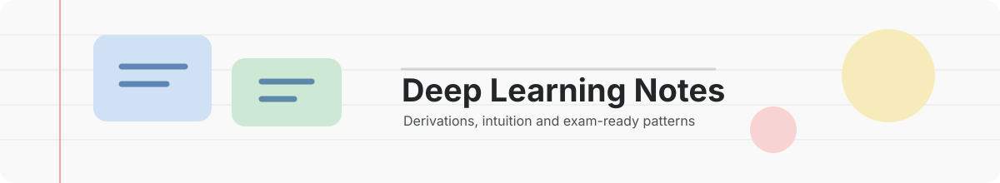

<div align="center">




**A static, fast, pastel-coloured home for markdown notes.**
No framework. No build step for the site itself.

[Highlights](#1-highlights) · [Quick start](#2-quick-start) · [Adding a note](#3-adding-a-note) · [Markdown features](#4-markdown-features) · [Structure](#5-project-structure) · [Hosting](#6-hosting) · [Shortcuts](#7-keyboard-shortcuts) · [Contributing](#8-contributing)

</div>

---

## 1. Highlights

Everything below is loaded lazily, only when a note actually needs it.

| Feature | Details |
| --- | --- |
| **Maths** | KaTeX + mhchem |
| **Diagrams** | Mermaid, styled with pastel borders |
| **Code** | Syntax highlighting via highlight.js |
| **Search** | Full-text, indexed off the main thread |
| **Reading tools** | Table of contents, live annotation, print-to-PDF |

---

## 2. Quick start

Browsers block `fetch()` on `file://`, so serve the folder over HTTP:

```bash
python3 -m http.server 8000
# then open http://localhost:8000
```

---

## 3. Adding a note

1. Create `content/my-note.md` and paste your markdown into it.
2. Run the manifest builder:
   ```bash
   node tools/build-manifest.mjs          # add --watch to rebuild on every save
   ```
3. Reload. The note appears as a card, is searchable, and opens when clicked.

> [!TIP]
> **No Node?** Open `content/manifest.json` and add the file name by hand, e.g. `["my-note.md"]`.
> The site then reads each file itself to build the cards.

### 3.1 Organising files

- Files or folders starting with `_` (and `README.md`) are skipped, which is handy for drafts.
- Sub-folders are fine: `content/week-2/gradients.md`.

### 3.2 Optional front matter

Place this at the top of the `.md` file. Every field is optional.

```yaml
---
title: Week 2 — Gradients
summary: One or two sentences for the card.
tags: [deep-learning, week-2]
color: green        # green | blue | red | yellow
order: 2            # lower comes first
updated: 2026-10-02 # shown as "Changed …"
---
```

| Field | Default when omitted |
| --- | --- |
| `title` | First `# heading` |
| `summary` | First paragraph |

---

## 4. Markdown features

### 4.1 Basics

- **GitHub-flavoured markdown:** tables, task lists, strikethrough, fenced code (any language highlight.js knows).
- **Images:** put them under `content/` and use relative paths.
- **Links between notes:** `[see this](other-note.md#some-heading)`.

### 4.2 Maths

| Syntax | Use |
| --- | --- |
| `$inline$`, `\( \)` | Inline maths |
| `$$display$$`, `\[ \]` | Display maths |
| `\begin{align} … \end{align}` | Also `equation`, `gather`, `aligned`, `split`, `CD` |
| `$\ce{H2O}$` | Chemistry (mhchem) |

- A `$$` block containing only `\newcommand`, `\DeclareMathOperator` or `\gdef` is treated as a **hidden preamble** and applies to the whole note.
- Site-wide macros live in `config.js`.
- KaTeX covers amsmath/amssymb-style maths, not arbitrary LaTeX packages or TikZ.
- Equation numbering restarts in each display block.

### 4.3 Diagrams

Use a ```` ```mermaid ```` fence. Supported: flowchart, sequence, class, state, ER, gantt, mindmap and more, drawn with thick pastel borders and bold labels.

Flowchart shapes pick a colour automatically:

| Shape | Colour |
| --- | --- |
| Rectangle | Blue |
| Rounded | Green |
| Decision | Yellow |
| Circle | Red |

To choose a colour yourself, use `A[Input]:::green` (`green`, `blue`, `yellow`, `red`). Subgraphs get dashed, tinted frames.

### 4.4 Callouts and chips

- **Callouts:** `> [!NOTE]`, `[!TIP]`, `[!WARNING]`, `[!CAUTION]`, `[!IMPORTANT]`, `[!EXAMPLE]`
- **Chips:** `**[Ex]**`, `**[!]**`, `**[Exam]**` … become small coloured labels (configured in `config.js`).

---

## 5. Project structure

```text
index.html                 page shell and icon sprite
config.js                  name, hero text, theme default, maths macros, chip colours
content/                   your notes + manifest.json (generated)
assets/
  css/style.css            all styling (light/dark tokens at the top)
  js/
    app.js                 router, library, reader, print
    render.js              markdown → HTML, lazy KaTeX / Mermaid / highlight.js
    search.js              search modal
    indexer.worker.js      indexing + matching (off main thread)
    annotate.js            highlights and notes
vendor/                    marked, KaTeX, Mermaid, highlight.js (self-hosted, MIT/BSD/Apache)
tools/build-manifest.mjs   manifest generator
```

---

## 6. Hosting

Any static host works. Navigation uses `#/…` URLs, so no rewrites are needed.
Commit `content/manifest.json` (re-run the build script after adding notes) so the host serves the current list.

### 6.1 GitHub Pages

Push this folder's contents to a repo, then go to **Settings → Pages → Deploy from a branch → main / (root)**.
A `.nojekyll` file is included.

### 6.2 Cloudflare Pages

Connect the repo (or use **Direct Upload** with the folder), then set:

- Framework preset: *None*
- Build command: *(empty)*
- Output directory: `/`

> [!NOTE]
> Annotations are stored per browser (localStorage). Use **Export / Import** in the *Notes* tab to move them.

---

## 7. Keyboard shortcuts

| Shortcut | Action |
| --- | --- |
| `/` or `Ctrl/⌘ K` | Open search |
| `Ctrl/⌘ P` | Print the open note |
| `Esc` | Close panels |

---

## 8. Contributing

Notes, corrections, worked examples and improvements are welcome.
Read the [contribution guide](contribute.md) for the note format, content standards, local preview steps and pull request checklist.