# AI: Search Methods for Problem Solving
## Week 1 — Foundations of AI

> Unified study notes.  
> Format: Markdown + LaTeX + Mermaid.  
> Keep adding Week 1 lectures to this file.

---

## Lecture 1 — Basics of AI and Classical AI

## 1. Intelligent Agents

An **intelligent agent** is an entity that exists in some world and interacts with that world.

The lecture describes an intelligent agent using four properties:

| Property | Meaning |
|---|---|
| **Persistent** | The agent continues to exist rather than being a one-shot computation. |
| **Autonomous** | It can operate and make decisions without every action being explicitly commanded by another agent. |
| **Proactive** | It can decide what to do next in pursuit of its objectives rather than merely reacting to every external event. |
| **Goal-directed** | Its actions are oriented toward achieving goals. |

A human being is an example of an intelligent agent.

A robot navigating a building can also be treated as an agent. A software system that observes a changing environment and chooses actions can also be treated as an agent.

### Agent and World

An agent sits inside and interacts with a world:

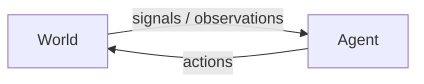

The world provides information to the agent. The agent processes that information and produces actions that affect the world.

---

## 2. The Agent Has a Model of the World

An intelligent agent in a world carries a **model of the world** in its "head".

The model does not need to be a perfect copy of reality. It can be an **abstraction** containing only the information relevant to the agent's task.

For example, a navigation system does not need to represent every physical object on a road. It may represent:

- locations
- roads
- distances
- traffic
- estimated travel time
- possible actions

A chess program similarly does not need to model the atoms of a chess piece. Its internal model can represent:

- board positions
- pieces
- legal moves
- game state

### Self-aware agents

A self-aware agent would also model **itself** within its world model.

Conceptually:

$$
\text{World Model}
=
\text{External World}
+
\text{Model of Self}
$$

---

## 3. Information Processing View of AI

The lecture presents an information-processing view of AI:

$$
\text{Signal}
\rightarrow
\text{Symbol}
\rightarrow
\text{Signal}
$$

Raw information is processed into a representation that can be reasoned about, and the result is eventually converted into an output.

The operational form is:

$$
\boxed{
\text{Sense}
\rightarrow
\text{Deliberate}
\rightarrow
\text{Act}
}
$$

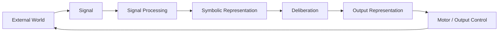

### Sense

The agent receives information from its environment.

Examples:

- camera image
- microphone signal
- temperature reading
- keyboard input
- text
- sensor measurements

This corresponds broadly to **signal processing**.

### Deliberate

The agent processes what it has sensed and determines what it should do.

The lecture places two important mechanisms here:

- neuro-fuzzy reasoning
- symbolic reasoning

### Act

The agent converts its decision into an output that affects the world.

Examples:

- move a robot arm
- turn left
- output text
- play a sound
- change a control signal

---

## 4. Signal → Symbol → Signal

A raw signal is generally not the most convenient representation for symbolic reasoning.

For example:

$$
\text{pixels}
\rightarrow
\text{visual processing}
\rightarrow
\text{"car"}
$$

The resulting representation might be:

$$
\text{Car}(x)
$$

Symbolic reasoning can then operate on that representation.

For example:

$$
\text{Car}(x) \land \text{Red}(x)
\Rightarrow
\text{RedCar}(x)
$$

The complete conceptual flow is:

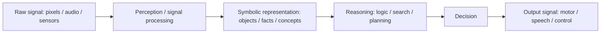

> [!NOTE]
> **Symbolic reasoning operates on representations, not directly on the raw physical world.** The quality of the representation therefore matters enormously.

---

## 5. What Is Classical AI?

A useful way to understand **classical AI** is:

$$
\boxed{
\text{Represent the World}
\rightarrow
\text{Reason About the Representation}
\rightarrow
\text{Search / Plan}
\rightarrow
\text{Act}
}
$$

Classical AI is strongly associated with:

- symbolic representations
- explicit knowledge
- logic
- deduction
- search
- planning
- constraints
- problem solving
- reasoning

It is also commonly described as **symbolic AI** or **GOFAI (Good Old-Fashioned AI)**.

The central idea is that intelligent behaviour can be studied as **computation over structured representations**.

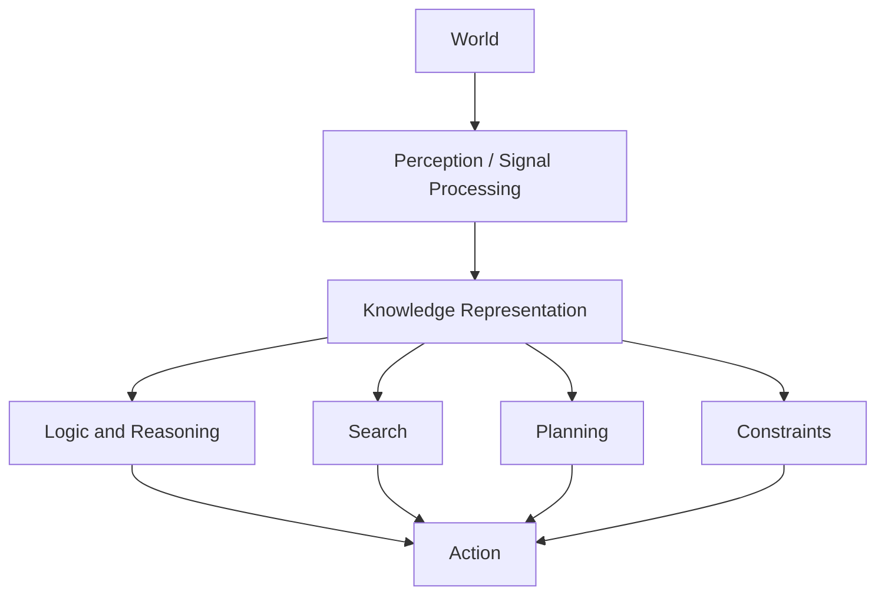

> [!NOTE]
> Classical AI does not simply mean "old AI". Search, planning, constraint solving, logic, knowledge representation, and symbolic reasoning remain important AI techniques.

---

## 6. Building Blocks of AI

The lecture presents AI as a collection of interacting capabilities.

| Capability | Main question |
|---|---|
| **Knowledge representation** | How should knowledge about the world be represented? |
| **Logic** | What conclusions follow from what we know? |
| **Reasoning** | How can an agent manipulate knowledge to reach conclusions? |
| **Search** | Which possible state or action should we explore? |
| **Problem solving** | How can we reach a desired state? |
| **Planning** | What sequence of actions can achieve a goal? |
| **Constraints** | Which possible solutions are allowed or forbidden? |
| **Machine learning** | How can a system learn patterns or models from experience? |
| **Deep neural networks** | How can complex patterns be learned from data? |
| **Computer vision** | How can visual information be interpreted? |
| **Natural language understanding** | How can language be interpreted? |
| **Speech recognition** | How can speech signals be converted into useful representations? |
| **Robotics** | How can an agent perceive and manipulate the physical world? |

AI is therefore not one algorithm. It is a collection of approaches to:

$$
\text{Perception}
+
\text{Representation}
+
\text{Learning}
+
\text{Reasoning}
+
\text{Search}
+
\text{Planning}
+
\text{Action}
$$

---

## 7. Symbolic Reasoning

A **symbol** is a representation that stands for something.

For example:

$$
\text{Dog}(\text{Rex})
$$

can represent the fact:

> Rex is a dog.

Suppose we know:

$$
\text{Dog}(\text{Rex})
$$

and:

$$
\forall x,\quad
\text{Dog}(x)
\Rightarrow
\text{Animal}(x)
$$

Then we can infer:

$$
\text{Animal}(\text{Rex})
$$

This is the basic flavour of symbolic reasoning:

$$
\boxed{
\text{Facts} + \text{Rules}
\rightarrow
\text{New Facts}
}
$$

```mermaid
flowchart LR
    F[Known fact: Dog(Rex)]
    R[Rule: Dog(x) -> Animal(x)]
    I[Inference]
    N[New fact: Animal(Rex)]

    F --> I
    R --> I
    I --> N
```

This becomes the foundation for many classical AI techniques.

---

## 8. Intelligence: Remember, Understand, Imagine

The lecture gives a useful three-part decomposition of intelligence.

## 8.1 Remember the Past

An intelligent system should be able to use previous experience.

Examples include:

- memory
- experience
- case-based reasoning
- machine learning
- pattern recognition
- deep neural networks

The basic idea is:

$$
\text{Past Experience}
\rightarrow
\text{Knowledge / Model}
$$

### Case-Based Reasoning

Instead of deriving every answer from first principles, the system can remember previous cases and reuse relevant experience.

The question becomes:

> "Have I encountered a similar problem before, and what worked then?"

---

## 8.2 Understand the Present

The agent needs a representation of what is happening now.

This involves:

- observing the environment
- constructing a model
- representing knowledge
- reasoning over that knowledge

The lecture associates this with:

$$
\boxed{
\text{Knowledge Representation}
+
\text{Logic and Reasoning}
}
$$

The agent asks:

> "Given what I currently know, what else follows?"

For example:

$$
\text{Rain}(\text{today})
$$

and

$$
\text{Rain}(x)
\rightarrow
\text{Wet}(\text{ground},x)
$$

therefore:

$$
\text{Wet}(\text{ground},\text{today})
$$

---

## 8.3 Imagine the Future

Intelligence also involves reasoning about possible future states.

The agent asks:

> "What should I do now if I want to achieve this goal?"

This is where **search** and **planning** become important.

For example:

$$
S_0
\xrightarrow{a_1}
S_1
\xrightarrow{a_2}
S_2
\xrightarrow{a_3}
G
$$

where:

- $S_0$ = current state
- $a_i$ = action
- $S_i$ = resulting state
- $G$ = goal

Search tries to find a useful sequence of actions.

Planning goes further by constructing a structured plan for achieving goals.

---

## 9. The Three Temporal Dimensions of Intelligence

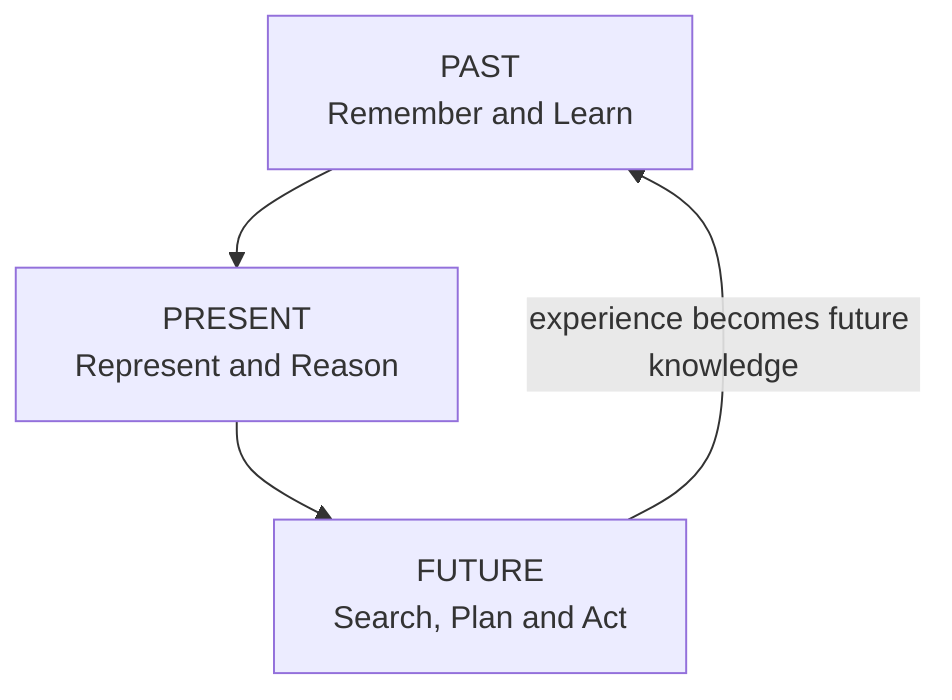

A useful conceptual summary is:

$$
\boxed{
\text{Intelligence}
\approx
\text{Memory}
+
\text{World Model}
+
\text{Reasoning}
+
\text{Goal-directed Action}
}
$$

This is a conceptual decomposition rather than a formal mathematical definition of intelligence.

---

## 10. Classical AI and Modern Data-Driven AI

A useful broader comparison is between symbolic/classical approaches and modern machine-learning approaches.

| Classical / Symbolic AI | Data-driven AI |
|---|---|
| Explicit representation | Learned representation |
| Rules can be written explicitly | Patterns are learned from examples |
| Logic and deduction | Statistical inference |
| Search and planning | Optimization / learned policies |
| Knowledge can be human-readable | Internal representations can be difficult to interpret |
| Often requires designing the representation | Representation can be learned from data |
| Strong at structured reasoning and constraints | Strong at perception and pattern recognition |

The distinction is not absolute.

Modern AI systems increasingly combine multiple approaches:

$$
\boxed{
\text{Neural Perception}
+
\text{Symbolic Reasoning}
+
\text{Search}
+
\text{Planning}
}
$$

---

## 11. Why Search Belongs to AI

Search fits naturally into the **"imagine the future / work toward your goals"** part of intelligence.

Suppose an agent is at state $S$.

There may be many possible actions:

$$
S
\rightarrow
\{S_1,S_2,S_3,\ldots,S_b\}
$$

Each successor may produce more successors.

This creates a **search space**.

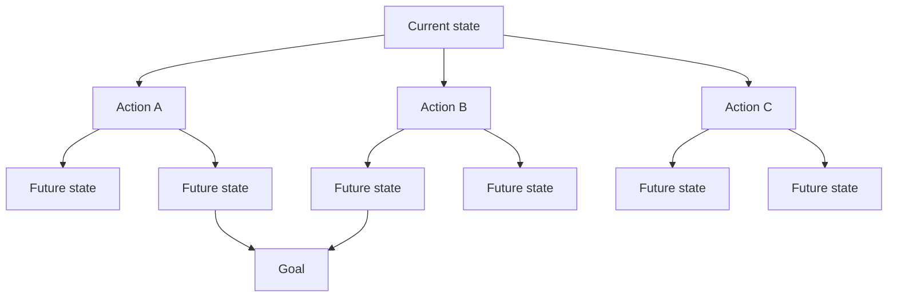

The search algorithm's fundamental question is:

$$
\boxed{
\text{Which possibility should I explore next?}
}
$$

This leads to:

- BFS
- DFS
- heuristic search
- hill climbing
- beam search
- A*
- game-tree search
- planning
- constraint search
- AO*
- and other algorithms

---

## 12. Representation Determines Search

A particularly important principle is:

> **Search quality depends heavily on how the problem is represented.**

Suppose a robot needs to reach a destination.

One representation might be:

$$
\text{State} = \text{current location}
$$

Another might be:

$$
\text{State}
=
(\text{location},\text{battery},\text{orientation},\text{cargo})
$$

These produce different state spaces and potentially different search problems.

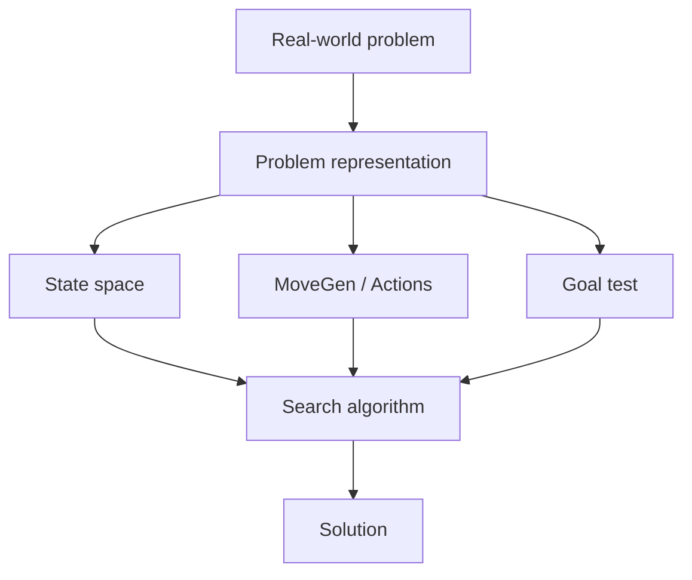

This gives a foundational chain:

$$
\boxed{
\text{Problem Formulation}
\rightarrow
\text{State Space}
\rightarrow
\text{Search}
}
$$

A poor representation can make an otherwise manageable problem computationally difficult.

A good representation can make the same problem much easier.

---

## 13. The Complete Classical-Agent Picture

The five lecture diagrams can be combined into one architecture:

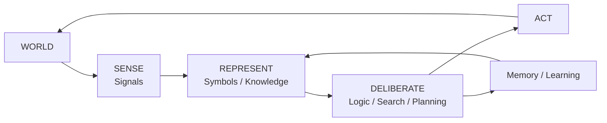

The course primarily studies what happens inside **Deliberate**:

$$
\boxed{
\text{Representation}
\rightarrow
\text{Reasoning}
\rightarrow
\text{Search}
\rightarrow
\text{Planning}
\rightarrow
\text{Action}
}
$$

---

## 14. Key Terminology

### Agent

An entity that perceives a world and takes actions in it.

### Environment / World

The external system in which the agent operates.

### Signal

Raw information arriving from or being sent to the environment.

### Symbol

A representation that stands for something.

### World Model

An internal representation of relevant aspects of the environment.

### Knowledge Representation

A formal way of representing knowledge so that a system can reason over it.

### Reasoning

Manipulating representations to derive conclusions or make decisions.

### Search

Systematically exploring possible states or solutions.

### Planning

Constructing actions or action sequences to achieve a goal.

### Classical AI

AI approaches strongly associated with explicit representations, symbolic reasoning, logic, search, planning, and structured problem solving.

---

## 15. Common Conceptual Traps

> [!TRAP]
> **AI is not the same thing as Machine Learning.**
>
> Machine learning is one approach within AI. AI also includes search, planning, logic, knowledge representation, constraint solving, expert systems, game playing, and other approaches.

> [!TRAP]
> **Classical AI does not simply mean "obsolete AI".**
>
> Classical methods such as search, planning, constraint solving, logic, and knowledge representation remain fundamental AI techniques.

> [!TRAP]
> **An agent does not need a perfect model of reality.**
>
> The model can be an abstraction containing only information relevant to its task.

> [!TRAP]
> **Reasoning operates on representations.**
>
> During symbolic reasoning, the system manipulates an internal representation rather than directly manipulating the physical world.

---

## 16. Quick Revision

- **Agent** = entity interacting with a world.
- The lecture characterizes intelligent agents as **persistent, autonomous, proactive, and goal-directed**.
- An agent maintains a **model of the world**.
- The model is an **abstraction**, not necessarily a complete copy of reality.
- Information processing can be viewed as:

$$
\text{Signal}
\rightarrow
\text{Symbol}
\rightarrow
\text{Signal}
$$

- Operationally:

$$
\text{Sense}
\rightarrow
\text{Deliberate}
\rightarrow
\text{Act}
$$

- **Signal processing** handles incoming information.
- **Symbolic reasoning** operates on structured representations.
- Classical AI emphasizes **knowledge representation, logic, reasoning, search, planning, and constraints**.
- Intelligence can be viewed as:
  - **Remember the past**
  - **Understand the present**
  - **Imagine the future**
- **Search** explores possible future states to reach a goal.
- **Representation is crucial** because it determines the resulting search space.

## Course Connection

The rest of the course progressively zooms into the **Deliberate** component:

$$
\text{State-space Search}
\rightarrow
\text{Heuristics}
\rightarrow
\text{A*}
\rightarrow
\text{Game Trees}
\rightarrow
\text{Planning}
\rightarrow
\text{Problem Decomposition}
\rightarrow
\text{Expert Systems}
\rightarrow
\text{Constraint Solving}
$$

---


---

## Lecture 2 — A Brief History of Machine Learning and Deep Learning

## 1. From Symbols to Learned Representations

Lecture 1 introduced the classical AI picture:

$$
\text{Signal}
\rightarrow
\text{Symbol}
\rightarrow
\text{Reasoning}
\rightarrow
\text{Action}
$$

Lecture 2 begins to shift attention toward **machine learning and deep neural networks**.

The central change is that instead of manually specifying every useful representation and rule, a learning system can be trained from examples.

A simplified contrast is:

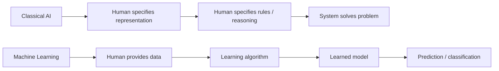

> [!NOTE]
> This is a conceptual contrast, not a claim that classical AI never learns or that modern ML contains no human-designed structure. In practice, the two traditions can be combined.

---

## 2. What Is a Symbol?

The lecture uses an important definition:

> A symbol is a **perceptible something that stands for something else**.

A symbol does not have intrinsic meaning by itself. Its meaning comes from the interpretation assigned to it.

For example:

$$
\texttt{TREE}
$$

can be used as a symbolic representation of a tree.

Likewise:

$$
\texttt{PERSON}
$$

can represent the concept of a person.

The important distinction is:

$$
\boxed{
\text{Physical / perceptual input}
\neq
\text{symbolic representation}
}
$$

A photograph contains pixels. A symbolic system might represent what those pixels depict using concepts such as:

$$
\{\text{tree},\text{grass},\text{sky}\}
$$

---

## 3. Deep Neural Networks and Perception

The lecture uses deep neural networks to illustrate a different route from raw data to symbols.

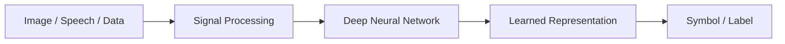

The important architectural intuition is that the **intermediate learned-processing layer becomes very large**, while the final symbolic/label space can be relatively small.

This is characteristic of modern deep learning systems:

$$
\text{High-dimensional input}
\rightarrow
\text{learned internal representation}
\rightarrow
\text{compact output}
$$

The network learns useful intermediate representations rather than requiring the engineer to manually specify every visual feature.

---

## 4. Image Classification

A basic deep-learning task is **classification**.

The system receives an image and produces one or more class labels.

For example:

$$
\text{Image}
\rightarrow
\{\text{horse},\text{sky},\text{tree}\}
$$

For face recognition, the output might instead be an identity label.

For medical imaging, the output could be a disease-related class.

The key computational mapping is:

$$
f_\theta(x) \rightarrow y
$$

where:

- $x$ = input image
- $\theta$ = learned parameters of the model
- $f_\theta$ = trained neural network
- $y$ = predicted class / label

The system learns the mapping from examples rather than receiving an explicit rule such as:

> "If these exact 37 pixels have these values, then the image contains a tree."

---

## 5. Image Labelling

The lecture's image-labelling example shows a photograph containing a:

- tree
- grass
- sky

The pipeline is conceptually:

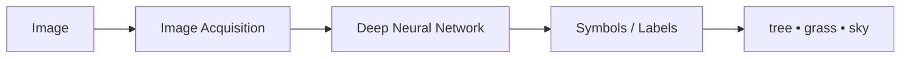

The important idea is that the network transforms a rich perceptual input into **symbolic labels**.

This connects directly back to the information-processing view from Lecture 1:

$$
\boxed{
\text{Signal}
\rightarrow
\text{Learned Processing}
\rightarrow
\text{Symbol}
}
$$

### Lecture slide


---

## 6. Medical Diagnosis as Classification

The lecture uses medical diagnosis as an important example of image classification.

A doctor may inspect:

- an X-ray / radiograph
- an ultrasound image
- an eye photograph
- other medical images

and assign a class such as:

$$
\text{Disease Present}
\quad\text{or}\quad
\text{Disease Absent}
$$

A neural network can be trained using a large dataset containing:

$$
(\text{Image},\text{Class Label})
$$

For example:

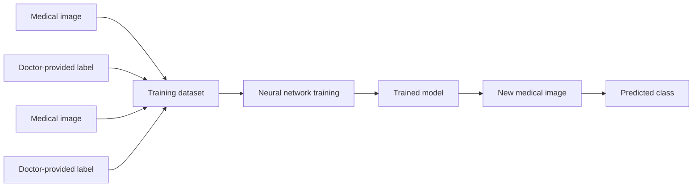

The important point from the lecture is that the network can assimilate patterns from **many labelled examples** rather than relying on the experience of a single doctor.

Training is not the same thing as a doctor looking at an image once and immediately producing an answer. Instead, a dataset is prepared and the network repeatedly processes the training examples to adjust its parameters.

---

## 7. Why This Is Powerful

Suppose hundreds or thousands of doctors have labelled images.

The resulting dataset can contain a large amount of accumulated professional experience.

Conceptually:

$$
\text{Many labelled cases}
\rightarrow
\text{Training}
\rightarrow
\text{Learned statistical model}
$$

The resulting model can then process a new image.

This is one reason deep learning has become important in medical image analysis.

> [!NOTE]
> The lecture uses medical diagnosis to demonstrate the power of learned classification. In real clinical settings, a model's output is not automatically equivalent to a complete medical diagnosis; validation, clinical context, uncertainty, and human oversight matter.

### Lecture example: rare disease diagnosis

The lecture presents the **Face2Gene** application as an example of using facial images to assist doctors in identifying rare diseases.

The cited slide describes an example where an image of a child is processed and possible diagnoses are suggested.


The lecture uses this example to emphasize the practical usefulness of deep neural networks for classification and diagnosis-related tasks.

---

## 8. The Important Question: "What Next?"

The lecture makes an important transition:

> A system may successfully **identify or label something**, but what happens next?

This distinction is central to the course.

Suppose a neural network says:

$$
\text{Image} \rightarrow \text{"frisbee"}
$$

That tells us what the classifier predicts.

It does not automatically mean that the system understands:

- what a frisbee is,
- how it behaves,
- why people throw it,
- whether it can be eaten,
- how far it can be thrown,
- what someone should do with it,
- what will happen next.

Thus:

$$
\boxed{
\text{Classification}
\neq
\text{Complete Understanding}
}
$$

This distinction becomes important when comparing **performance** with broader **competence**.

---

## 9. Machine Learning Produces Animal-like Abilities

The lecture makes a broader observation.

Machine learning has become very good at tasks such as:

- speech recognition
- image processing
- pattern recognition
- object recognition
- classification

Many of these are abilities that animals can perform naturally and extremely quickly.

Examples mentioned in the lecture include:

- eagles and snakes having highly capable visual systems
- cats having strong navigation abilities
- dogs recognizing and reacting to human speech
- African grey parrots being capable of mimicking human speech

The conceptual point is:

$$
\text{High performance on perception}
\not\Rightarrow
\text{Human-like general intelligence}
$$

---

## 10. Human Cognitive Abilities

The lecture distinguishes these perceptual abilities from the broader cognitive abilities commonly associated with humans.

It mentions abilities such as:

- planning
- pursuing long-term goals
- collective organization
- specialization of roles
- accumulation of knowledge and wealth across generations
- building institutions and societies
- creating and maintaining cultural artifacts

The lecture connects this discussion with the famous philosophical statement attributed to René Descartes:

> "I think, therefore I am."

The broader question is therefore not merely:

> "Can a machine recognize a pattern?"

but:

> "Can an intelligent agent reason, plan, pursue goals, and operate autonomously in a rich world?"

This connects directly back to Lecture 1's definition of an intelligent agent.

---

## 11. Performance vs Competence

This is one of the most important conceptual distinctions in Lecture 2.

A system can have **excellent performance on a narrowly defined task** without possessing the broader competence that humans associate with understanding.

Consider an image classifier that receives:

> A photograph of people playing frisbee in a park.

and correctly outputs:

$$
\text{People playing frisbee}
$$

A human who gives that answer probably possesses a large amount of background knowledge.

For example, a human can reason about:

- the approximate shape of a frisbee
- how a frisbee is thrown
- whether a frisbee can be eaten
- what a person is
- what a park is
- what outdoor environments are
- how people age
- how weather affects the scene

A classifier trained only to map:

$$
\text{image} \rightarrow \text{class label}
$$

does not automatically possess all of this background knowledge.

Therefore:

$$
\boxed{
\text{Task Performance}
\neq
\text{General Competence}
}
$$

> [!EXAMPLE]
> A calculator can perform arithmetic extremely accurately. That does not mean it possesses the broad mathematical understanding, physical intuition, or world knowledge of a human mathematician.

---

## 12. The Narrow Mapping Learned by a Classifier

A useful way to visualize the limitation is:

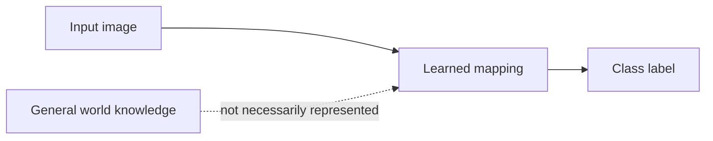

The model may learn:

$$
f_\theta(\text{image}) \rightarrow \text{label}
$$

without necessarily learning the complete conceptual network that a human associates with the label.

This is why a classifier can be highly accurate while still being brittle outside its intended distribution.

---

## 13. Minsky and the "Suitcase Word" Problem

The lecture attributes an important observation to **Marvin Minsky**.

Some words carry many different meanings and expectations inside them. The lecture calls these **"suitcase words"**.

"Learning" is one such word.

When people hear:

> "The machine learned to recognize faces."

they may unconsciously imagine that the machine learned in approximately the same broad sense in which a human learns.

But machine learning can refer to something much narrower:

$$
\text{Training data}
\rightarrow
\text{Parameter adjustment}
\rightarrow
\text{Task-specific model}
$$

Human learning is much broader and can involve:

- concepts
- language
- social interaction
- causal understanding
- physical intuition
- transfer between domains
- exploration
- goals
- accumulated experience

The lecture therefore warns against assuming that **machine learning = human learning**.

---

## 14. Brittleness and Task-specific Preparation

The lecture characterizes machine learning as potentially **brittle**.

A successful system often requires substantial preparation:

1. define the task
2. collect suitable data
3. label or otherwise prepare the data
4. design an appropriate model
5. train the model
6. evaluate it
7. deploy it

For a new problem, substantial changes may be necessary.

Conceptually:

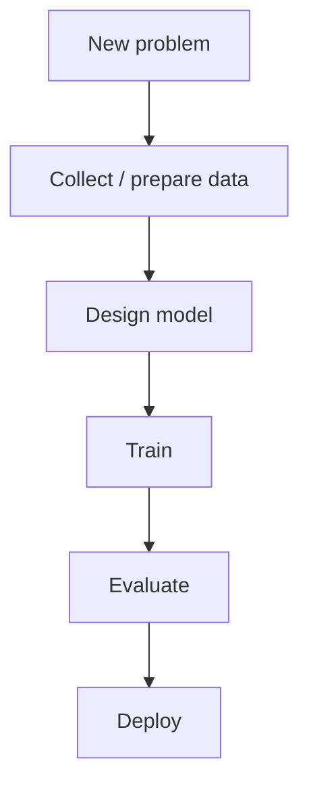

This is very different from the intuition that a human child can continuously learn from the environment and transfer knowledge across many unrelated tasks.

> [!TRAP]
> Do not interpret the lecture's criticism as "machine learning is useless." The point is that **task-specific success should not automatically be interpreted as human-like general learning or intelligence**.

---

## 15. Deep Learning and the Shift in Representation

There is an important architectural change visible in the lecture slides.

In the earlier symbolic picture, we can imagine:

$$
\text{Signal}
\rightarrow
\text{hand-designed processing}
\rightarrow
\text{symbol}
$$

With deep learning, much more of the intermediate transformation can be learned:

$$
\text{Signal}
\rightarrow
\boxed{\text{Learned representations}}
\rightarrow
\text{symbol / prediction}
$$

This is one of the central reasons deep neural networks became so influential.

The engineer does not necessarily have to explicitly specify every useful feature.

Instead, the network learns internal representations from data.

---

## 16. From Classification to Intelligent Action

This gives us a useful connection back to the previous lecture.

A classifier might perform:

$$
\text{Image}
\rightarrow
\text{Label}
$$

But an intelligent agent requires a larger loop:

$$
\boxed{
\text{Perceive}
\rightarrow
\text{Represent}
\rightarrow
\text{Reason}
\rightarrow
\text{Plan}
\rightarrow
\text{Act}
}
$$

For example:

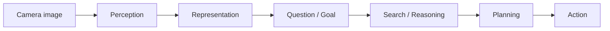

This is exactly where the rest of this course becomes relevant.

Deep learning can be extremely useful for **perception**.

The course asks us to understand the computational machinery for **reasoning, search, planning, and problem solving**.

---

## 17. AlphaGo: A Bridge Between Learning and Search

The lecture uses **Go** as an important example.

Go is played on a $19\times19$ board.

Therefore the number of possible moves and resulting game states becomes enormous.

This makes naive exhaustive search extremely difficult.

Chess had already demonstrated that computers could achieve very high performance through specialized search. IBM's **Deep Blue** defeated Garry Kasparov in a six-game match in 1997.

The lecture contrasts this with Go, where the enormous branching factor made the problem substantially more difficult for traditional brute-force search.

---

## 17.1 AlphaGo

In 2016, DeepMind's **AlphaGo** defeated professional Go player Lee Sedol.

The lecture presents this as a major demonstration of the power of **reinforcement learning** combined with neural-network methods and search.

Conceptually:

$$
\boxed{
\text{Learning}
+
\text{Game Search}
\rightarrow
\text{Strong Game-playing Agent}
}
$$

This is especially relevant to this course because it demonstrates that learning and search do not have to be opposing approaches.

They can be combined.

---

## 17.2 AlphaGo Zero

The lecture then mentions **AlphaGo Zero**, which was developed to learn without relying on human game data in the same way as the original AlphaGo approach.

The broad conceptual progression presented is:

$$
\text{AlphaGo}
\rightarrow
\text{AlphaGo Zero}
\rightarrow
\text{AlphaZero}
$$

AlphaZero extended the approach to multiple games.

The lecture highlights this as a major demonstration of reinforcement learning in games.

---

## 18. Learning + Search

This gives us an important bridge to the rest of the course:

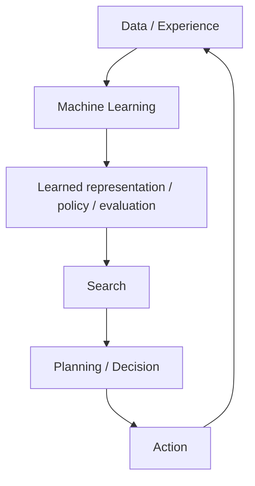

The important lesson is not that:

> "Machine learning replaced search."

Rather:

> **Learning and search can complement each other.**

A learned model can guide search.

Search can exploit a learned model to explore promising possibilities.

This idea becomes highly relevant when studying heuristic search and game-tree algorithms later in the course.

---

## 19. The Lecture's Conceptual Arc

Lecture 1 established:

$$
\text{Agent}
=
\text{Sense}
+
\text{Deliberate}
+
\text{Act}
$$

Lecture 2 adds an important distinction:

$$
\text{Perception / Classification}
\neq
\text{Full Intelligence}
$$

Deep learning is extremely powerful at learning mappings such as:

$$
\text{Input}
\rightarrow
\text{Prediction}
$$

But intelligent behaviour in the broader sense may require:

$$
\text{Input}
\rightarrow
\text{Representation}
\rightarrow
\text{World Model}
\rightarrow
\text{Reasoning}
\rightarrow
\text{Search}
\rightarrow
\text{Planning}
\rightarrow
\text{Action}
$$

That is the conceptual reason the course moves from AI foundations toward **search methods for problem solving**.

---

## 20. Important Distinctions

| Concept | Core idea |
|---|---|
| **Classification** | Map an input to a class or label |
| **Pattern recognition** | Detect useful regularities in data |
| **Machine learning** | Learn a mapping/model from experience or data |
| **Deep learning** | Learn complex representations using deep neural networks |
| **Symbolic reasoning** | Manipulate explicit representations using rules or logic |
| **Search** | Explore possible states or solutions |
| **Planning** | Construct actions toward a goal |
| **General competence** | Broad ability to transfer knowledge and act appropriately across situations |

---

## 21. Common Exam / Conceptual Traps

> [!TRAP]
> **A neural network that classifies an image does not necessarily understand the image in the human sense.**
>
> It may have learned a highly effective statistical mapping from images to labels.

> [!TRAP]
> **High accuracy on a task does not automatically imply general intelligence.**
>
> Always distinguish narrow task performance from broader competence.

> [!TRAP]
> **Machine learning is not synonymous with human learning.**
>
> The same word "learning" can refer to very different processes.

> [!TRAP]
> **Deep learning and classical AI are not mutually exclusive.**
>
> A system can use neural networks for perception and symbolic methods or search for reasoning and planning.

> [!TRAP]
> **Classification is not the end of an intelligent-agent pipeline.**
>
> A label may be an intermediate representation used by subsequent reasoning or planning.

---

## 22. Quick Revision

### Deep Neural Networks

Deep neural networks can learn useful representations from large amounts of data.

$$
\text{Input}
\rightarrow
\text{Learned representation}
\rightarrow
\text{Output}
$$

### Image Classification

$$
\text{Image}
\rightarrow
\text{Class label}
$$

### Image Labelling

$$
\text{Image}
\rightarrow
\{\text{tree},\text{grass},\text{sky},\ldots\}
$$

### Medical Image Analysis

$$
(\text{Image},\text{Label})
\rightarrow
\text{Training}
\rightarrow
\text{Trained model}
\rightarrow
\text{New image}
\rightarrow
\text{Prediction}
$$

### Core Limitation

$$
\boxed{
\text{Narrow Performance}
\neq
\text{General Competence}
}
$$

### Minsky's point

"Learning" is a broad suitcase word. Machine learning should not automatically be interpreted as human-like learning.

### AlphaGo

AlphaGo demonstrates a powerful combination of:

$$
\boxed{
\text{Machine Learning}
+
\text{Search}
+
\text{Reinforcement Learning}
}
$$

### Course connection

The key question becomes:

> **Once an AI system has perceived and represented something, how can it reason about what to do next?**

That question leads directly into **search and problem solving**.

---

## Lecture 2 Visual References

The following figures were supplied with the lecture material and are preserved as local image assets.

1. Deep neural networks and the signal → symbol transition.
2. Classification / face recognition.
3. Machine learning for rare-disease diagnosis.
4. Image labelling using a deep neural network.


---

## Lecture 3 — Human Cognition, Representation, Reasoning, and AI vs Automation

## 1. Human Cognitive Architecture

The lecture returns to the question:

> **What does human cognition involve, and what should an intelligent agent be able to do?**

The slide places several capabilities inside a broader cognitive architecture:

- logic
- knowledge representation
- ontology
- semantics
- natural language understanding
- memory
- search
- problem solving
- planning
- models

These are associated with **symbolic reasoning** and higher-level cognition.

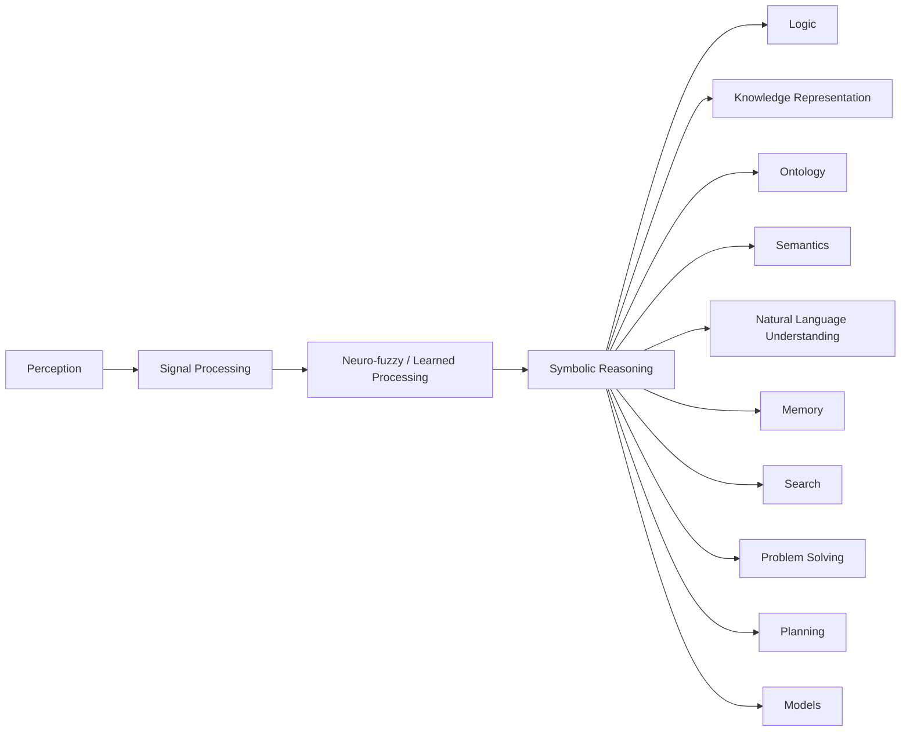

The important conceptual point is that **perception is only one part of intelligence**. An agent must also be able to represent what it knows and reason with that representation.


---

## 2. AI and Machine Learning

The lecture distinguishes **AI** and **Machine Learning** while emphasizing that ML is part of AI.

A useful conceptual distinction from the lecture is:

| Artificial Intelligence | Machine Learning |
|---|---|
| Broad field concerned with intelligent behaviour | A major approach/component within AI |
| Symbolic knowledge representation | Making sense of data |
| Logic and reasoning | Learning patterns from data |
| Problem solving | Classification |
| Search | Prediction |
| Planning | Pattern recognition |
| Models and semantics | Deep learning |

Machine learning is therefore **not synonymous with AI**.

$$
\boxed{
\text{Machine Learning} \subset \text{Artificial Intelligence}
}
$$

The boundary is not absolute in practice, but this is the useful conceptual relationship presented in the lecture.

---

## 3. The Core of Human Cognitive Ability: Model the World

A central statement of the lecture is:

> **The core of human cognitive abilities is the ability to model the world and reason with it.**

In AI terminology, "model the world" is closely related to **knowledge representation**.

The agent has some explicit knowledge:

$$
K = \{f_1,f_2,\ldots,f_n\}
$$

and reasoning asks:

$$
K \vdash q
$$

meaning:

> Does the knowledge base $K$ support the conclusion $q$?

The basic cognitive loop is therefore:

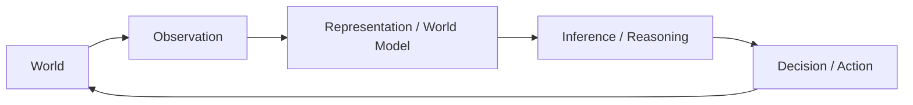

---

## 4. Declarative Knowledge

The lecture makes an important distinction between different kinds of knowledge.

The knowledge relevant to explicit knowledge representation here is primarily **declarative knowledge**.

### Declarative knowledge

Knowledge about **what is the case**.

It can be thought of as a collection of statements or sentences.

Examples:

$$
\text{Paris is in France}
$$

$$
\text{Socrates is a man}
$$

$$
\text{All men are mortal}
$$

### Procedural knowledge

Knowledge about **how to perform something**.

Examples:

- how to ride a bicycle
- how to tie shoelaces
- how to perform a particular procedure

### Tacit knowledge

Knowledge that is difficult to explicitly articulate or formalize.

The lecture's main point is that when discussing **knowledge representation**, the focus is on **explicit, declarative knowledge** rather than every kind of knowledge humans possess.

---

## 5. Inference: What Else Does the Agent Know?

Having a knowledge repository is not enough.

An intelligent system should also be able to determine:

> **What follows from what I already know?**

This is **inference**.

There are different kinds of inference.

## Deductive inference

If the premises are true and the reasoning is valid, the conclusion necessarily follows.

Example:

$$
\text{All humans are mortal}
$$

$$
\text{Socrates is human}
$$

Therefore:

$$
\boxed{\text{Socrates is mortal}}
$$

Formally:

$$
\forall x\;(\text{Human}(x)\rightarrow\text{Mortal}(x))
$$

$$
\text{Human}(\text{Socrates})
$$

therefore:

$$
\text{Mortal}(\text{Socrates})
$$

## Plausible / probabilistic inference

The conclusion is supported as likely rather than guaranteed.

Example:

> The sky is covered with dark clouds.

Therefore:

> It is likely to rain.

Conceptually:

$$
P(\text{Rain}\mid\text{Dark Clouds}) > P(\text{Rain})
$$

but:

$$
\text{Dark Clouds}\not\Rightarrow\text{Rain}
$$

in the strict deductive sense.

> [!NOTE]
> This distinction becomes important later when comparing **logic-based reasoning** with reasoning under **uncertainty**.

---

## 6. Symbols and Representation

A **symbol** is something that stands for something else.

The same concept can have many different symbolic representations.

For example, the concept **seven** can be represented as:

$$
7
$$

$$
\text{seven}
$$

$$
VII
$$

or in another formal notation.

These are different representations of the same underlying concept.

This illustrates:

$$
\boxed{
\text{Representation} \neq \text{Concept itself}
}
$$

The representation is a way of referring to the concept.

---

## 7. Symbols Are Socially Interpreted

The lecture emphasizes that a symbol has no intrinsic meaning simply because of its physical form.

Its meaning is associated with a convention or interpretation shared by a community.

Examples include:

- road signs
- written words
- numerals
- mathematical notation
- spoken language

Thus:

$$
\boxed{
\text{Symbol}
+
\text{Shared interpretation}
\rightarrow
\text{Meaning}
}
$$

This connects to **semiotics**, the study of signs and symbols.

Natural languages, both spoken and written, can be understood as semiotic systems.

---

## 8. From Symbols to Complex Behaviour

The lecture briefly connects symbolic communication to biological systems.

Simple entities can interact through signals and produce complex collective behaviour.

A classic example is an ant colony.

Ants can leave **pheromone trails** that other ants detect and follow.

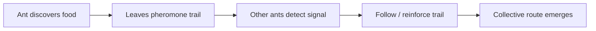

This becomes relevant later to **Ant Colony Optimization**, where pheromone-inspired mechanisms are used computationally.

The broader idea is:

$$
\boxed{
\text{Simple local interactions}
\rightarrow
\text{Emergent collective behaviour}
}
$$

---

## 9. What Is Reasoning?

The lecture defines reasoning in terms of **formal manipulation of symbols in a meaningful manner**.

For example, arithmetic algorithms manipulate symbolic representations:

$$
3974\times29
$$

A person may know the procedure for multiplication without consciously representing all the mathematical structure behind every step.

For example, the $2$ in $29$ is not merely the quantity two in the multiplication algorithm; in that position it represents:

$$
2\times10 = 20
$$

The procedure works because the symbols have structure and rules governing their manipulation.

This illustrates an important distinction:

$$
\boxed{
\text{Following a procedure}
\neq
\text{Understanding all of the underlying representation}
}
$$

The lecture notes that the gap becomes even more interesting for operations such as:

- Fourier transforms
- image convolution
- other mathematical and computational transformations

---

## 10. AI ≠ Automation

The lecture explicitly addresses the common confusion:

> **AI = Automation?**

The answer is **not exactly**.

There is substantial overlap, but the concepts are different.

### Automation

Automation means using a system to perform a task with reduced or no direct human intervention.

Examples include:

- ATMs
- train reservation systems
- online shopping systems
- vending machines
- some industrial machines

These systems do not necessarily require AI.

### AI

AI concerns capabilities such as:

- representation
- reasoning
- learning
- pattern recognition
- planning
- search
- natural language
- problem solving

Some automated systems use AI as one of their components.

```mermaid
flowchart TD
    AUTO[Automation]
    AI[Artificial Intelligence]
    ML[Machine Learning]
    DS[Data Science]

    ML --> AI
    AI --> AUTO

    AI --- OVERLAP1[Pattern recognition]
    AI --- OVERLAP2[Planning / reasoning]
    ML --- OVERLAP3[Prediction]
    DS --- OVERLAP4[Data analysis]
```

A more accurate mental model is **overlapping fields and capabilities**, not a single hierarchy in which every automated system is AI.


---

## 11. AI + Automation: Self-Driving Cars

Self-driving cars illustrate the overlap.

A self-driving system needs automation because it performs driving actions without continuous human control.

But it may also use AI techniques for:

- pattern recognition
- object detection
- classification
- speech processing
- perception
- planning

Conceptually:

$$
\text{AI capabilities}
\rightarrow
\text{Perception / Decision}
\rightarrow
\text{Automated driving}
$$

Therefore:

$$
\boxed{
\text{AI can enable automation, but automation does not imply AI}
}
$$

---

## 12. Where Does Data Science Fit?

The lecture also places **Data Science** in relation to AI and ML.

Data Science commonly involves:

- collecting data
- cleaning data
- statistical analysis
- visualization
- prediction
- extracting useful information from data

Machine learning can be one component of a data-science workflow.

Likewise, machine learning can be used inside AI systems.

Therefore these terms should not be treated as interchangeable:

$$
\boxed{
\text{AI}
\neq
\text{ML}
\neq
\text{Data Science}
\neq
\text{Automation}
}
$$

They overlap substantially.

A useful conceptual picture is:

```mermaid
flowchart LR
    AI[Artificial Intelligence]
    ML[Machine Learning]
    DS[Data Science]
    AUTO[Automation]

    ML --> AI
    ML --- DS
    AI --- AUTO

    AI1[Logic / representation / reasoning]
    AI2[Search / planning]
    AI3[Natural language]
    ML1[Prediction / classification]
    DS1[Statistics / data analysis]
    AUTO1[Rule-based workflows / systems]

    AI --- AI1
    AI --- AI2
    AI --- AI3
    ML --- ML1
    DS --- DS1
    AUTO --- AUTO1
```

The diagram is conceptual: the fields overlap rather than having perfectly sharp boundaries.

---

## 13. The Important Cognitive Architecture

The three lectures now fit together into a single picture:

```mermaid
flowchart TB
    W[World]
    P[Perception]
    LP[Learned / Signal Processing]
    REP[Representation / World Model]
    MEM[Memory]
    REA[Reasoning]
    SEA[Search]
    PLA[Planning]
    ACT[Action]

    W --> P
    P --> LP
    LP --> REP

    REP <--> MEM
    REP --> REA
    REA --> SEA
    SEA --> PLA
    PLA --> ACT
    ACT --> W
```

The key lesson is that **deep learning can be extremely effective at perception and learned representation**, while classical AI provides important machinery for:

- explicit knowledge representation
- logic
- inference
- search
- problem solving
- planning

This is one reason modern AI can combine neural and symbolic approaches.

---

## 14. Week 1 Conceptual Map

The first three lectures can be summarized as:

$$
\boxed{
\text{World}
\rightarrow
\text{Perception}
\rightarrow
\text{Representation}
\rightarrow
\text{Reasoning}
\rightarrow
\text{Search / Planning}
\rightarrow
\text{Action}
}
$$

with learning contributing to the perception and representation stages:

$$
\boxed{
\text{Data}
\rightarrow
\text{Machine Learning}
\rightarrow
\text{Learned Representation}
}
$$

while symbolic AI contributes strongly to explicit reasoning:

$$
\boxed{
\text{Knowledge}
\rightarrow
\text{Symbols}
\rightarrow
\text{Inference}
\rightarrow
\text{Decision}
}
$$

The course is now positioned to study the **search/problem-solving** part in detail.

---

## Lecture 3 — Key Takeaways

- Human cognition involves more than perception; it includes **models, memory, knowledge representation, logic, reasoning, search, planning, and problem solving**.
- A central cognitive capability is **modelling the world and reasoning with that model**.
- **Declarative knowledge** describes what is known; procedural knowledge describes how to perform something.
- **Inference** determines what follows from existing knowledge.
- **Deductive inference** gives necessary conclusions when valid premises and rules apply.
- **Plausible/probabilistic inference** supports conclusions that are likely rather than logically necessary.
- A **symbol** stands for something else; its meaning is associated with interpretation and convention.
- **Semiotics** studies signs and symbols.
- Simple interacting systems can produce complex behaviour; ant pheromone trails provide a biological example relevant to **Ant Colony Optimization**.
- **Reasoning** can be viewed as formal manipulation of symbols.
- **AI and automation are not synonymous**.
- Automation can exist without AI.
- AI techniques can be used to make automation more capable, such as in autonomous driving.
- **Machine Learning is a component/approach within AI**, while Data Science overlaps with ML and statistics.
- The broader distinction is:

$$
\boxed{
\text{AI} \neq \text{ML} \neq \text{Data Science} \neq \text{Automation}
}
$$

even though substantial overlap exists.

> [!NOTE]
> **Course connection:** Search is one part of the larger intelligent-agent architecture. The next topics can therefore be understood as progressively answering: **given a world model, a goal, and possible actions, how should an agent reason about what to do?**


---

## Lecture 4 — What Is Intelligence? Turing, ELIZA, and Winograd Schemas

Lecture 4 shifts from **what AI systems do** to a more fundamental question:

> **What should count as intelligence in a machine?**

This introduces the philosophical foundations of AI and several historical attempts to operationalize machine intelligence.

---

## 1. Definitions of Artificial Intelligence

The lecture presents several complementary definitions rather than one universally accepted definition.

### Herbert Simon — intelligence as behaviour

> We call programs intelligent if they exhibit behaviors that would be regarded as intelligent if they were exhibited by human beings.

The important idea is **observable behaviour**.

A program is treated as intelligent when its behaviour resembles behaviour that we would call intelligent in a human.

This gives a useful distinction:

$$
\boxed{\text{Evaluate the behaviour} \quad \text{rather than assuming what is inside the machine}}
$$

### Barr and Feigenbaum — AI as information processing

The lecture frames AI as asking:

> What kind of information-processing system can ask questions about the universe and life?

This connects AI to the broader idea that intelligent behaviour can be studied as **information processing**.

### Elaine Rich — problem-solving view

The lecture gives another classic definition:

> AI is the study of techniques for solving exponentially hard problems in polynomial time by exploiting knowledge about the problem domain.

The important technical idea is **knowledge as leverage**.

Some problems have enormous search spaces. Domain knowledge can help an AI system avoid exploring every possibility.

Conceptually:

$$
\text{Huge search space}
+
\text{domain knowledge}
\rightarrow
\text{more efficient problem solving}
$$

This connects directly to the later study of **heuristics and informed search**.


---

## 2. What Is Intelligence?

The lecture deliberately does not settle the question immediately.

Instead, it asks a sequence of foundational questions:

- What is **intelligence**?
- What is **thinking**?
- What is a **machine**?
- Is a computer a machine?
- Can a machine **think**?
- If machines can think, are humans themselves machines in some meaningful sense?

These questions expose an important difficulty:

$$
\boxed{\text{Before testing machine intelligence, we need some notion of intelligence.}}
$$


---

## 3. Two Views of Machine Intelligence

A major philosophical distinction appears in the lecture.

### Behavioural view

The question is essentially:

> Does the machine behave intelligently?

The internal mechanism does not have to be identical to a human brain.

### Stronger "mind" view

A stronger position asks whether the machine actually has a **mind** or genuinely thinks rather than merely producing convincing behaviour.

John Haugeland's formulation in *AI: The Very Idea* is used to express this stronger ambition: AI should seek genuine artificial minds rather than merely producing a clever imitation.

This produces two different questions:

$$
\text{Can a machine behave intelligently?}
$$

versus

$$
\text{Does a machine genuinely think / have a mind?}
$$

These should not be treated as identical questions.


---

## 4. Alan Turing and the Imitation Game

## 4.1 Why Turing changed the question

Alan Turing (1912–1954) considered the question:

> **Can machines think?**

The lecture notes that Turing regarded the question itself as too ambiguous or meaningless to be directly useful.

Instead, he proposed a test based on **imitation**.

This became known as the **Turing Test**, originally presented as the **Imitation Game** in Turing's 1950 paper:

> *Computing Machinery and Intelligence*.

The core shift is:

$$
\boxed{
\text{"Can it think?"}
\quad\longrightarrow\quad
\text{"Can its behaviour be distinguished from a human's?"}
}
$$


---

## 4.2 Basic Turing Test structure

A human **judge** communicates with another participant through a communication channel.

The judge must determine whether the participant is:

- a human, or
- a machine.

The judge does not directly inspect the participant.

```mermaid
flowchart LR
    J[Human Judge]
    H[Human]
    M[Machine]

    J <-->|Text-based interaction| H
    J <-->|Text-based interaction| M

    J --> D[Decision: human or machine?]
```

The test therefore focuses on **indistinguishability of conversational behaviour**, rather than inspecting the machine's internal architecture.

---

## 4.3 What the Turing Test actually measures

A useful way to remember it:

$$
\boxed{
\text{Turing Test}
\approx
\text{behavioural indistinguishability in conversation}
}
$$

It does **not**, by itself, directly establish that a machine possesses consciousness, subjective experience, or a human-like internal mind.

This is the central philosophical distinction:

$$
\text{Convincing behaviour}
\neq
\text{proof of human-like internal cognition}
$$

The test is therefore best understood as an **operational behavioural criterion** for machine intelligence.

---

## 5. ELIZA — An Early Conversational Program

**ELIZA** was a natural-language-processing program written at MIT by **Joseph Weizenbaum around 1966**.

The lecture presents it as an important historical example because ELIZA could produce surprisingly convincing conversational behaviour despite using relatively simple mechanisms.

A popular version, **DOCTOR**, used scripts designed to imitate the style of a Rogerian psychotherapist.

The basic mechanism was approximately:

```mermaid
flowchart LR
    U[User input]
    P[Pattern matching / simple rules]
    T[Transform selected parts of input]
    R[Generate scripted response]

    U --> P --> T --> R
```

The crucial lesson is that a system can produce apparently meaningful conversation using relatively shallow mechanisms.

### Example pattern

User:

> I'm feeling a bit tired.

System:

> Why do you think you're feeling a bit tired?

User:

> I've been traveling a lot, and away from home.

System:

> Tell me about your family.

The responses can feel psychologically meaningful to a person even when the underlying mechanism is primarily **pattern matching and scripted transformation**.


---

## 5.1 The ELIZA effect

The lecture emphasizes that people can attribute considerably more understanding to a conversational program than the underlying mechanism warrants.

This is often discussed as the **ELIZA effect**:

$$
\boxed{
\text{Human interpretation of behaviour}
>
\text{actual sophistication of the underlying mechanism}
}
$$

This is highly relevant when evaluating conversational AI.

A convincing response should not automatically be interpreted as evidence that the system possesses the same kind of understanding as a human.

Weizenbaum was sufficiently concerned about this phenomenon that he wrote *Computer Power and Human Reason: From Judgment to Calculation*, emphasizing limitations of computer systems and the human tendency to attribute understanding to them.

---

## 6. The Loebner Prize and Practical Turing Tests

The lecture gives the **2013 Loebner Prize** as a historical example of attempts to apply the Turing-test idea in practice.

The slide shows excerpts from the dialogue of **IZAR**, the 2013 leader.

The transcript illustrates several conversational techniques:

- changing the direction of the conversation
- asking the judge questions
- producing apparently personal preferences
- using humour or conversational ambiguity
- maintaining a conversational persona

The important point is not whether the transcript proves genuine understanding.

Rather, it illustrates how a system can attempt to produce **human-like conversational behaviour**.

The slide also connects this historical discussion to modern conversational systems such as:

- Alexa
- chatbots
- GPT-3 (as named in the original lecture material)


---

## 7. Why Simple Conversation Tests Can Be Weak

A conversational system may sometimes appear intelligent because ordinary conversation contains a large amount of ambiguity, social convention, and tolerance for mistakes.

A system can sometimes avoid directly answering questions, redirect the conversation, or exploit patterns in language.

Therefore, a stronger evaluation should ideally contain questions where **surface-level linguistic statistics are insufficient**.

This motivates the **Winograd Schema Challenge**.

---

## 8. Winograd Schemas — An Alternative to the Turing Test

A **Winograd Schema** is designed to test whether a system can use contextual knowledge to resolve an ambiguous statement.

The lecture describes it as a **pointed multiple-choice question requiring knowledge of the subject matter**.

The intended difficulty is that the alternatives are constructed so that simple statistical word associations are not enough.

The machine must determine what is actually happening in the described situation.

### Core idea

$$
\boxed{
\text{Language understanding}
+
\text{world knowledge}
+
\text{contextual reasoning}
}
$$

The lecture describes this as helping make the test more **Google-proof**: simply having access to a huge corpus of English text should not trivially solve the problem.

The deeper claim is:

> Doing better than guessing requires figuring out what is going on in the situation.


---

## 9. Winograd Schema Structure

A Winograd Schema Challenge question contains three main components.

### Part 1 — The sentence / short discourse

It contains:

1. **Two noun phrases** belonging to the same semantic class.
2. An **ambiguous pronoun** that could refer to either noun phrase.
3. A **special word** and an alternative word such that changing the word changes the natural pronoun resolution.

### Part 2 — The question

The question asks which noun phrase the ambiguous pronoun refers to.

### Part 3 — Two choices

The two noun phrases become the two answer choices.

Thus the task can be standardized as a binary decision:

$$
\boxed{\text{Answer} \in \{0,1\}}
$$

```mermaid
flowchart TD
    S[Sentence with two candidate entities]
    P[Ambiguous pronoun]
    W[Special word / contrast word]
    Q[Question: what does the pronoun refer to?]
    A[Two answer choices]

    S --> P
    S --> W
    P --> Q
    W --> Q
    Q --> A
```


---

## 10. Why the Word Change Matters

The defining trick is that changing one carefully chosen word should change the natural interpretation of the pronoun.

This means the system cannot simply memorize:

$$
\text{word frequency} \rightarrow \text{pronoun answer}
$$

Instead, it needs to understand the **relationship described by the sentence**.

This is the conceptual purpose of a Winograd Schema:

$$
\boxed{
\text{Same surface structure}
+
\text{small semantic change}
\rightarrow
\text{different correct answer}
}
$$

---

## 11. Winograd Example 1 — "Feared" vs "Advocated"

Consider:

> The city councilmen refused the demonstrators a permit because **they feared** violence.

versus:

> The city councilmen refused the demonstrators a permit because **they advocated** violence.

Question:

> Who does "they" refer to?

Choices:

1. The demonstrators
2. The councilmen

The word **feared** makes the councilmen the natural referent: the councilmen refused the permit because the councilmen feared violence from the demonstrators.

Changing the verb to **advocated** changes the natural interpretation: the councilmen refused the permit because the demonstrators advocated violence.

The important point is not merely grammatical agreement. Both candidate noun phrases can grammatically fit the pronoun.

The answer depends on **semantic knowledge and causal plausibility**.


---

## 12. Winograd Example 2 — "Lighter" vs "Handy"

Consider:

> John took the water bottle out of the backpack so that **it would be lighter**.

versus:

> John took the water bottle out of the backpack so that **it would be handy**.

Question:

> What does "it" refer to?

Choices:

1. The backpack
2. The bottle

The intended resolution changes with the adjective:

- **lighter** → the backpack becomes lighter when the bottle is removed.
- **handy** → the bottle is now easier/more convenient to have available.

Again, grammatical structure alone does not determine the answer. The system needs to understand the **effect of the action** and the meaning of the adjective.


---

## 13. Winograd Example 3 — "Small" vs "Big"

Consider:

> The trophy would not fit in the brown suitcase because **it was too small**.

versus:

> The trophy would not fit in the brown suitcase because **it was too big**.

Question:

> What does "it" refer to?

Choices:

1. The trophy
2. The suitcase

The interpretation changes because of the physical relationship implied by the adjective:

- **too small** → the suitcase is too small for the trophy.
- **too big** → the trophy is too big for the suitcase.

This requires a model of **physical size and containment**.


---

## 14. Winograd Example 4 — "Repeat" vs "Answer"

Consider:

> The lawyer asked the witness a question, but **he was reluctant to repeat it**.

versus:

> The lawyer asked the witness a question, but **he was reluctant to answer it**.

Question:

> Who was reluctant?

Choices:

1. The lawyer
2. The witness

The interpretation depends on the verb:

- **reluctant to repeat it** → naturally the lawyer is reluctant to repeat the question.
- **reluctant to answer it** → naturally the witness is reluctant to answer the question.

The system must understand the roles associated with the actions **ask**, **repeat**, and **answer**.


---

## 15. What Winograd Schemas Are Trying to Measure

The examples reveal several kinds of knowledge that are difficult to reduce to surface-level word matching.

| Example | Knowledge needed |
|---|---|
| councilmen / demonstrators | social roles + causal interpretation |
| bottle / backpack | physical consequences of removing an object |
| trophy / suitcase | size and containment relationships |
| lawyer / witness | roles and typical actions in a conversation |

The common pattern is:

$$
\text{Words}
\rightarrow
\text{Situation model}
\rightarrow
\text{Reason about situation}
\rightarrow
\text{Answer}
$$

This connects directly to Lecture 3's central idea:

$$
\boxed{\text{Intelligence requires modelling the world and reasoning with the model.}}
$$

---

## 16. Turing Test vs Winograd Schema

These two approaches ask related but different questions.

| Aspect | Turing Test | Winograd Schema |
|---|---|---|
| Main target | Human-like conversational behaviour | Contextual reasoning / knowledge |
| Format | Open-ended interaction | Pointed multiple-choice question |
| Main challenge | Sustain convincing conversation | Resolve an intentionally ambiguous statement |
| Possible weakness | Surface conversational tricks may help | Narrow benchmark; tests a particular capability |
| Key capability emphasized | Behavioural indistinguishability | Situation understanding and commonsense reasoning |

The important conceptual progression is:

$$
\text{Imitation}
\rightarrow
\text{Targeted reasoning evaluation}
$$

Neither test should automatically be interpreted as a complete definition of intelligence.

---

## 17. The Deeper AI Question

Lecture 4 brings together the themes of the first four lectures.

### Perception

A system can recognize patterns:

$$
\text{Image} \rightarrow \text{Label}
$$

### Representation

A system can represent objects and concepts:

$$
\text{World} \rightarrow \text{Symbols / Knowledge}
$$

### Reasoning

A system can derive consequences:

$$
\text{Knowledge} \rightarrow \text{Inference}
$$

### Search and planning

A system can explore possible actions:

$$
\text{State} + \text{Goal}
\rightarrow
\text{Search}
\rightarrow
\text{Plan}
$$

### Intelligence

The deeper question is whether these components can be integrated into an agent that behaves intelligently across situations.

```mermaid
flowchart LR
    P[Perception]
    R[Representation]
    I[Inference]
    S[Search]
    PL[Planning]
    A[Action]
    E[Environment]

    E --> P
    P --> R
    R --> I
    I --> S
    S --> PL
    PL --> A
    A --> E
```

---

## 18. Key Takeaways — Lecture 4

- There is **no single definition of AI**; the lecture presents behavioural, information-processing, and problem-solving perspectives.
- **Intelligence can be studied through observable behaviour**, but behaviour alone does not settle questions about internal thought or mind.
- The stronger philosophical question is whether machines can possess **genuine minds**, not merely imitate intelligent behaviour.
- Turing reframed the vague question **"Can machines think?"** as a practical **Imitation Game / Turing Test**.
- The Turing Test evaluates whether a machine can produce behaviour sufficiently human-like to fool a human judge in the test setting.
- **ELIZA** demonstrates that simple pattern-based mechanisms can produce surprisingly convincing conversation.
- The **ELIZA effect** illustrates how humans may attribute understanding or intelligence to a system based on its conversational behaviour.
- The **Loebner Prize** provides a historical example of practical attempts to evaluate conversational machines using the Turing-test idea.
- **Winograd Schemas** attempt to probe contextual reasoning using carefully constructed ambiguous sentences.
- A Winograd problem typically contains two candidate referents, an ambiguous pronoun, a contrastive word, and two possible answers.
- The crucial word change alters the correct interpretation, forcing the system to use **semantic and commonsense knowledge** rather than simple word frequency.
- Winograd examples illustrate reasoning about **social roles, physical consequences, size, containment, and action relationships**.
- The broader theme is:

$$
\boxed{
\text{Intelligent behaviour}
\approx
\text{Perception + Representation + Reasoning + Search + Planning + Action}
}
$$

> [!NOTE]
> **Course connection:** The upcoming search methods should not be viewed as isolated algorithms. They are mechanisms by which an intelligent agent can move from **what it knows and what it wants** to **what it should do**.

---


## 19. Lecture 5 — Intellectual Roots of Symbolic Computation and Search

> **Scope note:** Lecture 5 is historically broad, but for **AI Search Methods** the useful thread is narrow: **perception → representation → symbols → computation → logic → programmable machines → general-purpose computation**. The historical examples below are retained only where they illuminate that chain.

---

## 19.1 Perception is an Internal Process

The lecture begins with Galileo's distinction between **properties of the external world** and **qualities produced by an observer's perception**.

The important AI connection is not the historical philosophy itself. It is the idea that an intelligent system does not receive "the world as-is"; it receives **signals and constructs an internal representation**.

```mermaid
flowchart LR
    W[External world] --> S[Physical signals]
    S --> P[Perception]
    P --> R[Internal representation]
    R --> Q[Reasoning / action]
```

For example:

- A rose has physical properties such as chemical compounds and reflected wavelengths.
- A human experiences these through sensory mechanisms as **smell, colour, etc.**
- An AI system similarly receives measurements such as pixels, audio samples, sensor values, or text.
- The search/reasoning system operates on the **representation produced from those observations**, not directly on the physical world.

### Why this matters for search

Search algorithms require a **state representation**.

A search algorithm does not normally search "the real world" directly:

$$
\text{World}
\rightarrow
\boxed{\text{Representation}}
\rightarrow
\text{Search space}
\rightarrow
\text{Solution}
$$

This is one of the first conceptual bridges to later topics such as:

- state-space representation,
- graphs,
- predicates,
- symbolic states,
- heuristic functions,
- planning domains.

**Key idea:** *Before an agent can search, it must have some way of representing what it is searching over.*


---

## 19.2 From Geometry to Representation

The lecture uses Galileo's treatment of motion as an early example of **representing a physical phenomenon mathematically**.

A physical process can be transformed into a representation that supports reasoning.

For example, with a velocity–time graph:

$$
\text{Area under velocity-time graph}
=
\text{distance travelled}
$$

The important lesson for AI is the abstraction:

$$
\text{Phenomenon}
\rightarrow
\text{formal representation}
\rightarrow
\text{reasoning}
$$

AI repeatedly follows the same pattern:

| Real phenomenon | AI representation |
|---|---|
| Physical object | Symbol / state variable |
| Relationship | Predicate / edge |
| Configuration | State |
| Possible transition | Operator / action |
| Goal condition | Goal test |
| Cost | Numeric function |
| Uncertainty | Probability / belief |

This is why **representation is foundational to search**.

---

## 19.3 Hobbes: Thinking as Symbol Manipulation

Thomas Hobbes is presented as an early source of the idea that:

> **Thinking is the manipulation of symbols.**

For AI, this becomes a foundational intuition of **classical / symbolic AI**.

A symbolic system can represent concepts using discrete structures and manipulate those structures according to rules.

```mermaid
flowchart LR
    A[Symbols] --> B[Rules]
    B --> C[Symbol manipulation]
    C --> D[Derived representation]
    D --> E[Reasoning]
```

A simple abstract example:

$$
\text{Human}(Socrates)
$$

and

$$
\forall x,\; \text{Human}(x)\rightarrow\text{Mortal}(x)
$$

can be manipulated to derive:

$$
\text{Mortal}(Socrates)
$$

The important distinction is:

> The machine need not manipulate the physical object itself. It manipulates a **representation of the object**.

That idea underlies later AI techniques involving:

- symbolic reasoning,
- logic,
- knowledge representation,
- search,
- planning,
- constraint solving.


---

## 19.4 Hobbes: Reasoning as Computation

The lecture then connects **reasoning** with **computation**.

Hobbes' historical use of "computation" should not be confused with the modern electronic computer. In the lecture's framing, computation referred to operations such as **addition and subtraction**.

The conceptual move is:

$$
\boxed{\text{Reasoning} \rightarrow \text{rule-governed operations}}
$$

This is extremely important for classical AI.

If reasoning can be expressed as a sequence of formal operations, then a machine can potentially execute those operations.

```mermaid
flowchart TD
    K[Represented knowledge] --> R[Formal rules]
    R --> O[Mechanical operations]
    O --> D[Derived conclusion]
```

This leads naturally toward:

**logic → inference → algorithms → search**


---

## 19.5 Descartes: Thoughts as Symbolic Representations

The lecture attributes to René Descartes the further development of the idea that **thoughts themselves can be understood as symbolic representations**.

A crucial distinction appears:

$$
\boxed{\text{Symbol} \neq \text{What the symbol represents}}
$$

For example:

```mermaid
flowchart LR
  SY["Symbol: tree"]:::base --> RF["What it represents: concept or object"]:::core
  classDef base fill:#F7F7F9,stroke:#464646,stroke-width:3px,color:#1F1F1F,font-weight:bold
  classDef core fill:#E6ECF5,stroke:#1F3A60,stroke-width:3px,color:#1F3A60,font-weight:bold
  classDef q fill:#EEE8F5,stroke:#5A3C82,stroke-width:3px,color:#5A3C82,font-weight:bold
  classDef good fill:#E3F1EE,stroke:#14645A,stroke-width:3px,color:#14645A,font-weight:bold
  classDef warn fill:#F6E6E6,stroke:#962828,stroke-width:3px,color:#962828,font-weight:bold
```

This distinction is fundamental to AI because a search algorithm operates on the **symbolic/state representation**, while the representation is intended to stand for something in the world.

### Search-method consequence

Suppose a robot is navigating:

```mermaid
flowchart LR
  RW["Real world: rooms and doors"]:::base --> IM["Internal model"]:::core
  IM --> A["Room A"]:::base --> B["Room B"]:::base --> C["Room C"]:::base
  classDef base fill:#F7F7F9,stroke:#464646,stroke-width:3px,color:#1F1F1F,font-weight:bold
  classDef core fill:#E6ECF5,stroke:#1F3A60,stroke-width:3px,color:#1F3A60,font-weight:bold
  classDef q fill:#EEE8F5,stroke:#5A3C82,stroke-width:3px,color:#5A3C82,font-weight:bold
  classDef good fill:#E3F1EE,stroke:#14645A,stroke-width:3px,color:#14645A,font-weight:bold
  classDef warn fill:#F6E6E6,stroke:#962828,stroke-width:3px,color:#962828,font-weight:bold
```

The search algorithm operates on:

$$
A \rightarrow B \rightarrow C
$$

not directly on the physical rooms.


---

## 19.6 Mind–Body Dualism and the Representation Problem

The lecture then raises a deeper problem:

> If the mind manipulates symbols while the physical world consists of matter, **how do symbols connect to the physical world?**

This becomes the **mind–body problem** in the philosophical discussion.

For AI, a useful technical interpretation is the **symbol grounding / representation problem**:

```mermaid
flowchart LR
    W[Physical world] --> P[Perception]
    P --> S[Internal symbols]
    S --> R[Reasoning]
    R --> A[Action]
    A --> W
```

The system therefore needs two mappings:

$$
\text{World} \rightarrow \text{Representation}
$$

and

$$
\text{Representation} \rightarrow \text{Action in the world}
$$

For search methods, this appears as:

- **state abstraction** — what aspects of the world become part of a state?
- **operators** — what does an action mean in the world?
- **transition model** — how does an action change the state?
- **goal test** — what representation corresponds to success?


---

## 19.7 The Paradox of Mechanical Reason

The lecture raises a classical objection:

> If reasoning is manipulation of meaningful symbols according to rules, **who or what is actually manipulating the symbols?**

The apparent paradox is:

$$
\text{Reasoning}
=
\text{mechanical rule-following}
$$

but

$$
\text{Reasoning}
=
\text{manipulation of meaningful symbols}
$$

So the question becomes:

> How can a purely mechanical process operate on **meaning**?

This is important historically because it motivates questions about:

- representation,
- semantics,
- interpretation,
- symbolic reasoning,
- whether formal manipulation is sufficient for intelligence.

For **AI Search Methods**, the practical lesson is simpler:

> Search algorithms manipulate **formal representations according to precisely defined rules**. Understanding what those representations mean, and why the representation is useful, is a separate modelling question.


---

## 20. From Artificial People to Mechanical Intelligence

The lecture briefly surveys myths and mechanisms that anticipated the idea of artificial agents.

For search methods, the historical examples matter mainly because they show a recurring idea:

$$
\boxed{\text{Can intelligent-looking behaviour be produced by a constructed mechanism?}}
$$

Examples include:

- artificial people in mythology,
- mechanical automata,
- machines that appeared to perform reasoning,
- mechanical calculators,
- programmable machines.

The important transition is:

$$
\text{Mythical artificial beings}
\rightarrow
\text{Mechanical automata}
\rightarrow
\text{Mechanical computation}
\rightarrow
\text{Programmable computation}
\rightarrow
\text{AI}
$$

The lecture's examples should therefore be remembered as **milestones in the idea of mechanizing intelligent activity**, rather than as history to memorize in detail.


---

## 20.1 Mechanical Systems That Appeared Intelligent

Two lecture examples are particularly useful conceptually.

### Vaucanson's Duck

A mechanical automaton was designed to **appear** to eat, drink, move, and digest.

The important AI lesson:

> **Observed behaviour does not necessarily reveal the mechanism producing it.**

This connects directly to the earlier discussion of the Turing Test:

$$
\text{Intelligent-looking behaviour}
\not\Rightarrow
\text{same internal mechanism}
$$

### Mechanical Turk

The chess-playing Turk appeared to be an autonomous chess-playing machine, but a human operator was hidden inside.

Again:

$$
\boxed{\text{Appearance of intelligence} \neq \text{actual computational mechanism}}
$$

This is relevant when thinking about AI systems: always distinguish **the behaviour observed at the interface** from the **mechanism that generates it**.


---

## 21. Mechanical Calculation → Programmable Computation

The next important transition is from machines that perform fixed arithmetic to machines that can execute **general procedures**.

### Leibniz's Stepped Reckoner

The lecture presents the Stepped Reckoner as a mechanical calculator capable of operations such as:

- multiplication through repeated addition,
- division through repeated subtraction.

The important abstraction is:

$$
\text{Complex operation}
\rightarrow
\text{sequence of simpler operations}
$$

This is an algorithmic idea.

For example:

$$
3\times4
=
3+3+3+3
$$

The machine need not possess a special physical mechanism for every mathematical concept if a higher-level operation can be decomposed into primitive operations.


---

## 21.1 Babbage: Programmable Machines

Charles Babbage is important to this course because the lecture presents him as a major step toward the **programmable computer**.

His Difference Engine was designed to automatically calculate numerical sequences.

The more important conceptual step is the **Analytical Engine**, described in the lecture as a general-purpose computer architecture containing ideas corresponding to:

- arithmetic and logic,
- memory,
- control flow,
- conditional branching,
- loops.

These are exactly the kinds of mechanisms required to execute algorithms.

```mermaid
flowchart LR
    I[Input] --> M[Memory]
    M --> ALU[Arithmetic / Logic]
    ALU --> M
    M --> C[Control Flow]
    C --> M
    M --> O[Output]
```

This is much closer to the architecture required by modern algorithmic AI than a fixed calculator.


---

## 21.2 Punch Cards: Representation of Instructions

The lecture uses Jacquard looms to explain an important transition.

Originally:

$$
\text{Punch pattern}
\rightarrow
\text{Control weaving}
$$

Later, punch cards could represent:

$$
\text{Punch pattern}
\rightarrow
\text{Program instructions}
$$

This gives a powerful abstraction:

> **A physical configuration can encode instructions for a machine.**

That is the beginning of separating:

$$
\boxed{\text{Machine hardware}}
\qquad\text{from}\qquad
\boxed{\text{Program / instructions}}
$$

This distinction is fundamental to modern computing and, consequently, to AI algorithms.

---

## 22. Ada Lovelace: Algorithms Beyond Arithmetic

Ada Lovelace's contribution is especially relevant.

The lecture highlights her recognition that a general-purpose machine could operate on **representations other than numbers**.

The key idea is:

$$
\text{Machine}
+
\text{formal representation}
+
\text{operations}
\rightarrow
\text{general-purpose computation}
$$

Numbers are only one possible representation.

If relationships between other entities can be represented formally, a machine could potentially manipulate those representations as well.

This is directly relevant to AI.

For example:

```text
Numerical computation:
3 + 5 → 8

Symbolic computation:
Human(Socrates)
+
Human(x) → Mortal(x)
→ Mortal(Socrates)

Search:
State A
+ Action(move)
→ State B
```

All three involve **representations + rules + operations**.

### Why this matters for AI Search Methods

Search is not fundamentally about arithmetic.

A search algorithm manipulates a representation of:

- states,
- actions,
- transitions,
- costs,
- goals.

That is precisely the broader computational vision emphasized in the lecture.

---

## 23. The Core Historical Thread for AI Search

Do **not** memorize Lecture 5 as a long list of historical figures.

Instead, remember this conceptual chain:

```mermaid
flowchart TD
    P[Perception is constructed internally]
    P --> R[Represent the world]
    R --> S[Use symbols]
    S --> M[Manipulate symbols]
    M --> C[Formal computation]
    C --> L[Logic and rule-based reasoning]
    L --> A[Algorithms]
    A --> G[General-purpose programmable machines]
    G --> AI[Artificial Intelligence]
    AI --> SEARCH[Search over represented states]
```

### The central idea

$$
\boxed{
\text{AI Search}
=
\text{Computational manipulation of representations of possible states and actions}
}
$$

This is the bridge from the philosophical history of AI to the technical material that follows.

---

## 24. What Lecture 5 Adds to the Search Framework

By the end of Lecture 5, keep these five ideas:

| Idea | Search-method significance |
|---|---|
| **Perception** | An agent must construct an internal representation from observations |
| **Symbols** | States, objects, relationships and goals can be represented explicitly |
| **Computation** | Reasoning can be expressed as sequences of formal operations |
| **Logic** | Rules can derive new information from existing representations |
| **Programmability** | A machine can execute general algorithms rather than one fixed operation |

Together:

$$
\boxed{
\text{Perception}
\rightarrow
\text{Representation}
\rightarrow
\text{Computation}
\rightarrow
\text{Reasoning}
\rightarrow
\text{Search}
}
$$

---

## 25. Lecture 5 — Exam-Oriented Takeaways

### Know conceptually

- Why perception can be viewed as an **internal process**.
- The significance of **symbolic representation**.
- Why Hobbes' "thinking as symbol manipulation" is historically relevant to symbolic AI.
- The distinction:

$$
\text{symbol} \neq \text{referent}
$$

- Why reasoning can be framed as **formal computation**.
- What the **mind–body / symbol-grounding problem** is about at a high level.
- Why a machine's observed behaviour does not necessarily reveal its internal mechanism.
- Why programmable machines are fundamentally different from fixed-purpose calculators.
- Why Ada Lovelace's idea of manipulating **non-numeric representations** is important for AI.
- How all of this leads toward algorithms that manipulate **states and actions**.

### Do not over-focus on

- Exact dates of historical figures.
- Detailed construction of mechanical automata.
- Individual historical anecdotes unless explicitly asked in an exam.
- Mechanical engineering details of the calculators.

### One-line memory hook

> **Lecture 5 moves from the idea that thought can be represented and mechanically manipulated to the idea that general-purpose machines can execute formal procedures over representations — the computational foundation on which symbolic AI and search are built.**

---

## 20. Lecture 6 — From Symbolic AI to the Modern AI Problem-Solving View

> **Scope:** Lecture 6 is historically broad, but the important AI Search Methods thread is: **AI as problem solving → symbolic representation → search → heuristics → physical symbol systems → abstraction and ontology**.

---

## 20.1 The Dartmouth Conference and the AI Problem-Solving Conjecture

The term **Artificial Intelligence** is associated with **John McCarthy** and the **Dartmouth conference of 1956**, organized with figures including Marvin Minsky, Claude Shannon, and others.

The important idea for this course is the central Dartmouth conjecture:

> If learning and other aspects of intelligence can be described precisely enough, a machine can in principle be made to simulate them.

In computational terms:

$$
\boxed{
\text{Precisely describe a problem-solving process}
\rightarrow
\text{implement it as a program}
\rightarrow
\text{machine performs it}
}
$$

This gives the classical AI tradition a strong **problem-solving orientation**.

The goal is not merely to make a machine calculate faster. It is to construct procedures that can solve **classes of problems**.

This leads directly toward the idea of a **general-purpose problem solver**.

---

## 20.2 Logic Theorist — Early AI as Problem Solving

Allen Newell, Herbert Simon, and J. C. Shaw developed the **Logic Theorist (LT)**.

Its significance for this course:

- It was deliberately designed to imitate aspects of human problem solving.
- It operated on symbolic representations.
- It searched through possible reasoning steps.
- It could prove theorems from *Principia Mathematica*.
- In some cases it found shorter or more elegant proofs.

The key idea is:

$$
\text{Problem}
\rightarrow
\text{possible symbolic operations}
\rightarrow
\text{search}
\rightarrow
\text{solution}
$$

This is one of the earliest concrete examples of the **search-as-problem-solving** perspective.

---

## 20.3 General Problem Solver (GPS)

Newell and Simon later developed the **General Problem Solver (GPS)**.

Its important contribution was the use of **heuristics in search**.

A brute-force search may consider many possible possibilities:

$$
s_0
\rightarrow
\{s_1,s_2,s_3,\ldots\}
\rightarrow
\text{many possible paths}
$$

A heuristic attempts to guide the search toward promising possibilities rather than treating every possibility equally.

Thus:

$$
\boxed{
\text{Search} + \text{Heuristic guidance}
\rightarrow
\text{more directed problem solving}
}
$$

This is directly relevant to the later study of **informed search**.

---

## 20.4 The Physical Symbol System Hypothesis

Newell and Simon proposed the **Physical Symbol System Hypothesis**.

### Symbol

A symbol is something perceptible that **stands for something else**.

Examples:

- letters
- numerals
- words
- road signs
- formal notation

### Symbol system

A symbol system consists of symbols and structured combinations of symbols.

Examples:

- words
- lists
- arrays
- mathematical expressions
- programs

### Physical symbol system

The system is "physical" in the sense that it is implemented by a mechanism obeying formal rules.

Examples discussed in the lecture include:

- an abacus
- long division
- algorithms
- computer programs

The hypothesis, as presented in the lecture, is that a physical symbol system provides the necessary and sufficient means for **general intelligent action**.

For classical AI:

$$
\boxed{
\text{Intelligence}
\approx
\text{symbol representation}
+
\text{symbol manipulation}
}
$$

---

## 20.5 Symbolic AI vs Sub-Symbolic / Machine Learning

The lecture contrasts classical symbolic AI with neural-network-based machine learning.

### Symbolic AI

Knowledge is represented explicitly using symbols.

Example:

```mermaid
flowchart TD
  H["Horse"]:::base --> AN["Animal"]:::core
  classDef base fill:#F7F7F9,stroke:#464646,stroke-width:3px,color:#1F1F1F,font-weight:bold
  classDef core fill:#E6ECF5,stroke:#1F3A60,stroke-width:3px,color:#1F3A60,font-weight:bold
  classDef q fill:#EEE8F5,stroke:#5A3C82,stroke-width:3px,color:#5A3C82,font-weight:bold
  classDef good fill:#E3F1EE,stroke:#14645A,stroke-width:3px,color:#14645A,font-weight:bold
  classDef warn fill:#F6E6E6,stroke:#962828,stroke-width:3px,color:#962828,font-weight:bold
```

Rules can manipulate these explicit structures.

### Neural / sub-symbolic systems

Information is distributed across numerical parameters such as neural-network weights.

The representation is not necessarily an explicit statement such as:

```text

"This object is a horse."
```

Instead, information is encoded in learned parameters.

A useful conceptual contrast:

| Classical / Symbolic AI | Neural / Sub-symbolic AI |
|---|---|
| Explicit symbols | Distributed numerical representations |
| Rules and formal manipulation | Learned parameters |
| Knowledge can be directly inspectable | Knowledge is often implicit |
| Search and logical reasoning are central | Learning from data is central |
| Strong connection to classical AI | Strong connection to modern ML/DL |

This course is primarily concerned with the **problem-solving/search side**, especially the classical representation-and-search perspective.

---

## 21. Representation: We Do Not Search Raw Reality

A central idea of Lecture 6 is that the real world is enormously complex.

At the physical level, everything may ultimately be described in terms of particles and physical interactions. But an intelligent system cannot practically reason about every particle when solving an ordinary problem.

Therefore we construct **abstractions**.

For example:

| Domain | Useful representation |
|---|---|
| Physics | particles, forces, fields |
| Biology | cells, organs, organisms |
| Geography | regions, cities, roads |
| Chess | board, pieces, legal moves |
| Navigation | locations, roads, distances |
| Search problem | states, actions, transitions, goals |

The crucial point is:

$$
\boxed{
\text{Representation depends on the task}
}
$$

A representation is useful because it preserves the information needed for the reasoning task while ignoring irrelevant detail.

---

## 21.1 Levels of Representation

The same physical reality can be described at different levels.

For example:

$$
\text{Particles}
\rightarrow
\text{Atoms}
\rightarrow
\text{Molecules}
\rightarrow
\text{Cells}
\rightarrow
\text{Organisms}
\rightarrow
\text{Societies}
$$

No single level is universally "the correct representation."

Instead:

> **Choose the level of abstraction that supports the task you want to perform.**

This becomes extremely important in search.

A search algorithm requires a manageable **search space**. A poor representation can make an otherwise solvable problem computationally impractical.

---

## 21.2 Ontology

Every domain develops a vocabulary of the entities and relationships it considers important.

This is an **ontology**.

Examples:

- Geography → cities, countries, borders, roads
- Biology → cells, organisms, genes
- Economics → consumers, firms, markets
- Chess → pieces, squares, positions, moves

So:

$$
\boxed{
\text{Ontology}
=
\text{what kinds of entities and relationships we represent in a domain}
}
$$

For AI, ontology matters because the **search space is defined over the chosen representation**.

---

## 22. Lecture 6 — Core Conceptual Chain

The lecture's historical discussion can be compressed into this chain:

```mermaid
flowchart TD
  R["Reality"]:::base --> P["Perception"]:::base --> IR["Internal representation"]:::core
  IR --> SY["Symbols and structure"]:::core --> FM["Formal manipulation"]:::base
  FM --> PS["Problem solving"]:::core --> SE["Search"]:::core --> HE["Heuristics"]:::q
  HE --> GI["General intelligent action"]:::good
  classDef base fill:#F7F7F9,stroke:#464646,stroke-width:3px,color:#1F1F1F,font-weight:bold
  classDef core fill:#E6ECF5,stroke:#1F3A60,stroke-width:3px,color:#1F3A60,font-weight:bold
  classDef q fill:#EEE8F5,stroke:#5A3C82,stroke-width:3px,color:#5A3C82,font-weight:bold
  classDef good fill:#E3F1EE,stroke:#14645A,stroke-width:3px,color:#14645A,font-weight:bold
  classDef warn fill:#F6E6E6,stroke:#962828,stroke-width:3px,color:#962828,font-weight:bold
```

This is the conceptual bridge from the earlier lectures into the actual search algorithms of the course.

---

## 23. Lecture 6 — Exam-Oriented Takeaways

### Know

- **Dartmouth 1956** is associated with the naming and formal emergence of AI as a field.
- The Dartmouth conjecture: aspects of intelligence can, in principle, be described precisely enough for machines to simulate them.
- **Logic Theorist** is an early example of AI performing symbolic problem solving.
- **General Problem Solver** is historically important for **heuristic search**.
- The **Physical Symbol System Hypothesis** connects intelligence with symbolic representation and manipulation.
- **Symbolic AI** uses explicit representations; neural systems typically encode information in distributed numerical parameters.
- AI does not reason over raw physical reality; it reasons over **representations / abstractions**.
- **Ontology** specifies the kinds of entities and relationships represented in a domain.
- The choice of representation determines what the search algorithm can operate on.

### Important distinction

$$
\boxed{
\text{World} \neq \text{World Model} \neq \text{Search Space}
}
$$

The search space is a computational representation of the possibilities relevant to a particular problem.

### Memory hook

> **Search is possible only after we decide what counts as a state, what actions can change it, and what representation captures the relevant part of the world.**

---

## 24. Lecture 7 — Problem Solving and the Foundations of Search

> **This lecture is the direct foundation for the rest of the course.** It defines the problem-solving setting, explains why the course begins with simplified worlds, distinguishes search from knowledge-based reasoning, and introduces constraint processing through map colouring.

---

## 24.1 What Is Problem Solving?

An **autonomous agent** exists in some world and has:

1. a **goal** — a desired state of affairs;
2. a set of possible **actions**;
3. the task of choosing actions that can achieve the goal.

Therefore:

$$
\boxed{
\text{Problem Solving}
=
\text{Choosing actions to achieve a goal}
}
$$

The football example illustrates this.

A striker has:

- a current situation;
- a goal;
- possible actions such as passing, moving, or shooting;
- opponents and teammates affecting the situation;
- a decision to make.

The important abstraction is not football itself. It is:

$$
\text{Current situation}
+
\text{Goal}
+
\text{Available actions}
\rightarrow
\text{Decision}
$$

---

## 25. The Real World Is Complex

In a realistic environment, an agent:

- cannot observe everything;
- has incomplete knowledge;
- may face other agents;
- is affected by events outside its control;
- may perform actions that fail;
- must monitor the effects of its actions.

Conceptually:

```mermaid
flowchart TD
    W[World]
    A[Agent]
    G[Goals]
    W -->|Perceive| A
    A -->|Act| W
    G --> A
    E[Other events] --> W
    O[Actions of other agents] --> W
```

The agent therefore operates in a loop:

$$
\boxed{
\text{Perceive}
\rightarrow
\text{Reason / Decide}
\rightarrow
\text{Act}
\rightarrow
\text{World changes}
\rightarrow
\text{Perceive again}
}
$$

The real world does **not** satisfy the simplifying assumptions used in the first search problems.

---

## 26. Why Start With Simple Problems?

The course deliberately begins with simplified problem-solving environments.

The lecture calls this the idea:

> **"Learn to walk before you can run."**

The initial search problems assume:

1. **The world is static.**
2. **The world is completely known.**
3. **Only one agent changes the world.**
4. **Actions never fail.**
5. **The representation of the world is already taken care of.**

These assumptions are deliberately unrealistic.

Their purpose is to isolate the **search problem itself**.

### Why each assumption helps

| Assumption | What it removes |
|---|---|
| Static world | Changes occurring independently of the agent |
| Completely known | Uncertainty / partial observability |
| One agent | Multi-agent interaction |
| Actions never fail | Execution uncertainty |
| Representation already given | Perception and representation complexity |

This lets us study:

$$
\boxed{
\text{Given a well-defined problem representation, how do we find a solution efficiently?}
}
$$

---

## 27. Why Games Are Useful AI Problems

Games such as chess are useful because they are relatively easy to represent.

For chess:

- the board is explicit;
- pieces have defined positions;
- legal moves can be specified;
- the effects of moves can be represented;
- the goal is clearly defined.

Compare this with football:

- continuous movement;
- incomplete information;
- many interacting agents;
- uncertain actions;
- difficult perception;
- complicated physical dynamics.

Thus:

$$
\text{Chess}
\rightarrow
\text{manageable symbolic representation}
$$

while:

$$
\text{Football}
\rightarrow
\text{much richer real-world representation}
$$

The course starts with the former to isolate search concepts.

---

## 28. Two Broad Approaches to Problem Solving

The lecture distinguishes two major approaches.

## 28.1 First-Principles / Model-Based Reasoning

The agent has a model of the problem and reasons from it.

If the solution is not already known, the agent can explore possibilities.

A simplified view:

$$
\boxed{
\text{Model}
\rightarrow
\text{Possible actions}
\rightarrow
\text{Search}
\rightarrow
\text{Solution}
}
$$

The course's **Search Methods** focus belongs here.

The lecture describes search as a **first-principles** approach: when the required solution is not already available, explore possibilities using the problem model.

---

## 28.2 Knowledge / Experience / Memory-Based Reasoning

Instead of solving the problem from scratch, the agent can reuse prior knowledge or experience.

Examples:

- remembering how to make coffee;
- recognizing a familiar Rubik's Cube pattern;
- retrieving a previous case;
- using stored rules.

The principle is:

> **Do not reinvent the wheel when the solution is already known.**

This gives:

$$
\boxed{
\text{Past experience}
\rightarrow
\text{retrieve / recognize}
\rightarrow
\text{reuse solution}
}
$$

---

## 28.3 Search vs Knowledge-Based Solving

The difference is important:

| Situation | Natural approach |
|---|---|
| Solution / procedure already known | Reuse knowledge |
| Familiar pattern recognized | Memory / pattern matching |
| Solution not known | Search / first principles |
| Need to explore alternatives | Search |
| Need to reuse previous cases | Case-based reasoning |

The same problem can sometimes be approached in either way.

### Example: Rubik's Cube

If you know the standard algorithms:

$$
\text{Recognize pattern}
\rightarrow
\text{apply known move sequence}
$$

This is knowledge-based.

If you do not know the solution:

$$
\text{Initial state}
\rightarrow
\text{try possible moves}
\rightarrow
\text{explore}
\rightarrow
\text{find solved state}
$$

This is search.

---

## 29. Search and Learning Are Not the Same Thing

The lecture uses Rubik's Cube to distinguish several approaches.

### Classical search

Explore possible actions from first principles.

### Knowledge-based solution

Use an already known solution or pattern.

### Reinforcement learning

A learning system can discover useful behaviour from interaction rather than being given the complete solution directly.

Conceptually:

$$
\text{State}
\rightarrow
\text{Action}
\rightarrow
\text{Feedback}
\rightarrow
\text{Learning}
$$

The lecture mentions deep reinforcement learning as an example of learning to solve Rubik's Cube without direct human guidance.

For this course, the important point is:

> **Search is the central subject; learning is a related but distinct approach to obtaining problem-solving behaviour.**

---

## 30. Sudoku: Search + Reasoning

Sudoku provides a useful example because it can combine:

- search;
- constraint reasoning;
- deduction.

A naive search might try possibilities:

$$
1,2,3,\ldots,9
$$

for each empty cell.

But reasoning can eliminate impossible values first.

For example:

```mermaid
flowchart TD
  CX["Cell X"]:::core --> RW["Check row constraints"]:::base --> CL["Check column constraints"]:::base
  CL --> SG["Check sub-grid constraints"]:::base --> PV["Possible values: 2 and 3"]:::good
  classDef base fill:#F7F7F9,stroke:#464646,stroke-width:3px,color:#1F1F1F,font-weight:bold
  classDef core fill:#E6ECF5,stroke:#1F3A60,stroke-width:3px,color:#1F3A60,font-weight:bold
  classDef q fill:#EEE8F5,stroke:#5A3C82,stroke-width:3px,color:#5A3C82,font-weight:bold
  classDef good fill:#E3F1EE,stroke:#14645A,stroke-width:3px,color:#14645A,font-weight:bold
  classDef warn fill:#F6E6E6,stroke:#962828,stroke-width:3px,color:#962828,font-weight:bold
```

Instead of searching all nine possibilities:

$$
9 \rightarrow 2
$$

The search space is reduced.

This gives an important general principle:

$$
\boxed{
\text{Reasoning can reduce the search space}
}
$$

---

## 31. Search + Reasoning = Constraint Processing

Sudoku illustrates a combination of:

$$
\boxed{
\text{Search}
+
\text{Constraint reasoning}
}
$$

The agent can:

1. identify possible values;
2. eliminate values violating constraints;
3. make a tentative assignment;
4. propagate its consequences;
5. continue searching if necessary.

This leads toward **Constraint Satisfaction Problems (CSPs)** and **constraint processing**, which appear later in the course.

The important conceptual distinction is:

> Search explores possibilities; constraints eliminate possibilities that cannot be valid.

---

## 32. The Broader Problem-Solving Landscape

The lecture places Search Methods inside a larger AI problem-solving landscape.

```mermaid
flowchart TD
  PS["Problem solving"]:::core --> FP["First-principles approaches"]:::base
  PS --> KE["Knowledge and experience"]:::base
  FP --> MB["Model-based reasoning"]:::base
  KE --> MEM["Memory-based reasoning"]:::base
  MB --> SE["Search"]:::core --> CP["Constraint processing"]:::q
  MB --> LD["Logical deduction"]:::base
  classDef base fill:#F7F7F9,stroke:#464646,stroke-width:3px,color:#1F1F1F,font-weight:bold
  classDef core fill:#E6ECF5,stroke:#1F3A60,stroke-width:3px,color:#1F3A60,font-weight:bold
  classDef q fill:#EEE8F5,stroke:#5A3C82,stroke-width:3px,color:#5A3C82,font-weight:bold
  classDef good fill:#E3F1EE,stroke:#14645A,stroke-width:3px,color:#14645A,font-weight:bold
  classDef warn fill:#F6E6E6,stroke:#962828,stroke-width:3px,color:#962828,font-weight:bold
```

Other approaches mentioned in the lecture include:

- knowledge representation and reasoning;
- logical deduction;
- case-based reasoning;
- machine learning;
- neural-network models;
- rule learning.

This course focuses primarily on:

$$
\boxed{\text{Search / first-principles problem solving}}
$$

---

## 33. Search, Logic, and Constraint Processing

The lecture presents these areas as related rather than isolated.

### Representation in logic

A problem can be expressed using formal logical structures.

### Logical deduction

New conclusions can be derived from existing knowledge.

### Search

Possible states or reasoning paths can be explored.

### Constraint processing

Constraints can restrict which combinations of values or states are possible.

Conceptually:

$$
\boxed{
\text{Representation}
\rightarrow
\text{Constraints / Rules}
\rightarrow
\text{Search}
\rightarrow
\text{Solution}
}
$$

The lecture notes that logical deduction itself can, in some settings, be viewed as a form of search.

---

## 34. Map Colouring Problem

The map-colouring example is the first major formal problem representation introduced in this lecture.

Suppose we have regions:

$$
A,B,C,D,E
$$

Each region has an allowed set of colours.

Example:

$$
A=\{b,g\}
$$

$$
B=\{r,b,g\}
$$

$$
C=\{b,g\}
$$

$$
D=\{r,b,g\}
$$

$$
E=\{r,g\}
$$

The task is:

> Assign a permitted colour to every region such that no two adjacent regions have the same colour.

Formally, if regions $A$ and $B$ are adjacent:

$$
A \neq B
$$

Similarly, every pair of adjacent regions has a corresponding inequality constraint.

---

## 35. From a Map to a Constraint Graph

Instead of representing the problem as a geographical picture, convert it into a **graph**.

### Nodes

Each region becomes a node:

$$
\{A,B,C,D,E\}
$$

### Domains

Each node has a set of permitted values:

$$
D(A)=\{b,g\}
$$

$$
D(B)=\{r,b,g\}
$$

and so on.

### Edges

An edge connects two nodes whose regions are adjacent.

The edge represents a constraint:

$$
X \neq Y
$$

Therefore:

```mermaid
flowchart TD
  MP["Map"]:::base --> RG["Regions"]:::base --> VN["Variables and nodes"]:::core
  VN --> DM["Allowed colours are domains"]:::base --> AD["Adjacency is constraints"]:::base
  AD --> CG["Constraint graph"]:::good
  classDef base fill:#F7F7F9,stroke:#464646,stroke-width:3px,color:#1F1F1F,font-weight:bold
  classDef core fill:#E6ECF5,stroke:#1F3A60,stroke-width:3px,color:#1F3A60,font-weight:bold
  classDef q fill:#EEE8F5,stroke:#5A3C82,stroke-width:3px,color:#5A3C82,font-weight:bold
  classDef good fill:#E3F1EE,stroke:#14645A,stroke-width:3px,color:#14645A,font-weight:bold
  classDef warn fill:#F6E6E6,stroke:#962828,stroke-width:3px,color:#962828,font-weight:bold
```

This is a fundamental AI representation transformation.

---

## 36. Constraint Satisfaction Problem Structure

The map-colouring problem can therefore be represented by three components:

$$
\boxed{
\text{CSP}
=
(\text{Variables},\text{Domains},\text{Constraints})
}
$$

For the map:

### Variables

$$
X=\{A,B,C,D,E\}
$$

### Domains

Each variable has an allowed colour set.

### Constraints

Adjacent regions must have different colours.

For example:

$$
A\neq B
$$

$$
B\neq C
$$

$$
B\neq D
$$

etc., according to the adjacency graph.

A solution is a complete assignment satisfying **all** constraints.

---

## 37. Why This Representation Matters

The original problem looks like a map.

The AI problem solver does not need to reason directly over the visual map.

Instead:

$$
\boxed{
\text{Real / visual problem}
\rightarrow
\text{formal representation}
\rightarrow
\text{algorithm}
}
$$

This is exactly the representation principle developed in Lecture 6.

The transformation allows a **general-purpose algorithm** to operate on many different problems once they are expressed in the same formal structure.

That is why the lecturer says that constraint processing can be given a **general constraint graph** and can attempt to find a solution.

---

## 38. Four-Colour Theorem — Why It Appears Here

The lecture briefly connects map colouring to the **Four-Colour Theorem**:

> Any planar map can be coloured using at most four colours so that adjacent regions have different colours.

The historical theorem is not the main point for Search Methods.

The AI-relevant point is that map colouring can be transformed into a **computational constraint problem**.

A computer can search over possible colour assignments while respecting constraints.

Thus the important chain is:

$$
\text{Map}
\rightarrow
\text{Graph}
\rightarrow
\text{Variables + Domains + Constraints}
\rightarrow
\text{Search / Constraint Processing}
$$

---

## 39. The Fundamental Search-Problem Abstraction

Lecture 7 prepares the formal search algorithms that follow.

A problem solver starts with:

- a representation of the current situation;
- possible actions;
- a goal;
- rules describing how actions change the situation.

Conceptually:

$$
\boxed{
\text{Initial State}
+
\text{Actions}
+
\text{Transition Model}
+
\text{Goal}
\rightarrow
\text{Search for a solution}
}
$$

A solution is a sequence of actions leading from the initial state to a goal state:

$$
S_0
\xrightarrow{a_1}
S_1
\xrightarrow{a_2}
S_2
\xrightarrow{a_3}
\cdots
\xrightarrow{a_n}
S_G
$$

This is the conceptual object that algorithms such as **Depth-First Search** and **Breadth-First Search** will explore.

---

## 40. Week 1 → Search Methods: The Full Foundation

The first week can now be viewed as one continuous argument:

```mermaid
flowchart TD
  Q["What is intelligence"]:::q --> AG["Agent acts in a world"]:::base --> RW["World represented internally"]:::core
  RW --> RC["Representations allow reasoning"]:::core --> CH["Choose actions toward goals"]:::base
  CH --> CX["Real world is complex"]:::warn --> SM["Start with simple problems"]:::base
  SM --> SA["States, actions, goals"]:::base --> UN["Solution unknown: SEARCH"]:::core
  UN --> EX["Explore states and actions"]:::base --> HU["Guide with heuristics"]:::q
  HU --> GP["Find a path to a goal"]:::good
  classDef base fill:#F7F7F9,stroke:#464646,stroke-width:3px,color:#1F1F1F,font-weight:bold
  classDef core fill:#E6ECF5,stroke:#1F3A60,stroke-width:3px,color:#1F3A60,font-weight:bold
  classDef q fill:#EEE8F5,stroke:#5A3C82,stroke-width:3px,color:#5A3C82,font-weight:bold
  classDef good fill:#E3F1EE,stroke:#14645A,stroke-width:3px,color:#14645A,font-weight:bold
  classDef warn fill:#F6E6E6,stroke:#962828,stroke-width:3px,color:#962828,font-weight:bold
```

This is the foundation for the remainder of the course.

---

## 41. Lecture 7 — Exam-Oriented Takeaways

### Core definitions

**Problem solving**

$$
\boxed{
\text{Choosing actions to achieve a desired goal}
}
$$

**First-principles problem solving**

Solve by reasoning/exploring from the problem model rather than simply retrieving a stored solution.

**Search**

Systematic exploration of possible alternatives in a problem space.

**Constraint**

A restriction on which assignments or states are allowed.

**Constraint graph**

A graph in which nodes represent variables and edges represent relationships/constraints between them.

**CSP**

$$
\boxed{
(\text{Variables},\text{Domains},\text{Constraints})
}
$$

---

## 41.1 Assumptions of the Initial Search Setting

Memorize these five:

1. **Static world**
2. **Completely known world**
3. **One agent changes the world**
4. **Actions never fail**
5. **World representation is already given**

These assumptions define the simplified environment in which the course initially studies search.

---

## 41.2 Search vs Knowledge

| Search / First Principles | Knowledge / Experience |
|---|---|
| Solve from the model | Reuse what is already known |
| Explore possibilities | Recognize / retrieve cases |
| Useful for novel problems | Useful for familiar problems |
| Central to this course | Covered elsewhere |
| Heuristics can guide exploration | Stored knowledge guides action |

---

## 41.3 Search vs Reasoning

They are not identical.

**Search:**

$$
\text{Explore alternatives}
$$

**Reasoning:**

$$
\text{Derive consequences / eliminate possibilities}
$$

Together:

$$
\boxed{
\text{Reasoning can make Search smaller and more efficient}
}
$$

Sudoku is the canonical example introduced here.

---

## 41.4 Representation Is Not a Side Issue

A recurring Week 1 principle is:

$$
\boxed{
\text{The representation determines the problem that the algorithm actually sees.}
}
$$

The same real-world situation can be represented at different levels of abstraction.

A good representation:

- removes irrelevant detail;
- preserves information necessary for the task;
- makes valid actions explicit;
- makes goals recognizable;
- makes algorithmic search possible.

---

## 42. Week 1 Final Mental Model

Keep this architecture in mind before starting BFS, DFS, UCS, A*, CSPs, or other search methods:

```mermaid
flowchart TD
  RW["Real world"]:::base --> PE["Perception"]:::base --> RP["Representation"]:::core
  RP --> PM["Problem model: state, actions, goal"]:::core
  PM --> KS["Known solution: reuse knowledge"]:::good
  PM --> US["Unknown solution: SEARCH"]:::q
  US --> BL["Blind search: BFS and DFS"]:::base
  US --> GS["Guided search: heuristics"]:::base --> EF["Efficient search"]:::good
  classDef base fill:#F7F7F9,stroke:#464646,stroke-width:3px,color:#1F1F1F,font-weight:bold
  classDef core fill:#E6ECF5,stroke:#1F3A60,stroke-width:3px,color:#1F3A60,font-weight:bold
  classDef q fill:#EEE8F5,stroke:#5A3C82,stroke-width:3px,color:#5A3C82,font-weight:bold
  classDef good fill:#E3F1EE,stroke:#14645A,stroke-width:3px,color:#14645A,font-weight:bold
  classDef warn fill:#F6E6E6,stroke:#962828,stroke-width:3px,color:#962828,font-weight:bold
```

### The single most important idea of Week 1

> **AI Search Methods is fundamentally about turning a problem into a formal representation of possible states and actions, then systematically exploring that representation to find a path from an initial situation to a desired goal.**

That is the foundation on which the algorithms in the following weeks build.
