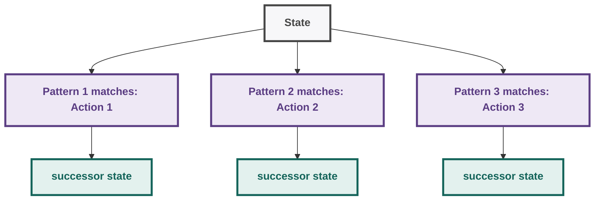
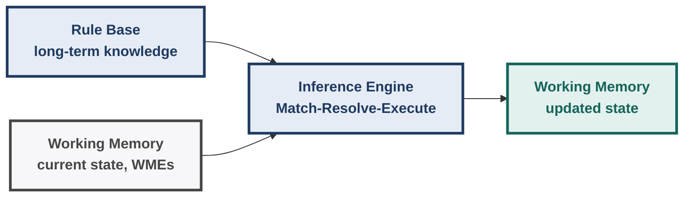
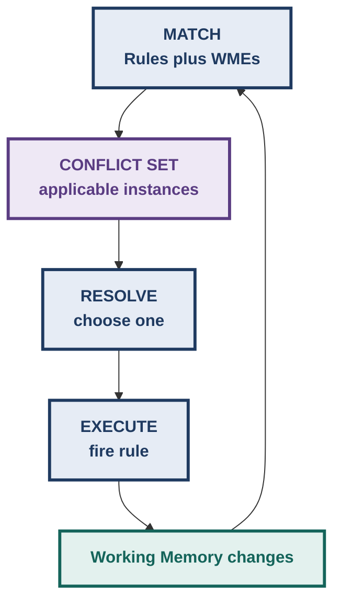
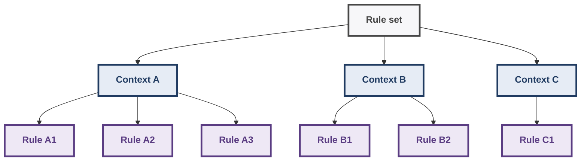
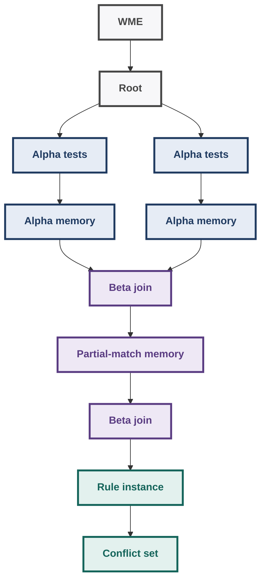
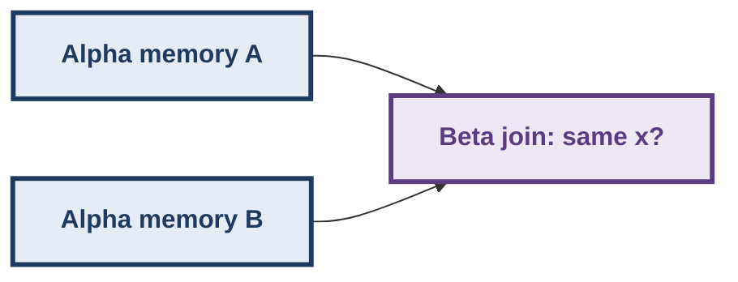
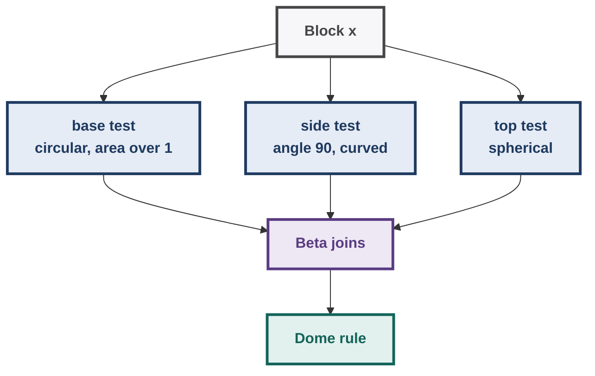
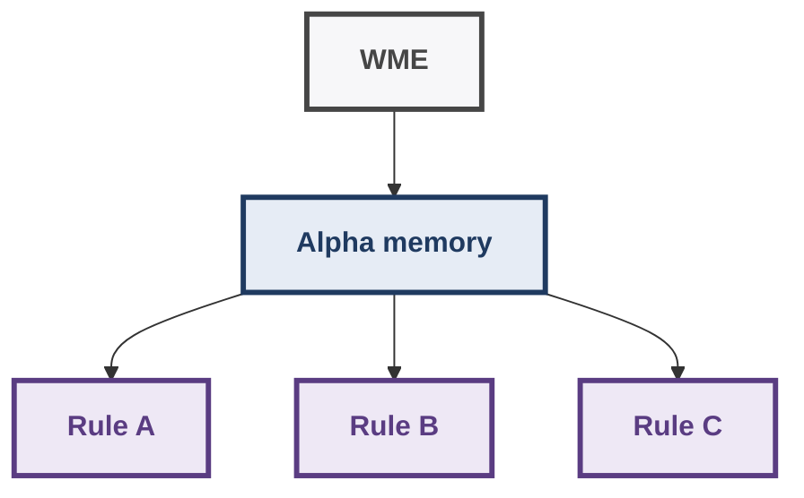
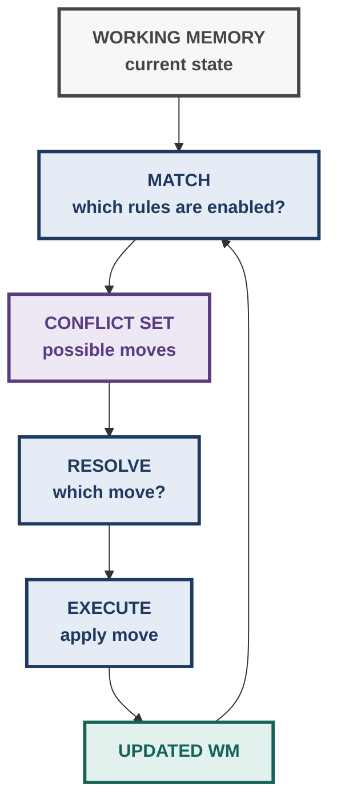

# AI: Search Methods for Problem Solving — Week 10 Notes
## Rule-Based Expert Systems, Match–Resolve–Execute, Conflict Resolution & Rete

> **Source basis:** Primarily the IIT Madras lecture transcripts/slides for **Rule Based Expert Systems**, **Match-Resolve-Execute**, and **Rete Net: Examples**. Supplementary clarifications are explicitly marked.  
> Lecture terminology is retained wherever possible.

---

## 1. Where Week 10 Fits in the Course

The course has progressively moved from searching through explicitly represented state spaces to understanding **what can sit inside the `MoveGen` function**.

- State-space search
  - MoveGen(N) gives neighbouring states
    - Problem decomposition / AO\*
      - Look inside the state itself
        - A state contains patterns
          - Pattern → Action rules
            - Rule-based production systems
              - Match → Resolve → Execute
                - Rete = efficient implementation of the matching process

The lecturer's key perspective is:

> A rule-based system can be viewed as **dismantling `MoveGen` into individual pattern–action responses**.

A state can be regarded as a collection of sentences/statements. A **pattern** selects a subset of those statements; the corresponding **action** modifies the state.

Thus:



This connects Week 10 directly to the search framework studied earlier.

---

## 2. Rule-Based Systems: First Principles

### 2.1 What problem does a rule-based system solve?

Instead of explicitly writing a procedural sequence:

```text
do A
then do B
if condition C, do D
...
```

we specify **knowledge as rules**:

```text
IF pattern/condition is satisfied
THEN perform action(s)
```

The system itself decides **which applicable rule to execute** using an inference engine and a conflict-resolution strategy.

This is a form of **declarative programming**.

### Declarative vs imperative

| Imperative programming | Rule-based/declarative view |
|---|---|
| Programmer specifies the sequence/control | Programmer specifies pattern–action relationships |
| "Do A, then B, then C" | "If this pattern occurs, this action is appropriate" |
| Control is explicitly programmed | Inference engine supplies control |
| Rule ordering can be avoided in principle | Some conflict strategies, such as lexical order, reintroduce programmer control |

The lecturer connects this to Kowalski's idea:

```text
Program = Logic + Control
```

The intended declarative ideal is that the programmer provides the **logic/relationships**, while the inference mechanism supplies the **control**.

---

## 3. Production Systems

A **rule-based production system** consists of three major components:



### 3.1 Working Memory (WM)

Working Memory represents the **current state of problem solving**.

It is treated as the problem solver's **short-term memory**.

It contains a collection of **Working Memory Elements (WMEs)**.

Each WME is a structured statement/record representing something currently known.

Example:

```text
(student
    ^name Sudhir
    ^age 19
    ^semester 3
    ^discipline math
    ^degree BSC)
```

A WME has:

- a **class name**
- attribute–value pairs
- a timestamp indicating when it was added to working memory

The lecturer emphasizes that attributes may be written in different orders; the matching mechanism does not depend on the textual order in which the attributes are listed.

### WME timestamp

If WMEs are added in this order:

```text
WME1 → timestamp 1
WME2 → timestamp 2
WME3 → timestamp 3
```

then WME3 is the most recent.

This becomes important for **Recency** conflict resolution.

---

## 4. Rule / Production

A rule is also called a **production**.

General structure:

```text
Production:
    LHS  →  RHS
```

where:

- **LHS (Left-Hand Side)** = one or more patterns/conditions
- **RHS (Right-Hand Side)** = one or more actions

Conceptually:

```text
IF     Pattern 1
AND    Pattern 2
AND    ...
THEN   Action 1
       Action 2
       ...
```

The LHS answers:

> **When is this rule applicable?**

The RHS answers:

> **What should happen when it fires?**

---

## 5. Why Rules Are More Than Logic Implications

A rule-based production system is not simply first-order logic.

In ordinary mathematical logic, once a proposition is established, it does not disappear merely because time has passed.

Production systems instead allow actions that **change working memory**.

This makes them useful for problem solving.

For example:

```text
IF some condition holds
THEN remove one fact
     make another fact
     modify an existing fact
```

This is similar in spirit to the add/delete effects seen in planning.

---

## 6. OPS5

The lecture uses **OPS5** as the production-system language.

Important historical points:

- OPS5 was devised by **Charles Forgy** at Carnegie Mellon University in the 1970s.
- It became an important production-system language.
- **R1/XCON** was an influential expert system written using OPS5.
- R1/XCON was developed to configure DEC VAX computer systems.
- The lecture connects this history to Simon and Newell's work on human problem solving and later systems such as SOAR.

> **Supplementary note:** SOAR is a broader cognitive architecture that evolved from this production-system tradition and contains additional mechanisms beyond the basic OPS5 model.

---

## 7. OPS5 Working-Memory Representation

OPS5 uses structured records.

Conceptually:

```text
(class-name
    ^attribute1 value1
    ^attribute2 value2
    ...)
```

Example:

```text
(student
    ^name Sudhir
    ^age 19
    ^semester 3
    ^discipline math
    ^degree BSC)
```

### Important details

- Attribute names are marked using `^`.
- Attribute values are constants or can be matched against rule variables.
- If an attribute is not specified, its default value is `nil`.
- Attribute order does not matter for matching.

---

## 8. LHS Pattern Matching

A rule's LHS consists of patterns that must match working-memory elements.

### 8.1 Positive patterns

A positive pattern requires a matching WME.

If:

```text
Pattern:
(student ^name Suresh)
```

then a WME must exist whose class is `student` and whose `name` is `Suresh`.

### 8.2 Negative patterns

A negative pattern requires that **no matching WME exists**.

Conceptually:

```text
NOT (student ^marks > m ^rank nil)
```

means:

> There must not be a student satisfying that pattern.

This is important in the ranking example.

---

## 9. What Does It Mean for a Pattern to Match?

A pattern matches a WME when:

1. The **class names match**.
2. Every attribute condition specified by the pattern is satisfied.
3. Variables/tests in the pattern can be consistently bound.
4. Attributes present in the WME but not mentioned by the pattern are ignored.

### Example

WME:

```text
(student
    ^name Ravi
    ^age 20
    ^marks 85
    ^discipline physics)
```

Pattern:

```text
(student ^marks > 80)
```

matches.

The pattern does **not** need to mention:

```text
^name
^age
^discipline
```

because it is only testing the subset of information relevant to the rule.

---

## 10. Variables and Boolean Tests

Rule patterns can contain variables.

The lecture uses angle brackets for variables conceptually:

```text
<x>
<m>
<r>
```

A variable can match an appropriate value.

Examples of tests include:

```text
x = 3
x = y
x ≠ y
x < 3
x ≤ 3
x > 3
x ≥ 3
```

### Conjunction

Multiple tests can be required simultaneously.

Conceptually:

```text
{ x > 3 , x < 3.5 }
```

means:

```text
x > 3 AND x < 3.5
```

### Disjunction

Double-angle notation represents alternatives:

```text
<< Monday Wednesday Friday >>
```

conceptually means:

```text
Monday OR Wednesday OR Friday
```

---

## 11. RHS Actions

The RHS specifies what happens when the rule fires.

The lecture discusses:

| Action | Meaning |
|---|---|
| `make` | Create/add a new WME |
| `remove` | Delete a WME |
| `modify` | Remove an existing WME and add a modified version |
| `read` | Read input |
| `write` | Produce output |
| `load` | Load a file |
| `halt` | Stop execution |

`modify` can be viewed as:

```text
modify(old, new)
≈ remove(old) + make(new)
```

This resembles add/delete effects in planning.

---

## 12. Important OPS5 Detail: RHS Actions Are Concurrent

This is an important exam/detail point.

Suppose the matched value of `r` is:

```text
r = 2
```

and the RHS conceptually says:

```text
modify next-rank → r + 1
modify student → rank r
```

The student receives:

```text
rank = 2
```

and the next-rank record becomes:

```text
rank = 3
```

The second action does **not** see the modified `r = 3`.

Why?

Because the RHS actions use the values obtained during the **match phase** and can be thought of as happening concurrently.

> **Exam trap:** Do not execute RHS actions sequentially like ordinary imperative statements.

---

## 13. Worked Example 1 — Ranking Students

The lecturer uses a ranking problem to demonstrate rule matching.

### Goal

Suppose students have marks and some may already have ranks.

We want to repeatedly assign the next rank to:

> the highest-marked student who has **not yet been assigned a rank**.

The working memory contains a WME saying:

```text
next-rank = r
```

and student WMEs containing:

```text
student
marks = m
rank = nil
```

The rule additionally requires:

```text
There must NOT exist another unranked student
with marks > m.
```

So the candidate is the **maximum-marked unranked student**.

---

### 13.1 Rule logic

Conceptually:

```text
IF
    next rank = r

    AND
    student S has marks m and rank = nil

    AND
    there is NO unranked student with marks > m

THEN
    assign rank r to S
    increment next rank to r + 1
```

The negative condition is what identifies the maximum remaining mark.

---

### 13.2 Hand-solved example

Suppose:

| Student | Marks | Rank |
|---|---:|---:|
| Rashmi | 89 | 1 |
| Eva | 79 | nil |
| Anil | 79 | nil |
| Meena | 69 | nil |

and:

```text
next rank = 2
```

### Step 1 — Exclude already-ranked students

Rashmi has:

```text
rank = 1
```

so she does not satisfy:

```text
rank = nil
```

Therefore Rashmi cannot receive rank 2.

### Step 2 — Candidate marks

Remaining unranked students:

```text
Eva   → 79
Anil  → 79
Meena → 69
```

### Step 3 — Apply the negative condition

For Eva:

```text
Is there an unranked student with marks > 79?
No.
```

So Eva qualifies.

For Anil:

```text
Is there an unranked student with marks > 79?
No.
```

So Anil also qualifies.

For Meena:

```text
Is there an unranked student with marks > 69?
Yes → Eva/Anil have 79.
```

So Meena does not qualify.

Thus the rule has **two matching instances**:

```text
(ranking, Eva)
(ranking, Anil)
```

The conflict-resolution strategy must decide which instance fires first.

---

## 14. Worked Example 2 — Swap Sort

The second important rule-based example is sorting.

Suppose working memory contains:

```text
(array ^index 1 ^value 7)
(array ^index 2 ^value 9)
(array ^index 3 ^value 3)
(array ^index 4 ^value 8)
```

We want increasing order.

The rule identifies:

```text
index i < index j
AND
value at i = X
AND
value at j = Y
AND
Y < X
```

Then it swaps the values.

Conceptually:

```text
IF:
    i < j
    value(i) = X
    value(j) = Y
    Y < X

THEN:
    value(i) ← Y
    value(j) ← X
```

### Hand trace: one matching instance

Take:

```text
i = 1
j = 3
```

Then:

```text
value(1) = 7
value(3) = 3
```

Since:

$$
3 < 7
$$

the rule matches.

After the rule fires:

```text
index 1 → 3
index 3 → 7
```

The array becomes:

```text
[3, 9, 7, 8]
```

The rule can continue firing on other out-of-order pairs.

The lecturer notes that this demonstrates the expressive power of rules, **not an efficient sorting algorithm**. Efficient algorithms such as merge sort or quicksort would be preferable.

> **Exam/understanding point:** A single production rule can describe an entire repeated process because it remains applicable until no matching instance remains.

---

## 15. Match → Resolve → Execute

This is the central inference cycle of Week 10.



### 15.1 MATCH

Input:

```text
Rule Base + Working Memory
```

Output:

```text
Conflict Set
```

A conflict-set element is:

```text
(rule, matching WME binding/tuple)
```

Example:

```text
(Ranking, Eva)
(Ranking, Anil)
(SwapSort, WME1, WME3)
(SwapSort, WME2, WME3)
...
```

The lecturer emphasizes that **matching is the computationally expensive part**.

Illustrative brute-force scale:

```text
100 rules
× 5 patterns/rule
= 500 patterns

10,000 WMEs

Potentially:
500 × 10,000
pattern/WME comparisons
```

This motivates Rete.

---

## 16. RESOLVE

Resolve chooses **one rule instance** from the conflict set.

This is where the production system's **search/control strategy** appears.

The lecturer's important conceptual connection:

- Search algorithm: many candidates, then choose next candidate
- Rule system: many matching rule instances, then conflict resolution, then choose next rule instance

Therefore, conflict resolution is not a minor implementation detail; it determines how the system searches through possible actions.

---

## 17. EXECUTE

The selected rule instance is fired.

Its RHS actions may:

- add WMEs
- remove WMEs
- modify WMEs
- perform I/O
- halt the system

After working memory changes, the inference cycle continues.

Termination occurs when the system reaches its specified stopping condition, commonly when there are no applicable rules.

---

## 18. Conflict Set: Worked Example

From the lecturer's array/ranking example, suppose the working memory contains:

```text
Array:
index 1 → 7
index 2 → 9
index 3 → 3
index 4 → 8
```

Possible `swapSort` instances include:

```text
(1,3) because 1 < 3 and 3 < 7
(2,3) because 2 < 3 and 3 < 9
(2,4) because 2 < 4 and 8 < 9
```

The ranking rule may simultaneously produce:

```text
(Ranking, Eva)
(Ranking, Anil)
```

So the conflict set contains multiple candidate instances.

The system must now **resolve the conflict**.

---

## 19. Conflict Resolution Strategies

The lecture discusses:

1. Refractoriness
2. Lexical order
3. Specificity
4. Recency
5. Means-Ends Analysis (MEA)

These should not be confused.

| Strategy | Main idea |
|---|---|
| Refractoriness | Do not fire the same rule instance with the same data again |
| Lexical order | Prefer the rule stated earlier by the programmer |
| Specificity | Prefer the more specific matching rule |
| Recency | Prefer the rule instance using the newest WME |
| MEA | Use the first pattern as context; apply recency to context, specificity within it |

---

## 20. Refractoriness

A rule instance can fire **only once with the same set of matching WMEs**.

Why?

Without refractoriness, a rule that does not alter the condition that made it applicable could fire forever.

Example:

```text
IF:
    X is present

THEN:
    print("X found")
```

If `X` remains in working memory and the rule can be reconsidered indefinitely:

```text
print
print
print
print
...
```

Refractoriness prevents the exact same rule/WME combination from firing repeatedly.

### Important Rete connection

In Rete, once the selected rule instance fires, it is removed from the conflict set.

Therefore, refractoriness is naturally implemented.

> **Exam trap:** Refractoriness is about the **same rule instance with the same matching data**, not "a rule can fire only once ever."

---

## 21. Lexical Order

Choose the matching rule that appears **first in the program**.

If:

```text
R1: IF ... THEN ...
R2: IF ... THEN ...
R3: IF ... THEN ...
```

and all match, lexical order chooses:

```text
R1
```

If the same rule has multiple matching instances, the earlier data/instance is preferred according to the implementation's lexical ordering.

### Why it matters

This makes rule ordering part of control.

The lecturer connects this to **Prolog**:

- Prolog commonly searches rules top-to-bottom.
- Therefore rule ordering can influence behavior.
- This deviates from the ideal of completely declarative programming.

The intended ideal discussed by Kowalski was:

```text
Program = Logic + Control
```

with the inference engine ideally supplying the control.

---

## 22. Specificity

Specificity chooses the **most specific matching rule**.

The lecturer's operational interpretation:

> Count the number of tests performed by the rule's patterns.

More tests ⇒ more specific.

Example:

```text
R1:
IF bird(x)
THEN flies(x)
```

versus:

```text
R2:
IF bird(x) AND penguin(x)
THEN does-not-fly(x)
```

If:

```text
bird(Tweety)
penguin(Tweety)
```

then both rules match.

But R2 has more conditions:

```text
R1 → fewer tests
R2 → more tests
```

Therefore:

```text
Specificity → R2 wins
```

---

## 23. Specificity and Default Reasoning

This is one of the most important conceptual applications.

A general rule can act as a **default**.

```text
IF bird(x)
THEN flies(x)
```

This is the default assumption.

A more specific rule can override it:

```text
IF bird(x) AND penguin(x)
THEN does-not-fly(x)
```

Because the second rule is more specific, it wins whenever both match.

Thus:

- general rule
  - default conclusion
    - specific additional knowledge
      - override default

This is a major reason specificity is useful.

---

## 24. Worked Example — Tweety

Working memory:

```text
bird(Tweety)
penguin(Tweety)
```

Rules:

```text
R1:
IF bird(x)
THEN flies(x)

R2:
IF bird(x) AND penguin(x)
THEN does-not-fly(x)
```

### Matching

R1 matches because:

```text
bird(Tweety)
```

R2 matches because:

```text
bird(Tweety)
AND
penguin(Tweety)
```

### Conflict resolution

Count conditions:

```text
R1 → 1 condition
R2 → 2 conditions
```

Therefore:

```text
R2 is more specific
```

and is selected under specificity.

> **Exam trap:** Specificity is **not** "the rule with the most recent fact." That is Recency.

---

## 25. Bridge Example — Default Rules

The lecturer uses contract bridge to illustrate default reasoning.

A default rule may essentially say:

```text
IF it is player X's turn
AND the normal turn order leads to player Y next
THEN a default bid is PASS
```

But another rule can be more specific:

```text
IF it is X's turn
AND X has the appropriate hand
AND other required conditions hold
THEN make a specific opening bid such as 1NT
```

Both may match.

Under **specificity**:

```text
specific opening-bid rule
        >
general PASS rule
```

Therefore the default PASS is used only when no more specific bidding rule applies.

This illustrates the general pattern:

- General default
  - More specific evidence
    - More specific rule overrides default

---

## 26. Recency

Recency chooses the rule instance whose matching data contains the **most recently added WME**.

Each WME has a timestamp.

Example:

```text
WME-A → t=4
WME-B → t=7
WME-C → t=9
```

Suppose:

```text
Instance I1 uses WME-A
Instance I2 uses WME-C
```

Then:

```text
t(I1) = 4
t(I2) = 9
```

Recency chooses:

```text
I2
```

because 9 is the highest timestamp.

---

## 27. Why Recency Is Useful

The intuition is:

> A newly derived/added fact may represent the most recent development in the reasoning process, so rules using it should receive priority.

This can create a chain:

- new fact
  - rule uses new fact
    - new conclusion
      - another rule uses new conclusion
        - ...

The lecturer connects this to a **chain-of-thought-like reasoning process**.

> **Important:** This is the lecturer's conceptual analogy for rule-system control, not a claim that the production system is equivalent to modern LLM chain-of-thought.

---

## 28. Hand-Solved Recency Example

Suppose:

| Rule instance | Matching WME timestamps |
|---|---|
| I1 | 3, 5 |
| I2 | 4, 7 |
| I3 | 2, 9 |

The most recent WME used by each instance is:

```text
I1 → max(3,5) = 5
I2 → max(4,7) = 7
I3 → max(2,9) = 9
```

Therefore, under recency:

```text
I3 wins
```

because:

$$
9 > 7 > 5
$$

---

## 29. Means-Ends Analysis (MEA)

OPS5 includes a conflict-resolution strategy called **Means-Ends Analysis**.

Recall the general idea of MEA:

1. Compare current state with desired state.
2. Identify differences.
3. Prefer operators that reduce important differences.

In OPS5, the lecturer describes a specific implementation:

### Step 1 — Partition rules by the first pattern

The **first pattern establishes the context**.

Rules with the same first-pattern context belong to the same partition.



### Step 2 — Apply recency to the context

Choose the most recent context.

### Step 3 — Apply specificity within that partition

Among rules in that context, use specificity to resolve the remaining conflict.

Therefore:

```text
MEA
 = Recency on first-pattern context
 + Specificity inside selected context
```

---

## 30. MEA Worked Intuition — Chennai → Parashar Lake

The lecturer's example:

```text
Current: Chennai
Goal: Parashar Lake, Himachal Pradesh
```

A major difference is geographical distance.

Suppose we focus first on:

```text
Chennai → Delhi
```

That difference might be reduced by:

```text
train
flight
driving
```

These are alternative ways of addressing the same context/difference.

The first pattern in the rule establishes the context, while:

- recency chooses which context to address
- specificity chooses among rules within that context

---

## 31. Rete Algorithm: Why Do We Need It?

The naive Match step repeatedly performs a huge amount of work.

Suppose:

```text
100 rules
5 patterns/rule
10,000 WMEs
```

There are:

```text
500 patterns
```

and a naive implementation repeatedly compares these against the working memory.

But after one rule fires, usually **only a small part of working memory changes**.

Most previous matches remain valid.

Therefore, instead of:

```text
recompute everything
```

Rete maintains a **network of partial matches** and propagates only changes.

Core idea:

- Compile rules into a network
  - Insert WMEs into the network
    - Perform tests once as the WME travels
      - Store partial matches
        - When a WME changes, propagate the change
          - Update affected rule instances only

This is the central motivation for Rete.

---

## 32. Rete Network Architecture

A simplified Rete network:



The lecture uses the terms:

- **Alpha memory/nodes** for individual/single-pattern tests and stored matching WMEs.
- **Beta nodes** for combining information from multiple paths.
- **Rule instance** at the end of a completed match.

---

## 33. Alpha Nodes

An alpha node performs a test on a **single WME**.

Examples:

```text
class = base
area > 1
shape = square
color = green
```

Think:

- One WME
  - single-condition test
    - passes/fails

Alpha memory stores WMEs that have passed the relevant tests.

### Why share alpha tests?

The same pattern may appear in several rules.

Instead of testing it separately for every rule:

```text
Rule 1 → same test
Rule 2 → same test
Rule 3 → same test
```

Rete performs the common test once and allows multiple rules to refer to the resulting memory.

---

## 34. Beta Nodes

A beta node combines information from multiple memories.

The crucial idea is **shared variable binding**.

Suppose two patterns contain the same variable:

```text
(block ^name <x> ...)
(block ^name <x> ...)
```

The two matched WMEs must refer to the **same object**.

Conceptually:



If the bindings are incompatible, the join fails.

If they are compatible, the partial match is propagated.

---

## 35. Rete and the `x` Variable

The geometric-shape example uses a common variable:

```text
<x>
```

For a dome, several conditions must refer to the same block:

```text
Block x
AND
base is circular, area > 1
AND
side is vertical and curved
AND
top is spherical
```

The important condition is not merely:

```text
some block satisfies condition A
some block satisfies condition B
some block satisfies condition C
```

It is:

```text
THE SAME x satisfies A, B, and C.
```

Beta nodes enforce this join.

---

## 36. Rete Classification Example

The lecture's Rete example classifies geometric blocks.

Four rules include concepts such as:

```text
Green pyramid
Cylinder
Band
Dome
```

### Green pyramid conditions

Conceptually:

```text
same block x
AND
base is square
AND
base area > 1
AND
side is inclined
AND
side is planar
AND
side is green
AND
top is a point
```

### Cylinder

Conceptually:

```text
same block x
AND
base is circular
AND
base area > 1
AND
side is vertical
AND
side is curved
AND
top is flat
```

### Band

Conceptually:

```text
same block x
AND
small circular base
AND
curved black side
AND
inclined side
AND
pointed top
```

### Dome

Conceptually:

```text
same block x
AND
circular base
AND
base area > 1
AND
vertical curved side
AND
spherical top
```

---

## 37. Rete Network for the Dome — How to Read It

The dome rule needs several inputs.



The exact network can share the initial `block x` pattern across several rules.

---

## 38. The Four-Block Example

The lecture then supplies working-memory data describing four blocks.

Information includes:

- base shape
- base area
- side properties
- color
- top properties

For example, one block has:

```text
base = square
area = 20
```

Since:

$$
20 > 1
$$

the test:

```text
area > 1
```

passes.

The same WME can be useful to multiple rules because it is stored in shared alpha memory.

---

## 39. Hand-Solved Rete Token Trace

Consider the WME:

```text
(base
    ^block 2
    ^shape square
    ^area 20)
```

Assume the relevant Rete branch tests:

```text
class = base
area > 1
shape = square
```

### Step 1 — Class test

```text
class = base
```

The WME is a `base` WME.

So:

```text
PASS
```

### Step 2 — Area test

```text
area = 20
```

Need:

$$
20 > 1
$$

Therefore:

```text
PASS
```

### Step 3 — Shape test

Need:

```text
shape = square
```

Actual value:

```text
square
```

Therefore:

```text
PASS
```

The token reaches the corresponding alpha memory.

It is now available for beta joins with other WMEs needed by the green-pyramid rule.

### Critical point

This WME was matched as it entered the network.

The system does **not** need to re-run the same tests from scratch every inference cycle.

---

## 40. Rete Token Propagation

The lecturer describes insertion using **positive and negative tokens**.

### Positive token

A newly added WME travels through the network:

- +WME
  - Root
    - Alpha tests
      - Alpha memory
        - Beta joins
          - Rule instances
            - Conflict set

Only paths whose tests succeed are followed.

### Negative token

A removed WME causes corresponding information to be withdrawn:

- -WME
  - Affected memories / joins
    - Remove invalid rule instances
      - Conflict set updated

Therefore Rete propagates **changes in working memory into changes in the conflict set**.

---

## 41. Why the Same WME Is Stored Once

Suppose the same WME can contribute to:

```text
Rule A
Rule B
Rule C
```

A brute-force system could repeatedly copy/retest the WME for each rule.

Rete instead stores the WME in an appropriate alpha memory and allows beta networks to refer to it.



This is one of the mechanisms by which Rete avoids recomputation.

---

## 42. Rete and Refractoriness

Suppose a completed path creates:

```text
Rule R + matching WME tuple
```

This becomes a rule instance in the conflict set.

Once selected and fired:

```text
remove instance from conflict set
```

Therefore the same rule/WME combination is not repeatedly fired.

Thus:

- Rete implementation
  - selected instance removed
    - refractoriness naturally emerges

---

## 43. Rete + Recency

Suppose a newly inserted WME completes three different rule matches.

Then all three instances use that newly inserted WME.

If that WME has timestamp:

```text
t = 14
```

then, for those instances, the latest contributing WME may be the same timestamp.

Therefore they form a **recency bucket**.

Under recency, they are preferred over rule instances whose latest contributing WME is older.

---

## 44. Rete + Specificity

The lecturer explains specificity in the Rete network using path lengths.

A rule's specificity can be represented through the amount of testing performed along its network path.

Conceptually:

- More tests
  - longer/more elaborate path
    - greater specificity

For a rule instance, the system can consider the **sum of the relevant path lengths/tests**.

A priority queue can be used to maintain conflict-set ordering.

> **Supplementary clarification:** This is an implementation-oriented interpretation of the lecture's statement that specificity can be measured through the number of tests/path lengths in the Rete network.

---

## 45. Negative Patterns in Rete

Negative patterns are fundamentally different from positive patterns.

Positive pattern:

```text
Find a matching WME.
```

Negative pattern:

```text
Ensure that no matching WME exists.
```

Therefore positive matching is largely local:

```text
"This WME satisfies this test."
```

Negative matching requires absence:

```text
"No WME satisfying this pattern exists."
```

When a WME is added or removed, a negative condition may therefore change whether a rule is eligible.

### Example

Rule:

```text
IF
    bird(x)
AND
NOT penguin(x)
THEN
    flies(x)
```

If:

```text
bird(Tweety)
```

exists and no penguin fact exists:

```text
Rule may match.
```

If later:

```text
penguin(Tweety)
```

is added:

```text
negative condition fails
→ rule instance must be withdrawn/invalidated
```

> **Exam trap:** A negative pattern does **not** mean "invert the Rete tree." It means that a matching WME must be absent.

---

## 46. Geometry Classification Example

The lecture gives another Rete network based on four features of geometric figures:

1. Number of equal sides
2. Number of sides
3. Number of right angles
4. Number of parallel sides

The network can classify shapes such as:

```text
Triangle
Quadrilateral
Isosceles triangle
Equilateral triangle
Right triangle
Rhombus
Parallelogram
Square
Rectangle
Trapezium
Right trapezium
...
```

---

## 47. Hand-Solved Geometry Example

Suppose a figure has:

```text
number of sides = 3
number of equal sides = 2
```

The triangle rule checks:

```text
sides = 3
```

so it matches.

The isosceles-triangle rule checks:

```text
sides = 3
AND
equal sides = 2
```

so it also matches.

Therefore both rules are candidates.

Under specificity:

```text
Triangle:
    1 major condition

Isosceles triangle:
    2 conditions
```

Thus:

```text
Isosceles triangle
```

is the more specific classification.

---

## 48. Inheritance Hierarchy

The lecturer uses the shape example to illustrate an inheritance-like hierarchy.

- Quadrilateral
  - Rhombus
    - Square

Meaning:

```text
Square ⇒ Rhombus ⇒ Quadrilateral
```

because:

- a square has four sides
- all four sides are equal
- all four angles are right angles

A rhombus requires:

```text
four sides
+
all four equal
```

A square satisfies those conditions plus:

```text
four right angles
```

Therefore square is more specific than rhombus.

---

## 49. Important Limitation in the Shape Example

The lecturer points out that the rule network may capture some inheritance relationships without automatically encoding every logical relation.

For example:

```text
Equilateral triangle
```

is also:

```text
Isosceles triangle
```

under the usual mathematical definition, because it has at least two equal sides.

But unless the rule network explicitly contains that relationship, the network does not automatically infer the inheritance.

Thus:

> **A classification network only knows the relationships explicitly encoded by its rules/network structure.**

---

## 50. Rule-Based Reasoning vs Search

The final lecture discussion connects rule-based reasoning back to search.

Two approaches can solve a problem such as a game:

### Search-based

- Current state
  - Generate possible moves
    - Look ahead
      - Minimax / Alpha-Beta
        - Choose move

### Knowledge/rule-based

- Current state
  - Match domain rules
    - Conflict resolution
      - Choose applicable rule
        - Execute action

The lecturer gives examples from chess and tic-tac-toe.

Humans often use acquired heuristics/rules rather than performing exhaustive look-ahead for every familiar situation.

---

## 51. Tic-Tac-Toe Rule-Based Example

Possible heuristic features include:

- whether the center is empty
- available columns
- blocked columns
- available diagonals
- opportunities to create a fork
- blocking the opponent's row/column/diagonal

A simple rule could be:

```text
IF center square is empty
THEN occupy center square
```

Other rules could encode:

```text
IF opponent has two in a row
THEN block the remaining square
```

or:

```text
IF a winning move exists
THEN make the winning move
```

The interesting question becomes:

> Given several applicable rules, what conflict-resolution strategy makes the rule-based player choose a good move?

This is exactly the role of **Resolve**.

---

## 52. Clean Inference-Engine Pseudocode

The following is a clean reconstruction of the lecture's Match–Resolve–Execute cycle:

```text
InferenceEngine(WM, RuleBase):

    repeat:

        ConflictSet ← ∅

        # MATCH
        for each rule R in RuleBase:
            for each valid WME binding B:
                if R.LHS matches WM under B:
                    add (R, B) to ConflictSet

        if ConflictSet is empty:
            return / halt

        # RESOLVE
        (R*, B*) ← ConflictResolution(ConflictSet)

        # EXECUTE
        apply R*.RHS using binding B*

        update WM

    until termination condition
```

The expensive part in a naive implementation is the repeated MATCH phase.

Rete changes the implementation of MATCH.

---

## 53. Clean Rete Pseudocode

The lecture presents Rete conceptually through token propagation rather than one monolithic pseudocode block. A faithful reconstruction is:

```text
BuildRete(RuleBase):

    compile rule patterns into a shared network
    share common tests
    create alpha tests/memories
    create beta join nodes
    connect completed paths to rule-instance nodes


When WME is ADDED:

    insert +WME token at root

    propagate token through alpha tests

    for every successful alpha test:
        store WME in corresponding alpha memory

    at each beta node:
        join new token with compatible partial matches

        if join succeeds:
            create/propagate new partial match

    when all rule conditions are satisfied:
        create rule instance
        add rule instance to conflict set


When WME is REMOVED:

    insert -WME token / propagate deletion

    remove affected alpha-memory entries

    remove invalid partial matches

    remove rule instances whose conditions are no longer satisfied
    from the conflict set


When a rule instance is selected:

    fire its RHS

    update working memory

    propagate resulting +WME / -WME changes
```

This captures the lecture's central principle:

```text
Don't recompute all matches.
Propagate only changes.
```

---

## 54. Rete: Brute Force vs Incremental Matching

| Feature | Brute-force matching | Rete |
|---|---|---|
| Rule representation | Rules directly tested | Rules compiled into network |
| Matching | Repeatedly compare patterns with WMEs | Tokens propagate through network |
| Common tests | Recomputed | Shared |
| Previous partial matches | Mostly discarded/recomputed | Stored |
| WME addition | Potentially re-match everything | Propagate only affected WME |
| WME deletion | Recompute affected matches | Propagate negative token |
| Main idea | Recompute | Incremental update |

The key conceptual distinction:

```text
Brute force:
    "What matches NOW?"
    → recompute

Rete:
    "What changed?"
    → update only consequences of the change
```

---

## 55. Rete Network Reading Strategy

When given a Rete diagram in an exam:

### Step 1 — Identify the root

Determine where new WME tokens enter.

### Step 2 — Follow alpha tests

For every test:

```text
Does this WME satisfy the condition?
```

If no:

```text
stop on this branch
```

If yes:

```text
continue
```

### Step 3 — Track variables

If the rule contains:

```text
<x>
```

make sure every joined WME uses the **same binding**.

### Step 4 — Follow beta joins

Ask:

```text
Do the partial matches agree on the shared variable?
```

### Step 5 — Reach rule-instance node

If all required patterns are satisfied:

```text
(rule, WME tuple)
```

enters the conflict set.

### Step 6 — Apply the requested conflict-resolution strategy

Do not mix strategies.

---

## 56. Exam Trap — Alpha Match ≠ Complete Rule Match

Suppose:

```text
WME1:
block A is green

WME2:
block B is circular
```

Both may independently satisfy alpha tests.

That does **not** mean a rule requiring:

```text
same block x is green
AND
same block x is circular
```

matches.

You need:

```text
same x
```

at the beta join.

Therefore:

```text
Alpha:
    local/single-WME validity

Beta:
    cross-WME relationship
```

This distinction is central to understanding Rete.

---

## 57. Exam Trap — Recency vs Specificity

These answer different questions.

### Specificity

> Which rule has **more conditions/tests**?

### Recency

> Which matching rule instance uses the **newest WME**?

Example:

```text
R1:
3 conditions, latest WME timestamp = 5

R2:
5 conditions, latest WME timestamp = 4
```

Then:

```text
Specificity → R2
Recency     → R1
```

They can select different winners.

Always identify which strategy the question asks for.

---

## 58. Exam Trap — Negative Pattern

Wrong interpretation:

```text
negative pattern = invert the Rete network
```

Correct interpretation:

```text
negative pattern = no matching WME may exist
```

It therefore needs special handling because adding/removing a WME can change the truth of an absence condition.

---

## 59. Exam Trap — RHS Order

Do not assume:

- RHS action 1
  - RHS action 2 sees action 1's updated value

The lecturer explicitly explains that OPS5 RHS actions can be thought of as **concurrent**, using the bindings established during matching.

---

## 60. Exam Trap — `modify 1` and `modify 2`

In the ranking/sorting examples:

```text
modify 1
modify 2
```

does **not** mean:

```text
array index 1
array index 2
```

It refers to:

```text
the first matched pattern
the second matched pattern
```

This was explicitly clarified in the lecture.

---

## 61. Exam Trap — Refractoriness

Do not interpret:

```text
refractoriness
```

as:

```text
the rule can never fire again
```

Correct:

```text
same rule + same matching WME tuple
→ cannot fire again
```

A new matching WME combination can produce a new rule instance.

---

## 62. Exam Trap — Pattern Does Not Need Full WME

A pattern can specify only the attributes it cares about.

If the WME contains:

```text
name
age
marks
discipline
degree
```

a pattern can test only:

```text
marks > 80
```

and still match.

Do not require every attribute in the WME to appear in the pattern.

---

## 63. Exam Trap — Rete Does Not Mean "Run the Whole Network Again"

The central purpose of Rete is incremental matching.

When:

```text
+WME
```

appears:

```text
propagate the new information
```

When:

```text
-WME
```

appears:

```text
withdraw affected information
```

Do not describe Rete as merely a different way of performing a complete brute-force scan.

---

## 64. Connection to Previous Weeks

### Week 2 — State Space Search

Earlier:

```text
MoveGen(N)
```

explicitly generated successor states.

Week 10:

```text
patterns → actions
```

can be viewed as the internal mechanism producing possible moves.

---

### Week 3 — Heuristic Search

Earlier:

```text
h(n)
```

provided knowledge guiding search.

Week 10:

```text
domain rules
```

encode expert knowledge directly.

Both are attempts to avoid blind exploration.

---

### Week 5/6 — A*

A*:

- many OPEN candidates
  - f(n)=g(n)+h(n)
    - choose candidate

Production system:

- many matching rule instances
  - conflict resolution
    - choose rule instance

The control mechanism is different, but the high-level problem is similar:

> **Which available candidate should be processed next?**

---

### Week 7 — Game Trees

Game search:

```text
generate moves
→ evaluate/search
→ choose move
```

Rule-based game playing:

```text
match game conditions
→ resolve conflict
→ fire move rule
```

Rule-based systems replace systematic look-ahead with encoded knowledge when appropriate.

---

### Week 8 — Planning

Planning operators have:

```text
preconditions
effects
```

Production rules similarly have:

```text
LHS patterns
RHS actions
```

The difference is that production systems operate through a general **match–resolve–execute** inference cycle over working memory.

---

### Week 9 — AO*

AO* chooses among alternatives using backed-up cost.

Rule systems choose among applicable alternatives using conflict-resolution strategies.

- AO\*: which partial solution should be refined?
- Production system: which matching rule instance should fire?

Both are examples of controlling combinatorial alternatives.

---

## 65. One Unified Mental Model

Think of a rule-based system as a search engine whose state is **working memory**.



And Rete optimizes the first box:

- MATCH
  - don't recompute everything
    - maintain a network of partial matches
      - propagate changes

---

## 66. Compact Comparison of Conflict Strategies

| Strategy | Question it answers | Selection rule |
|---|---|---|
| Refractoriness | "Have I already fired this exact instance?" | Prevent same rule/WME tuple from firing again |
| Lexical | "Which rule did programmer write first?" | Earliest rule |
| Specificity | "Which rule has more conditions/tests?" | Most specific |
| Recency | "Which instance uses newest information?" | Highest relevant WME timestamp |
| MEA | "Which context/difference should I address?" | Recency on first pattern/context, then specificity |

---

## 67. Compact Comparison: Rule System Components

| Component | Role | Analogy |
|---|---|---|
| Working Memory | Current facts/state | Short-term memory |
| WME | Individual fact/record | State component |
| Rule Base | Problem-solving knowledge | Long-term memory |
| LHS | Conditions/patterns | Applicability test |
| RHS | Actions | State modification |
| Inference Engine | Controls reasoning | Search/control mechanism |
| Conflict Set | All currently applicable rule instances | Frontier/candidate set |
| Conflict Resolution | Selects one candidate | Search strategy |
| Rete | Efficient incremental matcher | Optimized Match engine |

---

## 68. Final Mental Model

- RULE-BASED EXPERT SYSTEM
  - Working Memory
    - WMEs = current facts
  - Rule Base
    - Production = LHS → RHS
  - Inference Engine
    - MATCH: find rule/WME bindings
    - CONFLICT SET: all currently applicable instances
    - RESOLVE
      - Refractoriness
      - Lexical order
      - Specificity
      - Recency
      - MEA
    - EXECUTE: modify WM, then repeat

Rete sits underneath the Match phase:

- Rules
  - compile into network
    - Alpha tests
      - Alpha memories
        - Beta joins
          - Rule-instance nodes
            - Conflict set

The single most important idea:

> **Production systems encode knowledge as pattern–action rules; the inference engine searches among applicable rule instances, while Rete makes the expensive matching process incremental rather than repeatedly recomputing it from scratch.**

---

## 69. 60-Second Revision

### Rule system

```text
Working Memory = current state
Rule Base = long-term knowledge
Inference Engine = control
```

### Production

```text
LHS patterns → RHS actions
```

### WME

```text
Working Memory Element
= structured fact/record
+ timestamp
```

### Match

```text
Rules + WM
→ Conflict Set
```

### Conflict Set

```text
(rule, matching WME binding/tuple)
```

### Resolve

```text
choose one conflict-set element
```

### Execute

```text
fire RHS
→ WM changes
```

### Conflict resolution

```text
Refractoriness → same instance cannot fire again
Lexical        → earliest rule
Specificity    → most tests/conditions
Recency        → newest WME
MEA            → recency on first-pattern context
                  + specificity inside context
```

### Rete

```text
compile rules
→ shared network
→ alpha single-WME tests
→ beta joins
→ rule instances
→ conflict set
```

### Alpha vs Beta

```text
Alpha = test one WME

Beta = join information from multiple WMEs
        using shared bindings
```

### Positive vs negative

```text
Positive:
    required WME exists

Negative:
    matching WME must NOT exist
```

### Rete's key idea

```text
Brute force → recompute matches

Rete → propagate only changes
```

---

## 70. Solve-It-Yourself Checklist

Before considering Week 10 mastered, you should be able to:

- [ ] Explain why rule-based systems can be viewed as a decomposition of `MoveGen`.
- [ ] Distinguish working memory from rule base.
- [ ] Define WME and explain why timestamps matter.
- [ ] Explain LHS and RHS of a production.
- [ ] Explain positive and negative patterns.
- [ ] Determine whether a pattern matches a WME.
- [ ] Handle variables and Boolean tests in a pattern.
- [ ] Explain conjunction and disjunction in OPS5 patterns.
- [ ] Distinguish `make`, `remove`, and `modify`.
- [ ] Explain why RHS actions should not be treated as sequential imperative statements.
- [ ] Trace the student-ranking rule.
- [ ] Determine which students satisfy the negative "no higher unranked marks" condition.
- [ ] Trace a `swapSort` rule instance.
- [ ] Construct a conflict set from several matching rule instances.
- [ ] Explain Match → Resolve → Execute.
- [ ] Explain why Match is the expensive stage in brute-force inference.
- [ ] Apply refractoriness correctly.
- [ ] Apply lexical ordering correctly.
- [ ] Calculate which rule is more specific.
- [ ] Explain default reasoning using the bird/penguin example.
- [ ] Apply recency using WME timestamps.
- [ ] Explain MEA as recency on context followed by specificity.
- [ ] Explain why Rete is needed.
- [ ] Trace a WME through alpha tests.
- [ ] Explain what alpha memory stores.
- [ ] Explain what a beta node does.
- [ ] Track a shared variable such as `x` through multiple joins.
- [ ] Determine whether a completed rule instance enters the conflict set.
- [ ] Explain how a `+WME` changes the network.
- [ ] Explain how a `-WME` removes/invalidate matches.
- [ ] Explain how Rete naturally supports refractoriness.
- [ ] Distinguish alpha matching from complete rule matching.
- [ ] Distinguish recency from specificity.
- [ ] Explain why negative patterns need special treatment.
- [ ] Reconstruct a simple Rete network from a set of rules.
- [ ] Reconstruct rules from a Rete network diagram.
- [ ] Explain the triangle/isosceles/equilateral or rhombus/square specificity hierarchy.
- [ ] Explain how rule-based game playing differs from Minimax/Alpha-Beta look-ahead.
- [ ] Given a conflict set, identify the selected rule under a specified conflict-resolution strategy.
- [ ] Explain why changing the conflict-resolution strategy can change the behavior of the same rule base.

---

## 71. Final Exam Checklist

When given a Week 10 problem:

1. Identify the WMEs.
2. Identify each rule's LHS patterns.
3. Determine all valid WME bindings.
4. Include negative-pattern requirements.
5. Build the conflict set.
6. Identify the requested conflict-resolution strategy.
7. Apply ONLY that strategy.
8. Fire the selected rule.
9. Update working memory.
10. Propagate the change if tracing Rete.
11. Repeat.

### The three questions to ask at every step

```text
MATCH:
    What is applicable?

RESOLVE:
    Which applicable instance wins?

EXECUTE:
    What changes in working memory?
```

### For Rete questions

```text
ALPHA:
    Does this individual WME pass this test?

BETA:
    Do the partial matches agree on their shared bindings?

RULE NODE:
    Are all conditions satisfied?

CONFLICT SET:
    Which rule instances are now ready?

RESOLVE:
    Which one is selected?
```

---

## 72. Minimal Memory Hook

If you remember only one structure:

- FACTS (WM)
  - MATCH
    - CONFLICT SET
      - RESOLVE
        - EXECUTE
          - UPDATED FACTS, then repeat

Rete: MATCH = shared incremental network, Alpha → Beta → Rule Instance

And remember the conflict-resolution sequence conceptually:

- Refractoriness
- Lexical
- Specificity
- Recency
- MEA

These are **different strategies**, not necessarily a universal sequence to apply simultaneously. The question determines which strategy is being used.
