# AI: Search Methods for Problem Solving — Week 11

## Constraint Satisfaction Problems (CSPs), Model-Based Diagnosis, Constraint Processing, Arc Consistency, Constraint Propagation & Lookahead

> **Primary source:** IIT Madras AI: Search Methods for Problem Solving
> lectures by Prof. Deepak Khemani: *Constraint Satisfaction Problems*,
> *CSPs and Solutions*, *Model Based Diagnosis*, *Constraint
> Processing*, *Arc Consistency*, and *Constraint Propagation*.
>
> **Note on scope:** This document preserves the lecturer's terminology,
> examples, algorithms, reasoning and sequence, while reorganizing them
> into a compact study format. Additional explanations are marked
> **Supplementary note**.

------------------------------------------------------------------------

## 1. Why CSPs Matter

The course has so far viewed problem solving through several lenses:

- SEARCH: State space / solution space, then trial and error, then find a satisfying / optimal path or solution
- REASONING: Knowledge representation, then logical entailment / proof, then derive consequences
- CSP: Variables + Domains + Constraints, then local restrictions describe a global solution, so SEARCH + REASONING can be interleaved

The central idea of Week 11 is that **Constraint Satisfaction Problems
(CSPs) provide a unifying formalism**.

A large problem is described using:

1.  **Variables**
2.  **Domains**
3.  **Constraints**

A general-purpose CSP solver can then solve the problem without needing
to be redesigned for every application.

The lecturer explicitly emphasizes that CSPs can combine:

-   search,
-   reasoning,
-   constraint propagation,
-   domain pruning.

This is why CSPs are useful for problems such as:

-   map colouring,
-   n-Queens,
-   scheduling/timetabling,
-   configuration,
-   diagnosis,
-   SAT-like problems,
-   planning formulations,
-   many other combinatorial problems.

------------------------------------------------------------------------

## 2. Search vs Reasoning vs CSP

### 2.1 Search

Search generally represents a problem through possibilities and explores
them.

Examples from earlier weeks:

-   state-space search,
-   solution-space search,
-   planning,
-   configuration,
-   satisfaction,
-   optimal solutions.

The basic intuition is:

- Many possibilities
  - try one
    - check
      - continue / backtrack

### 2.2 Reasoning

Reasoning starts from statements known to be true and derives
consequences.

For example:

``` text
P
P → Q
Q → R
R → S
```

From these:

``` text
P ⇒ Q ⇒ R ⇒ S
```

Therefore:

``` text
P, Q, R, S are true.
```

### 2.3 CSP as a unifying formalism

The same reasoning can be expressed through constraints.

For example:

``` text
P → Q
Q → R
R → S
P = True
```

can be represented as a constraint network.

Then **consistency enforcement can perform the same propagation that
logical reasoning would perform**.

This is an important conceptual point from the lecture:

> **Consistency enforcement and reasoning are two sides of the same
> coin.**

The CSP formalism therefore gives a common language in which search and
reasoning can interact.

------------------------------------------------------------------------

## 3. Mathematical Foundation: Relations

Before defining CSPs formally, the lecture revisits **relations**.

### 3.1 Relation as a subset of a Cartesian product

Let:

``` text
D = {1, 4, 7, 9}
```

Then:

``` text
D × D
```

contains all 16 ordered pairs:

``` text
(1,1) (1,4) (1,7) (1,9)
(4,1) (4,4) (4,7) (4,9)
(7,1) (7,4) (7,7) (7,9)
(9,1) (9,4) (9,7) (9,9)
```

The relation `<` is a **subset** of these pairs:

``` text
R< = {
  (1,4), (1,7), (1,9),
  (4,7), (4,9),
  (7,9)
}
```

Only pairs satisfying:

``` text
x < y
```

belong to the relation.

### Two descriptions

**Extension form**

Explicitly list the tuples:

``` text
{(1,4), (1,7), (1,9), (4,7), (4,9), (7,9)}
```

**Intension form**

Describe the condition:

``` text
R = {(x,y) | x ∈ D, y ∈ D and x < y}
```

The course uses extension-style representations heavily because finite
CSP relations can be explicitly represented.

------------------------------------------------------------------------

## 4. Relations and Predicate Logic

Relations also provide the semantics of predicates.

Suppose:

``` text
D = {Amy, Arun, Anil, Ayesha}
```

and define:

``` text
Brother ⊆ D × D
```

If:

``` text
(Amy, Arun) ∈ Brother
```

then the predicate statement:

``` text
Brother(Amy, Arun)
```

is true.

Thus:

- predicate sentence
  - tuple belongs to relation

For a three-place relation such as `Siblings`:

``` text
Siblings ⊆ D × D × D
```

The relation contains triples rather than pairs.

### Key point

> Relations form the basis of predicate logic.

This becomes important later because constraints themselves are
represented as relations.

------------------------------------------------------------------------

## 5. Formal Definition of a CSP

A CSP is a triple:

$$
\boxed{CSP = (X,D,C)}
$$

where:

### X --- Variables

A set of variable names:

$$
X = \{X_1,X_2,\ldots,X_n\}
$$

### D --- Domains

Each variable has a domain of values it can take.

For example:

``` text
D_X1 = {red, green, blue}
D_X2 = {red, blue}
```

The Week 11 material focuses on **finite discrete domains**.

### C --- Constraints

A constraint restricts the combinations of values that may
simultaneously be assigned to some variables.

If a constraint involves variables:

``` text
X, Y
```

then it is a relation:

$$
R_{XY} \subseteq D_X \times D_Y
$$

The set of variables participating in the relation is its **scope**.

------------------------------------------------------------------------

## 6. Scope of a Constraint

Suppose:

``` text
R(X,Y)
```

Then:

``` text
Scope(R) = {X,Y}
```

This is a binary constraint.

If:

``` text
R(X,Y,Z)
```

then:

``` text
Scope(R) = {X,Y,Z}
```

This is a ternary constraint.

In general:

$$
R \subseteq D_{X_1}\times D_{X_2}\times\cdots\times D_{X_k}
$$

The scope contains the variables appearing in that relation.

------------------------------------------------------------------------

## 7. Binary Constraint Networks

A **binary constraint** involves two variables.

The CSP can then be represented as a **constraint graph**.

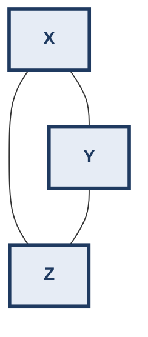

-   vertices = variables
-   edges = binary constraints

If there is no edge between two variables, then there is no explicitly
specified binary restriction between them.

This does **not** mean that they cannot both appear in a solution.

It means the pair is unrestricted by that particular binary constraint
representation.

------------------------------------------------------------------------

## 8. Course Timetabling as a CSP

The lecture uses course scheduling as a realistic example.

Possible variables:

``` text
Course
Slot
Room
Faculty
```

Possible domains:

``` text
Course  = {AI, DBMS, ML, PL}
Slot    = {A,B,C,D,E,F,G}
Room    = {24,26,34,46}
Faculty = {DK, ...}
```

Possible relations:

``` text
Course × Faculty
Course × Room
Course × Slot
Faculty × Slot
```

Examples:

``` text
AI → taught by DK
AI → room 24
AI → slot C
```

Additional constraints can express:

``` text
No room clash
No faculty clash
No batch clash
Faculty should not teach consecutive slots
```

For example:

> If a faculty member teaches two courses, those courses should not be
> placed in consecutive slots.

This is a useful illustration because real timetable problems combine
many local constraints.

------------------------------------------------------------------------

## 9. What Is a Solution?

A **solution of a CSP** is:

> An assignment of values to **all variables** such that **all
> constraints are satisfied**.

Formally:

$$
A = \{X_1=v_1,\ldots,X_n=v_n\}
$$

is a solution iff every constraint is satisfied.

### Example

Suppose:

``` text
Course = AI
Slot   = C
Room   = 26
Faculty = DK
```

If all relevant relations allow this combination, then this is a
solution.

------------------------------------------------------------------------

## 10. Solution Relation

The CSP can implicitly describe a relation over all variables.

If:

``` text
X = {A,B,C}
```

then the solution relation is:

$$
R_{ABC}
$$

containing every complete tuple that satisfies all constraints.

Thus a CSP does not necessarily directly tell us:

``` text
A = ...
B = ...
C = ...
```

Instead, it describes **which partial combinations are allowed**.

Solving the CSP extracts an explicit complete assignment.

------------------------------------------------------------------------

## 11. The "Fog of Possibilities"

The lecturer's useful mental picture:

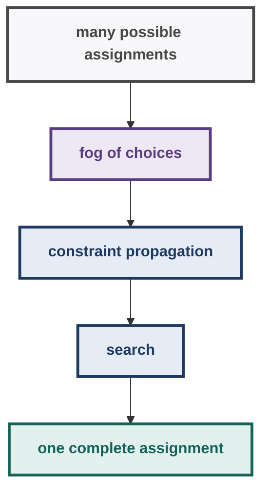

For 6-Queens, for example, we know there is a relation describing legal
placements, but the complete placement is initially implicit.

Solving the CSP **clears the fog**.

------------------------------------------------------------------------

## 12. n-Queens as a CSP

Consider 6-Queens.

Goal:

> Place 6 queens on a 6×6 board so that no two queens attack each other.

### 12.1 Representation 1 --- one variable per square

There are:

$$
6\times6=36
$$

variables.

Each square has:

``` text
Domain = {Queen, NoQueen}
```

Constraints prevent two attacking squares from simultaneously containing
queens.

This representation is possible but cumbersome.

### 12.2 Representation 2 --- one variable per column

A much cleaner representation:

``` text
Variables:
A B C D E F

Domain of each:
{1,2,3,4,5,6}
```

Interpretation:

``` text
A = row of queen in column A
B = row of queen in column B
...
```

Then constraints say that two queens cannot:

1.  occupy the same row;
2.  lie on the same diagonal.

For two columns $i,j$:

$$
X_i \neq X_j
$$

and:

$$
|X_i-X_j| \neq |i-j|
$$

The second condition prevents diagonal attacks.

------------------------------------------------------------------------

## 13. Matching Diagram

A **matching diagram** represents the possible value combinations.

For each variable:

| Variable | Possible values |
|---|---|
| A | 1, 2, 3, 4, 5, 6 |
| B | 1, 2, 3, 4, 5, 6 |
| C | 1, 2, 3, 4, 5, 6 |
| … | … |

Edges connect compatible values.

Example:

- A=1 is compatible with B=3, B=4, B=5, B=6 (four matching-diagram edges, no edge to B=2)

The edge means:

> These two assignments are allowed together.

If:

``` text
A=1
B=2
```

would put queens on the same diagonal, then there is **no edge** between
those values.

------------------------------------------------------------------------

## 14. Why Matching Diagrams Become Huge

For 6-Queens, every variable is related to every other variable.

Therefore the constraint graph is complete:

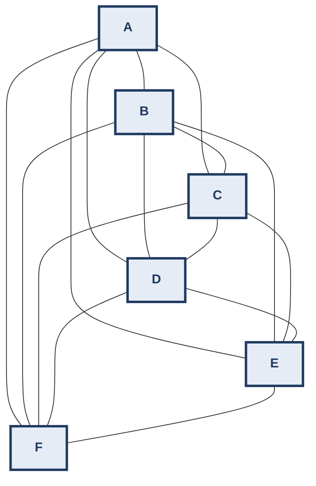

(More accurately, every pair of columns shares a constraint edge.)

The matching diagram therefore becomes visually dense:

- many variables
  - many value pairs
    - many edges
      - combinatorial explosion

The lecturer calls this a **fog of possibilities**.

------------------------------------------------------------------------

## 15. Hand-Solved 6-Queens Solution

The lecture shows one solution:

$$
\boxed{(2,4,6,1,3,5)}
$$

Interpretation:

``` text
A = 2
B = 4
C = 6
D = 1
E = 3
F = 5
```

Board:

``` text
      A B C D E F
1     . . . Q . .
2     Q . . . . .
3     . . . . Q .
4     . Q . . . .
5     . . . . . Q
6     . . Q . . .
```

Check rows:

``` text
2,4,6,1,3,5
```

All distinct.

Check diagonals using:

$$
|X_i-X_j| \neq |i-j|
$$

Examples:

``` text
A=2, B=4:
|2-4| = 2
|A-B| = 1
→ safe

A=2, C=6:
|2-6| = 4
|A-C| = 2
→ safe

B=4, D=1:
|4-1| = 3
|B-D| = 2
→ safe
```

The complete assignment is therefore a solution.

------------------------------------------------------------------------

## 16. Constraint Satisfaction as Search

A CSP solution can be found by search.

The lecturer emphasizes:

> The constraints describe the solution in parts; search extracts the
> complete solution.

This leads naturally to **backtracking search**.

------------------------------------------------------------------------

## 17. Partial Assignment

Let:

``` text
X = {X1,X2,...,XN}
```

Suppose we have assigned only:

``` text
X1 = a1
X2 = a2
```

This is a **partial assignment**.

A partial assignment is:

-   not necessarily a solution;
-   useful if it is consistent with all constraints whose variables have
    already been assigned.

------------------------------------------------------------------------

## 18. Constraint Satisfaction of an Assignment

Suppose:

``` text
A = (a1,a2,...,az)
```

is an assignment to variables:

``` text
Z = {Z1,Z2,...,Zz}
```

For a constraint with scope:

``` text
S ⊆ Z
```

project the assignment onto the scope:

$$
A_S
$$

The assignment satisfies the constraint iff:

$$
A_S \in R_S
$$

A partial assignment is **consistent** if it satisfies every constraint
whose scope is completely covered by the assignment.

A complete consistent assignment is a **solution**.

------------------------------------------------------------------------

## 19. Backtracking Search

Assume a fixed variable ordering:

``` text
X1, X2, ..., XN
```

and each variable has an ordered domain:

``` text
Di = {ai1, ai2, ...}
```

Basic procedure:

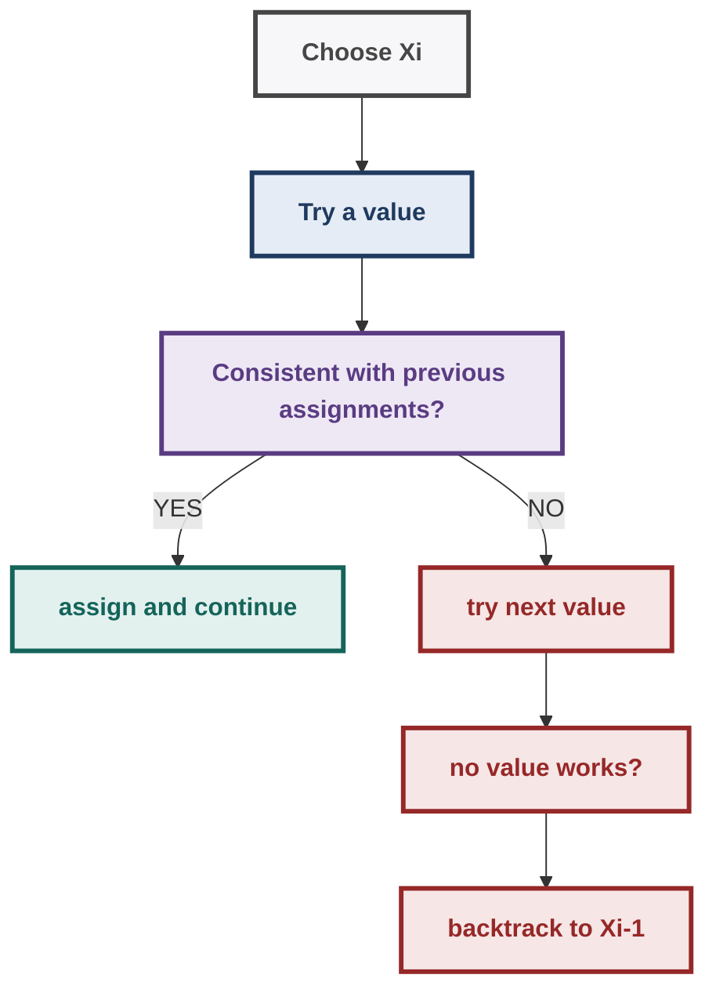

### Core rule

> For each variable, try domain values until a value consistent with the
> earlier assignment is found.

If found:

``` text
Xi = value
→ move to Xi+1
```

If no value works:

``` text
→ move back to Xi-1
```

------------------------------------------------------------------------

## 20. Backtracking Pseudocode

``` text
BACKTRACK(X, D, C):

    A ← empty assignment
    i ← 1

    while 1 ≤ i ≤ N:

        D'i ← copy(Di)

        ai ← SelectValue(D'i, A, C)

        if ai = null:
            i ← i - 1
            remove last value from A

        else:
            add ai to A
            i ← i + 1

    if i < 1:
        return failure

    if i > N:
        return A

    return solution
```

### SelectValue

``` text
SELECTVALUE(D'i, A, C):

    while D'i is not empty:

        ai ← first value of D'i
        remove ai from D'i

        if (A + ai) is consistent:
            return ai

    return null
```

The important implementation idea is that the algorithm uses a
**temporary copy of the domain**, so trying values does not destroy the
original CSP domain.

------------------------------------------------------------------------

## 21. Backtracking = Depth-First Search

The lecture explicitly interprets backtracking as a depth-first search
over assignments.

Example:

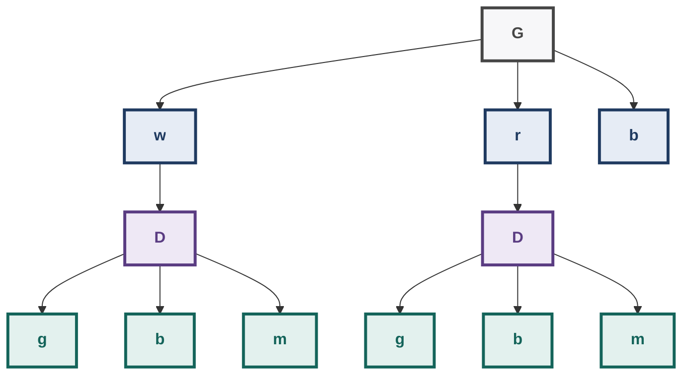

The algorithm:

1.  explores one branch;
2.  reaches a contradiction;
3.  returns to the most recent variable;
4.  tries another value.

It therefore behaves like DFS.

------------------------------------------------------------------------

## 22. Backtracking Termination

Two important termination cases.

### Failure

All values of the first variable have been exhausted:

``` text
X1:
 a → failure
 b → failure
 c → failure
 ...
```

Then:

$$
\boxed{\text{No solution exists}}
$$

### Success

A value has been assigned to every variable:

``` text
X1 = a1
X2 = a2
...
XN = aN
```

and all constraints are satisfied.

Then:

$$
\boxed{\text{Solution found}}
$$

------------------------------------------------------------------------

## 23. Hand-Tracing Backtracking

Suppose:

``` text
A = {1,2}
B = {1,2}
Constraint:
A ≠ B
```

Trace:

- Try A=1
  - Try B=1
    - A=B → violates constraint
      - Try B=2
        - A=1, B=2 ✓

Solution:

$$
\boxed{(A,B)=(1,2)}
$$

If the first value had failed, backtracking would try the next value.

------------------------------------------------------------------------

## 24. Realistic Example: Exam Timetable

Suppose:

``` text
Variables:
AI, ML, DBMS, OS

Domain:
{Mon-9, Mon-11, Tue-9}
```

Constraint:

``` text
AI ≠ ML
AI ≠ DBMS
```

Additional resource constraints:

``` text
same faculty → no overlapping exams
same batch → no overlapping exams
```

A naive search explores combinations.

CSP reasoning instead detects conflicts as soon as enough variables have
been assigned.

This is the recurring theme of Week 11:

``` text
Don't wait until a complete solution
to discover that a partial assignment is impossible.
```

------------------------------------------------------------------------

## 25. Fighting Combinatorial Explosion

The central practical problem is:

$$
\text{number of assignments}
\approx
\prod_i |D_i|
$$

If:

``` text
N variables
k values each
```

then the naive number of complete assignments is:

$$
k^N
$$

This grows rapidly.

The Week 11 toolkit attacks this in several ways:

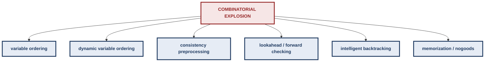

------------------------------------------------------------------------

## 26. Variable Ordering

One approach is to decide **which variable to assign first**.

### Min-induced-width idea

The lecture describes the basic intuition:

> Choose a variable with many connections first because it influences
> many other variables.

So a high-degree variable is considered early.

- X constrains A, B and C; A in turn constrains further variables, so assigning X early propagates restrictions widely

If X constrains many variables, assigning it early can propagate
restrictions widely.

### Important distinction

This is based on **graph structure**.

------------------------------------------------------------------------

## 27. Dynamic Variable Ordering

A second strategy:

> Choose the variable with the smallest current domain first.

This is the familiar **fail-first** intuition.

Suppose:

``` text
A: {r,g,b}       → 3 values
B: {r}           → 1 value
C: {r,g}         → 2 values
```

Choose:

$$
\boxed{B}
$$

first.

Why?

Because B has almost no flexibility. If B is going to cause failure, we
want to discover it early.

- small domain
  - highly constrained
    - assign early
      - failure discovered early

------------------------------------------------------------------------

## 28. Min-Induced-Width vs Dynamic Ordering

| Strategy | What it examines | Basic intuition |
|---|---|---|
| Min-induced-width style | Constraint graph | Highly connected variables influence many others |
| Dynamic variable ordering | Current domain sizes | Most constrained variable should be tried first |

These are **variable-ordering strategies**.

They are different from choosing **which value** to try first.

That distinction becomes important in lookahead search.

------------------------------------------------------------------------

## 29. Consistency Before Search

Instead of immediately searching:

- CSP
  - Backtracking
    - huge tree

we can preprocess:

- CSP
  - Consistency enforcement
    - pruned domains
      - smaller search
        - Backtracking

The idea:

> Remove values that are already impossible before search wastes effort
> exploring them.

------------------------------------------------------------------------

## 30. Arc Consistency

Consider a binary constraint between X and Y:

``` text
X ───── Y
```

Variable X is **arc-consistent with respect to Y** iff:

> For every value `a ∈ D_X`, there exists at least one value `b ∈ D_Y`
> such that `(a,b)` satisfies the relation.

Formally:

$$
\forall a\in D_X,\quad
\exists b\in D_Y:
(a,b)\in R_{XY}
$$

The value `b` is called a **support** for `a`.

------------------------------------------------------------------------

## 31. Intuition Behind Arc Consistency

Suppose:

``` text
D_X = {1,2,3}
D_Y = {1,2}

Constraint:
X < Y
```

Check X values.

### X = 1

Need:

``` text
1 < y
```

Possible:

``` text
y=2 ✓
```

So `1` has support.

### X = 2

Need:

``` text
2 < y
```

But Y has only:

``` text
1,2
```

No support.

Therefore:

``` text
2 ✗
```

Remove it.

### X = 3

Need:

``` text
3 < y
```

No support.

Remove it.

Result:

``` text
D_X = {1}
D_Y = {1,2}
```

X is now arc-consistent with respect to Y.

------------------------------------------------------------------------

## 32. Important: Arc Consistency Is Directional

The statement:

``` text
X is arc-consistent with respect to Y
```

is not automatically the same as:

``` text
Y is arc-consistent with respect to X
```

For an **edge** to be arc-consistent, both directions must hold:

``` text
X → Y
Y → X
```

So:

$$
\boxed{\text{Arc-consistent edge}
=
\text{X wrt Y AND Y wrt X}}
$$

------------------------------------------------------------------------

## 33. REVISE(X,Y)

The central operation is:

``` text
REVISE(X,Y)
```

Its job is to remove values from `D_X` that have no support in `D_Y`.

### Pseudocode

``` text
REVISE(X,Y):

    revised ← false

    for each a in D_X:

        if there is NO b in D_Y
           such that (a,b) ∈ R_XY:

            delete a from D_X
            revised ← true

    return revised
```

The key phrase:

> **No support → delete.**

------------------------------------------------------------------------

## 34. Hand-Solved REVISE Example

Given:

``` text
D_X = {1,2,3,4}
D_Y = {2,4}

Constraint:
X < Y
```

Check each X value.

| `a ∈ D_X` | Possible support in `D_Y`? | Result |
|---|---|---|
| 1 | 1<2 ✓ | Keep |
| 2 | 2<4 ✓ | Keep |
| 3 | 3<4 ✓ | Keep |
| 4 | 4<2/4 ✗ | Delete |

Therefore:

$$
D_X=\{1,2,3\}
$$

------------------------------------------------------------------------

## 35. The Cascading Effect

This is one of the most important ideas.

Suppose:

``` text
A ─ B ─ C
```

and we revise:

``` text
REVISE(B,C)
```

If values are removed from B, then values in A may lose their only
support.

Therefore:

``` text
C changes B
B changes A
```

Conceptually:

- C
  - B
    - A

This is **constraint propagation**.

A single domain deletion can cause further deletions elsewhere.

------------------------------------------------------------------------

## 36. Why One Pass Is Not Enough

Suppose we do:

``` text
REVISE(A,B)
REVISE(B,A)
REVISE(B,C)
REVISE(C,B)
```

once.

A later deletion may invalidate an earlier result.

Therefore:

> One cycle of `REVISE` calls is not necessarily enough.

We must continue until no domain changes occur.

This motivates **AC-1**.

------------------------------------------------------------------------

## 37. AC-1

The lecturer describes AC-1 as a simple but somewhat brute-force
algorithm.

### Algorithm

``` text
AC-1(X,D,C):

    repeat

        for each edge (X,Y):

            REVISE(X,Y)
            REVISE(Y,X)

    until no domain changes in the cycle
```

### Mental model

``` text
repeat:
    scan EVERYTHING
    revise EVERYTHING
until:
    nothing changed
```

It is correct but may do unnecessary work.

------------------------------------------------------------------------

## 38. AC-1 Complexity

Let:

-   `n` = number of variables
-   `e` = number of edges
-   `k` = maximum domain size

`REVISE` takes:

$$
O(k^2)
$$

because, in the straightforward implementation, each value in one domain
may be compared against values in the other.

One full cycle:

$$
O(ek^2)
$$

In the worst case, the lecturer derives approximately:

$$
O(nek^3)
$$

because up to roughly `nk` domain-value deletions may require another
cycle.

### Exam note

The important course-level point is:

> **AC-1 repeatedly scans all edges even when only a small part of the
> network changed.**

That motivates AC-3.

------------------------------------------------------------------------

## 39. AC-1 on Map Colouring

Suppose:

``` text
D = {Blue, Green, Red}
```

and two neighbouring regions cannot have the same colour.

Suppose:

``` text
D_C = {Blue}
D_D = {Blue, Green, Red}
```

For:

``` text
REVISE(D,C)
```

the value:

``` text
D = Blue
```

has no support because C is also Blue.

Therefore:

``` text
Blue removed from D
```

Now:

``` text
D_D = {Green, Red}
```

That change may affect another neighbour of D.

So the effect propagates.

------------------------------------------------------------------------

## 40. Arc Consistency Can Produce Backtrack-Free Search

The lecture gives a map-colouring example where consistency enforcement
prunes the domains until a solution can be constructed without
backtracking.

Important qualification:

> This happens for some CSPs, not all CSPs.

In general:

``` text
arc consistency
≠
complete solution
```

It is a pruning mechanism.

------------------------------------------------------------------------

## 41. Logical Reasoning = Constraint Propagation

Consider:

``` text
P
P → Q
Q → R
R → S
```

with:

``` text
P = True
```

Logical reasoning gives:

- P=True
  - Q=True
    - R=True
      - S=True

The lecture demonstrates that the same result emerges through arc
consistency.

Initial domains:

``` text
P = {T}
Q = {T,F}
R = {T,F}
S = {T,F}
```

For the implication constraint:

``` text
P → Q
```

the allowed pairs are:

``` text
(T,T)
(F,T)
(F,F)
```

The pair:

``` text
(T,F)
```

is forbidden.

Since:

``` text
P = T
```

Q must be:

``` text
Q = T
```

Then the same propagation occurs:

``` text
Q=T
→ R=T
→ S=T
```

Thus:

``` text
logical entailment
        ≈
constraint propagation
```

This is one of the most conceptually important Week 11 connections.

------------------------------------------------------------------------

## 42. AC-3: Constraint Propagation

AC-3 improves AC-1 by remembering **which arcs may have become invalid
because of a domain change**.

Suppose:

``` text
A ─ B ─ C
```

and:

``` text
REVISE(B,C)
```

removes something from B.

Which other relation might now be invalid?

``` text
A ↔ B
```

There is no reason to restart the entire network.

We only need to revisit constraints involving the changed variable.

------------------------------------------------------------------------

## 43. AC-3 Queue

AC-3 maintains a queue:

``` text
Q = arcs still requiring checking
```

Initially, both directions of every edge are placed into the queue.

For:

``` text
A ─ B
B ─ C
```

initially:

``` text
Q = [
    (A,B),(B,A),
    (B,C),(C,B)
]
```

------------------------------------------------------------------------

## 44. AC-3 Algorithm

``` text
AC-3(X,D,C):

    Q ← empty queue

    for each edge (N,M):

        add (N,M) to Q
        add (M,N) to Q

    while Q is not empty:

        (P,T) ← remove head(Q)

        revised ← REVISE(P,T)

        if D_P changed:

            for each R ≠ T
            where (R,P) is an edge:

                add (R,P) to Q
```

The crucial rule is:

> **If P changes, reconsider only the neighbours of P other than T.**

------------------------------------------------------------------------

## 45. Why AC-3 Is Better Than AC-1

### AC-1

- Something changes
  - rescan ALL edges

### AC-3

- Something changes at P
  - which neighbours depend on P?
    - recheck only those arcs

Visual:

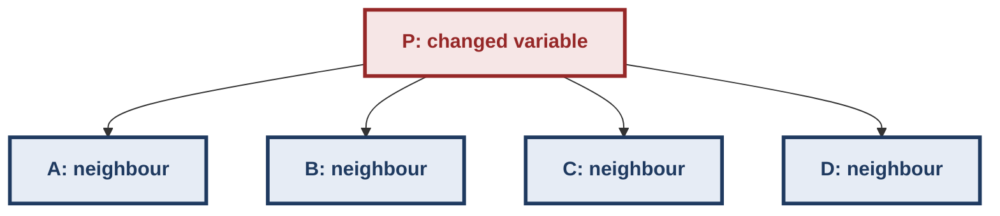

If `D_P` changes, AC-3 rechecks relevant arcs pointing toward P.

It does **not** blindly restart the entire network.

------------------------------------------------------------------------

## 46. AC-3 Complexity

The course lecture gives:

$$
\boxed{O(ek^3)}
$$

for the standard worst-case bound discussed.

The important comparison is:

``` text
AC-1
Brute-force repeated scanning

AC-3
Queue-based propagation
```

Do not incorrectly claim that AC-3 necessarily has a better worst-case
asymptotic bound than every implementation of AC-1. The course's point
is primarily that AC-3 avoids unnecessary rescanning.

------------------------------------------------------------------------

## 47. AC-1 vs AC-3

| Property | AC-1 | AC-3 |
|---|---|---|
| Main idea | Repeatedly scan all edges | Maintain queue of relevant arcs |
| Data structure | Repeated full scans | Queue |
| Propagation | Global rescanning | Change-directed |
| Unnecessary work | High | Lower |
| Worst-case course bound | (O(nek^3)) | (O(ek^3)) |
| Core insight | "Keep checking" | "Only revisit affected neighbours" |

------------------------------------------------------------------------

## 48. AC-3 Worked Propagation Example

Consider:

``` text
A ─ B ─ C
```

Domains:

``` text
A = {1,2,3}
B = {1,2,3}
C = {3}
```

Constraint on each edge:

``` text
X ≠ Y
```

Start:

``` text
C = {3}
```

### Step 1: REVISE(B,C)

B values:

``` text
1 → support C=3 ✓
2 → support C=3 ✓
3 → no support ✗
```

Therefore:

``` text
B = {1,2}
```

### Step 2: B changed

AC-3 now revisits the other neighbour:

``` text
REVISE(A,B)
```

For:

``` text
A=1
```

B has support:

``` text
B=2 ✓
```

For:

``` text
A=2
```

B has support:

``` text
B=1 ✓
```

For:

``` text
A=3
```

B has support:

``` text
B=1 or 2 ✓
```

So A does not change.

Final:

``` text
A = {1,2,3}
B = {1,2}
C = {3}
```

No unnecessary global restart was needed.

------------------------------------------------------------------------

## 49. The Waltz Algorithm

The course now connects CSP machinery to **computer vision**.

Problem:

> Given a line drawing, determine whether it represents a physically
> possible object and interpret the edges.

This is a classic demonstration that CSPs are not merely abstract
puzzles.

------------------------------------------------------------------------

## 50. Huffman's Line-Drawing Problem

Huffman considered **trihedral objects**.

A trihedral object has:

-   three planes meeting at a vertex;
-   equivalently, three edges meeting at a vertex.

Assumptions in the original formulation:

-   solid objects;
-   no shadows;
-   no cracks;
-   normal viewpoint;
-   no exceptional viewpoint.

The goal is to determine whether a line drawing corresponds to a valid
trihedral object.

------------------------------------------------------------------------

## 51. Four Edge Labels

The lecture uses four edge types.

### 51.1 Convex edge `+`

Material forms a convex boundary.

Intuitively:

``` text
       /
      /
-----/
```

A cube's outward corners are convex.

### 51.2 Concave edge `-`

Material forms a hollow/recessed boundary.

A corner of a room is the useful intuition.

``` text
\      /
 \    /
  \__/
```

### 51.3 Arrow

An arrow represents an edge where only one side's surface information is
visible.

Convention:

> **The material is on the right side as you travel in the direction of
> the arrow.**

So arrow direction is not arbitrary.

``` text
travel →
material is on the right
```

The same physical edge can therefore receive one of two arrow directions
depending on which face is visible.

------------------------------------------------------------------------

## 52. Important Arrow Clarification

A student in the lecture asks about arrows.

The lecturer's clarification:

-   if both faces around an edge are visible, classify it as convex or
    concave;
-   if only one face is visible, use an arrow;
-   orient the arrow so that the visible material is on the **right-hand
    side** while travelling along the arrow.

This is an exam-relevant convention.

------------------------------------------------------------------------

## 53. Junction Types

The physical geometry imposes strong restrictions.

Not every combination of:

``` text
+, -, →, ←
```

is physically possible.

The lecturer discusses the familiar junction categories:

-   Y / fork
-   W
-   T
-   L

Huffman's formulation has about **18 physically possible junction
configurations** under the stated assumptions.

The important idea is not memorizing arbitrary combinations; it is
understanding that each junction has a **restricted domain of legal
labels**.

------------------------------------------------------------------------

## 54. Y-Junction

A Y-junction has three edges meeting.

The lecture describes the physically possible patterns as including:

``` text
(+,+,+)
(-,-,-)
(-,→,→)
```

up to orientation/permutation conventions.

An arbitrary combination such as:

``` text
(+,-,+)
```

is not physically realizable for the stated trihedral model.

------------------------------------------------------------------------

## 55. W-Junction

The W-shaped junction has restricted possibilities such as:

``` text
(+,-,+)
(-,+,-)
(→,+,→)
```

again subject to orientation conventions.

The key principle:

> The local geometry gives each junction a small domain of legal label
> combinations.

That is exactly what makes the problem a CSP.

------------------------------------------------------------------------

## 56. T- and L-Junctions

The lecture also discusses T and L junctions.

T-junctions can have several arrow/convex/concave combinations.

L-junctions are associated with two visible edge continuations and
similarly have a restricted set of legal labelings.

Different textbooks may count the configurations slightly differently
depending on whether symmetric/orientation variants are grouped
together.

The course's key statement is:

> There are only certain combinations of labels allowed; the physically
> valid junctions form a small finite domain.

------------------------------------------------------------------------

## 57. Waltz CSP Formulation

This is the crucial abstraction.

- CSP variable: a junction/vertex in the drawing
- Domain: physically possible label combinations for that junction
- Constraint: shared edge must receive the SAME label at both endpoints

Example:

- V1 and V2 share a physical edge; if V1 labels its end `+`, V2 must label its end `+` as well

If V1 labels the shared edge as `+`, V2 must also label that same edge
`+`.

Therefore:

$$
\boxed{\text{same physical edge} \Rightarrow
\text{same label at both endpoints}}
$$

------------------------------------------------------------------------

## 58. Why Waltz Is Constraint Propagation

Suppose a junction initially has:

``` text
10 possible configurations
```

After a neighbouring junction is constrained, only:

``` text
4 configurations
```

remain.

That reduction may constrain another neighbour:

- V1
  - V2
    - V3
      - V4

This is precisely constraint propagation.

The lecturer describes Waltz as lying conceptually somewhere between the
brute-force style of AC-1 and the more targeted propagation of AC-3.

------------------------------------------------------------------------

## 59. Visualizing Waltz Propagation

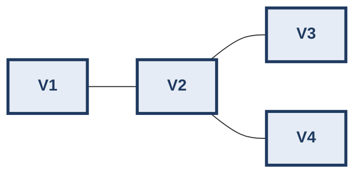

Domain sizes shrink through propagation:

- Initial: V1, V2, V3, V4 all hold many label combinations
- After local constraints: V1 holds 3, V2 holds 5, V3 holds 2, V4 holds 4
- After further propagation: V1 holds 1, V2 holds 2, V3 holds 1, V4 holds 1

The "fog" of possible interpretations gradually disappears.

------------------------------------------------------------------------

## 60. Waltz and Shadows/Cracks

David Waltz extended Huffman's work.

The extended setting allows:

-   vertices with more than three edges;
-   cracks;
-   shadows;
-   more complex scenes.

The number of possible edge labels/junction configurations therefore
increases substantially.

The lecture notes that the number of valid vertex combinations can rise
from the small trihedral set to **thousands**.

Yet the same basic principle remains:

- local constraints
  - propagate
    - remove impossible interpretations
      - resolve the drawing

------------------------------------------------------------------------

## 61. Waltz Video: What to Observe

The lecture's visual example shows a block-like object with shadows.

The displayed numbers represent the **number of possible vertex
combinations remaining**.

As propagation proceeds:

``` text
80-ish possibilities
       ↓
many possibilities removed
       ↓
~2 possibilities
       ↓
1 possibility
```

The important observation is that constraints propagate **vertex to
vertex**.

Eventually:

-   shadow edges can be eliminated;
-   physically consistent object edges remain.

This is a concrete demonstration of CSP pruning.

------------------------------------------------------------------------

## 62. Arc Consistency on Waltz

The Arc Consistency lecture revisits a simple line-drawing network.

At a central vertex `V4`, after consistency enforcement, only
configurations such as:

``` text
(+,+,+)
```

or:

``` text
(-,-,-)
```

may survive, depending on the surrounding constraints.

Other combinations lose support and disappear.

This is exactly the same operation as:

``` text
REVISE(X,Y)
```

from the abstract CSP setting.

The difference is only the **meaning of variables and domains**.

------------------------------------------------------------------------

## 63. CSP Abstraction Across Domains

The same algorithm can operate on very different problems:

| Problem | Variable | Domain | Constraint |
|---|---|---|---|
| Map colouring | Region | Colours | Adjacent regions differ |
| n-Queens | Column | Row | No row/diagonal attack |
| Timetabling | Course | Slot/room/faculty | No clashes |
| Waltz | Junction | Legal edge-label configurations | Shared edges agree |
| Diagnosis | Component status | OK/abnormal | Model + observations consistent |

This is one of the deepest lessons of the week:

> **The solver does not need to understand the application semantically
> if the problem is correctly encoded as a CSP.**

------------------------------------------------------------------------

## 64. i-Consistency

Arc consistency is part of a broader hierarchy.

A network is **i-consistent** if:

> Any consistent assignment to `i−1` variables can be consistently
> extended to `i` variables.

Formally:

$$
\boxed{
(i-1)\text{ assigned consistently}
\Rightarrow
\text{can extend to }i\text{ variables}
}
$$

------------------------------------------------------------------------

## 65. 1-Consistency

Also called **node consistency**.

It concerns individual variables.

Only values that satisfy the unary constraints remain in the domain.

Example:

``` text
P ∈ {True, False}
```

but the CSP contains:

``` text
P = True
```

Then node consistency gives:

``` text
P = {True}
```

------------------------------------------------------------------------

## 66. 2-Consistency = Arc Consistency

For:

``` text
X ─ Y
```

every allowed value of X must have some compatible value in Y.

Likewise in the other direction.

Thus:

$$
\boxed{2\text{-consistency} = \text{arc consistency}}
$$

------------------------------------------------------------------------

## 67. 3-Consistency = Path Consistency

3-consistency says:

> Any consistent assignment to two variables can be extended to a third
> variable.

In a matching diagram:

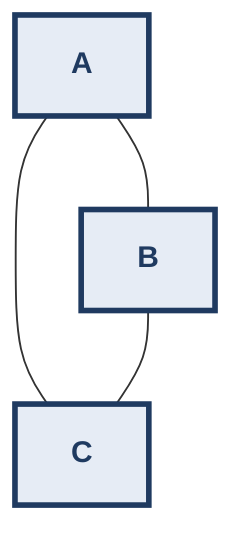

Every compatible edge between two variables should be extendable to a
compatible value in the third variable.

A useful mental rule:

``` text
2-consistency:
edge must have support

3-consistency:
edge must extend to triangle
```

------------------------------------------------------------------------

## 68. Hand-Solved Path-Consistency Intuition

Suppose:

``` text
A=a
B=b
```

and:

``` text
(a,b)
```

is allowed.

To satisfy 3-consistency, there must exist some:

``` text
C=c
```

such that:

``` text
(a,c) allowed
(b,c) allowed
```

If no such `c` exists:

``` text
(a,b)
```

is locally legal but cannot participate in any 3-variable extension.

Therefore the pair must be removed when enforcing path consistency.

------------------------------------------------------------------------

## 69. Example of Failure of Path Consistency

Suppose (value labels are lowercase so they cannot be confused
with the variable names):

``` text
A values: {a1}
B values: {b1}
C values: {c1,d1}
```

and:

``` text
A=a1 compatible with B=b1
A=a1 compatible with C=c1 (but NOT with C=d1)
B=b1 compatible with C=d1
```

but:

``` text
B=b1 is NOT compatible with C=c1
```

Then:

``` text
(a1,b1)
```

may be allowed between A and B, but there is no single C-value
compatible with both (`c1` fails B, `d1` fails A).

Therefore the edge:

``` text
A=a1 ─ B=b1
```

cannot extend to a triangle.

The network is not path-consistent.

------------------------------------------------------------------------

## 70. Higher-Order Consistency

For `n` variables:

``` text
1-consistent
2-consistent
3-consistent
...
n-consistent
```

n-consistency means:

> Any assignment to `n−1` variables can be extended to the final
> variable.

------------------------------------------------------------------------

## 71. Strong n-Consistency

A network is **strongly n-consistent** if it is:

``` text
1-consistent
2-consistent
3-consistent
...
n-consistent
```

all at once.

The lecture makes an important observation:

> If a network is strongly n-consistent, search can proceed without
> backtracking.

Why?

Because every consistent partial assignment can always be extended.

------------------------------------------------------------------------

## 72. Consistency vs Backtracking Trade-Off

Increasing consistency generally means:

- higher preprocessing cost
  - more pruning
    - smaller search
      - less backtracking

But consistency enforcement is not free.

So:

$$
\boxed{
\text{more preprocessing}
\leftrightarrow
\text{less search}
}
$$

This is a recurring algorithm-design trade-off.

------------------------------------------------------------------------

## 73. PC-2 and AC-4

The lecturer briefly mentions algorithms that are not developed in
detail.

### PC-2

An algorithm for path consistency.

### AC-4

A more efficient arc-consistency algorithm.

The lecture states that AC-4 has a complexity of approximately:

$$
O(ek^2)
$$

compared with the course's AC-3 bound:

$$
O(ek^3)
$$

These algorithms are mentioned for perspective rather than developed
algorithmically in Week 11.

> **Exam trap:** Do not confuse an algorithm being mentioned with an
> algorithm being taught in detail.

------------------------------------------------------------------------

## 74. Constraint Processing as a General Framework

The lecture asks us to step back.

Problems that can be posed as CSPs include:

-   SAT as a special case;
-   map colouring;
-   scheduling;
-   timetabling;
-   planning;
-   consistency-based diagnosis;
-   configuration;
-   many other combinatorial problems.

The overall architecture is:

- Real-world problem
  - CSP formulation
    - general-purpose solver
      - solution

The application-specific work is largely in the **modeling**.

------------------------------------------------------------------------

## 75. SAT as a CSP

SAT can be viewed as a CSP where:

``` text
Domain of each variable = {True, False}
```

and constraints encode logical formulas.

Thus:

- SAT
  - Boolean CSP

This demonstrates the generality of the CSP framework.

------------------------------------------------------------------------

## 76. Planning as CSP

The lecture also notes that planning can be formulated as a CSP.

Even structures such as planning graphs can be interpreted in constraint
terms.

A planning system such as SATPLAN converts planning problems into SAT
formulations.

Therefore:

- planning
  - constraint formulation
    - SAT/CSP solver

This connects Week 11 back to the planning material from Week 8.

------------------------------------------------------------------------

## 77. Model-Based Diagnosis

A particularly important application in Week 11 is **model-based
diagnosis**, also called **consistency-based diagnosis**.

The basic problem:

> A device is not behaving as predicted. Which components could be
> faulty?

Architecture:

- Component library + Device structure
  - Device model
    - Predicted behaviour
      - Compare with observations
        - Inconsistency?
          - Diagnosis

------------------------------------------------------------------------

## 78. Component Models

Suppose we have a multiplier:

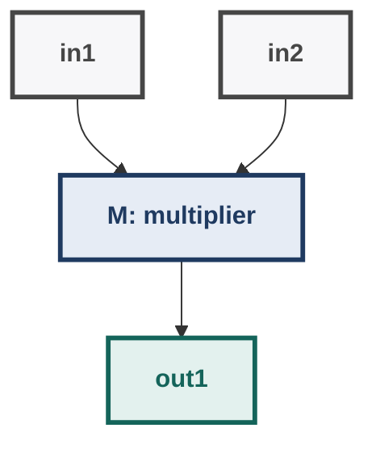

If M is functioning correctly:

$$
ok(M)\Rightarrow out1=in1\times in2
$$

Example:

``` text
in1 = 7
in2 = 5
```

Then if M is OK:

$$
out1=7\times5=35
$$

------------------------------------------------------------------------

## 79. Implication as a Constraint

The component model:

$$
ok(M)\Rightarrow out1=in1\times in2
$$

can be interpreted as a logical constraint.

Recall:

$$
P\Rightarrow Q
\equiv
\neg P\lor Q
$$

This gives a direct connection between:

``` text
logic
↔
constraints
```

The multiplier therefore becomes a constraint relation over:

``` text
ok(M), in1, in2, out1
```

------------------------------------------------------------------------

## 80. Adder Model

Similarly:

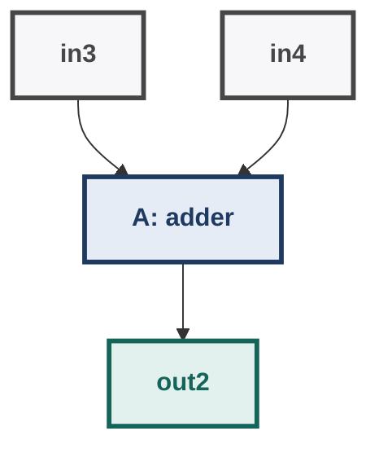

If A is OK:

$$
ok(A)\Rightarrow out2=in3+in4
$$

------------------------------------------------------------------------

## 81. Device Structure

Suppose a multiplier feeds an adder:

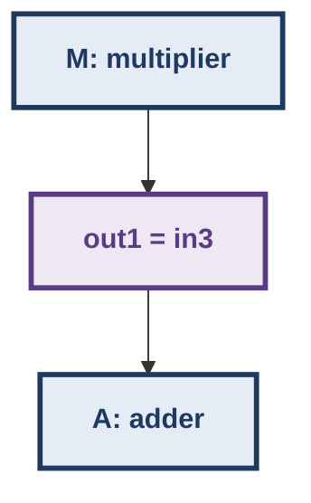

The structural connection itself is represented as:

$$
out1=in3
$$

Thus the complete device model consists of:

- component constraints
  - connection constraints
    - complete device model

------------------------------------------------------------------------

## 82. Diagnosis Example from the Lecture

The lecture's main device contains:

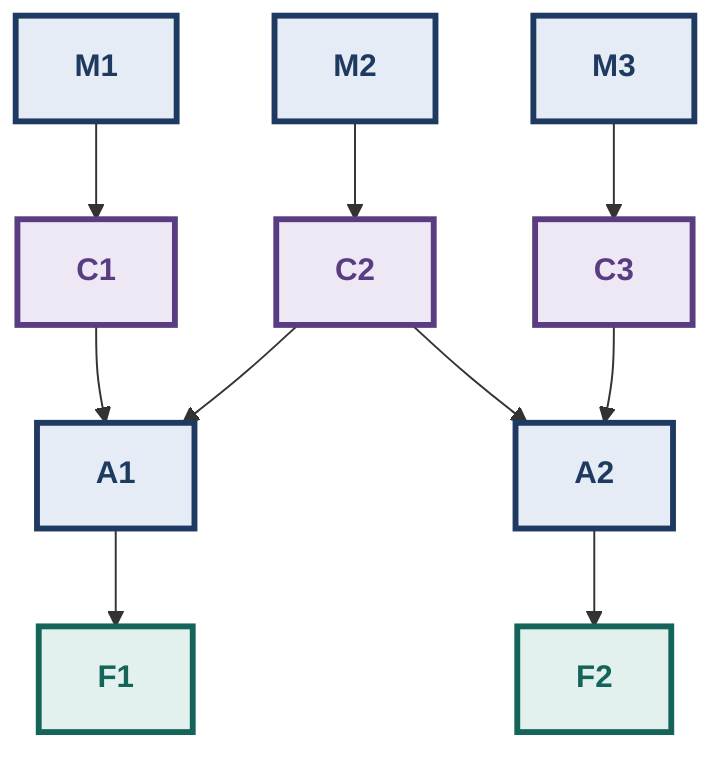

More specifically:

-   3 multipliers;
-   2 adders;
-   inputs are known;
-   outputs can be predicted.

Given:

``` text
all A inputs = 3
all B inputs = 2
```

each multiplier should produce:

$$
3\times2=6
$$

So:

``` text
C1 = 6
C2 = 6
C3 = 6
```

The adders then produce:

$$
6+6=12
$$

Therefore the expected outputs are:

``` text
F1 = 12
F2 = 12
```

------------------------------------------------------------------------

## 83. Observed Fault

Suppose instead:

``` text
Observed:
F1 = 10
F2 = 12
```

Then:

``` text
Prediction: F1=12
Observation: F1=10
```

Therefore:

$$
\boxed{\text{The device model and observation are inconsistent.}}
$$

We know a fault exists under the model assumptions.

------------------------------------------------------------------------

## 84. Assumption: Components Can Fail, Connections Cannot

For the lecture's example:

> Components may fail, but connections are assumed not to fail.

Thus:

``` text
wire C1 → D1
wire C2 → E1
...
```

is assumed reliable.

Possible faults therefore lie among:

``` text
M1, M2, M3, A1, A2
```

This modeling assumption is crucial.

Change the assumption, and the diagnosis space changes.

------------------------------------------------------------------------

## 85. Diagnosis as a CSP

Introduce status variables:

``` text
M1 = OK / AB
M2 = OK / AB
M3 = OK / AB
A1 = OK / AB
A2 = OK / AB
```

where:

``` text
AB = abnormal
```

and:

``` text
OK = not abnormal
```

The device model plus observed values form a CSP.

The goal is to find assignments to component-status variables that
restore consistency.

------------------------------------------------------------------------

## 86. Why a Single Fault May Not Be Unique

From:

``` text
F1 = 10
```

we know at least one relevant component is abnormal.

But several possibilities can explain the observation.

For example:

``` text
M1 faulty
M2 faulty
A1 faulty
```

may all be individually plausible under partial evidence.

Therefore:

> Diagnosis is not necessarily a unique answer.

Additional observations may be required.

------------------------------------------------------------------------

## 87. Candidate Diagnosis Space

With 5 potentially faulty components, every subset is a candidate:

$$
2^5=32
$$

possible fault sets.

Conceptually:

- all 5 faulty
  - 4-fault, 3-fault, and other large subsets
    - 2-fault subsets
      - 1-fault subsets
        - no fault (the empty set)

The empty set means:

``` text
nothing is faulty
```

For a malfunctioning device, that candidate is inconsistent with the
observation.

The goal is generally to find **minimal diagnoses**, rather than saying
"everything could be broken."

------------------------------------------------------------------------

## 88. Occam's Razor in Diagnosis

The lecture invokes:

> **The simplest explanation is the best.**

This means a single fault is preferred over a two-fault explanation when
both explain the observations, all else being equal.

But this is an assumption/principle, not a logical theorem that makes
the diagnosis unique.

For example:

``` text
Diagnosis 1 = {M1}
Diagnosis 2 = {M2,A2}
```

If both explain the observations, the first is simpler.

------------------------------------------------------------------------

## 89. Conflict Sets

Suppose the model and observations imply:

``` text
M1 = OK
M2 = OK
A1 = OK
```

cannot all simultaneously hold.

Then we have a **conflict**:

$$
\boxed{\{M1,M2,A1\}}
$$

meaning:

> At least one member of this set must be faulty.

This is a very important diagnostic abstraction.

------------------------------------------------------------------------

## 90. From Conflict to Diagnosis

If:

``` text
Conflict C1 = {M1,M2,A1}
```

then any diagnosis must contain at least one element of C1.

Possible minimal candidates after only C1:

``` text
{M1}
{M2}
{A1}
```

We cannot yet distinguish among them.

------------------------------------------------------------------------

## 91. A Second Conflict

The lecture derives another conflict:

$$
C_2=\{A1,A2,M1,M3\}
$$

Now a valid diagnosis must **hit both conflicts**.

That gives the concept of a **hitting set**.

------------------------------------------------------------------------

## 92. Hitting Set

A set H is a hitting set of conflicts if:

$$
H\cap C_i\neq\emptyset
$$

for every conflict $C_i$.

For:

``` text
C1 = {M1,M2,A1}
C2 = {A1,A2,M1,M3}
```

consider:

``` text
H = {M1}
```

Check:

``` text
H ∩ C1 = {M1} ✓
H ∩ C2 = {M1} ✓
```

Therefore:

``` text
{M1}
```

is a diagnosis candidate.

Likewise:

``` text
{A1}
```

hits both conflicts.

------------------------------------------------------------------------

## 93. Why M2 Alone Fails

Consider:

``` text
H = {M2}
```

Then:

``` text
H ∩ C1 = {M2} ✓
H ∩ C2 = ∅ ✗
```

Therefore M2 alone does not explain both conflicts.

This is a subtle but important diagnostic reasoning step.

------------------------------------------------------------------------

## 94. Other Diagnoses

The lecture identifies possibilities including:

``` text
{M1}
{A1}
{M2,M3}
{M2,A2}
```

Without additional observations, the system cannot necessarily identify
one unique physical fault.

This is exactly why **additional tests** are useful.

------------------------------------------------------------------------

## 95. Diagnosis Workflow

- Observed abnormal behaviour
  - Build device model
    - Add observations as constraints
      - Find inconsistency
        - Extract conflicts
          - Find minimal hitting sets
            - Candidate diagnoses
              - Additional measurements
                - Narrow diagnosis

This is a very general reasoning architecture.

------------------------------------------------------------------------

## 96. Tricky Real-World Diagnosis Example

Consider a server cluster:

- Client
  - Load Balancer
    - API Server
      - Database

Observed:

``` text
API request latency = 10 s
Database health check = OK
```

Possible causes:

``` text
Load balancer
API server
Network path
Database query layer
```

A naive approach blames the database because the API is slow.

A model-based approach asks:

``` text
What should happen if every component is OK?
```

Then incorporates actual observations.

If the database's measured response is normal, that observation
constrains the diagnosis space.

The lesson is:

> **Diagnosis is not "guess the component." It is consistency reasoning
> over a model plus observations.**

------------------------------------------------------------------------

## 97. Constraint Processing and Real Systems

The same CSP architecture appears in:

### Scheduling

``` text
variables = jobs
domains = time/resource assignments
constraints = conflicts/capacity/dependencies
```

### Configuration

``` text
variables = component choices
domains = available options
constraints = compatibility rules
```

### Computer vision

``` text
variables = junction interpretations
domains = geometric interpretations
constraints = physical consistency
```

### Diagnosis

``` text
variables = component states
domains = OK/abnormal
constraints = device model + observations
```

This is why CSP is described as a **general-purpose formalism**.

------------------------------------------------------------------------

## 98. Lookahead Search

Consistency can be applied:

### Before search

- CSP
  - AC-3
    - smaller CSP
      - search

or:

### During search

- assign value
  - look into future
    - prune future domains
      - continue / backtrack early

The second idea is **lookahead search**.

------------------------------------------------------------------------

## 99. Why Lookahead?

Ordinary backtracking does:

- try value
  - continue
    - discover failure much later
      - backtrack

Lookahead asks:

> "If I choose this value now, what damage will it cause to the
> remaining variables?"

Therefore:

- current choice
  - inspect future
    - estimate conflicts
      - choose/prune intelligently

------------------------------------------------------------------------

## 100. Forward Checking

The lecture introduces **forward checking** as a lookahead method.

After assigning a variable:

``` text
Xi = ai
```

look at every related future variable and remove values that are now
inconsistent with the assignment.

Example:

``` text
A = Red
```

and:

``` text
B ≠ A
C ≠ A
```

Then:

``` text
D_B ← D_B - {Red}
D_C ← D_C - {Red}
```

This is done immediately rather than waiting for B or C to be assigned.

------------------------------------------------------------------------

## 101. Forward Checking vs Backtracking

### Backtracking

- A=Red
  - choose B
    - choose C
      - eventually discover conflict

### Forward checking

- A=Red
  - immediately prune B
    - immediately prune C
      - detect empty domain early

Therefore:

> Forward checking detects some future failures before the search
> reaches them.

------------------------------------------------------------------------

## 102. 6-Queens Forward Checking Example

The lecture demonstrates this visually.

Place the first queen in the top-right corner.

Then eliminate from future columns all squares attacked by that queen:

``` text
Q
×
×
×
×
×
```

plus attacked diagonal positions.

Conceptually:

``` text
Before:

Column 2:
{1,2,3,4,5,6}

After Queen 1 is placed:

Column 2:
{remaining safe rows}
```

Do the same for columns:

``` text
2,3,4,5,6
```

The future domains shrink immediately.

------------------------------------------------------------------------

## 103. Why Forward Checking Is Stronger Than Plain Backtracking

Suppose:

``` text
D_4 = {x}
```

and after assigning a queen:

``` text
D_4 = ∅
```

Forward checking says:

``` text
STOP NOW
```

because no value remains for the future variable.

Plain backtracking may only discover the problem later when it reaches
variable 4.

Thus:

- Forward checking
  - earlier failure detection
    - less wasted search

------------------------------------------------------------------------

## 104. Lecture's 6-Queens Lookahead Trace

Conceptually:

- Place Queen 1
  - prune future domains
    - Place Queen 2
      - prune again
        - Place Queen 3
          - domains become heavily restricted
            - Place Queen 4
              - Queen 6 has no legal position
                - FAILURE DETECTED
                  - backtrack to Queen 3

The important observation from the lecture:

> The algorithm backtracks **before** trying Queen 5 because the future
> domain of Queen 6 has already become empty.

This is exactly what "look ahead" means.

------------------------------------------------------------------------

## 105. Visual Comparison: Backtracking vs Forward Checking

- Backtracking: Q1 → Q2 → Q3 → Q4 → Q5 → Q6, then failure at Q6, then backtrack
- Forward Checking: place Q1 and prune Q2...Q6; place Q2 and prune Q3...Q6; place Q3 and prune Q4...Q6; place Q4, see D(Q6) is empty, and backtrack immediately

------------------------------------------------------------------------

## 106. Lookahead Strength Spectrum

The course distinguishes increasing amounts of lookahead.

- Ordinary Backtracking
  - Forward Checking
    - Partial Lookahead
      - Full Lookahead
        - Arc-Consistency Lookahead

The general principle:

- more lookahead
  - more pruning
    - more computation per node
      - potentially much less search

------------------------------------------------------------------------

## 107. The Trade-Off

This is a recurring Week 11 theme.

- Vertical axis (more reasoning before/during search, from bottom to top): Plain BT, Forward, Partial, Full, AC lookahead
- Horizontal axis: search saved (increases to the right)

There is no universally free improvement.

More reasoning can reduce search, but reasoning itself costs
computation.

------------------------------------------------------------------------

## 108. Important Distinction: Variable Ordering vs Value Ordering

These are easy to confuse.

### Variable ordering

Question:

> **Which variable should I assign next?**

Examples:

``` text
smallest domain first
highest degree first
```

### Value ordering

Question:

> **Which value should I try first for this variable?**

Lookahead methods help estimate which value is likely to cause fewer
future conflicts.

Therefore:

``` text
Variable ordering:
choose X

Value ordering:
choose v ∈ D_X
```

------------------------------------------------------------------------

## 109. Intelligent Backtracking / Lookback

The lecturer briefly contrasts lookahead with **lookback** methods.

Ordinary backtracking:

- failure at Xi
  - go to Xi-1

Intelligent backtracking tries to identify:

> Which earlier variable actually caused the conflict?

Then it can jump back there.

This is also called **dependency-directed backtracking** in the broader
discussion.

------------------------------------------------------------------------

## 110. Nogoods / Low Goods

Another mentioned technique is memorization.

If the solver discovers that a combination can never lead to a solution,
it can remember it.

Conceptually:

- (A=red, B=blue, C=green)
  - failure
    - remember this combination

Later:

- same partial assignment
  - do not explore again

This avoids rediscovering the same dead end.

------------------------------------------------------------------------

## 111. Complete Week 11 Architecture

The entire week can be understood as one pipeline:

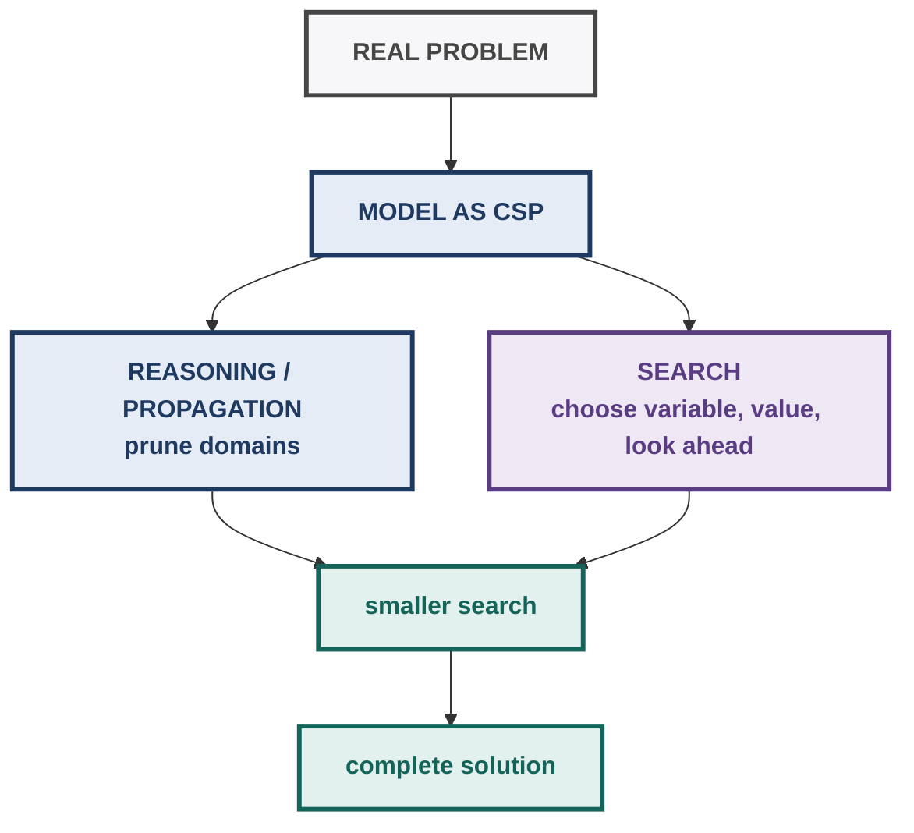

------------------------------------------------------------------------

## 112. A More Precise Mental Model

Think of a CSP as a **network of promises**.

``` text
Variable:
"What can I be?"

Domain:
"These are my possibilities."

Constraint:
"If I become X, you must be compatible with me."

Propagation:
"If I lose possibilities, you may lose possibilities too."

Search:
"If several possibilities remain, try one."

Backtracking:
"This choice eventually caused failure; undo it."

Lookahead:
"Before committing, see what this choice does to the future."
```

This mental model makes most Week 11 algorithms intuitive.

------------------------------------------------------------------------

## 113. A Full Worked Mini-CSP

Consider:

``` text
Variables:
A, B, C

Domains:
A = {1,2,3}
B = {1,2,3}
C = {1,2}

Constraints:
A ≠ B
B ≠ C
A < C
```

### Step 1 --- Arc consistency

Constraint:

``` text
A < C
```

Since:

``` text
C={1,2}
```

check A.

``` text
A=1 → C=2 works ✓
A=2 → no C>2 ✗
A=3 → no C>3 ✗
```

Therefore:

``` text
A={1}
```

### Step 2 --- A ≠ B

Since A=1:

``` text
B=1
```

has no support.

Therefore:

``` text
B={2,3}
```

### Step 3 --- Revise C with respect to A

Arc consistency is directional. The constraint `A < C` must also be
checked from the C side: every value of C needs a supporting value in
the **current** domain of A, which is now `{1}`.

``` text
C=1 → needs A<1, but A={1} ✗
C=2 → A=1 supports it (1<2) ✓
```

Therefore:

``` text
C={2}
```

### Step 4 --- B ≠ C with the new C

``` text
C={2}
B={2,3}
```

Check B:

``` text
B=2 → needs C≠2, but C={2} ✗
B=3 → C=2 supports it ✓
```

Therefore:

``` text
B={3}
```

Final domains:

``` text
A={1}
B={3}
C={2}
```

Check: `1≠3 ✓`, `3≠2 ✓`, `1<2 ✓`, so `(A,B,C)=(1,3,2)` is a solution,
and propagation alone has forced every variable to a single value
here. That is the ideal case, not the general rule: arc consistency
does not guarantee a complete solution for every CSP (see §114).

Search now has dramatically less work than the original:

``` text
3 × 3 × 2 = 18
```

possible complete assignments.

------------------------------------------------------------------------

## 114. Exam Trap: Arc Consistency Does Not Mean "Solved"

Suppose every arc is arc-consistent.

That does **not** generally mean:

``` text
there is exactly one solution
```

and does not necessarily mean:

``` text
there is even a global solution
```

Arc consistency only establishes a **local support property**.

There can still be a global contradiction requiring search.

> **Exam trap:** "Arc-consistent" ≠ "solution found."

------------------------------------------------------------------------

## 115. Exam Trap: Support Must Exist in the Current Domain

For:

``` text
REVISE(X,Y)
```

do not ask:

> "Could Y theoretically take some value?"

Ask:

> "Does Y's **current domain** contain a compatible value?"

If the value was already removed from `D_Y`, it cannot serve as support.

This is why propagation cascades.

------------------------------------------------------------------------

## 116. Exam Trap: Direction Matters

For:

``` text
REVISE(X,Y)
```

you modify:

``` text
D_X
```

not `D_Y`.

You are checking:

``` text
for each a ∈ D_X:
    does some b ∈ D_Y support a?
```

A common mistake is reversing the domains.

------------------------------------------------------------------------

## 117. Exam Trap: AC-3 Does Not Mean "Revise Every Arc Forever"

AC-3 uses a queue.

If:

``` text
D_P changes
```

then enqueue relevant incoming arcs:

``` text
(R,P)
```

for neighbours R other than the variable just processed.

The whole purpose is to avoid restarting every edge.

------------------------------------------------------------------------

## 118. Exam Trap: Empty Domain

If propagation produces:

``` text
D_X = ∅
```

then the current CSP state is inconsistent.

During search:

- empty future domain
  - current assignment cannot lead to a solution
    - backtrack

This is one of the most important early-failure signals.

------------------------------------------------------------------------

## 119. Exam Trap: CSP Solution Must Assign Every Variable

A partial assignment such as:

``` text
A=Red
B=Blue
```

may be consistent.

It is **not yet a solution** if:

``` text
C,D,E
```

remain unassigned.

A solution requires:

$$
\boxed{\text{all variables assigned + all constraints satisfied}}
$$

------------------------------------------------------------------------

## 120. Exam Trap: "No Edge" in a Constraint Graph

If:

``` text
A ─ B
```

has an edge, a constraint exists.

If there is no edge:

``` text
A     B
```

then there is no specified binary restriction between them.

It does **not** mean that A and B cannot be simultaneously assigned.

For the map-colouring example, non-adjacent regions can take any
compatible colours because their relation is effectively universal.

------------------------------------------------------------------------

## 121. Exam Trap: Waltz Arrow Direction

Do not memorize:

``` text
arrow = hidden edge
```

without the convention.

The course's actual convention:

> The material lies on the **right-hand side** when travelling in the
> arrow direction.

If the visible face changes, the arrow direction can change.

------------------------------------------------------------------------

## 122. Exam Trap: Convex vs Concave

Useful physical intuition:

- Cube outside corner
  - convex (+)
    - Room inside corner
      - concave (-)

The sign describes geometry, not "good" vs "bad".

------------------------------------------------------------------------

## 123. Exam Trap: Diagnosis ≠ Guessing

Model-based diagnosis is not:

``` text
Which component looks suspicious?
```

It is:

- Model
  - observations
    - component-status assumptions
      - consistency analysis
        - conflicts
          - minimal diagnoses

------------------------------------------------------------------------

## 124. Exam Trap: One Conflict Is Not the Final Diagnosis

If:

``` text
C1={M1,M2,A1}
```

then:

``` text
M1
M2
A1
```

are candidates.

After a second conflict:

``` text
C2={A1,A2,M1,M3}
```

some candidates disappear.

Always check the diagnosis against **all conflicts**.

------------------------------------------------------------------------

## 125. Exam Trap: Hitting Set vs Union

Given:

``` text
C1={A,B}
C2={B,C}
```

A diagnosis must **hit** both:

``` text
{B}
```

works because:

``` text
{B}∩C1 ≠ ∅
{B}∩C2 ≠ ∅
```

But simply taking:

``` text
C1 ∪ C2 = {A,B,C}
```

does not give a minimal diagnosis.

The goal is to find a set intersecting every conflict, preferably
minimally.

------------------------------------------------------------------------

## 126. Exam Trap: Occam's Razor Is an Assumption

If two diagnoses are:

``` text
{M1}
```

and:

``` text
{M2,A2}
```

the first is simpler.

But this does not logically prove that M1 is physically faulty.

It is a diagnostic preference for simpler explanations.

Additional observations may distinguish them.

------------------------------------------------------------------------

## 127. Exam Trap: AC-1 vs AC-3

Do not write:

``` text
AC-3 finds solutions that AC-1 cannot.
```

Both are consistency-enforcement procedures.

Their difference is primarily **how efficiently they propagate domain
changes**.

------------------------------------------------------------------------

## 128. Exam Trap: Strong Consistency

Remember:

``` text
strong n-consistent
```

means not merely n-consistent.

It means:

``` text
1-consistent
AND 2-consistent
AND ...
AND n-consistent
```

The lecturer's important consequence:

> A strongly n-consistent network can be searched without backtracking.

------------------------------------------------------------------------

## 129. Connection to Earlier Weeks

### Week 2 --- DFS / Backtracking

- DFS
  - explore branch
    - dead end
      - backtrack

Week 11:

- CSP backtracking
  - DFS over variable assignments

### Week 3 --- Heuristics

Earlier search asks:

> Which node looks promising?

CSP asks:

> Which variable/value should I try first?

Dynamic variable ordering is a CSP-specific heuristic.

### Week 5/6 --- Pruning

A\* pruning avoids unnecessary path exploration.

CSP propagation avoids unnecessary assignment exploration.

Same broad principle:

- prove something cannot lead to the desired outcome
  - do not explore it

### Week 8 --- Planning

Planning can also be formulated as a CSP.

### Week 9 --- Problem decomposition

CSP is another general representation for structured problem solving.

### Week 10 --- Rule-based reasoning

Week 10:

- facts + rules
  - matching / firing

Week 11:

- variables + domains + constraints
  - propagation / search

Both are forms of symbolic problem solving.

------------------------------------------------------------------------

## 130. Three Different Kinds of "Propagation"

Do not conflate these.

### Logical propagation

``` text
P
P→Q
⇒ Q
```

### CSP domain propagation

- D_X shrinks
  - D_Y may shrink

### Search propagation / lookahead

- assign X=v
  - prune future domains

They share the idea:

> Information learned locally restricts what can happen elsewhere.

But their formal mechanisms differ.

------------------------------------------------------------------------

## 131. A Seasoned Solver's Perspective

An experienced CSP practitioner does not think only:

> "Which value should I try?"

They ask several questions simultaneously:

``` text
1. How should I model the problem?
2. Which variables are highly constrained?
3. Which domains are already small?
4. Can propagation remove values before search?
5. If I assign this value, what happens to neighbours?
6. Can I detect failure immediately?
7. If I fail, which variable actually caused it?
8. Have I seen this dead end before?
9. Is stronger consistency worth its computational cost?
10. Can additional observations reduce ambiguity?
```

This is the deeper engineering mindset behind the Week 11 material.

------------------------------------------------------------------------

## 132. Modeling Is Often More Important Than the Solver

Two mathematically equivalent CSP formulations can behave very
differently.

For n-Queens:

### Bad-ish representation

``` text
36 variables
one per square
domain={queen,no queen}
```

### Better structured representation

``` text
6 variables
one per column
domain={1,...,6}
```

The second formulation exposes the structure directly.

Therefore:

> A strong CSP solution starts with a good representation.

The solver can only exploit structure that the representation makes
visible.

------------------------------------------------------------------------

## 133. Real-World Example: Hospital Scheduling

Suppose:

``` text
Variables:
Doctor shifts

Domains:
available time slots

Constraints:
doctor availability
room capacity
specialization
patient priority
no overlapping assignments
minimum staffing
maximum hours
```

A naive brute-force solver considers huge combinations.

A CSP solver can:

- assign highly constrained doctors first
  - propagate availability restrictions
    - remove impossible shifts
      - detect empty domains
        - backtrack early

This is the same machinery as map colouring.

Only the domain semantics changed.

------------------------------------------------------------------------

## 134. Real-World Example: Sudoku

Sudoku can be modeled as:

``` text
81 variables
domain = {1,...,9}
```

Constraints:

``` text
same row → different
same column → different
same 3×3 block → different
```

A solver can combine:

``` text
smallest-domain variable
+
arc consistency
+
backtracking
```

A human Sudoku solver is effectively doing informal constraint
propagation.

------------------------------------------------------------------------

## 135. Real-World Example: Network Diagnosis

Suppose:

``` text
Router → Firewall → Server
```

Observed:

``` text
client cannot reach server
```

Possible component states:

``` text
Router = OK/failed
Firewall = OK/failed
Server = OK/failed
```

Model:

``` text
if Router OK and Firewall OK and Server OK
    → connectivity should exist
```

Observed:

``` text
no connectivity
```

creates a conflict.

Potential diagnoses:

``` text
{Router}
{Firewall}
{Server}
{Router,Firewall}
...
```

Additional tests reduce the candidate set.

This is model-based diagnosis in a network setting.

------------------------------------------------------------------------

## 136. One Unifying Example

Suppose a university needs to schedule:

``` text
AI
ML
DBMS
OS
```

with:

``` text
rooms
faculty
slots
student batches
```

A complete CSP formulation:

``` text
VARIABLES
---------
Course assignment variables

DOMAINS
-------
possible faculty
possible room
possible slot

CONSTRAINTS
-----------
faculty availability
room availability
batch non-overlap
faculty non-overlap
room non-overlap
special room requirements
non-consecutive teaching
```

Then:

- dynamic variable ordering
  - choose most constrained course
    - assign candidate slot
      - forward check
        - prune conflicting rooms/faculty/slots
          - AC-style propagation
            - search

This is a realistic CSP solver architecture.

------------------------------------------------------------------------

## 137. Summary of Major Algorithms

| Algorithm / Method | Core operation | Main purpose |
|---|---|---|
| Backtracking | Assign → test → undo on failure | Search CSP solution |
| REVISE | Remove unsupported domain values | Basic arc-consistency operation |
| AC-1 | Repeat REVISE over all edges | Enforce arc consistency |
| AC-3 | Queue affected arcs | Efficient propagation |
| PC-2 | Path-consistency processing | Mentioned extension |
| AC-4 | More efficient arc consistency | Mentioned extension |
| Forward Checking | Prune future domains after assignment | Early failure detection |
| Waltz | Propagate legal junction labels | Interpret line drawings |
| Dynamic Variable Ordering | Choose smallest current domain | Fail-first search |
| Min-induced-width style ordering | Choose structurally influential variables | Reduce future interaction |
| Intelligent Backtracking | Jump toward conflict source | Avoid irrelevant backtracking |
| Nogood memorization | Remember failed combinations | Avoid repeated dead ends |

------------------------------------------------------------------------

## 138. Core Comparison: Search Strength

| Method | Before search | During search | Strength |
|---|---|---|---|
| Plain backtracking | Little/no pruning | Check current assignment | Lowest overhead |
| Forward checking | Some | Prunes future neighbours | Moderate |
| Full lookahead | More | Stronger future checking | Higher overhead |
| Arc-consistency lookahead | Strong | Enforces broader consistency | Highest pruning among these |

General pattern:

$$
\text{more propagation}
\Rightarrow
\text{more work per node}
\Rightarrow
\text{potentially fewer nodes}
$$

------------------------------------------------------------------------

## 139. Constraint Propagation as Information Flow

Think of every domain as a container of uncertainty:

``` text
D_A = {1,2,3,4}
D_B = {1,2,3,4}
D_C = {1,2,3,4}
```

A constraint removes one value:

- D_B:
  - {1,2,3,4}
    - {1,2,4}

That means A and C may now lose support.

``` text
A ← B → C
```

Then:

``` text
A shrinks
C shrinks
```

Those changes can affect other neighbours.

So propagation is essentially:

- local reduction
  - neighbour reduction
    - further reduction
      - fixed point

A **fixed point** is reached when no more values can be removed.

------------------------------------------------------------------------

## 140. Fixed Point View of Arc Consistency

AC algorithms repeatedly apply:

``` text
REVISE
```

until:

``` text
no domain changes
```

At that point:

$$
\boxed{\text{network is arc-consistent}}
$$

This gives a useful abstract interpretation:

- initial CSP
  - REVISE
    - smaller CSP
      - REVISE
        - smaller CSP
          - ...
            - fixed point

------------------------------------------------------------------------

## 141. Constraint Propagation Can Detect Contradiction

Suppose:

``` text
D_A = {1}
D_B = {1}
```

and:

``` text
A ≠ B
```

Then:

``` text
A=1
```

has no support in B.

Therefore:

``` text
D_A = ∅
```

Contradiction.

No search is needed.

This is the ideal case for propagation:

> **Detect impossibility before branching.**

------------------------------------------------------------------------

## 142. But Propagation Is Not Omniscient

A network can be locally consistent but globally difficult.

For example:

``` text
every pair may have support
```

while:

``` text
no complete global assignment exists
```

Therefore:

``` text
propagation
+
search
```

is the general architecture.

This is why the lecturer emphasizes that CSPs combine reasoning and
search.

------------------------------------------------------------------------

## 143. Final Mental Model

- CONSTRAINT SATISFACTION
  - MODEL: X = variables, D = domains, C = constraints
  - SOLVE
    - propagation: REVISE, AC-1, AC-3, i-consistency, lookahead
    - SEARCH: variable ordering, value ordering, assignment, consistency check
      - failure? yes → backtrack; no → continue
        - SOLUTION

And the applications are:

- Map colouring, n-Queens, Timetabling, Waltz vision, Diagnosis, SAT, Planning all map into the CSP framework

The most important conceptual chain is:

$$
\boxed{
\text{Model}
\rightarrow
\text{Propagate}
\rightarrow
\text{Prune}
\rightarrow
\text{Search}
\rightarrow
\text{Backtrack only when necessary}
}
$$

------------------------------------------------------------------------

## 144. 60-Second Revision

### CSP

$$
\boxed{CSP=(X,D,C)}
$$

-   `X` = variables
-   `D` = finite domains
-   `C` = constraints/relations
-   solution = complete assignment satisfying every constraint.

### Constraint

A relation over a subset of variables.

``` text
scope = variables participating in constraint
```

### Constraint graph

``` text
nodes = variables
edges = binary constraints
```

### Matching diagram

``` text
nodes = values
edges = compatible value combinations
```

### Backtracking

``` text
assign
→ check consistency
→ continue
→ if failure, undo
```

### Arc consistency

$$
\forall a\in D_X,\;
\exists b\in D_Y:
(a,b)\in R_{XY}
$$

### REVISE

``` text
Remove a from D_X
if no supporting b exists in D_Y.
```

### AC-1

``` text
repeat:
    revise every edge in both directions
until no domain changes
```

### AC-3

``` text
queue arcs
→ revise
→ if domain changed, enqueue affected neighbours
```

Course bound:

$$
O(ek^3)
$$

### Consistency levels

``` text
1 = node
2 = arc
3 = path
n = n-consistency
```

Strong n-consistency:

``` text
1 + 2 + ... + n consistency
```

can eliminate backtracking in the ideal strong-consistency setting
described in the lecture.

### Forward checking

``` text
assign Xi
→ prune future domains
→ if any future domain becomes empty, backtrack immediately
```

### Waltz

``` text
variable = junction
domain = legal physical labelings
constraint = shared edge has same label at both ends
```

Labels:

``` text
+ = convex
- = concave
→/← = arrow
```

Arrow convention:

> Material is on the right while travelling along the arrow.

### Diagnosis

``` text
model + observations
→ inconsistency
→ conflict sets
→ hitting sets
→ minimal diagnoses
```

### Hitting set

$$
H\cap C_i\neq\emptyset
$$

for every conflict `C_i`.

### Main trade-off

$$
\boxed{
\text{more consistency/propagation}
\Rightarrow
\text{more preprocessing}
\Rightarrow
\text{less search/backtracking}
}
$$

------------------------------------------------------------------------

## 145. Week 11 Problem-Solving Checklist

Before the exam, make sure you can do all of the following **without
looking at the notes**:

-   [ ] Define a CSP formally as `(X,D,C)`.
-   [ ] Explain the difference between a variable, domain, constraint,
    relation and scope.
-   [ ] Convert a small real-world problem into a CSP.
-   [ ] Draw a constraint graph from a binary CSP.
-   [ ] Interpret a matching diagram.
-   [ ] Explain what an edge in a matching diagram means.
-   [ ] Explain what the absence of an edge means.
-   [ ] Model 6-Queens as a binary CSP.
-   [ ] Verify the 6-Queens solution `(2,4,6,1,3,5)`.
-   [ ] Explain why CSP solutions are initially implicit.
-   [ ] Trace ordinary backtracking by hand.
-   [ ] Identify exactly when backtracking occurs.
-   [ ] Write the basic backtracking pseudocode.
-   [ ] Explain why CSP backtracking behaves like DFS.
-   [ ] Explain combinatorial explosion in terms of domain sizes.
-   [ ] Explain dynamic variable ordering.
-   [ ] Explain smallest-domain-first reasoning.
-   [ ] Explain the min-induced-width intuition.
-   [ ] Define arc consistency mathematically.
-   [ ] Distinguish `X` arc-consistent with respect to `Y` from the
    reverse.
-   [ ] Execute `REVISE(X,Y)` manually.
-   [ ] Identify a value with no support.
-   [ ] Explain why one pass of REVISE is insufficient.
-   [ ] Trace AC-1 on a small constraint graph.
-   [ ] Explain why AC-1 is brute-force.
-   [ ] State the course-level AC-1 complexity.
-   [ ] Trace AC-3 using a queue.
-   [ ] Explain exactly which arcs are re-enqueued after a domain
    change.
-   [ ] State the course-level AC-3 complexity.
-   [ ] Compare AC-1 and AC-3.
-   [ ] Explain how logical inference can emerge from consistency
    propagation.
-   [ ] Explain 1-, 2-, and 3-consistency.
-   [ ] Explain path consistency using the matching-diagram triangle
    intuition.
-   [ ] Explain strong n-consistency.
-   [ ] Explain why stronger consistency can reduce backtracking.
-   [ ] Explain the cost-versus-pruning trade-off.
-   [ ] Explain the Waltz problem from first principles.
-   [ ] Identify convex, concave and arrow labels.
-   [ ] State the arrow orientation convention.
-   [ ] Explain why only certain junction label combinations are
    physically possible.
-   [ ] Formulate Waltz as a CSP.
-   [ ] Explain how labels propagate between vertices.
-   [ ] Explain how propagation can remove shadow/crack interpretations.
-   [ ] Formulate model-based diagnosis as a CSP.
-   [ ] Write the multiplier component constraint.
-   [ ] Write the adder component constraint.
-   [ ] Explain connection constraints in a device model.
-   [ ] Reconstruct the lecture's multiplier/adder example.
-   [ ] Explain the difference between predicted and observed output.
-   [ ] Explain why multiple diagnoses can exist.
-   [ ] Construct the diagnosis candidate space.
-   [ ] Explain Occam's razor in the lecture's diagnosis context.
-   [ ] Construct a conflict set.
-   [ ] Explain why a conflict means at least one member must be
    abnormal.
-   [ ] Compute a minimal hitting set for two conflicts.
-   [ ] Explain why a candidate may disappear after adding another
    conflict.
-   [ ] Explain why additional tests can resolve diagnostic ambiguity.
-   [ ] Distinguish ordinary backtracking from lookahead.
-   [ ] Explain forward checking.
-   [ ] Trace the 6-Queens forward-checking example.
-   [ ] Detect an empty future domain and immediately backtrack.
-   [ ] Distinguish variable ordering from value ordering.
-   [ ] Explain intelligent backtracking/lookback.
-   [ ] Explain the purpose of remembering nogoods.
-   [ ] Explain why arc consistency does not generally guarantee a
    complete solution.
-   [ ] Explain the overall relationship between CSP modeling,
    propagation and search.

------------------------------------------------------------------------

## 146. Final Exam Mental Checklist

When you see a Week 11 question, ask:

``` text
1. What are the VARIABLES?
2. What are their DOMAINS?
3. What are the CONSTRAINTS?
4. What is the SCOPE of each constraint?
5. Is this a SEARCH question or a PROPAGATION question?
6. If propagation:
      Which value has no support?
7. If AC-1:
      Repeat all arcs until stable.
8. If AC-3:
      Which domain changed?
      Which neighbouring arcs must be requeued?
9. If backtracking:
      Which variable is next?
      Which value is being tried?
10. If forward checking:
      What future-domain values disappear?
11. If Waltz:
      What junction type?
      What label combinations are legal?
      Does the shared edge have the same label at both ends?
12. If diagnosis:
      What is the model?
      What was predicted?
      What was observed?
      What conflict follows?
      What hitting sets explain all conflicts?
13. If consistency level:
      Is it node, arc, path, or stronger consistency?
14. If complexity:
      Identify n, e, k before substituting.
```

------------------------------------------------------------------------

## 147. One-Page Conceptual Compression

- CSP: X = Variables, D = Domains, C = Constraints
  - Constraint Graph
    - Propagation: REVISE, AC-1, AC-3, i-consistency, Waltz
    - Search: Backtracking, Variable ordering, Value ordering, Lookahead, Intelligent backtracking
  - Domain pruning
    - smaller search tree
      - complete assignment

### The central lesson

> **A CSP does not solve the problem by blindly enumerating every
> complete assignment. It represents local restrictions, propagates
> their consequences to eliminate impossible values, and uses search
> only where local reasoning cannot decide the remaining
> possibilities.**

That idea connects essentially every major topic in Week 11.

------------------------------------------------------------------------

## 148. Supplementary Note: Modern CSP Solvers

The lecture focuses on the classical CSP machinery because the objective
is to understand the underlying algorithms.

Modern constraint-solving systems often extend these ideas with
techniques such as:

-   global constraints,
-   stronger propagation algorithms,
-   conflict-driven learning,
-   nogood learning,
-   SAT encodings,
-   integer programming,
-   hybrid CP-SAT methods.

The conceptual architecture remains familiar:

- model problem
  - propagate constraints
    - branch when necessary
      - learn/prune from conflicts
        - search remaining space

So the Week 11 algorithms are not isolated historical techniques; they
are foundational ideas behind modern constraint programming.

------------------------------------------------------------------------

## 149. Supplementary Note: Why Modeling Still Matters

A sophisticated solver cannot compensate indefinitely for a poor
representation.

The same problem can be encoded with:

``` text
many weak variables
```

or:

``` text
fewer structured variables
```

The latter may expose constraints much more effectively.

A useful modeling principle is therefore:

> **Represent the problem so that contradictions become visible as early
> and locally as possible.**

This principle explains why the course spends significant time on:

-   constraint graphs,
-   relations,
-   scopes,
-   matching diagrams,
-   alternative n-Queens representations,
-   component models in diagnosis.
