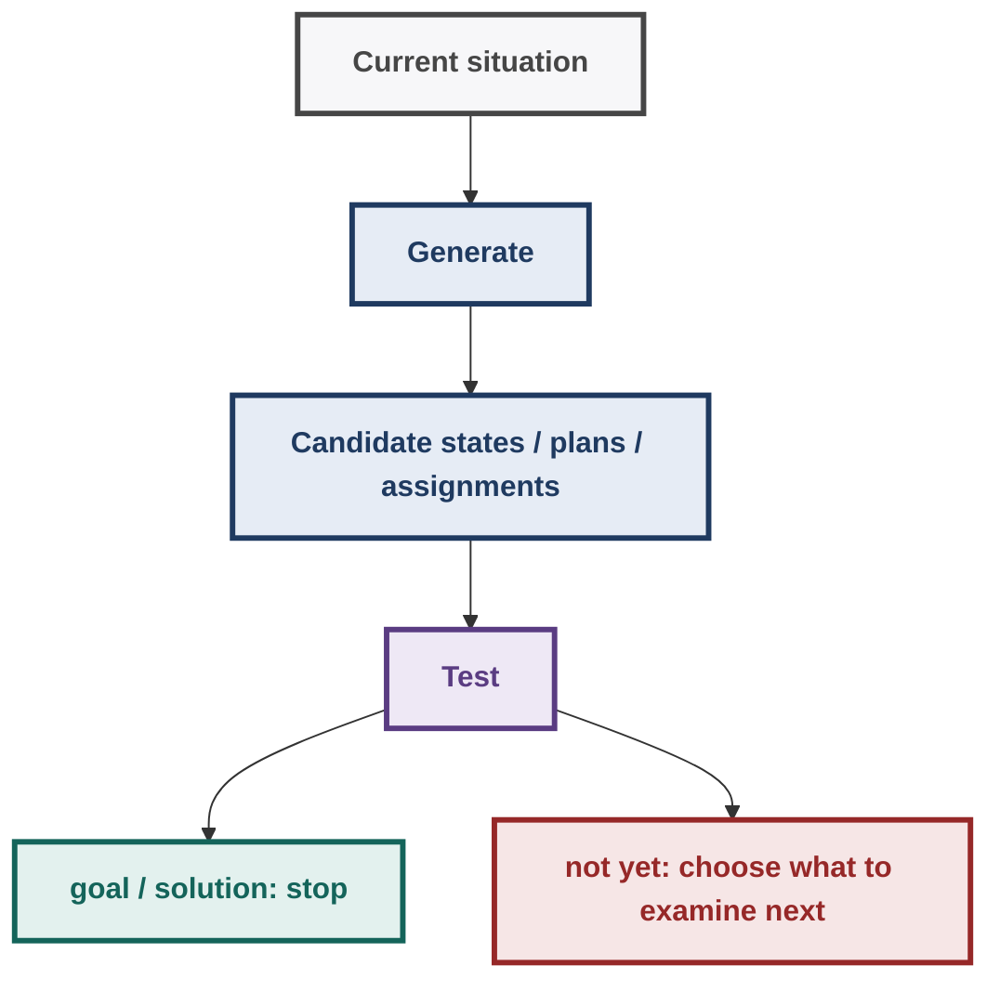
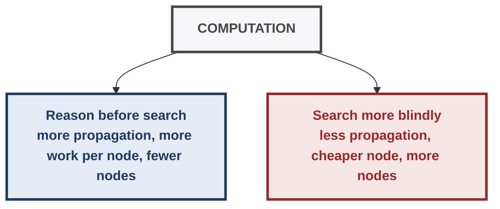
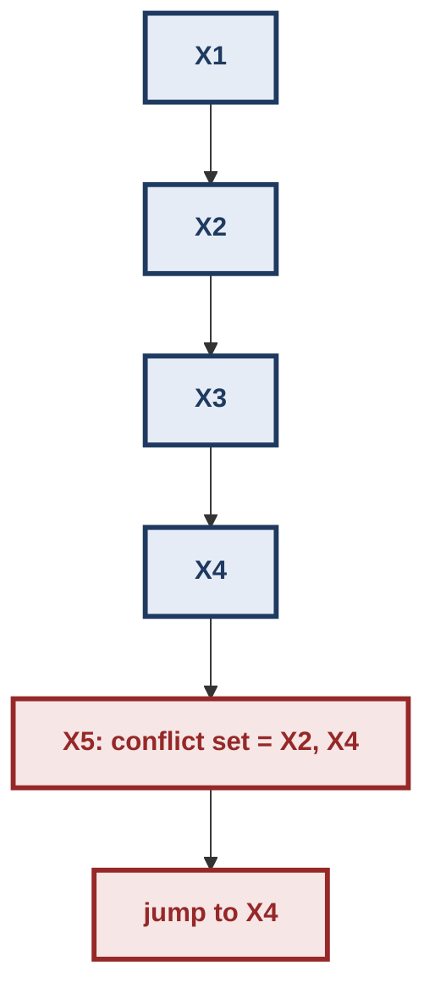
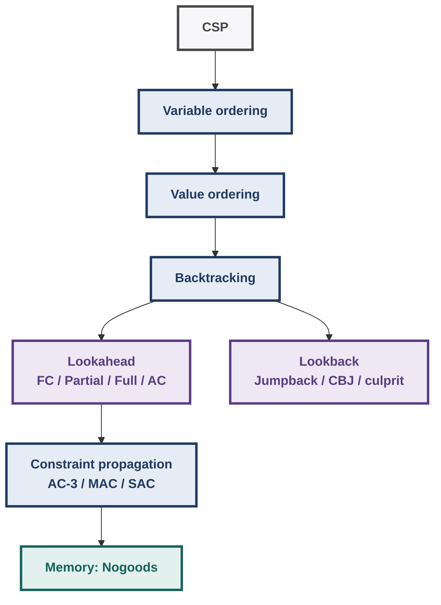
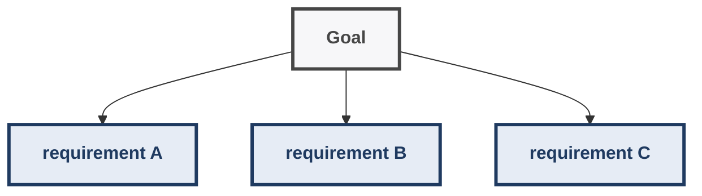
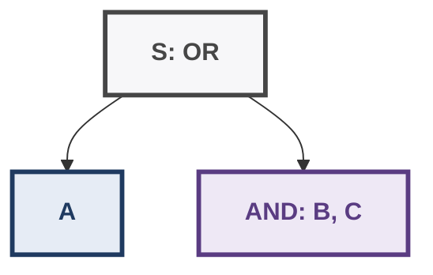
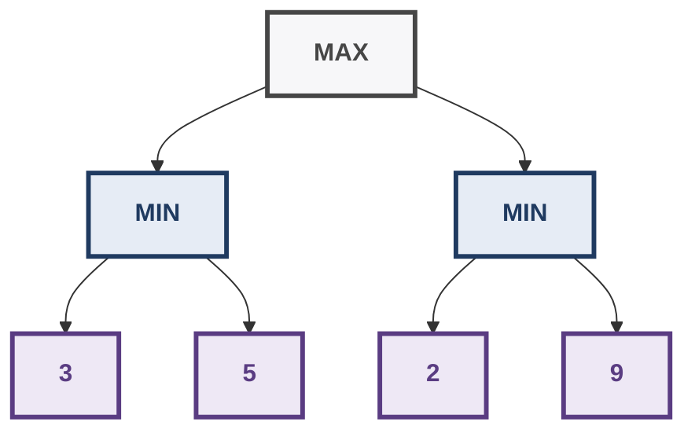
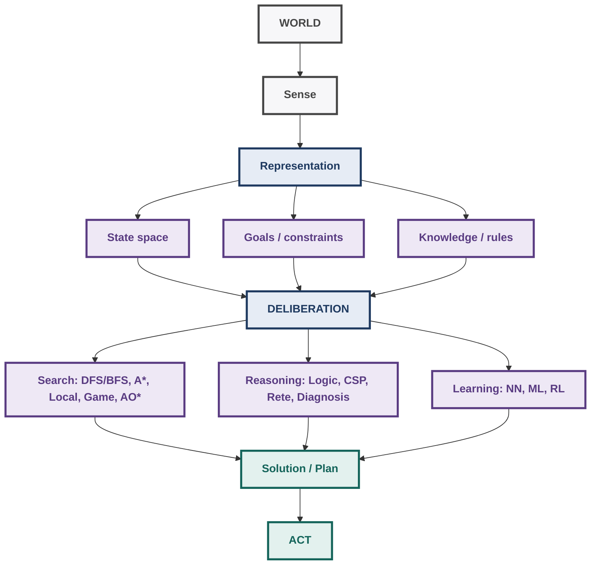

# AI: Search Methods for Problem Solving — Week 12
## Final Course Synthesis + Lookahead Search + Advanced Problem-Solving View

> **Purpose of this document:** Week 12 is not another isolated algorithm chapter. It closes the course by showing how search, reasoning, knowledge, planning, constraints, heuristics, and learning fit together. The lecture's central theme is the trade-off between **search and reasoning/knowledge**: the more useful reasoning you do before or during search, the less blind search remains.
>
> **Primary lecture sources:** Prof. Deepak Khemani, *Lookahead Search* (Lecture 04) and *Closing Discussions* (Lecture 05). The Week 12 syllabus explicitly lists **Lookahead Search** and **Closing Discussion**; the official course syllabus describes Week 12 as **Revision / Applications**.  
>
> **Supplementary notes** are explicitly marked. They add closely related techniques such as MAC, conflict-directed backjumping, singleton arc consistency, IDA*, RBFS, and depth-first branch-and-bound.

---

## 1. Week 12 in One Picture

The course began with a very simple abstraction:



The entire course can be understood as increasingly sophisticated answers to:

> **Which candidate should I examine, and what extra information can I use before examining it?**

The progression is roughly:

- Blind search: DFS / BFS / DFID
- Use an estimate of promise: Best-First / Hill Climbing, A\*, Weighted / memory-bounded A\*
- Use structure of the problem: Game trees, Planning, AND-OR decomposition, Rule-based inference, CSP constraints
- Reason while searching: Arc consistency, Forward checking, Lookahead, Lookback / jumpback, Nogood / memoization ideas

The Week 12 lectures make the final step explicit:

> **Search and reasoning should not be viewed as separate worlds. Constraint processing provides a unified framework in which reasoning can reduce the amount of search.**

---

## 2. Lookahead Search

### 2.1 Why Lookahead?

Before Week 12, CSP search can be viewed as:

- Assign X₁
  - Assign X₂
    - Assign X₃
      - ...
        - Discover contradiction
          - Backtrack

The problem is that a bad assignment may already have made a future variable impossible, but ordinary backtracking may not notice until much later.

### Core idea

**Lookahead examines consequences of a tentative assignment before committing to continue deeper into the search tree.**

The Week 12 lecture contrasts this with:

- **Backtracking:** search first; discover failure later.
- **Consistency enforcement:** preprocess the CSP before search.
- **Lookahead:** perform consistency reasoning **during search**.

So:

```text
Preprocessing:
CSP → AC-3 → smaller CSP → search

Lookahead:
CSP → tentative assignment
    → prune future domains
    → detect consequences early
    → continue / reject assignment
```

The key trade-off is:

> **More reasoning now ↔ less search later.**

---

## 3. Forward Checking

### 3.1 What Problem Does It Solve?

Suppose we assign:

```text
X = red
```

and `Y` is constrained to be different from `X`.

If:

```text
D(Y) = {red, blue, green}
```

then immediately:

```text
D(Y) = {blue, green}
```

There is no reason to keep `red` in `Y`.

Forward checking performs exactly this kind of pruning for **future variables**.

---

### 3.2 Lecturer's Formulation

The structure is almost the same as ordinary backtracking:

1. Start with an empty assignment.
2. Make copies of the domains.
3. Select a value for the current variable.
4. Look at **future variables**.
5. Delete future values inconsistent with the tentative assignment.
6. If a future domain becomes empty:
   - reject the tentative value;
   - undo the pruning caused by that value;
   - backtrack.
7. Otherwise accept the value and continue.

The important distinction is:

> Forward checking does not simply ask whether the current assignment is consistent. It asks whether the current assignment has already made some **future variable domain empty**.

---

### 3.3 Pseudocode

A compact reconstruction of the lecture algorithm:

```text
ForwardChecking(X, D, C):

    A ← []
    for k = 1 to N:
        D'k ← Dk

    i ← 1

    while 1 ≤ i ≤ N:

        ai ← SelectValue-FC(D'i, A, C)

        if ai = null:
            undo lookahead pruning associated with previous choice
            i ← i - 1
            remove last assignment from A

        else:
            A ← ai : A
            i ← i + 1

    return Reverse(A)
```

The important inner operation is:

```text
SelectValue-FC(D'i, A, C):

    while D'i is not empty:

        ai ← head(D'i)
        D'i ← tail(D'i)

        for k = i+1 ... N:
            for each b ∈ D'k:
                if b : ai : A violates C:
                    delete b from D'k

        if every future D'k is non-empty:
            return ai

        else:
            undo the deletions caused by ai

    return null
```

### Why undo?

Suppose:

```text
X = red
```

caused:

```text
D(Y): {red, blue} → {blue}
D(Z): {red, green} → {green}
```

If `X = red` later fails, those deletions cannot remain permanently.

We must restore:

```text
D(Y) = {red, blue}
D(Z) = {red, green}
```

before trying another value of `X`.

> **Exam trap:** Lookahead pruning is temporary and branch-dependent. Do not carry a deleted value into a sibling branch after backtracking.

---

## 4. Hand-Solved Forward-Checking Example

Consider:

```text
Variables: A, B, C

Domains:
D(A) = {R, B}
D(B) = {R, B}
D(C) = {R, B}

Constraints:
A ≠ B
B ≠ C
```

Assume variable order:

```text
A → B → C
```

and try values in listed order.

### Step 1 — Try A = R

Initially:

| Variable | Domain |
|---|---|
| A | {R, B} |
| B | {R, B} |
| C | {R, B} |

Assign:

```text
A = R
```

Because `A ≠ B`:

```text
D(B): {R, B} → {B}
```

`C` is not directly constrained by `A`, so:

```text
D(C) = {R, B}
```

No future domain is empty.

Continue.

---

### Step 2 — Try B = B

Now:

```text
A = R
B = B
```

Because `B ≠ C`:

```text
D(C): {R, B} → {R}
```

Still non-empty.

Therefore:

```text
C = R
```

Solution:

```text
(A, B, C) = (R, B, R)
```

---

### What Did Forward Checking Save?

Without lookahead, a search procedure could carry both values of `B` and only discover the contradiction when reaching `C`.

With forward checking:

- A = R
  - B = R immediately removed

The impossible branch is never explored.

### Mental model

```text
Backtracking:
"Let me go there and see whether it fails."

Forward checking:
"Before going there, I can already see that it will fail."
```

---

## 5. The Week 12 Map-Coloring Example

The lecturer uses the familiar map-coloring CSP with variable order:

```text
G → D → B → F → E → A → C
```

The matching diagram represents which color choices remain compatible across related variables.

A key example:

### Try `G = W`

`G` is related to `E` and `F`.

Therefore:

```text
W ∈ D(E) → remove W
W ∈ D(F) → remove W
```

So the future domains are immediately pruned.

The lecturer emphasizes:

> **Forward checking only looks at the current assignment and its effect on future variables.**

It does **not** fully propagate consequences through the future-variable network.

---

### Important Failure in the Lecturer's Trace

Later, a choice for `F` removes a value from `C`, eventually making:

```text
D(C) = ∅
```

Forward checking notices this and backtracks.

But at another point, the future variables `A` and `C` can become mutually inconsistent **with each other**, even though neither is immediately impossible from the current variable.

Forward checking does not detect this early because it is not enforcing full consistency among the future variables.

This is precisely the motivation for stronger lookahead methods.

---

## 6. Four Levels of Lookahead

The lecturer presents four progressively stronger methods:

- Forward Checking
  - Partial Lookahead
    - Full Lookahead
      - Arc Consistency Lookahead

The amount of reasoning increases downward.

| Method | What it checks | Reasoning | Search left |
|---|---|---:|---:|
| Backtracking | Current assignment | Lowest | Highest |
| Forward Checking | Current variable → future variables | Low | More |
| Partial Lookahead | Propagation one step further | ↑ | ↓ |
| Full Lookahead | Future consistency in both directions | ↑↑ | ↓↓ |
| AC Lookahead | Full arc consistency among future variables | Highest | Lowest |

The exact point is **not** that the strongest algorithm is universally best.

The real design question is:

> **Is the additional propagation work worth the search it saves?**

---

## 7. Partial Lookahead

Suppose assigning `X = a` removes a value from future variable `Y`.

Forward checking stops there.

Partial lookahead asks:

- X = a
  - remove value from Y
    - does this removal force another removal from Z?

So the reasoning chain becomes:

- Current assignment
  - future variable Y
    - future variable Z

It looks beyond the immediate effect.

---

## 8. Full Lookahead

The lecture describes full lookahead as checking consistency in **both directions**.

Forward checking and partial lookahead are primarily moving forward from the current assignment.

Full lookahead performs stronger consistency checks among the future variables.

The conceptual jump is:

```text
FC:
current → future

Full:
current → future
future ↔ future
```

This catches conflicts that are invisible to one-directional pruning.

---

## 9. Arc Consistency Lookahead

### 9.1 Core Idea

Arc consistency says:

For an arc `(X,Y)`:

> Every value in `D(X)` must have at least one supporting value in `D(Y)`.

And vice versa.

Arc Consistency Lookahead applies this idea **during search** to the future-variable subproblem.

So after tentatively trying:

```text
G = W
```

the algorithm does not merely inspect the direct neighbours of `G`.

It propagates consequences throughout the future network until the future variables are arc-consistent.

---

### 9.2 Lecturer's Example

The lecturer traces the same map-coloring problem.

Start by considering:

```text
G = W
```

Initial direct pruning includes:

```text
W removed from E
W removed from F
```

Then propagation continues.

For example:

- F no longer supports R for C
  - R removed from C

Then further consequences propagate through other future variables.

The lecture describes subsequent pruning such as:

```text
B removed from A, B, D
R removed from E
G removed from E
```

Eventually:

```text
D(E) = ∅
```

Therefore the tentative choice:

```text
G = W
```

is rejected **without performing the deeper search that Forward Checking would have required**.

The algorithm immediately tries the next value for `G`.

---

## 10. The Central Week-12 Observation

The lecturer explicitly uses the AC Lookahead example to illustrate:

- More consistency enforcement
  - More propagation
    - Earlier detection of dead ends
      - Less search

This is one of the most important ideas of the entire course.

### Trade-off



The optimal balance depends on the problem.

---

## 11. Lookback Search

Lookahead asks:

> **Can I detect future consequences before going forward?**

Lookback asks:

> **When I fail, which earlier decision actually caused this failure?**

Ordinary backtracking is **chronological backtracking**:

- X₁ → X₂ → X₃ → X₄ → DEAD END
  - undo X₃

But the actual culprit might be `X₁`.

Then chronological backtracking wastes work by reconsidering variables that had nothing to do with the failure.

---

### 11.1 Jumpback Methods

Lookback methods try to identify a **culprit variable** and jump directly to it.

- X1 → X2 → X3 → X4 → DEAD END, but the culprit is X1, so jump back to X1 directly

The lecture mentions:

- **Dependency-directed backtracking**
- **Jumpback methods**
- Identifying culprits using:
  - graph topology;
  - values responsible for the conflict.

The lecturer does not develop these algorithms in detail, so they should be treated as an extension rather than a core Week 12 tracing algorithm.

---

## 12. Lookahead vs Lookback

| Question | Lookahead | Lookback |
|---|---|---|
| Direction | Forward | Backward |
| Main idea | Predict consequences | Diagnose cause of failure |
| When used | Before deeper search | After a dead end |
| Typical example | Forward Checking | Dependency-directed / jumpback |
| Goal | Detect failure earlier | Backtrack more intelligently |
| Key information | Future domain effects | Conflict/cause information |

A strong solver can combine both:

- Choose assignment
  - propagate forward
    - detect conflict
      - identify culprit
        - jump back intelligently
          - propagate again

---

## 13. Memorization / Nogoods

The closing lecture emphasizes another important idea:

> If something has already been shown to fail, remember that failure and do not reproduce it.

This is the intuition behind **nogood recording / memoization**.

Example:

```text
A = red
B = blue
C = green
```

has already been shown impossible.

Instead of rediscovering the same failure later, store:

```text
{A=red, B=blue, C=green} → NOGOOD
```

Then any future search branch containing that same forbidden combination can be pruned.

This is a general pattern:

```text
Reasoning → discover impossible region
Memory → remember impossible region
Search → never enter it again
```

---

## 14. Supplementary: Maintaining Arc Consistency (MAC)

> **Supplementary note:** MAC is closely related to the Week 12 lecture's Arc Consistency Lookahead and is useful for understanding the broader CSP literature.

**Maintaining Arc Consistency (MAC)** interleaves assignment and full arc-consistency propagation:

- assign X = a, then enforce AC on remaining CSP: domain becomes empty? yes → reject branch; no → choose next variable

The important distinction from basic Forward Checking is:

- Forward Checking: current assignment → future variables
- MAC: current assignment, then full AC propagation among remaining variables

This matches the conceptual gap demonstrated by the lecturer's map-coloring example.

The constraint-programming literature describes MAC as enforcing arc consistency after each search decision, rejecting a branch when propagation empties a domain.

---

## 15. Supplementary: Singleton Arc Consistency

An even stronger idea is **Singleton Arc Consistency (SAC)**.

For a candidate value:

```text
X = a
```

temporarily assign it and ask:

> Can the remaining CSP be made arc-consistent without producing an empty domain?

If not:

```text
X = a
```

can be removed before ordinary search commits to it.

Conceptually:

- candidate value: temporarily assume it, run stronger propagation; contradiction? yes → delete candidate; no → retain candidate

SAC is a substantially stronger local-consistency technique than ordinary arc consistency, at a higher computational cost.

**Use it as conceptual enrichment, not as a replacement for the lecturer's four Week 12 lookahead algorithms.**

---

## 16. Supplementary: Conflict-Directed Backjumping

The lecturer's "culprit variable" idea leads naturally to **Conflict-Directed Backjumping (CBJ)**.

Instead of:

```text
dead end → go back exactly one level
```

CBJ maintains conflict information and can jump to a variable whose assignment is actually implicated in the conflict.



This is the more formal version of the Week 12 lecture's lookback intuition. The CSP literature studies CBJ as a way to avoid repeatedly exploring branches that are unrelated to the current failure.

---

## 17. A Unified CSP Solver View

The CSP techniques can now be seen as a stack:



The more information the solver maintains, the more intelligently it can avoid repeated work.

But every additional layer costs time and/or memory.

---

## 18. Course-Wide Synthesis: Weeks 1–11

Week 12's closing lecture places the entire course in a larger AI problem-solving picture.

The official syllabus moves through:

- Foundations
  - State-space search
    - Heuristics / local search
      - Population methods
        - Optimal search
          - Memory-bounded search
            - Games
              - Planning
                - Problem decomposition
                  - Rule-based inference
                    - Constraint processing
                      - Lookahead + synthesis

---

## 19. Week 1 — What Is the Problem?

### Core question

> **What does it mean for an agent to solve a problem?**

Recall:

- Intelligent agent: persistent, autonomous, proactive, goal-directed.
- Agent senses the world, deliberates, then acts.
- Planning problem → find a path/action sequence.
- Configuration problem → find a satisfactory final state.
- Turing Test → behavioural/conversational test.
- Winograd Schema → targeted reasoning/common-sense challenge.

### Deeper connection

Before choosing an algorithm, decide:

```text
What is the state?
What is the goal?
What actions exist?
Does the path matter?
```

Bad problem representation can make a good search algorithm useless.

---

## 20. Week 2 — Blind Search

### Core idea

No estimate of where the goal is.

```text
DFS → depth first
BFS → breadth first
DFID → repeated depth-limited DFS
```

### One-line rules

| Algorithm | Key mechanism | Main trade-off |
|---|---|---|
| DFS | Stack / prepend | Low memory, no shortest-path guarantee |
| BFS | Queue / append | Shortest in unit-cost graphs, high memory |
| DFID | Increasing depth bounds | BFS-like shortest-path behavior with DFS-like space |

### Important mental shift

Do not memorize DFS/BFS as completely different algorithms.

They are essentially the same search framework with a different OPEN discipline:

```text
DFS: prepend children
BFS: append children
```

---

## 21. Week 3 — Use a Heuristic

Blind search asks:

> "What can I explore?"

Heuristic search asks:

> "Which option looks promising?"

### Best-First

```text
priority = h(n)
```

### Hill Climbing

```text
move to better neighbour
```

and stop when no strictly better neighbour exists.

### Main failure

A locally good state need not be globally good.

```text
             global optimum
                  /\
                 /  \
       local    /    \
      optimum _/
```

Hill climbing has thrown away its alternatives.

That gives the general lesson:

> **Saving memory often means sacrificing the ability to recover from bad local decisions.**

---

## 22. Week 4 — Explore a Population

Instead of one candidate:

```text
candidate
```

use:

```text
candidate 1
candidate 2
candidate 3
...
candidate N
```

### Genetic Algorithms

Use population-level variation:

- selection
  - crossover
    - mutation
      - new population

### Ant Colony Optimization

Use collective information:

- individual ants
  - paths
    - pheromone
      - collective bias
        - better future paths

### Deeper connection

Weeks 3–4 address the same problem from different angles:

> **How do we avoid getting trapped by a single locally attractive search trajectory?**

---

## 23. Week 5 — A* Changes the Objective

Best-First uses:

```text
h(n)
```

A* uses:

```text
f(n) = g(n) + h(n)
```

where:

- `g(n)` = cost already paid;
- `h(n)` = estimated remaining cost.

This balances:

```text
past cost + future promise
```

### Admissibility

```text
h(n) ≤ h*(n)
```

The heuristic must never overestimate the true remaining cost.

### Important insight

A heuristic is not valuable merely because it is "close."

For optimal A* reasoning, its mathematical properties matter.

---

## 24. Week 6 — Consistency + Memory

The monotone/consistent condition:

$$
h(m) \le c(m,n) + h(n)
$$

or:

$$
h(m)-h(n)\le c(m,n)
$$

gives the triangle-inequality structure that makes `f` non-decreasing along a path.

### Why it matters

With consistency, once a node is removed from OPEN and CLOSED, its `g` value is already optimal.

This eliminates the need for repeated reopening in the standard graph-search setting.

### Memory problem

A* may consume enormous memory because it retains:

```text
OPEN + CLOSED
```

Hence:

- IDA*
- RBFS
- Frontier Search / DCFS
- other memory-bounded approaches

The course therefore introduces another fundamental trade-off:

```text
more memory → remember more alternatives
less memory → regenerate more work
```

---

## 25. Week 7 — Search Against an Opponent

Ordinary search assumes the environment is not actively trying to defeat you.

Game search introduces:

- MAX
  - MIN
    - MAX
      - ...

### Minimax

Choose the move whose worst-case opponent response is best.

### Alpha-Beta

Does not change the minimax answer.

It changes how much of the tree must be examined.

```text
same answer
      +
fewer evaluated branches
```

### SSS*

Another way of organizing game-tree search around solution trees / clusters.

### Deeper lesson

> **A search algorithm can improve without changing the mathematical objective: pruning can reduce computation while preserving the answer.**

---

## 26. Week 8 — Search Over Actions, Not Just States

Automated planning introduces explicit actions with:

```text
preconditions
effects
```

The Blocks World makes this concrete.

### State-space planning

Search through complete world states.

```text
state → action → state → action → ...
```

### Goal Stack Planning

Break the goal into subgoals and solve them using a stack-like decomposition.

### Partial Order Planning

Do not force an unnecessary total ordering.

Instead represent:

```text
A before B
C before D
```

while leaving unrelated actions unordered.

### Graphplan

Build a planning graph and then search it for a consistent plan.

### Core insight

Planning is a structured search problem.

The better the representation captures action structure and subgoal interaction, the less blind state exploration is needed.

---

## 27. Week 9 — AND-OR Reasoning

Ordinary path search is mainly OR-style:

```text
choose one successor
```

Problem decomposition introduces AND nodes:



All must be solved.

### AO*

At an OR node:

$$
cost = \min_i \{c_i + cost(child_i)\}
$$

At an AND node:

$$
cost = \sum_i \{c_i + cost(child_i)\}
$$

### Deep connection

A* asks:

> Which path is best?

AO* asks:

> Which **solution subtree** is best?

That is a major conceptual jump.

---

## 28. Week 10 — Search Becomes Inference

Rule-based systems use:

```text
IF conditions
THEN action/conclusion
```

The inference cycle:

- Match
  - Resolve conflict
    - Execute
      - new facts
        - Match again

### Rete

The Rete network avoids repeatedly rematching everything from scratch.

- WME
  - Alpha tests
    - Alpha memories
      - Beta joins
        - Rule instances
          - Conflict set

### Deep connection

Search is not only about paths.

It can also be about:

- possible rule firings;
- deductions;
- states of knowledge;
- combinations of facts.

---

## 29. Week 11 — CSP: Search + Reasoning Together

CSP:

$$
\langle X,D,C\rangle
$$

where:

- `X` = variables;
- `D` = domains;
- `C` = constraints.

Ordinary backtracking:

- assign
  - assign
    - assign
      - contradiction
        - backtrack

Constraint propagation:

- assign
  - propagate
    - remove impossible values
      - detect contradiction early

Week 12 simply pushes this idea further:

- Backtracking
  - Forward Checking
    - Partial Lookahead
      - Full Lookahead
        - AC Lookahead

---

## 30. The Course's Central Trade-Off: Search vs Reasoning

The closing lecture states the course's most important synthesis:

> **The more reasoning you perform, the less search you may have to perform.**

But reasoning itself costs computation.

Therefore:

```text
                 TOTAL WORK
                    /\
                   /  \
        reasoning /    \ search
                 /      \
                /        \
             more        less
```

The real objective is not:

> "Minimize search."

It is:

> **Minimize total computational work while retaining the required solution guarantees.**

This explains why:

- AC-3 is useful before search;
- Forward Checking is useful during search;
- A* invests computation in a heuristic;
- Alpha-Beta invests computation in bounds to prune;
- AO* backs up subtree costs;
- Rete invests memory in compiled matching structure;
- memory-bounded A* sacrifices memory and regenerates work;
- nogood recording invests memory to avoid repeated failures.

---

## 31. One Universal Algorithm-Selection Framework

When you see a new problem, ask these questions in order.

### Step 1 — What is the representation?

```text
State?
Assignment?
Plan?
Game position?
Goal tree?
Knowledge state?
Population?
```

---

### Step 2 — What is the objective?

```text
Any solution?
Shortest path?
Lowest cost?
Best utility?
Satisfy all constraints?
Maximize satisfied goals?
Approximate optimization?
```

---

### Step 3 — What information do I have?

- No heuristic
  - h(n)
    - g(n)+h(n)
      - constraints
        - learned knowledge
          - domain-specific structure

---

### Step 4 — What failure mode matters?

| Failure mode | Think of |
|---|---|
| Exponential branching | heuristic / pruning |
| Local optimum | stochastic / population / tabu |
| High memory | IDA* / RBFS / frontier search |
| Repeated constraint failure | propagation / nogoods |
| Weak heuristic | better admissible heuristic |
| Opponent | minimax / alpha-beta |
| Interacting subgoals | planning / CSP / AO* |
| Repeated rule matching | Rete |
| Unknown/new problem | search |
| Familiar/repeated problem | knowledge / memory / learned model |

---

## 32. Hand-Solved Integrated Example 1 — Choosing the Search Strategy

Suppose:

```text
S → A : 2
S → B : 5
A → G : 10
B → G : 2
```

Thus:

```text
S → A → G = 12
S → B → G = 7
```

Assume:

```text
h(A) = 1
h(B) = 2
h(G) = 0
```

### Greedy Best-First

Compare:

```text
h(A)=1
h(B)=2
```

So Greedy chooses:

```text
S → A → G
```

Cost:

$$
2+10=12
$$

It finds a solution, but not the optimal one.

---

### A*

At `S`:

```text
f(A) = g(A)+h(A)=2+1=3
f(B) = g(B)+h(B)=5+2=7
```

A* chooses `A`.

Then:

```text
G via A:
g(G)=12
f(G)=12
```

But compare the still-open alternative:

```text
B:
f(B)=7
```

So A* does **not** stop at the first generated goal.

It explores `B`:

```text
g(G via B)=5+2=7
```

Now:

```text
7 < 12
```

and the optimal solution is:

```text
S → B → G
cost = 7
```

### Lesson

```text
Greedy:
"What looks closest?"

A*:
"What is cheapest considering both what I already paid and what remains?"
```

---

## 33. Hand-Solved Integrated Example 2 — Why Propagation Saves Search

Suppose:

```text
X ≠ Y
Y ≠ Z
X ≠ Z
```

with:

```text
D(X)=D(Y)=D(Z)={1,2}
```

Try:

```text
X=1
```

Forward checking:

```text
Y={2}
Z={2}
```

Now assign:

```text
Y=2
```

Forward checking sees:

```text
Z cannot be 2
```

so:

```text
D(Z)=∅
```

Failure is detected immediately.

But the deeper reason is visible from the CSP itself:

```text
X, Y, Z
all pairwise different
```

Three variables need three different values, but only two values exist.

A stronger propagation procedure can expose this kind of structural impossibility earlier.

### Lesson

Do not only trace assignments.

Ask:

> **What does the constraint structure imply before I search?**

---

## 34. Hand-Solved Integrated Example 3 — AO* Is Not Ordinary Path Search

Suppose:



Costs:

```text
S→A = 2
S→B = 1
S→C = 1

h(A)=5
h(B)=2
h(C)=3
```

Then:

### OR alternative

$$
cost(A)=2+5=7
$$

### AND alternative

$$
cost(B,C)
=(1+2)+(1+3)
=7
$$

Therefore:

```text
S = min(7,7)
```

Tie-break determines which partial solution is marked.

Now suppose `A` expands and discovers a primitive solution with cost `2`.

Then:

$$
cost(A)=2+2=4
$$

and therefore:

$$
S=\min(4,7)=4
$$

The entire AND branch need not be expanded.

### Lesson

AO* evaluates **solution subtrees**, not just individual paths.

---

## 35. Hand-Solved Integrated Example 4 — Minimax + Alpha-Beta

Consider:



Left MIN:

$$
\min(3,5)=3
$$

Right MIN:

$$
\min(2,9)=2
$$

Root MAX:

$$
\max(3,2)=3
$$

So MAX chooses the left branch.

Now imagine the right MIN has already seen `2`.

Because MAX already has a guaranteed value of `3` from the left branch, the right branch cannot produce anything better than `2`.

Therefore evaluating its `9` child is unnecessary.

### Lesson

Alpha-Beta does not improve the minimax answer.

It proves that certain subtrees **cannot affect the answer**.

This is the same high-level idea as CSP pruning:

```text
prove irrelevance → stop exploring
```

---

## 36. Hand-Solved Integrated Example 5 — Rete Thinking

Rules:

```text
R1:
IF x is green AND x is circle
THEN safe(x)

R2:
IF x is red AND x is square
THEN danger(x)
```

Facts:

```text
(obj1, green)
(obj1, circle)
(obj2, red)
(obj2, square)
(obj2, circle)
```

Alpha tests:

```text
color=green → obj1
shape=circle → obj1, obj2
color=red   → obj2
shape=square → obj2
```

Beta joins require the **same object binding**.

Therefore:

```text
green(obj1) + circle(obj1)
→ R1(obj1)
```

but:

```text
circle(obj2)
```

does not combine with:

```text
green(obj1)
```

because the variable binding differs.

### Lesson

The course repeatedly asks you to respect the structure of the representation.

A fact matching a local condition is not necessarily a complete rule match.

---

## 37. Hand-Solved Integrated Example 6 — Lookahead as "Thinking Before Moving"

Suppose:

```text
X ≠ Y
Y ≠ Z
```

and:

```text
D(X)={R,B}
D(Y)={R,B}
D(Z)={R}
```

Try:

```text
X=R
```

Forward checking gives:

```text
D(Y)={B}
D(Z)={R}
```

Now:

```text
Y=B
```

has no effect on `Z` because:

```text
B ≠ R
```

so:

```text
Z={R}
```

works.

But if instead:

```text
D(Z)={B}
```

then:

```text
X=R
→ Y=B
→ Z cannot be B
→ D(Z)=∅
```

The branch can be rejected before fully descending into it.

### General pattern

- tentative decision: propagate consequences; contradiction? yes → prune; no → continue

That is the essence of Week 12.

---

## 38. The Closing Lecture: Search vs Knowledge

The closing discussion gives a broader view of the course.

### First-principles problem solving

When a problem is genuinely new:

- No previous solution
  - Generate possibilities
    - Test / reason
      - Search

The lecturer uses the Rubik's Cube as an intuition:

- early solvers had to experiment;
- eventually useful solution knowledge was discovered;
- that knowledge could then be reused.

---

### Knowledge-based problem solving

For a familiar problem:

- Retrieve prior experience
  - adapt/use known solution

This includes:

- case-based reasoning;
- memory-based reasoning;
- rule-based reasoning;
- learned models such as neural networks.

### The important trade-off

> **Do not reinvent the wheel when useful knowledge exists.**

But:

> **Do not assume an old solution applies when the situation is genuinely new.**

This is the same fundamental trade-off as:

```text
exploration ↔ exploitation
search ↔ knowledge
general solver ↔ domain-specific shortcut
```

---

## 39. Search and Machine Learning Are Not Opposites

The closing lecture makes a particularly important observation:

Training a neural network itself involves optimization/search over model parameters.

For example:

- random / initial weights
  - prediction
    - loss
      - gradient
        - updated weights
          - repeat

But after training:

```text
input → trained model → output
```

can be extremely fast.

So learning can be viewed as:

> **Expensive computation performed once to compress useful experience into a reusable representation.**

This creates a different trade-off:

- Training-time computation
  - compress experience
    - cheap future inference

The lecturer contrasts this with online search, where computation is performed when the new problem arrives.

---

## 40. Structured vs Unstructured Problems

The closing lecture repeatedly returns to this distinction.

### Structured environment

Past examples often resemble future examples.

Machine learning can work very well because:

```text
past → learned regularity → future prediction
```

Examples discussed include:

- image classification;
- ECG classification;
- medical reports;
- structured games.

### More novel / changing environment

Past data may not fully describe the next situation.

Then the system needs:

```text
representation
+
reasoning
+
search
+
adaptation
```

The lecturer's examples include:

- autonomous systems;
- dynamic routing;
- warehouse robots;
- problems where the next state cannot simply be assumed to resemble the training distribution.

---

## 41. AlphaZero as a Hybrid Pattern

The closing discussion uses AlphaZero to illustrate that modern systems need not fit neatly into:

```text
search OR learning
```

Instead:

```text
learning
   +
search / simulation
   +
evaluation
```

The discussion highlights:

- learned evaluation of moves;
- self-play;
- Monte Carlo simulation to generate experience;
- deep reinforcement learning;
- search-like decision making combined with learned components.

This is an important course-level idea:

> **A sophisticated intelligent system can combine several problem-solving mechanisms rather than choosing one algorithm for everything.**

---

## 42. Deduction, Induction, Abduction

The closing lecture distinguishes three forms of reasoning.

### Deduction

From:

```text
P
P → Q
```

infer:

```text
Q
```

If the premises are true and the inference is valid, the conclusion follows.

---

### Abduction

From:

```text
Q
P → Q
```

infer:

```text
P
```

This is **not sound in general**.

Example:

```text
Disease → symptom
symptom observed
therefore disease?
```

The symptom could have multiple causes.

Abduction is therefore reasoning from:

```text
effect → plausible cause
```

---

### Induction

Observe:

```text
P₁ → Q₁
P₂ → Q₂
...
Pₙ → Qₙ
```

and infer a general relationship:

```text
P → Q
```

Machine learning is largely an inductive process: infer useful regularities from examples.

---

### Comparison

| Reasoning | Direction | Typical role |
|---|---|---|
| Deduction | Cause/rule → consequence | Logic / proof |
| Abduction | Observation → plausible explanation | Diagnosis / qualitative reasoning |
| Induction | Examples → general pattern | Machine learning |

### Important warning

Do not confuse:

```text
correlation
```

with:

```text
causation
```

The closing discussion uses the familiar example that two events can repeatedly occur together without one causing the other.

---

## 43. Qualitative Reasoning

The closing lecture introduces **qualitative reasoning** as reasoning without requiring exact numerical quantities.

Instead of:

```text
temperature = 37.4°C
pressure = 82 kPa
flow = 2.7 L/s
```

reason with relations such as:

- temperature ↑
  - pressure ↓
    - flow ↑

### Why this matters

Humans routinely reason qualitatively:

```text
It is getting colder
→ wear a jacket.
```

No exact temperature is necessary.

The lecture's steam-system example demonstrates that qualitative reasoning can require identifying causal chains rather than plugging numbers into equations.

---

## 44. Worked Qualitative-Reasoning Chain

The lecture considers a ship in:

```text
Arctic → colder input water
Tropics → warmer input water
```

The reasoning eventually focuses on:

- warmer input
  - water reaches boiling condition faster
    - steam moves faster through the system
      - less time in the super-heater
        - less additional heating
          - lower T_OUT

The important point is not the numerical answer itself.

It is the method:

- change one input
  - propagate qualitative consequences
    - infer direction of output change

This is closely related to the broader course theme of propagation.

---

## 45. Model-Based Diagnosis

The closing lecture connects qualitative reasoning to **model-based diagnosis**.

Given:

```text
system model
+
observed symptoms
```

ask:

```text
What component(s) could explain the observations?
```

This connects directly to the CSP material:

- possible diagnosis
  - constraints from system model
    - eliminate impossible diagnoses
      - remaining candidate explanations

So CSPs are not merely puzzles.

They can represent diagnosis problems.

---

## 46. Dynamic Worlds and the Limits of Induction

The closing lecture invokes the **Black Swan** intuition:

Seeing many white swans does not logically prove:

```text
all swans are white
```

This highlights a fundamental limitation of induction:

> A finite set of observations does not guarantee that the next observation will follow the same pattern.

This matters for AI because real environments can change.

- Past data
  - learned model
    - future

is reliable only to the extent that the future remains sufficiently related to the past.

---

## 47. Representation Is the Hidden Master Skill

One of the closing lecture's deepest observations is the importance of **representation**.

The same real-world problem can sometimes be represented as:

```text
state-space search
CSP
planning
AND-OR decomposition
rule system
optimization problem
game tree
```

The representation changes what algorithms become available.

### Example

Map coloring can be viewed as:

```text
State-space:
partially colored map → next coloring

CSP:
variables + domains + adjacency constraints
```

The CSP representation exposes constraint propagation that a generic state-space representation does not automatically provide.

### Therefore

> Before choosing a search algorithm, choose a representation that exposes useful structure.

---

## 48. A Course-Wide "What Should I Think?" Table

| Situation | First thought |
|---|---|
| Need any path | DFS / BFS depending on guarantees |
| Need shortest unit-cost path | BFS |
| Need low memory + shortest unit-cost path | DFID |
| Have a useful heuristic | Best-First / A* |
| Need optimal weighted path | A* / UCS |
| Heuristic is expensive or memory is tight | memory-bounded A* variants |
| Local optimization | Hill Climbing / stochastic variants |
| Local minima | Tabu / SA / population methods |
| Many candidate solutions | GA / population methods |
| Collective path reinforcement | ACO |
| Adversarial environment | Minimax |
| Need same game answer with less computation | Alpha-Beta |
| Actions + goals | Planning |
| Interacting subgoals | Partial-order / Graphplan-style reasoning |
| AND/OR decomposition | AO* |
| Facts + rules | Forward chaining / Rete |
| Variables + domains + constraints | CSP |
| Need early CSP pruning | AC-3 / Forward Checking |
| Need stronger pruning during search | Lookahead / MAC |
| Failure clearly has an earlier culprit | Lookback / backjumping |
| Already proved a combination impossible | Nogood / memoization |
| New problem | Search |
| Repeated familiar problem | Reuse knowledge / learned model |
| Dynamic/unstructured environment | Combine representation, reasoning, search, and learned components |

---

## 49. The Most Important Cross-Algorithm Distinctions

### 49.1 Search vs Optimization

Search:

```text
find a path / state / plan
```

Optimization:

```text
find the best one according to an objective
```

Hill climbing is naturally optimization-oriented.

BFS is naturally path-search-oriented.

A* combines search with cost optimization.

---

### 49.2 Path vs State

Ask:

> Does the sequence of actions matter?

If yes:

```text
planning / path search
```

If only the final configuration matters:

```text
configuration / solution-space formulation
```

---

### 49.3 Local vs Global

```text
Hill Climbing:
current neighborhood

BFS:
entire frontier

A*:
global frontier ordered by f

GA:
population

ACO:
population + shared pheromone
```

The amount of retained global information strongly affects robustness and memory.

---

### 49.4 Heuristic vs Guarantee

A heuristic can make search much faster.

But:

```text
fast ≠ optimal
```

Examples:

```text
Greedy Best-First → fast direction, no general optimality
Hill Climbing → tiny memory, local decisions
Weighted A* → stronger heuristic pressure, sacrifices optimality guarantee
A* + admissible h → optimal under stated assumptions
```

---

### 49.5 Propagation vs Search

CSP makes this especially clear:

```text
weak propagation
→ large search tree

strong propagation
→ smaller search tree
```

but:

```text
stronger propagation
→ more work per search node
```

This is one of the most reusable algorithm-design principles in the course.

---

## 50. Supplementary Search Toolbox

These are useful related techniques to recognize beyond the core lectures.

| Technique | Main idea | Typical trade-off |
|---|---|---|
| **IDA\*** | Iterative deepening on `f=g+h` rather than depth | Very low memory; repeated regeneration |
| **RBFS** | Recursive best-first search with an `f` limit | Linear-space style; may regenerate nodes |
| **DFBnB / Depth-First Branch-and-Bound** | DFS with an incumbent solution bound; prune nodes whose lower bound cannot beat it | Low memory; depends on good initial bound / ordering |
| **SMA\*** | Memory-bounded A* that drops least-promising nodes when memory fills | Uses available memory aggressively; may regenerate |
| **MAC** | Maintain arc consistency after each assignment | More propagation; fewer search nodes |
| **CBJ** | Jump directly to variables involved in a conflict | More bookkeeping; can avoid irrelevant backtracking |
| **SAC** | Temporarily test a value and propagate AC before retaining it | Strong pruning; substantially more propagation |
| **Nogood recording** | Remember combinations already proven impossible | Extra memory; avoids repeated failures |

IDA* and RBFS are established linear-space heuristic-search families; RBFS and IDA* trade memory savings against node regeneration.

---

## 51. Where "Depth-First Branch-and-Bound" Fits

If you encounter **DFBnB / depth-first branch-and-bound** in additional material, think:

```text
DFS
 +
current best solution cost U
 +
lower bound f(n)
```

If:

$$
f(n) \ge U
$$

then the subtree cannot improve the incumbent solution and can be pruned.

Example:

```text
Best solution so far:
U = 12

Node N:
g(N)=7
h(N)=6

f(N)=13
```

Since:

$$
13 \ge 12
$$

there is no reason to explore `N` if `h` is a valid lower bound.

### Connection to A*

```text
A*:
choose minimum f globally

DFBnB:
DFS order + prune when f cannot beat incumbent
```

So DFBnB spends less memory but relies more heavily on obtaining a good incumbent and useful bounds.

---

## 52. Advanced Mental Model: Every Algorithm Buys Information

A useful way to unify the course is to ask:

> **What information does the algorithm pay to obtain?**

| Algorithm | Information it buys |
|---|---|
| BFS | Distance/depth ordering |
| Best-First | Heuristic promise |
| A* | Past cost + heuristic promise |
| Alpha-Beta | Bounds on opponent outcomes |
| AO* | Backed-up AND/OR solution cost |
| Rete | Reusable partial rule matches |
| AC-3 | Supported domain values |
| Forward Checking | Immediate future consequences |
| AC Lookahead | Propagated future consistency |
| Lookback | Cause of a failure |
| Nogood recording | Memory of known failures |
| GA | Population diversity |
| ACO | Collective historical path quality |

The algorithm's performance depends on whether that information is worth its cost.

---

## 53. Exam-Oriented Failure Patterns

### Search traces

- Wrong OPEN order.
- Wrong tie-break.
- Confusing generated with inspected/expanded.
- Forgetting `GoalTest` timing.
- Mixing BFS's queue behavior with DFS's stack behavior.

### A*

- Using `h` instead of `g+h`.
- Treating an admissible heuristic as automatically consistent.
- Forgetting the edge-cost assumptions in the optimality theorem.
- Stopping merely because a goal was generated rather than properly tested/popped under the specified algorithm.

### AO*

- Treating an AND node like an OR node.
- Following a single path instead of a solution subtree.
- Using raw `h` instead of backed-up cost.
- Forgetting that primitive nodes are solved immediately.

### Rete

- Confusing alpha matching with a complete rule match.
- Forgetting the shared-variable join.
- Confusing specificity with recency.
- Forgetting refractoriness.

### CSP

- Checking only one direction of an arc.
- Assuming arc consistency guarantees a global solution.
- Forgetting to propagate after a domain change.
- Carrying lookahead deletions across sibling branches.
- Confusing lookahead with lookback.

### Planning

- Confusing state-space planning with plan-space planning.
- Ignoring interacting/non-serializable subgoals.
- Assuming every subgoal can be solved independently.

### Game search

- Forgetting whose turn it is.
- Applying MAX at a MIN node.
- Treating Alpha-Beta as a different utility function rather than a pruning method.

---

## 54. A Better Way to Solve Course Problems

Use this mechanical procedure.

1. Identify representation
2. Identify objective
3. Identify available information
4. Identify guarantee required
5. Identify computational bottleneck
6. Select search/reasoning mechanism
7. Trace mechanically
8. Check the result against the representation

### Example

Question:

> "Find the shortest path in an unweighted graph."

Think:

- unweighted
  - shortest path
    - no heuristic required
      - BFS

Question:

> "Find an optimal weighted path and an admissible heuristic is available."

Think:

- weighted
  - optimal
    - heuristic
      - A\*

Question:

> "Solve a CSP but detect impossible future assignments immediately."

Think:

- CSP
  - future pruning
    - Forward Checking

Question:

> "Failure is caused by an earlier non-chronological variable."

Think:

- CSP
  - culprit identification
    - Lookback / jumpback

---

## 55. The Deepest Course-Level Principle

The course is not really a collection of 30 unrelated algorithms.

It is a progression in **controlling combinatorial explosion**.

- Combinatorial explosion
  - choose ordering: DFS / BFS / DFID
  - use estimates: Best-First / A\*
  - abandon bad local regions: Hill Climbing / Tabu / SA
  - search many candidates: GA / ACO
  - prune irrelevant game branches: Alpha-Beta
  - exploit decomposition: Planning / AO\*
  - compile repeated matching: Rete
  - propagate constraints: AC-3 / FC / Lookahead
  - remember failures: Nogoods / intelligent backtracking

This is the single most useful lens for connecting the course.

---

## 56. Final Mental Model

An intelligent problem-solving system can be viewed as:



The course's final message is not "search is the answer to everything."

It is:

> **An intelligent system needs ways to represent a problem, reason about it, search when necessary, exploit prior knowledge when available, and combine these mechanisms according to the structure of the problem.**

---

## 57. 60-Second Revision

### Week 12 — Lookahead

```text
Lookahead = reason about future consequences during search.
```

### Forward Checking

```text
current assignment
→ prune inconsistent values from future variables
→ if a future domain becomes empty, reject
```

### Partial Lookahead

```text
current pruning
→ inspect further consequences
```

### Full Lookahead

```text
stronger consistency in both directions
```

### AC Lookahead

```text
enforce full arc consistency among future variables
```

### Main trade-off

```text
more propagation
→ more work per node
→ fewer search nodes
```

### Lookback

```text
dead end
→ identify culprit
→ jump to culprit
```

### Memorization

```text
known failure
→ remember it
→ never repeat it
```

---

### Course in one table

| Week | Core idea | Main question |
|---|---|---|
| 1 | AI/problem formulation | What is an intelligent problem-solving agent? |
| 2 | DFS/BFS/DFID | How should the frontier be explored? |
| 3 | Heuristic/local search | Which direction looks promising? |
| 4 | GA/ACO | How can a population collectively search? |
| 5 | A* | How can cost-so-far and estimated cost be combined? |
| 6 | Consistency/memory-bounded search | How can optimal search use less memory? |
| 7 | Minimax/Alpha-Beta/SSS* | How do we search against an opponent? |
| 8 | Planning | How do actions and interacting goals structure search? |
| 9 | AO* | What if solving requires an entire AND/OR subtree? |
| 10 | Rete | How can repeated rule matching be made efficient? |
| 11 | CSP/AC-3/Waltz | How can constraints prune the search space? |
| 12 | Lookahead + synthesis | How can reasoning be integrated into search? |

---

## 58. Final Checklist — Can I Actually Solve the Course?

### Problem formulation

- [ ] Can I define an appropriate state representation?
- [ ] Can I write/derive `MoveGen`?
- [ ] Can I define `GoalTest`?
- [ ] Can I distinguish planning from configuration?
- [ ] Can I recognize when a problem should instead be represented as a CSP, planning problem, game, or AND-OR problem?

### Blind and heuristic search

- [ ] Can I trace DFS and BFS without guessing?
- [ ] Can I maintain OPEN correctly after every expansion?
- [ ] Can I derive why BFS gives shortest paths in unit-cost graphs?
- [ ] Can I explain DFID's time/space trade-off?
- [ ] Can I compute `g`, `h`, and `f=g+h`?
- [ ] Can I test heuristic admissibility?
- [ ] Can I test the monotone/consistent condition?
- [ ] Can I explain why A* can be optimal while Greedy Best-First is not?
- [ ] Can I identify when memory becomes the bottleneck?

### Local and population search

- [ ] Can I identify a local optimum, plateau, or bad local decision?
- [ ] Can I explain how Tabu Search avoids immediate cycling?
- [ ] Can I explain the exploration role of simulated annealing?
- [ ] Can I distinguish individual local search from population search?
- [ ] Can I explain the roles of selection, crossover, and mutation in GA?
- [ ] Can I explain pheromone-based collective search in ACO?

### Game search

- [ ] Can I correctly label MAX and MIN levels?
- [ ] Can I perform minimax backup?
- [ ] Can I identify Alpha-Beta cutoffs?
- [ ] Can I explain why Alpha-Beta preserves the minimax answer?
- [ ] Can I distinguish a game-tree evaluation function from a search algorithm?

### Planning and decomposition

- [ ] Can I distinguish state-space planning from plan-space planning?
- [ ] Can I reason about interacting subgoals?
- [ ] Can I explain the purpose of a planning graph?
- [ ] Can I distinguish AND from OR nodes?
- [ ] Can I compute AND-node and OR-node backed-up costs?
- [ ] Can I explain why AO* searches solution subtrees rather than simple paths?

### Rule systems

- [ ] Can I perform Match–Resolve–Execute?
- [ ] Can I distinguish alpha tests from beta joins?
- [ ] Can I trace a shared-variable join?
- [ ] Can I distinguish specificity from recency?
- [ ] Can I explain why Rete avoids redundant matching work?

### CSP and Week 12

- [ ] Can I define a CSP as `⟨X,D,C⟩`?
- [ ] Can I perform `REVISE`?
- [ ] Can I determine whether an arc is consistent?
- [ ] Can I trace AC-3?
- [ ] Can I perform ordinary backtracking?
- [ ] Can I trace Forward Checking?
- [ ] Can I explain exactly what Forward Checking fails to detect?
- [ ] Can I distinguish Forward, Partial, Full, and AC Lookahead?
- [ ] Can I explain why stronger propagation can reduce search?
- [ ] Can I distinguish lookahead from lookback?
- [ ] Can I explain the idea of a culprit variable?
- [ ] Can I explain nogood recording?
- [ ] Can I relate MAC to AC Lookahead?
- [ ] Can I explain why arc consistency does not generally guarantee a global solution?

### Final synthesis

- [ ] Can I explain the search-vs-reasoning trade-off?
- [ ] Can I explain when to reuse knowledge instead of searching?
- [ ] Can I explain why representation can matter more than the choice of search algorithm?
- [ ] Can I distinguish deduction, induction, and abduction?
- [ ] Can I explain qualitative reasoning with a causal chain?
- [ ] Can I explain why machine learning and search can be complementary?
- [ ] Given an unfamiliar problem, can I choose a representation before choosing an algorithm?


---

## 59. Supplementary Reading / External Sources

These are **not replacements for the IIT Madras lectures**. They are short extensions for techniques that sit immediately next to the course material.

1. **Forward Checking — Peter Norvig's Sudoku notes.** A concrete explanation of how forward checking detects an empty future domain before deeper search.  
   https://norvig.com/CQ/old/sudoku2notasold.html

2. **Maintaining Arc Consistency (MAC) — Handbook of Constraint Programming.** Useful for seeing how arc consistency is integrated directly into backtracking search.  
   https://www.dcs.gla.ac.uk/~pat/cpM/papers/CP_Handbook-20060315-final.pdf

3. **Singleton Arc Consistency — Carbonnel, Cohen, Cooper & Živný.** A stronger local-consistency technique beyond ordinary arc consistency.  
   https://link.springer.com/article/10.1007/s00453-018-0498-2

4. **RBFS / linear-space heuristic search — AAAI.** Useful for understanding why memory-bounded heuristic search trades regeneration work for lower memory use.  
   https://ojs.aaai.org/index.php/AAAI/article/view/9352

5. **Depth-First Branch-and-Bound and IDA* — IIT Delhi AI course resources.** A useful external comparison of linear-space optimal search methods.  
   https://www.cse.iitd.ac.in/~mausam/courses/col333/autumn2025/

6. **Depth-First Branch-and-Bound — Rina Dechter / UCI.** Gives the formal branch-and-bound view: maintain the best solution cost and prune a partial solution whose lower bound cannot improve it.  
   https://ics.uci.edu/~dechter/publications/r243.pdf

> **Supplementary takeaway:** the external literature reinforces the same design principle emphasized by Week 12: stronger bounds, propagation, or remembered information can reduce search, but each requires additional computation or memory.


## 60. Final One-Line Takeaway

> **The course is fundamentally about controlling combinatorial explosion by choosing the right representation, using the right information, pruning what cannot matter, remembering what has already failed, and deciding when to search, when to reason, and when to reuse knowledge.**