# General Search Algorithms — Week 2 Compact Notes

## Lecture 2 — General Search Algorithms

> **Core question:** Once a problem is represented as an implicit state space, **which state should search inspect next?**

### 19. General-Purpose Search Architecture

- AI develops **domain-independent search algorithms** reusable across many different problem domains.
- Applications supply the **domain description, `MoveGen`, and `GoalTest`** functions.
- The search algorithm treats these domain-specific functions as an external interface.
- The same state-space representation can therefore support several search algorithms.
- The graph remains **implicit**; `MoveGen` generates required neighbours only when needed.

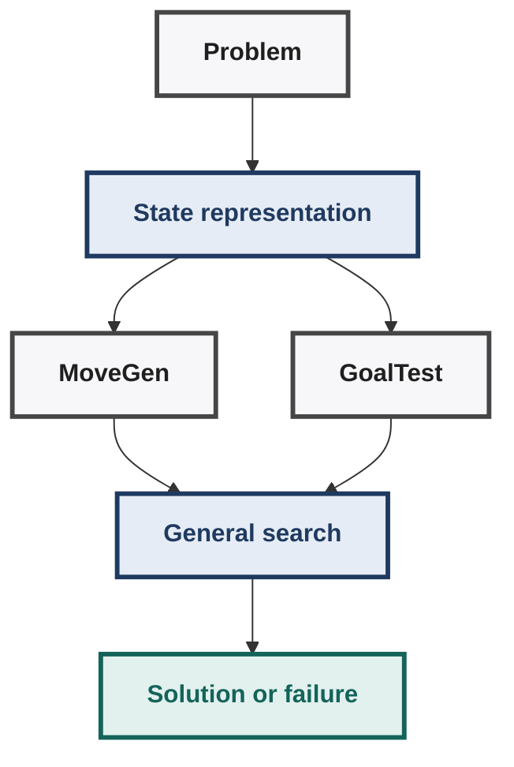

| Component | Meaning |
|---|---|
| **Start state** | State from which exploration begins |
| **Goal / goal description** | State or condition defining success |
| **MoveGen** | Generates neighbours of a supplied state |
| **GoalTest** | Determines whether a supplied state satisfies the goal |

> A goal may be represented as **one state, several states, or a goal description**.

### 20. Generate-and-Test

General search follows the basic pattern:

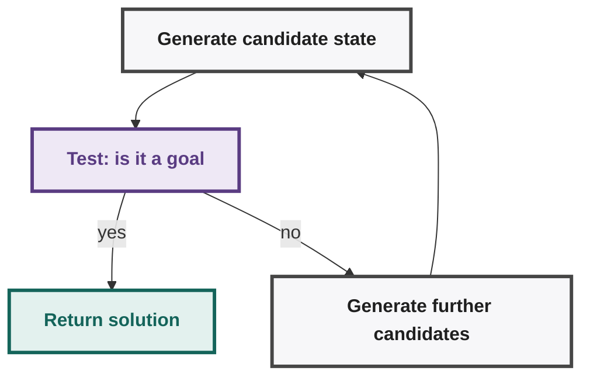

- Search progressively traverses the state space by generating new candidate nodes.
- Every selected candidate is tested using `GoalTest` before further expansion.
- This general strategy is called **generate-and-test**.

**The central search question:** Which candidate node should be selected next from `OPEN`?

The selection strategy determines: which part of the search space gets explored first; how quickly a solution may be discovered; whether a solution is discovered at all for some spaces.

### 21. `OPEN` and `CLOSED`

| Collection | Meaning |
|---|---|
| **OPEN** | Generated candidates that have not yet been selected/expanded |
| **CLOSED** | Nodes already selected, visited, and tested |

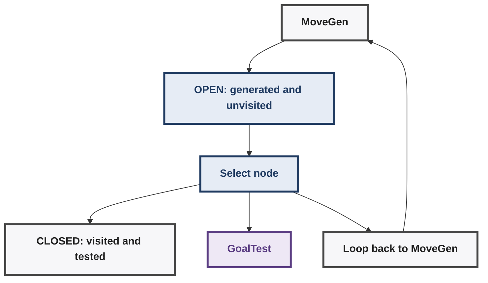

Memory hook: `OPEN = "I could explore these next."` / `CLOSED = "I have already explored these."`

`OPEN` starts with the start state, while `CLOSED` starts empty.

### 22. Tiny Search Problem

The lecture uses a small graph containing: `S = start`, `G = goal`, `A, B, C, D, E = intermediate states`. The important point is that `MoveGen` defines the neighbours.

Examples from the lecture:
```text

MoveGen(S) = {A, B, C}    MoveGen(C) = {S, G}    MoveGen(B) = {S, A, D}
```
Thus `MoveGen` **implicitly represents the graph**.

### 23. State Space ≠ Search Space

**State space:** the actual graph defined implicitly by the problem (`states + possible transitions`).
**Search space / search tree:** the structure actually generated while a particular algorithm explores the state space.


- The **same state space** can produce different search trees under different algorithms.
- A state may occur through multiple paths in the state space.
- The search tree can therefore contain repeated occurrences of states.
- Duplicate avoidance can make the generated search space substantially smaller.

> **State space = what can exist; search space = what the algorithm actually explores.**

### 24. Simple Search Algorithm 1

```text
OPEN ← {S}

while OPEN is not empty:
    N ← pick some node from OPEN
    remove N from OPEN

    if GoalTest(N):
        return N

    OPEN ← OPEN ∪ MoveGen(N)

return FAILURE
```

Interpretation:
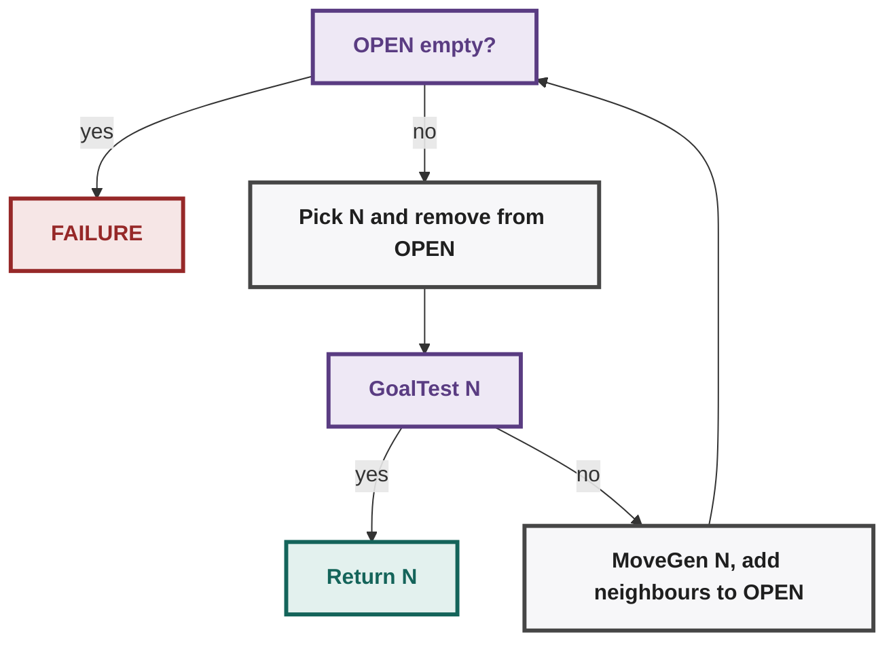

**Why is it called "simple"?**
- It does not specify **which** node should be selected from `OPEN`.
- Therefore it is **non-deterministic** with respect to node selection.
- Different choices can generate completely different search trees.
- It can succeed, fail to terminate, or repeatedly explore cycles.

### 25. Why Simple Search 1 Can Fail

A cyclic graph can cause repeated regeneration: `S → A → S → A → S → ...`

Example `OPEN` evolution:
- Start: `OPEN = {S}`
- Expand `S`: `OPEN = {A, B, C}`
- Expand `A`: `OPEN = {S, B, D, ...}` (`S` is regenerated, showing the cycle)
- Next: `OPEN = {A, B, C, B, D, ...}` (states repeat, so `OPEN` may never become empty)

Consequences: `OPEN` may never become empty; the algorithm can remain trapped inside a cycle indefinitely; a reachable goal may never be selected. Therefore **cycle handling is necessary** for general graph search.

### 26. Simple Search Algorithm 2 — Add `CLOSED`

The first fix is to remember states already visited.

```text

OPEN ← {S}
CLOSED ← {}

while OPEN is not empty:
    N ← pick some node from OPEN
    remove N from OPEN
    add N to CLOSED

    if GoalTest(N):
        return N

    OPEN ← OPEN ∪ (MoveGen(N) − CLOSED)

return FAILURE
```

Essential modification: `Generate neighbours → Remove already-CLOSED states → Add remaining candidates to OPEN`. When a node is selected, it moves `OPEN → CLOSED` and is therefore not regenerated later.

### 27. Why `CLOSED` Shrinks the Search

Suppose `S → A` and `A → S,B,D`. After expanding S: `CLOSED = {S}`. When A is expanded: `MoveGen(A) = {S,B,D}`. Because `S ∈ CLOSED`, we discard S and retain `{B,D}`. Thus the search avoids repeatedly travelling around the same cycle.

### 28. Avoiding Both `CLOSED` and `OPEN` Duplicates

A further reduction rejects states already present in either collection: `NewNodes = MoveGen(N) − OPEN − CLOSED`.

Example: `CLOSED = {S}`, `OPEN = {B,C}`, `MoveGen(A) = {S,B,D}`. Therefore: `S → reject (already CLOSED)`, `B → reject (already OPEN)`, `D → accept (new)`. Hence `NewNodes = {D}`.

A state is then added to the search tree **only when genuinely new**.

### 29. One State Space, Different Search Trees

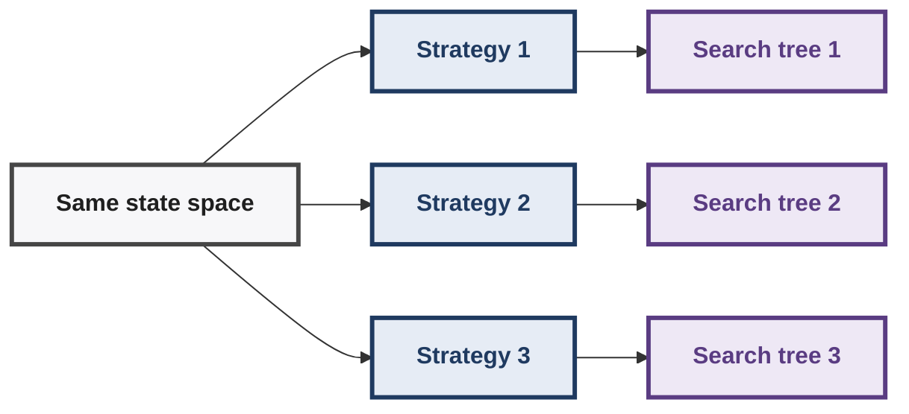

- Search strategy controls which candidate is selected from `OPEN`.
- Different selection rules explore different portions of the same underlying state space.
- Duplicate detection further changes the shape and size of the generated search tree.
- Later **DFS and BFS** mainly differ in how `OPEN` is organized and selected.

### 30. Node vs Solution Path

Simple Search 2 currently returns `N` when `GoalTest(N)` succeeds. But the useful solution normally requires the **path**, not merely the goal state.

Example: `S → A → D → G`. Desired result: `[S, A, D, G]` rather than simply `G`.

**Parent information** — represent search nodes using `(node, parent)`:
```text
(G,D)   (D,A)   (A,S)
```

Following parents backwards reconstructs: `S → A → D → G`.

> **Finding a goal state and recovering the path to that goal are separate requirements.**

### 31. Lecture 2 — Unified Mental Model

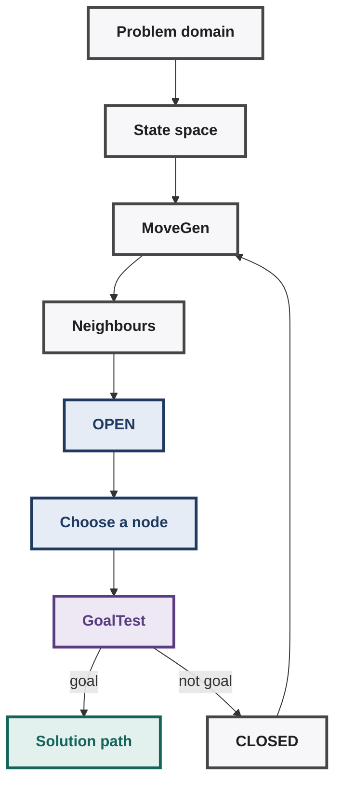

**Layers:**
1. **Problem:** defines what states and legal moves mean.
2. **State space:** implicit graph of all reachable states.
3. **MoveGen:** exposes neighbours when a state is expanded.
4. **OPEN:** stores generated but unexpanded candidates.
5. **CLOSED:** stores already expanded states.
6. **Selection strategy:** determines which OPEN node gets explored.
7. **GoalTest:** determines whether the selected state solves the problem.
8. **Parent information:** allows the discovered solution path to be reconstructed.

### 32. High-Value Exam Traps

- **`OPEN` contains generated candidates; `CLOSED` contains already expanded nodes.**
- **Simple Search 1 can loop indefinitely because cycles regenerate previously visited states.**
- **`CLOSED` prevents regeneration of states that have already been expanded.**
- **Rejecting both OPEN and CLOSED duplicates produces an even smaller search tree.**
- **State space is problem-defined; search space depends on the algorithm used.**
- **`MoveGen` defines the implicit graph without explicitly constructing the complete graph.**
- **Simple Search 1 leaves node-selection unspecified, making its behaviour non-deterministic.**
- **Returning a goal node alone does not provide the complete solution path.**
- **Parent pointers allow the algorithm to reconstruct the sequence leading to the goal.**
- **The central search-design question is which OPEN node should be selected next.**

### 33. Lecture 1 + 2 — Compact Architecture

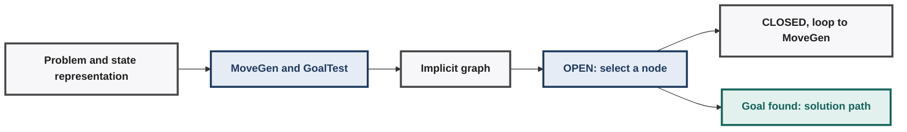

> **Next:** How should `OPEN` be organized so node selection becomes systematic? This leads directly to **DFS, BFS, depth-bounded search, and iterative deepening**.

---

## Lecture 3 — Planning, Configuration, NodePairs & Deterministic Search

### 34. Two Kinds of State-Space Problems

| Problem type | Objective | Examples |
|---|---|---|
| **Configuration problem** | Find a state satisfying a description | N-Queens, crossword, Sudoku, map colouring, SAT |
| **Planning problem** | Find a path to a known/described goal | River crossing, route finding, Rubik's Cube, 8/15/24-puzzle, cooking |

**Configuration problems:** Goal = find *any state* satisfying the required goal description. The solution is essentially the satisfying configuration itself. Example: N-Queens seeks a board where no queens attack each other.

**Planning problems:** Goal = reach an explicitly known or described goal state. The required output is the **sequence of states/moves leading there**. Goal may be exact, e.g. `(4,4,0)`, or descriptively specified. Example: route finding requires both destination and route to destination.

> **Configuration:** "Which state satisfies the description?" **Planning:** "How do I reach the goal?"

### 35. NodePairs — Storing Parent Information

A state-space graph contains states as nodes; search needs parent information.

**Why store parents?** Goal detection tells us **where** the search succeeded. Parent information tells us **how the goal was reached**. Following parent pointers reconstructs the complete solution path.

A search node becomes a pair `(currentNode, parentNode)`. Examples:
```text
(S, nil)   (A, S)   (D, A)   (E, D)   (G, E)
```

This encodes: `S → A → D → E → G`.

**Path reconstruction:** starting at the goal: `G → E → D → A → S → nil`. Reverse the recovered sequence: `S → A → D → E → G`. The required parent pairs can be searched within `CLOSED`.

### 36. Alternative Path Representation

Two approaches can represent the path during search:
1. **Store entire partial path** inside every search node.
2. **Store only `(currentNode, parentNode)`** and reconstruct later.

The second approach is more elegant because each node stores only its immediate parent: `Search node = (state, parent)`.

> **State space stores states; search space may additionally store path metadata.**

### 37. Deterministic Search Algorithms

Earlier search used `pick some node N from OPEN`. This is **non-deterministic** because the algorithm does not specify which node.
- It does **not** mean an oracle magically chooses the correct node.
- It simply means the node-selection rule is unspecified.
- Different choices can therefore produce different search behaviour.

**Make search deterministic** — replace sets with **ordered lists**: `OPEN = ordered list`, `CLOSED = ordered list`. Then always: `N ← head OPEN`. The algorithm becomes deterministic once insertion order is specified.

**Critical idea:** Where newly generated nodes are inserted into `OPEN` determines search behaviour. This directly leads to **Depth-First Search and Breadth-First Search**.

### 38. List Notation Used by Search Algorithms

| Notation | Meaning |
|---|---|
| `[]` | Empty list |
| `L is empty` | Boolean test for whether list `L` is empty |
| `ELEMENT : LIST` | Add `ELEMENT` to the head of `LIST` |
| `HEAD : TAIL` | Reconstruct list from first element and remainder |
| `head L` | First element of list `L` |
| `tail L` | Remaining list after removing first element |
| `L1 ++ L2` | Append/concatenate two lists |

Basic examples:
```text
[] is empty = TRUE        [1] is empty = FALSE
[1] = 1 : []
head [1] = 1     tail [1] = []     (tail [1]) is empty = TRUE
```

Longer list: `[3,2,1] = 3:[2,1] = 3:2:[1] = 3:2:1:[]`. Therefore:
```text
head [3,2,1] = 3          tail [3,2,1] = [2,1]
head tail [3,2,1] = 2     head tail tail [3,2,1] = 1
```

Important type distinction: `head L → element` / `tail L → list`

### 39. `:` vs `++` — Important Distinction

**Colon `:`** — takes **one element + one list**, places the element at the **head** of the list.
```text
1 : [2,3] = [1,2,3]
```

If the first argument is itself a list, that entire list becomes one element:
```text
[a,b,c] : [d,e] = [[a,b,c], d, e]
```

**Double-plus `++`** — takes **two lists** and appends them sequentially.
```text
[1,2] ++ [3,4] = [1,2,3,4]
```

Order matters: `[3,2,1] ++ [4,5] ≠ [4,5] ++ [3,2,1]`

Memory rule: `: → element + list → prepend` / `++ → list + list → append`

### 40. Useful List Construction Identities

```text
[] ++ [] = []
LIST ++ [] = LIST        [] ++ LIST = LIST

[o,u,t] ++ [r,u,n] = [o,u,t,r,u,n]
[r,u,n] ++ [o,u,t] = [r,u,n,o,u,t]
```

Lists can also be reconstructed through `head`, `tail`, `:` and `++`. These operations form the basic language for writing the upcoming search algorithms.

### 41. Tuples

A **tuple** is an ordered collection represented using parentheses: `(101,102)`, `(101,'AI SMPS',4)`. Tuples can contain heterogeneous elements: `(number, string, number)`. This makes tuples convenient for search metadata such as node pairs.

**Assignment / destructuring:** `(a,b) ← (101,102)` means `a = 101, b = 102`. A tuple can also be assigned to a single variable: `pair ← (101,102)` then `(a,b) ← pair`.

### 42. Tuple Access and Wildcards

Use `_` for an element whose value is irrelevant: `(a,_) ← pair` means "extract only the first element"; `(_,b) ← pair` extracts only the second element.

Built-in accessors: `first pair → first element`, `second pair → second element`, `third tuple → third element`. Example: `c ← third (101,'AI SMPS',4)`.

**Assignment vs equality test:** `c ← third tuple` means **assignment**. `third tuple = 4` means **test whether equality holds**, returning TRUE/FALSE.

> Do not confuse the left-arrow assignment operator with equality testing.

### 43. Lists and Tuples Can Be Nested

A tuple may contain a list: `(1,[101,102,103],nil)`. Then: `first tuple = 1`, `second tuple = [101,102,103]`, `third tuple = nil`. To access the first item of the embedded list: `head second tuple = 101`. To access the remaining embedded list: `tail second tuple = [102,103]`.

Pattern decomposition example: `(a,h:t,c) ← (1,[101,102,103],nil)` gives `a=1, h=101, t=[102,103], c=nil`. This compact decomposition is useful when manipulating search data structures.

### 44. List vs Tuple — Exam Distinction

| Structure | Notation | Primary operations |
|---|---|---|
| **List** | `[a,b,c]` | `head`, `tail`, `:`, `++`, `is empty` |
| **Tuple** | `(a,b,c)` | `first`, `second`, `third`, pattern matching |

- `head` and `tail` operate on **lists**.
- `first`, `second`, `third` operate on **tuples**.
- Tuples are especially useful for fixed-position metadata.
- Lists are especially useful for ordered collections and `OPEN`/`CLOSED`.

### 45. Lecture 3 — Search Architecture Update

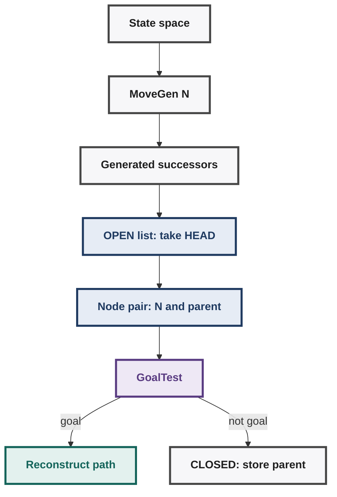

**The key progression:**
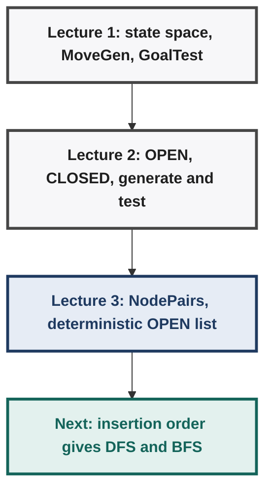

### 46. High-Value Exam Traps — Lecture 3

- **Configuration search seeks a satisfying state; planning search seeks a goal-reaching path.**
- **A goal description can represent multiple valid goal states.**
- **Goal detection alone does not reveal the route used to reach that goal.**
- **NodePairs store `(currentNode, parentNode)` for later path reconstruction.**
- **The start node has `nil` as its parent.**
- **Following parent pointers from goal reaches start in reverse order.**
- **Reverse the recovered parent chain to obtain the forward solution path.**
- **Non-deterministic `pick some node` means unspecified choice, not oracle-guided choice.**
- **Using ordered lists makes node selection deterministic when insertion order is specified.**
- **Insertion position in `OPEN` determines the resulting search strategy.**
- **`:` prepends one element; `++` appends two lists.**
- **`head` returns an element; `tail` returns a list.**
- **`first/second/third` access tuple positions; `head/tail` access list structure.**
- **`←` denotes assignment; `=` denotes an equality test.**
- **`_` represents an ignored or don't-care tuple component.**

### 47. Lecture 1–3 — Unified Core

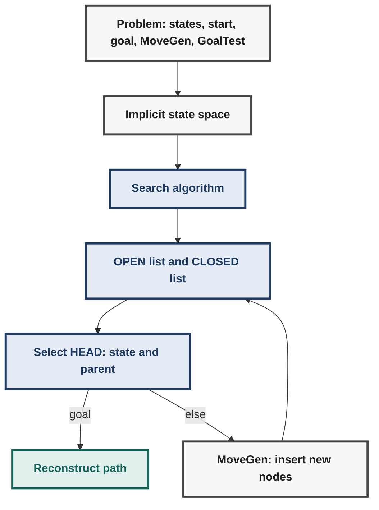

> **Next:** deterministic insertion strategies give us **Depth-First Search (DFS)** and **Breadth-First Search (BFS)**.

---

## Lecture 4 — Deterministic State-Space Search

### DFS and BFS: Core Idea

- DFS and BFS are the first concrete deterministic state-space search algorithms.
- Both use the same `MoveGen`, `GoalTest`, `OPEN`, `CLOSED`, and node-pair machinery.
- Both always select the **head of `OPEN`**.
- Their only structural difference is **where newly generated node-pairs enter `OPEN`**.

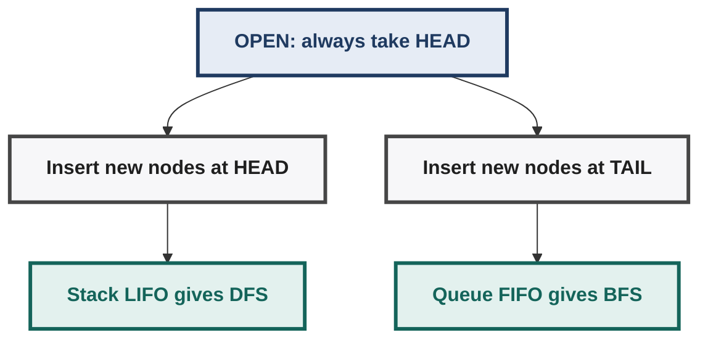

### 49. Depth-First Search — DFS

**OPEN = Stack**
- DFS inserts newly generated node-pairs at the **front/head of `OPEN`**.
- `OPEN` therefore behaves as a **stack: LIFO (Last In, First Out)**.
- The newest generated children are inspected before older pending nodes.
- This makes search **dive deeply** into one branch before backtracking.

**DFS pseudocode:**
```text
DFS(S)
    OPEN ← (S,nil) : []
    CLOSED ← empty list

    while OPEN is not empty
        nodePair ← head OPEN
        (N,_) ← nodePair

        if GoalTest(N) = TRUE
            return ReconstructPath(nodePair, CLOSED)
        else
            CLOSED ← nodePair : CLOSED
            children ← MoveGen(N)
            newNodes ← RemoveSeen(children, OPEN, CLOSED)
            newPairs ← MakePairs(newNodes, N)
            OPEN ← newPairs ++ (tail OPEN)

    return empty list
```

**DFS flow:**
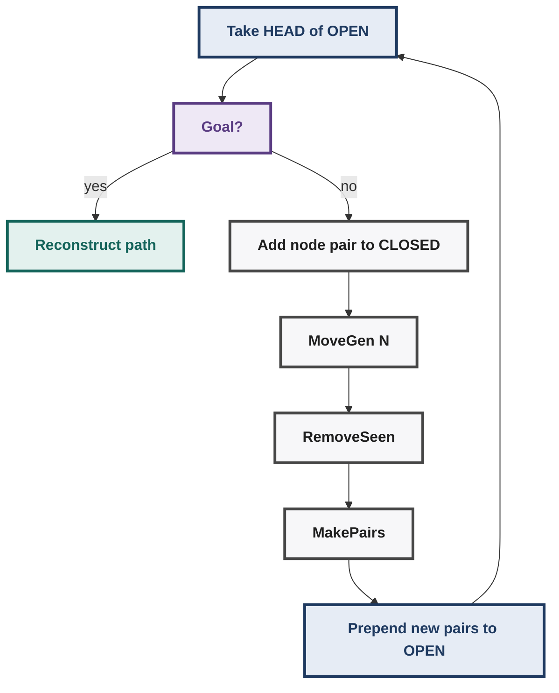

**Why DFS becomes a stack:**
- Before: `OPEN = [older nodes ...]` and `newPairs = [new children]`
- Update: `OPEN \← newPairs ++ tail OPEN`
- Effect: new children become the new head, so the newest node leaves first (LIFO)
New children become the new head. The newest node enters first and leaves first. Therefore: **LIFO → stack → depth-first behaviour**.

**DFS search behaviour:**
- Generates children and immediately explores the newest child.
- Repeatedly follows one branch deeper into the search space.
- Backtracks when a branch has no useful unexplored continuation.
- Typically visualised as **newest/deepest children first**.
- Child ordering determines which branch is considered first.
- Lecture convention often visualises this as choosing the leftmost child first.
- In finite spaces, DFS may backtrack and try another branch.
- In infinite spaces, DFS can remain trapped indefinitely along one branch.

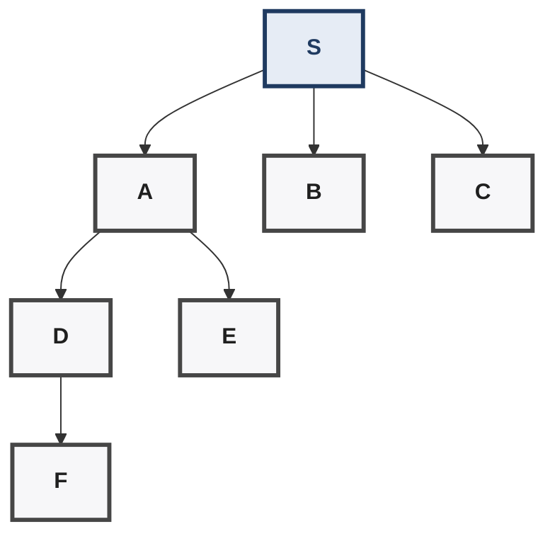

DFS tendency: `S \→ A \→ D \→ F`, backtrack to `E`, then `B`, then `C`.

> **Memory cue:** DFS = **Dive First** → newest/deepest available node first.

### 50. Ancillary Function — RemoveSeen

```text
RemoveSeen(nodeList, OPEN, CLOSED)
    if nodeList is empty
        return empty list
    else
        node ← head nodeList
        if OccursIn(node, OPEN) or OccursIn(node, CLOSED)
            return RemoveSeen(tail nodeList, OPEN, CLOSED)
        else
            return node : RemoveSeen(tail nodeList, OPEN, CLOSED)
```

**Purpose:** Receives the neighbours generated by `MoveGen`; removes nodes already present in `OPEN` or `CLOSED`; recursively scans the generated-node list from left to right; keeps a node only when it occurs in neither list; prevents duplicate states and helps avoid search loops.


### 51. Ancillary Function — OccursIn

```text

OccursIn(node, nodePairs)
    if nodePairs is empty
        return FALSE
    elseif node = first head nodePairs
        return TRUE
    else
        return OccursIn(node, tail nodePairs)
```

- Searches a list of node-pairs for a given node.
- Compares against the **first element** of each node-pair.
- Ignores the parent component during duplicate detection.
- Called separately on `OPEN` and `CLOSED` by `RemoveSeen`.

```text

nodePairs = [(A,S), (B,S), (D,A)]
OccursIn(D, nodePairs) → TRUE      OccursIn(C, nodePairs) → FALSE
```

### 52. Ancillary Function — MakePairs

```text

MakePairs(nodeList, parent)
    if nodeList is empty
        return empty list
    else
        (head nodeList, parent) :
            MakePairs(tail nodeList, parent)
```

Converts generated nodes into `(node,parent)` pairs. Every child generated from `N` receives `N` as its parent.
```text

MakePairs([A,B,C,D], S) → [(A,S),(B,S),(C,S),(D,S)]
```

> **Key distinction:** a **list** contains an ordered collection; a **tuple/pair** stores fixed-position components.

### 53. Ancillary Function — ReconstructPath

**Purpose:** Traces parent relationships stored in `CLOSED`; reconstructs the path from the found goal back to `S`.

```text
SkipTo(parent, nodePairs)
    if nodePairs is empty
        return empty list
    elseif parent = first head nodePairs
        return nodePairs
    else
        return SkipTo(parent, tail nodePairs)

ReconstructPath(nodePair, CLOSED)
    (node,parent) ← nodePair
    path ← node : []

    while parent is not null
        path ← parent : path
        CLOSED ← SkipTo(parent, CLOSED)
        (_,parent) ← head CLOSED

    return path
```

`SkipTo(parent, nodePairs)` searches `CLOSED` until the pair whose first component equals `parent`; that pair reveals the next parent to follow.

**Example:** Goal pair `(G,E)`; `CLOSED` contains `(G,E), (E,D), (D,A), (A,S), (S,nil)`. Parent tracing: `G → E → D → A → S`. Returned path: `[S, A, D, E, G]`.

Important distinction: Parent information is **stored as node-pairs**, not actual memory pointers. `CLOSED` preserves enough parent information to reconstruct the path. The algorithm starts with the goal and prepends each parent to `path`.

### 54. Breadth-First Search — BFS

**OPEN = Queue**
- BFS uses the same algorithmic framework as DFS.
- New node-pairs are inserted at the **end/tail of `OPEN`**.
- `OPEN` therefore behaves as a **queue: FIFO (First In, First Out)**.
- Older pending nodes are inspected before newly generated children.

**BFS pseudocode:**
```text
BFS(S)
    OPEN ← (S,nil) : []
    CLOSED ← empty list

    while OPEN is not empty
        nodePair ← head OPEN
        (N,_) ← nodePair

        if GoalTest(N) = TRUE
            return ReconstructPath(nodePair, CLOSED)
        else
            CLOSED ← nodePair : CLOSED
            children ← MoveGen(N)
            newNodes ← RemoveSeen(children, OPEN, CLOSED)
            newPairs ← MakePairs(newNodes, N)
            OPEN ← (tail OPEN) ++ newPairs

    return empty list
```

**Critical DFS/BFS difference:**
| Algorithm | Update | Insertion point |
|---|---|---|
| DFS | `OPEN \← newPairs ++ (tail OPEN)` | Add at HEAD |
| BFS | `OPEN \← (tail OPEN) ++ newPairs` | Add at TAIL |
Everything else remains essentially the same.

### 55. DFS vs BFS — Search Behaviour

| Property | DFS | BFS |
|---|---|---|
| `OPEN` structure | Stack | Queue |
| Removal | Head | Head |
| Insertion | Head | Tail |
| Discipline | LIFO | FIFO |
| Priority | Newest children | Oldest pending nodes |
| Search pattern | Deep branch first | Level by level |
| Backtracking | Prominent | Not depth-driven |
| Typical direction | Away from start quickly | Expands outward from start |

- DFS: `S \→ level1 \→ level2 \→ level3 \→ ...` down one deep branch, then backtrack
- BFS: `S (level 0) \→ {A, B, C} (level 1) \→ {...} (level 2) \→ ...`, finishing each layer before going deeper

### 56. Why BFS Moves Level-by-Level

Suppose `S` generates `A, B, C`: `OPEN=[S]` → after expanding S: `OPEN=[A,B,C]`. Expand `A`: `OPEN=[B,C,A1,A2,...]`.

- `A`'s children are placed **behind** `B` and `C`.
- Therefore `B` and `C` are inspected before `A1`, `A2`, etc.
- All nodes at the current distance are processed before deeper nodes.
- Thus BFS systematically expands the search space **layer by layer**.

- Distance 0: `S`
- Distance 1: `A, B, C`
- Distance 2: children of `A`, `B`, `C`
- Distance 3: next layer, and so on

> Lecture framing: BFS stays closer to the start node; DFS dives as far as possible.

### 57. Search Strategy Is Controlled by OPEN

The search framework fixes: 1) Select HEAD of OPEN; 2) GoalTest selected node; 3) Otherwise put it in CLOSED; 4) Generate children using MoveGen; 5) Remove already-seen nodes; 6) Create node-pairs.

Only the insertion location changes:
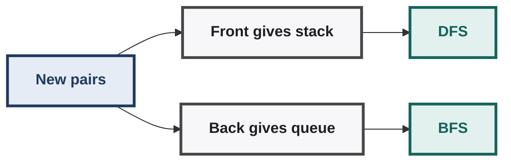

**Central insight:** Search behaviour is determined by the ordering of candidates in `OPEN`.

### 58. DFS and BFS — Conceptual Contrast

**DFS — "follow the newest branch":** Generate → immediately inspect newest child → go deeper → backtrack → try another branch.

**BFS — "finish older candidates first":** Generate → place children behind existing candidates → inspect older nodes → finish current layer → move to next layer.

- DFS is **impetuous**: a new node is explored immediately.
- BFS is **conservative**: previously generated candidates are explored first.
- DFS tends toward the deepest available node.
- BFS tends toward the closest available node.

### 59. Shortest-Path Observation

- The lecture states that **BFS finds shortest paths**.
- Its layer-by-layer expansion examines states by increasing distance from `S`.
- Therefore a goal encountered at the first reachable layer has a shortest path.
- This relies on the state-space search being interpreted through equal-step transitions.


DFS does not impose this distance-ordered expansion.

### 60. High-Value Exam Traps — Lecture 4

- **DFS adds `newPairs` before `tail OPEN`; BFS adds them after `tail OPEN`.**
- **Both DFS and BFS always remove the node at `head OPEN`.**
- **DFS = stack = LIFO = newest children first.**
- **BFS = queue = FIFO = oldest pending nodes first.**
- **The algorithms differ primarily in `OPEN` insertion order.**
- **`CLOSED` serves both loop/duplicate avoidance and parent-path reconstruction.**
- **`RemoveSeen` removes nodes occurring in either `OPEN` or `CLOSED`.**
- **`OccursIn` checks only the node component of each node-pair.**
- **`MakePairs` assigns the expanded node as parent of every new child.**
- **`ReconstructPath` follows parent relationships backward, then builds forward path.**
- **DFS may follow one infinite branch without returning to alternatives.**
- **BFS expands the search space layer by layer.**
- **Child-generation order affects which sibling DFS explores first.**
- **BFS's shortest-path property follows its distance/layer ordering in equal-step search.**

### 61. Week 2 Search Algorithms — Unified View

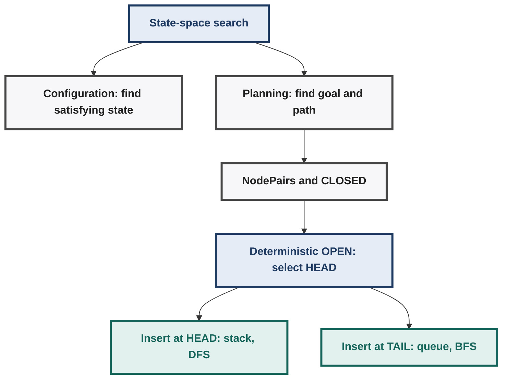

**Core formula:** Same search algorithm + Different OPEN insertion position → Different search strategy

**One-line memory map:**
| Algorithm | Insertion | Structure | Discipline | Explores |
|---|---|---|---|---|
| DFS | HEAD | Stack | LIFO | Deepest and newest first |
| BFS | TAIL | Queue | FIFO | Level by level, oldest first |

---

## Lecture 5 — Search Trees, Duplicate Handling, and Termination

### Tiny State Space Used in Lecture

```text

Start: S     Goal: G

MoveGen:  S → A, B, D     A → C, B, S     B → S, A, C     C → B, A     D → S, G     G → D
GoalTest: G → TRUE        S,A,B,C,D → FALSE
```

- All moves are reversible: every listed transition has a reverse transition.
- Search repeatedly follows **Generate → Test → Expand if not goal**.
- Search terminates when `GoalTest(N) = TRUE`.

### 63. Three Duplicate-Handling Cases

The important variable is **which generated nodes are allowed into `OPEN`**.

| Case | Nodes rejected | `RemoveSeen` behaviour | Main consequence |
|---|---|---|---|
| **1. Only new nodes** | Already in `OPEN` **or** `CLOSED` | Prunes both | Finite, clean search tree |
| **2. CLOSED-pruned only** | Already in `CLOSED` | Allows nodes already in `OPEN` | Duplicate nodes can enter tree |
| **3. No pruning** | Nothing | `RemoveSeen` not used | Cycles possible; DFS can loop forever |

- Case 1: reject a generated node if it is in `OPEN` or `CLOSED`
- Case 2: reject it only if it is in `CLOSED`
- Case 3: always add it to `OPEN`

### 64. Case 1 — Only New Nodes Added to `OPEN`

**Rule:** reject any node already present in `OPEN` or `CLOSED`.
- `RemoveSeen(children, OPEN, CLOSED)` enforces this restriction.
- DFS and BFS therefore construct the **same search tree**.
- They differ only in the **order in which that tree is explored**.
- Child-generation order follows the order specified by `MoveGen`.

Example exploration order — tree: `S → {A,B,D}`, `A → C`, `D → G`.

| Strategy | Inspection order |
|---|---|
| **DFS** | `S → A → C → B → D → G` |
| **BFS** | `S → A → B → D → C → G` |

**Key point:** same tree, different traversal order.

### 65. Case 1 — Why DFS and BFS Differ

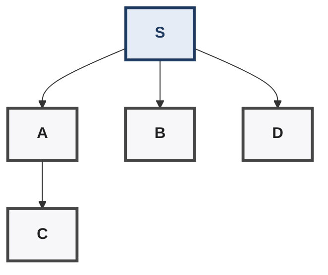

- DFS: `S \→ A \→ C \→ ... \→ B \→ D \→ G` (newest child first)
- BFS: `S \→ A \→ B \→ D \→ C \→ G` (oldest pending node first)

- DFS immediately follows newly generated children because `OPEN` is a stack.
- BFS postpones newly generated children behind older candidates.
- DFS therefore dives down a branch before alternatives.
- BFS completes nearer levels before moving deeper.
- Both eventually inspect `D`, generate `G`, then test `G`.

### 66. Case 2 — Nodes in `CLOSED` Pruned, `OPEN` Duplicates Allowed

**Rule:** reject a generated node only if it already occurs in `CLOSED`.
- A node already in `OPEN` may be generated again.
- Therefore the search tree can contain **duplicate state occurrences**.
- Once a state enters `CLOSED`, later generations of that state are pruned.
- DFS and BFS can therefore produce **different search-tree structures**, not merely different traversal orders.

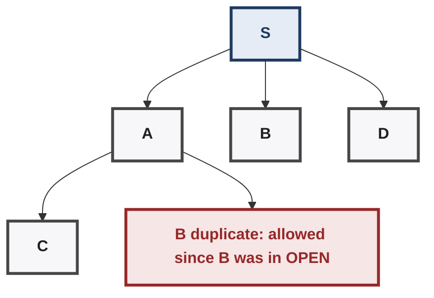

| Aspect | DFS | BFS |
|---|---|---|
| `OPEN` structure | Stack | Queue |
| OPEN duplicates allowed? | Yes | Yes |
| CLOSED states regenerated? | No | No |
| Search tree | Different duplicate placement | Different duplicate placement |
| Traversal | Deep-first | Level-first |

**Important:** `OPEN` membership alone no longer prevents duplicate states.

### 67. Case 3 — All Generated Nodes Added

**Rule:** every child generated by `MoveGen` is inserted into `OPEN`.
```mermaid
flowchart LR
  S["S"]:::base --> A["A"]:::base --> C["C"]:::base --> B["B"]:::base --> S
  classDef base fill:#F7F7F9,stroke:#464646,stroke-width:3px,color:#1F1F1F,font-weight:bold
  classDef core fill:#E6ECF5,stroke:#1F3A60,stroke-width:3px,color:#1F3A60,font-weight:bold
  classDef q fill:#EEE8F5,stroke:#5A3C82,stroke-width:3px,color:#5A3C82,font-weight:bold
  classDef good fill:#E3F1EE,stroke:#14645A,stroke-width:3px,color:#14645A,font-weight:bold
  classDef warn fill:#F6E6E6,stroke:#962828,stroke-width:3px,color:#962828,font-weight:bold
```

**DFS consequence:** DFS follows newly generated nodes immediately; reversible edges allow it to return to previously visited states (e.g. `S → A → C → B → S`); DFS can therefore enter an **infinite loop** and never reach `G`. This demonstrates why explicit loop/duplicate avoidance is necessary.

DFS loops forever here: `S \→ A \→ C \→ B \→ S \→ A \→ C \→ ...`

**BFS consequence:** BFS also permits duplicates, but explores **level by level**; previously generated candidates remain ahead of newly generated ones; it eventually reaches `D`, generates `G`, and then inspects `G`. In the lecture's simulation, `G` is found on the **11th inspection**.

- Level 0: `S`
- Level 1: `A, B, D`
- Level 2: generated children
- Level 3: more generated states, until `G` is eventually inspected

**Lecture observation:** BFS finds the goal despite unrestricted duplicate generation; DFS can remain trapped in a cycle.

### 68. Three Cases — Direct Comparison

| Property | Case 1 | Case 2 | Case 3 |
|---|---|---|---|
| Reject `OPEN` duplicates | Yes | No | No |
| Reject `CLOSED` duplicates | Yes | Yes | No |
| `RemoveSeen` | `OPEN ∪ CLOSED` | `CLOSED` only | Not used |
| Duplicate states in tree | No | Yes | Yes, repeatedly |
| Cycles possible in generated tree | No | Controlled by `CLOSED` | Yes |
| DFS termination issue | Avoided | Avoided | **May loop forever** |
| BFS goal discovery | Finite search | Finite search | Eventually reaches `G` here |
| DFS/BFS same tree? | **Yes** | **No** | **No** |

### 69. Why `CLOSED` Matters

Without `CLOSED`, search cycles: `S \→ A \→ C \→ B \→ S \→ ...`
`CLOSED` records states already inspected/expanded: `CLOSED = "states whose expansion has already happened"`.

Its roles: 1) Prevent repeated expansion / cycles. 2) Control duplicate generation. 3) Support parent information for path reconstruction.

> Primary loop-prevention insight: **do not re-add already-closed states.**

### 70. Search Tree vs State Space

- State space (actual states and transitions): `S \→ {A, B, D}` and `A \→ {C, B}`
- Search tree (states generated in this search): `S \→ {A, B, D}` and `A \→ C`
- The **state space** is defined by `MoveGen`.
- The **search tree** is produced by a particular search procedure.
- Duplicate-handling rules determine how much of the state space becomes search-tree nodes.
- Different algorithms or pruning policies can produce different search trees from the same state space.

### 71. Core Insight from Lecture 5

```mermaid
flowchart TD
  SS["Same state space"]:::base --> C1["Case 1: prune OPEN and CLOSED"]:::good --> T1["Finite tree: same tree, different order"]:::base
  SS --> C2["Case 2: prune CLOSED only"]:::q --> T2["OPEN duplicates: different trees"]:::base
  SS --> C3["Case 3: no pruning"]:::warn --> T3["Cycles: DFS may loop, BFS reaches goal"]:::warn
  classDef base fill:#F7F7F9,stroke:#464646,stroke-width:3px,color:#1F1F1F,font-weight:bold
  classDef core fill:#E6ECF5,stroke:#1F3A60,stroke-width:3px,color:#1F3A60,font-weight:bold
  classDef q fill:#EEE8F5,stroke:#5A3C82,stroke-width:3px,color:#5A3C82,font-weight:bold
  classDef good fill:#E3F1EE,stroke:#14645A,stroke-width:3px,color:#14645A,font-weight:bold
  classDef warn fill:#F6E6E6,stroke:#962828,stroke-width:3px,color:#962828,font-weight:bold
```

**Memory rule:**
- Case 1: `OPEN + CLOSED` pruning gives the same search tree with a different order
- Case 2: `CLOSED`-only pruning gives duplicates in `OPEN` and the search tree
- Case 3: no pruning gives cycles, and DFS may never terminate

### 72. High-Value Exam Traps — Lecture 5

- **Case 1:** both `OPEN` and `CLOSED` duplicates are pruned.
- **Case 1:** DFS and BFS explore the same search tree differently.
- **Case 2:** nodes in `OPEN` may be duplicated; `CLOSED` nodes are pruned.
- **Case 2:** DFS/BFS can therefore generate different search trees.
- **Case 3:** every generated node is accepted into `OPEN`.
- **Case 3:** reversible moves can create infinite cycles.
- **DFS is vulnerable to infinite looping without cycle prevention.**
- **BFS can still reach a goal despite duplicate generation in this example.**
- **`CLOSED` prevents revisiting already-expanded states.**
- **State space ≠ search tree; pruning and strategy shape the search tree.**
- **MoveGen ordering affects sibling exploration order, especially for DFS.**
- **BFS's advantage comes from systematic level-by-level exploration.**
- **Never infer DFS/BFS tree identity without checking the duplicate policy.**

### 73. Lecture 5 — One-Page Mental Model

```mermaid
flowchart TD
  SS["State space"]:::base --> MG["MoveGen N: generated nodes"]:::base
  MG --> C1["Case 1: prune OPEN and CLOSED, no duplicates"]:::good
  MG --> C2["Case 2: prune CLOSED only, OPEN duplicates"]:::q
  MG --> C3["Case 3: no pruning, cycles"]:::warn
  OP["OPEN policy: stack gives DFS, queue gives BFS"]:::core --> DV["DFS: depth-first with backtracking"]:::base
  OP --> BV["BFS: breadth-first level by level"]:::base
  classDef base fill:#F7F7F9,stroke:#464646,stroke-width:3px,color:#1F1F1F,font-weight:bold
  classDef core fill:#E6ECF5,stroke:#1F3A60,stroke-width:3px,color:#1F3A60,font-weight:bold
  classDef q fill:#EEE8F5,stroke:#5A3C82,stroke-width:3px,color:#5A3C82,font-weight:bold
  classDef good fill:#E3F1EE,stroke:#14645A,stroke-width:3px,color:#14645A,font-weight:bold
  classDef warn fill:#F6E6E6,stroke:#962828,stroke-width:3px,color:#962828,font-weight:bold
```

**Core chain:** Duplicate policy → Search tree → OPEN ordering → Traversal behaviour → Termination

---

## Lecture 6 — DFS vs BFS: Complexity, Quality, and Completeness

### 74.1 Core Behaviour

| Property | DFS | BFS |
|---|---|---|
| `OPEN` | **Stack (LIFO)** | **Queue (FIFO)** |
| Behaviour | Dive deeply, backtrack | Explore level-by-level |
| Node preference | Newest generated candidate | Oldest generated candidate |
| Search tendency | Far from start quickly | Stay close to start |
| Fifth inspected node | Can be deeper | Always no deeper than prior frontier level |

- DFS: `S \→ A \→ A1 \→ A11 \→ ...` (go deep)
- BFS: `S \→ {A, B, C} \→ next level` (go wide)

- `MoveGen` ordering still determines sibling order within either algorithm.
- DFS and BFS can therefore inspect very different regions after the same number of expansions.
- With branching factor `b`, a tree can contain approximately `1, b, b², b³, ...` nodes by depth.

### 74.2 Search-Tree Growth

For constant branching factor `b`:
| Depth | 0 | 1 | 2 | 3 | ... | d |
|---|---|---|---|---|---|---|
| Nodes | 1 | b | b\u00b2 | b\u00b3 | ... | b\u1d48 |

Total through depth `d`: `1 + b + b\u00b2 + ... + b\u1d48 = (b^(d+1) \u2212 1)/(b \u2212 1)` for `b \u2260 1`.
- Search trees therefore grow **exponentially** with depth.
- This exponential growth is the fundamental difficulty for uninformed search.
- Complexity analysis counts **inspected/expanded nodes** as the time proxy.

### 75. DFS vs BFS — Time Complexity

Assume constant branching factor `b`, goal at depth `d`, `N_DFS`/`N_BFS` = nodes inspected. Goal position can vary among nodes at depth `d`.

**Best-case / leftmost goal:**
```text
N_DFS = d + 1
N_BFS = 1 + b + b² + ... + b^(d−1) + 1 (goal itself) = (bᵈ − 1)/(b − 1) + 1
```

Interpretation: a goal on the DFS-first branch can be found after only its depth-plus-root nodes, while BFS must finish all shallower levels first.

**Worst-case / rightmost goal:** both may inspect essentially the complete tree through depth `d`:
```text
N_DFS ≈ N_BFS ≈ (b^(d+1) − 1)/(b − 1)
```

**Average position** (lecture's leftmost/rightmost approximation):
```text
N_DFS ≈ bᵈ / 2
N_BFS ≈ bᵈ(b + 1) / [2(b − 1)]
N_BFS / N_DFS ≈ (b + 1)/(b − 1)
```

- Both therefore have **exponential average time complexity: `O(bᵈ)`**.
- BFS may inspect more nodes on average, but only by factor `(b+1)/(b−1)` under this approximation.
- For `b = 10`, the factor is `11/9 ≈ 1.22`.
- As `b` increases, this ratio approaches `1`; their exponential order remains unchanged.
- **Do not interpret this ratio as BFS always being exactly 1.22× slower.** It is an asymptotic/lecture approximation under stated assumptions.

### 76. Why DFS Can Be Much Faster Sometimes

- Goal near the preferred branch: `S \→ {A (leads to G, DFS reaches it quickly), B, C, D}`
- Goal near a later branch: `S \→ {A (huge subtree), B, C, D (leads to G, BFS reaches it by depth)}`
- DFS performance depends strongly on **where the goal lies relative to its traversal order**.
- BFS performance depends primarily on **goal depth**, not which branch contains it.
- Thus DFS can be dramatically better for a deep goal on its preferred branch.
- BFS can be dramatically better when the goal is shallow but lies behind a later DFS branch.
- `MoveGen` ordering can therefore materially affect practical DFS performance.

### 77. Space Complexity — Size of `OPEN`

The lecture uses `|OPEN|` as an approximation of search-space memory.

**DFS:** at each expansion, generate `b` children, choose one to continue, `≈ b − 1` siblings remain in OPEN. Hence the frontier grows roughly linearly with depth: `OPEN_DFS = O(bd)`.
- For constant `b`, this is **linear in depth: `O(d)`**.
- As DFS backtracks, pending siblings can also be consumed, so `OPEN` may shrink.
- DFS stores essentially the current deep path plus unexpanded siblings.

**BFS:** completes an entire level before proceeding:
| Level | 0 | 1 | 2 | ... | d |
|---|---|---|---|---|---|
| Nodes | 1 | b | b\u00b2 | ... | b\u1d48 |
Hence `OPEN_BFS = O(bᵈ)`.
- The frontier can contain an entire exponentially large level.
- BFS therefore has **exponential space complexity**.

Intuition: DFS frontier is mostly one deep path + siblings (linear); BFS frontier holds an entire next level (exponential).

### 78. Search Frontier

**Search frontier = nodes currently in `OPEN` waiting for inspection.** `CLOSED` = already inspected/expanded; `OPEN` = generated but not yet inspected.

| Algorithm | Frontier growth | Space |
|---|---|---|
| DFS | Roughly linear with depth | `O(bd)` ≈ `O(d)` for constant `b` |
| BFS | Roughly one whole level | `O(bᵈ)` |

**Key intuition:** frontier size, not total explored nodes, determines the dominant `OPEN` memory requirement.

### 79. Solution Quality

**BFS** — with **unit/equal step costs**: `S→A→X→G` (length 3) vs `S→B→G` (length 2, BFS finds this first).
- BFS examines states in nondecreasing path depth.
- Therefore the first goal found has the **minimum number of edges/actions** — the **shortest path** when every action has equal cost.

**DFS** — e.g. `S→A→X→Y→G` (length 3) vs `S→B→G` (length 2).
- DFS may find a deeper solution before a shallower one.
- Therefore DFS provides **no shortest-path guarantee**.
- DFS can still return a valid solution; validity and optimality are different properties.

> **Exam trap:** BFS is shortest-path/optimal only under the appropriate cost assumption—normally equal unit step costs.

### 80. Completeness / Systematic Search

**Completeness:** if a solution exists under the algorithm's assumptions, the algorithm is guaranteed to find one.
**Systematic search:** eventually explores all relevant reachable states rather than getting permanently trapped in one branch.

```text
If reachable goal exists: Completeness ⇒ algorithm eventually finds it.
```

**Finite search space:** with appropriate duplicate/cycle handling, a finite state space has finite reachable states, so DFS and BFS can exhaust the reachable space → goal found OR failure reported.
- Thus the lecture's claim that DFS is "not complete" mainly concerns **infinite/unbounded search spaces** or insufficient cycle handling.
- On a finite graph with proper duplicate pruning, DFS can terminate and determine whether a reachable goal exists.

**Infinite search space:** DFS may continually follow an infinite branch (`S→A→A1→A2→...`) and never return, while `G` sits elsewhere.
- Therefore DFS is **not guaranteed complete** on arbitrary infinite spaces.
- BFS explores by increasing depth and will eventually reach any goal at **finite depth**, assuming finite branching.
- If no finite-depth solution exists, BFS itself does not terminate on an infinite search space.

### 81. Completeness Conditions — Important Precision

| Situation | DFS | BFS |
|---|---|---|
| Finite state space + cycle/duplicate control | Complete | Complete |
| Infinite tree, finite-depth goal, finite branching | Not guaranteed | Complete |
| Infinite tree, no solution | May run forever | May run forever |
| Finite graph but unrestricted duplicates | Can loop | Can repeatedly generate states; termination depends on implementation |
| Goal exists but only at infinite depth | No finite solution path | No finite solution path |

**Finite branching matters:** BFS reaches every finite depth after finitely many nodes only when each node has finitely many children.

### 82. Completeness vs Existence of a Goal

These are different questions: `Does a goal node exist somewhere?` ≠ `Is there a path from S to that goal?`

Example: reachable component `S─A─B─C─D`, with `G` disconnected elsewhere.
- `G` exists but is unreachable from `S`.
- A complete search eventually exhausts all states reachable from `S`.
- It can then correctly report **no path**, rather than merely failing to find one.

- Complete search: everything reachable was searched, so it can correctly report no solution
- Incomplete search: stopped or trapped early, so it cannot conclude that no solution exists

### 83. Four-Way DFS vs BFS Comparison

| Criterion | DFS | BFS |
|---|---|---|
| **Time** | Exponential `O(bᵈ)` average | Exponential `O(bᵈ)` |
| **Space (`OPEN`)** | Linear `O(bd)` | Exponential `O(bᵈ)` |
| **Solution quality** | No optimality guarantee | Shortest path for equal step costs |
| **Completeness** | Not guaranteed on infinite spaces | Guaranteed for finite-depth goals with finite branching |
| **Core strength** | Very low memory; can find deep branch quickly | Systematic; shallow solutions found first |
| **Core weakness** | Can chase bad/infinite branch | Frontier memory explosion |

### 84. DFS vs BFS — Visual Mental Model

- Search tree: `S \→ {A, B, C} \→ deeper levels ...`
- DFS: `S \→ A \→ A1 \→ A11 \→ A111 \→ ...` (depth before breadth, memory `O(depth)`)
- BFS: `S \→ A, B, C \→ A1, A2, B1, B2, C1, C2 \→ ...` (breadth before depth, memory `O(b^depth)` since the entire frontier is held)

### 85. Complexity Notation — What Exactly Is Being Counted?

- **Time complexity:** approximate number of nodes inspected/expanded.
- **Space complexity:** approximate number of nodes simultaneously stored in `OPEN`/frontier.
- `CLOSED` also consumes memory in implementations that retain visited nodes.
- The lecture's DFS-vs-BFS space comparison specifically focuses on **`OPEN` size**.
- If total memory includes `CLOSED`, overall graph-search memory can be larger than the frontier alone.

**Important distinction:** `OPEN size → frontier memory` / `CLOSED size → visited-state memory` / `OPEN + CLOSED → total search memory`

### 86. The Fundamental Trade-off

- DFS: low frontier memory, dives into a branch, may find a deep solution quickly, but has no optimality guarantee and may never return from an infinite branch
- BFS: huge frontier, explores level by level, finds the shallow solution first with the shortest path, and guarantees finite-depth goals under the stated assumptions
`*` under the stated assumptions: finite branching and equal/unit step costs for shortest-path optimality.

### 87. Why the Next Algorithm Matters

- DFS gives: linear-space frontier, but no shortest-path guarantee
- BFS gives: shortest path for unit costs, but an exponential frontier
- Desired: DFS-like linear space plus a BFS-like shortest-path guarantee
**This motivates the next search strategy:** an algorithm designed to combine low space usage with shortest-path behaviour.

### 88. High-Value Exam Traps — Lecture 6

- Both DFS and BFS have **exponential time** in the lecture's average analysis.
- DFS has **linear-in-depth frontier space** for constant branching factor.
- BFS has **exponential frontier space** because an entire level may wait in `OPEN`.
- DFS can be faster when the goal lies on its preferred/deep branch.
- BFS is better positioned for shallow goals regardless of branch ordering.
- BFS gives shortest path only for **equal/unit action costs**.
- DFS gives no shortest-path guarantee.
- Completeness concerns **guaranteed solution discovery**, not whether a goal exists.
- A disconnected goal node is not a solution path from the start.
- DFS is not complete on arbitrary infinite spaces because it can follow an infinite branch.
- BFS is complete for finite-depth goals under finite branching.
- On a finite graph with proper duplicate handling, DFS can be complete.
- If an infinite search space has **no finite-depth solution**, BFS can also run forever.
- `OPEN` measures the frontier; total memory may additionally include `CLOSED`.
- Do not confuse **state-space size** with **frontier size** or **number of expanded nodes**.
- The branching factor `b` causes exponential level growth: `1,b,b²,...`.

### 89. Lecture 6 — Compact Recall Sheet

- `DFS = STACK = LIFO = DEEP`; `BFS = QUEUE = FIFO = WIDE`
- Time: `DFS \u2248 O(b\u1d48)`; `BFS \u2248 O(b\u1d48)`
- Space (OPEN): `DFS \u2248 O(bd) \→ O(d)`; `BFS \u2248 O(b\u1d48)`
- Quality: DFS has no shortest-path guarantee; BFS gives the shortest path for equal or unit costs
- Completeness:
  - Finite graph with duplicate control: both can terminate completely
  - Infinite space, finite-depth goal, finite branching: BFS is complete
  - Infinite search: DFS may get trapped forever
- Key trade-off: DFS is memory efficient but potentially poor or incomplete; BFS is systematic and shortest but memory expensive
- Motivation: need low space plus a shortest-path guarantee, which leads to the next algorithm

---

## Lecture 7 — Depth-Bounded DFS and Iterative Deepening

> **Central idea:** Instead of choosing permanently between DFS's small memory and BFS's systematic shallow-first behaviour, **control how deep DFS is allowed to go, then increase that limit gradually.**

### 90.1 Why Depth-Bounded DFS Exists

Ordinary DFS has one dangerous behaviour: it can follow an infinite branch (`S→A→A1→A2→A3→...→∞`) forever if the search space contains one.

**Depth-Bounded DFS (DBDFS)** adds a safety wall: performs DFS **only up to a supplied depth bound `d`**, stopping expansion beyond depth `d`. It therefore gives DFS a hard stopping boundary, but that boundary creates its own limitation.

### 90.2 Properties of DBDFS

| Property | DBDFS |
|---|---|
| Search mechanism | DFS |
| Maximum explored depth | `d` |
| Space | Linear in depth |
| Complete? | **No**, because the goal may lie deeper than `d` |
| Shortest-path guarantee? | **No** |

The important distinction is: `"Goal exists"` ≠ `"Goal exists within my current depth bound"`.

Example: `G` lies at depth 7; `DBDFS(d=4)` searches only depths 0–4, `G` is never examined, returns failure. This is a **bounded failure**, not proof that the problem has no solution.

### 91. DBDFS — The One Extra Piece of State

Normal DFS needs approximately `(node, parent)`. DBDFS additionally needs `(node, parent, depth)`:
| State | Parent | Depth |
|---|---|---|
| S | null | 0 |
| A | S | 1 |
| C | A | 2 |
The depth is not merely descriptive — it controls whether expansion is legal:
```text
if depth < depthBound:  generate children
else:                   DO NOT expand
```

So if `depthBound = 3`: depth 0,1,2 expand ✓; depth 3 is inspected, but not expanded ✗.

**Important off-by-one trap:** A node **at** the bound can still be tested for the goal. It is only its **children** that are not generated: `depth = bound → Goal test? YES / Generate child? NO`. This distinction matters in implementation and exam questions.

### 92. DBDFS-2 — Why Count Visited Nodes?

A modified DBDFS returns `(count, path)` where `path` = solution path if found, `count` = number of newly visited/generated nodes for that iteration.

The count becomes useful because **iterative deepening repeatedly runs DBDFS**. Without a count, an infinite search with no solution could look like `bound 0,1,2,3,...,100000,...` all "no goal", with no stopping signal.

The count provides a stopping signal:
- `previousCount == currentCount` means no additional nodes were discovered
- Increasing the bound is therefore no longer adding search space
- So no solution exists in the reachable space
This is especially relevant when the reachable state space is **finite but the nominal depth bound can keep increasing**.

### 93. Depth-First Iterative Deepening (DFID)

DFID repeatedly runs depth-bounded DFS:
```mermaid
flowchart LR
  B0["Bound 0: DBDFS"]:::base --> B1["Bound 1: DBDFS"]:::base --> B2["Bound 2: DBDFS"]:::base --> B3["Bound 3: DBDFS, and so on"]:::core
  classDef base fill:#F7F7F9,stroke:#464646,stroke-width:3px,color:#1F1F1F,font-weight:bold
  classDef core fill:#E6ECF5,stroke:#1F3A60,stroke-width:3px,color:#1F3A60,font-weight:bold
  classDef q fill:#EEE8F5,stroke:#5A3C82,stroke-width:3px,color:#5A3C82,font-weight:bold
  classDef good fill:#E3F1EE,stroke:#14645A,stroke-width:3px,color:#14645A,font-weight:bold
  classDef warn fill:#F6E6E6,stroke:#962828,stroke-width:3px,color:#962828,font-weight:bold
```
Each individual iteration is DFS. But the **sequence of depth limits** gives the overall algorithm a BFS-like property:
- Iteration 0 finds solutions of depth 0
- Iteration 1 finds solutions of depth 1
- Iteration 2 finds solutions of depth 2
- Iteration 3 finds solutions of depth 3, and so on
This is the key conceptual trick behind DFID.

### 94. Why DFID Can Return a Shortest Path

Suppose solution depths are `G₁ at depth 2`, `G₂ at depth 5`. DFID performs: `bound 0 → no G`, `bound 1 → no G`, `bound 2 → G₁ found`. Therefore the first solution discovered has minimum depth.

Why? If a solution existed at depth 1, it would have been discovered during the depth-1 iteration. More generally: `First successful bound = minimum solution depth`.

So under the usual **unit/equal action-cost assumption**: `minimum depth → minimum number of actions → shortest path`.

The crucial source of the guarantee is **not DFS itself**. It is the fact that the *iterations* are ordered by increasing depth.

### 95. A Critical DFID Subtlety: `CLOSED` Can Break the Guarantee

This is one of the most important points of Lecture 7.

A naive thought is: "We already have `CLOSED` to remove repeated states, so keeping it should only make DFID faster." Not necessarily.

Consider `D` reachable through two paths: `S→A→C→D` (length 3) vs `S→B→D` (length 2, shorter). Suppose DFS explores the `A` branch first: at depth 3 it reaches `S→A→C→D` and puts `D` in `CLOSED`. Later, when exploring `S→B`, the algorithm sees `D` already in `CLOSED` and refuses to generate `S→B→D`. The shorter route has been pruned.

**The paradox:**
- `CLOSED` normally helps by avoiding duplicate work
- But in DFID, a node first found through a longer path can block the same node through a shorter path
- The shortest-path guarantee can therefore disappear
Therefore, for the shortest-path guarantee described in the lecture, **do not use `CLOSED` to prune already-seen states in the ordinary way**.

### 96. Why This Happens: State vs Path

A **state** is not necessarily enough to describe the search situation when path length matters. `D` can be reached with two histories: `S→A→C→D` (depth 3) vs `S→B→D` (depth 2) — same state `D`, different path information (depth 3 vs 2). If the algorithm stores only "D has been visited", it loses the distinction that matters for shortest-path search.

**Mental rule:** If the cost/depth at which a state was reached matters, "visited once" may be too aggressive a pruning rule. This idea becomes important far beyond DFID.

### 97. If We Remove `CLOSED`, How Do We Reconstruct the Path?

`CLOSED` was doing two jobs: 1) Prevent repeated states. 2) Remember parent relationships for path reconstruction. If we stop using it for pruning, we still need the second function.

**Option A — Store parent information carefully.** Multiple occurrences of the same state may exist (`D` via `S→A→C→D` and `S→B→D`), so a single global entry `D → parent = ?` is ambiguous. The reconstruction mechanism must identify the **correct occurrence/path**.

**Option B — Store the complete path.** Instead of `node=D, parent=C`, store e.g. `[S], [S,A], [S,B], [S,A,C], [S,B,D], ..., [S,B,D,G]`. When `G` is selected, `path = [S,B,D,G]` — no reverse parent traversal is required.

**Trade-off:** Complete-path storage simplifies reconstruction but can consume more memory. For many **configuration problems**, however, the exact path may not matter at all.

### 98. Planning Problems vs Configuration Problems

**Planning / path-finding:** the output is itself a sequence of actions (`S→A→B→G`, Answer = `[move1, move2, move3]`). Path reconstruction is essential.

**Configuration problems** (N-Queens, SAT, map coloring): the real question may simply be "Does a valid configuration exist?" If YES, here is a valid board/assignment — the exact sequence of intermediate configurations may be irrelevant. This changes which memory optimizations are attractive.

### 99. DFS Can Be Implemented Without Materializing the Whole Frontier

A particularly useful implementation insight is the **generate → recurse → undo** pattern. For a configuration problem:
```python

place(move)
search()
undo(move)
```
Conceptually: try move A → recursively search → undo A; try move B → recursively search → undo B; etc. Only one board representation may be maintained. This is why DFS is especially natural for very large configuration spaces.

**Example: N-Queens.** Instead of storing thousands of complete boards (`Board₀, Board₁, Board₂, ...`), one can conceptually maintain: `current board + moves needed to undo changes`. This is a major practical interpretation of "linear space."

### 100. DFID as an Anytime Search Strategy

DFID can **return progressively deeper results as computation continues.** Suppose a chess program has limited time:
| Time | 0.1s | 0.5s | 2s | 10s |
|---|---|---|---|---|
| Result depth | 2 | 4 | 6 | 8 |
If interrupted at any point: "Give me the best move now" → return result from the deepest completed iteration. This is called **anytime behaviour**: search → have a usable answer → search more → replace with a more informed answer → search more... Particularly useful when the computation has an unpredictable deadline.

### 101. Why Chess Is a Natural Application

Chess has a hard resource constraint: available thinking time is finite. A program might search `1 ply, 2 ply, 3 ply, ...` rather than committing all available time to one fixed-depth search. If the clock expires: return the best result from the last completed iteration. This makes iterative deepening useful for **time-bounded decision making**, not just shortest-path search.

### 102. The Cost of Iterative Deepening

The obvious objection: "Why repeatedly solve the same problem?" Because the earlier iterations redo the upper part of the tree.

If the final search reaches depth `d`: Iteration 1 inspects levels up to 1, Iteration 2 up to 2, ..., Iteration d up to d — internal nodes are repeatedly revisited. BFS does not repeatedly expand the same internal nodes in this way. DFID pays extra **time** to preserve low **space**.

### 103. Why the Extra Work Is Usually Acceptable

Let `L` = number of leaves at the final depth, `I` = number of internal nodes. Then `BFS ≈ L`, `DFID ≈ L + I`. So the relative overhead is `N_DFID / N_BFS ≈ (L + I) / L`.

For a full `b`-ary tree: `L = (b − 1)I + 1`, therefore `N_DFID / N_BFS ≈ b / (b − 1)` for large trees / large `b`.

| `b` | Overhead |
|---|---|
| 2 | ≈ 2× |
| 3 | ≈ 1.5× |
| 10 | ≈ 10/9 ≈ 1.11× |
| 100 | ≈ 100/99 ≈ 1.01× |

**The surprising insight:** Although DFID repeatedly explores earlier levels, **most nodes in a large exponential tree live near the deepest level**. So the repeated internal work is often a relatively small fraction of the total. This is the key reason iterative deepening is practical.

### 104. Why Exponential Growth Is the Real Enemy

The lecture's "monster" is **combinatorial explosion**. For branching factor `b`: `depth0=1, depth1=b, depth2=b², depth3=b³, depth4=b⁴, ..., depthd=bᵈ`.

Even a modest branching factor becomes enormous (`b=3`): depth 5 → 243 leaves; depth 10 → 59,049 leaves; depth 20 → 3,486,784,401 leaves.

**Critical observation:** Increasing depth by only 1 multiplies the newest layer by roughly `b`. That is why search algorithms cannot simply "search everything." They need ways to **avoid, order, compress, or prune** enormous parts of the space.

### 105. Blind / Uninformed Search

DFS, BFS, DBDFS and DFID discussed here are **blind (uninformed) search methods**. They do not use information about how promising a state is relative to the goal — e.g. a blind search does not know that "upward" is closer to `G`. It follows its algorithmic rule (`DFS→depth preference`, `BFS→depth-level preference`, `DFID→increasing depth limits`). The **goal test** tells the algorithm when it has succeeded, but does not tell it where to search next.

### 106. The Conceptual Limitation of Blind Search

If frontier states `A` (leads to `G`) and `B` (leads to a huge irrelevant region) look identical to the algorithm, it cannot deliberately choose "A looks closer to G, so investigate A." This is the motivation for the next family of methods:
- Blind search asks: what can I systematically explore?
- Heuristic search asks: which state looks most promising?
The transition is from **systematic exploration** to **informed direction**.

### 107. Lecture 7 — Compact Algorithm Map

```mermaid
flowchart TD
  DFS["DFS: fails on infinite or deep branches"]:::warn --> DB["Depth-bounded DFS: caps depth, keeps low space"]:::base
  DB --> DF["DFID: repeat DBDFS with growing bounds"]:::core --> SH["Shallow-first behaviour, DFS-like space, extra work"]:::base
  SH --> IM["Caution: CLOSED pruning can destroy shortest paths"]:::warn
  classDef base fill:#F7F7F9,stroke:#464646,stroke-width:3px,color:#1F1F1F,font-weight:bold
  classDef core fill:#E6ECF5,stroke:#1F3A60,stroke-width:3px,color:#1F3A60,font-weight:bold
  classDef q fill:#EEE8F5,stroke:#5A3C82,stroke-width:3px,color:#5A3C82,font-weight:bold
  classDef good fill:#E3F1EE,stroke:#14645A,stroke-width:3px,color:#14645A,font-weight:bold
  classDef warn fill:#F6E6E6,stroke:#962828,stroke-width:3px,color:#962828,font-weight:bold
```

### 108. Lecture 7 — High-Value Traps and Details

- **DBDFS failure at bound `d` does not mean no solution exists.**
- A node at exactly the depth bound can still pass the goal test; its children are not expanded.
- DBDFS's depth must travel with the node, hence the `(state, parent, depth)` representation.
- The `count` returned by DBDFS-2 exists to detect when increasing the bound stops discovering additional reachable nodes.
- DFID is not "one DFS with a changing bound"; it is a **series of separate bounded DFS iterations**.
- The first successful DFID iteration corresponds to the minimum solution depth **only if pruning does not remove a shorter route**.
- Using `CLOSED` as ordinary global duplicate pruning can make DFID miss a shorter path.
- Same state ≠ same search situation when path depth/cost differs.
- Removing `CLOSED` for pruning creates a path-reconstruction problem because one state can have multiple occurrences/parents.
- Complete-path storage is one conceptual solution, but it trades simplicity for memory.
- Configuration problems may not require path reconstruction at all.
- DFS can be implemented with **make-move → recurse → undo-move**, avoiding storage of every complete state.
- DFID provides an **anytime** property: a usable result can exist after every completed iteration.
- Iterative deepening spends extra time to save space.
- In a large `b`-ary tree, most nodes are near the deepest level, which explains why the repeated-work overhead can be modest.
- The next conceptual limitation is not merely time/space—it is that blind algorithms have **no notion of direction toward the goal**.

### 109. Week 2 Final Synthesis — New Connections

This section deliberately avoids re-listing the DFS/BFS facts already covered above. Instead, use it to connect the week's ideas.

**109.1 The Week's Search-Algorithm Evolution**
```mermaid
flowchart TD
  EX["Search spaces explode exponentially"]:::warn --> D1["DFS: one branch saves memory, risks going too deep"]:::base
  D1 --> D2["DBDFS: depth wall, risks hiding the solution"]:::base --> D3["DFID: move the wall outward 0, 1, 2, 3"]:::core
  D3 --> HS["Heuristic search: follow promising states"]:::good
  classDef base fill:#F7F7F9,stroke:#464646,stroke-width:3px,color:#1F1F1F,font-weight:bold
  classDef core fill:#E6ECF5,stroke:#1F3A60,stroke-width:3px,color:#1F3A60,font-weight:bold
  classDef q fill:#EEE8F5,stroke:#5A3C82,stroke-width:3px,color:#5A3C82,font-weight:bold
  classDef good fill:#E3F1EE,stroke:#14645A,stroke-width:3px,color:#14645A,font-weight:bold
  classDef warn fill:#F6E6E6,stroke:#962828,stroke-width:3px,color:#962828,font-weight:bold
```
The important progression is therefore not a collection of unrelated algorithms. Each algorithm is a response to a **specific failure mode of the previous one**.

**109.2 Three Different Ways to Fight Search Explosion**

1. **Store less** (DFS/DFID): Don't keep the whole frontier — keep only a narrow active portion.
2. **Search less** (duplicate detection/pruning): If a state cannot contribute anything new, do not explore it again. But Lecture 7 shows that pruning is dangerous when it removes information relevant to **path cost/depth**.
3. **Choose better** (heuristic search): Instead of treating all frontier states equally, estimate which ones are promising.

This distinction is fundamental: `memory reduction ≠ pruning ≠ informed ordering`. A good AI search algorithm may use all three.

### 110. State-Space Search Has Two Separate Questions

When designing a search algorithm, always ask:

**Question 1 — Which states will I inspect?** Determines: time, completeness, solution quality.

**Question 2 — What information will I retain?** Determines: space, path reconstruction, duplicate detection, ability to compare alternative routes.

Lecture 7's `CLOSED` problem is a perfect example: `Changing what we retain → changes what we can distinguish → changes which paths remain searchable → can change solution quality`.

So data structures are not merely implementation details; they can affect the **algorithmic guarantee**.

### 111. State vs Search Node — A Crucial Mental Distinction

Do not automatically equate `state = search node`. A search node may contain `(state, parent, depth, path cost, path, other metadata)`.

Two search nodes can contain the same state but represent different histories: `Node 1: (D, parent=C, depth=3)` vs `Node 2: (D, parent=B, depth=2)`. They are the same **state** but different **search nodes**. This distinction explains why global duplicate removal can sometimes be unsafe.

### 112. A Useful Question for Every Search Algorithm

When you encounter a new algorithm, ask:
1. What does OPEN contain?
2. How is the next element selected?
3. When are successors generated?
4. What information is remembered in CLOSED?
5. What exactly does "failure" mean?

Then ask:
6. What guarantee does the selection rule provide?
7. What can the pruning rule accidentally remove?

These questions let you derive many properties instead of memorising them.

### 113. Think in Terms of Guarantees, Not Labels

Instead of memorising "DFID = shortest path", think:
- Why? Iteration 0 covers all depth-0 paths, iteration 1 covers depth-1 paths, iteration 2 covers depth-2 paths, and so on, so the first success is at minimum depth
- Then ask: does anything prevent a shorter path from being generated?
- If yes, the guarantee may fail
This reasoning pattern generalises to many algorithms.

### 114. Final Week 2 "Think About This" Set

These are deliberately reasoning questions rather than definitions.

**Q1.** If DBDFS with bound `5` fails, can you conclude that no solution exists? *Think: What depths were actually searched?*

**Q2.** Why can a state safely be discarded in one search algorithm but not another? *Think: Does reaching the same state through a different path change anything important?*

**Q3.** If two search nodes contain the same state but different depths, are they interchangeable? *Think: What happens when the objective is shortest path?*

**Q4.** Why does DFID repeat work if it is already exploring the same tree? *Think: What is it buying in exchange for that repeated work?*

**Q5.** Why does repeated work become relatively cheap when `b` is large? *Think: In an exponential tree, where are most of the nodes located?*

**Q6.** Why is DFID useful even though BFS already gives shallow-first exploration? *Think: What does BFS have to store that DFID avoids storing?*

**Q7.** Why is `generate → recurse → undo` particularly attractive for N-Queens? *Think: What would happen if every intermediate board had to remain stored?*

**Q8.** Why might path reconstruction be irrelevant in SAT or N-Queens? *Think: What exactly is the requested output—an action sequence or a satisfying configuration?*

**Q9.** What does a goal test provide that a heuristic provides? *Think: `goal test → "Have I succeeded?"` / `heuristic → "Which option looks promising?"`*

**Q10.** What fundamental capability is missing from all the blind-search algorithms studied this week? *Think: They know the rules of exploration, but do they know **where the goal is likely to be?** That question is the bridge to **heuristic/informed search**.*
