# AI-SMPS --- Week 3 Notes

## Heuristic Search + Hill Climbing

> **Scope:** Week 3, first two lecture topics: **Heuristic Search** and
> **Hill Climbing**.\
> **Primary source:** Professor Deepak Khemani's IIT Madras lecture
> transcripts. Supplementary explanations are added only where they
> clarify the lecture's mechanics, assumptions, or exam implications.

## Week 3 Overview

Week 2's blind-search methods---DFS, BFS and DFID---do not use any
information about where the goal is. Their exploration order is
determined by the structure of `OPEN`:

``` text
DFS  → prepend children → depth-first
BFS  → append children  → breadth-first
DFID → repeated depth-limited DFS
```

Week 3 introduces **direction** through a heuristic:

``` text
State N
   ↓
h(N) = estimated distance / closeness to goal
   ↓
prefer states with better h
   ↓
search becomes goal-directed
```

The central progression is:

``` text
Blind Search
    ↓
"Heuristic Search"
    ↓
Best First Search
    ↓
"Keep only the current best direction"
    ↓
Hill Climbing
```

The critical trade-off is that Hill Climbing saves almost all of Best
First Search's memory by throwing away alternatives, but that loss of
memory can make it miss a solution.

------------------------------------------------------------------------

## Lecture 1 --- Heuristic Search

### 1. Why Heuristic Search?

DFS and BFS are **blind / uninformed** search methods. They are
oblivious to the location of the goal: if the same state space is
searched with the same algorithm, the exploration pattern is determined
without considering which direction appears promising.

-   DFS dives deeply and backtracks.
-   BFS remains close to the source and explores level by level.
-   Neither asks: **"Which state appears closer to the goal?"**

The desired improvement is a search method with a **sense of
direction**.

``` text
Blind search:
S → exploration order determined by algorithm

Heuristic search:
S → estimate which direction looks promising → explore there
```

### 2. Intuition: Gravity and a Landscape

The lecture introduces the idea through gravity.

Imagine a stream flowing down a mountain. The local gradient gives the
water a direction: it tends to follow the steepest descent.

Now imagine a blindfolded agent trying to reach the bottom of a valley.
It cannot see the entire landscape, but it can test nearby directions:

- The current state is N, and the agent tests the nearby directions.
- Uphill arrows point to worse heuristic values.
- Downhill arrows point to better heuristic values.

At each state, it can inspect its neighborhood and prefer the direction
that appears to descend most steeply.

This gives the search algorithm a **local notion of direction**.

### 3. The Search Landscape

The important question is:

> **What defines the "height" or "gradient" of a search landscape?**

The answer is the **heuristic function**.

If lower values mean "closer to the goal", then:

``` text
high h(N)  → appears farther from goal
low h(N)   → appears closer to goal
h(G) = 0   → ideal endpoint
```

The algorithm therefore tries to move toward lower heuristic values.

The landscape is not physical. It is an abstract surface imposed on the
state space by the heuristic.

------------------------------------------------------------------------

## 4. Heuristic Function `h(N)`

### Definition

A **heuristic function** takes a state/node `N` and computes a number
estimating how far `N` is from the goal.

\[ h(N)
\approx\text{estimated remaining distance from }N\text{ to the goal}
\]

In the course treatment:

-   `h(N)` is generally **domain-specific**.
-   The user/problem designer supplies the heuristic.
-   `h(G) = 0` for a goal state.
-   Smaller `h(N)` is preferred when the heuristic represents
    distance-to-goal.

The general search framework therefore has three important domain-level
functions:

``` text
MoveGen(N)  → where can I go next?
GoalTest(N) → have I reached the goal?
h(N)        → which state appears closer?
```

### Intuition

A heuristic is an **estimate, not a guarantee**.

If the heuristic were a perfect oracle:

\[
h(N)=\text{true shortest remaining cost from }N\text{ to goal}
\]

then search would have an extremely accurate sense of direction.

In real problems, such perfect information is usually unavailable or
expensive, so we use approximations.

> **Important:** A heuristic does not have to know the actual route to
> the goal. It only has to provide a useful estimate.

------------------------------------------------------------------------

## 5. Best First Search

### Core Idea

Best First Search modifies the generic search algorithm so that `OPEN`
is ordered by heuristic value.

Instead of:

``` text
DFS → choose according to stack order
BFS → choose according to queue order
```

we use:

``` text
Best First → choose the node with the lowest h(N)
```

Thus:

\[ \boxed{\text{priority}(N)=h(N)} \]

This is commonly called **Greedy Best-First Search** in broader AI
terminology; the lecture uses the name **Best First Search**.

### OPEN Behaviour

In the lecture's conceptual implementation, `OPEN` is kept sorted:

``` text
OPEN = [lowest h, ..., higher h]
             ↑
          next pop
```

In an actual implementation, a **priority queue** is preferable to
repeatedly sorting the entire list.

The key change from DFS is therefore the frontier ordering:

``` text
DFS:
OPEN ← newPairs ++ tail(OPEN)
          ↑
      prepend

Best First:
OPEN ← sort by h(new node)
          ↑
      priority ordering
```

The rest of the search framework remains essentially the same:

1.  Remove the best node from `OPEN`.
2.  Test whether it is a goal.
3.  If it is a goal, reconstruct the path.
4.  Otherwise generate successors.
5.  Remove already-seen states as appropriate.
6.  Insert the new nodes into `OPEN` according to `h`.

### Node Representation

Earlier graph search used a node/parent pair:

``` text
(node, parent)
```

Best First additionally needs the heuristic value for priority ordering:

``` text
(node, parent, h(node))
```

In practice, the priority queue can store a record containing at least:

``` text
(state, parent/path information, priority = h(state))
```

### Compact Algorithm

``` text
OPEN   ← [(S, null, h(S))]
CLOSED ← []

while OPEN is not empty:
    nodePair ← lowest-h node in OPEN
    (N, parent, hN) ← nodePair

    if GoalTest(N):
        return ReconstructPath(nodePair, CLOSED)

    move nodePair to CLOSED

    children  ← MoveGen(N)
    newNodes  ← RemoveSeen(children, OPEN, CLOSED)
    newPairs  ← MakePairs(newNodes, N)

    insert newPairs into OPEN ordered by h
```

The exact data-structure implementation can vary; the defining rule is:

\[ \boxed{\text{Best First chooses the smallest }h(N)} \]

------------------------------------------------------------------------

## 6. Why Best First Is "Informed"

Consider two candidate nodes:

``` text
A: h(A) = 2
B: h(B) = 9
```

Best First prefers `A` because it appears closer to the goal.

DFS/BFS would not make that decision from these numbers because they do
not use `h`.

The heuristic therefore injects **domain knowledge** into an otherwise
general-purpose search algorithm.

### But "informed" does not mean "correct"

Suppose:

``` text
A looks close: h(A)=2
B looks farther: h(B)=8

A → dead end / blocked route
B → actual short route to goal
```

Best First may spend time following `A` because the heuristic makes `A`
look attractive.

This is the central weakness:

> **Best First trusts the heuristic ordering but does not account for
> the cost already spent reaching a node.**

That distinction becomes crucial later when A\* introduces `g(n)+h(n)`.

------------------------------------------------------------------------

## 7. Eight-Puzzle Heuristics

The lecture uses the Eight Puzzle to show how heuristics can be
constructed.

### Problem

A state is a board configuration. The goal is a particular target
arrangement.

We want a function that estimates how far a given board is from the
goal.

Two heuristics are introduced.

### `h₁`: Number of Tiles Out of Place

This is essentially the **Hamming distance** for the puzzle:

\[ h_1(n)=\text{number of misplaced tiles} \]

Procedure:

1.  Compare each tile with its goal position.
2.  Count every tile that is not in the correct position.

Example from the lecture:

-   only tiles `3` and `7` are misplaced;
-   therefore:

\[ h_1=2 \]

This heuristic does **not** care how far a misplaced tile must travel. A
tile one move away and a tile many moves away each contribute only `1`.

### `h₂`: Manhattan Distance

For every tile, calculate how many horizontal + vertical grid moves
separate its current position from its goal position, then sum those
distances:

\[ h_2(n)=\sum_{\text{tiles }t} \left(
\|\Delta x_t\|+\|\Delta y_t\| \right) \]

For example, if tile `3` needs:

``` text
1 move right + 2 moves up = 3
```

then tile `3` contributes `3`.

In the lecture's example:

-   tile `3` contributes `2` moves;
-   tile `7` contributes `4` moves;

so:

\[ h_2=2+4=6 \]

### Hamming vs Manhattan

| Heuristic | What it measures | Lecture example |
|---|---|---|
| `h₁` | How many tiles are misplaced | `2` |
| `h₂` | Total grid distance of tiles from destinations | `6` |

`h₂` contains more information because it distinguishes *how badly*
tiles are misplaced, rather than merely counting them.

### Important intuition

``` text
Hamming:
"How many things are wrong?"

Manhattan:
"How much movement would each wrong thing require?"
```

The second question usually provides a finer signal.

------------------------------------------------------------------------

## 8. Heuristics Are Estimates: The Eight-Puzzle Local-Minimum Example

The lecture gives an important failure case.

For the displayed Eight-Puzzle state:

-   current heuristic value is lower than both immediate successors;
-   moving tile `4` gives heuristic `3`;
-   moving tile `8` gives heuristic `7`.

Thus both legal moves appear worse than the current state.

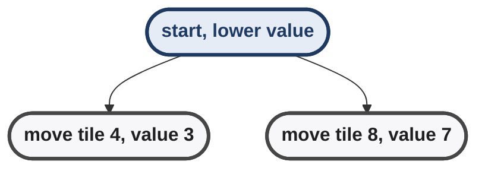

Yet the puzzle still has to be solved.

This demonstrates:

> A heuristic can say that every immediate move looks worse even when a
> solution exists.

In landscape language, the current state behaves like a **local
minimum**.

This is why simply following the local gradient cannot solve every
problem.

### Distance vs similarity

The same idea can be expressed through **similarity**:

``` text
more similar to goal
        ≈
smaller estimated distance to goal
```

A normalized similarity measure can be viewed as roughly the inverse of
a distance measure.

This perspective is useful in problems such as:

-   image transformation;
-   Rubik's Cube;
-   configuration search.

The essential idea remains the same: prefer states that appear to be
moving toward the target.

------------------------------------------------------------------------

## 9. Geographical Route Finding

The lecture then applies heuristic search to route finding.

Suppose a map is represented as a graph:

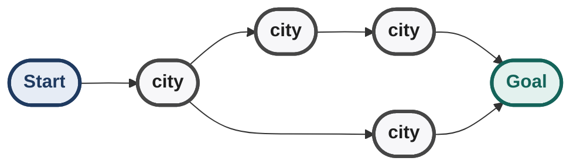

A natural heuristic is the geometric distance from the current location
to the goal.

### Euclidean Distance

If coordinates are available:

\[ h(N)=\sqrt{(x_N-x_G)^2+(y_N-y_G)^2} \]

The lecture's example has a candidate node with Euclidean heuristic
approximately:

\[ h=7.21 \]

Best First prefers the candidate with the lowest estimated distance.

### Manhattan Distance

For a grid-like representation:

\[ h(N)=\|x_N-x_G\|+\|y_N-y_G\| \]

The lecture illustrates a state that is `10` grid steps away according
to Manhattan distance.

The name comes from Manhattan's grid-like street structure.

### The River / Bridge Trap

The lecture uses a map containing a river.

A heuristic based only on geometric distance can see:

``` text
current node
    ↓
"this node is geographically close to goal"
```

while failing to see:

``` text
river blocks direct movement
→ must travel to a bridge
→ actual route becomes much longer
```

So Best First can move toward a node that is geometrically close but
practically inaccessible.

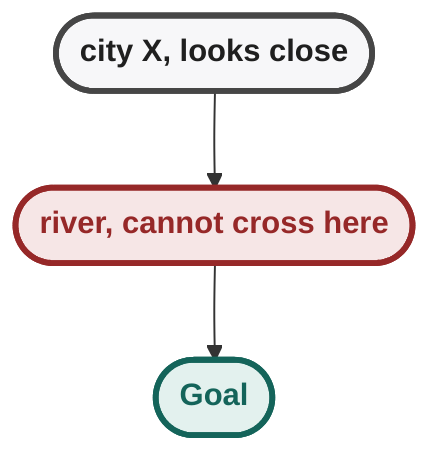

The lesson is fundamental:

> **A heuristic can capture one notion of distance while ignoring
> important structure in the actual problem.**

A good heuristic should correlate with true difficulty, but it is still
an approximation.

------------------------------------------------------------------------

## 10. Best First Search Trace Intuition

In the lecture's graph example, nodes are opened in increasing heuristic
order.

The sequence begins with heuristic values such as:

``` text
10 → 7 → 7 → 7 → ...
```

The search follows the apparently promising branch until it discovers
that the branch does not directly reach the goal, then shifts attention
to another candidate retained in `OPEN`.

Parent/back pointers are maintained so that, once the goal is popped,
the actual path can be reconstructed.

This highlights an important distinction:

``` text
Heuristic chooses WHERE to explore next.
Parent pointers remember HOW we got there.
```

------------------------------------------------------------------------

## 11. Best First Search: Complexity and Guarantees

### Space

Best First still maintains a frontier of alternative candidates.

Therefore, in the worst case, the frontier can become exponential.

The lecture compares:

``` text
DFS       → linear frontier
BFS       → exponential frontier
Best First → depends strongly on heuristic quality;
             worst-case can still be exponential
```

A perfect heuristic could make the frontier very small, but practical
heuristics are imperfect.

### Completeness

Under the lecture's treatment, with a **finite search space** and
systematic graph search using duplicate detection, Best First will
eventually exhaust the finite space if necessary and therefore find a
reachable goal.

So:

\[
\boxed{\text{Finite graph + systematic search + reachable goal} \Rightarrow \text{eventual solution}}
\]

Do not generalize this into "Best First is always complete." Its
behaviour depends on the search-space assumptions and implementation.

### Optimality / solution quality

Best First is **not guaranteed to find the shortest path**.

Why?

Because it ranks nodes using:

\[ h(n) \]

rather than:

\[ g(n)+h(n) \]

It can prefer a node that *looks close* even when the route taken to
reach it is already expensive.

Example:

``` text
Route A:
S → A → G
2 steps

Route B:
S → B → C → D → E → G
5 steps

But:
h(B) < h(A)

Best First may pursue B first.
```

The heuristic is estimating the remaining distance; it is not accounting
for the cost already incurred.

This is exactly the conceptual gap that motivates A\* later.

------------------------------------------------------------------------

## 12. The Three Different Meanings of "Best"

A useful way to avoid confusion:

``` text
DFS:
best = deepest according to stack order

BFS:
best = shallowest according to queue order

Best First:
best = lowest heuristic h(n)

A* (later):
best = lowest g(n) + h(n)
```

The word "best" therefore does **not** mean globally optimal. It means
"best according to the current node-ranking rule."

------------------------------------------------------------------------

## 13. Best First vs DFS vs BFS

  -----------------------------------------------------------------------
| Property | DFS | BFS | Best First |
|---|---|---|---|
| Frontier | Stack | Queue | Priority queue |
| Selection rule | Deep-first | Shallow-first | Lowest `h(n)` |
| Uses heuristic? | No | No | Yes |
| Direction toward goal | None | None | Yes |
| Worst-case time | Exponential | Exponential | Can be exponential |
| Worst-case space | Linear | Exponential | Can be exponential |
| Shortest path guaranteed? | No | Yes for unit-cost edges | No |
| Main strength | Low memory | Shallowest solution | Goal-directed exploration |
| Main weakness | Can follow bad branch | Memory explosion | Heuristic can mislead |
  -----------------------------------------------------------------------

### Exam trap

Do **not** say:

> "Best First is BFS with a better queue."

The important difference is the **priority criterion**:

\[ \boxed{h(n)} \]

BFS uses depth/frontier order; Best First uses heuristic value.

------------------------------------------------------------------------

## Lecture 2 --- Hill Climbing

## 14. Why Hill Climbing?

Best First Search is more directed than blind search, but it can still
require large `OPEN` and therefore large memory.

The next idea is:

> **What if we keep only the current state and its immediate neighbors,
> instead of remembering the entire frontier?**

That is the motivation for **local search**.

### Local Search

A local search algorithm considers only the neighborhood surrounding the
current state.

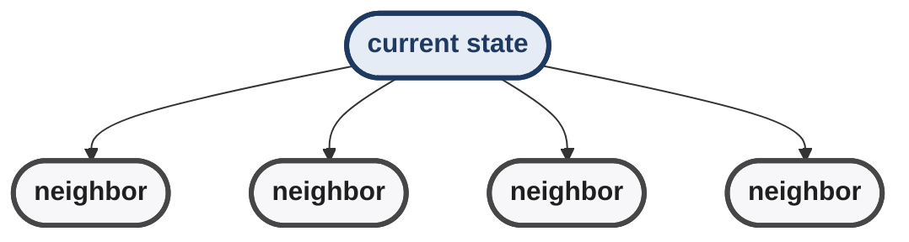

It does not maintain the complete global search frontier.

Hill Climbing is therefore a **local search algorithm**.

------------------------------------------------------------------------

## 15. Hill Climbing: Core Rule

For the lecture's minimization formulation:

1.  Start at the current node.
2.  Generate its neighbors.
3.  Find the best neighbor.
4.  Move there **only if it is strictly better**.
5.  Otherwise stop.

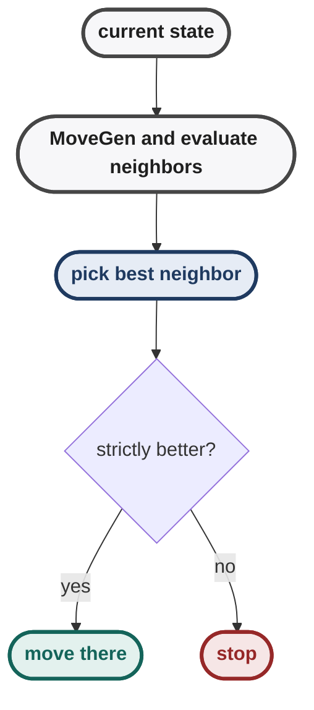

Formally, with a distance-like heuristic:

\[ h(N')<h(N) \RightarrowN\leftarrowN' \]

If no neighbor is strictly better:

\[ \boxed{\text{terminate}} \]

A tie does **not** count as improvement.

### Maximization version

Sometimes the heuristic is defined so that larger values are better.

Then the rule becomes:

\[ h(N')>h(N) \Rightarrow\text{move to }N' \]

Minimization and maximization are equivalent by changing the sign:

\[ H(N)=-h(N) \]

The lecture uses both viewpoints.

------------------------------------------------------------------------

## 16. Hill Climbing vs Best First Search

This is the most important mechanical distinction between the two
lectures.

### Best First

``` text
OPEN = all promising alternatives
         ↓
choose best
         ↓
expand
         ↓
retain alternatives
```

### Hill Climbing

``` text
current node
     ↓
generate neighbors
     ↓
choose best neighbor
     ↓
discard all other neighbors
     ↓
move
     ↓
repeat
```

Hill Climbing therefore **"burns its bridges"**: once it moves away from
a state, it does not retain the discarded alternatives in `OPEN`.

### Consequence

``` text
Best First:
"I'll try this promising route,
 but I'll remember the other routes."

Hill Climbing:
"This looks best, so I'll go there
 and forget the alternatives."
```

That single memory decision explains most of Hill Climbing's strengths
and weaknesses.

------------------------------------------------------------------------

## 17. Hill Climbing Algorithm

The lecture first describes the algorithm by sorting the neighbors, then
notes that sorting is unnecessary.

A direct formulation is:

``` text
node ← Start

while True:
    neighbors ← MoveGen(node)
    newNode ← best neighbor according to h

    if h(newNode) < h(node):
        node ← newNode
    else:
        return node
```

For a maximization formulation, reverse the comparison:

``` text
if h(newNode) > h(node):
    node ← newNode
else:
    return node
```

### Why full sorting is unnecessary

We only need the **single best neighbor**.

If there are `k` neighbors:

-   sorting all neighbors costs roughly `O(k log k)`;
-   scanning once for the minimum/maximum costs `O(k)`.

So implementation should normally be:

``` text
best ← first neighbor
for each remaining neighbor:
    if neighbor is better:
        best ← neighbor
```

not a complete sort.

------------------------------------------------------------------------

## 18. The Termination Test Changed

This is a subtle but important distinction.

### Global search

DFS/BFS/Best First typically terminate when:

\[ GoalTest(N)=True \]

### Hill Climbing

Hill Climbing terminates when:

\[ \text{no strictly better neighbor exists} \]

These are not the same condition.

A Hill Climbing algorithm can terminate at:

``` text
N ≠ Goal
GoalTest(N) = False
but
no neighbor is better than N
```

That is exactly how it gets trapped.

> **Exam trap:** "No better neighbor" does NOT imply "goal found."

------------------------------------------------------------------------

## 19. Why Hill Climbing Uses Constant Space

At any instant, Hill Climbing needs:

-   the current node;
-   its generated neighbors;
-   the best neighbor found during scanning.

After selecting the next state, the old alternatives are discarded.

Thus, under the course's bounded-neighborhood assumption:

\[ \boxed{\text{Space}=O(1)} \]

This is the major attraction of Hill Climbing.

Compare:

``` text
BFS          → O(b^d) space
Best First   → potentially exponential space
Hill Climb   → O(1) space
```

The trade-off is severe:

``` text
less memory
    ↓
less retained information
    ↓
less ability to recover from a bad decision
```

------------------------------------------------------------------------

## 20. Time Complexity

The lecture treats the heuristic as a **static function**: it evaluates
the current state (and implicitly the goal) without performing another
search ahead.

Under the course's assumption that:

-   the number of neighbors is bounded/constant;
-   heuristic computation is treated as constant-time;

Hill Climbing takes linear time in the number of local moves/iterations.

A more explicit view is:

\[ T = O(I \cdotb \cdotC_h) \]

where:

-   `I` = number of hill-climbing iterations;
-   `b` = number of neighbors examined per iteration;
-   `C_h` = cost of evaluating one heuristic.

Under the lecture's simplifying assumptions:

\[ b=O(1),\qquadC_h=O(1) \]

so:

\[ T=O(I) \]

The important qualification is that **heuristic computation is part of
the real computational cost**. A sophisticated heuristic can itself be
expensive even if the search algorithm stores only constant space.

------------------------------------------------------------------------

## 21. Hill Climbing as an Optimization Problem

Traditional search asks:

> "Can I reach the goal?"

Hill Climbing instead behaves like:

> "Can I improve the objective value from where I am?"

Thus the problem is treated as an **optimization problem**.

For a distance heuristic:

\[ \text{minimize }h(N) \]

For a "number of correct components" heuristic:

\[ \text{maximize }H(N) \]

The goal is ideally:

``` text
minimum h = 0
```

or, in a maximization formulation:

``` text
maximum H = goal value
```

This explains why Hill Climbing is naturally connected to optimization.

------------------------------------------------------------------------

## 22. Local Maximum, Local Minimum and Plateau

The landscape depends entirely on how the heuristic is defined.

### Minimization view

- A peak in the landscape is a local maximum.
- A valley in the landscape is a local minimum.

Hill Climbing with a distance heuristic moves downhill.

A **local minimum** is a state where every neighboring state has equal
or greater heuristic value, even though a much lower value exists
elsewhere.

- The deep valley is the global minimum.
- A shallower valley is a local minimum that traps greedy descent.

Hill Climbing stops at the local minimum because it cannot see beyond
its immediate neighborhood.

### Maximization view

The same phenomenon is described as a **local maximum**:

- The highest peak is the global maximum.
- A lower peak is a local maximum that traps greedy ascent.

The algorithm climbs to the nearby peak and stops even though a higher
peak exists elsewhere.

### Plateau

A plateau occurs when neighboring states have equal heuristic values.

For example:

- The current state has value 5 and the shown neighbours also have value 5.
- With the strict-improvement rule the algorithm does not move and stops.

If the algorithm requires **strict improvement**, it will not move
across the plateau.

### Ridge

A ridge is a narrow region where the best direction may require a
sequence of moves that are not individually improving according to the
available neighborhood.

This is another way a purely local greedy method can struggle.

------------------------------------------------------------------------

## 23. Eight-Puzzle: Why a Correct Solution Can Move "Backward"

A particularly important lecture observation is that a **valid solution
path does not necessarily monotonically improve the heuristic**.

Along a solution path for the Eight Puzzle:

-   one move can reduce Hamming distance;
-   the next move can increase it;
-   another move can leave Hamming distance unchanged;
-   Manhattan distance can change differently from Hamming distance.

The lecture gives the intuition:


The heuristic can fluctuate even along a path that eventually reaches
the goal.

### Why?

A move may temporarily disturb a correctly placed tile in order to
enable several later improvements.

Rubik's Cube makes this especially obvious:

``` text
local appearance:
"this face looks solved!"

next necessary move:
disturbs it

later:
global configuration improves
```

Therefore:

> **"The heuristic got worse" does not mean "the move was wrong."**

It only means that the heuristic's local estimate became less favorable.

Hill Climbing cannot accept such a temporary setback, so it can reject a
necessary step.

Best First Search can retain alternatives and therefore has more
opportunity to recover.

------------------------------------------------------------------------

## 24. Blocks World Example

The lecture uses a Blocks World planning problem to show that **the
quality of the heuristic can determine whether Hill Climbing succeeds**.

### Problem

There is:

-   an unlimited table;
-   blocks of equal size;
-   at most one block directly on another;
-   a robot that moves blocks.

The task is to transform a start configuration into a specified goal
configuration.

A move is treated as moving a block `x` to a location `y`.

For the lecture's start state, four moves are possible:

``` text
move A → table
move A → top of E
move E → top of A
move E → table
```

The key point is not the exact drawing but how two different heuristic
functions create different landscapes.

------------------------------------------------------------------------

## 25. Blocks World Heuristic `h₁`

The first heuristic gives:

-   `+1` if a block is in the correct position;
-   `-1` if it is in the wrong position.

There are six blocks.

For the lecture's start state:

``` text
D → +1
C → +1
B → +1
A → -1
F → +1
E → -1
```

Therefore:

\[ h_1(start)=4-2=2 \]

At the goal:

\[ h_1(goal)=6 \]

So this is a **maximization** formulation.

``` text
better state → larger h₁
goal         → h₁ = 6
```

------------------------------------------------------------------------

## 26. Blocks World Heuristic `h₂`

The second heuristic is more informed.

If a block is part of a correctly structured stack of `n` blocks, it
contributes `+n`; otherwise it contributes `-n`.

For the lecture's start state, contributions include:

``` text
D → +1
C → +2
B → +3
A → -4
F → +1
E → -2
```

giving:

\[ h_2(start)=1 \]

This heuristic captures **structure**, not merely whether individual
blocks happen to be correctly placed.

### Why `h₂` is more informative

`h₁` asks:

> "Is this block currently correct?"

`h₂` asks something closer to:

> "How much correctly structured progress does this block participate
> in?"

That distinction changes the shape of the search landscape.

------------------------------------------------------------------------

## 27. Hill Climbing with `h₁`: Gets Trapped

Starting with:

\[ h_1=2 \]

the four possible moves produce values where:

-   three remain at `2`;
-   one improves to `4`.

Hill Climbing therefore selects the move that gives:

\[ 2\rightarrow4 \]

This move places block `A` on block `E`, which looks promising because
that relation occurs in the goal.

The algorithm then evaluates the next neighborhood.

From the resulting state, all available moves are worse than the current
state.

Therefore:

\[ \boxed{\text{Hill Climbing terminates}} \]

But the goal has not been reached.

This is a concrete example of a **local optimum**.


The algorithm is not "broken"; it is faithfully optimizing the heuristic
it was given.

The problem is that the heuristic landscape does not lead monotonically
to the global goal.

------------------------------------------------------------------------

## 28. Hill Climbing with `h₂`: A Better Landscape

With `h₂`, the same four possible moves are evaluated differently.

The lecture gives the important values:

-   moving `A` to the table gives `6`;
-   moving `E` onto `A` gives `-4`;
-   moving `E` to the table gives `0`;
-   the best move is therefore the move giving `6`.

That move temporarily places `A` on the table.

This looks counterintuitive if we focus only on the final arrangement,
but it creates a better route toward the goal.

From the state with:

\[ h_2=6 \]

the next useful move is to move `E` from `F` onto `B`, giving:

\[ h_2=10 \]

Now `E` is in the correct structure required by the goal.

Finally, Hill Climbing can move `A` onto `E`, solving the problem.

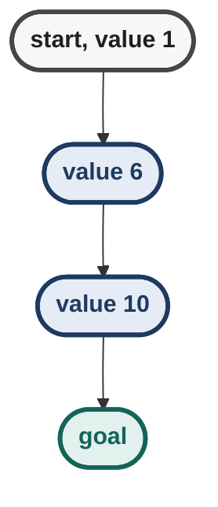

The exact numerical values are less important than the lesson:

> A more informative heuristic can transform the search landscape so
> that greedy local improvement becomes capable of reaching the global
> solution.

------------------------------------------------------------------------

## 29. The Heuristic Defines the Terrain

This is one of the deepest ideas of the lecture.

The **state space** may remain unchanged:

``` text
same states
same legal moves
same goal
```

but changing `h` changes the landscape over that state space:

``` text
Same graph
   +
Different h
   ↓
Different landscape
   ↓
Different Hill Climbing behaviour
```

For the Blocks World example:

``` text
h₁ → local maximum → Hill Climbing gets stuck

h₂ → more useful landscape → Hill Climbing reaches goal
```

Therefore:

\[
\boxed{\text{The heuristic is not merely a score; it shapes the search landscape.}}
\]

A well-behaved heuristic for Hill Climbing ideally produces a surface
that improves monotonically toward the goal.

It does **not** have to be a straight line. It only needs to avoid
misleading local structures that trap the greedy procedure.

------------------------------------------------------------------------

## 30. Best First vs Hill Climbing: The Critical Trade-off

  -----------------------------------------------------------------------
| Property | Best First | Hill Climbing |
|---|---|---|
| Search type | Global/informed search | Local search |
| Uses `h`? | Yes | Yes |
| Stores `OPEN`? | Yes | No |
| Keeps alternatives? | Yes | No |
| Memory | Potentially exponential | `O(1)` |
| Chooses | Best node in global frontier | Best neighbor of current node |
| Goal test | Used for termination | Not the main stopping condition |
| Can recover from a bad | More capable because | No, alternatives are |
| local move? | alternatives remain | discarded |
| Complete? | Under finite-graph assumptions, yes | No |
| Optimal? | No | No |
| Main advantage | Goal-directed global exploration | Extremely low memory |
| Main weakness | Frontier can become huge | Local optima / plateaus / ridges |
  -----------------------------------------------------------------------

### The simplest mental model

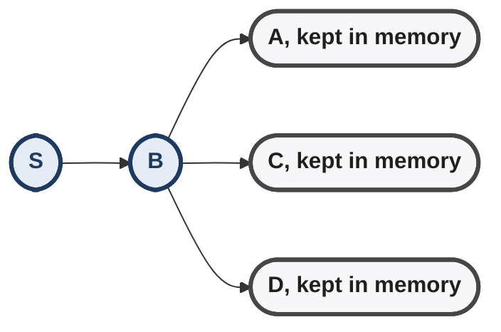

Best First keeps A, C, and D in memory while exploring the consequences of B.

Hill Climbing moves from S to B and forgets the rest: only the neighbourhood of B matters now.

------------------------------------------------------------------------

## 31. Greedy Nature of Hill Climbing

The lecture explicitly confirms that Hill Climbing is a **greedy
algorithm**.

Why?

At every step it asks only:

> "Which available neighbor looks best right now?"

It does not calculate whether that choice leads to the globally best
solution.

Thus:

\[ \boxed{\text{Hill Climbing = greedy local improvement}} \]

This is both its power and its weakness.

------------------------------------------------------------------------

## 32. Heuristic Computation Is Part of Complexity

A useful student question in the lecture asks about the complexity of
computing the heuristic.

The course assumes a **static heuristic function**: it examines the
current state (and the goal) and returns a value without performing an
additional search.

Under that assumption, heuristic computation is treated as constant-time
with respect to the search process.

But there is an important conceptual distinction:

``` text
Search complexity
    ≠
cost of evaluating h
```

If a heuristic itself performs substantial computation, that cost
matters.

A practical complexity model is:

\[ T_{\text{total}} \approx
(\text{number of heuristic evaluations}) \times C_h \]

where `C_h` is the cost of evaluating the heuristic.

The lecture notes that a state may be large, so the constant can be
large in practice even if the asymptotic classification is treated as
constant.

------------------------------------------------------------------------

## 33. Relaxed Problems as Heuristic Construction

The lecture ends by giving an important idea that becomes especially
relevant later for A\*.

For the Eight Puzzle, Manhattan distance can be interpreted using a
**relaxed version of the problem**.

Imagine a magical puzzle where tiles could slide through/over one
another in ways forbidden by the real puzzle.

In this easier problem, a tile can reach its destination directly by its
horizontal and vertical displacement.

The resulting cost corresponds to Manhattan distance.

``` text
Real problem
   ↓ remove a constraint
Easier / relaxed problem
   ↓ solve cheaply
cost of relaxed problem
   ↓
heuristic for real problem
```

The relaxed problem is easier because it has fewer restrictions.

This is a general heuristic-design principle:

> **Relax the original problem, solve the easier version, and use the
> easier problem's solution cost as guidance.**

The lecture notes that in planning, a relaxed problem can be solved in
polynomial time and still provide a useful heuristic even though it is
more expensive than a simple static formula.

------------------------------------------------------------------------

## 34. Failure Modes of Hill Climbing

### 1. Local optimum

The current state is better than every immediate neighbor, but worse
than some distant state.

- Greedy improvement stops at the local optimum.
- The global best sits on a separate peak that greedy moves cannot reach.

Hill Climbing stops at the local optimum.

### 2. Plateau

Many or all neighbors have the same value.

Under the strict-improvement rule:

\[ h(N')=h(N) \Rightarrow\text{do not move} \]

So the algorithm can stop even though useful states may exist elsewhere.

### 3. Ridge

The useful direction may require a sequence of moves that does not
appear immediately better under the current neighborhood/heuristic.

### 4. Misleading heuristic

The heuristic may reward a configuration that looks locally promising
but creates a dead end or forces a long detour.

### 5. Necessary temporary worsening

A real solution path can require a move that makes the heuristic
temporarily worse.

Hill Climbing rejects that move by design.

------------------------------------------------------------------------

## 35. Why Best First Can Succeed Where Hill Climbing Fails

Suppose:

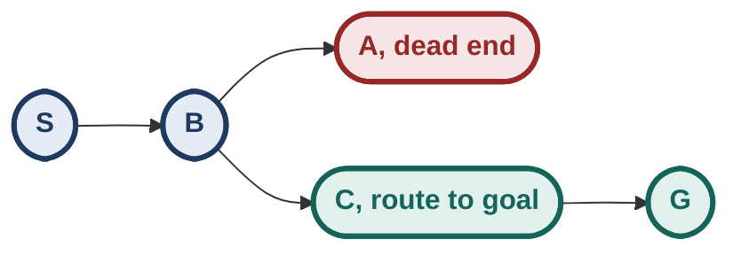

At `B`:

``` text
h(A) < h(C)
```

Hill Climbing chooses `A` and forgets `C`.

If `A` is a local optimum, it stops.

Best First chooses `A` first too, but crucially:

``` text
OPEN still contains C
```

After exploring A, it can return to C.

So:

``` text
Hill Climbing:
bad local decision → alternatives lost

Best First:
bad local decision → alternatives retained
```

This is the core memory/robustness trade-off.

------------------------------------------------------------------------

## 36. Heuristic Search as a Spectrum

A useful conceptual spectrum is:

``` text
Less memory / less retained alternatives
                ↓
Hill Climbing
    ↓
Best First
    ↓
BFS / other global frontier methods
                ↓
More memory / more retained alternatives
```

This is not a strict ordering of all algorithms, but it captures the
design trade-off introduced by the lectures:

``` text
retain more frontier
    → more ability to recover
    → more memory

retain less frontier
    → cheaper memory
    → greater risk of local failure
```

------------------------------------------------------------------------

## 37. Key Mathematical / Algorithmic Rules

### Heuristic

\[ \boxed{h(N)=\text{estimated remaining cost/distance}} \]

For the course's distance formulation:

\[ \boxed{h(G)=0} \]

### Best First

\[ \boxed{\text{priority}(N)=h(N)} \]

Choose:

\[ \boxed{\arg\min_N h(N)} \]

when `h` is a distance-to-goal heuristic.

### Hill Climbing

Move only when:

\[ \boxed{h(N')<h(N)} \]

Otherwise terminate.

For maximization:

\[ \boxed{H(N')>H(N)} \]

### Eight Puzzle

Hamming:

\[ \boxed{h_1(n)=\#\text{misplaced tiles}} \]

Manhattan:

\[
\boxed{ h_2(n)=\sum_t \left( |x_t-x_t^*|+|y_t-y_t^*| \right) }
\]

### Hill Climbing Complexity

Under bounded neighborhood and constant-time heuristic assumptions:

\[ \boxed{\text{Space}=O(1)} \]

and search work is linear in the number of local iterations:

\[ \boxed{T=O(I)} \]

More generally:

\[ \boxed{T=O(I\cdot b\cdot C_h)} \]

------------------------------------------------------------------------

## 38. Exam Traps

-   **Best First ≠ optimal search.** It uses `h(n)` only; it ignores the
    cost already spent to reach `n`.
-   **Heuristic ≠ actual distance.** It is an estimate unless
    specifically defined otherwise.
-   **Lower `h` is better only when `h` represents
    distance/cost-to-go.** A maximization heuristic reverses the
    comparison.
-   **Hill Climbing does not keep `OPEN`.** This is its defining
    memory-saving property.
-   **Hill Climbing terminates when no better neighbor exists, not
    necessarily when the goal is reached.**
-   **A tie is not an improvement** under the lecture's strict
    hill-climbing rule.
-   **A valid solution path need not monotonically improve the
    heuristic.**
-   **Local optimum ≠ global optimum.**
-   **A heuristic can be locally misleading because it ignores
    constraints such as the river in the route-finding example.**
-   **Best First can recover from a bad branch because alternatives
    remain in `OPEN`; Hill Climbing cannot.**
-   **Sorting all Hill Climbing neighbors is unnecessary** when only the
    best neighbor is required; a linear scan is enough.
-   **"Constant space" does not mean "zero computation."** The current
    state and its local neighborhood still have to be evaluated.
-   **Heuristic computation itself has a cost.** The lecture treats
    static heuristic evaluation as constant-time for the course's
    complexity discussion.
-   **Different heuristics create different search landscapes even on
    the same state graph.**
-   **A more informative heuristic can make a greedy local search
    succeed where a weaker heuristic gets trapped.**
-   **Finite-search-space completeness for Best First depends on the
    graph-search assumptions and implementation; do not state it as
    unconditional.**
-   **Best First's apparent direction can be wrong.** The river example
    is the canonical intuition: geometric closeness does not guarantee
    route accessibility.

------------------------------------------------------------------------

## 39. High-Value Comparisons

## Blind Search → Heuristic Search

``` text
Blind:
state
 ↓
algorithmic frontier rule
 ↓
next state

Heuristic:
state
 ↓
h(state)
 ↓
goal-directed frontier rule
 ↓
next state
```

The search framework remains general; the new ingredient is domain
knowledge.

## Best First → Hill Climbing

``` text
Best First:
keep frontier
    ↓
choose globally best available node
    ↓
retain alternatives

Hill Climbing:
generate local neighbors
    ↓
choose best neighbor
    ↓
discard alternatives
```

## Hamming → Manhattan

``` text
Hamming:
"How many tiles are wrong?"

Manhattan:
"How many grid moves do the tiles collectively need?"
```

## Weak vs informative heuristic

``` text
weak h
  ↓
rough landscape
  ↓
many misleading choices

informative h
  ↓
better-shaped landscape
  ↓
local improvement more likely to align with real progress
```

------------------------------------------------------------------------

## 40. Week 3 Synthesis

### What changed from previous search methods?

Week 2 mainly controlled **how the frontier was explored**.

Week 3 adds information about **where the goal appears to be**.

``` text
Week 2:
DFS/BFS/DFID
    ↓
structure of OPEN determines exploration

Week 3:
heuristic search
    ↓
h(N) provides directional information
```

### The central abstraction

A search problem gives us:

``` text
State space
    +
MoveGen
    +
GoalTest
```

Heuristic search adds:

``` text
    +
h(N)
```

The algorithm can now ask not only:

> "What states are reachable?"

but also:

> "Which reachable state appears promising?"

------------------------------------------------------------------------

## 41. The Deepest Connection: Information vs Memory

The two lectures introduce a general algorithm-design trade-off.

### Best First

It has more information available because it remembers many
alternatives.

### Hill Climbing

It deliberately throws away information to achieve constant memory.

``` text
MORE MEMORY
    ↓
remember more alternatives
    ↓
greater ability to recover

LESS MEMORY
    ↓
forget alternatives
    ↓
greater risk of local failure
```

This pattern will recur throughout AI search:

> **Many algorithms differ mainly in what information they retain and
> what information they deliberately discard.**

------------------------------------------------------------------------

## 42. Why the Heuristic Matters So Much

The search graph is only half the story.

``` text
State graph
    +
Heuristic landscape
    ↓
actual behaviour of informed/local search
```

The Blocks World example proves this directly:

``` text
same problem
same legal moves
same start
same goal

h₁ → bad local maximum → failure

h₂ → better terrain → success
```

Therefore, designing a search algorithm is not only about designing the
traversal mechanism. It is also about designing the **information used
to guide traversal**.

------------------------------------------------------------------------

## 43. Why Hill Climbing Is Not "Bad" Despite Failing

Hill Climbing deliberately sacrifices completeness for an extreme memory
advantage.

If the landscape is well behaved:

``` text
current → better → better → better → goal
```

then Hill Climbing can be exceptionally efficient.

If the landscape is poorly behaved:

``` text
current → better → local optimum
                         ↓
                     no escape
```

then its lack of memory becomes fatal.

So its behaviour depends heavily on the relationship:

\[
\boxed{\text{problem structure} \leftrightarrow \text{heuristic landscape}}
\]

------------------------------------------------------------------------

## 44. Questions You Should Be Able to Reason Through

1.  Why can DFS and BFS be called blind even though they know the
    current state?
2.  What additional information does `h(N)` provide?
3.  Why does Best First use a priority queue?
4.  Why does Best First not guarantee the shortest path?
5.  What exactly does Hill Climbing throw away that Best First retains?
6.  Why does throwing away `OPEN` reduce space to `O(1)`?
7.  Why can a solution path contain a step that makes the heuristic
    worse?
8.  Why does a local minimum prevent Hill Climbing from reaching the
    global minimum?
9.  Why can a river make Euclidean distance a misleading route
    heuristic?
10. Why did `h₂` solve the Blocks World example where `h₁` failed?
11. Why is a more informative heuristic not automatically a perfect
    heuristic?
12. Why is scanning neighbors better than sorting them when Hill
    Climbing only needs the best neighbor?
13. What changes when the heuristic is a maximization score instead of a
    distance?
14. Why is heuristic computation part of the real runtime even when the
    course treats it as constant-time?
15. What information does Best First retain that allows it to recover
    from a misleading local choice?

------------------------------------------------------------------------

## 45. Lecture 3 --- Algorithm Demos

## Purpose of the Demo Platform

The lecture uses an algorithm-demo platform developed in the AIDB lab at
IIT Madras to make the behaviour of the search algorithms visible on
randomly generated graphs.

The visual representation is important:

``` text
BLUE  → nodes currently in OPEN
BLACK → nodes currently in CLOSED
RED   → path / search trajectory being highlighted
```

The demo allows the same graph and start state to be tested with
different goal states and different algorithms. This makes the
theoretical differences between the algorithms immediately visible.

## DFS: No Sense of Direction

Depth First Search behaves essentially the same way even when the goal
node is moved.

Why?

Because DFS does not inspect the goal's location when deciding which
node to explore next. Its behaviour is determined by:

``` text
MoveGen(N)
    ↓
order in which successors are generated
    ↓
DFS frontier ordering
```

The demo shows DFS exploring large portions of the graph and sometimes
reaching the goal through a very long path.

### Key observation

Changing the goal does not fundamentally change DFS's exploration
pattern.

``` text
same Start
    +
different Goal
    ↓
same DFS exploration pattern
```

The goal merely changes **when the algorithm stops**, not how it chooses
nodes before that point.

This is the visual meaning of calling DFS a **blind / uninformed
search**.

## BFS: No Direction, but Shallowest-Path Behaviour

Breadth First Search also does not change its exploration strategy when
the goal is moved.

It remains concentrated around the start:

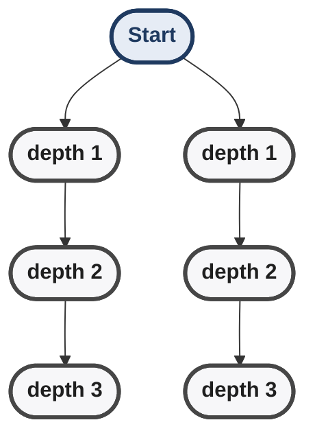

It explores nodes in increasing depth order.

For unit-cost edges, this means that when BFS first reaches a goal, the
path has the minimum number of hops.

The demo therefore shows two simultaneous facts:

-   BFS has **no heuristic sense of direction**.
-   BFS can still return the **shortest-hop path**.

Because BFS explores all nodes at depths below the solution depth, its
explored region can be much larger than that of a heuristic search.

## Best First Search: Visible Sense of Direction

Best First Search behaves differently when the goal is moved.

Its heuristic depends on the goal, so changing the goal changes the
landscape:

``` text
Goal changes
    ↓
h(N) changes
    ↓
priority of frontier nodes changes
    ↓
exploration direction changes
```

The demos show Best First heading approximately toward the goal instead
of spreading uniformly around the source.

This is the practical advantage of a heuristic:

> The algorithm can spend its search effort preferentially in the
> direction that the heuristic considers promising.

The lecture's demonstrations also show that Best First can reach the
goal after exploring far fewer nodes than BFS in suitable graphs.

### But direction is not optimality

A path that looks geometrically attractive can still be longer than
another path.

``` text
Best First:
"Which node looks closest?"

not:

"Which complete route is cheapest?"
```

That distinction explains why Best First can be fast and directional
without guaranteeing the shortest path.

## Hill Climbing: Same Direction, Less Recovery

Hill Climbing often initially heads in the same direction as Best First
because both use the same heuristic.

However, their search spaces differ fundamentally.

``` text
Best First:
current node
    ↓
many alternatives retained in OPEN
    ↓
can recover from a misleading branch

Hill Climbing:
current node
    ↓
choose best neighbour
    ↓
discard alternatives
    ↓
continue
```

In one demo, Hill Climbing moves toward the goal but becomes trapped at
a local optimum.

Best First explores in a similar direction but does not stop there
because it is a **global search** retaining alternatives.

This provides a particularly clear visual distinction:

``` text
same heuristic
      ↓
similar direction

different memory model
      ↓
different failure behaviour
```

## BFS vs Best First vs Hill Climbing

The demo sequence makes the three strategies easy to contrast:

  -----------------------------------------------------------------------
| Algorithm | Uses goal direction? | Retains alternatives? | Typical demo behaviour |
|---|---|---|---|
| BFS | No | Yes | Broad search from start; shortest-hop solution |
| Best First | Yes, through `h` | Yes | Goal-directed; can still recover from local traps |
| Hill Climbing | Yes, through `h` | No | Goal-directed but can stop at a local optimum |
  -----------------------------------------------------------------------

DFS adds the fourth extreme:

| Algorithm | Uses goal direction? | Main control |
|---|---|---|
| DFS | No | Successor-generation order + stack |
| BFS | No | Depth/frontier order |
| Best First | Yes | Lowest heuristic value |
| Hill Climbing | Yes | Best immediate neighbour |

## Preview of A\*

The demo briefly previews A\*.

A\* can explore substantially less of the graph than BFS while still
finding the same shortest path in the demonstrated example.

The conceptual reason is the distinction between:

``` text
Best First:
f(n) = h(n)

A*:
f(n) = g(n) + h(n)
```

Best First asks only:

> "How close does this node appear to the goal?"

A\* additionally asks:

> "How much have I already paid to get here?"

This is why A\* becomes the next major step in the course.

## Multiple Goal Nodes

The demo also investigates what happens when there are multiple goal
states.

### BFS / DFS

For blind search:

``` text
Goal set = {G₁, G₂, G₃, ...}
```

the algorithm does not use the locations of those goals to guide
exploration.

It simply explores according to its normal rule and terminates when it
encounters a state satisfying the goal test.

Thus, the identity of the first goal encountered is an **effect of the
search order**, not of heuristic guidance.

### Best First

For multiple goals, the heuristic of a node can be defined using the
closest goal:

\[ h(N)=\min_i h_i(N) \]

where `hᵢ(N)` is the estimated distance from `N` to goal `Gᵢ`.

Therefore:

``` text
h(N)
 =
minimum estimated distance from N
to any acceptable goal
```

The algorithm tends to move toward whichever goal currently appears
closest.

### Why it tends not to switch goals

Suppose:

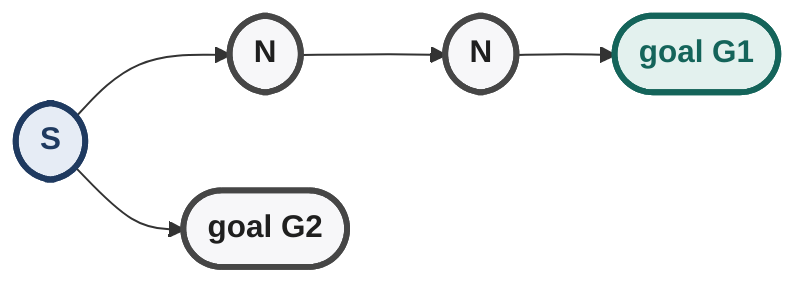

If the search moves toward `G₁`, then the heuristic values of nodes in
that direction continue to become smaller relative to `G₁`.

This creates a self-reinforcing effect:

``` text
move toward G₁
    ↓
G₁ becomes even closer
    ↓
nodes toward G₁ remain attractive
    ↓
continue toward G₁
```

The lecture notes that Best First therefore tends to commit to the goal
that initially appears closest rather than dynamically switching between
goals.

### Hill Climbing with Multiple Goals

Hill Climbing uses the same local heuristic idea, so it tends to move
toward the apparently closest goal as well.

But whether it actually reaches that goal still depends on the local
landscape.

``` text
closest-looking goal
        ↓
good gradient
        ↓
goal reached

or

closest-looking goal
        ↓
local optimum
        ↓
Hill Climbing stops
```

This reinforces the distinction between **direction** and **guaranteed
reachability**.

## What the Demos Visually Establish

The demos are not merely illustrations; they provide experimental
evidence for the theoretical properties already discussed.

``` text
DFS
→ exploration determined by successor order

BFS
→ exploration determined by depth

Best First
→ exploration influenced by h

Hill Climbing
→ local movement influenced by h, alternatives discarded
```

The most useful observation is:

> **Changing the goal affects heuristic search because the heuristic
> depends on the goal; changing the goal does not alter blind-search
> exploration order.**

------------------------------------------------------------------------

## 46. Lecture 4 --- Solution Space Search

## Why Move Beyond Ordinary State-Space Search?

Hill Climbing is attractive because it uses constant space, but it can
get trapped in local optima.

The Eight Puzzle example demonstrated the problem:

``` text
solution path
      ↓
heuristic may temporarily worsen
      ↓
Hill Climbing refuses the move
      ↓
local minimum
```

This creates the need for search formulations and algorithms that can
operate over enormous spaces while providing better ways to escape local
traps.

The lecture introduces **solution space search** and then uses SAT and
TSP to demonstrate why such methods matter.

------------------------------------------------------------------------

## Solution Space Search

### Definition

A search problem is formulated as **solution space search** when
reaching a goal node directly gives the solution.

There is no need to reconstruct a path from the initial state to the
goal.

\[ \boxed{\text{Goal node itself}=\text{solution}} \]

Every node is therefore a **candidate solution**.

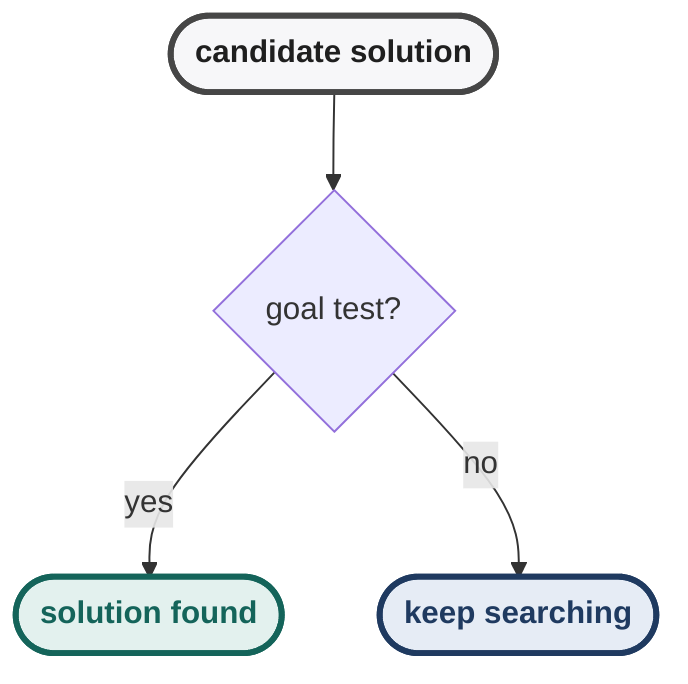

This is different from ordinary path-oriented state-space search.

### State-Space Path Search vs Solution-Space Search

  -----------------------------------------------------------------------
| Aspect | State-space/path search | Solution-space search |
|---|---|---|
| Node represents | A state reached through actions | A candidate solution |
| Goal means | A desired state has been reached | Candidate itself satisfies constraints |
| Need path reconstruction? | Usually yes | No |
| Typical example | Route finding | N-Queens configuration, SAT assignment, TSP tour |
  -----------------------------------------------------------------------

Configuration problems naturally fit this formulation because the final
configuration matters more than the sequence of moves used to construct
it.

Planning problems can also be represented this way, leading to
**plan-space planning**, where a node represents a candidate plan.

------------------------------------------------------------------------

## Synthesis vs Perturbation

There are two important ways to search a solution space.

### Synthesis / Constructive Search

A solution is built incrementally from the initial state.

``` text
empty / partial candidate
        ↓
add component
        ↓
larger partial candidate
        ↓
add component
        ↓
complete candidate
```

For N-Queens, for example:

``` text
place Queen 1
    ↓
place Queen 2
    ↓
place Queen 3
    ↓
...
place Queen N
```

DFS can naturally perform this type of constructive search.

The key property is:

> **The candidate becomes more complete as the search progresses.**

### Perturbation Search

Instead of constructing a candidate piece by piece, start with a
complete candidate---even if it is wrong---and modify it to obtain
another candidate.

``` text
candidate X
    ↓
perturb
    ↓
candidate X'
    ↓
perturb
    ↓
candidate X''
```

The new candidate need not be closer to the goal in a structural sense.
The search relies on an evaluation function to decide whether the
perturbation was useful.

### Core distinction

``` text
Synthesis:
build the solution

Perturbation:
modify a complete candidate
```

This distinction becomes especially important for local search.

------------------------------------------------------------------------

## N-Queens as a Solution-Space Representation

The lecture represents an N-Queens candidate using a one-dimensional
array.

For example:

``` text
[a, c, e, b, f, d]
```

can be interpreted as:

``` text
row 1 → column a
row 2 → column c
row 3 → column e
row 4 → column b
row 5 → column f
row 6 → column d
```

The array therefore contains one value per row.

A permutation of the representation generates another candidate.

### Important point

A candidate does **not** have to be a valid solution.

For example, if two queens attack one another:

``` text
[a, c, e, b, f, d]
        ↓
conflicting queens
        ↓
not a solution
```

it is still a valid **candidate** in the solution space.

This is precisely what makes perturbation-based search possible: we can
move through invalid candidates while searching for a valid one.

------------------------------------------------------------------------

## 47. SAT as a Solution-Space Search Problem

## Definition

SAT asks whether there exists an assignment of Boolean values to
variables that makes a Boolean formula true.

Given:

\[ V={x_1,x_2,\ldots,x_N} \]

each variable has two values:

\[ x_i\in{0,1} \]

Therefore the complete candidate space contains:

\[ \boxed{2^N} \]

assignments.

Each candidate can be represented as an `N`-bit string:

``` text
x₁ x₂ x₃ ... xₙ
0  1  0  ... 1
```

The goal test simply evaluates the formula.

``` text
candidate assignment
        ↓
evaluate Boolean formula
        ↓
True? → solution
False → another candidate
```

### CNF

SAT problems are very often expressed in **Conjunctive Normal Form
(CNF)**.

A CNF formula is an AND of clauses:

\[ C_1\land C_2\land\cdots\land C_m \]

Each clause contains literals combined by OR:

\[ (x_1\lor\neg x_3\lor x_5) \]

So:

``` text
CNF
 =
AND of clauses
 =
AND of ORs of literals
```

The lecture emphasizes that a general Boolean formula is not necessarily
already in CNF; transformations may be required.

------------------------------------------------------------------------

## SAT Neighborhood Function

A natural perturbation is:

> Flip exactly one Boolean variable.

For an `N`-bit candidate:

``` text
x₁ x₂ x₃ ... xₙ
```

the one-bit-flip neighbourhood contains `N` immediate neighbours:

``` text
flip bit 1
flip bit 2
flip bit 3
...
flip bit N
```

For example:

``` text
candidate:
1011010

neighbours:
0011010
1111010
1001010
1010010
1011110
1011000
1011011
```

Each neighbour differs in exactly one position.

Thus:

\[ \boxed{|N(x)|=N} \]

for the one-bit-flip neighbourhood.

This gives a natural local-search graph over the SAT solution space.

------------------------------------------------------------------------

## 48. Traveling Salesperson Problem (TSP)

## Problem Definition

Given:

-   `n` cities;
-   a distance/cost between every pair of cities;

find a **Hamiltonian cycle** that:

1.  visits every city exactly once;
2.  returns to the starting city;
3.  has minimum total cost.

Formally:

\[ \boxed{\text{find the minimum-cost Hamiltonian cycle}} \]

A candidate solution can simply be a permutation of the cities:

``` text
A → C → F → B → E → D → A
```

Every permutation represents a candidate ordering.

### Incomplete Graphs

Real-world graphs may not contain an edge between every pair of cities.

The lecture handles this by adding missing edges with a very large cost.

Conceptually:

``` text
missing edge
    ↓
add artificial edge
    ↓
very high cost
    ↓
discourages selecting it
```

This preserves a complete candidate representation while penalizing
impossible/unwanted connections.

------------------------------------------------------------------------

## Why TSP Is Hard

For `n` cities, the naive candidate space grows factorially.

A simple upper-bound count is:

\[ n! \]

But because tours can be rotated and reversed without changing the
underlying cycle, the number of distinct undirected tours is more
precisely:

\[ \boxed{\frac{(n-1)!}{2}} \]

for the usual symmetric-TSP interpretation.

The lecture uses `n!` as the intuitive permutation-space growth before
discussing these symmetries.

### Why this matters

Compare:

\[ \text{SAT candidates}=2^N \]

with approximately:

\[ \text{TSP candidates}=\frac{(N-1)!}{2} \]

Factorial growth eventually overwhelms exponential growth.

``` text
N increases
   ↓
2^N grows rapidly
   ↓
N! grows dramatically faster
```

This is why brute-force enumeration becomes impossible very quickly.

------------------------------------------------------------------------

## 49. Why Local Search Is Useful for SAT and TSP

The lecture compares the size of the spaces.

For SAT:

\[ N=100
\Rightarrow 2^{100}\approx 1.27\times10^{30} \]

candidate assignments.

For TSP, the corresponding factorial-scale space is vastly larger.

Therefore:

``` text
enumerate every candidate
        ↓
computationally infeasible
```

Instead:

``` text
start with one candidate
        ↓
evaluate it
        ↓
inspect / generate nearby candidates
        ↓
move toward promising candidates
```

This is the motivation for solution-space local search.

### Complexity perspective

SAT is **NP-complete**.

Its solutions can be verified in polynomial time, while exhaustive
search may require exponential time in the worst case.

TSP optimization is **NP-hard**.

A candidate tour can be checked as a tour and its cost computed
efficiently, but determining whether a given tour is globally optimal is
the hard part.

The course's key message is therefore not merely the complexity-class
label:

> **The candidate spaces are so large that local/heuristic methods
> become practically important.**

------------------------------------------------------------------------

## 50. Greedy Constructive Methods for TSP

Before perturbing an existing tour, the lecture introduces several ways
to construct a tour greedily.

These methods produce a candidate solution directly rather than
exploring every possible permutation.

## 50.1 Nearest-Neighbour Heuristic

### Rule

1.  Choose a starting city.
2.  Move to the nearest unvisited city.
3.  Continue choosing the nearest feasible city.
4.  Avoid closing the tour prematurely.
5.  Eventually return to the start.

``` text
Start
  ↓
nearest city
  ↓
nearest unvisited city
  ↓
nearest unvisited city
  ↓
...
  ↓
close tour
```

The method is greedy because each decision uses the locally shortest
available move.

### Why it can fail

A locally short edge can force a very long edge later.

``` text
locally best now
      ↓
poor remaining choices
      ↓
expensive final connection
```

Therefore:

\[
\boxed{\text{Nearest neighbour is not guaranteed to be optimal}}
\]

It can nevertheless produce reasonably good tours quickly.

### Variation

A variation allows the partial tour to be extended from either end
rather than always extending one endpoint.

------------------------------------------------------------------------

## 50.2 Greedy Edge Heuristic

This method is different from nearest neighbour.

Instead of selecting the nearest city from the current endpoint, it
considers the **globally shortest available edges**.

### Rule

1.  Sort candidate edges by increasing cost.
2.  Consider the shortest edge.
3.  Add it if it does not violate TSP constraints.
4.  Continue until a complete tour is formed.

``` text
all edges
   ↓
sort by cost
   ↓
shortest available edge
   ↓
accept if legal
   ↓
next shortest
   ↓
...
```

### Important constraints

A valid TSP tour requires every city to have degree 2:

``` text
one edge entering
+
one edge leaving
=
degree 2
```

Therefore we must not:

-   give a city more than two incident tour edges;
-   create a smaller closed cycle before every city is included.

The second restriction prevents **premature subtours**.

### Connection to Kruskal

The lecture compares the method conceptually with Kruskal's
minimum-spanning-tree algorithm:

``` text
sort edges
    ↓
take cheapest legal edge
    ↓
avoid an invalid smaller cycle
```

But the final TSP constraints differ because a TSP solution must be one
Hamiltonian cycle with degree 2 at every city.

------------------------------------------------------------------------

## 51. Nearest Neighbour vs Greedy Edge

These are easy to confuse.

  -----------------------------------------------------------------------
| Method | What is selected next? | Main viewpoint |
|---|---|---|
| Nearest Neighbour | Nearest city to current endpoint | Local extension of one partial tour |
| Greedy Edge | Globally shortest currently available legal edge | Global sorted edge list |
  -----------------------------------------------------------------------

``` text
Nearest Neighbour:
current city → nearest feasible city

Greedy Edge:
choose shortest legal edge anywhere
```

Both are greedy constructive heuristics, but they construct the tour
differently.

------------------------------------------------------------------------

## 52. Savings Heuristic

The **Savings Heuristic** constructs a TSP tour by repeatedly merging
smaller tours.

## Initial Structure

Choose a base/anchor city.

For `n` cities, create:

\[ n-1 \]

small tours of length 2:

``` text
base ↔ A
base ↔ B
base ↔ C
...
```

Each non-base city initially forms a small loop with the base.

## Merge Operation

Suppose two tours contain:

``` text
base ↔ A

base ↔ B
```

Remove:

``` text
base-A
base-B
```

and add:

``` text
A-B
```

This merges the two structures.

The merge is selected according to the **savings** obtained.

### Savings formula

For cities `A` and `B` relative to base `R`:

\[ \boxed{
S(A,B)=
c(R,A)+c(R,B)-c(A,B)
} \]

A large saving means that replacing the two base connections by a direct
`A-B` connection substantially reduces total cost.

### Procedure

``` text
start with n−1 base-anchored tours
        ↓
compute possible savings
        ↓
choose largest feasible saving
        ↓
merge two tours
        ↓
repeat
        ↓
complete tour
```

The lecture describes `n-2` merge operations for constructing the final
tour.

### Why it is useful

Instead of deciding every city-to-city connection independently, the
method asks:

> **Which replacement of two expensive base connections gives the
> largest cost saving?**

It is still heuristic and therefore is not guaranteed to return the
optimal tour.

------------------------------------------------------------------------

## 53. Comparing TSP Constructive Heuristics

  -----------------------------------------------------------------------
| Method | Main rule | Strength | Limitation |
|---|---|---|---|
| Nearest Neighbour | Extend to nearest feasible city | Very simple and fast | Can create a bad final connection |
| Greedy Edge | Add globally shortest legal edge | Uses global edge information | Must enforce degree and subtour constraints |
| Savings | Merge tours using largest saving | Uses cost reduction explicitly | Still greedy; not guaranteed optimal |
  -----------------------------------------------------------------------

The lecture's visual comparison shows that greedy and nearest-neighbour
tours can contain long edges, while the savings approach can sometimes
produce a better-looking tour. It still may not be optimal.

------------------------------------------------------------------------

## 54. Perturbation Operators for TSP

Constructive methods create an initial tour.

Perturbation methods instead ask:

> **Given a complete tour, how can we make a nearby tour?**

The set of tours reachable by one perturbation defines the
**neighbourhood function**.

- One perturbation of tour T produces T1.
- Another produces T2, another T3, and so on.
- Together these reachable tours form the neighbourhood of T.

This creates the graph on which local search operates.

------------------------------------------------------------------------

## 54.1 Two-City / City Exchange

Choose two cities in the tour and exchange their positions.

If the tour is represented as:

``` text
A → B → C → D → E → F
```

and `C` and `E` are exchanged:

``` text
A → B → E → D → C → F
```

The candidate remains a permutation of all cities.

### Neighbourhood size

Two cities can be selected in:

\[ \boxed{\binom{n}{2}} \]

ways.

Thus the two-city exchange neighbourhood has order:

\[ O(n^2) \]

candidate perturbations.

------------------------------------------------------------------------

## 54.2 Edge Exchange

Instead of selecting cities, select edges and replace them with
different edges that reconnect the tour.

This is useful because the **edges directly contribute to tour cost**.

A long edge can therefore be targeted explicitly:

``` text
bad / long edges
      ↓
remove
      ↓
reconnect
      ↓
new tour
```

For a two-edge exchange, two tour edges are removed and the resulting
components are reconnected in another legal way.

------------------------------------------------------------------------

## 54.3 Three-Edge Exchange

A three-edge exchange:

1.  removes three edges;
2.  splits the tour into three components;
3.  reconnects those components in one of several valid ways.

The lecture shows that there are four possible reconnection patterns in
the illustrated case.

The three removed edges can be selected in:

\[ \boxed{\binom{n}{3}} \]

ways.

Thus:

\[ O(n^3) \]

choices exist before accounting for the constant number of reconnection
patterns.

### General idea

``` text
2-edge exchange → smaller neighbourhood
3-edge exchange → larger neighbourhood
4-edge exchange → still larger neighbourhood
...
```

A denser neighbourhood gives local search more possible escape
directions, but increases the work required per iteration.

------------------------------------------------------------------------

## 55. State Space vs Neighbourhood Function in TSP

This distinction is fundamental.

### State space

All possible tours:

\[ \boxed{\text{all permutations / distinct tours}} \]

### Neighbourhood function

The subset of tours reachable from the current tour using the chosen
perturbation.

- The whole space contains all TSP tours.
- Inside it sits the current tour T.
- Around T lie only the neighbours reachable by the chosen perturbation.

Changing the perturbation changes the edges of the solution-space graph
even though the underlying set of candidate solutions stays the same.

For example:

``` text
2-city exchange → C(n,2) neighbours
3-edge exchange → C(n,3) × constant reconnections
```

This is another way of saying:

> **The neighbourhood function determines what "local" means.**

------------------------------------------------------------------------

## 56. Why the Choice of Neighbourhood Matters

Suppose a candidate is trapped under a small neighbourhood:

- From T, the neighbours T1, T2, and T3 all look worse.
- T is therefore a local optimum.

A denser neighbourhood might expose a candidate that cannot be reached
by one small perturbation:

- From T, every small change looks worse.
- Only a larger change reaches T*, which a small neighbourhood cannot see.

Thus:

``` text
small neighbourhood
    ↓
cheap iteration
    ↓
more local traps

large neighbourhood
    ↓
more expensive iteration
    ↓
more opportunities to escape
```

This trade-off becomes important in later local-search methods.

------------------------------------------------------------------------

## 57. The Combinatorial Explosion Behind the Need for Local Search

The lecture explicitly visualizes the growth of SAT and TSP spaces.

## SAT

\[
N\text{ variables}\Rightarrow 2^N\text{ assignments}
\]

For example:

\[ 2^{100}\approx1.27\times10^{30} \]

Even inspecting one million candidates per second leaves an
astronomically large worst-case computation.

## TSP

The permutation space grows approximately factorially:

\[ n! \]

and the number of distinct symmetric tours is approximately:

\[ \frac{(n-1)!}{2} \]

Factorial growth dominates exponential growth.

``` text
Exponential:
2^n

Factorial:
n!

For sufficiently large n:

n!  ≫  2^n
```

The lecture uses this to motivate why brute-force enumeration is not a
practical general strategy.

------------------------------------------------------------------------

## 58. Why Verification and Optimization Differ

A useful distinction emerges from SAT and TSP.

### SAT

Given a complete assignment:

``` text
assignment
   ↓
evaluate formula
   ↓
True / False
```

Verification is polynomial-time.

### TSP optimization

Given a tour:

``` text
tour
 ↓
valid?
 ↓
compute cost
```

This is easy.

But:

``` text
Is this tour globally optimal?
```

requires comparing against the enormous space of alternative tours in
the general case.

This difference explains why optimization problems can be much harder
than simply checking whether a candidate is valid.

------------------------------------------------------------------------

## 59. Constructive vs Perturbative TSP Search

The two approaches can be placed side by side:

``` text
CONSTRUCTIVE

partial tour
    ↓
add city / edge
    ↓
larger partial tour
    ↓
...
    ↓
complete tour


PERTURBATIVE

complete tour T
    ↓
exchange / rewire
    ↓
complete tour T'
    ↓
evaluate T'
    ↓
repeat
```

Constructive heuristics are **one-shot ways of obtaining an initial
candidate**.

Perturbative methods provide a **neighbourhood structure for continued
local improvement**.

This distinction matters when designing a practical solver:

``` text
construct a reasonable initial tour
        ↓
perturb it
        ↓
evaluate neighbours
        ↓
improve / escape / restart
```

Later Week 4 algorithms build directly on this idea.

------------------------------------------------------------------------

## 60. Deterministic Local Search --- Conceptual Bridge

The solution-space formulation naturally leads to deterministic
local-search methods.

The common pattern is:

``` text
candidate solution
      ↓
generate neighbourhood
      ↓
evaluate candidates
      ↓
deterministic rule chooses next candidate
      ↓
repeat until termination
```

The algorithm is **deterministic** when the same candidate,
neighbourhood and evaluation values lead to the same choice.

Hill Climbing is the simplest example:

\[ \text{choose the best strictly improving neighbour} \]

TSP perturbation operators provide the machinery for defining the
neighbourhood.

The next family of Week 4 methods builds on this framework by
introducing mechanisms that prevent or escape local trapping.

------------------------------------------------------------------------

## 61. Week 3 Connection: From State Space to Solution Space

The progression across the lectures is important:

``` text
State-space search
      ↓
"Which state should I expand?"
      ↓
Heuristic search
      ↓
"Which state looks promising?"
      ↓
Hill Climbing
      ↓
"Which neighbour is better?"
      ↓
Solution-space search
      ↓
"Which candidate solution is better?"
      ↓
Perturbation / local optimization
```

The object being searched changes conceptually:

``` text
Earlier:
states reached by actions

Now:
candidate solutions directly
```

This removes the need to care about how the candidate was constructed
whenever only the final solution matters.

------------------------------------------------------------------------

## 62. High-Value Exam Traps --- Solution Space

-   **A candidate solution is not necessarily a valid solution.** It
    becomes a solution only when it satisfies the goal description.
-   **Solution-space search does not normally require path
    reconstruction** because the goal node itself represents the answer.
-   **Synthesis and perturbation are different.** Synthesis builds a
    solution incrementally; perturbation modifies an existing candidate.
-   **SAT with `N` Boolean variables has `2^N` complete assignments.**
-   **A one-bit-flip SAT neighbourhood has `N` neighbours.**
-   **TSP candidates can be represented as city permutations.**
-   **Nearest Neighbour and Greedy Edge are not the same heuristic.**
-   **Greedy Edge must enforce both degree constraints and the
    no-premature-cycle constraint.**
-   **Every city in a completed TSP tour has degree 2.**
-   **Savings is based on cost reduction from replacing two base
    connections with one direct connection.**
-   **The savings formula is `S(a,b)=c(base,a)+c(base,b)-c(a,b)`.**
-   **TSP greedy methods are heuristics; they are not guaranteed to find
    the optimal tour.**
-   **City exchange and edge exchange define different neighbourhoods
    over the same TSP solution space.**
-   **Two-city exchange has `C(n,2)` possible city pairs.**
-   **Three-edge exchange has `C(n,3)` choices of removed edges,
    followed by multiple reconnection possibilities.**
-   **A larger neighbourhood can expose escape moves but costs more to
    examine.**
-   **TSP's factorial-scale search space grows much faster than SAT's
    exponential-scale space.**
-   **A valid tour is easy to evaluate; proving it is globally optimal
    is a different problem.**
-   **A heuristic constructive method producing a good-looking tour does
    not establish optimality.**

------------------------------------------------------------------------

## 63. Week 3 Synthesis --- Expanded

## The Evolution of the Search Object

Week 3 gradually changes what the algorithm considers "the thing to
search":

``` text
Graph/state space
      ↓
heuristic ordering of states
      ↓
local neighbourhood of a state
      ↓
candidate solution space
      ↓
neighbourhood of candidate solutions
```

This is not merely a change of terminology. It changes what a node
means.

## Four Core Strategies

``` text
DFS
→ "follow the frontier according to stack order"

BFS
→ "follow the frontier according to depth"

Best First
→ "follow the globally most promising frontier node"

Hill Climbing
→ "follow the locally best neighbour"

Solution-space local search
→ "improve a candidate solution through perturbations"
```

## Direction vs Memory

The algorithm demos make the central Week 3 trade-off visible:

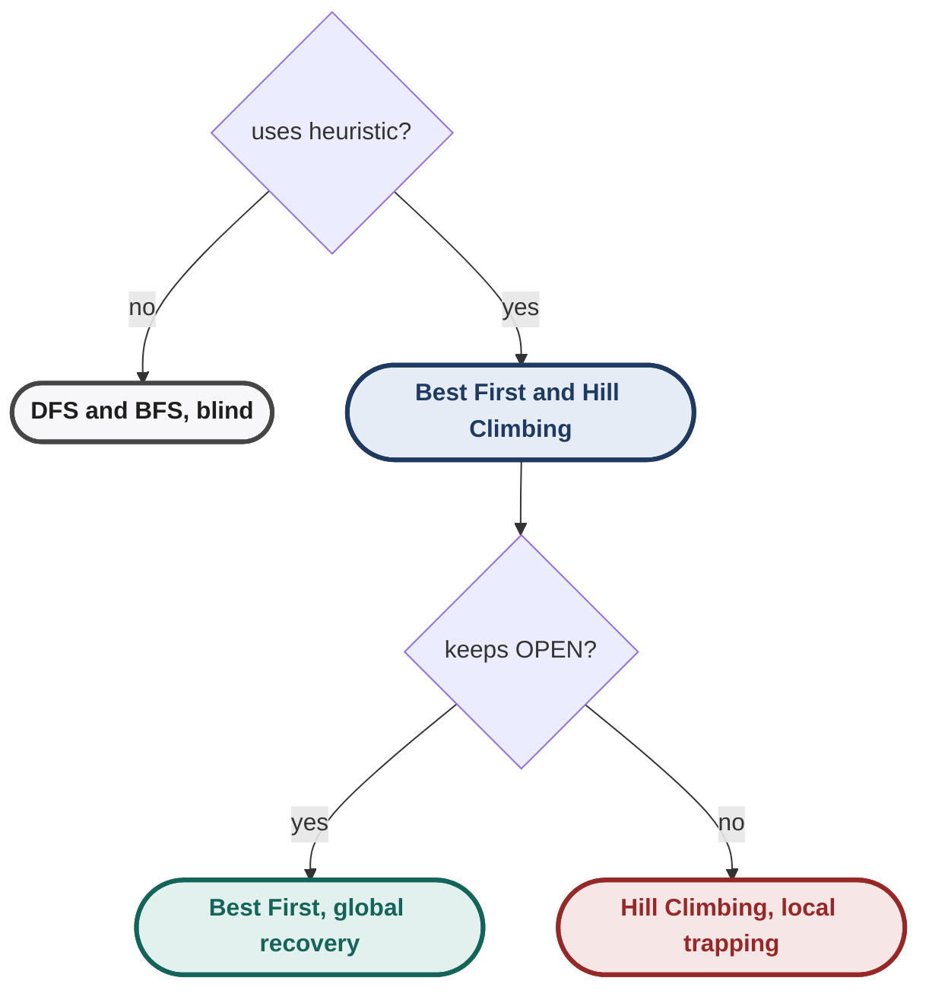

## Heuristic vs Neighbourhood

Two separate design decisions determine local-search behaviour:

``` text
Heuristic
    ↓
"How do I score a candidate?"

Neighbourhood
    ↓
"Which candidates am I allowed to compare against it?"
```

A strong heuristic with a poor neighbourhood can still fail.

A rich neighbourhood with a misleading heuristic can also fail.

Thus:

\[ \boxed{
\text{Local-search behaviour}
=
f(\text{evaluation function},\text{neighbourhood})
} \]

## Constructive + Perturbative Workflow

For hard optimization problems such as TSP, a practical conceptual
workflow is:

``` text
construct an initial candidate
          ↓
evaluate candidate
          ↓
generate neighbourhood
          ↓
inspect better alternatives
          ↓
move / modify
          ↓
repeat
```

The later local-search algorithms in the course are mechanisms for
making the last three steps less vulnerable to local optima.

## The Central Week 3 Lesson

The important progression is not simply:

``` text
Best First → Hill Climbing → TSP
```

It is:

``` text
Use information
    ↓
use less memory
    ↓
treat states as candidate solutions
    ↓
define neighbourhoods
    ↓
search enormous combinatorial spaces without enumerating everything
```

That is the conceptual bridge from classical graph search to modern
optimization-oriented local search.

## 64. 60-Second Recall

``` text
Heuristic:
h(N) = estimated remaining distance/cost
h(G) = 0
lower h = better for minimization

Best First:
OPEN ordered by h
choose lowest h
uses global frontier
can require exponential memory
not optimal

Hill Climbing:
generate only current node's neighbors
choose best neighbor
move only if strictly better
discard alternatives
O(1) space under bounded-neighborhood assumptions
greedy
not complete
can stop at local optimum / plateau

Eight Puzzle:
Hamming = number of misplaced tiles
Manhattan = sum of tile grid distances

Core lesson:
heuristic defines the landscape;
landscape determines how well greedy local improvement works.
```

## Final Mental Model

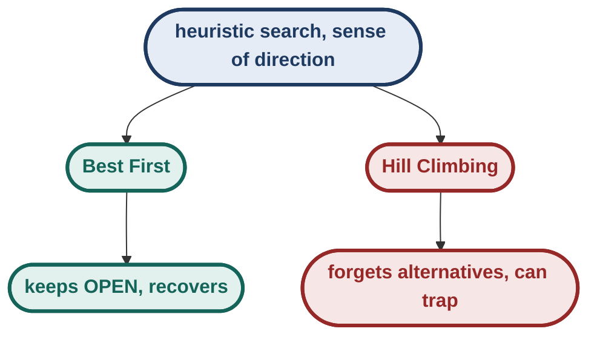

**The central Week 3 idea:** a heuristic gives search a sense of
direction, but the quality of that direction depends on the heuristic.
Best First retains enough alternatives to recover from misleading local
choices; Hill Climbing trades those alternatives away for constant
memory and speed.
