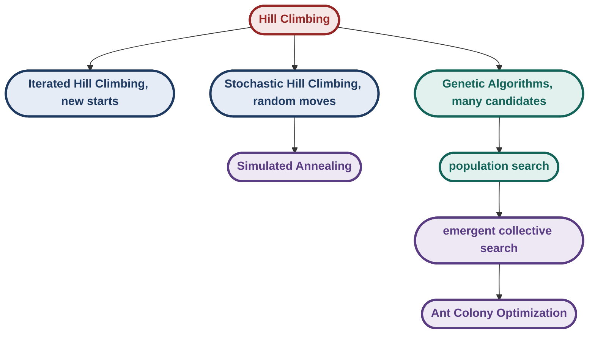
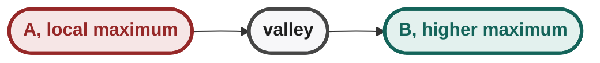

# AI-SMPS --- Week 4 Notes

> **Week 4 theme:** moving from single-candidate local search to
> stochastic and population-based search, then to collective/emergent
> optimization.
>
> **Source basis:** IIT Madras lectures *Iterated Hill Climbing*,
> *Stochastic Local Search*, *Genetic Algorithms*, *Solving TSP using
> GAs*, and *Emergent Systems and Ant Colony Optimization*,
> cross-checked against the supplied Week 4 study guide. Lecture
> terminology and examples are kept distinct from supplementary
> hand-worked examples.

## Week 4 Overview

Week 3's central limitation was that a local-search method can become
trapped by the structure around its current candidate. Week 4
progressively adds more ways to escape that trap:



The important conceptual shift is:

  ------------------------------------------------------------------------
| Method | Search object | Main source of exploration |
|---|---|---|
| Hill Climbing | One current candidate | Very little; mainly exploitation |
| Iterated Hill Climbing | One candidate at a time, many restarts | Random starting points |
| Stochastic Hill | One current candidate | Random neighbour + |
| Climbing |  | probabilistic acceptance |
| Simulated Annealing | One current candidate | Temperature-controlled acceptance of bad moves |
| Genetic Algorithm | Population | Crossover + mutation + population diversity |
| ACO | Population of artificial ants | Stochastic construction + pheromone feedback |
  ------------------------------------------------------------------------

All of these are **optimization / solution-space methods** rather than
ordinary state-space path search. The goal is usually a high-quality
candidate, not necessarily a path from a start state to a goal.

------------------------------------------------------------------------

## Lecture 1 --- Iterated Hill Climbing

## Core Idea

Hill Climbing depends heavily on the starting point. In a solution-space
problem, however, the starting candidate is often arbitrary: what
matters is the quality of the final candidate.

If one start lands in a bad local maximum, restart from another random
candidate.

``` text
Random start 1 → Hill Climbing → local maximum
Random start 2 → Hill Climbing → better maximum
Random start 3 → Hill Climbing → global maximum
...
                         ↓
                  keep the best found
```

Iterated Hill Climbing is therefore essentially **multiple independent
hill-climbing runs from different random starting points**.

### Why it helps

Suppose a landscape has three peaks:

- The landscape has three peaks of increasing height.
- The rightmost peak is the global maximum.
- A single run reaches only the peak in whose basin it starts.

A single Hill Climbing run may reach whichever peak lies in the basin of
attraction of its starting point. Repeating the process increases the
chance that at least one start lies in the basin of a better peak.

## Algorithm

Equivalent mechanical procedure:

``` text
best ← random candidate

repeat N times:
    current ← random candidate
    current ← HillClimb(current)

    if eval(current) > eval(best):
        best ← current

return best
```

For a minimization problem, reverse the comparison.

### Important distinction

**Iterated Hill Climbing does NOT change how an individual hill-climbing
run behaves.**

It changes the **number and location of starting points**.

-   Hill Climbing: deterministic local improvement after a start.
-   Iterated Hill Climbing: random restart + deterministic local
    improvement.

## Hand-Solved Example

Suppose the following candidates have evaluation values:

``` text
A → 8
B → 12
C → 17
D → 14
E → 25
F → 20
G → 11
H → 30
I → 27
```

Assume Hill Climbing follows the best improving neighbour and terminates
at a local maximum.

Suppose three random starts produce:

``` text
Run 1: A → B → C
        final = C, value 17

Run 2: D → E
        final = E, value 25

Run 3: G → H
        final = H, value 30
```

Keep the best final result:

``` text
max(17, 25, 30) = 30
```

So the algorithm returns `H`.

### What would ordinary Hill Climbing return?

That depends entirely on its single starting point.

If it starts at `A`, it returns `C` with value 17 even though a better
maximum exists elsewhere.

### Key insight

Iterated Hill Climbing attacks the **starting-point sensitivity** of
Hill Climbing, but it does not guarantee the global optimum.

## Geometry / Footprint

The supplied lecture's landscape diagram makes this especially
important: there is a region of starting points from which steepest
ascent reaches a particular maximum, while starts outside that region
may terminate at another local maximum. Iterated Hill Climbing
effectively samples several such regions.

## Exam Traps

-   It does **not** maintain all candidates simultaneously.
-   It does **not** combine solutions.
-   It does **not** accept downhill moves within an individual
    hill-climbing run.
-   Its randomness is primarily in the **restart / initial candidate**.
-   More restarts increase the chance of finding a good basin but do not
    create a formal global-optimality guarantee.

------------------------------------------------------------------------

## Lecture 2 --- Stochastic Local Search

## 2.1 Random Walk vs Hill Climbing

The lecture contrasts two extremes:

``` text
Hill Climbing
→ pure exploitation
→ choose improving direction

Random Walk
→ pure exploration
→ choose a random move
→ keep track of the best candidate seen
```

The goal is to combine these two tendencies.

- Random Walk sits at the exploration end.
- Stochastic Search sits in the middle.
- Hill Climbing sits at the exploitation end.

------------------------------------------------------------------------

## 2.2 Stochastic Hill Climbing

### Mechanism

Unlike ordinary Hill Climbing:

1.  Do **not** generate all neighbours and choose the best one.
2.  Generate **one random neighbour**.
3.  Compute its improvement/degradation.
4.  Accept it probabilistically.

For a maximization problem:

$$
\Delta E = Eval(V_n)-Eval(V_c)
$$

where:

-   $V_c$ = current candidate;
-   $V_n$ = randomly selected neighbour;
-   $\Delta E>0$ = neighbour is better;
-   $\Delta E<0$ = neighbour is worse.

The lecture uses the sigmoid probability:

$$
P(\text{move})=
\frac{1}{1+e^{-\Delta E/T}}
$$

where $T$ controls how exploratory the search is.

### What the formula means

``` text
ΔE > 0 → P > 0.5 → good move is favoured
ΔE = 0 → P = 0.5
ΔE < 0 → P < 0.5 → bad move is possible but discouraged
```

This is the crucial difference from Hill Climbing: **bad moves are
possible**.

## Hand-Solved Probability Example

Let:

``` text
Eval(current)  = 100
Eval(neighbour) = 110
T = 10
```

Then:

$$
\Delta E=110-100=10
$$

Therefore:

$$
P=
\frac{1}{1+e^{-10/10}}
=
\frac{1}{1+e^{-1}}
\approx 0.731
$$

So the neighbour is accepted with probability about **0.731**.

If the random number generated is:

``` text
r = 0.40
```

then:

``` text
0.40 < 0.731 → ACCEPT
```

If:

``` text
r = 0.90
```

then:

``` text
0.90 > 0.731 → REJECT
```

The random number does not determine the probability. The sigmoid
determines the probability; the random number implements the
probabilistic decision.

### Equal-value neighbour

If:

``` text
Eval(current) = 100
Eval(neighbour) = 100
```

then:

$$
\Delta E=0
$$

and:

$$
P=\frac{1}{1+1}=0.5
$$

So even an equally good move is accepted half the time. This
deliberately preserves exploration.

------------------------------------------------------------------------

## 2.3 Simulated Annealing

Stochastic Hill Climbing uses a fixed $T$. Simulated Annealing makes $T$
**decrease over time**.

``` text
High T
  ↓
more exploration
  ↓
cool
  ↓
less acceptance of bad moves
  ↓
more exploitation
  ↓
Low T
```

The physical analogy is annealing in materials science: heat a material
and then cool it gradually so that it can settle into a low-energy
structure.

For the search algorithm, the analogy is:

``` text
High temperature → willing to wander
Low temperature  → increasingly conservative
```

## Algorithm

``` text
current ← random candidate
best ← current
T ← large initial temperature

repeat over epochs:
    repeat for M iterations:
        choose one random neighbour
        ΔE ← Eval(neighbour) − Eval(current)

        p ← 1 / (1 + exp(−ΔE/T))

        generate r uniformly in [0,1]

        if r < p:
            current ← neighbour

        if Eval(current) > Eval(best):
            best ← current

    decrease T

return best
```

The exact cooling schedule is a design choice; the lecture's conceptual
requirement is that the temperature is gradually reduced.

## Temperature as an Exploration/Exploitation Dial

For very large $T$:

$$
P(\text{move})\approx0.5
$$

for both good and bad moves.

Thus behaviour approaches a random walk.

For $T\rightarrow0$:

-   $\Delta E>0$ → $P\rightarrow1$
-   $\Delta E<0$ → $P\rightarrow0$

Thus behaviour approaches deterministic Hill Climbing.

- At very high T the method behaves like a random walk: pure exploration.
- As T decreases, the method shifts toward exploitation.
- Near zero T the method behaves like Hill Climbing.

## Hand-Solved Example: Same Move, Different Temperature

Let:

$$
\Delta E=13
$$

This is a good move.

### Case 1: $T=1$

$$
P=\frac{1}{1+e^{-13}}
\approx0.999998
$$

Almost certainly accepted.

### Case 2: $T=10$

$$
P=\frac{1}{1+e^{-1.3}}
\approx0.786
$$

Still strongly favoured.

### Case 3: $T=100$

$$
P=\frac{1}{1+e^{-0.13}}
\approx0.532
$$

Only slightly more likely than rejection.

So **the same neighbour can be treated very differently depending on
temperature**.

## Hand-Solved Bad-Move Example

Suppose:

``` text
Eval(current) = 107
Eval(neighbour) = 100
T = 10
```

Then:

$$
\Delta E=100-107=-7
$$

$$
P=
\frac{1}{1+e^{0.7}}
\approx0.332
$$

The worse move is still possible, but only about one-third likely.

This is exactly what allows the search to leave a local maximum.

## Why Can It Escape a Local Maximum?

Suppose:



To travel from A to B, the search may have to temporarily move downhill.

Ordinary Hill Climbing:

``` text
A → downhill move
    ✗ rejected
    stuck
```

Simulated Annealing at high $T$:

``` text
A → downhill move
    ↓
  accepted with some probability
    ↓
  valley
    ↓
  climb toward B
```

As $T$ becomes small, such downhill moves become increasingly unlikely.

## Important Limitation

The lecture explicitly emphasizes that simulated annealing has **no
guarantee of finding the global maximum in the practical procedure
described**. It is an effective stochastic optimization method, not a
magic global-optimum oracle.

## Exam Traps

-   $\Delta E$ is **not** the probability.
-   $\Delta E=Eval(neighbour)-Eval(current)$ for the maximization
    formulation used here.
-   High $T$ means **more exploration**, not more exploitation.
-   Low $T$ means **more exploitation**.
-   A bad move can be accepted.
-   Only one random neighbour is considered at a time; this differs from
    ordinary Hill Climbing, which evaluates its neighbourhood to choose
    the best improving move.
-   Always track the best solution separately: the current solution can
    temporarily become worse.

------------------------------------------------------------------------

## Lecture 3 --- Genetic Algorithms

## 3.1 Why Population-Based Search?

A single candidate gives only one location in the solution space.

A population gives many simultaneous locations:

``` text
Single-candidate search:

          ●
          ↓
     local region


Population search:

●       ●       ●
    ●       ●
         ●
```

The population can explore several regions simultaneously.

The lecture presents Genetic Algorithms as **heuristic, stochastic,
adaptive search methods operating on a population of candidate solutions
in solution space**.

## Evolutionary Analogy

The lecture's conceptual chain is:

``` text
Variation
   ↓
different candidates
   ↓
competition according to fitness
   ↓
fitter candidates reproduce more
   ↓
their components become more represented
   ↓
new generations
```

Two ideas are deliberately separated:

-   **mixing / generating combinations**;
-   **selection / choosing which combinations persist**.

This is analogous to the lecture's discussion of reproduction and
natural selection.

## Genotype vs Phenotype

-   **Genotype:** the genetic encoding / collection of genes.
-   **Phenotype:** the resulting physical or observable candidate.

In a GA:

``` text
genotype
   ↓
decoded candidate
   ↓
fitness evaluation
```

Crossover operates on the encoding, while fitness measures the resulting
candidate.

------------------------------------------------------------------------

## 3.2 GA Vocabulary

  -----------------------------------------------------------------------
| Term | Meaning |
|---|---|
| Population | Set of candidate solutions |
| Chromosome | Encoding of one candidate |
| Gene | One component of the chromosome |
| Fitness | Numerical measure of candidate quality |
| Selection / reproduction | Give fitter candidates more representation |
| Crossover | Combine genes from parents |
| Mutation | Randomly change genes |
| Generation | One population-evolution cycle |
| Diversity | Variety of genetic material in the population |
  -----------------------------------------------------------------------

------------------------------------------------------------------------

## 3.3 Genetic Algorithm Pipeline

``` text
Initial population
        ↓
Fitness evaluation
        ↓
Selection / reproduction
        ↓
Parent population
        ↓
Crossover
        ↓
Offspring
        ↓
Mutation
        ↓
Replacement
        ↓
New population
        ↓
Repeat
```

## Core Operations

### 1. Selection

Fitter candidates are selected more frequently.

### 2. Crossover

Two selected parents are combined to produce offspring.

### 3. Mutation

A small random change is introduced.

The causal roles are:

``` text
Selection
→ exploitation of good existing material

Crossover
→ recombination of existing material

Mutation
→ introduces variation that may not already exist
```

------------------------------------------------------------------------

## 3.4 Roulette-Wheel Selection

Suppose the population contains:

``` text
P1 → fitness 10
P2 → fitness 20
P3 → fitness 30
P4 → fitness 40
```

Total fitness:

$$
10+20+30+40=100
$$

Therefore:

$$
P(P_1)=\frac{10}{100}=0.10
$$

$$
P(P_2)=\frac{20}{100}=0.20
$$

$$
P(P_3)=\frac{30}{100}=0.30
$$

$$
P(P_4)=\frac{40}{100}=0.40
$$

The roulette wheel assigns these fractions of its circumference to the
candidates.

For population size $N$, spin $N$ times.

### Critical point

Selection is **probabilistic**, not deterministic.

A low-fitness candidate can still be selected.

A high-fitness candidate can fail to be selected on a particular spin.

The expected number of selections is:

$$
E[\text{copies of }i]=N\cdot
\frac{f_i}{\sum_j f_j}
$$

------------------------------------------------------------------------

## 3.5 Source Worked Example --- Four Binary Candidates

The lecture gives a compact numerical example.

Chromosome = 5-bit binary string.

Fitness:

$$
f(x)=x^2
$$

where $x$ is the decimal value represented by the chromosome.

Initial population:

| Candidate | Decimal value | Fitness |
|---|---|---|
| P1 | 13 | $13^2=169$ |
| P2 | 24 | $24^2=576$ |
| P3 | 8 | $8^2=64$ |
| P4 | 19 | $19^2=361$ |

Total fitness:

$$
169+576+64+361=1170
$$

### Selection probabilities

$$
P(P_1)=\frac{169}{1170}\approx0.144
$$

$$
P(P_2)=\frac{576}{1170}\approx0.492
$$

$$
P(P_3)=\frac{64}{1170}\approx0.055
$$

$$
P(P_4)=\frac{361}{1170}\approx0.309
$$

Therefore P2 is most likely to reproduce.

The lecture's roulette-wheel outcome gives:

``` text
P1 → 1 copy
P2 → 2 copies
P3 → 0 copies
P4 → 1 copy
```

So the selected population becomes:

``` text
13, 24, 24, 19
```

This is an important example of selection pressure:

-   the fittest candidate gained representation;
-   the weakest candidate disappeared;
-   but selection itself did not invent new genetic material.

------------------------------------------------------------------------

## 3.6 Hand-Solving the Lecture's Crossover

Use the selected chromosomes:

``` text
13 = 01101
24 = 11000
24 = 11000
19 = 10011
```

Pair:

``` text
01101 × 11000
11000 × 10011
```

### Pair 1

Choose a crossover point after the third bit:

``` text
P1 = 011 | 01
P2 = 110 | 00
```

Swap the tails:

``` text
C1 = 011 | 00 = 01100 = 12
C2 = 110 | 01 = 11001 = 25
```

Fitness:

$$
12^2=144
$$

$$
25^2=625
$$

### Pair 2

Choose a crossover point after the second bit:

``` text
P1 = 11 | 000
P2 = 10 | 011
```

Swap tails:

``` text
C1 = 11 | 011 = 11011 = 27
C2 = 10 | 000 = 10000 = 16
```

Fitness:

$$
27^2=729
$$

$$
16^2=256
$$

New population:

``` text
12, 25, 27, 16
```

Average fitness before crossover:

$$
\frac{1170}{4}=292.5
$$

Average fitness after crossover:

$$
\frac{144+625+729+256}{4}
=
\frac{1754}{4}
=
438.5
$$

So this particular crossover produced a substantially fitter population.

**Important:** this does not mean every crossover improves fitness.
Crossover is stochastic and can produce worse offspring.

------------------------------------------------------------------------

## 3.7 Mutation

Mutation randomly changes a small part of a chromosome.

For a binary chromosome:

``` text
Before: 1 0 1 1 0
After:  1 0 0 1 0
            ↑
         mutation
```

Its role is fundamentally different from crossover.

``` text
Crossover
→ recombines information already present

Mutation
→ introduces random variation
```

The lecture emphasizes that most random mutations may be harmful, but
rare mutations can be beneficial.

------------------------------------------------------------------------

## 3.8 Replacement

The lecture describes:

``` text
Replace k weakest members of P
with
k strongest offspring
```

where $k$ may equal the whole population size.

If $k=N$, the entire population is replaced.

If $k<N$, some original strong candidates are retained.

This partial replacement is an **elitist** idea: preserve strong
existing solutions while injecting better offspring.

------------------------------------------------------------------------

## 3.9 Why Population Diversity Matters

This is one of the most important conceptual points in the GA lecture.

Suppose the optimal solution requires gene `1` at position 3.

If every individual in the population has:

``` text
gene 3 = 0
```

then crossover cannot produce gene `3 = 1`.

Why?

Because crossover only recombines material that already exists.

Therefore:

``` text
small / homogeneous population
        ↓
gene loss
        ↓
less diversity
        ↓
some regions become unreachable
        ↓
premature convergence
```

Mutation can reintroduce missing variation, but if mutation is rare,
recovery may be unlikely.

### Source Example

The lecture's second cycle starts from a population in which the
selected copies collapse to only two distinct candidate types.

The population's average fitness increases, but diversity decreases.

A particular gene disappears from all four individuals. The lecturer
points out that if the missing gene is required by the optimum, repeated
selection/crossover alone cannot recover it.

This produces a critical lesson:

> **High fitness is not the same thing as healthy population
> diversity.**

A population can become fitter while simultaneously becoming less
capable of exploring.

------------------------------------------------------------------------

## 3.10 Large and Diverse Initial Population

The lecture explicitly stresses:

> A large, diverse population is critical to GA performance.

Why?

``` text
Large + diverse
→ many regions represented
→ more genes available
→ crossover has more material to recombine
→ better exploration

Small + homogeneous
→ fewer genes
→ faster collapse
→ premature convergence
```

This is also why GA is not simply "run Hill Climbing many times."

A GA **recombines information between candidates**.

------------------------------------------------------------------------

## 3.11 GA on SAT

The lecture also uses a Boolean SAT problem.

A chromosome such as:

``` text
010110
```

encodes:

``` text
a=0
b=1
c=0
d=1
e=1
f=0
```

The fitness is the **number of satisfied clauses**.

So if there are 6 clauses:

``` text
fitness ∈ {0,1,2,3,4,5,6}
```

and this is a maximization problem.

The lecture's example has two parent chromosomes:

``` text
010110
111010
```

Both have fitness 4.

A single-point crossover shown in the lecture creates an offspring
satisfying all 6 clauses.

The important lesson is not the particular SAT formula; it is the
mechanism:

``` text
Parent 1 → useful gene block
Parent 2 → useful gene block
              ↓
          crossover
              ↓
      offspring combines them
              ↓
          fitness = 6
```

------------------------------------------------------------------------

## 3.12 GA Failure Mode: Premature Convergence

Premature convergence occurs when selection pressure causes the
population to become too similar before the search has explored the
useful parts of the space.

``` text
Initial:
A B C D E F G H

After selection:
A A B A B A A B

Later:
A A A A A A A A
```

Now crossover mostly produces more `A`-like solutions.

There is little diversity left.

### Three-way distinction

  -----------------------------------------------------------------------
| Mechanism | Main role | Failure if overused |
|---|---|---|
| Selection | Exploit good candidates | Premature convergence |
| Crossover | Recombine information | Invalid offspring if representation is unsuitable |
| Mutation | Restore variation / explore | Too much mutation destroys useful structure |
  -----------------------------------------------------------------------

------------------------------------------------------------------------

## Lecture 4 --- Solving TSP Using Genetic Algorithms

## 4.1 TSP Representation

A TSP tour visits every city exactly once and returns to the start.

Path representation:

``` text
C A B D
```

means:

``` text
C → A → B → D → C
```

The final return edge is implicit.

### Fitness / objective

For TSP:

$$
Cost(T)=
d(c_1,c_2)+d(c_2,c_3)+\cdots+d(c_n,c_1)
$$

We want:

$$
\min Cost(T)
$$

Therefore:

-   **shorter tour = fitter candidate**;
-   unlike the SAT example, this is a minimization problem.

------------------------------------------------------------------------

## 4.2 Why Ordinary Single-Point Crossover Fails

Consider:

``` text
P1 = A B C D E F
P2 = D E F A B C
```

Cut after position 3:

``` text
P1 = A B C | D E F
P2 = D E F | A B C
```

Swap tails:

``` text
C1 = A B C A B C
C2 = D E F D E F
```

Both are invalid tours.

They contain:

-   repeated cities;
-   missing cities.

The actual lecture's TSP slide demonstrates exactly this problem with
larger tours: ordinary single-point crossover creates repeated cities
such as `L`, `B`, and `J`.

### Key principle

A chromosome can be syntactically valid as a string while being
**semantically invalid as a TSP tour**.

This is why representation and operator design are inseparable in GAs.

------------------------------------------------------------------------

## 4.3 Cycle Crossover (CX)

Cycle Crossover preserves the permutation property.

### Core idea

Find cycles based on positional correspondence between the two parents.

The supplied lecture's example uses:

``` text
P1 = O D G L A H K M B J F C N I E
P2 = H G M F O A D K I C N E L B J
```

The first cycle begins with `O`:

``` text
O
↓
H
↓
A
↓
O
```

So:

``` text
Cycle 1 = {O, H, A}
```

The next unassigned position begins with `D`:

``` text
D → G → M → K → D
```

so:

``` text
Cycle 2 = {D, G, M, K}
```

Continuing gives the complete positional cycles:

``` text
Cycle 1 = {O, A, H}
Cycle 2 = {D, K, M, G}
Cycle 3 = {L, N, F}
Cycle 4 = {B, I}
Cycle 5 = {J, E, C}
```

### Child construction

The lecture uses:

-   Child 1 = odd-numbered cycles from P1 + even-numbered cycles from
    P2.
-   Child 2 = odd-numbered cycles from P2 + even-numbered cycles from
    P1.

Therefore:

``` text
C1:
cycles 1,3,5 from P1
cycles 2,4 from P2

= O G M L A H D K I J F C N B E
```

and:

``` text
C2:
cycles 1,3,5 from P2
cycles 2,4 from P1

= H D G F O A K M B C N E L I J
```

Every city appears exactly once.

### Why is CX valid?

Each position belongs to exactly one cycle.

At each position, the child copies exactly one parent's city.

Therefore the permutation property is preserved.

### Exam procedure

1.  Write P1 and P2 in aligned positions.
2.  Start from the first unused position.
3.  Follow the corresponding city through the other parent.
4.  Continue until returning to the starting position.
5.  Mark that cycle.
6.  Repeat until all positions belong to a cycle.
7.  Apply the required odd/even cycle rule.
8.  Check every city occurs exactly once.

### Exam trap

Do not confuse a **cycle in the crossover mapping** with a physical
cycle in the TSP tour.

------------------------------------------------------------------------

## 4.4 PMX --- Partially Mapped Crossover

PMX is designed to handle positional conflicts systematically.

The lecture chooses a corresponding segment:

``` text
P1 segment = H K M B J
P2 segment = A D K I C
```

So the mapping is:

``` text
H ↔ A
K ↔ D
M ↔ K
B ↔ I
J ↔ C
```

### Step 1 --- Copy P1's segment

Child 1 receives:

``` text
H K M B J
```

in the selected positions.

### Step 2 --- Try to fill from P2

Suppose a P2 city wants a position already occupied by the copied P1
segment.

Example:

``` text
P2 wants A
```

But the relevant position contains `H`.

Follow the mapping:

``` text
A ↔ H
```

so `A` is placed in the position associated with `H` after resolving the
conflict.

For a chained conflict such as `D`:

``` text
D → K
K → M
M → unused, so place M there
```

the exact positional mapping is followed until an unoccupied location is
found.

### Hand-solved Child 1

Using the lecture's parents and selected segment, the completed child
is:

``` text
A G D F O | H K M B J | N E L I C
```

The central segment is copied from P1; the remaining positions are
filled using P2 plus the partial mapping.

### Why PMX works

It does not simply delete duplicates after crossover.

Instead, it **resolves positional conflicts through the mapping created
by the two selected segments**.

The resulting child remains a valid permutation.

### Exam procedure

``` text
1. Select two cut points.
2. Copy P1 segment into C1.
3. Build P1/P2 mapping for that segment.
4. Scan P2 outside the segment.
5. If the city is unused → place it.
6. If the city conflicts → follow the mapping chain.
7. Repeat until an unused city/location is reached.
8. Fill remaining positions.
9. Verify permutation validity.
```

------------------------------------------------------------------------

## 4.5 Order Crossover (OX)

The lecture's Order Crossover works differently.

### Mechanism

1.  Copy a selected subtour from P1.
2.  Look at P2.
3.  Read the remaining cities in the **order they appear in P2**.
4.  Fill the remaining positions using that order.

Example concept:

``` text
P1: [ ... H K M B J ... ]
P2: [ ... G F O A D ... ]
```

Copy:

``` text
C1: [ ... H K M B J ... ]
```

Then fill the remaining positions with the remaining P2 cities in their
original relative order.

### Core property

OX tries to preserve **relative ordering** of cities.

------------------------------------------------------------------------

## 4.6 Comparing the Main TSP Crossovers

  ------------------------------------------------------------------------
| Operator | Main mechanism | Permutation-safe? | Main idea |
|---|---|---|---|
| Single-point | Swap tails | No for path representation | Simple but creates duplicates |
| Cycle Crossover | Identify positional cycles | Yes | Alternate cycle ownership |
| PMX | Copy segment + resolve mapping | Yes | Resolve positional conflicts |
| Order Crossover | Copy segment + preserve P2 order | Yes | Preserve relative order |
| Alternating | Alternate edges | Not automatically | Preserve parent |
| Edges | from parents |  | edges |
| Heuristic | Choose closer | Requires care | Use distance |
| Crossover | next city |  | information |
| Ordinal + | Encode relative | Yes | Change |
| single-point | position numerically |  | representation so ordinary crossover becomes valid |
  ------------------------------------------------------------------------

------------------------------------------------------------------------

## 4.7 Adjacency Representation

Path representation tells us:

``` text
O → D → G → L → A → ...
```

Adjacency representation instead indexes cities and records the outgoing
successor.

If:

``` text
A → H
B → J
C → N
```

then:

``` text
index: A B C ...
value: H J N ...
```

So to find the successor of `A`, look directly at the entry indexed by
`A`.

### Why use it?

It makes edge-based operations easier.

The lecture emphasizes that this representation allows you to retrieve
the next city without scanning the entire tour.

### Important caveat

Not every arbitrary permutation of adjacency entries represents a valid
tour.

For example:

``` text
A → B
B → A
```

creates a smaller cycle before all cities have been visited.

So:

``` text
permutation of cities ≠ automatically valid TSP tour
```

This is another representation-validity trap.

------------------------------------------------------------------------

## 4.8 Rotational Equivalence

In a cyclic TSP tour:

``` text
B A C D
```

is equivalent to:

``` text
A C D B
C D B A
D B A C
```

because each describes the same cycle with a different starting point.

The lecture also notes reversal equivalence in the undirected case:

``` text
C D A B
```

can describe the same undirected tour as:

``` text
D C B A
```

depending on the exact TSP assumptions.

### Exam warning

Do not automatically count every permutation as a distinct tour.

The representation may contain multiple encodings of the same cyclic
tour.

------------------------------------------------------------------------

## 4.9 Alternating-Edges Crossover

With adjacency representation:

1.  Start at a city.
2.  Take its outgoing edge from P1.
3.  At the next city, take the outgoing edge from P2.
4.  Alternate.

Example:

``` text
P1: A → F
P2: F → N
P1: N → I
P2: I → C
...
```

### Major trap

The lecture explicitly records a student question:

> Can this produce the same city again or a dead end?

Yes.

Therefore alternating-edges crossover **does not automatically guarantee
a valid tour**.

You must check for:

-   repeated cities;
-   premature cycles;
-   dead ends.

This is an excellent exam trap because the operator sounds naturally
valid but is not automatically so.

------------------------------------------------------------------------

## 4.10 Heuristic Crossover

The heuristic crossover uses distance information.

For each current city:

``` text
look at candidate successor from P1
look at candidate successor from P2
choose the closer one
```

It is therefore more domain-informed than purely structural crossover.

The motivation is direct:

``` text
closer next city
→ potentially shorter tour
```

But it is still heuristic; choosing the locally closer successor does
not by itself guarantee a globally optimal tour.

------------------------------------------------------------------------

## 4.11 Ordinal Representation

Ordinal representation changes the encoding so that ordinary
single-point crossover becomes safe.

### Construction

Maintain a dynamic ordered list of remaining cities.

Example:

``` text
Initial index:
A B C D E F G ...
```

Suppose the path begins:

``` text
O → D → G → L → A → ...
```

For each city:

1.  Write its current position in the remaining-city index.
2.  Remove that city.
3.  Shift the remaining index.
4.  Continue.

The lecture's example starts with:

``` text
O → ordinal value 15
D → ordinal value 4
G → ordinal value 6
...
```

When `D` is removed, all later positions shift.

Eventually only one city remains, so the final ordinal value must be:

``` text
1
```

### Why bother?

Because:

> **Single-point crossover on ordinal representations produces valid
> offspring.**

So instead of inventing a special crossover, we can change the
representation.

This is a major AI/search lesson:

``` text
Problem representation
        ↓
determines what operators are valid
```

------------------------------------------------------------------------

## 4.12 TSP Exam Checklist

When given a TSP GA question:

``` text
1. Identify the representation.
2. Check whether the operator is valid for that representation.
3. Align the parents.
4. Follow the operator mechanically.
5. Check every city occurs exactly once.
6. Check no city is missing.
7. If asked for cost, remember the return edge to the start.
8. For minimization, lower cost = fitter.
```

Never stop after producing a visually plausible child.

------------------------------------------------------------------------

## Lecture 5 --- Emergent Systems and Ant Colony Optimization

## 5.1 Emergence

An **emergent system** exhibits complex global behaviour arising from
many simpler entities following relatively simple local rules.

``` text
Simple components
      ↓
local interactions
      ↓
feedback
      ↓
self-organization
      ↓
complex global behaviour
```

The key point:

> The global behaviour is not explicitly programmed as one centralized
> procedure; it emerges from interactions among components.

Examples discussed in the lecture include:

-   ant colonies;
-   bird flocks;
-   termite mounds;
-   markets;
-   hurricanes/cyclones;
-   cellular automata;
-   neural systems.

------------------------------------------------------------------------

## 5.2 Conway's Game of Life

John Conway's Game of Life is a cellular automaton.

Each cell is either:

``` text
alive = 1
dead  = 0
```

The next state depends only on the current state and the number of live
neighbours.

For the standard rule:

| Current cell | Live neighbours | Next state |
|---|---|---|
| Alive | < 2 | Dead |
| Alive | 2 or 3 | Alive |
| Alive | > 3 | Dead |
| Dead | exactly 3 | Alive |

Mnemonic:

``` text
Alive:
  0–1 → dies
  2–3 → survives
  4+  → dies

Dead:
  3   → becomes alive
```

## Hand-Solved Example

Start with:

``` text
. # .
# # .
. . .
```

where `#` = alive and `.` = dead.

The center cell has two live neighbours:

``` text
# # .
```

so it survives.

The upper-middle dead cell has three live neighbours:

``` text
. # .
# # .
. . .
```

so it becomes alive.

The exact next generation is obtained by applying the rule
**simultaneously to every cell**.

### Important exam trap

Do not update cells one at a time using already-updated neighbours.

Game of Life transitions are based on the **same previous generation**.

------------------------------------------------------------------------

## 5.3 Gosper's Glider Gun

The lecture discusses the famous Gosper's Glider Gun.

It is striking because repeated application of local rules creates a
pattern that appears to produce moving objects.

The apparent "glider" is not a centralized moving object.

Instead:

``` text
cell dies
cell appears
cell dies
cell appears
...
```

and the global pattern appears to translate through space.

This is a canonical example of:

``` text
simple local rules
        ↓
complex / persistent global structure
```

------------------------------------------------------------------------

## 5.4 Fractals

The lecture also uses fractals to illustrate repeated simple processes
producing complex structure.

A fractal is characterized by self-similar structure across scales.

The Sierpiński triangle is a canonical example:

``` text
repeat a simple geometric rule
        ↓
apply it recursively
        ↓
increasingly detailed self-similar pattern
```

The conceptual connection to emergence is more important than memorizing
any particular fractal construction:

``` text
simple repeated rule + feedback/recursion
→ complex structure
```

------------------------------------------------------------------------

## 5.5 Ant Colonies as Emergent Systems

Individual ants are relatively simple.

Yet the colony can:

-   search for food;
-   discover routes;
-   reinforce useful paths;
-   adapt when an obstacle changes the environment.

The communication mechanism is pheromone.

Basic behavioural loop:

``` text
ant explores
   ↓
leaves pheromone
   ↓
other ants sense pheromone
   ↓
follow stronger trail more often
   ↓
more ants use trail
   ↓
more pheromone
   ↓
positive feedback
```

------------------------------------------------------------------------

## 5.6 Why Shorter Paths Become Stronger

Suppose two routes connect nest and food:

``` text
Route A: short
Route B: long
```

Ants initially explore both.

An ant taking Route A returns sooner.

Therefore, per unit time:

``` text
more trips on A
→ more pheromone deposited on A
→ stronger attraction to A
→ more ants use A
→ even more pheromone
```

Thus the colony can collectively favour the shorter route without a
central planner knowing the route lengths.

When an obstacle changes the environment, the old pheromone can
disappear and the colony can reorganize.

------------------------------------------------------------------------

## 5.7 Ant Colony Optimization (ACO)

ACO turns this biological mechanism into an optimization algorithm.

Each artificial ant constructs a candidate solution.

For TSP:

``` text
Ant
 ↓
choose next city
 ↓
continue until all cities visited
 ↓
complete tour
 ↓
evaluate tour
 ↓
deposit pheromone
```

The choice is **stochastic greedy**.

It combines:

1.  pheromone;
2.  heuristic visibility.

------------------------------------------------------------------------

## 5.8 Visibility

For TSP:

$$
\eta_{ij}=\frac{1}{d_{ij}}
$$

where $d_{ij}$ is the distance from city $i$ to city $j$.

Therefore:

``` text
short edge
→ small distance
→ high visibility

long edge
→ large distance
→ low visibility
```

This is the greedy component.

------------------------------------------------------------------------

## 5.9 Pheromone

Let:

$$
\tau_{ij}(t)
$$

be the pheromone level on edge $(i,j)$ at time $t$.

High pheromone means:

``` text
historically attractive edge
```

It is not the same thing as physical distance.

This distinction is important:

| Quantity | Meaning |
|---|---|
| $\tau_{ij}$ | Learned historical desirability |
| $\eta_{ij}$ | Immediate heuristic desirability |
| $d_{ij}$ | Physical distance |

------------------------------------------------------------------------

## 5.10 Transition Probability

The study guide gives:

$$
P^k_{ij}(t)=
\frac{
[\tau_{ij}(t)]^\alpha[\eta_{ij}]^\beta
}{
\sum_{h\in allowed}
[\tau_{ih}(t)]^\alpha[\eta_{ih}]^\beta
}
$$

where:

-   $\tau_{ij}$ = pheromone on edge $(i,j)$;
-   $\eta_{ij}=1/d_{ij}$ = visibility;
-   $\alpha$ = importance of pheromone;
-   $\beta$ = importance of visibility;
-   `allowed` = cities that can still be visited without producing a
    premature invalid tour;
-   $k$ = ant index.

### Interpretation

The numerator is:

``` text
pheromone preference
×
distance-based preference
```

The denominator normalizes all allowed choices so probabilities sum to
1.

------------------------------------------------------------------------

## 5.11 Hand-Solved ACO Choice

Suppose an ant at city `A` can choose among `B`, `C`, and `D`.

Assume:

``` text
τAB = 2      dAB = 2
τAC = 1      dAC = 1
τAD = 4      dAD = 4
```

and:

``` text
α = 1
β = 1
```

Visibility:

$$
\eta_{AB}=\frac12
$$

$$
\eta_{AC}=1
$$

$$
\eta_{AD}=\frac14
$$

Unnormalized scores:

``` text
B: 2 × 1/2 = 1
C: 1 × 1   = 1
D: 4 × 1/4 = 1
```

Total:

$$
1+1+1=3
$$

Therefore:

$$
P(A\rightarrow B)=\frac13
$$

$$
P(A\rightarrow C)=\frac13
$$

$$
P(A\rightarrow D)=\frac13
$$

This example shows why neither pheromone nor distance should be
interpreted in isolation: their product determines the preference.

------------------------------------------------------------------------

## 5.12 Effect of $\alpha$

Increasing $\alpha$ increases the influence of pheromone.

``` text
small α
→ pheromone matters less
→ more exploration

large α
→ pheromone matters more
→ stronger historical reinforcement
→ faster convergence
→ greater risk of sticking to an early route
```

------------------------------------------------------------------------

## 5.13 Effect of $\beta$

Increasing $\beta$ increases the influence of visibility.

``` text
small β
→ less reliance on distance

large β
→ stronger nearest-neighbour tendency
→ more greedy behaviour
→ potentially less global exploration
```

------------------------------------------------------------------------

## 5.14 Pheromone Deposit

The lecture specifies that ant $k$ deposits pheromone inversely
proportional to its tour length.

A common form given in the study guide is:

$$
\Delta\tau^k_{ij}
=
\begin{cases}
\frac{Q}{L_k}, & \text{if ant }k\text{ used edge }(i,j)\\
0, & \text{otherwise}
\end{cases}
$$

where:

-   $Q$ = constant;
-   $L_k$ = length of ant $k$'s tour.

Thus:

``` text
short tour
→ small L
→ large Q/L
→ more pheromone

long tour
→ large L
→ small Q/L
→ less pheromone
```

## Hand-Solved Deposit Example

Suppose:

``` text
Q = 100

Ant 1 tour length = 20
Ant 2 tour length = 50
```

Then:

$$
\Delta\tau_1=\frac{100}{20}=5
$$

$$
\Delta\tau_2=\frac{100}{50}=2
$$

If both ants used edge `(A,B)`, that edge receives:

$$
5+2=7
$$

before evaporation.

------------------------------------------------------------------------

## 5.15 Evaporation

The pheromone update is:

$$
\tau_{ij}(t+n)
=
(1-\rho)\tau_{ij}(t)
+
\Delta\tau_{ij}
$$

where $\rho$ is the evaporation rate.

### Hand-Solved Example

Suppose:

``` text
old pheromone = 10
ρ = 0.2
new deposited pheromone = 4
```

After evaporation:

$$
(1-0.2)(10)=8
$$

Then add the new deposit:

$$
8+4=12
$$

So:

``` text
new pheromone = 12
```

### Why evaporation matters

Without evaporation:

``` text
early lucky path
      ↓
pheromone keeps accumulating
      ↓
ants increasingly forced toward it
      ↓
little exploration
      ↓
stagnation
```

With evaporation:

``` text
old information gradually fades
      ↓
new evidence can matter
      ↓
exploration remains possible
```

Thus evaporation is not simply "loss"; it is a mechanism for forgetting
stale information.

------------------------------------------------------------------------

## 5.16 ACO for TSP --- Complete Algorithm

``` text
bestTour ← NIL

repeat:
    place M ants on N cities randomly

    for each ant a:
        construct a tour
        at each step:
            choose next allowed city
            using P^a_ij(t)

        update bestTour

    for each ant a:
        for each edge (u,v) in its tour:
            deposit pheromone proportional to 1/tour-length

    evaporate pheromone

until termination criterion

return bestTour
```

The exact lecture emphasizes:

``` text
M ants
→ construct N-city tours
→ retain best tour
→ deposit pheromone
→ evaporate
→ repeat
```

------------------------------------------------------------------------

## 5.17 GA vs ACO

Both are population-based / nature-inspired optimization approaches, but
their information-sharing mechanisms differ.

  -----------------------------------------------------------------------
| Property | Genetic Algorithm | ACO |
|---|---|---|
| Population | Candidate solutions | Artificial ants |
| Information carrier | Genes/chromosomes | Pheromone trails |
| New solutions | Crossover + mutation | Stochastic construction |
| Feedback | Fitness-based selection | Pheromone reinforcement |
| Exploration | Mutation + diversity | Stochastic choices + evaporation |
| Exploitation | Selection of fitter candidates | Strong pheromone / heuristic bias |
| TSP issue | Valid permutation representation | Avoid revisiting cities while constructing tour |
| Main danger | Premature convergence | Pheromone stagnation |
  -----------------------------------------------------------------------

------------------------------------------------------------------------

## Week 4 Synthesis

## 1. The Exploration--Exploitation Continuum

``` text
Random Walk
   ↓
pure exploration

Iterated Hill Climbing
   ↓
explores by restarting

Stochastic Hill Climbing
   ↓
mostly good moves + occasional bad moves

Simulated Annealing
   ↓
exploration early → exploitation late

Genetic Algorithms
   ↓
population-wide exploration + selection pressure

ACO
   ↓
collective exploration + pheromone reinforcement
```

The algorithms differ primarily in **where randomness enters** and **how
information from good solutions is reused**.

------------------------------------------------------------------------

## 2. Three Ways Week 4 Escapes Local Optima

### Restart

``` text
Iterated Hill Climbing:
new starting point
```

### Probabilistic acceptance

``` text
Stochastic Hill Climbing:
occasionally accept worse move

Simulated Annealing:
acceptance becomes less likely as T decreases
```

### Population diversity

``` text
GA:
keep many candidates
recombine them
mutate them
```

ACO adds a fourth idea:

``` text
collective feedback
→ good paths reinforce themselves
→ old information evaporates
```

------------------------------------------------------------------------

## 3. Single Candidate vs Population

  -----------------------------------------------------------------------
| Question | Single-candidate methods | Population methods |
|---|---|---|
| How many current solutions? | Usually one | Many |
| Main risk | Local optimum | Premature convergence / stagnation |
| Information sharing | Through current trajectory | Between candidates / agents |
| Diversity | Restart or stochastic moves | Population itself |
| Example | SA | GA, ACO |
  -----------------------------------------------------------------------

------------------------------------------------------------------------

## 4. Selection vs Crossover vs Mutation

This distinction is extremely exam-relevant.

``` text
Selection
→ decides WHICH candidates get represented more

Crossover
→ decides HOW information from selected parents is recombined

Mutation
→ introduces RANDOM variation
```

Do not say:

> "Mutation combines parents."

That is crossover.

Do not say:

> "Crossover creates completely new genes."

Ordinary crossover recombines existing genetic material; mutation is the
primary mechanism that introduces new variation.

------------------------------------------------------------------------

## 5. Representation Is Part of the Algorithm

The TSP section demonstrates a general principle:

``` text
representation
      ↓
determines which operators are valid
      ↓
determines what offspring mean
      ↓
determines whether the search can remain inside the legal solution space
```

Examples:

``` text
Path representation + single-point crossover
→ invalid permutations possible

Path representation + CX / PMX / OX
→ designed to preserve permutation validity

Ordinal representation + single-point crossover
→ valid offspring

Adjacency representation
→ useful for edge-based operators
→ but arbitrary permutations can still encode invalid subtours
```

This is not merely an implementation detail. It is a **search-design
decision**.

------------------------------------------------------------------------

## 6. Nature-Inspired Does Not Mean Nature-Identical

The lecture uses natural systems as inspiration, but the algorithms are
engineered abstractions.

``` text
Natural evolution
→ biological reproduction, mutation, survival

GA
→ artificial fitness
→ artificial selection
→ engineered crossover
→ engineered mutation
```

Likewise:

``` text
Real ants
→ biological pheromone communication

ACO
→ mathematical pheromone values
→ explicit probability formula
→ algorithmic evaporation/update
```

Do not infer that a GA or ACO exactly reproduces biological evolution or
ant behaviour.

------------------------------------------------------------------------

## High-Value Exam Traps

1.  **Iterated Hill Climbing is not a population algorithm.** It
    repeatedly restarts a single local search.
2.  **Stochastic Hill Climbing does not necessarily choose the best
    neighbour.** It samples a random neighbour and decides
    probabilistically.
3.  **$\Delta E$ is not the acceptance probability.**
4.  **At $\Delta E=0$, sigmoid acceptance is 0.5.**
5.  **High $T$ means exploration; low $T$ means exploitation.**
6.  **Simulated Annealing can accept a worse move.**
7.  **GA selection probability is proportional to fitness; it is not
    equal to fitness itself.**
8.  **A low-fitness candidate can still be selected.**
9.  **Crossover and mutation are different operations.**
10. **Selection can increase average fitness while decreasing
    diversity.**
11. **If a gene disappears from the whole population, crossover alone
    cannot recreate it.**
12. **Ordinary single-point crossover is unsafe for TSP path
    permutations.**
13. **Cycle Crossover requires finding positional cycles before
    constructing children.**
14. **PMX requires conflict resolution through the mapping.**
15. **Order Crossover preserves relative order from the second parent
    for the unfilled cities.**
16. **Alternating Edges can create a premature cycle or dead end.**
17. **Not every adjacency permutation is a valid TSP tour.**
18. **Rotations of a cyclic path can represent the same TSP tour.**
19. **ACO pheromone is not the same as distance.**
20. **Visibility is usually $\eta_{ij}=1/d_{ij}$.**
21. **Increasing $\alpha$ strengthens pheromone influence.**
22. **Increasing $\beta$ strengthens heuristic/visibility influence.**
23. **Evaporation prevents old pheromone from dominating forever.**
24. **ACO's probability must be normalized over allowed next cities.**
25. **Emergent behaviour is global complexity produced by local
    rules/interactions.**
26. **Game of Life updates should conceptually be simultaneous, not
    based on already-updated cells.**

------------------------------------------------------------------------

## Compact Algorithm Recall

## Iterated Hill Climbing

``` text
best ← random candidate
repeat:
    current ← random candidate
    current ← HillClimb(current)
    best ← better(best, current)
return best
```

## Stochastic Hill Climbing

``` text
current ← random candidate
repeat:
    neighbour ← random neighbour
    ΔE ← Eval(neighbour) − Eval(current)
    p ← 1/(1+e^(−ΔE/T))
    if random() < p:
        current ← neighbour
    best ← better(best, current)
return best
```

## Simulated Annealing

``` text
current ← random candidate
best ← current
T ← large

repeat:
    perform M stochastic moves using T
    best ← best seen
    decrease T

return best
```

## Genetic Algorithm

``` text
P ← initial population

repeat:
    evaluate fitness(P)
    S ← select N candidates proportional to fitness
    pair S
    crossover pairs
    mutate some offspring
    replace weak members of P with strong offspring

return best member
```

## ACO

``` text
bestTour ← NIL

repeat:
    place M ants
    each ant constructs a tour stochastically
    update bestTour
    deposit pheromone according to tour quality
    evaporate pheromone

return bestTour
```

------------------------------------------------------------------------

## 60-Second Recall

``` text
IHC
→ restart

Stochastic HC
→ random neighbour + sigmoid acceptance

SA
→ stochastic HC + cooling temperature

GA
→ population + selection + crossover + mutation

TSP GA
→ representation matters
→ ordinary single-point crossover can create duplicates
→ CX / PMX / OX preserve permutation validity

Emergence
→ simple local rules → complex global behaviour

ACO
→ ants + pheromone + visibility
→ stochastic greedy construction
→ good tours deposit more pheromone
→ evaporation prevents fixation
```

### Essential formulas

$$
\Delta E=Eval(V_n)-Eval(V_c)
$$

$$
P_{\text{move}}=
\frac{1}{1+e^{-\Delta E/T}}
$$

$$
P_{\text{select}}(i)
=
\frac{f_i}{\sum_j f_j}
$$

$$
\eta_{ij}=\frac{1}{d_{ij}}
$$

$$
P^k_{ij}(t)=
\frac{
[\tau_{ij}(t)]^\alpha[\eta_{ij}]^\beta
}{
\sum_{h\in allowed}
[\tau_{ih}(t)]^\alpha[\eta_{ih}]^\beta
}
$$

$$
\Delta\tau^k_{ij}=
\begin{cases}
Q/L_k,&(i,j)\text{ is used by ant }k\\
0,&\text{otherwise}
\end{cases}
$$

$$
\tau_{ij}(t+n)
=
(1-\rho)\tau_{ij}(t)+\Delta\tau_{ij}
$$

------------------------------------------------------------------------

## Final Mental Model

Week 4 is best understood as a sequence of answers to one question:

> **What can we do when a local search process does not see the global
> solution from where it currently is?**

``` text
Problem:
local optimum
     ↓
Try a different starting point
     ↓
Iterated Hill Climbing
     ↓
Still trapped?
     ↓
Allow occasional bad moves
     ↓
Stochastic Hill Climbing
     ↓
Control those bad moves over time
     ↓
Simulated Annealing
     ↓
Need many regions explored simultaneously?
     ↓
Genetic Algorithm
     ↓
Need information to emerge from interacting agents?
     ↓
Ant Colony Optimization
```

The deepest common idea is **controlled exploration**:

``` text
too much exploitation
→ gets stuck

too much exploration
→ wanders without using useful information

effective search
→ preserve useful information
→ retain enough variation to discover something better
```

For the exam, therefore, do not memorize Week 4 as a collection of
unrelated nature metaphors. Track three things for every algorithm:

1.  **What is being searched?**
2.  **Where does exploration come from?**
3.  **How is useful information preserved or reinforced?**

That framework explains the entire week.
