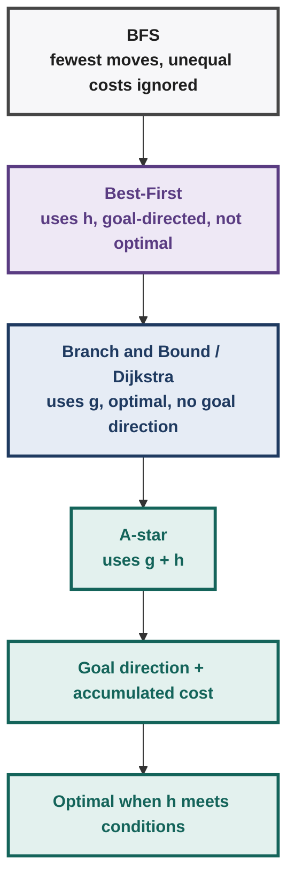
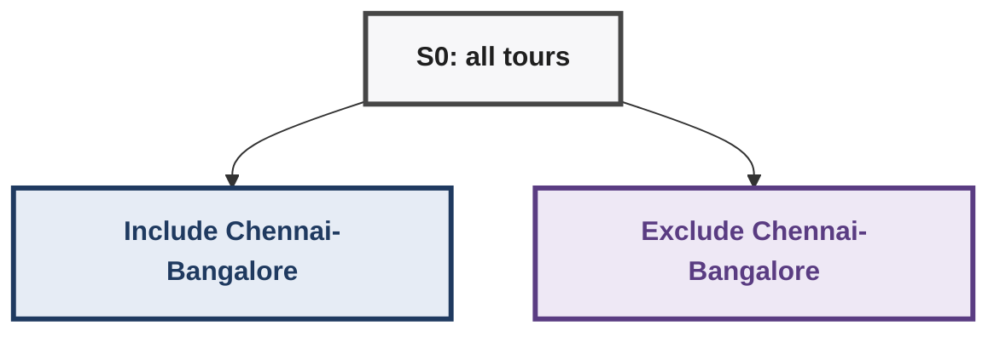
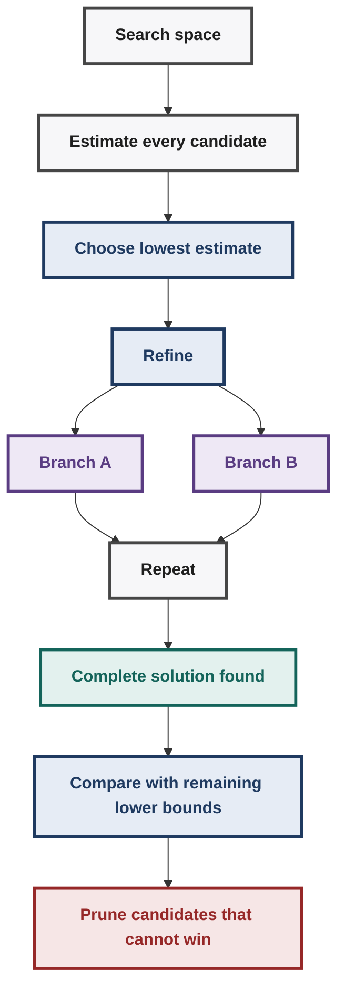
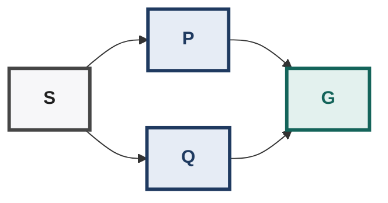
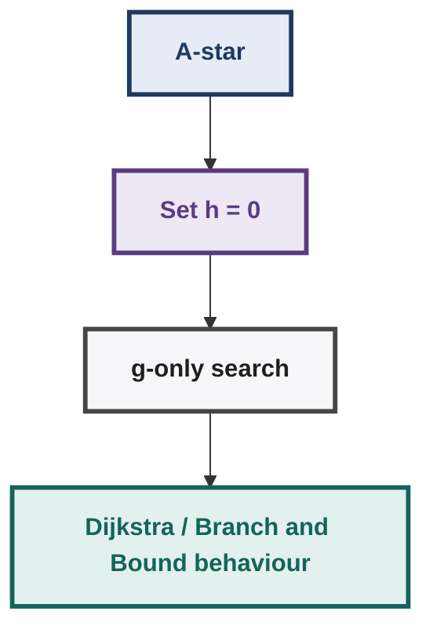
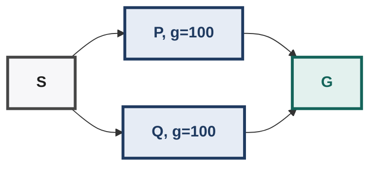
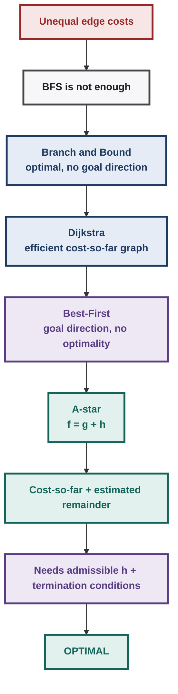
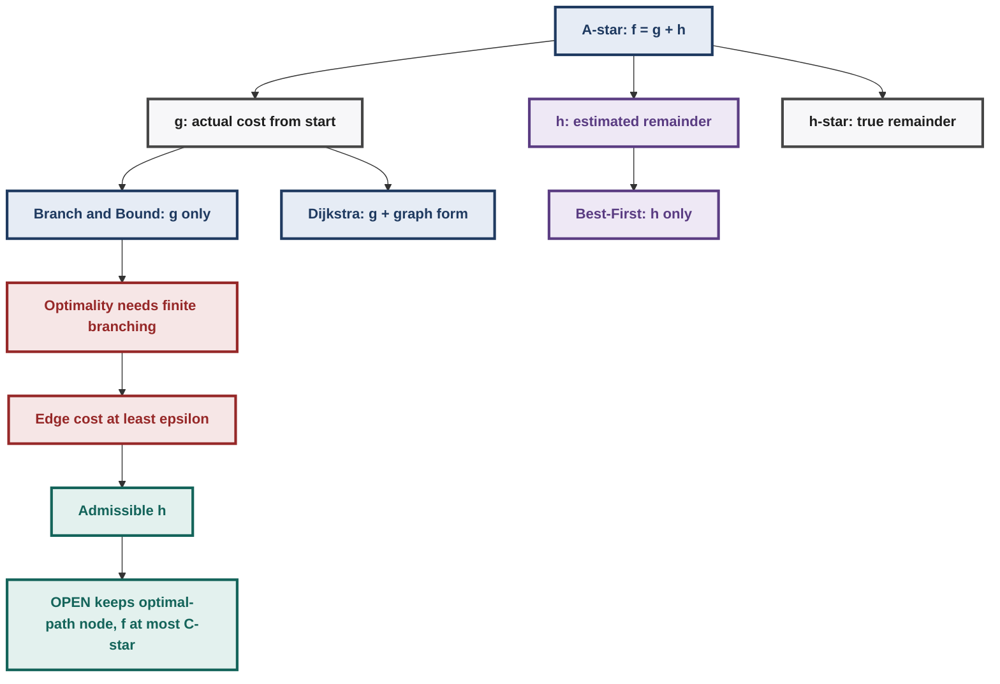

# AI: Search Methods for Problem Solving --- Week 5

## A\* Search, Optimal Paths, Branch & Bound, Admissibility

> **Scope:** Week 5 lecture sequence --- *Finding Optimal TSP Tours →
> Shortest Path with Branch & Bound → Algorithm A* → A\* in Action →
> Admissibility of A\* → Proof of Admissibility\*.
>
> This document is a compact continuation of Weeks 1-4. Earlier
> definitions such as `State`, `MoveGen`, `GoalTest`, `OPEN`, `CLOSED`,
> `g(n)`, and heuristic search are used without re-teaching the full
> Week 1--4 material.

------------------------------------------------------------------------

## 1. Week 5: The Core Problem

Earlier:

-   **BFS** gives the solution with the fewest moves when every move has
    equal cost.
-   **Best-First Search** uses `h(n)` to move toward the goal quickly,
    but can sacrifice optimality.
-   **Branch & Bound / Uniform-Cost style search** uses the cost already
    incurred and guarantees optimality under the usual non-negative-cost
    assumptions, but has no directional knowledge of the goal.

Week 5 asks:

> **Can we get the optimality of Branch & Bound/Dijkstra and the
> goal-directed behaviour of Best-First Search at the same time?**

The answer is **A\***.

The progression is:



------------------------------------------------------------------------

## 2. Finding Optimal TSP Tours with Branch & Bound

## 2.1 Why BFS Is Not Enough

If edge costs are unequal, the path with fewer edges need not be
cheaper.

Example:

| Route | Moves | Cost per move | Total |
|---|---|---|---|
| Route A | 4 | ₹10 | ₹40 |
| Route B | 2 | ₹30 | ₹60 |

BFS prefers Route B because it has fewer moves, but Route A is cheaper.

So the objective becomes:

\[ \boxed{\text{minimize total edge cost}} \]

rather than:

\[ \boxed{\text{minimize number of moves}} \]

------------------------------------------------------------------------

## 2.2 Brute Force / British Museum Procedure

The conceptually simplest optimal algorithm is:

1.  Explore the entire search space.
2.  Evaluate every complete solution.
3.  Return the cheapest one.

This is guaranteed to find the optimum, but is computationally
impractical.

The Week 5 objective is therefore:

> **Search as little of the space as possible while still guaranteeing
> the optimal solution.**

------------------------------------------------------------------------

## 3. Branch & Bound in a Refinement Space

Branch & Bound can operate in two related spaces:

### State-space search

A partial sequence of moves is extended.

- State-space path shape: `S → A → B → ...`.

### Solution/refinement-space search

A node represents a **set of possible solutions**, and each refinement
partitions that set into smaller sets.

For TSP:

- All possible tours branch into:
  - include edge (A, B);
  - exclude edge (A, B).

Each child represents a smaller set of candidate tours.

The algorithm repeatedly:

1.  Estimates the cost of each candidate set.
2.  Chooses the candidate with the **smallest estimated cost**.
3.  Refines it.
4.  Continues until a complete solution is found that cannot be beaten
    by any remaining candidate.

------------------------------------------------------------------------

## 3.1 The Critical Requirement: Lower Bound

Suppose a partial candidate has estimated cost:

\[ LB = 500 \]

If the estimate is a **lower bound**, then its true completed cost
satisfies:

\[ \text{true cost} \ge 500 \]

Therefore, if we already have a complete solution costing `480`, the
partial candidate can safely be discarded:

- Partial candidate: lower bound 500, so true cost is at least 500.
- Current complete solution: cost 480.
- The partial candidate cannot beat 480, so prune it.

### Key rule

\[
\boxed{LB(\text{candidate}) \le \text{true cost of every solution in that candidate set}}
\]

The estimate must **never overestimate**.

------------------------------------------------------------------------

## 3.2 Why Higher Lower Bounds Are Better

Two valid lower bounds might be:

| Candidate | Lower bound |
|---|---|
| Candidate A | 300 |
| Candidate B | 450 |

If the current best complete solution costs `400`:

-   `300 < 400` → Candidate A still needs consideration.
-   `450 > 400` → Candidate B can be pruned immediately.

Therefore:

> **Among valid lower bounds, a tighter/higher lower bound gives better
> pruning.**

There is a trade-off:

- More computation to obtain a tighter bound leads to:
  - fewer search nodes.

------------------------------------------------------------------------

## 4. TSP Lower Bound Used in the Lecture

The lecture uses five cities:

- Five lecture cities: Chennai, Goa, Mumbai, Delhi, and Bangalore.

For a TSP tour, every city has exactly **two incident tour edges**:

- Each city in a TSP tour has:
  - one incoming edge;
  - one outgoing edge (two incident tour edges in total).

Therefore, for each city, take its two smallest positive incident edge
costs.

Then:

\[ `\boxed{
LB =
\frac{
\sum_{\text{cities}}
(\text{two smallest incident edges})
}{2}
}` \]

Why divide by 2?

Because every actual tour edge is counted once from each of its two
endpoints.

------------------------------------------------------------------------

## 4.1 Hand-Solved Lower-Bound Example

From the lecture's five-city example, the initial lower-bound
calculation gives:

\[ \boxed{LB = 4335} \]

The logic is:

- For each city, choose the two cheapest possible incident edges.
- Add all 10 selected edge contributions:
  - each real tour edge is represented twice;
  - divide by 2;
  - LB = 4335.

The important point is **not** that `4335` is itself a feasible tour.

It is a lower bound:

\[ \boxed{\text{Every feasible TSP tour costs at least }4335} \]

The estimate is deliberately optimistic. It may use combinations of
edges that cannot all coexist in one valid Hamiltonian cycle.

------------------------------------------------------------------------

## 5. Making the TSP Lower Bound Tighter

The simple `4335` bound can be loose because it may effectively give a
city more than two useful connections or create a premature subtour.

The lecture introduces two important refinements.

## 5.1 Every City Has Exactly Two Tour Edges

A city cannot have three tour edges.

Therefore, once two edges incident to a city are fixed as included:

- City `X` connects to `A` and `B` in the illustrated partial choice.

a third edge incident to `X` must be excluded.

This raises the lower bound by forcing the estimate to use the next-best
feasible edge.

------------------------------------------------------------------------

## 5.2 Avoid Premature Subtours

A TSP solution must be **one cycle containing every city**.

This is invalid:

- Invalid subtours:
  - `A → B → C → A`;
  - `D → E → D`.
- Together they form two disconnected cycles, not one valid TSP tour.

because the cities form two disconnected cycles.

Therefore, while refining a TSP candidate:

> Do not accept an edge combination that completes a smaller cycle
> before all cities are connected into the final tour.

------------------------------------------------------------------------

## 6. Lecture TSP Refinement Trace

The lecture starts with:

| Candidate | Bound |
|---|---|
| S0 (all possible tours) | 4335 |

A useful refinement is to branch on the cheap `Chennai–Bangalore`
segment:



The lecture obtains:

| Branch | Lower bound |
|---|---|
| Include Chennai–Bangalore | 4575 |
| Exclude Chennai–Bangalore | 5220 |

The smaller candidate is therefore:

\[ 4575 \]

Refining the `include C–B` branch with the `Bangalore–Goa` decision
gives approximately:

| Branch | Lower bound |
|---|---|
| Include Chennai–Bangalore, include Bangalore–Goa | 4575 |
| Include Chennai–Bangalore, exclude Bangalore–Goa | 4770 |
| Exclude Chennai–Bangalore | 5220 |

So the next candidate is:

\[ 4575 \]

The refinement process continues by repeatedly choosing the candidate
with the smallest lower bound.

Eventually, complete tours appear. The lecture shows complete-tour costs
including:

| Complete tour | Cost |
|---|---|
| Tour 1 | 5250 |
| Tour 2 | 5830 |
| Tour 3 | 5724 |

The complete tour of cost:

\[ \boxed{5250} \]

becomes the incumbent best solution.

At that point, any remaining partial candidate with:

\[ LB > 5250 \]

can be pruned.

The lecture's final search space therefore terminates with the optimal
tour at:

\[ \boxed{5250} \]

The corresponding tour is:

- Final optimal tour: Chennai → Bangalore → Goa → Delhi → Mumbai → Chennai.

### Important interpretation of a "not edge" label

If a refinement says:

``` text
¬(Mumbai, Goa)
```

it means:

> The edge Mumbai--Goa is **not included** in the tour.

It does **not** itself tell you which edges are in the final tour.

Only a fully refined node tells you the complete set of included edges.

------------------------------------------------------------------------

## 7. Branch & Bound: General Pattern



### Exam rule

A complete solution of cost `C` proves optimality only when every
remaining incomplete candidate has:

\[ LB \ge C \]

or, depending on the problem's tie convention, no remaining candidate
can produce a strictly cheaper solution.

------------------------------------------------------------------------

## 8. Shortest Path with Branch & Bound

Now the search space is a normal state-space graph with weighted edges.

Branch & Bound keeps **partial paths**.

For each partial path:

\[
\boxed{\text{estimate} = \text{actual cost accumulated so far}}
\]

No look-ahead heuristic is used.

Thus:

\[ \boxed{f(n)=g(n)} \]

for this version of Branch & Bound.

The algorithm always extends the cheapest partial path.

------------------------------------------------------------------------

## 8.1 Lecture Example

The lecture's graph has:

| Edge | Cost |
|---|---|
| S to A | 6 |
| S to B | 3 |
| S to C | 8 |
| B to A | 2 |
| B to D | 4 |
| C to G | 8 |
| Further lecture edges | see lecture diagram |

The exact graph contains additional edges shown in the lecture diagram.

Start:

``` text
OPEN = { S(0) }
```

Expand `S`:

``` text
A : 6
B : 3
C : 8
```

Choose the cheapest:

\[ B(3) \]

Expand `B`.

A better path to `A` appears:

| Path | Cost |
|---|---|
| `S → A` | 6 |
| `S → B → A` | 3 + 2 = 5 |

Therefore:

\[ g(A)=5 \]

rather than `6`.

This illustrates the central idea:

> Keep extending the currently cheapest partial path and replace a more
> expensive route when a cheaper route is discovered.

Eventually the lecture obtains:

\[
\boxed{S\rightarrow B\rightarrow D\rightarrow G,\quad cost=13}
\]

------------------------------------------------------------------------

## 9. Branch & Bound vs Dijkstra

The lecture then moves from the explicit search-tree view to Dijkstra's
more efficient graph representation.

## Branch & Bound

May maintain many different paths reaching the same state:

- Branch and Bound may retain redundant paths to the same state:
  - `S → A`;
  - `S → B → A`;
  - `S → B → A → B → A`;
  - and so on.

This can create enormous redundancy.

## Dijkstra

Maintains one best-known cost and one parent for each state.

``` text
A:
    g(A) = 5
    parent(A) = B
```

If a better route is found, replace the old parent.

This is called **relaxation**.

------------------------------------------------------------------------

## 9.1 Dijkstra's Core Mechanics

Initialize:

``` text
g(S) = 0
g(other nodes) = ∞
```

Repeatedly:

1.  Pick the unprocessed node with minimum `g`.
2.  Mark it processed.
3.  For every neighbor `M`, test:

\[ g(N)+c(N,M)<g(M) \]

4.  If true:

\[ g(M)\leftarrow g(N)+c(N,M) \]

and:

\[ parent(M)\leftarrow N \]

This gives shortest paths for non-negative edge costs.

------------------------------------------------------------------------

## 9.2 Why Dijkstra Has No Direction

Dijkstra asks:

> "Which node is cheapest to reach from the start?"

It does **not** ask:

> "Which node looks closer to my particular goal?"

So it can explore large regions that are irrelevant to the goal.

This motivates A\*.

------------------------------------------------------------------------

## 10. A\*: Combining Cost-So-Far and Goal Estimate

A\* combines:

-   Dijkstra / Branch & Bound's accumulated cost
-   Best-First Search's heuristic direction

For every node:

\[ \boxed{f(n)=g(n)+h(n)} \]

where:

### `g(n)`

Actual cost of the best path found so far from start to `n`.

### `h(n)`

Estimated remaining cost from `n` to a goal.

### `f(n)`

Estimated total cost of a solution going through `n`.


- Cost from START to `n` is `g(n)`.
- Estimated cost from `n` to GOAL is `h(n)`.
- Total estimate is `f(n) = g(n) + h(n)`.

A\* chooses the node with minimum `f(n)`.

------------------------------------------------------------------------

## 11. Why A\* Is Better Directed

Compare:

| Method | Priority |
|---|---|
| Branch and Bound / Dijkstra | `g(n)` |
| Best-First | `h(n)` |
| A\* | `g(n) + h(n)` |

Interpretation:

- `g(n)`: how much have I already spent?
- `h(n)`: how far do I think I still have to go?
- `f(n)`: what do I currently think the whole route will cost?

A\* therefore looks:

-   **backward** using `g`
-   **forward** using `h`

------------------------------------------------------------------------

## 12. A\* Data Structures

As in Dijkstra:

-   keep one best-known copy of a state;
-   maintain a parent pointer;
-   update the parent if a cheaper path is discovered.

OPEN is effectively a priority queue ordered by:

\[ f(n)=g(n)+h(n) \]

CLOSED stores expanded nodes.

------------------------------------------------------------------------

## 13. A\* Algorithm

``` text
A*(S):

g(v) ← ∞ for every node v
g(S) ← 0

parent(S) ← null
f(S) ← g(S) + h(S)

OPEN ← {S}
CLOSED ← ∅

while OPEN is not empty:

    N ← node in OPEN with minimum f(N)

    remove N from OPEN
    add N to CLOSED

    if GoalTest(N):
        return ReconstructPath(N)

    for each neighbor M of N:

        if g(N) + cost(N,M) < g(M):

            parent(M) ← N
            g(M) ← g(N) + cost(N,M)
            f(M) ← g(M) + h(M)

            if M is new:
                add M to OPEN

            else if M is already in OPEN:
                update its priority

            else if M is in CLOSED:
                PropagateImprovement(M)

return FAILURE
```

------------------------------------------------------------------------

## 14. The Three Cases in A\*

When A\* generates a neighbor `M`, three cases can occur.

## Case 1 --- New node

`M` is neither in OPEN nor CLOSED.

``` text
compute g(M)
compute f(M)
set parent(M)
insert M into OPEN
```

------------------------------------------------------------------------

## Case 2 --- Node already in OPEN

A different path reaches `M`.

If:

\[ g\_{\text{new}}(M)<g\_{\text{old}}(M) \]

then update:

``` text
parent(M)
g(M)
f(M)
```

The node remains in OPEN.

------------------------------------------------------------------------

## Case 3 --- Node already in CLOSED

This is the subtle A\* case.

A\* can discover a cheaper path to a node that has already been
expanded.

Therefore:

- A better path to `M` is found.
- `M` is already CLOSED.
- Update `g(M)`, `parent(M)`, and `f(M)`.
- Propagate the improvement to descendants.

This possibility exists because `h(n)` is an estimate.

Dijkstra does not need this case under its standard non-negative-edge
assumptions because when Dijkstra permanently processes a node, its
shortest-path cost is already established.

------------------------------------------------------------------------

## 15. Propagate-Improvement

Suppose `M` is in CLOSED and we find:

\[ g\_{\text{new}}(M)<g\_{\text{old}}(M) \]

For each child `X`:

\[ g\_{\text{candidate}}(X) = g(M)+c(M,X) \]

If:

\[ g\_{\text{candidate}}(X)<g(X) \]

then:

``` text
parent(X) ← M
g(X) ← g(M)+c(M,X)
f(X) ← g(X)+h(X)
```

If `X` is also in CLOSED, recursively propagate again.

### Why?

`M` already had descendants whose values were based on the old, more
expensive path to `M`.

Improving `M` may therefore improve the best paths to all descendants.

------------------------------------------------------------------------

## 16. Hand-Solved A\* Example

Consider:



Edge costs: S to P is 1, P to G is 4, S to Q is 1, Q to G is 1.

True path costs:

| Path | Cost |
|---|---|
| `S → P → G` | 1 + 4 = 5 |
| `S → Q → G` | 1 + 1 = 2 |

So the optimal solution is:

\[ \boxed{S\rightarrow Q\rightarrow G,\quad cost=2} \]

Use:

\[
h(S)=2,\quad h(P)=0.5,\quad h(Q)=1,\quad h(G)=0
\]

These are admissible because:

``` text
h(P)=0.5 ≤ true remaining cost 4
h(Q)=1   = true remaining cost 1
h(S)=2   = true optimal remaining cost 2
```

### Step 1

At `S`:

\[ g(S)=0,\quad h(S)=2 \]

\[ f(S)=0+2=2 \]

Expand `S`.

``` text
P:
g=1
h=0.5
f=1.5

Q:
g=1
h=1
f=2
```

OPEN:

``` text
P(1.5), Q(2)
```

Pick `P`.

### Step 2

Expand `P`.

Generate `G`:

\[ g(G)=1+4=5 \]

\[ f(G)=5+0=5 \]

OPEN:

``` text
Q(2), G(5)
```

Pick `Q`.

### Step 3

Expand `Q`.

Generate another route to `G`:

\[ g(G)=1+1=2 \]

This is better than the previous `5`.

Update:

``` text
G:
g=2
f=2
parent(G)=Q
```

OPEN:

``` text
G(2)
```

### Step 4

Pop `G`.

It is the goal.

Therefore:

\[ \boxed{S\rightarrow Q\rightarrow G} \]

with cost:

\[ \boxed{2} \]

### What this example teaches

A\* may initially explore a misleading branch, but it keeps the
accumulated `g` cost honest.

- `P` looked attractive because `f(P) = 1.5`.
- `P` produced an expensive `G` of cost 5.
- `Q` produced a cheaper `G` of cost 2.
- A\* updated the existing goal entry.

------------------------------------------------------------------------

## 17. A\* in Action: Grid Example

The lecture uses a grid problem:

| Role | Node |
|---|---|
| Start | I |
| Goal | W |

Edges have non-uniform traversal costs.

Two heuristics are discussed:

### Euclidean distance

Straight-line distance:

\[ h_E(n)=\sqrt{(x_n-x_G)^2+(y_n-y_G)^2} \]

### Manhattan distance

For a grid:

\[ h_M(n)=\|x_n-x_G\|+\|y_n-y_G\| \]

When each grid spacing is 10 units, the distance becomes:

\[ h_M(n)=10\left(\|x_n-x_G\|+\|y_n-y_G\|\right) \]

The lecturer recommends Manhattan distance in an exam when the movement
rules make it valid because it avoids square-root calculations.

------------------------------------------------------------------------

## 17.1 Best-First on the Same Grid

Best-First chooses:

\[ \boxed{\min h(n)} \]

It only asks:

> "Which node appears closest to the goal?"

In the lecture's example:

-   Best-First inspected **8 nodes**.
-   It found a path of cost:

\[ \boxed{195} \]

The path was locally attractive according to `h`, but not cheapest
globally.

------------------------------------------------------------------------

## 17.2 A\* on the Same Grid

A\* uses:

\[ f(n)=g(n)+h(n) \]

The lecture starts with:

\[ g(I)=0,\quad h(I)=100 \]

so:

\[ f(I)=100 \]

After expanding `I`, a child has:

\[ g=21,\quad h=80 \]

therefore:

\[ f=21+80=101 \]

A\* chooses the smallest **f**, not the smallest `h`.

Later, another node has:

\[ g=12,\quad h=90 \]

so:

\[ f=12+90=102 \]

Even if another node has a smaller raw heuristic, A\* can prefer the
node with the lower total estimated cost.

------------------------------------------------------------------------

## 17.3 A\* Correctly Re-evaluates Paths

The lecture shows a node with an existing value of `104` being reached
by another route.

A\* compares the two routes and keeps the cheaper `g`.

This is essential:

> **A\* does not permanently associate a state with its first discovered
> path.**

It retains the best path found so far.

The lecture's run eventually finds a path of cost:

\[ \boxed{148} \]

while Best-First had found a cost of:

\[ \boxed{195} \]

A\* inspected **14 nodes**, more than Best-First's 8, but obtained the
lower-cost solution.

The lecturer notes that Dijkstra on the same graph would find the same
optimal path.

------------------------------------------------------------------------

## 18. Why A\* Is Not Automatically Optimal

At this point the key question is:

> Does A\* always find the optimal path merely because it uses `g+h`?

**No.**

The answer depends on the heuristic.

Suppose:

\[ h\^\*(n) \]

is the true optimal cost from `n` to a goal.

The algorithm only knows an estimate:

\[ h(n) \]

The critical condition is:

\[ \boxed{h(n)\le h^*(n)} \]

for every node.

This means:

> **The heuristic must never overestimate the remaining cost.**

Such a heuristic is called **admissible**.

------------------------------------------------------------------------

## 19. Admissible Heuristic

## Definition

A heuristic `h` is admissible if:

\[ \boxed{\forall n,\quad h(n)\le h^*(n)} \]

where:

-   `h(n)` = estimated remaining cost
-   `h*(n)` = true optimal remaining cost

Therefore:

| Case | Status |
|---|---|
| `h(n) < h*(n)` (underestimate) | Allowed |
| `h(n) = h*(n)` (exact) | Allowed |
| `h(n) > h*(n)` (overestimate) | Not admissible |

### Important distinction

**Admissible does not mean accurate.**

A heuristic can be extremely weak and still admissible.

For example:

\[ h(n)=0 \]

is always admissible because:

\[ 0\le h\^\*(n) \]

But it gives A\* no directional information.

------------------------------------------------------------------------

## 20. Special Case: h(n) = 0

If:

\[ h(n)=0 \]

then:

\[ f(n)=g(n)+0=g(n) \]

Therefore A\* becomes:

\[ \boxed{\text{Uniform-Cost / Dijkstra-style search}} \]

This explains the relationship:



For unit-cost edges, this further reduces to BFS behaviour.

------------------------------------------------------------------------

## 21. Why Overestimation Can Break Optimality

The lecture constructs a simple example.

Two nodes are available:



Both have:

\[ g(P)=g(Q)=100 \]

True remaining costs:

\[ h\^\*(P)=30 \]

\[ h\^\*(Q)=40 \]

Therefore:

| Path | True cost |
|---|---|
| Via P | 100 + 30 = 130 (optimal) |
| Via Q | 100 + 40 = 140 |

------------------------------------------------------------------------

## 21.1 Overestimating Heuristic

Suppose:

\[ h(P)=60 \]

\[ h(Q)=50 \]

Both values overestimate:

| Node | Heuristic | True remainder | Status |
|---|---|---|---|
| P | 60 | 30 | Overestimates |
| Q | 50 | 40 | Overestimates |

A\* computes:

\[ f(P)=100+60=160 \]

\[ f(Q)=100+50=150 \]

So it chooses `Q`.

Expanding `Q` produces:

\[ g(G)=100+40=140 \]

and:

\[ f(G)=140 \]

Now compare:

| Entry | f-value |
|---|---|
| G | 140 |
| P | 160 |

A\* pops `G` and returns cost `140`.

But the real optimum is:

\[ 130 \]

Therefore:

\[ \boxed{\text{overestimation can cause suboptimality}} \]

------------------------------------------------------------------------

## 22. Underestimating Heuristic

Now choose:

\[ h(P)=20 \]

\[ h(Q)=15 \]

Again the heuristic incorrectly thinks `Q` looks closer:

\[ f(P)=100+20=120 \]

\[ f(Q)=100+15=115 \]

So A\* still expands `Q`.

It discovers:

\[ g(G)=140 \]

But now:

| Entry | f-value |
|---|---|
| G | 140 |
| P | 120 |

A\* does **not** terminate at `G`.

It expands `P`.

Then:

\[ g(G)=100+30=130 \]

Now:

\[ 130<140 \]

and the better route replaces the worse route.

Therefore A\* eventually returns:

\[ \boxed{130} \]

which is optimal.

### The crucial idea

An underestimate may make the search explore extra nodes.

An overestimate can make the algorithm **discard the true optimum too
early**.

------------------------------------------------------------------------

## 23. Conditions for A\* Admissibility

The lecture establishes three conditions.

## Condition 1 --- Finite branching factor

Each node must have finitely many successors.

\[ \boxed{b<\infty} \]

Otherwise the algorithm may not be able to enumerate all successors.

------------------------------------------------------------------------

## Condition 2 --- Every edge has a positive lower bound

There must exist:

\[ \boxed{\epsilon>0} \]

such that every edge cost satisfies:

\[ \boxed{c(e)\ge\epsilon} \]

It is not enough merely to say:

\[ c(e)>0 \]

for every edge.

------------------------------------------------------------------------

## Why "positive" alone is insufficient

Consider an infinite path with costs:

\[ 1,\frac12,\frac14,\frac18,\ldots \]

Every edge is positive.

But:

\[ 1+\frac12+\frac14+\frac18+\cdots=2 \]

So an infinite path can have finite total cost.

A search algorithm could keep extending this infinite path without its
accumulated cost exceeding the finite optimal solution cost.

The fixed lower bound `ε` prevents this.

------------------------------------------------------------------------

## Condition 3 --- Admissible heuristic

\[ \boxed{h(n)\le h^*(n)\quad\forall n} \]

The heuristic never overestimates.

------------------------------------------------------------------------

## 24. Summary of A\* Admissibility Conditions

Admissibility needs all three of the following:

- Finite branching factor.
- Every edge cost satisfies `c(e) >= epsilon > 0`.
- Admissible heuristic: `h(n) <= h*(n)` for every node.

Under these conditions, A\*:

-   finds a solution if one exists;
-   terminates on finite graphs;
-   can find a solution even on an infinite graph satisfying the
    required conditions;
-   returns an optimal solution.


------------------------------------------------------------------------

## 25. Proof of A\* Admissibility

The proof is easier to remember as a chain of lemmas.

------------------------------------------------------------------------

## Lemma 1 --- Termination on Finite Graphs

Every iteration of A\*:

- Each iteration takes one node from OPEN.
- It puts that node into CLOSED.

A\* maintains only one copy of each state in OPEN.

If the graph contains finitely many states, only finitely many such
moves can occur.

Therefore:

\[ \boxed{\text{A* terminates on a finite graph}} \]

If a goal exists, it eventually reports a path; otherwise it exhausts
the reachable component and reports failure.

------------------------------------------------------------------------

## 26. Lemma 2 --- OPEN Always Contains an Optimal-Path Node

Suppose the optimal path is:

- Optimal path shape: `S → n1 → n2 → ... → G`.

Initially:

``` text
OPEN = {S}
```

When `S` is expanded, `n₁` is generated.

When `n₁` is expanded, `n₂` is generated.

And so on.

Therefore, before the algorithm terminates, some node:

\[ n' \]

on the optimal path must remain in OPEN.

So:

\[
\boxed{\exists n'\in OPEN\text{ such that }n'\text{ lies on an optimal path}}
\]

------------------------------------------------------------------------

## 27. Lemma 2 (continued) --- The f-value of That Node

Define:

\[ g\^\*(n)=\text{true optimal cost from S to }n \]

\[ h\^\*(n)=\text{true optimal cost from }n\text{ to G}
\]

\[ f^*(n)=g\^*(n)+h^\*(n) \]

For the optimal-path node `n'`:

\[ g(n')=g\^\*(n') \]

because it lies on an optimal path.

A\* computes:

\[ f(n')=g(n')+h(n') \]

Therefore:

\[ f(n') = g\^\*(n')+h(n') \]

Since `h` is admissible:

\[ h(n')\le h\^\*(n') \]

so:

\[ f(n') \le g\^*(n')+h\^*(n') \]

But:

\[ g^*(n')+h\^*(n')=C^\* \]

where `C*` is the optimal start-to-goal cost.

Hence:

\[ \boxed{f(n')\le C^*} \]

### Core consequence

At all times before termination:

\[ \boxed{\exists n'\in OPEN:\ f(n')\le C^*} \]

This is the central fact used by the optimality proof.

------------------------------------------------------------------------

## 28. Lemma 3 --- A\* Finds a Solution on an Infinite Graph

Suppose a solution exists and its optimal cost is:

\[ C\^\* \]

Every edge costs at least:

\[ \epsilon>0 \]

Therefore a path of total cost less than `C*` can contain only finitely
many edges.

If a path had arbitrarily many edges, its cost would eventually exceed
`C*` because every extension adds at least `ε`.

With finite branching, there are only finitely many partial paths with
cost below `C*`.

Therefore A\* cannot explore infinitely many cheaper partial paths
forever.

Eventually it must reach a goal.

Thus, under:

- Finite branching, plus:
- edge cost at least ε > 0, plus:
- a solution exists.

A\* finds a solution even if the graph itself is infinite.

------------------------------------------------------------------------

## 29. Lemma 4 --- A\* Returns the Optimal Solution

This is the main proof.

Assume, for contradiction, that A\* terminates by selecting a goal `G'`
with:

\[ g(G')>C\^\* \]

Because `G'` is a goal:

\[ h(G')=0 \]

therefore:

\[ f(G')=g(G')>C\^\* \]

But Lemma 2 says that an optimal-path node `n'` is still in OPEN with:

\[ f(n')\le C\^\* \]

Hence:

\[ f(n')<f(G') \]

But A\* always selects the node with the **smallest f-value**.

Therefore A\* should have selected `n'`, not `G'`.

Contradiction.

Therefore the assumption was false.

Hence:

\[ \boxed{g(G')=C^*} \]

and A\* returns an optimal path.

------------------------------------------------------------------------

## 30. One-Line Optimality Proof to Memorize

If A\* is about to pop a suboptimal goal:

- Suboptimal goal has `f(G') > C*`.
- But OPEN still contains an optimal-path node `n'` with `f(n') <= C*`.
- A\* must choose minimum `f`.
- Therefore `G'` cannot be chosen first: contradiction.
- The returned goal is optimal.

------------------------------------------------------------------------

## 31. Lemma 5 --- Every Expanded Node Has f ≤ C\*

The result is stronger than just saying optimal-path nodes have small
`f`.

Suppose A\* expands some node `n`.

It chose `n` because its `f` was no larger than the `f` of the
optimal-path node `n'`.

From Lemma 2:

\[ f(n')\le C\^\* \]

Therefore:

\[ f(n)\le f(n')\le C\^\* \]

Hence:

\[ \boxed{\text{Every node expanded by A* has }f(n)\le C^*} \]

This result is useful in the next theorem.

------------------------------------------------------------------------

## 32. More Informed Heuristics Search Less

Suppose two heuristics are both admissible:

\[ h_1(n)\le h_2(n)\le h\^\*(n) \]

Then `h₂` is **more informed** than `h₁`.

Graphically:

- Informativeness scale: `0` (weak) → `h1(n)` → `h2(n)` (tighter) → `h*(n)` (true cost).

Both are still safe because neither exceeds `h*`.

For A\*:

\[ f_1(n)=g(n)+h_1(n) \]

\[ f_2(n)=g(n)+h_2(n) \]

and therefore:

\[ f_1(n)\le f_2(n) \]

The tighter heuristic gives larger, but still safe, estimates.

------------------------------------------------------------------------

## 32.1 Intuition

Suppose the true remaining cost is:

\[ h\^\*=100 \]

Compare:

| Heuristic | Value | Admissible? |
|---|---|---|
| h1 | 20 | Yes (below 100) |
| h2 | 80 | Yes (below 100) |
| h* | 100 | True cost |

Both are admissible.

But `h₂` gives much more useful information.

- Weak heuristic: remaining cost is at least 20.
- Stronger heuristic: remaining cost is at least 80.
- The tighter estimate lets A\* reject more hopeless candidates.

The second estimate lets A\* reject more hopeless candidates.

------------------------------------------------------------------------

## 33. Formal Result: More Informed A\* Does Not Expand More

Let:

\[ h_2(n)\ge h_1(n) \]

for every node, and both heuristics be admissible.

Then:

\[ \boxed{
\text{Nodes expanded by A* with }h_2
\subseteq
\text{Nodes expanded by A* with }h_1
} \]

Therefore:

\[
\boxed{\text{A more informed admissible heuristic never increases the necessary search}}
\]

The lecture proves this using induction.

------------------------------------------------------------------------

## 33.1 Induction Structure

### Base case

Both algorithms begin with `S`.

So if one expands `S`, the other does too.

### Induction hypothesis

Assume every node up to depth `k` expanded by A\* with `h₂` is also
expanded by A\* with `h₁`.

### Induction step

Assume a node `L` at depth `k+1` is expanded by A\* using `h₂` but not
by A\* using `h₁`.

Because `h₂` is admissible and `L` is expanded:

\[ f_2(L)\le C\^\* \]

So:

\[ g_2(L)+h_2(L)\le C\^\* \]

giving:

\[ h_2(L)\le C\^\*-g_2(L) \]

Because the parent of `L` is at depth `k`, the induction hypothesis
means A\* with `h₁` has seen at least the paths that A\* with `h₂` saw.

Thus:

\[ g_1(L)\le g_2(L) \]

If A\* with `h₁` terminated without expanding `L`, then:

\[ f_1(L)\ge C\^\* \]

so:

\[ g_1(L)+h_1(L)\ge C\^\* \]

Combining the inequalities leads to:

\[ h_2(L)\le h_1(L) \]

which contradicts:

\[ h_2(L)\ge h_1(L) \]

under the strict "more informed" assumption.

Therefore the assumed node cannot exist.

------------------------------------------------------------------------

## 34. The Big Picture of Week 5



------------------------------------------------------------------------

## 35. Algorithm Comparison

| Algorithm | Priority | Uses goal estimate? | Generally optimal? | Main idea |
|---|---|---|---|---|
| BFS | depth / insertion order | No | Yes for unit costs | Fewest moves |
| Best-First | `h(n)` | Yes | No | Looks closest to goal |
| Branch and Bound | `g(n)` | No | Yes under non-negative-cost assumptions | Cheapest path-so-far |
| Dijkstra | `g(n)` | No | Yes for non-negative edges | Shortest paths |
| A\* | `g(n)+h(n)` | Yes | Yes with admissible heuristic + required conditions | Cheapest estimated complete path |

------------------------------------------------------------------------

## 36. The Most Important Relationships

## A\* and Dijkstra

\[ \boxed{h(n)=0\Rightarrow A^*=Dijkstra/UCS} \]

------------------------------------------------------------------------

## A\* and Best-First

\[
\boxed{g(n)\text{ matters in A*, but not in Greedy Best-First}}
\]

Best-First:

\[ f(n)=h(n) \]

A\*:

\[ f(n)=g(n)+h(n) \]

------------------------------------------------------------------------

## A\* and Branch & Bound

Branch & Bound:

\[ f(n)=g(n) \]

A\*:

\[ f(n)=g(n)+h(n) \]

Therefore A\* adds goal-directed information to an optimal-cost search.

------------------------------------------------------------------------

## 37. Exam Traps

## Trap 1 --- "A\* always gives an optimal answer."

Not unconditionally.

You must check the heuristic and the required search conditions.

------------------------------------------------------------------------

## Trap 2 --- "Admissible means the heuristic is accurate."

No.

It only means:

\[ h(n)\le h\^\*(n) \]

------------------------------------------------------------------------

## Trap 3 --- "Positive edge cost is enough."

The proof requires:

\[ c(e)\ge\epsilon>0 \]

for a fixed positive `ε`.

The sequence:

\[ 1,\frac12,\frac14,\ldots \]

shows why merely requiring every edge to be positive is insufficient.

------------------------------------------------------------------------

## Trap 4 --- Confusing `h(n)` and `h*(n)`

| Symbol | Meaning |
|---|---|
| `h(n)` | Estimated remaining cost |
| `h*(n)` | True optimal remaining cost |

`h*` is generally unknown in practice and is mainly used for analysis.

------------------------------------------------------------------------

## Trap 5 --- Confusing `g(n)` with `g*(n)`

| Symbol | Meaning |
|---|---|
| `g(n)` | Best path cost found so far |
| `g*(n)` | True optimal path cost from S to n |

Always:

\[ \boxed{g^*(n)\le g(n)} \]

because the algorithm's current path may not yet be optimal.

------------------------------------------------------------------------

## Trap 6 --- Goal's f-value

For a goal:

\[ h(G)=0 \]

so:

\[ \boxed{f(G)=g(G)} \]

This is critical in the contradiction proof.

------------------------------------------------------------------------

## Trap 7 --- A\* can improve a CLOSED node

In general A\*:

- A better path to a CLOSED node is found.
- Update `g`.
- Update the parent.
- Propagate the improvement.

Do not automatically apply the Dijkstra rule that a closed node is
permanently optimal.

------------------------------------------------------------------------

## Trap 8 --- Higher heuristic is not automatically better

A larger heuristic is useful only if it remains admissible.

- If `h2` is closer to `h*`:
  - better informed;
  - safe.
- If `h2 > h*`:
  - overestimate;
  - may destroy optimality.

------------------------------------------------------------------------

## Trap 9 --- Lower bound vs exact cost

In Branch & Bound, a partial candidate's bound is usually **not** its
final cost.

It means:

\[ LB\le\text{true completion cost} \]

------------------------------------------------------------------------

## Trap 10 --- TSP subtours

A collection of small cycles is not a valid TSP tour.

Every city must belong to one Hamiltonian cycle.

------------------------------------------------------------------------

## 38. Hand-Solving A\*: Mechanical Procedure

For an exam trace, never "eyeball" the answer.

Use this table:

| Node | `g` | `h` | `f=g+h` | Parent | OPEN/CLOSED |
|---|---|---|---|---|---|
| S | 0 | ... | ... | — | CLOSED after expansion |
| A | ... | ... | ... | ... | OPEN |
| B | ... | ... | ... | ... | OPEN |

At every expansion:

``` text
1. Pick minimum f from OPEN.
2. Goal test.
3. Move it to CLOSED.
4. Generate neighbors.
5. Compute candidate g.
6. If candidate g is better, update parent/g/f.
7. Handle:
      new node
      OPEN node
      CLOSED node
8. Re-sort OPEN by f.
```

### Never skip the OPEN update.

Most trace errors happen because students calculate the correct `f` but
forget to update an existing node's cheaper path.

------------------------------------------------------------------------

## 39. Hand-Solving TSP Branch & Bound

Use:

``` text
1. Write the current candidate set.
2. Compute a valid lower bound.
3. Choose the smallest bound.
4. Branch by include/exclude of an edge.
5. Recompute the bound.
6. Reject impossible subtours.
7. Track the best complete tour found.
8. Prune any candidate whose lower bound cannot beat it.
9. Stop only when the incumbent complete tour dominates every remaining candidate.
```

A useful scratch layout:

| Candidate | Bound | Complete? |
|---|---|---|
| S0 | 4335 | No |
| Chennai–Bangalore included | 4575 | No |
| Chennai–Bangalore excluded | 5220 | No |
| Chennai–Bangalore + Bangalore–Goa included | 4575 | No |
| Tour 1 | 5250 | Yes |
| Tour 2 | 5830 | Yes |
| Tour 3 | 5724 | Yes |

Once:

\[ \text{best complete cost}=5250 \]

any remaining candidate with:

\[ LB>5250 \]

is irrelevant.

------------------------------------------------------------------------

## 40. Proof Skeleton to Memorize

If asked to prove A\* optimality, write this chain.

### Step 1

Define:

\[ f(n)=g(n)+h(n) \]

and assume:

\[ h(n)\le h\^\*(n) \]

### Step 2

An optimal-path node `n'` always remains in OPEN before termination.

### Step 3

Because it is on an optimal path:

\[ g(n')=g\^\*(n') \]

Thus:

\[ f(n') =g^*(n')+h(n')\ \le\ g\^*(n')+h^*(n') =C\^* \]

### Step 4

Assume A\* pops a goal `G'` with:

\[ g(G')>C\^\* \]

Since:

\[ h(G')=0 \]

we have:

\[ f(G')=g(G')>C\^\* \]

### Step 5

But OPEN contains `n'` with:

\[ f(n')\le C\^\* \]

Therefore:

\[ f(n')<f(G') \]

So A\* would select `n'`, not `G'`.

Contradiction.

### Conclusion

\[ \boxed{\text{A* returns an optimal solution}} \]

------------------------------------------------------------------------

## 41. 60-Second Revision



------------------------------------------------------------------------

## 42. Final Mental Model

The easiest way to remember the entire week is:

- "Where have I already spent?" is answered by `g(n)`.
- "How much do I think remains?" is answered by `h(n)`.
- `f(n)` combines both: `f(n) = g(n) + h(n)`.

A\* is essentially trying to answer:

> **"Among all partial paths currently available, which one has the
> smallest estimated total cost?"**

Branch & Bound answers:

> **"Which partial path has cost the least so far?"**

Best-First answers:

> **"Which node appears closest to the goal?"**

A\* combines both:

\[ \boxed{
\text{estimated total cost}
=
\text{cost already paid}
+
\text{estimated cost remaining}
} \]

The entire optimality theory of Week 5 then rests on one central idea:

\[
\boxed{\text{If the remaining-cost estimate never overestimates, A* cannot safely overlook a cheaper optimal path.}}
\]

------------------------------------------------------------------------

## 43. Week 5 Checklist

-   [ ] Explain why unequal edge costs invalidate "fewest hops =
    cheapest".
-   [ ] Explain the British Museum Procedure.
-   [ ] Explain Branch & Bound in a refinement space.
-   [ ] Define a lower-bound estimate.
-   [ ] Explain why higher valid lower bounds improve pruning.
-   [ ] Compute the simple TSP lower bound using two smallest incident
    edges per city.
-   [ ] Explain why the TSP bound is divided by 2.
-   [ ] Detect premature subtours.
-   [ ] Trace TSP include/exclude refinement.
-   [ ] Explain Branch & Bound for shortest path.
-   [ ] Trace the `S → B → A` improvement in the lecture graph.
-   [ ] Explain Dijkstra relaxation and parent pointers.
-   [ ] Explain why Dijkstra has no goal direction.
-   [ ] Define `g(n)`, `h(n)`, and `f(n)`.
-   [ ] Write the A\* algorithm.
-   [ ] Explain the three A\* cases: new / OPEN / CLOSED.
-   [ ] Explain `Propagate-Improvement`.
-   [ ] Hand-trace A\* using an OPEN table.
-   [ ] Explain the grid example and Manhattan heuristic.
-   [ ] Distinguish Best-First from A\*.
-   [ ] Define admissibility.
-   [ ] Explain why overestimation can produce a suboptimal solution.
-   [ ] Prove why underestimation preserves optimality.
-   [ ] Memorize the three A\* admissibility conditions.
-   [ ] Reproduce the optimal-path-node lemma.
-   [ ] Reproduce the contradiction proof for A\* optimality.
-   [ ] Explain why a more informed admissible heuristic searches less.
-   [ ] Distinguish `g`, `g*`, `h`, `h*`, `f`, and `f*`.

------------------------------------------------------------------------

## Source Lecture Sequence

This Week 5 document is based on the course transcript set:

1.  **Finding Optimal TSP Tours**
2.  **Shortest Path with Branch & Bound**
3.  **Algorithm A**
4.  **A in Action**
5.  **Admissibility of A**
6.  **Proof of Admissibility**

Supplementary cross-checking was used only to clarify notation,
algorithm structure, worked examples, and exam traps; the lecture
sequence remains the primary source.
