# AI: Search Methods for Problem Solving — Week 6
## Advanced A* Variants: Weighted A*, Space-Saving A*, Monotone Condition, Sequence Alignment, and OPEN/CLOSED Pruning

> **Primary source:** Professor Deepak Khemani's Week 6 lecture transcripts/PDFs supplied with the course material.
>
> **Lecture files consolidated:** `Weighted A.pdf`, `A Space Saving Versions.pdf`, `Demo - A_, IDA_, RBFS.pdf`, `The Monotone Condition.pdf`, `Sequence Alignment in Biology.pdf`, `Pruning CLOSED in A.pdf`, `Pruning OPEN in A.pdf`.
>
> This document restructures the seven lectures into one coherent set of notes. The lecturer's terminology, examples, numerical values, algorithmic motivation, and sequence of ideas are retained. Obvious speech-to-text noise has been cleaned.
> **Visual cross-check:** Important lecture figures were also inspected, including the Weighted A* path-comparison diagrams (pp. 3–5, 12–19), IDA*/RBFS search-boundary/tree diagrams (pp. 5, 8–13 of `A Space Saving Versions.pdf`), the monotone-condition grid/proof figures (pp. 3–8 of `The Monotone Condition.pdf`), the sequence-alignment grid/scoring figures (pp. 4–10 of `Sequence Alignment in Biology.pdf`), Frontier Search/relay-layer figures (pp. 5–13 of `Pruning CLOSED in A.pdf`), and the upper-bound/beam/Beam-Stack figures (pp. 2–12 of `Pruning OPEN in A.pdf`).

---

## 1. Week 6 at a Glance

Week 5 established **A*** as an optimal-path search method when the heuristic is admissible. Week 6 asks a different question:

> **Can we make A* faster or use much less memory while retaining as much of its useful behavior as possible?**

The lectures follow this progression:

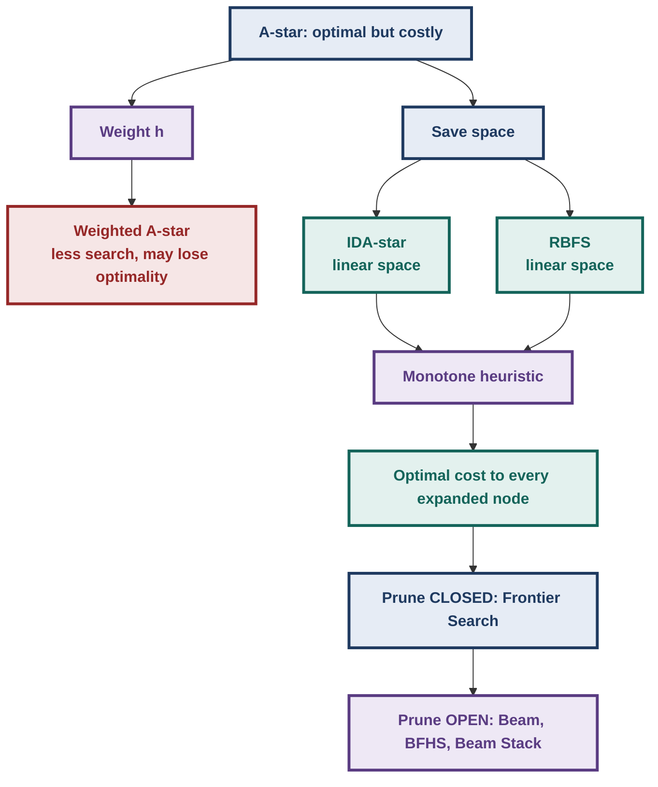

The central theme is a **time/space trade-off**:

- ordinary A*: spends substantial memory to avoid repeated work;
- space-saving variants throw away information and therefore may repeat work;
- pruning methods progressively remove stored information while preserving optimality where the lecture's conditions permit it.

---

## 2. Weighted A*

## 2.1 Why modify A*?

Recall the basic contrast from earlier weeks:

- **Best-First Search:** strongly attracted toward the goal because it uses the heuristic.
- **Branch and Bound:** strongly concerned with the cost already paid from the source.
- **A*:** balances both by using

$$
f(n)=g(n)+h(n).$$

The problem is that A* may explore a large part of the state space. The lecturer notes that, depending on the heuristic, A* can have exponential time and space requirements.

The motivation for Weighted A* is therefore:

> **Can we increase the influence of the heuristic so that the search heads toward the goal more aggressively?**

---

## 2.2 Weighted A* evaluation function

Weighted A* changes the evaluation function to

$$
\boxed{f_w(n)=g(n)+w\,h(n)}
$$

where $w$ controls the relative influence of the heuristic.

Interpretation:

- $g(n)$ = **pull toward the source**: how much cost has already been accumulated.
- $h(n)$ = **push/pull toward the goal**: estimated remaining cost.
- $w$ = how strongly the heuristic is emphasized.

As $w$ increases, the algorithm increasingly behaves like a goal-directed search.

### Spectrum of behavior

| $w$ | Evaluation | Behavior discussed in lecture |
|---:|---|---|
| $0$ | $f=g$ | Branch-and-Bound-like behavior |
| $1$ | $f=g+h$ | Ordinary A* |
| $2$ | $f=g+2h$ | More goal-directed; may lose optimality |
| $w\to\infty$ | heuristic dominates | Best-First-like behavior |

The $w\to\infty$ interpretation is equivalent to the contribution of $g$ becoming negligible.

### Core trade-off

- Increasing `w` gives the heuristic greater influence.
- The search heads toward the goal more aggressively.
- Usually fewer nodes are inspected.
- But `w` times `h` may no longer underestimate the true remainder.
- Optimality can be lost.

> **Exam trap:** A larger heuristic value is not automatically admissible. For Weighted A*, it is the **weighted heuristic component $w h(n)$** that must satisfy the underestimation requirement if the usual A* optimality argument is to apply.

---

## 3. Weighted A* — Hand-Solved Lecture Example

The first lecture gives a deliberately constructed graph with two paths from source to goal.

### Visual reconstruction

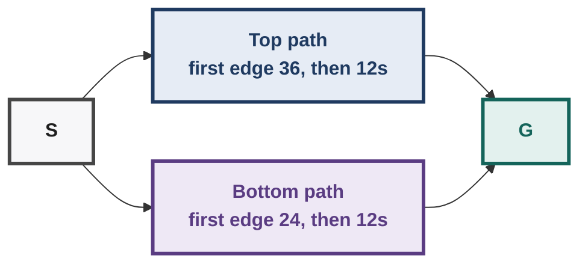

- Top first node: `g = 36`, `h = 60`.
- Bottom first node: `g = 24`, `h = 70`.
- Both complete paths cost 108 in the lecture figure.

The exact lecture figure contains two paths with equal total cost:

$$
36+12+12+12+12+24=108
$$

The horizontal portion contributes 12-unit edges, while the diagonal portions contribute 24 or 36 units; both complete paths have total cost 108.

The important point is **not** the geometry itself. It is how different evaluation functions rank the same nodes.

---

## 3.1 Best-First Search

Best-First Search looks only at $h$.

At the first choice:

- top successor: $h=60$
- bottom successor: $h=70$

Therefore:

$$
60 < 70
$$

so Best-First chooses the top path.

It continues seeing decreasing heuristic values:

$$
60\rightarrow50\rightarrow40\rightarrow30\rightarrow\cdots
$$

Hence it shoots toward the goal along the upper path without considering the accumulated $g$ cost.

---

## 3.2 A* with $w=1$

For the first top node:

$$
 g=36,\qquad h=60
$$

so

$$
f=36+60=96.
$$

For the first bottom node:

$$
 g=24,\qquad h=70
$$

so

$$
f=24+70=94.
$$

Therefore ordinary A* initially prefers the bottom node:

$$
94<96.
$$

This illustrates why A* does **not** simply follow the heuristic toward the goal: it also accounts for the cost already paid.

---

## 3.3 Weighted A* with $w=2$

Now use

$$
f_2(n)=g(n)+2h(n).
$$

### Top node

$$
 g=36,\qquad h=60
$$

Therefore:

$$
f_2=36+2(60)=36+120=156.
$$

### Bottom node

$$
 g=24,\qquad h=70
$$

Therefore:

$$
f_2=24+2(70)=24+140=164.
$$

So Weighted A* chooses the top node:

$$
156<164.
$$

The larger weight has changed the decision even though ordinary A* preferred the bottom node.

As the search proceeds toward the goal, the $h$ values decrease. Because $h$ is multiplied by 2, the $f$ values can fall rapidly along a goal-directed path.

---

## 4. Larger Weighted-A* Comparison from the Lecture

The lecturer then runs the algorithms on the earlier A* graph.

| Algorithm | Weight / criterion | Generated | Inspected | Solution cost | Optimal? |
|---|---:|---:|---:|---:|---|
| Branch & Bound | $g$ only | 23 | 23 | 148 | Yes |
| A* | $w=1$ | 19 | 14 | 148 | Yes |
| Weighted A* | $w=2$ | 70 | 9 | 153 | No |
| Best-First | heuristic-dominated | — | 8 | 195 | No |

The distinction between **generated** and **inspected** is important in the lecture's comparison:

- generated nodes are nodes produced during expansion;
- inspected nodes correspond to nodes actually examined/expanded and therefore placed in CLOSED in the A*-style terminology.

### What changes as $w$ increases?

- Behaviour spectrum with increasing `w`:
  - `w = 0`: Branch and Bound;
  - `w = 1`: A-star;
  - `w = 2`: Weighted A-star;
  - `w` to infinity: Best-First.
- Goal direction grows progressively stronger.

The lecture's empirical example shows:

- increasing $w$ reduced the amount of search inspected;
- however, at $w=2$, the returned cost was 153 rather than the optimal 148;
- Best-First inspected even fewer nodes but returned a still longer path of 195.

> **Exam trap:** “Explores fewer nodes” and “finds an optimal path” are separate properties. Weighted A* can improve search effort while sacrificing optimality.

---

## 5. Why Weighted A* Loses Admissibility

Ordinary A* relies on the heuristic being an underestimate:

$$
h(n)\le h^*(n).
$$

Weighted A* instead uses

$$
w h(n).
$$

Even when

$$
h(n)\le h^*(n),
$$

it is not generally true that

$$
w h(n)\le h^*(n)
$$

for $w>1$.

### Example

Suppose:

$$
h(n)=80,
\qquad h^*(n)=100,
\qquad w=2.
$$

Then

$$
wh(n)=160>100=h^*(n).
$$

The weighted heuristic is no longer guaranteed to be a lower bound.

Therefore the usual A* admissibility argument no longer applies.

---

## 6. A Useful Observation About $f$ Along a Path

The lecture answers a student question about why heuristic values decrease toward the goal.

As we move toward the goal:

- $g(n)$ generally increases because more path cost has been accumulated;
- $h(n)$ generally decreases because less distance remains;
- at the goal, $h(G)=0$.

For ordinary A* with an admissible heuristic, the lecturer emphasizes that $f=g+h$ becomes increasingly accurate as the goal is approached because $g$ is known exactly while the remaining heuristic contribution shrinks.

Example from the lecture's graph:

$$
100\rightarrow101\rightarrow143\rightarrow144\rightarrow145\rightarrow146\rightarrow148.
$$

The values increase toward the optimal solution cost 148.

For Weighted A* with $w=2$, the corresponding behavior can instead be non-monotonic. The lecture gives a path whose $f$ values behave approximately like:

$$
200\rightarrow192\rightarrow184\rightarrow206\rightarrow190\rightarrow153.
$$

This happens because the weighted heuristic is no longer guaranteed to underestimate the true remaining cost.

> **Connection to next lecture:** The lecturer points out that under a special condition on the heuristic, ordinary A* gets the desirable non-decreasing-$f$ behavior. This is the **monotone / consistency condition**.

---

## 7. Why Space-Saving A* Is Needed

A* can require large memory because it stores frontier and explored-state information.

The lecture's motivation is:

> **Spend more time if necessary, but use less memory while retaining admissibility.**

This is explicitly described as a “no free lunch” trade-off:

- Less stored information leads to:
  - more regeneration and repeated work;
  - more time;
  - but potentially much larger solvable state spaces.

If a perfect heuristic were available, search would be much easier. In practice, heuristics are imperfect, so the search frontier can become very large.

The lecturer contrasts these approaches with earlier space-saving methods:

- Hill Climbing: constant-space style, but does not guarantee optimality.
- Beam Search: reduced space, but not admissible.
- Genetic Algorithms / Ant Colony Optimization: low-memory population-based approaches, but no optimality guarantee.
- Week 6 asks whether we can get **space saving + admissibility**.

---

## 8. IDA* — Iterative Deepening A*

## 8.1 Connection to DFID

Earlier:

### Depth-Bounded DFS

Search only to a fixed depth $D$.

- linear space because DFS stores only a path/frontier of bounded depth;
- not complete in general;
- does not guarantee shortest paths.

### DFID

Repeatedly increase the depth bound:

$$
1,2,3,4,\ldots
$$

Each iteration is depth-bounded DFS.

Because it eventually explores increasing path lengths, it can find the shortest path in the lecture's equal-step setting while using linear space.

IDA* takes the same basic idea and replaces **depth** with **$f$-value**.

---

## 9. IDA* Core Idea

> **IDA* = iterative deepening using an $f$-value bound rather than a depth bound.**

Initial bound:

$$
\boxed{Bound=f(S)=g(S)+h(S)=h(S)}
$$

because at the start node $g(S)=0$.

Since the heuristic is admissible,

$$
 h(S)\le h^*(S),
$$

so the initial bound is a lower bound on the optimal solution cost.

If no solution is found within that bound, IDA* does **not** simply add 1. It raises the bound to the **next relevant $f$ value**, specifically the $f$ value of the cheapest unexpanded/cutoff node.

### Bound progression

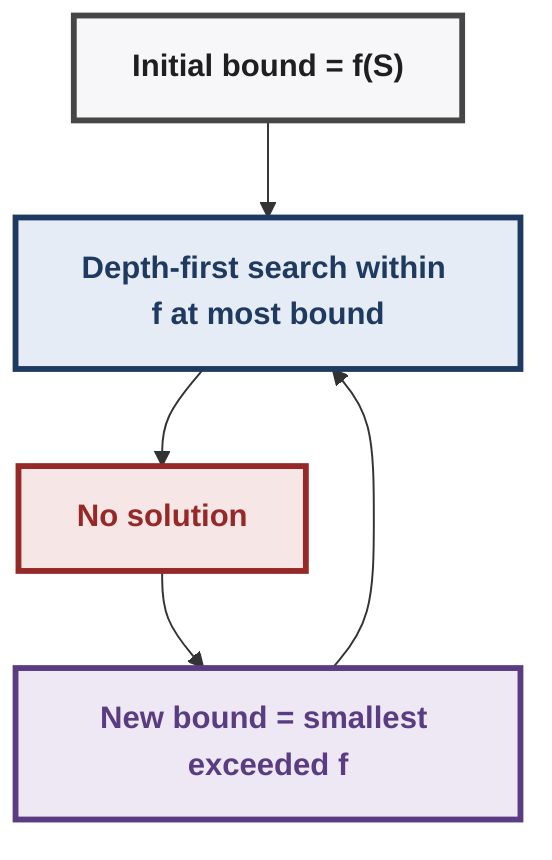

This preserves the iterative-deepening idea while respecting the cost structure of A*.

---

## 10. IDA* — Pseudocode Reconstruction

```text
IDA*(start):
    bound ← f(start)

    while TRUE:
        result ← depth-first search restricted to f(n) ≤ bound

        if result is a goal:
            return result

        bound ← smallest f-value that exceeded the old bound
```

### Input

- start state
- successor-generation mechanism
- $g(n)$ and admissible $h(n)$

### Stored information

Only the current DFS path and associated information are retained.

### Termination

- stop when a goal is found;
- otherwise increase the $f$ bound and repeat.

### Space

The lecture characterizes IDA* as **linear-space**, because it uses depth-first search rather than maintaining the full A* OPEN/CLOSED structure.

---

## 11. IDA* — Visual Intuition

The lecture shows successive search boundaries as nested regions.

- IDA-star boundaries as nested regions:
  - Iteration 1 searches all states with `f` at most `B1`.
  - Iteration 2 expands to `f` at most `B2`, containing the previous region.
- Within each boundary the algorithm behaves like depth-first search.

Within each boundary, the algorithm behaves like DFS:

- Within a bound: go down, hit the bound, backtrack, and try another branch.

The next boundary is determined by the next exceeded $f$ value.

---

## 12. IDA* — Main Problem: Repeated Work

IDA* saves memory by throwing away the information that A* would have retained.

That creates a cost:

> **The same nodes may be searched repeatedly in successive iterations.**

This becomes especially problematic in state spaces where:

- there are many ways of reaching the same state;
- the state space is not a simple tree;
- the number of paths grows combinatorially;
- there is no CLOSED list to remember previous work.

The lecture explicitly connects this to **thrashing / repeated searches**.

### Constant-$\Delta$ variant discussed in lecture

Instead of expanding the bound only to the next exceeded $f$ value, one could enlarge it by a fixed amount $\Delta$:

$$
B_{new}=B_{old}+\Delta.
$$

This can reduce repeated boundary changes, but it introduces a trade-off: the search may find a path before it has reached the exact boundary corresponding to the optimal cost, potentially sacrificing accuracy/optimality depending on how the method is used.

The lecturer's point is that **$\Delta$ controls the time/accuracy trade-off**.

---

## 13. RBFS — Recursive Best-First Search

## 13.1 Motivation

IDA* has linear space, but it has no strong sense of direction because it is fundamentally depth-first.

The next algorithm attempts to combine:

- the **space behavior of DFS**, and
- the **direction of Best-First Search**.

Recursive Best-First Search (RBFS) was given by **Richard Korf in 1991**.

The lecture's characterization:

> **RBFS is like Hill Climbing with backtracking, but informed by $f$ values.**

It:

- uses linear space;
- chooses successors in best-first order;
- keeps enough information to know the next-best alternative;
- backtracks when the current branch is no longer the best choice;
- updates a parent's stored value using the best value obtained from its children.

---

## 14. RBFS — Core Intuition

Ordinary Hill Climbing:

- Ordinary Hill Climbing:
  - look at the current node;
  - look at neighbours;
  - choose the best neighbour;
  - move there.
- Problem: a bad path cannot be recovered.

Problem: if the path becomes bad, Hill Climbing cannot recover.

RBFS adds a recovery mechanism:

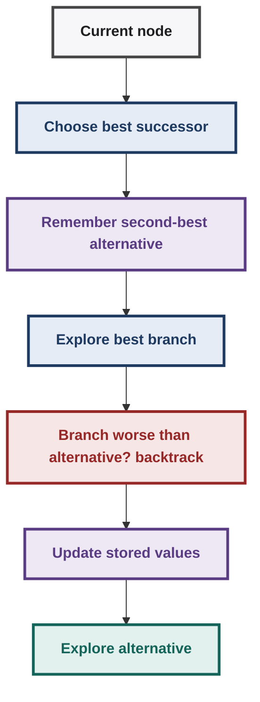

Unlike ordinary DFS, RBFS is not blindly committed to the leftmost child. It uses the $f$ values to determine which branch is currently best.

---

## 15. RBFS — Hand-Traced Lecture Example

The lecture presents a tree whose initial node has:

$$
f=50.
$$

Suppose its best successor has:

$$
f=59.
$$

Another successor has:

$$
f=55.
$$

RBFS follows the currently best branch according to its search rule but remembers the **second-best alternative** as a fallback.

The lecture then traces a branch approximately as:

- Lecture RBFS value trace down one branch:
  - 50 → 59 → 55 → 56 → 56 → 57 → 58.
- At 58 the children are 63, 61, and 62, so the branch is abandoned for the stored alternative.

At the node with value 58, its children have values such as:

$$
63,
61,
62.
$$

The best child is therefore:

$$
\min(63,61,62)=61.
$$

The current branch is no longer competitive with the stored alternative of 59.

RBFS therefore:

1. abandons the currently explored branch;
2. rolls its information upward;
3. updates parent values using the best child value;
4. returns toward the alternative branch.

---

## 15.1 Bottom-up backup

The lecturer's example gives the following style of update:

- Child values: 63, 61, 62.
- Best child is 61, so the parent value becomes 61.
- Compare with the sibling value 60: best is 60.
- The parent becomes 60; continue backing up.

The essential rule is:

$$
\boxed{f(parent)\leftarrow \min\{f(child_1),f(child_2),\ldots\}}
$$

for the relevant regenerated/expanded children, in the sense used by the lecture's RBFS trace.

This backed-up value represents the best currently known way of continuing through that subtree.

---

## 16. RBFS — Why It Saves Space

RBFS does not keep the complete OPEN list like ordinary A*.

Instead, when it backtracks it can discard the nodes of the abandoned branch and retain the information needed to choose the next branch.

When returning to a node, children may need to be **regenerated**.

Therefore:

- Less stored tree means:
  - children are regenerated when needed;
  - more computation;
  - less memory.

The lecturer describes RBFS as linear-space and notes that it can expand fewer nodes than IDA* when the cost function behaves appropriately.

---

## 17. RBFS — Thrashing Problem

RBFS does not eliminate repeated work completely.

If different portions of the search space look similar, the algorithm may repeatedly switch between them.

For example, if an alternative value that was previously 59 later becomes 62, the search may reconsider another branch, then later roll back again.

This repeated switching is described as **thrashing**.

> **Exam trap:** “Linear space” does not mean “no repeated work.” The entire reason space-saving search can consume extra time is that previously discarded information may have to be regenerated.

---

## 18. Demo: A*, IDA*, RBFS, Best-First and Hill Climbing

The separate demo lecture visually compares the algorithms on several graphs.

### Visual conventions used in the demo

- **black nodes** = CLOSED
- **blue nodes** = OPEN
- repeated yellow/search markings = new IDA* iteration

### Demo observations

#### Best-First

- strongly heads toward the goal;
- ignores the accumulated source cost in its selection criterion;
- can find a path quickly;
- because it is global rather than local, it can move away from the goal when necessary and still recover.

#### Hill Climbing

- only looks locally at neighboring states;
- can get stuck when no local move improves the heuristic;
- therefore can fail even when a path to the goal exists.

#### A*

- uses $g+h$;
- explores more broadly than Best-First in the demonstrations;
- balances source cost and estimated remaining cost.

#### IDA*

- repeatedly performs depth-first searches;
- uses linear space;
- can repeat large portions of the search;
- in the demonstrations it can find the same optimal path as A*, although repeated work is visible.

#### RBFS

- behaves like informed hill climbing with backtracking;
- can roll back rather than restarting completely;
- can still revisit/re-explore regions.

### Important demonstration caveat

The lecturer explicitly notes that some demo implementations were student-built and had not necessarily been fully vetted. In one demonstration IDA* appeared to return a different path from A*, even though both methods should agree on optimality under the stated assumptions. This is presented as an implementation/demo issue, not as a theoretical change to A* or IDA*.

> **Exam trap:** Do not infer algorithmic correctness from an anomalous demo run when the lecturer explicitly identifies possible implementation issues.

---

## 19. Monotone / Consistent Heuristic

## 19.1 Why introduce another condition?

Ordinary A* is admissible when the heuristic underestimates the true remaining cost:

$$
\boxed{h(n)\le h^*(n)}.
$$

However, even with an admissible heuristic, A* may discover a better route to a node that is already in CLOSED. That is why the general A* algorithm may need **improved-cost propagation** for CLOSED nodes.

The lecturer introduces a stronger condition:

> **Monotone condition**, also called the **consistency condition**.

Its major consequence is analogous to Dijkstra's algorithm:

> When A* selects a node from OPEN, the path cost to that node is already optimal.

Formally:

$$
\boxed{g(n)=g^*(n)}
$$

when A* selects/expands $n$ under the monotone condition.

---

## 20. Formal Monotone Condition

For an edge from node $m$ to successor $n$, with edge cost $k(m,n)$:

$$
\boxed{h(m)-h(n)\le k(m,n)}.
$$

Equivalently:

$$
\boxed{h(m)\le k(m,n)+h(n)}.
$$

Interpretation:

> The heuristic cannot drop by more than the actual cost of traversing the edge.

The lecturer describes this as the heuristic **underestimating the cost of each edge** in the relevant local sense.

Because the condition must hold for every connected pair/edge, it is a **local property**.

---

## 21. Example of the Monotone Condition

The lecture uses a grid-like graph where each square corresponds to 10 km and Manhattan distance is used as the heuristic.

For example, for nodes $H$ and $O$:

$$
h(H)=120,
\qquad h(O)=100.
$$

Therefore:

$$
h(H)-h(O)=120-100=20.
$$

The edge cost is 23, so:

$$
20\le23.
$$

Therefore the edge satisfies the monotone condition.

Another example from the lecture:

$$
h(E)=120,
\qquad h(B)=110,
$$

so

$$
120-110=10.
$$

The edge cost is 33:

$$
10\le33.
$$

Again the condition is satisfied.

The lecture also points out that the condition works in either direction: if $h(m)-h(n)$ is negative, it is automatically below a positive edge cost.

---

## 22. Monotone ⇒ Non-Decreasing $f$

This is one of the most important derivations in Week 6.

Suppose $n$ is a successor of $m$.

Monotone condition:

$$
 h(m)-h(n)\le k(m,n).
$$

Rearrange:

$$
 h(m)\le k(m,n)+h(n).
$$

Since $n$ is a successor of $m$:

$$
 g(n)=g(m)+k(m,n).
$$

Therefore:

$$
 h(m)+g(m)\le h(n)+g(m)+k(m,n).
$$

But

$$
 g(m)+k(m,n)=g(n).
$$

Hence:

$$
 h(m)+g(m)\le h(n)+g(n).
$$

Since $f(x)=g(x)+h(x)$:

$$
\boxed{f(m)\le f(n)}.
$$

Thus along a path:

$$
\boxed{f(S)\le f(n_1)\le f(n_2)\le\cdots\le f(G)}.
$$

### Intuition

The heuristic is not allowed to suddenly decrease by more than the edge cost. Therefore the decrease in $h$ cannot overpower the increase in $g$.

- Edge cost increases `g`.
- The heuristic cannot drop too fast.
- Combined `f` cannot decrease.

> **Exam trap:** “Monotone” means **non-decreasing $f$ along paths**, not decreasing heuristic values in the informal sense.

---

## 23. Monotone vs Admissible

| Property | Condition | Type of property | Main consequence |
|---|---|---|---|
| Admissible | $h(n)\le h^*(n)$ | Global estimate-to-goal condition | A* can find an optimal goal path |
| Monotone / Consistent | $h(m)-h(n)\le k(m,n)$ for every edge | Local edge condition | $f$ is non-decreasing; expanded node has optimal $g$ |

The lecturer's key relationship is:

$$
\boxed{\text{Monotone} \Rightarrow \text{Admissible}}
$$

but

$$
\boxed{\text{Admissible} \not\Rightarrow \text{Monotone in general}.}
$$

Thus monotonicity is a stronger requirement.

---

## 24. Proof: With Monotonicity, A* Finds the Optimal Cost to Every Expanded Node

## Intuition

Suppose A* is about to expand node $n$ through some path that is not optimal.

If an optimal path to $n$ existed with a cheaper cost, there would be some first unexpanded node on that optimal path sitting in OPEN.

Because $f$ is non-decreasing along that optimal path, that frontier node would have an $f$ value no larger than the $f$ value of $n$.

A* should therefore have selected that frontier node first.

Contradiction.

Therefore the path by which A* expands $n$ must already be optimal.

---

## Formal Proof

Assume A* is about to expand $n$, but suppose for contradiction that

$$
 g(n)>g^*(n).
$$

Let $n_l$ be the **last expanded node on an optimal path from $S$ to $n$**.

Let $n_{l+1}$ be its successor on that optimal path.

By definition:

- $n_l$ has already been expanded;
- $n_{l+1}$ has not yet been expanded;
- therefore $n_{l+1}\in OPEN$.

Because $n_l$ and $n_{l+1}$ lie on the optimal path to $n$, the $g$ values along that path are optimal.

By monotonicity, $f$ is non-decreasing along that path, so

$$
 f(n_{l+1})\le f(n).
$$

But A* is about to choose $n$ from OPEN. Therefore the selection rule also implies

$$
 f(n)\le f(n_{l+1}).
$$

Combining:

$$
 f(n)\le f(n_{l+1})\le f(n).
$$

Hence the values must be equal:

$$
 f(n)=f(n_{l+1}).
$$

Now expand:

$$
 g(n)+h(n)=g^*(n_{l+1})+h(n_{l+1}).
$$

The monotonicity argument gives the relevant inequality

$$
 g(n)+h(n)\le g^*(n)+h(n).
$$

Cancel $h(n)$:

$$
 g(n)\le g^*(n).
$$

But by definition $g^*(n)$ is the optimal cost, so no discovered path can have cost strictly less than it:

$$
 g(n)\ge g^*(n).
$$

Therefore:

$$
\boxed{g(n)=g^*(n)}.
$$

This contradicts the original assumption that $g(n)>g^*(n)$.

Therefore, when A* expands $n$ under a monotone heuristic, it has already found the optimal path to $n$.

---

## 25. Consequence: No CLOSED Improvement Propagation Needed

General A* can encounter:

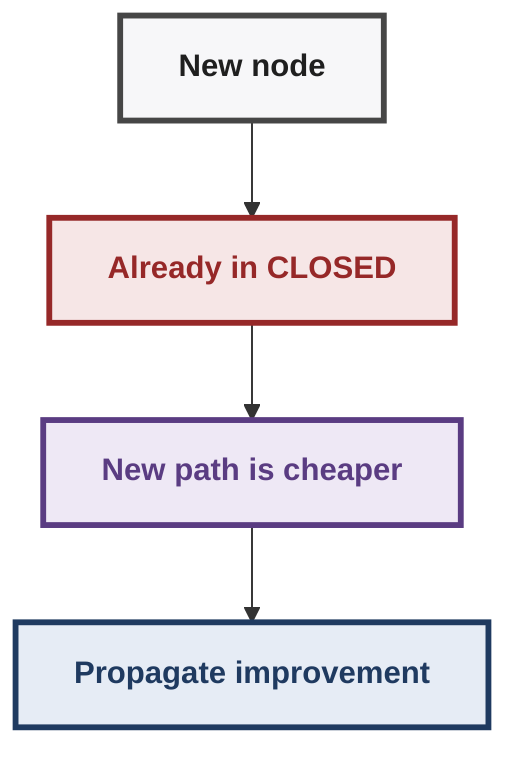

Under the monotone condition:

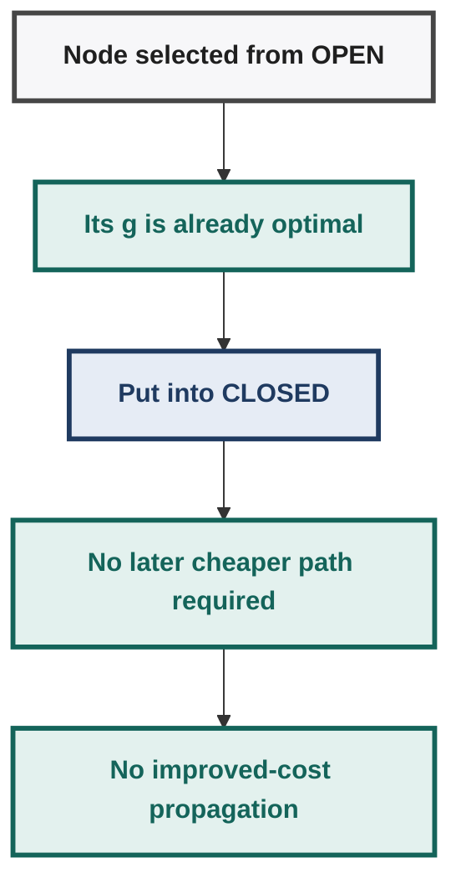

This is the key reason monotonicity enables the space-saving methods introduced next.

---

## 26. Sequence Alignment in Biology

## 26.1 Why does sequence alignment appear in a search course?

The lecturer uses sequence alignment as a **large state-space example** that exposes the memory problem of A*.

The problem is fundamental in bioinformatics and concerns comparing biological sequences.

For DNA, the possible letters are:

- A = adenine
- C = cytosine
- G = guanine
- T = thymine

A DNA sequence is represented as a sequence of such letters.

The alignment problem asks:

> How should two sequences be placed alongside each other, possibly inserting gaps, so that their similarity is maximized / alignment cost is minimized?

The lecture mentions the **Needleman–Wunsch** dynamic-programming algorithm as an established method for sequence alignment and notes that it explores the state space in an uninformed/branch-and-bound-like fashion. A* provides a heuristic-search perspective.

---

## 27. Alignment Cost Model

Two main types of penalties are discussed.

### 1. Mismatch penalty

If character $X$ is aligned with a different character $Y$:

$$
X\ne Y
$$

a mismatch cost is incurred.

### 2. Indel penalty

If a gap is inserted into one sequence, an **insertion/deletion (Indel)** cost is incurred.

Thus the alignment tries to trade off:

- Alignment trades off:
  - aligning different characters;
  - against inserting gaps.

The optimal alignment depends on the numerical penalty values.

---

## 28. Hand-Solved Alignment Example

The lecture gives:

- Indel penalty = 3
- mismatch penalty = 7

Suppose the direct alignment produces one mismatch:

$$
\text{cost}=7.
$$

An alternative alignment inserts one gap into each sequence, paying two Indel penalties:

$$
3+3=6.
$$

Therefore:

$$
6<7,
$$

so the gap-based alignment is preferred.

### Change the mismatch penalty

If mismatch cost is reduced from 7 to 5:

- direct mismatch = 5
- two gaps = 6

Therefore:

$$
5<6,
$$

so the original/direct alignment becomes preferable.

> **Exam trap:** There is no universally best alignment independent of the cost model. Changing mismatch or Indel penalties can change the optimal alignment.

---

## 29. Similarity Instead of Distance

The same problem can be formulated as:

- **minimize alignment cost**, or
- **maximize similarity score**.

The lecture describes distance and similarity as roughly inverse viewpoints.

Example scoring scheme:

- match: $+1$
- mismatch / Indel: negative score

Then a higher total score means a better alignment.

Another illustrative scoring idea in the lecture is:

- match = 0
- Indel = $-1$
- mismatch = $-10$

This expresses a strong preference for avoiding mismatches even if that requires inserting gaps.

---

## 30. Fine-Grained Similarity Matrix

The lecture also shows a more detailed scoring matrix.

Diagonal entries correspond to aligning a character with the same character and are positive.

The lecture gives illustrative weights such as:

| Match | Weight |
|---|---:|
| A with A | highest |
| C with C | 9 |
| T with T | 8 |
| G with G | 7 |

Other mismatches are negative, except for an explicitly allowed T/C alignment with zero penalty in the illustrated matrix.

The important conceptual point is:

> Different matches can have different biological value, so the scoring function need not treat all matching characters equally.

---

## 31. Sequence Alignment as Graph Search

This is the most important connection to AI search.

Suppose the current positions are $i$ and $j$ in the two sequences.

Represent the state as a grid cell:

$$
(i,j).
$$

Start:

$$
(0,0).
$$

Goal:

$$
(N,M).
$$

### Three possible moves

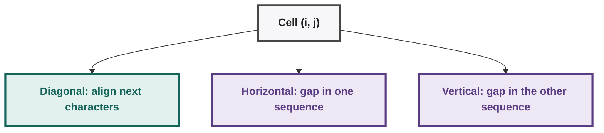

More precisely:

1. **Diagonal:** $(i,j)\to(i+1,j+1)$
   - align the next character of sequence 1 with the next character of sequence 2;
   - incurs match/mismatch score or cost.

2. **Horizontal:** $(i,j)\to(i+1,j)$
   - one sequence advances while the other receives a gap;
   - Indel penalty.

3. **Vertical:** $(i,j)\to(i,j+1)$
   - the other sequence advances while the first receives a gap;
   - Indel penalty.

The graph is **directed**: moves proceed toward the goal. You do not move backward.

---

## 32. Sequence Alignment Grid — Visual Reconstruction

For the lecture example:

| Direction | Sequence |
|---|---|
| Horizontal | G C A T G C A |
| Vertical | G A T T A C A |

The state space can be viewed as:

|  | j1 | j2 | j3 | j4 | j5 |
|---|---|---|---|---|---|
| i1 |  | diagonal | right |  |  |
| i2 | down |  | diagonal |  |  |
| i3 |  |  |  | diagonal |  |

Every complete path from the upper-left start to the lower-right goal represents one possible alignment.

Every complete path from the upper-left start to the lower-right goal represents one possible alignment.

---

## 33. Meaning of Alignment Paths

### All-diagonal path

- All-diagonal path: `S` followed by diagonal moves to `G`.
- It means the sequences are aligned directly with no gaps.

Means the sequences are aligned directly with no gaps.

### Horizontal move

A horizontal move means a gap has been inserted into one sequence.

### Vertical move

A vertical move means a gap has been inserted into the other sequence.

Different paths therefore correspond to different gap placements and character pairings.

An extreme path might first move completely horizontally and then completely vertically. That is a valid alignment representation but is usually a poor alignment because it separates the sequences instead of matching many corresponding characters.

---

## 34. Alignment Example: Edge Costs

Suppose a diagonal move aligns:

$$
G\text{ with }G.
$$

Its cost depends on the scoring model.

If the next diagonal move aligns:

$$
A\text{ with }C,
$$

then a mismatch cost is incurred according to the scoring matrix.

Horizontal/vertical moves incur Indel costs.

Therefore the total path cost is the sum of the edge costs:

$$
\text{alignment cost}
=
\sum\text{mismatch costs}
+
\sum\text{Indel costs}.
$$

---

## 35. Why Sequence Alignment Creates a Memory Problem

For strings of lengths $N$ and $M$:

$$
\text{grid dimensions}=(N+1)\times(M+1).
$$

The extra row/column comes from the starting position before the first character.

Thus the number of **states/cells** is proportional to

$$
(N+1)(M+1),
$$

which is quadratic when the lengths are of the same order.

But the number of possible complete alignment paths is much larger because there are multiple choices at every state.

---

## 36. Number of Alignment Paths

If diagonal moves are ignored and only horizontal/vertical moves are allowed, a path from one corner to the other uses $N$ moves of one type and $M$ of the other.

The number of such paths is:

$$
\boxed{\frac{(N+M)!}{N!M!}}.
$$

This is the ordinary grid-path/binomial-count idea.

When diagonal moves are also allowed, the number of possible paths grows even more.

If $r$ diagonal moves are used, the lecture gives the path-count form:

$$
\boxed{
\frac{(N+M-r)!}
{(N-r)!(M-r)!r!}
}
$$

where

$$
0\le r\le\min(N,M).
$$

The transcript contains some noisy wording around the final bound on $r$; the lecture's example explicitly says that if the strings have lengths 4 and 6, at most 4 diagonal moves are possible, confirming $r\le\min(N,M)$.

The key point is not memorizing the combinatorial expression; it is recognizing that the **number of paths becomes combinatorially large** even though the grid of states is only quadratic.

---

## 37. OPEN vs CLOSED in Sequence Alignment

This is the motivation for pruning CLOSED.

In the sequence-alignment grid:

- OPEN forms a relatively thin frontier;
- CLOSED occupies the explored region behind that frontier.

The lecture observes:

$$
\boxed{OPEN\text{ grows roughly linearly with depth}}
$$

while

$$
\boxed{CLOSED\text{ grows roughly quadratically}}
$$

for this type of grid problem.

Visual model:

- Sequence-alignment memory picture:
  - CLOSED region: large explored area behind the frontier.
  - OPEN frontier: thin boundary ahead.
  - Goal `G` lies beyond the frontier.

For biological sequences potentially containing hundreds of thousands of characters, quadratic memory growth becomes formidable.

Hence:

- Monotone heuristic implies expanded nodes never need improved CLOSED costs.
- CLOSED information becomes less important.
- Throw away CLOSED and use Frontier Search.

---

## 38. Why CLOSED Exists

The lecture identifies two major roles of CLOSED.

## Role 1 — Prevent cycles / backward leakage

If a state has already been processed, we do not want neighboring states to regenerate it indefinitely.

This prevents the search from leaking backward through already explored territory.

## Role 2 — Reconstruct the solution path

CLOSED/parent information can be used to remember where each node came from.

Therefore, simply deleting CLOSED creates two problems:

1. the search might regenerate old states;
2. the final path may no longer be directly reconstructible.

Frontier Search addresses the first problem with **barred nodes**, and relay nodes address the second.

---

## 39. Frontier Search

Introduced in the lecture through work by **Richard Korf and Zhang** around 2000.

Core idea:

> **Maintain only the frontier/OPEN information and throw away ordinary CLOSED nodes.**

The challenge is preventing the search from moving backward into the discarded region.

---

## 40. Frontier Search — Barred Nodes

Suppose node $A$ is expanded.

Its active neighbors may include:

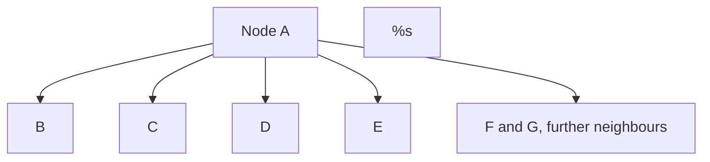

- Some neighbours are new or OPEN; others are already processed.
- Frontier Search records the processed ones as barred so they are not regenerated.

Some neighbors are new/OPEN; others have already been processed.

Instead of storing the old CLOSED nodes, Frontier Search stores, with each current frontier node, information saying:

> **Do not generate these already-processed nodes again.**

This is effectively a **Tabu/barred list** associated with frontier nodes.

Example:

1. Expand $A$.
2. $A$ becomes logically CLOSED and is discarded.
3. For its relevant active neighbors $B,C,D,E$, record that $A$ is barred.
4. When $B$ or $C$ or $D$ or $E$ is expanded later, it must not regenerate $A$.

If $E$ is subsequently expanded, its active neighbors may receive $E$ as another barred predecessor.

Thus the search proceeds forward without needing the entire historical CLOSED set.

---

## 41. Space Interpretation of Barred Lists

A student asks whether storing barred-node identifiers simply recreates the memory problem.

The lecturer's answer:

- yes, barred information consumes space;
- however, each frontier node has only a bounded/constant number of neighbors in the intended setting;
- therefore the barred information multiplies the OPEN storage by a constant factor rather than introducing another depth-dependent quadratic structure.

If OPEN contains $n$ nodes and each stores a constant amount of barred-neighbor information, the storage behaves conceptually like:

$$
cn
$$

for some constant $c$.

It is **not** another term that grows as the full explored area.

> **Exam trap:** “A constant-factor increase” is not the same as “constant space.” Frontier Search still has space that grows with the frontier size.

---

## 42. The Path-Reconstruction Problem

If all CLOSED nodes are discarded, how do we reconstruct:

$$
S\rightarrow\cdots\rightarrow G?
$$

Frontier Search therefore retains selected **relay nodes**.

The lecture's rule is roughly:

$$
\boxed{g(n)\approx h(n)}
$$

for a node that is far enough along the route to serve as a useful middle point.

Such nodes form a **relay layer**.

The descendants retain enough information to point back to their relay node.

---

## 43. Relay Nodes — Intuition

Think of the full path as:

- Full path with a relay:
  - `S` leads to `G` through one relay node.

Instead of remembering every intermediate node:

- Dense path remembers every step: `S → a → b → c → d → e → f → G`.

store a sparse structure:

- Sparse path stores only relays: `S → RELAY → G`.

The exact internal path segments can later be reconstructed recursively.

The lecturer describes relay nodes as being roughly halfway in estimated source-to-goal progress, characterized by:

$$
 g(n)\approx h(n).
$$

This is a heuristic structural choice rather than a requirement that the two values be mathematically identical in every instance.

---

## 44. Divide-and-Conquer Frontier Search (DCFS)

When the goal is found, suppose it points to a relay node $R$.

The complete path can be reconstructed by solving two smaller problems:

$$
S\rightarrow R
$$

and

$$
R\rightarrow G.
$$

Hence:

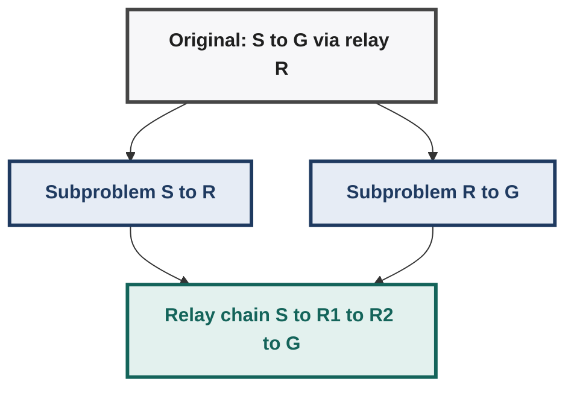

Each subproblem can itself have a relay node.

Therefore the recursion continues:

- Relay chain: `S → R1 → R2 → G`.

and eventually the dense path segments are reconstructed.

---

## 45. DCFS — Time/Space Trade-Off

Suppose ordinary search takes time $T(d)$ for a problem of depth $d$.

DCFS stores much less historical information, but performs additional recursive searches to reconstruct the path.

The lecture explains the recurrence intuitively:

- first solve the whole problem;
- then solve the two subproblems around a relay;
- each of those can split again;
- after another level there can be four subproblems;
- the recursion introduces an additional depth-dependent factor.

The lecture characterizes the resulting time as roughly:

$$
\boxed{T(d)\times d}
$$

when $T$ is exponential, i.e. an exponential-time search multiplied by the depth factor.

The exact point is the trade-off:

$$
\text{less stored history}
\Longleftrightarrow
\text{more repeated computation}.
$$

---

## 46. Smart Memory Graph Search (SMGS)

A variation discussed next is **Smart Memory Graph Search (SMGS)** by **Zhou and Hansen (2003)**.

The motivation is that memory availability is not necessarily fixed at the smallest possible amount.

Instead of always recursively splitting the problem at fixed intervals:

> **Use as much memory as is available, and create relay layers only when memory is actually becoming scarce.**

### Behavior

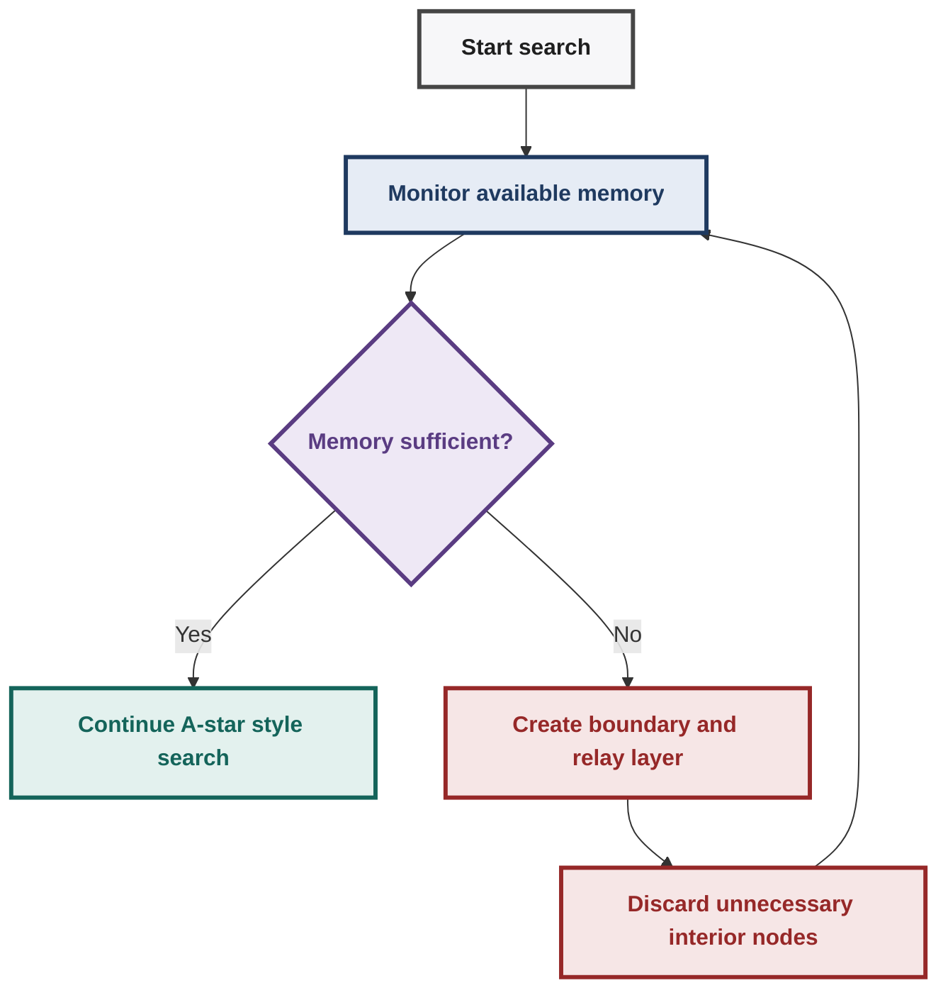

Therefore SMGS may create:

- no relay layers;
- one relay layer;
- several relay layers;

depending on the problem and available memory.

---

## 47. SMGS — Boundary and Kernel Nodes

The lecture distinguishes two kinds of nodes in the explored region.

### Boundary node

A CLOSED node is a boundary node if it has at least one neighbor on OPEN.

| Region | Role |
|---|---|---|
| CLOSED cells | Explored area |
| Boundary cell | CLOSED node adjacent to OPEN |
| OPEN | Frontier |

The boundary is important because it prevents search from leaking backward.

### Kernel node

A CLOSED node is a kernel node when all of its neighbors are already inside the explored/closed region.

These nodes are interior to the explored region and can be deleted when memory is needed.

Visual idea:

- Search layers from frontier inward:
  - OPEN frontier nodes;
  - boundary layer (protects the frontier);
  - kernel and interior nodes (disposable when memory is scarce).

The lecturer's SMGS transformation is:

- SMGS transformation:
  - boundary nodes become the relay layer;
  - kernel nodes are deleted.

This preserves the information needed to prevent backward leakage while discarding unnecessary interior history.

---

## 48. Sparse Path vs Dense Path

SMGS may produce a **sparse solution path** represented through relay nodes.

For example:

- Relay chain: `S → R1 → R2 → G`.

The actual complete solution is a **dense path** containing all intermediate states.

To recover it, recursive calls reconstruct each segment:

- Reconstruct each sparse segment separately:
  - `S → R1`;
  - `R1 → R2`;
  - `R2 → G`.

The number of recursive calls depends on how many relay layers were created.

This is another direct time-for-space trade-off.

---

## 49. Pruning OPEN — Why Prune the Frontier?

So far the focus was on pruning CLOSED.

The next lecture asks:

> **What if OPEN itself becomes the dominant memory cost?**

In a tree with branching factor 4:

$$
4,\quad16,\quad64,\quad256,\ldots
$$

Thus the frontier can grow exponentially.

The lecturer therefore moves from:

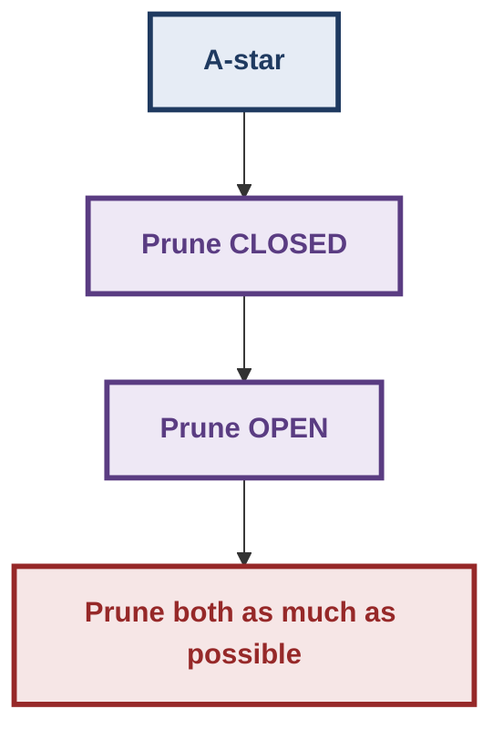

---

## 50. Beam Search as the Simplest OPEN-Pruning Method

Beam Search keeps only a fixed number $w$ of nodes at each level.

Here $w$ is the **beam width**.

Earlier Beam Search was introduced in a local-search context. The Week 6 version differs in an important way.

### Earlier Hill-Climbing-style rule

Choose a successor only if it is **better**.

That rule makes sense when optimizing the heuristic directly.

### Path-search version

We are now interested in reaching a goal with low total path cost.

Since $f$ can increase as we move deeper, the best successor need not have a numerically smaller $f$ than its parent.

Therefore:

> **Keep the $w$ best successors even if they are not better than the current node.**

Termination criterion:

$$
\boxed{\text{goal found}}.
$$

---

## 51. Beam Search Space

At each depth, keep approximately $w$ nodes.

If the solution depth is $d$:

$$
\boxed{\text{space}\approx w\times d}.
$$

Thus, for fixed beam width $w$, the lecture characterizes Beam Search as **linear-space**.

However:

$$
\boxed{\text{Beam Search is not admissible.}}
$$

It can discard the branch containing the optimal solution.

---

## 52. Upper Bound $U$ on Solution Cost

A crucial idea in OPEN pruning is to obtain an **upper bound** on the cost of a solution.

Suppose some search method, such as Beam Search, finds a goal path of cost:

$$
U.
$$

Then the true optimal cost $C^*$ satisfies:

$$
\boxed{C^*\le U}.
$$

Why?

Because the optimal solution cannot be more expensive than a solution we already know.

At the same time, an admissible heuristic provides a lower bound:

$$
 h(S)\le C^*.
$$

Thus conceptually:

- Cost bounds on one scale:
  - lower bound `h(S)`;
  - optimal cost `C*`;
  - upper bound `U` from a known solution.

The upper bound is useful for pruning.

---

## 53. $f(n)>U$ Pruning Rule

Suppose a node has:

$$
 f(n)>U.
$$

If the relevant monotonicity property holds, $f$ cannot decrease along descendants.

Therefore any descendant reached through $n$ will also have a value at least as large.

Since we already know a solution costing $U$:

> A branch whose lower-bound estimate already exceeds $U$ cannot lead to a better solution.

Hence it can be pruned.

### Core rule

$$
\boxed{f(n)>U\Rightarrow\text{do not explore the branch}.}
$$

This turns a solution cost found by a fast, possibly inadmissible method into a pruning bound for a later admissible search.

> **Exam trap:** $U$ is an **upper bound**, not the optimal cost itself. The optimal cost can be strictly smaller than $U$.

---

## 54. Breadth-First Heuristic Search (BFHS)

The lecture next introduces **Breadth First Heuristic Search (BFHS)**, attributed to Zhou and Hansen (2004).

The name sounds contradictory because the search is breadth-first, but the frontier is restricted using heuristic information.

Basic idea:

1. perform breadth-first exploration;
2. obtain an upper bound $U$ from some known solution;
3. restrict the breadth-first search to states satisfying the relevant $f$-value bound.

Conceptually:

- Ordinary breadth-first search explores the full grid.
- BFHS restricts the search to states with `f` at most `U`.

The lecturer notes an empirical observation that the BFHS search frontier can be smaller than the A* search frontier for the corresponding problem.

---

## 55. Beam Search vs BFHS

| Method | Frontier restriction | Space | Admissible? |
|---|---|---|---|
| BFS | none | large | Yes for unit-step shortest paths |
| BFHS | $f$-boundary $\le U$ | reduced relative to unrestricted BFS | Lecture describes it as finding an optimal path |
| Beam Search | fixed width $w$ | $w\times d$ | No |

The conceptual distinction is:

- **BFHS:** prune based on a cost boundary derived from $U$.
- **Beam Search:** keep only a fixed number of nodes at each level.

---

## 56. Divide-and-Conquer Breadth-First Heuristic Search

The lecturer then applies divide-and-conquer ideas to BFHS.

The search maintains:

- OPEN nodes;
- boundary nodes;
- one or more relay layers for reconstruction.

Thus the search can discard large interior regions while retaining enough structure to reconstruct the solution.

---

## 57. Divide-and-Conquer Beam Search

Apply the same idea to Beam Search.

Instead of retaining $w$ nodes across every depth, keep only a few layers:

| Retained layer | Width |
|---|---|---|
| OPEN layer | w |
| Boundary layer | w |
| Relay layer | w |

With one relay layer this stores about `3w` nodes.

With one relay layer, this is approximately:

$$
3w
$$

stored nodes.

For fixed $w$:

$$
\boxed{\text{constant space with respect to depth}.}
$$

However, it inherits Beam Search's central limitation:

$$
\boxed{\text{inadmissible}.}
$$

---

## 58. Beam Stack Search (BSS)

The next algorithm adds **explicit backtracking** to Beam Search.

> **Beam Stack Search = Beam Search + explicit backtracking.**

The difficulty is that ordinary Beam Search discards nodes outside the current beam. BSS needs a compact way to remember what was discarded so that it can later return to those alternatives.

The solution is a **Beam Stack**.

---

## 59. Beam Stack: $f_{min}$ and $f_{max}$

At every depth/level, the Beam Stack stores two important values.

### $f_{min}$

The $f$ value of the cheapest node currently inside the beam.

### $f_{max}$

The $f$ value of the cheapest node that lies **outside** the current beam and therefore is the next relevant alternative.

Conceptually:

- Beam states sorted by `f`:
  - beam nodes first;
  - next node outside the beam defines `f-max`;
  - cheapest beam node defines `f-min`.

The interval can be visualized as a moving search window.

When backtracking occurs, the Beam Stack tells the algorithm where the next unexplored portion begins.

---

## 60. Beam Stack Search — Example with Width 3

Suppose:

$$
w=3.
$$

At level $k$:

| Position | f-value |
|---|---|---|
| Beam node | 10 |
| Beam node | 12 |
| Beam node | 14 |
| First outside beam | 17 |
| Further node | 21 |

Here `f-min = 10` and `f-max = 17`.

Then:

$$
 f_{min}=10
$$

and

$$
 f_{max}=17.
$$

If the current beam does not lead to a solution, backtracking uses this stored information to regenerate the next portion of the search.

The beam window therefore **slides** through the ordered state space.

---

## 61. Upper Bound + Beam Stack

The Beam Stack does not blindly search the entire state space.

If a solution of cost $U$ is already known, the algorithm only needs to consider nodes inside the corresponding upper-bound region.

Visual idea:

- Beam window along increasing `f`:
  - current beam window;
  - next alternatives from `f-max`;
  - regions beyond `U` are discarded.

The lecture describes the beam as sweeping through the admissible-to-examine region until the relevant solution is found.

---

## 62. Divide-and-Conquer Beam Stack Search

The final algorithm in Week 6 is **Divide-and-Conquer Beam Stack Search**.

It combines:

- beam-width restriction;
- explicit backtracking;
- divide-and-conquer memory saving;
- regeneration from the start node;
- Beam Stack guidance.

### Why regenerate from the start?

In ordinary backtracking, one might go to a stored parent and regenerate the next children.

But the divide-and-conquer version has deleted most parent nodes.

Therefore:

> **When backtracking is required, regenerate the relevant node/path from the start, using the Beam Stack to guide the regeneration.**

---

## 63. Divide-and-Conquer Beam Stack — Space

Only a constant number of layers are retained:

- OPEN layer;
- boundary layer;
- relay layer(s), with the lecture's basic constant-layer description.

Therefore the node-storage component is constant with respect to search depth for fixed beam width.

The lecture explicitly says that if the Beam Stack itself is ignored, this gives a constant-space algorithm.

The Beam Stack stores two values per depth, so strictly speaking its storage grows with depth. The lecturer's “constant space” statement is therefore made with the Beam Stack storage treated separately.

### Central trade-off

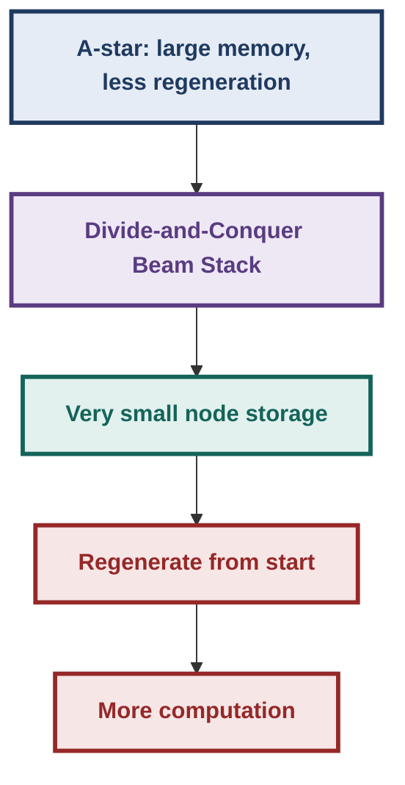

---

## 64. Complete Week 6 Comparison

| Method | Main selection / restriction | Main memory idea | Optimal/admissible? | Main cost |
|---|---|---|---|---|
| Branch & Bound | $g$ | keeps broad search | Yes | large search |
| A* | $g+h$ | OPEN + CLOSED | Yes with admissible $h$ | potentially exponential memory |
| Weighted A* | $g+wh$ | same general structure | Not guaranteed for $w>1$ | trades optimality for focus |
| IDA* | DFS with $f$ bound | path only | Yes under lecture assumptions | repeated searches |
| RBFS | best-first + backtracking | linear-space recursion | designed as optimal space-saving A* variant | regeneration/thrashing |
| Frontier Search | frontier + barred nodes | discard CLOSED | preserves optimal search under monotone condition | path reconstruction work |
| DCFS | Frontier Search + relay recursion | relay layers | preserves the underlying optimal search | extra recursive work |
| SMGS | memory-aware frontier search | boundary/relay layers, delete kernel | space-saving optimal-search framework | adaptive reconstruction/search work |
| Beam Search | best $w$ nodes per level | fixed beam | No | may discard optimal branch |
| BFHS | BFS restricted by $f\le U$ | prune outside upper-bound region | Lecture presents it as optimal | frontier can still be large |
| Divide-and-Conquer Beam Search | beam + boundary + relay | only a few layers | No | regeneration |
| Beam Stack Search | beam + explicit backtracking | Beam Stack stores alternatives | beam component remains inadmissible | backtracking |
| DC Beam Stack Search | beam stack + regeneration | constant node layers + Beam Stack | No | repeated regeneration |

---

## 65. The Main Design Pattern of Week 6

The seven lectures can be understood as progressively removing stored information.

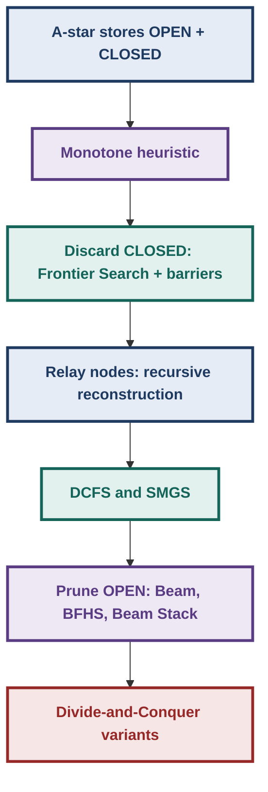

The central engineering principle is:

> **Every piece of memory that is removed must be replaced by either additional computation, a structural restriction, or a weaker guarantee.**

---

## 66. Important Distinctions

## 66.1 Admissible vs Monotone

| Property | Condition | Strength |
|---|---|---|
| Admissible | `h(n) ≤ h*(n)` | Global bound |
| Monotone | `h(m) − h(n) ≤ k(m,n)` | Stronger, local edge condition |

---

## 66.2 OPEN vs CLOSED

| Structure | Meaning |
|---|---|
| OPEN | frontier/candidates waiting to be expanded |
| CLOSED | already expanded/processed states |

Week 6 attacks both separately:

- Search-reduction order:
  - first prune CLOSED;
  - then prune OPEN.

---

## 66.3 Search space vs search time

A method can use less space and take more time.

Example:

- A* stores information to avoid regeneration.
- IDA* throws away information and regenerates it.
- Frontier Search throws away CLOSED and stores barriers.
- DCFS throws away more history and recursively reconstructs path segments.
- Divide-and-conquer beam-stack methods regenerate from the start.

---

## 66.4 Heuristic value vs evaluation value

Do not confuse:

$$
h(n)
$$

with

$$
f(n)=g(n)+h(n).
$$

Weighted A* changes the latter to:

$$
f_w(n)=g(n)+wh(n).
$$

The lecture's discussion of “heuristic becoming smaller toward the goal” concerns $h$; the monotone-condition discussion concerns the behavior of **$f$**.

---

## 67. Worked Mini-Traces for Exam Practice

## 67.1 Weighted A*

Given:

$$
(g,h)_{A}=(36,60),
\qquad
(g,h)_{B}=(24,70).
$$

For ordinary A*:

$$
f(A)=36+60=96
$$

$$
f(B)=24+70=94
$$

Choose $B$.

For $w=2$:

$$
f_2(A)=36+2(60)=156
$$

$$
f_2(B)=24+2(70)=164
$$

Choose $A$.

**Lesson:** changing $w$ changes the ordering.

---

## 67.2 Monotone edge test

Given:

$$
h(m)=90,
\quad h(n)=70,
\quad k(m,n)=25.
$$

Check:

$$
h(m)-h(n)=90-70=20.
$$

Since

$$
20\le25,
$$

this edge satisfies monotonicity.

---

## 67.3 Non-monotone edge

Suppose:

$$
h(m)=100,
\quad h(n)=60,
\quad k(m,n)=20.
$$

Then:

$$
h(m)-h(n)=40.
$$

But

$$
40>20.
$$

Therefore the edge violates the monotone condition.

---

## 67.4 Upper-bound pruning

Suppose a known solution has cost:

$$
U=150.
$$

For a candidate node:

$$
f(n)=157.
$$

Then:

$$
f(n)>U.
$$

Under the monotone/non-decreasing-$f$ setting:

$$
f(\text{descendant})\ge157>150.
$$

So no descendant can improve the known solution of cost 150.

Prune the branch.

---

## 67.5 Sequence alignment

Suppose:

- mismatch = 7
- Indel = 3.

Option A:

```text
X
Y
```

with one mismatch:

$$
Cost_A=7.
$$

Option B:

```text
X-
-Y
```

with two gaps:

$$
Cost_B=3+3=6.
$$

Therefore Option B is preferred.

If mismatch changes to 5:

$$
Cost_A=5<6=Cost_B.
$$

Therefore the preferred alignment changes.

---

## 68. Algorithm-Selection Mental Model

When faced with a question, ask in this order:

### Q1. Do I need optimality?

- If **no**, goal-directed methods such as Weighted A*/Beam-style methods may be considered.
- If **yes**, preserve admissibility/optimality conditions.

### Q2. Is memory the main problem?

- If yes, consider IDA*, RBFS, Frontier Search, DCFS, SMGS.

### Q3. Is CLOSED the main problem?

- Look for the monotone/consistent condition.
- Then Frontier Search becomes possible.

### Q4. Is OPEN the main problem?

- Consider upper-bound pruning.
- Beam Search, BFHS, Beam Stack Search and divide-and-conquer variants enter the picture.

### Q5. Do I need the actual path, not just its cost?

- Ordinary CLOSED/parent information makes path reconstruction straightforward.
- Space-saving methods may need relay nodes and recursive reconstruction.

---

## 69. Common Exam Traps

> **Exam trap 1:** $w>1$ in Weighted A* does not preserve ordinary A* admissibility automatically.

> **Exam trap 2:** $w=0$ gives $f=g$, i.e. Branch-and-Bound-like behavior; $w\to\infty$ approaches heuristic-dominated Best-First behavior.

> **Exam trap 3:** IDA* increases an $f$ bound to the next relevant exceeded $f$ value; it is not simply “depth + 1”.

> **Exam trap 4:** IDA* uses linear space because it uses DFS, but it can perform substantial repeated work.

> **Exam trap 5:** RBFS is not ordinary DFS. It uses $f$ values and remembers an alternative branch.

> **Exam trap 6:** RBFS can still thrash/re-expand because discarded information may have to be regenerated.

> **Exam trap 7:** Monotone means $h(m)-h(n)\le k(m,n)$ for an edge; it is stronger than mere admissibility.

> **Exam trap 8:** With a monotone heuristic, the important consequence is $f$ is non-decreasing along a path.

> **Exam trap 9:** With monotonicity, when A* expands a node, $g(n)=g^*(n)$; improved-cost propagation in CLOSED is unnecessary.

> **Exam trap 10:** Frontier Search does not simply delete CLOSED and hope for the best. It uses barred-node information to prevent backward leakage.

> **Exam trap 11:** Frontier Search's relay nodes exist mainly to solve the path-reconstruction problem created by discarding CLOSED.

> **Exam trap 12:** $g(n)\approx h(n)$ is the lecture's criterion for selecting a useful relay layer; it is not the definition of monotonicity.

> **Exam trap 13:** An upper bound $U$ is the cost of some known solution. Therefore $C^*\le U$; $U$ need not be optimal.

> **Exam trap 14:** If $f(n)>U$, the branch can be pruned only under the relevant non-decreasing-$f$ reasoning.

> **Exam trap 15:** Beam Search is space-efficient but inadmissible because it can discard the optimal branch.

> **Exam trap 16:** Beam Search in this week's path-search setting keeps the $w$ best successors; it does not require them to be better than the current node.

> **Exam trap 17:** BFHS and Beam Search are not the same: BFHS uses an upper-bound $f$ restriction; Beam Search uses fixed width.

> **Exam trap 18:** Beam Stack Search adds explicit backtracking; the Beam Stack records $f_{min}$ and $f_{max}$ information at each level.

> **Exam trap 19:** Divide-and-conquer methods save node memory by regenerating discarded information. Less memory therefore means more computation.

> **Exam trap 20:** In sequence alignment, changing mismatch/Indel penalties can change the optimal alignment.

---

## 70. Connection to Previous Weeks

## Week 2 → Week 6

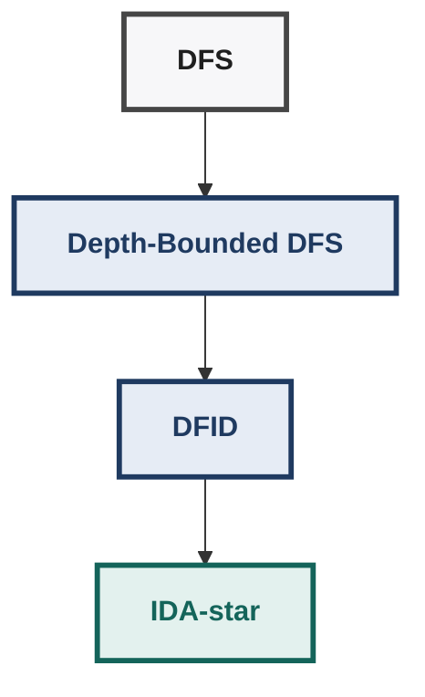

DFID changes a depth bound; IDA-star changes an f-value bound.

DFID repeatedly changes a **depth bound**.

IDA* repeatedly changes an **$f$-value bound**.

---

## Week 3 → Week 6

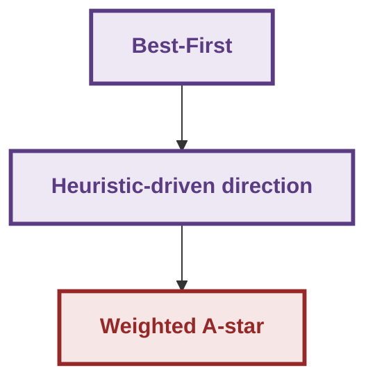

Weighted A* increases the influence of $h$ inside an A*-style global search.

---

## Week 3 → RBFS

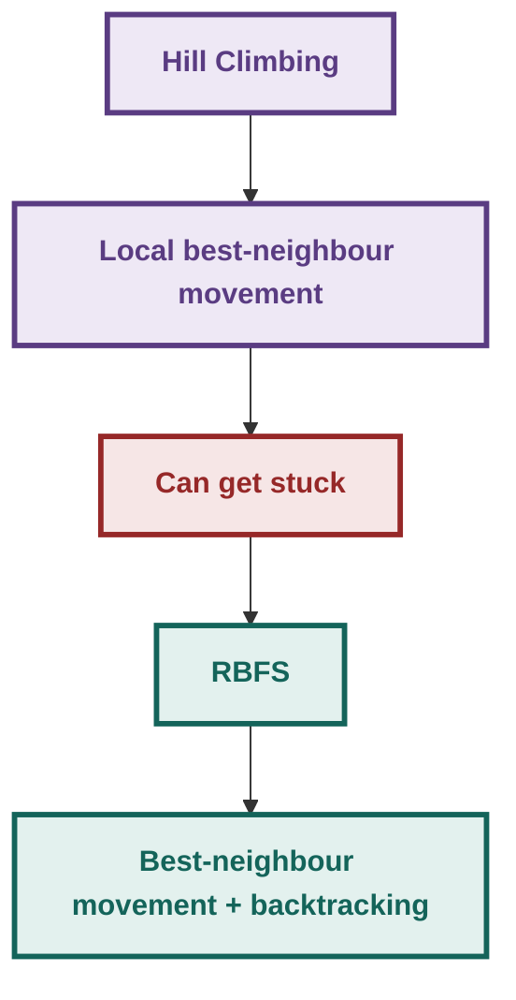

---

## Week 5 → Week 6

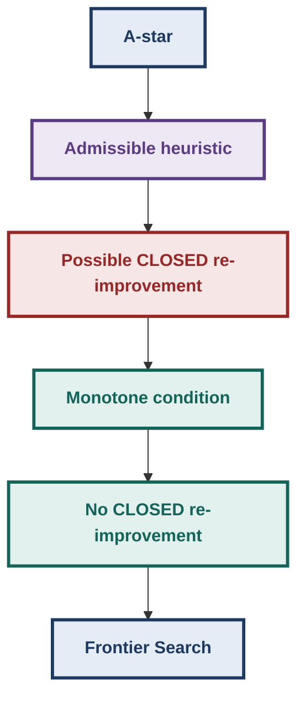

---

## 71. Lecture-Visual Summary

The important visual structures appearing across the seven Week 6 PDFs are:

### Weighted A*

Two competing paths with numerical $g$, $h$, and weighted-$f$ values. The visual demonstrates how changing $w$ changes the selected branch.

### Space-Saving A*

Nested/expanding search boundaries illustrate IDA*'s repeated bounded DFS.

### RBFS

A tree with backed-up values showing how a poor branch is abandoned and its parent values are updated from child values.

### Monotone Condition

Grid/graph examples annotate nodes with heuristic values and edge costs; the inequality $h(m)-h(n)\le k(m,n)$ is tested edge-by-edge.

### Sequence Alignment

A rectangular grid represents two strings. Diagonal, horizontal and vertical moves correspond to character alignment and gap insertion.

### Pruning CLOSED

A large explored region is separated into:

| Layer | Meaning |
|---|---|---|
| OPEN frontier | Candidates waiting to expand |
| Boundary and relay layer | Protects frontier, aids reconstruction |
| Kernel and discarded interior | Removed to save memory |

### Pruning OPEN

A cost boundary $U$ cuts off regions whose $f$ values are already too large. Beam and Beam Stack diagrams show progressively restricted windows through the frontier.

---

## 72. Final Mental Model

Week 6 is fundamentally about controlling the cost of A*.

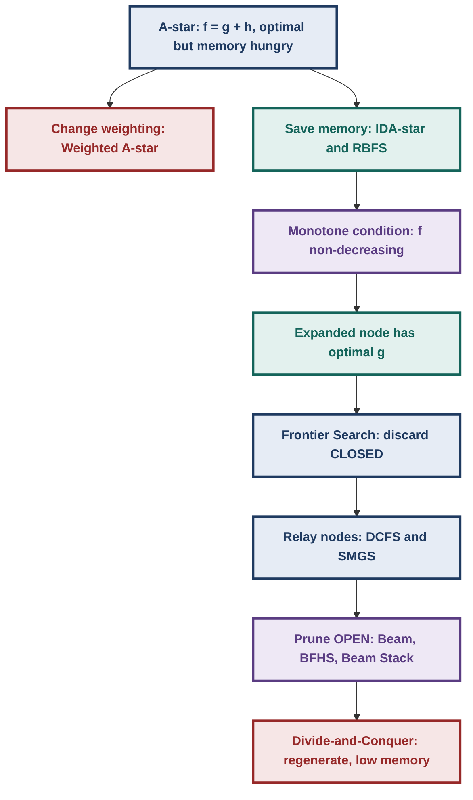

The recurring principle is:

$$
\boxed{\text{Memory saved}\quad\Longleftrightarrow\quad\text{information discarded}\quad\Longleftrightarrow\quad\text{work regenerated}.}
$$

Weighted A* explores less by changing the evaluation function. Space-saving A* variants explore with less stored history. Monotonicity makes it safe to discard certain historical cost information. Frontier Search discards CLOSED while retaining barriers and relay structure. OPEN-pruning methods restrict the frontier using width or an upper-bound cost.

---

## 73. 60-Second Revision

### Weighted A*

$$
f_w(n)=g(n)+wh(n)
$$

- $w=0$ → Branch-and-Bound-like.
- $w=1$ → A*.
- $w\to\infty$ → Best-First-like.
- Increasing $w$ makes search more goal-directed.
- $w>1$ can destroy admissibility.

### IDA*

- iterative deepening A*;
- DFS with an $f$-bound;
- initial bound $=f(S)=h(S)$;
- next bound = smallest exceeded relevant $f$ value;
- linear space;
- repeated work is the main cost.

### RBFS

- Korf, 1991;
- linear space;
- best-first direction + backtracking;
- keeps an alternative;
- backs up best child values;
- can regenerate nodes and thrash.

### Monotone / Consistent heuristic

$$
h(m)-h(n)\le k(m,n)
$$

- stronger than admissibility;
- implies non-decreasing $f$;
- when A* expands $n$:

$$
g(n)=g^*(n).
$$

- no CLOSED cost-improvement propagation needed.

### Sequence Alignment

- states = grid positions $(i,j)$;
- start = $(0,0)$;
- goal = $(N,M)$;
- diagonal = align characters;
- horizontal/vertical = insert gap;
- mismatch + Indel penalties determine optimal alignment;
- grid states grow quadratically;
- number of paths grows combinatorially;
- OPEN roughly linear, CLOSED roughly quadratic.

### Frontier Search

- keep OPEN/frontier;
- discard ordinary CLOSED;
- barred-node information prevents backward leakage;
- relay nodes preserve enough structure for path reconstruction;
- DCFS recursively solves start→relay and relay→goal.

### SMGS

- memory-aware;
- boundary nodes protect the frontier;
- kernel nodes are disposable interior nodes;
- boundary → relay when memory becomes scarce;
- can create multiple relay layers.

### OPEN pruning

- Beam Search keeps $w$ nodes per level;
- space ≈ $w\times d$;
- inadmissible;
- known solution cost $U$ gives upper bound;
- if $f(n)>U$, prune under monotone/non-decreasing-$f$ reasoning;
- BFHS = breadth-first search restricted by the $U$ boundary;
- Beam Stack Search = Beam Search + explicit backtracking;
- Beam Stack stores $f_{min}$ and $f_{max}$;
- divide-and-conquer variants regenerate discarded nodes.

---

## 74. Exam Checklist

- [ ] I can write the Weighted A* evaluation function $f_w=g+wh$.
- [ ] I can explain what happens at $w=0$, $w=1$, and $w\to\infty$.
- [ ] I can calculate and compare $f_w$ values for competing nodes.
- [ ] I can explain why $w>1$ can destroy admissibility.
- [ ] I can reproduce the lecture's Branch-and-Bound / A* / Weighted-A* / Best-First numerical comparison.
- [ ] I can explain why ordinary A* becomes more accurate as it approaches the goal.
- [ ] I can explain the difference between $h(n)$ and $f(n)$.
- [ ] I can explain why space-saving A* methods trade time for memory.
- [ ] I can derive IDA* from DFID.
- [ ] I can state IDA*'s initial bound and how the next bound is selected.
- [ ] I can trace at least two IDA* iterations by hand.
- [ ] I can explain why IDA* repeats work.
- [ ] I can explain the role of $\Delta$ in the constant-bound-increase idea.
- [ ] I can explain RBFS as informed hill climbing with backtracking.
- [ ] I can trace the RBFS bottom-up value backup.
- [ ] I can identify the second-best alternative used by RBFS.
- [ ] I can explain why RBFS can thrash.
- [ ] I can state the monotone/consistent condition exactly.
- [ ] I can test a graph edge for monotonicity numerically.
- [ ] I can derive why monotonicity implies non-decreasing $f$.
- [ ] I can distinguish admissibility from monotonicity.
- [ ] I can explain/prove why $g(n)=g^*(n)$ when A* expands $n$ under monotonicity.
- [ ] I can explain why improved-cost propagation in CLOSED becomes unnecessary.
- [ ] I can formulate sequence alignment as graph search.
- [ ] I can identify the three legal moves in the alignment grid.
- [ ] I can calculate an alignment cost from mismatch and Indel penalties.
- [ ] I can explain how changing the penalties changes the preferred alignment.
- [ ] I can draw the sequence-alignment grid and label start/goal.
- [ ] I can explain why the number of alignment paths is combinatorial.
- [ ] I can explain why OPEN is roughly linear while CLOSED is roughly quadratic in the alignment grid.
- [ ] I can state the two main purposes of CLOSED.
- [ ] I can explain Frontier Search without using the full CLOSED list.
- [ ] I can explain barred nodes and why they prevent backward leakage.
- [ ] I can explain the purpose of relay nodes.
- [ ] I can explain why $g(n)\approx h(n)$ is used as a relay-layer criterion in the lecture.
- [ ] I can explain DCFS as recursive start→relay and relay→goal search.
- [ ] I can explain the time/space trade-off of DCFS.
- [ ] I can distinguish boundary and kernel nodes in SMGS.
- [ ] I can explain when SMGS creates relay layers.
- [ ] I can explain why OPEN may grow exponentially in ordinary search.
- [ ] I can state the Beam Search width rule.
- [ ] I can explain why Beam Search is inadmissible.
- [ ] I can define an upper-bound solution cost $U$.
- [ ] I can explain why $f(n)>U$ permits pruning under the relevant monotone reasoning.
- [ ] I can distinguish BFHS from Beam Search.
- [ ] I can explain Divide-and-Conquer Beam Search's three retained layers.
- [ ] I can explain Beam Stack Search as Beam Search plus explicit backtracking.
- [ ] I can define $f_{min}$ and $f_{max}$ in the Beam Stack.
- [ ] I can explain why Divide-and-Conquer Beam Stack Search regenerates from the start.
- [ ] I can articulate the central Week 6 principle: less memory generally means more regeneration/computation.
