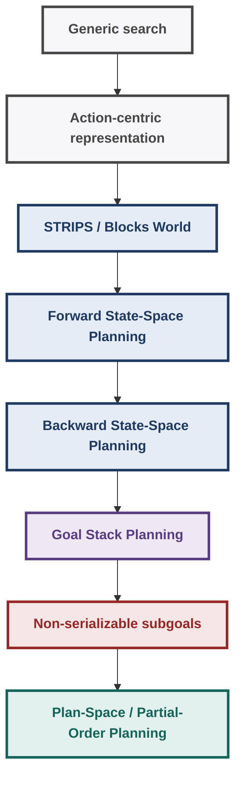
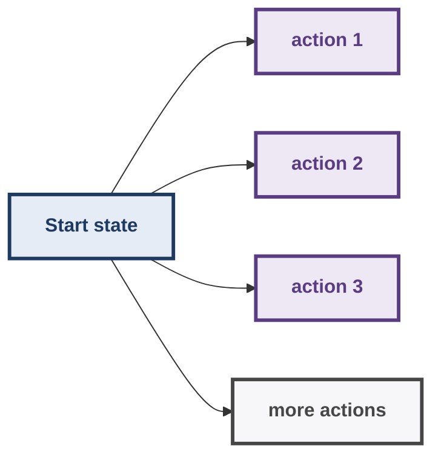
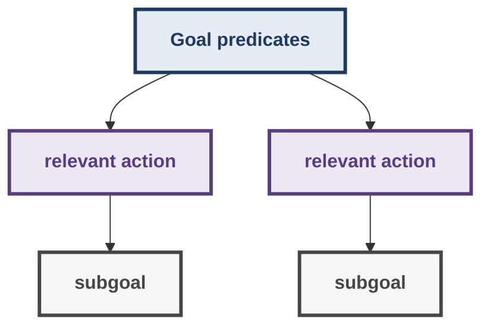
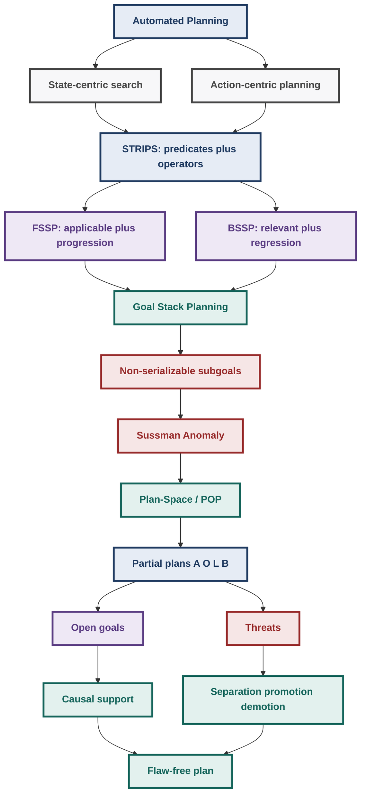

# AI: Search Methods for Problem Solving — Week 8 Notes

## Automated Planning: STRIPS, State-Space Planning, Goal Stack Planning & Plan-Space Planning

> **Source scope:** These notes are built around the eight Week 8 lecture PDFs supplied for this week: **Automated Domain Independent Planning**, **The Blocks World Domain**, **State Space Planning**, **FSSP vs. BSSP**, **Goal Stack Planning**, **Non-serializable Subgoals**, **Plan Space Planning**, and **Partial Order Planning — An Example**. The lecture terminology, examples, diagrams, caveats, and distinctions are retained as the primary reference.
>
> **Lecture structure:** automated/domain-independent planning → Blocks World and STRIPS → state-space planning → FSSP vs. BSSP → Goal Stack Planning → goal-ordering failure and Sussman’s Anomaly → Plan-Space / Partial-Order Planning.

---

## 1. Week 8: The Big Picture

Week 8 moves from generic search to **automated planning**.

Earlier search methods treated the state space as the central object:

- a state is a node,
- actions generate successor states,
- a solution is a path through states.

Planning introduces a more structured, **action-centric** representation:

- describe the world using predicates,
- describe actions/operators using preconditions and effects,
- reason about which actions are applicable to a state,
- reason about which actions are relevant to a goal,
- construct a plan that achieves a goal description.

The week then develops several planning strategies:

1. **Forward State-Space Planning (FSSP)** — start at the initial state and progress forward.
2. **Backward State-Space Planning (BSSP)** — start from the goal description and regress backward.
3. **Goal Stack Planning (GSP)** — use backward, goal-directed reasoning but construct the plan forward.
4. **Plan-Space / Partial-Order Planning (PSP/POP)** — search over partial plans rather than complete states, postponing ordering decisions until they are necessary.

The central progression is:



---

## 2. Configuration Problems vs. Planning Problems

The lecture distinguishes two broad kinds of problem solving.

## 2.1 Configuration problem

In a configuration problem, the objective is essentially:

> Find a node/state satisfying the required criteria.

Once an acceptable state is found, the problem is solved.

## 2.2 Planning problem

In a planning problem:

- there is a given situation/start state,
- there is a desired goal situation/goal description,
- the planner must determine **how to get from the start to the goal**,
- therefore the **path/sequence of actions matters**.

A planning solution is consequently a **plan**, i.e. a sequence of actions under the assumptions of the basic STRIPS/state-space setting.

---

## 3. Action-Centric View of Problem Solving

The lecture emphasizes a conceptual shift.

### State-centered view

Earlier search methods focus on states:

```text
S0 → S1 → S2 → ... → Sn
```

The solution can be represented as a path through states.

### Action-centric planning view

Planning focuses on named actions:

```text
Action1 → Action2 → Action3 → ...
```

The actions are applied to states, but the plan itself is naturally expressed as a sequence of actions.

The planning community therefore asks two important questions:

### Applicability

> Under what conditions can an action be applied to a given state?

### Relevance

> Under what conditions can an action help achieve a given goal?

This distinction is what later enables forward and backward planning to use different kinds of move generation.

---

## 4. Planning as Deliberation

The lecture presents planning as the **reasoning side of acting**.

An autonomous agent can be viewed as doing:

```text
Sense / perceive
      ↓
Deliberate / plan
      ↓
Act / execute
```

A planning agent:

1. perceives the world,
2. has objectives/goals,
3. has access to actions/operators,
4. searches or reasons for a plan,
5. executes the plan,
6. may monitor execution.

In a simple static domain, the agent is the only source of changes to the world. More realistic domains may include other agents or exogenous events that alter the world.

---

## 5. Different Dimensions of Planning Problems

The **Automated Domain Independent Planning** lecture explicitly separates several dimensions. These should not be confused with one another.

## 5.1 Complete vs. partial information

### Complete information

The agent knows exactly what is happening in the world.

Board games are a simple example used by the lecture.

### Partial information

The agent does not know the complete state of the world.

This is closer to realistic environments.

---

## 5.2 Hard satisfaction goals

A basic goal is a set of properties that must be true in the final state.

If the goal description is not satisfied, the plan is invalid.

---

## 5.3 Soft constraints / soft goals

Not every desirable condition must necessarily be achieved.

Example from the lecture:

- buy several things,
- eat at a restaurant,
- return home,
- perhaps forget to buy one item.

The plan may still be acceptable, but failure to achieve some desirable objectives can incur a **penalty**.

Thus, soft constraints influence how good a plan is rather than simply making it valid/invalid.

---

## 5.4 Final-state goals vs. trajectory constraints

A final-state goal constrains the state at the end.

A **trajectory constraint** constrains what happens along the path.

Lecture example:

> While driving around the countryside, require the route to remain within a specified distance of a medical center, restaurant, petrol pump, etc.

The important distinction is:

```text
Final-state constraint:
    What must be true at the end?

Trajectory constraint:
    What must remain true / what must happen during the path?
```

The lecture also mentions desirable/soft trajectory constraints.

---

## 6. Action Dimensions

Actions have multiple independent dimensions.

## 6.1 Deterministic vs. stochastic

### Deterministic action

The intended result always occurs.

Example:

```text
Pick up block A
→ robot ends up holding A
```

### Stochastic action

The intended result may not occur.

Lecture example: walking on slippery snow/ice. You intend to move forward but may slip and end up elsewhere.

The lecture connects stochastic planning with **Markov Decision Process (MDP)** style planning.

---

## 6.2 Instantaneous vs. durative

### Instantaneous

The action is treated as taking no explicit amount of time.

Example:

```text
pick-up(A)
```

### Durative

The action has a duration, with a beginning and end.

Example:

```text
boil water
start → wait → finish
```

The lecture emphasizes that **deterministic/stochastic** and **instantaneous/durative** are different dimensions.

An action can conceptually be:

- deterministic + instantaneous,
- deterministic + durative,
- stochastic + instantaneous,
- stochastic + durative.

Do **not** treat these as mutually exclusive pairs.

---

## 6.3 Action cost

Actions can have associated costs.

A planner can then evaluate a plan using its total cost, just as search algorithms can use edge costs.

---

## 7. Why Planning Is Hard

The lecture states that even very simple planning problems are computationally difficult: the simplest planning setting is described as requiring **polynomial space and exponential time**.

Additional complications can arise from:

- exogenous events,
- opening/closing times,
- other agents,
- collaborating agents,
- adversarial agents,
- agents competing for common resources.

The Week 8 material, however, deliberately focuses first on the much simpler STRIPS-style setting.

---

## 8. STRIPS Domains

The lecture introduces **STRIPS** as the simplest planning domain setting.

The lecture expands STRIPS as **Stanford Research Institute planning system**.

The STRIPS setting used here has the following simplifying assumptions:

- finite state set,
- finite action set,
- static environment except for changes caused by actions,
- complete information about the state,
- no other agents,
- hard goals,
- goals specified on the final state,
- instantaneous actions,
- deterministic actions.

This is deliberately a simple planning world.

---

## 9. State Transition System Formulation

The simplest planning domains can be modeled as a **state transition system**.

A state transition system contains:

```text
⟨S, A, γ⟩
```

where:

- `S` = finite set of states,
- `A` = finite set of actions,
- `γ` = transition function.

The transition function maps a state and an applicable action to a resulting state:

```math
γ(S, a) = S'
```

provided action `a` is applicable in `S`.

Thus:

```text
Current state + action
        ↓
   transition γ
        ↓
   resulting state
```

---

## 10. Planning Domain Description Languages (PDDL)

The planning community standardized how planning problems are represented through **Planning Domain Description Languages (PDDL)**.

The transcript occasionally renders the acronym as “PBDL”; the lecture/slides use **PDDL**.

The motivation is standardization:

- describe domains uniformly,
- describe states and actions in a standardized way,
- enable planners to work across many domains,
- enable planning competitions using common representations.

A planning task contains, at a high level:

1. **Objects** — entities in the world.
2. **Initial state** — what is true initially.
3. **Goal specification** — what must be true in the desired final situation.
4. **Actions/operators** — ways to change the world.

---

## 11. Goal Specification Is Usually a Partial State Description

This is a recurring and important Week 8 idea.

The **initial state** is completely specified in the Blocks World examples.

The **goal description** is usually only partially specified.

For example:

```text
Goal:
    on(A,B)
```

This does **not** specify:

- where C is,
- whether the robot arm is empty,
- what other blocks are doing,
- the complete configuration of the world.

Any state satisfying `on(A,B)` is a goal state.

Therefore one goal description can correspond to **many complete states**.

Think of:

```text
Goal description
      ↓
set of all complete states satisfying that description
```

This is important when comparing state descriptions with goal descriptions in FSSP and BSSP.

---

## 12. Operators vs. Actions

The lecture distinguishes generic operators from grounded actions.

### Operator

A generic template.

Example:

```text
pick-up(X)
```

where `X` is a variable.

### Ground / grounded action

A concrete instance.

Example:

```text
pick-up(A)
```

where `A` is a specific object.

Thus:

```text
Operator  → instantiate variables → Ground action
```

---

## 13. PDDL Evolution Mentioned in the Lecture

The lecture briefly surveys the progression of PDDL expressivity.

## PDDL 1.0

Corresponds to the basic STRIPS-style setting:

- instantaneous actions,
- deterministic actions,
- one acting agent in the simple model,
- completely known world.

## Conditional effects

An action can have effects whose truth depends on additional conditions.

Lecture example:

> If a book is in a bag and the agent walks to the office, then the book can also be considered to be in the office.

The important idea is that an effect itself can be conditional.

## PDDL 2.1

The lecture associates this richer language with features including:

- numerical fluents,
- plan metrics,
- durative actions.

### Numerical fluents

A fluent is a quantity/predicate whose value can change.

Example:

```text
fuel = 50
fuel = 42
fuel = 30
...
```

This allows planning to account for quantities such as remaining fuel.

### Plan metrics

Allow plans to be evaluated according to a metric/cost.

### Durative actions

Actions can have duration and explicit temporal structure.

## PDDL 2.2

The lecture discusses:

- **derived predicates**, and
- **timed initial literals**.

### Derived predicates

A predicate can follow as a consequence of another fact/effect without being directly listed as an action effect.

Lecture analogy:

```text
large block of ice in room
        ↓
room becomes cooler
```

The second fact can be treated as derived from the first.

### Timed initial literals

Used to model exogenous events/facts that become true at specified times.

Example:

```text
shop-open at 9:00
shop-close at 21:00
```

## PDDL 3.x

The lecture introduces richer trajectory/soft constraints.

Example trajectory requirement:

```text
If refrigerator door is opened,
then the plan must eventually include closing it.
```

This is not necessarily a final-state requirement; it constrains the trajectory.

## PDDL 3.1

The lecture mentions **object fluents**, i.e. functions that can return objects.

> For Week 8, the course confines most of the actual planning discussion to the simple STRIPS domain and only surveys these richer representations.

---

## 14. Blocks World Domain

The Blocks World is the main concrete domain used throughout Week 8.

It is primarily an **illustrative domain for domain-independent planning algorithms**, not a claim that the domain itself requires sophisticated planning.

The lecture explicitly notes that a simple domain-specific strategy could be:

```text
Take all blocks off their current configuration
            ↓
Put blocks on the table
            ↓
Construct the desired goal configuration
```

But this is domain-specific. The course is interested in **domain-independent planning**, so Blocks World is used to demonstrate the planning machinery.

---

## 15. Blocks World Assumptions

The lecture's Blocks World uses:

- a one-arm robot,
- an arbitrarily large table,
- blocks that can be stacked,
- each block can have at most one block directly on it,
- the robot can hold only one block at a time,
- no numerical dimensions are relevant,
- the representation is qualitative.

The state is represented as a set of true predicates.

---

## 16. Blocks World Predicates

The core predicates are:

| Predicate | Meaning |
|---|---|
| `on(X,Y)` | Block `X` is on block `Y` |
| `ontable(X)` | Block `X` is on the table |
| `clear(X)` | No block is on top of `X` |
| `holding(X)` | The robot arm is holding `X` |
| `AE` / `arm-empty` | The robot arm is holding nothing |

The state description stores predicates that are **true**.

If a predicate is removed from the state description through a negative effect/delete list, it is no longer true.

The lecture explicitly contrasts this with logical “negation by failure”: in the STRIPS-style representation here, negative effects are represented operationally by **deleting predicates from the state description**.

---

## 17. STRIPS Operator Structure

A planning operator has:

1. a name,
2. arguments/object types,
3. preconditions,
4. positive effects,
5. negative effects.

In original STRIPS terminology:

```text
positive effects → ADD list
negative effects → DELETE list
```

So an operator can be represented conceptually as:

- **Operator O**
  - name + arguments
  - preconditions
  - positive effects / ADD list
  - negative effects / DELETE list

A grounded action is an instance of such an operator with concrete arguments.

---

## 18. Standard Blocks World Operators

These four operators are central and should be memorized.

## 18.1 `unstack(X,Y)`

Meaning:

> Remove block `X` from the top of block `Y`.

### Preconditions

```text
AE
on(X,Y)
clear(X)
```

### Positive effects

```text
holding(X)
clear(Y)
```

### Negative effects

```text
¬AE
¬on(X,Y)
```

The lecture notes that `clear(X)` need not be explicitly removed merely because `X` is held; the exact representation of such a fact depends on the chosen modeling convention, and the lecture focuses on the predicates relevant to the example.

---

## 18.2 `pickup(X)`

Meaning:

> Pick up block `X` from the table.

### Preconditions

```text
AE
ontable(X)
clear(X)
```

### Positive effect

```text
holding(X)
```

### Negative effects

```text
¬AE
¬ontable(X)
```

---

## 18.3 `putdown(X)`

Meaning:

> Put a held block `X` onto the table.

### Preconditions

```text
holding(X)
```

### Positive effects

```text
ontable(X)
AE
```

### Negative effect

```text
¬holding(X)
```

---

## 18.4 `stack(X,Y)`

Meaning:

> Put held block `X` on top of clear block `Y`.

### Preconditions

```text
holding(X)
clear(Y)
```

### Positive effects

```text
on(X,Y)
AE
```

### Negative effects

```text
¬holding(X)
¬clear(Y)
```

The lecture's Partial Order Planning example explicitly notes a diagram omission: the negative effect `¬holding(A)` should be understood as present for `stack(A,B)` and similarly for stack/putdown actions where appropriate.

---

## 19. State Representation: Only True Predicates Are Stored

Suppose the state contains:

```text
AE
ontable(B)
on(A,B)
clear(A)
```

This means those predicates are true.

If an action deletes `on(A,B)`, the predicate is simply removed from the set.

Thus:

```text
S' = (S ∪ positive-effects(a)) \ negative-effects(a)
```

This is the **progression** operation used in forward planning.

---

## 20. State-Space Planning: Formal Machinery

## 20.1 Action applicability

An action `a` is applicable in state `S` if all its preconditions are satisfied in `S`.

Since both the state and preconditions are represented as sets:

```math
pre(a) \subseteq S
```

If this condition holds, the action can be executed.

---

## 20.2 Progression

If `a` is applicable in `S`, progression produces:

```math
S' = (S \cup effects^+(a)) \setminus effects^-(a)
```

where:

- `effects⁺(a)` = positive/add effects,
- `effects⁻(a)` = negative/delete effects.

The lecture emphasizes that progression produces a **legal state** in the modeled state space.

---

## 21. Plans in State-Space Planning

A plan is a sequence of actions:

```math
\pi = \langle a_1,a_2,\ldots,a_n\rangle
```

Starting from `S₀`:

```text
S₀ --a₁→ S₁ --a₂→ S₂ → ... --aₙ→ Sₙ
```

A plan is applicable if each action can be applied at the corresponding state.

The final state is obtained by progressing over all actions:

```math
S_n = \gamma(S_0,\pi)
```

A plan is **valid** for goal description `G` if:

```math
G \subseteq S_n
```

or equivalently:

```math
G \subseteq \gamma(S_0,\pi)
```

The goal description does not have to equal the entire final state.

---

## 22. Forward State-Space Planning (FSSP)

FSSP is the most direct extension of ordinary state-space search.

### Starting point

```text
Start state S₀
```

### Move generation

Generate all actions applicable in the current state.

### Transition

Progress the state over each applicable action.

### Direction

```text
Start → → → Goal
```

### Plan construction

Actions are added to the plan in the order they are executed:

```text
π = ()
π = (a₁)
π = (a₁,a₂)
π = (a₁,a₂,a₃)
...
```

---

## 23. Why FSSP Has High Branching

The initial state is **completely described**.

Therefore many actions can be applicable simultaneously.

In the Blocks World lecture diagrams, from one state the robot may be able to:

- unstack one block,
- unstack another block,
- pick up a block,
- put a held block down,
- stack a held block on several different clear blocks,
- etc.

After one action, the number of possible subsequent actions can again be large.

Therefore:

```text
Complete state description
        ↓
Many applicable actions
        ↓
Large branching factor
        ↓
Large search tree
```

Generic search algorithms such as DFS, BFS, or heuristic search can be applied, but the branching factor can be a serious drawback.

---

## 24. Backward State-Space Planning (BSSP)

BSSP begins from the **goal description** rather than the initial state.

The motivation is goal-directed reasoning.

A goal description is often much smaller than a complete state.

Example:

```text
Goal:
    on(G,A)
    on(B,J)
```

Rather than considering every action possible in the complete current state, BSSP asks:

> Which actions could make these goals true?

This can dramatically reduce branching.

---

## 25. Relevant Actions

In BSSP, the counterpart to an applicable action is a **relevant action**.

An action `a` is relevant to goal set `G` if:

```math
effects^+(a) \cap G \neq \varnothing
```

and

```math
effects^-(a) \cap G = \varnothing
```

In words:

1. the action must produce at least one goal predicate;
2. the action must not delete any predicate currently required by the goal description.

This is why backward search can ignore many actions that are irrelevant to the goal.

---

## 26. Regression

Backward planning uses **regression** rather than progression.

Suppose action `a` is selected as the action immediately before achieving goal `G`.

The regressed goal/subgoal is:

```math
G' = (G \setminus effects^+(a)) \cup pre(a)
```

Interpretation:

### Step 1 — Remove what `a` will achieve

If `a` will make a goal predicate true, that predicate does not need to be true before `a`.

Therefore remove its positive effects from the goal set.

### Step 2 — Add what `a` requires

For `a` to be executable, its preconditions must have been true beforehand.

Therefore add `pre(a)` to the regressed goal.

### Step 3 — Carry forward unaffected goals

Any goal not achieved by `a` remains in the subgoal.

---

## 27. Why Regression Is Not Closed Over Legal States

This is one of the most important FSSP-vs-BSSP ideas.

Progression has the property:

```text
legal state + applicable action
        ↓
legal resulting state
```

Regression does **not** necessarily have:

```text
feasible goal description + relevant action
        ↓
feasible goal description
```

A regressed goal can contain mutually incompatible predicates.

### Classic Blocks World problem

With a one-arm robot:

```text
holding(A)
holding(B)
```

cannot simultaneously be true.

But regression can produce such a subgoal because its formal regression rule only manipulates predicate sets. It does not automatically detect every physical consistency constraint.

Thus:

```text
Regression
   ↓
possible spurious subgoal
   ↓
possible spurious plan
   ↓
extra validity checking required
```

---

## 28. BSSP Termination Is Not Enough

In backward planning, search may reach a regressed goal `G₀` satisfying:

```math
G_0 \subseteq S_0
```

This says the regressed requirements are all true in the initial state.

However, because regression can generate spurious/infeasible subgoals, this does **not** by itself guarantee that the resulting action sequence is executable.

Therefore the lecture emphasizes an additional check:

> **Progress the candidate plan forward from the real start state.**

If the candidate plan is invalid, reject it and continue searching for another plan.

---

## 29. FSSP vs. BSSP — Side-by-Side

| Property | FSSP | BSSP |
|---|---|---|
| Starting point | Start state | Goal description |
| Direction | Forward | Backward |
| Move concept | Applicable action | Relevant action |
| Condition | `pre(a) ⊆ S` | `effects⁺(a) ∩ G ≠ ∅` and `effects⁻(a) ∩ G = ∅` |
| Transition | Progression | Regression |
| New object | State `S'` | Subgoal `G'` |
| Plan construction | Add action at end | Add action before current plan |
| Typical branching | High | Lower / more goal-directed |
| Main issue | Huge branching factor | Spurious/infeasible subgoals |
| Sound transition? | Yes, progression gives legal states | Regression can produce infeasible goal descriptions |
| Final validation | Goal test after progression | Must additionally progress/check candidate plan |

### Core intuition

```text
FSSP:
    “What can I do from here?”

BSSP:
    “What could have produced what I want?”
```

---

## 30. BSSP Example: Two Goal Predicates

Suppose:

```text
Goal = {on(G,A), on(B,J)}
```

Possible final actions:

```text
stack(G,A)  → produces on(G,A)
stack(B,J)  → produces on(B,J)
```

Therefore only these kinds of actions need to be considered initially.

For `stack(G,A)`, its relevant preconditions include:

```text
holding(G)
clear(A)
```

The regressed goal becomes conceptually:

```text
{on(B,J), holding(G), clear(A)}
```

The `on(G,A)` requirement disappears because `stack(G,A)` will create it.

The other goal `on(B,J)` remains because this action does not achieve it.

This illustrates the lower branching factor of backward planning.

---

## 31. The Spurious-Subgoal Example

A particularly important lecture example uses:

```text
Start:
    A, B, C all on the table

Goal:
    on(A,B)
    on(B,C)
```

Backward regression may reason:

1. choose `stack(A,B)` to achieve `on(A,B)`,
2. this introduces `holding(A)` and `clear(B)`, while retaining `on(B,C)`,
3. choose `stack(B,C)` to achieve `on(B,C)`, introducing `holding(B)` and `clear(C)`,
4. now the subgoal contains both:

```text
holding(A)
holding(B)
```

These cannot simultaneously hold for the one-arm robot.

Yet the regression mechanism itself can continue because it treats the goal description as a set of predicates.

This is the fundamental BSSP problem illustrated in Week 8.

---

## 32. The Invalid Plan Found by Naive Regression

The lecture shows how regression can effectively produce a candidate sequence such as:

```text
pickup(B)
pickup(A)
stack(B,C)
stack(A,B)
```

The candidate appears to regress all the way to requirements contained in the initial state.

But forward execution immediately exposes the problem:

```text
Initial state
    ↓ pickup(B)
robot is holding B
    ↓ pickup(A)
NOT APPLICABLE
```

Why?

`pickup(A)` requires `AE` / arm empty, but after `pickup(B)` the arm is not empty.

Therefore the candidate plan is invalid.

### Exam trap

> `G₀ ⊆ S₀` in BSSP does **not** automatically imply that the resulting plan is executable.

Always remember the required forward validity check.

---

## 33. Why Not Simply Permute the Actions?

The lecture explicitly discusses the idea of trying permutations of a bad backward-generated plan.

For a small example, rearranging actions might accidentally recover a valid plan.

But in general, searching over action permutations is expensive; with `n` actions, the permutation space can be on the order of:

```math
n!
```

The lecture therefore treats this as not being a satisfactory general solution.

---

## 34. Goal Stack Planning (GSP)

Goal Stack Planning is introduced as an attempt to combine the useful properties of FSSP and BSSP.

### FSSP advantage

- constructs plans forward,
- actions are actually applicable,
- therefore avoids the spurious-state problem of naive regression.

### FSSP disadvantage

- high branching factor.

### BSSP advantage

- goal-directed,
- lower branching factor because only relevant actions are considered.

### BSSP disadvantage

- regression can create spurious/infeasible subgoals.

### GSP idea

```text
Reason backward about goals
          ↓
low / focused branching
          ↓
but construct plan forward
          ↓
execute only applicable actions
```

This is the defining idea of Goal Stack Planning.

---

## 35. GSP Is a Linear Planner

GSP breaks a compound goal into individual subgoals and attempts to solve them **serially**.

For:

```text
G = {G1, G2, G3}
```

GSP conceptually does:

```text
solve G1
   ↓
solve G2
   ↓
solve G3
```

The resulting plan is a linear sequence of actions.

GSP is best suited to domains where goals can be solved independently/serially.

Lecture analogy:

> Cooking several dishes one after another is easy if solving one does not interfere with another.

---

## 36. Goal Stack: LIFO Is Crucial

The algorithm uses a stack.

A stack is **LIFO**:

```text
Last In → First Out
```

Therefore if goals are:

```text
G1, G2, G3
```

the order in which they are **pushed** determines the reverse order in which they are attempted.

This makes goal ordering a heuristic choice.

### Example

If you want to solve:

```text
G2 first
G1 second
```

you must push:

```text
G1
G2
```

because `G2` is popped first.

---

## 37. `PushSet(G)`

A core GSP operation is:

```text
PushSet(G, stack)
```

For a compound goal:

```text
G = {G1, G2, ..., Gn}
```

`PushSet` does two things:

1. push the **compound goal** `G`;
2. push the individual goals `G1, ..., Gn` in some order.

The individual goals are solved in LIFO order.

### Why push the compound goal too?

Because independently solving individual goals does **not** guarantee that their conjunction is still true.

Therefore the compound goal acts as a final consistency check:

```text
solve individual goals
       ↓
check compound goal
       ↓
if conjunction is false → solve again / continue
```

This becomes important when goals interact.

---

## 38. Current State Is Maintained at All Times

GSP maintains an explicit current state `S`.

Initially:

```text
S = start state
```

Whenever an action is popped and executed:

```text
S ← Progress(S, action)
```

Thus GSP's plan construction is forward and the planner always knows the actual state reached by the actions already committed to the plan.

---

## 39. What Happens When a Stack Item Is Popped?

There are three important cases.

## Case 1 — Individual goal `g`

If:

```text
g ∈ S
```

then the goal is already true.

Nothing needs to be done.

If:

```text
g ∉ S
```

then:

1. choose a relevant action `a` that achieves `g`;
2. push `a`;
3. push the preconditions of `a` using `PushSet(pre(a))`.

If no relevant action exists:

```text
FAILURE
```

---

## Case 2 — Compound goal `G`

If `G` is already true in the current state, nothing is needed.

If not, push the set again using `PushSet(G)`.

This ensures that the conjunction is actually re-established after the individual goals have been attempted.

---

## Case 3 — Action `a`

When an action reaches the top of the stack, its preconditions have already been established.

Therefore:

1. append `a` to the plan;
2. progress the current state over `a`.

```text
plan ← plan ◦ a
S ← Progress(S,a)
```

---

## 40. GSP Algorithm — Pseudocode

```text
GSP(givenState, givenGoal, actions):

    S ← givenState
    plan ← empty sequence
    stack ← empty stack

    PushSet(givenGoal, stack)

    while stack is not empty:
        x ← Pop(stack)

        if x is an action a:
            plan ← plan ◦ a
            S ← Progress(S, a)

        else if x is a compound goal G and G is not true in S:
            PushSet(G, stack)

        else if x is an individual goal g and g is not true in S:
            choose a relevant action a that achieves g

            if no such action exists:
                return FAILURE

            Push(a, stack)
            PushSet(pre(a), stack)

    return plan
```

### Important implementation note

The lecture uses a nondeterministic `CHOOSE` operation to simplify the algorithm description.

A real implementation needs to handle alternative relevant actions using **backtracking**.

For example, if a goal is `holding(B)`, possible relevant actions may include:

```text
pickup(B)
unstack(B,X)
```

The planner may need to try multiple choices.

---

## 41. GSP — Worked Example With Correct Goal Order

### Start state

Three blocks `A`, `B`, `C` are on the table.

Goal:

```text
on(A,B)
∧
on(B,C)
```

The correct final structure is a single tower:

| Stack | Bottom to top |
|---|---|
| Table | C, then B, then A on top |

i.e. `on(A,B)` and `on(B,C)`.

To achieve this, `B` must be placed on `C` **before** `A` is placed on `B`.

---

## 41.1 Choose the goal order

Desired solving order:

```text
on(B,C)
then
on(A,B)
```

Because the stack is LIFO, push them in the reverse order:

```text
Push on(A,B)
Push on(B,C)
```

The top of the stack is now `on(B,C)`.

---

## 41.2 Solve `on(B,C)`

`on(B,C)` is false in the current state.

Relevant action:

```text
stack(B,C)
```

Its important preconditions are:

```text
holding(B)
clear(C)
```

Push the preconditions.

`clear(C)` is already true.

`holding(B)` is false.

Relevant action for `holding(B)`:

```text
pickup(B)
```

Its preconditions are:

```text
ontable(B)
clear(B)
AE
```

All are true in the initial state.

Therefore `pickup(B)` is popped and executed.

Current state now includes:

```text
holding(B)
```

The action is appended to the plan:

```text
plan = [pickup(B)]
```

---

## 41.3 Execute `stack(B,C)`

Now its preconditions are satisfied:

```text
holding(B)
clear(C)
```

So:

```text
stack(B,C)
```

is executed.

Plan:

```text
[pickup(B), stack(B,C)]
```

Current configuration after these two actions:

| Stack | Bottom to top |
|---|---|
| Table | C, then B on top |
| Table | A alone on the table |

---

## 41.4 Solve `on(A,B)`

`on(A,B)` is still false.

Relevant action:

```text
stack(A,B)
```

Preconditions:

```text
holding(A)
clear(B)
```

`clear(B)` is true after stacking B on C.

`holding(A)` is false.

Relevant action:

```text
pickup(A)
```

Its preconditions are true in the current state:

```text
ontable(A)
clear(A)
AE
```

So execute:

```text
pickup(A)
```

then:

```text
stack(A,B)
```

Final plan:

```text
pickup(B)
stack(B,C)
pickup(A)
stack(A,B)
```

This is the four-action plan highlighted in the lecture.

---

## 42. Why the Correct GSP Order Works

The sequence respects the dependency:

```text
B must be on C
       ↓
then B can support A
       ↓
A can be stacked on B
```

The planner never creates an impossible intermediate state because every committed action is checked against the current state.

This is the main advantage of combining:

```text
backward goal selection
+
forward action execution
```

---

## 43. What Happens With the Wrong GSP Goal Order?

Suppose the planner tries:

```text
on(A,B)
first
on(B,C)
second
```

It can initially achieve `on(A,B)` easily:

```text
pickup(A)
stack(A,B)
```

Now the state contains A stacked on B, with C alone on the table:

| Stack | Bottom to top |
|---|---|
| Table | B, then A on top |
| Table | C alone on the table |

But the next goal is `on(B,C)`.

To stack B on C, B must be accessible/clear and the arm must be able to hold B.

Because A is currently on B, the planner has to undo part of the first goal:

```text
unstack(A,B)
putdown(A)
pickup(B)
stack(B,C)
```

Then the compound goal still requires:

```text
on(A,B)
```

so A must be picked up and stacked on B again.

Thus the wrong goal order can produce a **longer plan**.

---

## 44. Goal Ordering Matters

The lecture gives three increasingly important cases.

### Case 1 — Good order

A suitable order produces a short plan.

### Case 2 — Bad order

A bad order can produce:

- extra actions,
- undoing earlier work,
- a longer plan.

### Case 3 — Non-serializable subgoals

No fixed serial ordering can produce the optimal plan.

This third case is the fundamental limitation of linear Goal Stack Planning.

---

## 45. Non-Serializable Subgoals

Two or more subgoals are **non-serializable** when they cannot simply be solved one after another in some fixed order without undesirable interference.

More specifically in the lecture's sense:

> There is no optimal order for solving the subgoals serially.

Solving one goal may require temporarily undoing another goal, or solving parts of the goals in an interleaved manner.

Examples discussed:

- cooking processes with prerequisite ordering,
- the 8-puzzle viewed through subgoals,
- Rubik's Cube,
- Sussman's Anomaly.

---

## 46. Sussman's Anomaly

Sussman's Anomaly is the classic Blocks World example showing the limitation of linear Goal Stack Planning.

### Initial configuration

| Stack | Bottom to top |
|---|---|
| Table | A, then C on top |
| Table | B alone on the table |

More explicitly:

```text
on(C,A)
ontable(B)
```

### Desired goal

```text
on(A,B)
∧
on(B,C)
```

Final structure — a single tower:

| Stack | Bottom to top |
|---|---|
| Table | C, then B, then A on top |

---

## 47. Why Solving `on(B,C)` First Fails to Give the Optimal Plan

Start:

```text
C on A
B on table
A clear
B clear
```

First solve:

```text
on(B,C)
```

This can be achieved simply by:

```text
pickup(B)
stack(B,C)
```

Now B is stacked on C, which is stacked on A:

| Stack | Bottom to top |
|---|---|
| Table | A, then C, then B on top |

But to achieve `on(A,B)`, B must be accessible and C must be moved away from A as necessary.

The lecture's sequence requires undoing previous work and then rebuilding the desired configuration.

Thus solving `on(B,C)` completely before working on `on(A,B)` does not yield the optimal plan.

---

## 48. Why Solving `on(A,B)` First Also Fails

Start again:

```text
C on A
B on table
```

First solve `on(A,B)`:

1. unstack C from A,
2. put C down,
3. pick up A,
4. stack A on B.

Now A is on B, with C alone on the table:

| Stack | Bottom to top |
|---|---|
| Table | B, then A on top |
| Table | C alone on the table |

Then solve `on(B,C)`:

1. unstack A from B,
2. put A down,
3. pick up B,
4. stack B on C.

Now B is on C, but A is no longer on B.

Again, the first goal has been undone.

Thus neither fixed goal order yields the optimal serial solution.

---

## 49. The Optimal Sussman Plan

The lecture identifies a six-step solution by first clearing the obstruction and then building the final tower:

```text
1. unstack(C,A)
2. putdown(C)
3. pickup(B)
4. stack(B,C)
5. pickup(A)
6. stack(A,B)
```

So the optimal plan is **six actions** in the lecture's Sussman example.

The key structural idea is not simply “solve goal 1, then solve goal 2”.

Instead:

```text
Begin working on goal A-on-B
          ↓
reach a useful intermediate state
          ↓
shift attention to B-on-C
          ↓
complete B-on-C
          ↓
return to A-on-B
```

The goals have to be **interleaved**.

---

## 50. Why GSP Cannot Find the Optimal Sussman Plan

GSP insists on a linear commitment:

```text
Goal 1 completely
        ↓
Goal 2 completely
```

But Sussman's Anomaly requires:

```text
Partial work on Goal 1
        ↓
switch to Goal 2
        ↓
finish Goal 2
        ↓
return to Goal 1
```

Therefore GSP's rigid serial strategy is insufficient.

This motivates the next major planning representation:

> **Plan-Space / Partial-Order Planning.**

---

## 51. Plan-Space Planning (PSP)

State-space planning searches over states.

Plan-space planning instead searches over **plans**.

The lecture uses **PSP** and **POP (Partial-Order Planning)** essentially synonymously.

Conceptually:

```text
State-space planning:
    state → state → state → ...

Plan-space planning:
    partial plan → refined partial plan → ... → solution plan
```

The search space is the space of possible plans.

A plan does not initially have to be a complete solution. It can be a partially specified plan that is gradually refined.

---

## 52. Why Search Over Partial Plans?

A fully ordered plan commits to unnecessary decisions too early.

Partial-order planning instead says:

> Only impose an ordering when the ordering is necessary.

For example, if two actions do not interfere, the planner need not immediately decide which one occurs first.

This preserves flexibility.

The lecture's key motivation is therefore:

```text
GSP:
    forced linear ordering

POP:
    delay ordering decisions until required
```

This is precisely what allows POP to handle non-serializable subgoals such as Sussman's Anomaly.

---

## 53. Partial Plan: The 4-Tuple

A partial plan is represented as:

```math
\pi = \langle A,O,L,B \rangle
```

where:

| Component | Meaning |
|---|---|
| `A` | Set of partially instantiated operators/actions in the plan |
| `O` | Set of ordering links/constraints |
| `L` | Set of causal links |
| `B` | Set of binding constraints |

This tuple is one of the most important definitions of the Plan-Space Planning lecture.

---

## 54. Component `A`: Actions / Operators

`A` contains the actions that are somewhere in the plan.

They can be **partially instantiated**.

Example:

```text
stack(A, ?X)
```

means:

> Stack A onto some block, but the specific block has not yet been determined.

This is different from a grounded action:

```text
stack(A,B)
```

The partial plan therefore postpones some choices.

---

## 55. Component `O`: Ordering Links

`O` contains ordering constraints such as:

```math
A_i \prec A_j
```

meaning:

> Action `A_i` must occur before action `A_j`.

The partial plan can therefore be represented as a directed graph.

Importantly, not every pair of actions must be ordered.

Only required orderings are recorded.

---

## 56. Component `L`: Causal Links

A causal link is written conceptually as:

```math
(A_i, P, A_j)
```

meaning:

```text
Ai produces P
      ↓
   P is needed by Aj
      ↓
Aj consumes P
```

Thus:

- `A_i` = producer of `P`,
- `P` = protected proposition,
- `A_j` = consumer of `P`.

A causal link implicitly requires:

```math
A_i \prec A_j
```

because the producer must occur before the consumer.

Whenever a causal link is added, the corresponding ordering relation is also added.

---

## 57. Component `B`: Binding Constraints

Binding constraints restrict the values that variables in partially instantiated operators can take.

Examples:

```text
?X = ?Y
?X ≠ ?Y
?X = A
?X ≠ B
```

A variable can also be constrained to a subset of possible objects.

The lecture uses `?X` to make variables visually distinct from constants.

The exact notation is a convention; other literature may use other conventions.

---

## 58. Initial Partial Plan

Given a planning problem:

```math
S = \{s_1,s_2,\ldots,s_n\}
```

and

```math
G = \{g_1,g_2,\ldots,g_k\}
```

plus the available operators, plan-space planning begins with two dummy actions:

### `A₀` — initial action

- no preconditions,
- positive effects = all predicates in the initial state.

### `A∞` — final action

- preconditions = all goal predicates,
- no effects.

There is an ordering link:

```math
A_0 \prec A_\infty
```

The initial partial plan is:

```math
\pi_0 = \langle
\{A_0,A_\infty\},
\{A_0 \prec A_\infty\},
\varnothing,
\varnothing
\rangle
```

This is sometimes called the **empty plan** in the lecture because it contains only the dummy start/end structure and no real planning actions.

---

## 59. What Does the Empty Plan Represent?

The empty plan is not one complete action sequence.

It represents a space of possible completions.

Conceptually:

```text
Initial partial plan
        ↓
many possible refinements
        ↓
more constrained partial plans
        ↓
solution plan(s)
```

The search process adds actions, causal links, ordering constraints, and binding constraints until all flaws disappear.

---

## 60. Flaws in a Partial Plan

A partial plan can contain two fundamental kinds of flaws.

## 60.1 Open goal

A precondition of an action in the partial plan is not supported by any causal link.

Example:

```text
Action Aj requires P
but no action is currently linked as producer of P
```

Then `P` is an **open goal**.

---

## 60.2 Threat

Suppose:

```text
Ai --P--> Aj
```

is a causal link.

If another action `At` can potentially delete `P` before `Aj` consumes it, then `At` is a **threat** to that causal link.

Thus:

```text
Ai produces P
      ↓
     P
      ↓
Aj needs P

At may delete P
between Ai and Aj
```

The planner must eliminate the possibility of this disruption.

---

## 61. Solution Plan in POP

A partial plan is a solution when it has **no flaws**.

Therefore:

```text
Solution partial plan
    ⇔
no open goals
AND
no threats
```

Plan-space planning can therefore be understood as **systematic flaw removal**.

---

## 62. Resolving an Open Goal

Suppose action `A_p` has an unsupported precondition `P`.

There are two ways to support it.

## Option 1 — Existing action

Find an existing action `A_e` that produces `P`.

If it is consistent to place `A_e` before `A_p`, add:

```math
(A_e,P,A_p)
```

and:

```math
A_e \prec A_p
```

This creates the causal support.

### Special case

The dummy initial action `A₀` can support a precondition if that predicate is already true in the initial state.

---

## Option 2 — Insert a new action

If no existing action can provide `P`, insert an action `A_new` that produces `P`.

Then add:

```math
(A_{new},P,A_p)
```

and:

```math
A_{new} \prec A_p
```

The newly inserted action may itself introduce new open goals through its preconditions.

Thus the process continues recursively.

---

## 63. Threat Materialization

Suppose a causal link is:

```text
Ai --P--> Aj
```

An action `At` is potentially threatening if it has a negative effect `¬Q` such that `P` and `Q` can be **unified**.

For the threat to actually disrupt the causal link, three conditions must all hold:

### Condition 1 — The predicates can unify

`At` can delete something that corresponds to `P`.

### Condition 2 — Threat occurs after producer

```math
A_i \prec A_t
```

### Condition 3 — Threat occurs before consumer

```math
A_t \prec A_j
```

So materialization requires:

```text
At can delete P
AND
Ai < At
AND
At < Aj
```

Only then can `At` actually destroy the protected condition before it is consumed.

---

## 64. Unification in Threat Detection

The lecture uses the notion of **unification**.

Suppose the causal link protects:

```text
clear(A)
```

and a threat has a negative effect:

```text
¬clear(?Y)
```

If the binding constraints permit:

```text
?Y = A
```

then the threat can delete `clear(A)`.

If the variable is constrained so that:

```text
?Y ≠ A
```

then that particular threat cannot materialize.

---

## 65. Resolving Threats: Three Methods

To eliminate a threat, it is enough to invalidate at least one of the three conditions required for materialization.

There are three methods.

## 65.1 Separation

Prevent the threatening predicate from unifying with the protected predicate.

Example:

```text
?Y ≠ A
```

If the threat deletes `clear(?Y)` and the causal link protects `clear(A)`, this binding constraint prevents them from referring to the same block.

### What condition does separation break?

```text
Unification
```

---

## 65.2 Promotion

Force the threatening action to occur **before** the producer of the causal link.

Add:

```math
A_t \prec A_i
```

Then the threat cannot occur after `Ai` and before `Aj`.

### Intuition

```text
Threat
  ↓
Producer
  ↓
Consumer
```

The threat happens too early to damage the protected causal link.

---

## 65.3 Demotion

Force the threatening action to occur **after** the consumer.

Add:

```math
A_j \prec A_t
```

Then the threat occurs too late to disrupt the causal link.

### Intuition

```text
Producer
   ↓
Consumer
   ↓
Threat
```

---

## 66. Threat Resolution: Memorization Table

| Method | Added constraint | What is prevented? |
|---|---|---|
| **Separation** | Binding constraint such as `?X ≠ A` | Threat cannot unify with protected predicate |
| **Promotion** | `A_t ≺ A_i` | Threat occurs before producer |
| **Demotion** | `A_j ≺ A_t` | Threat occurs after consumer |

### Memory trick

```text
SEPARATE → change bindings
PROMOTE  → move threat earlier
DEMOTE   → move threat later
```

---

## 67. Partial-Order Planning Example

The lecture gives a small example.

## Initial state

```text
on(B,C)
ontable(C)
ontable(A)
clear(A)
clear(B)
AE
```

So the picture is:

| Stack | Bottom to top |
|---|---|
| Table | C, then B on top |
| Table | A alone on the table |

## Goal description

```text
ontable(B)
∧
on(A,B)
```

The location of C is not specified in the goal.

This again illustrates that a goal is a **partial state description**.

---

## 68. Initial POP Structure for the Example

Start with:

```text
A₀
 ↓
A∞
```

`A₀` produces the entire initial state.

`A∞` consumes the goal predicates as its preconditions.

Initially, the goal predicates are open goals because no causal links support them yet.

---

## 69. Resolve `on(A,B)`

To achieve:

```text
on(A,B)
```

insert:

```text
stack(A,B)
```

Add the causal link:

```text
stack(A,B) --on(A,B)--> A∞
```

and the corresponding ordering:

```text
stack(A,B) ≺ A∞
```

`stack(A,B)` introduces preconditions such as:

```text
holding(A)
clear(B)
```

These become open goals unless supported by existing actions.

---

## 70. Resolve `clear(B)`

`clear(B)` is already true in the initial state.

Therefore the dummy initial action `A₀` can support it:

```text
A₀ --clear(B)--> stack(A,B)
```

No new real action is necessary.

This is a useful example of an existing action resolving an open goal.

---

## 71. Resolve `holding(A)`

There are two conceptual ways to become `holding(A)`:

```text
pickup(A)
```

or

```text
unstack(A,X)
```

The lecture chooses `pickup(A)` because A is on the table and the action is directly applicable in the initial state.

Add:

```text
pickup(A)
```

and a causal link:

```text
pickup(A) --holding(A)--> stack(A,B)
```

The preconditions of `pickup(A)` are supported from the initial action `A₀` because they are true initially.

---

## 72. Resolve `ontable(B)`

Initially B is on C, not on the table.

To put B on the table, insert:

```text
putdown(B)
```

This creates the precondition:

```text
holding(B)
```

which must itself be supported.

---

## 73. Resolve `holding(B)`

The lecture chooses:

```text
unstack(B,C)
```

because the initial state contains:

```text
on(B,C)
clear(B)
AE
```

Thus `unstack(B,C)` is applicable in the initial state.

Add the causal link:

```text
unstack(B,C) --holding(B)--> putdown(B)
```

Its preconditions are all supported by `A₀`.

At this point, all open goals can be resolved.

---

## 74. Threats in the POP Example

After resolving all open goals, the plan still contains threats.

The lecture identifies **three threats**.

## Threat 1 — `stack(A,B)` vs. `unstack(B,C)`

`unstack(B,C)` requires:

```text
clear(B)
```

But `stack(A,B)` deletes:

```text
clear(B)
```

Therefore if:

```text
stack(A,B)
```

happens before:

```text
unstack(B,C)
```

then `unstack(B,C)` will no longer be applicable.

So `stack(A,B)` threatens the causal link protecting `clear(B)`.

---

## Threat 2 — arm-empty causal link

The `pickup(A)` action makes the arm non-empty.

If that occurs before an action that requires `AE`, it can threaten the corresponding causal link from the initial state.

---

## Threat 3 — another arm-empty causal link

Similarly, `unstack(B,C)` makes the arm non-empty and can threaten a causal link that relies on `AE` being true before another action.

Thus the example contains three threats before ordering constraints are added.

---

## 75. Resolve Threat 1 by Ordering

To ensure that `unstack(B,C)` gets to consume `clear(B)` before `stack(A,B)` deletes it, impose:

```text
unstack(B,C) ≺ stack(A,B)
```

This is a **demotion-style resolution** of the threat.

The causal link is safe because the threatening action now occurs only after the consumer has used the protected condition.

---

## 76. Resolve the Other Two Threats

The lecture adds the corresponding ordering constraints:

```text
unstack(B,C) ≺ pickup(A)
```

and:

```text
putdown(B) ≺ pickup(A)
```

These ensure that the arm-empty requirements are consumed before the actions that make the arm non-empty.

---

## 77. Final POP Plan for the Example

After adding the necessary ordering constraints, the plan becomes effectively linear in this small example:

```text
unstack(B,C)
        ↓
putdown(B)
        ↓
pickup(A)
        ↓
stack(A,B)
```

This gives the desired result:

| Stack | Bottom to top |
|---|---|
| Table | B, then A on top |
| Table | C alone on the table |

The lecture emphasizes that some transitive ordering links are not drawn because they are implied by the visible structure.

The essential ordering constraints are sufficient; explicitly drawing every transitive edge would be unnecessarily cluttered.

---

## 78. Causal Links: How to Read the POP Diagram

The lecture explains the visual notation used in its partial-order diagrams.

For example:

```text
A₀ -- ontable(A) --> pickup(A)
```

means:

- `A₀` produces `ontable(A)`,
- `pickup(A)` consumes `ontable(A)` as a precondition.

The grey/dotted causal-link arrows in the lecture diagrams represent this producer-to-consumer relationship.

Every open goal must eventually acquire such causal support.

---

## 79. Every Precondition Needs Support

This is a useful operational rule for POP.

For every action `A` in the partial plan:

```text
Every precondition P of A
        ↓
must be supported by a causal link
```

If not:

```text
P = open goal / flaw
```

The lecture explicitly stresses this when answering a student question about whether there must be at least one causal link.

The answer is effectively:

> Every open goal must have a causal link once the plan is complete.

---

## 80. POP vs. GSP

| Feature | Goal Stack Planning | Plan-Space / Partial-Order Planning |
|---|---|---|
| Search object | Goals/actions with explicit current state | Partial plans |
| Planning order | Linear | Partial / flexible |
| Goal handling | Solve serially | Can interleave subgoal work |
| Ordering commitment | Early | Delayed until needed |
| State maintained explicitly? | Yes | Plan represented through actions/links/constraints |
| Main issue | Non-serializable subgoals | More complex partial-plan reasoning |
| Key mechanism | Goal stack | Causal links + ordering + bindings |
| Handles Sussman's Anomaly naturally? | No, not with rigid serial strategy | Yes, by delaying/interleaving ordering decisions |

The conceptual difference is:

```text
GSP:
    “Which goal do I solve completely first?”

POP:
    “What actions must exist, what must they achieve,
     and which orderings are actually necessary?”
```

---

## 81. Why Partial Ordering Helps

Suppose two actions do not interfere.

A linear planner might commit:

```text
A before B
```

or:

```text
B before A
```

even though both are valid.

A partial-order planner can simply record neither relation initially.

Later, if a threat or causal dependency forces one order, the planner adds it.

Therefore POP avoids premature commitment.

This is the key structural reason it can represent plans that require interleaving or flexible ordering.

---

## 82. Plan Space Is Potentially Infinite

The lecture includes an important observation from the student discussion.

The space of possible action sequences can be infinite because actions can be repeated indefinitely.

For example:

```text
pickup(A)
putdown(A)
pickup(A)
putdown(A)
...
```

is an endlessly extendable sequence of actions.

Thus the plan space is not automatically finite merely because the domain contains finitely many blocks/actions.

This has consequences for search behavior if no solution exists: a planner can potentially continue exploring longer and longer plans.

---

## 83. A Unified View of Week 8

The week can be understood as progressively changing **what the planner searches over**.

## FSSP

Search over complete world states.

```text
S₀ → S₁ → S₂ → ...
```

## BSSP

Search over regressed goal descriptions.

```text
G → G' → G'' → ... → S₀-compatible subgoal
```

## GSP

Search through a stack of goals and actions while maintaining a real current state.

```text
Goal stack
    ↓
Applicable action
    ↓
Updated state
```

## POP / PSP

Search over partial plans.

```text
Partial plan
    ↓
remove flaw
    ↓
more constrained partial plan
    ↓
remove flaw
    ↓
solution plan
```

---

## 84. The Core Trade-Off Across the Planning Methods

### FSSP

```text
Sound forward progression
        ↑
        |
High branching
```

### BSSP

```text
Goal-directed / lower branching
        ↑
        |
Regression can create spurious subgoals
```

### GSP

```text
Goal-directed
+
forward applicability
        ↓
But linear goal ordering
        ↓
Fails on non-serializable subgoals
```

### POP

```text
Flexible partial ordering
+
causal reasoning
+
explicit threat resolution
        ↓
Can interleave subgoals
```

---

## 85. High-Value Formula Sheet

## Applicability

```math
pre(a) \subseteq S
```

## Progression

```math
S' = (S \cup effects^+(a)) \setminus effects^-(a)
```

## Valid forward plan

```math
G \subseteq \gamma(S_0,\pi)
```

## Relevance in BSSP

```math
effects^+(a) \cap G \neq \varnothing
```

and

```math
effects^-(a) \cap G = \varnothing
```

## Regression

```math
G' = (G \setminus effects^+(a)) \cup pre(a)
```

## Partial plan

```math
\pi = \langle A,O,L,B\rangle
```

## Causal link

```math
(A_i,P,A_j)
```

meaning:

```text
Ai produces P
Aj consumes P
```

with:

```math
A_i \prec A_j
```

## Threat materialization

All three are needed:

```text
At can delete/unify with P
AND Ai ≺ At
AND At ≺ Aj
```

## Threat resolution

```text
Separation: ?X ≠ object
Promotion:  At ≺ Ai
Demotion:   Aj ≺ At
```

---

## 86. High-Value Definitions

### Planning problem

A planning problem is described by a start state, a goal description, and a set of operators/actions.

### Applicable action

An action whose preconditions are satisfied in the current state.

### Relevant action

An action whose positive effects overlap the goal and whose negative effects do not delete any goal predicate.

### Progression

Forward application of an applicable action to a state.

### Regression

Backward transformation of a goal description by removing effects achieved by the selected action and adding that action's preconditions.

### Goal Stack Planning

A linear planner that reasons backward over goals using a stack but constructs the actual plan forward and progresses a current state.

### Non-serializable subgoals

Subgoals for which no fixed serial goal ordering gives the desired optimal plan; achieving one can require interleaving or undoing/revisiting earlier work.

### Partial plan

A plan represented by actions plus ordering constraints, causal links, and binding constraints rather than one fully ordered grounded action sequence.

### Open goal

A precondition in a partial plan that currently has no causal-link support.

### Threat

An action that can potentially delete a proposition protected by a causal link before that proposition is consumed.

### Causal link

A producer-consumer relationship stating that one action establishes a proposition required by another action.

---

## 87. Exam Traps and Common Confusions

## Trap 1 — Confusing applicable and relevant

```text
FSSP → applicable action
BSSP → relevant action
```

Applicable is checked against a **state**.

Relevant is checked against a **goal description**.

---

## Trap 2 — Reversing progression and regression

```text
FSSP → progression
BSSP → regression
```

---

## Trap 3 — Thinking regression always produces a valid state

False.

Regression can produce an infeasible/spurious goal description such as:

```text
holding(A) ∧ holding(B)
```

for a one-arm robot.

---

## Trap 4 — Assuming `G₀ ⊆ S₀` guarantees a valid BSSP plan

False.

The lecture explicitly requires a forward progression/validity check.

---

## Trap 5 — Confusing goal description with complete goal state

A goal such as:

```text
on(A,B)
```

does not specify the entire final state.

---

## Trap 6 — Forgetting LIFO in GSP

The last goal pushed is the first goal solved.

Therefore goal push order is the reverse of desired solving order.

---

## Trap 7 — Assuming GSP always finds an optimal plan

False.

A bad goal order can yield a longer plan.

---

## Trap 8 — Assuming a correct goal order always exists

False.

Sussman's Anomaly demonstrates **non-serializable subgoals**.

---

## Trap 9 — Confusing GSP with POP

GSP is fundamentally **linear**.

POP allows **partial ordering** and postpones commitments.

---

## Trap 10 — Causal link direction

For:

```text
Ai --P--> Aj
```

`Ai` **produces** `P`; `Aj` **consumes** `P`.

---

## Trap 11 — Threat vs. actual disruption

An action is initially a **potential threat**.

The threat materializes only when:

1. its negative effect can unify with the protected predicate,
2. it occurs after the producer,
3. it occurs before the consumer.

---

## Trap 12 — Promotion vs. demotion

```text
Promotion → threat earlier
Demotion  → threat later
```

Specifically:

```text
Promotion: At ≺ Ai
Demotion:  Aj ≺ At
```

---

## 88. Quick Worked Comparison: Same Goal, Four Planners

Suppose:

```text
Start:
A, B, C all on table

Goal:
on(A,B) ∧ on(B,C)
```

### FSSP

Asks:

```text
What actions are applicable now?
```

Potentially many actions are explored.

### BSSP

Asks:

```text
What actions could produce on(A,B) or on(B,C)?
```

Only relevant actions are considered initially, but regression can create incompatible requirements such as `holding(A)` and `holding(B)`.

### GSP

Chooses a goal ordering and solves goals serially.

With the right order it obtains the four-step solution for the simple all-on-table case.

With a bad order it may undo previous work.

### POP

Does not need to commit immediately to a total order.

It inserts actions to support open goals and adds ordering constraints only when causal/threat reasoning requires them.

---

## 89. Visual Mental Models From the Lecture Slides

## 89.1 FSSP

The State Space Planning slide shows a large complete state from which many actions can be selected.

Think:



High branching comes from the completeness of the current state description and the many applicable operators.

---

## 89.2 BSSP

The lecture diagrams show a small goal description with only a few predicates.

Think:



The search is focused, but regression may introduce inconsistent combinations.

---

## 89.3 GSP

The lecture's stack diagrams should be read from **bottom to top** as items are pushed, but the top item is popped first.

Remember:

```text
TOP OF STACK
    ↓
solved next
```

---

## 89.4 POP

The Partial Order Planning diagrams visually contain:

- action nodes,
- ordering links,
- causal-link arrows,
- open goals,
- threats,
- added ordering constraints.

The plan becomes progressively more constrained until no flaws remain.

---

## 90. Source Cross-Check: What Each Week 8 PDF Contributes

## Automated Domain Independent Planning

Focuses on:

- configuration vs planning,
- action-centric planning,
- planning as deliberation,
- complete/partial information,
- satisfaction goals,
- soft constraints,
- trajectory constraints,
- deterministic/stochastic actions,
- instantaneous/durative actions,
- action costs,
- STRIPS assumptions,
- state transition systems,
- PDDL and increasing expressivity.

## The Blocks World Domain

Focuses on:

- Blocks World predicates,
- state representation,
- operator structure,
- STRIPS add/delete lists,
- the four Blocks World operators,
- partial goal descriptions,
- applying an action and modifying the state.

## State Space Planning

Focuses on:

- applicability,
- progression,
- plans and plan validity,
- FSSP,
- high branching factor,
- BSSP,
- relevance,
- regression,
- spurious/infeasible regressed states,
- the need for forward validation.

## FSSP vs. BSSP

Focuses on the explicit comparison:

- state vs goal search,
- applicability vs relevance,
- progression vs regression,
- forward vs backward plan construction,
- validity test,
- goal/predicate terminology.

## Goal Stack Planning

Focuses on:

- combining FSSP and BSSP ideas,
- linear planning,
- `PushSet`,
- stack/LIFO ordering,
- current-state maintenance,
- action/goal/compound-goal handling,
- backtracking,
- detailed Blocks World example.

## Non-serializable Subgoals

Focuses on:

- why goal order matters,
- longer plans from bad order,
- dead-end possibility,
- non-serializable subgoals,
- Sussman's Anomaly,
- need for interleaving rather than rigid serial planning.

## Plan Space Planning

Focuses on:

- plan-space search,
- partial plans,
- `⟨A,O,L,B⟩`,
- initial/final dummy actions,
- open goals,
- threats,
- causal links,
- existing/new action support,
- threat materialization,
- separation/promotion/demotion.

## Partial Order Planning — An Example

Focuses on the complete worked POP example:

- initial partial plan,
- adding `stack(A,B)`,
- resolving open goals with `A₀`, `pickup(A)`, `putdown(B)`, `unstack(B,C)`,
- identifying three threats,
- resolving them with ordering links,
- obtaining the final four-action plan.

---

## 91. One-Page Concept Map



---

## 92. Fast Decision Rules for Exam Questions

When you see **“preconditions satisfied in a state”**:

```text
→ Applicability
→ FSSP
→ Progression
```

When you see **“which actions can achieve this goal?”**:

```text
→ Relevance
→ BSSP
→ Regression
```

When you see **“goal stack / LIFO”**:

```text
→ GSP
→ PushSet
→ goal ordering matters
```

When you see **“wrong order undoes previous goal”**:

```text
→ goal interaction
→ possibly non-serializable subgoals
```

When you see **“Sussman's Anomaly”**:

```text
→ no fixed serial goal order is optimal
→ need interleaving
→ motivates POP
```

When you see **`⟨A,O,L,B⟩`**:

```text
→ Partial Order / Plan-Space Planning
```

When you see **“precondition has no support”**:

```text
→ Open goal
```

When you see **“action may delete protected proposition”**:

```text
→ Threat
```

When you see **“prevent variable from becoming the threatened object”**:

```text
→ Separation
```

When you see **“force threat before producer”**:

```text
→ Promotion
```

When you see **“force threat after consumer”**:

```text
→ Demotion
```

---

## 93. 60-Second Revision

```text
Planning = find a sequence of actions from start to goal.

STRIPS = simple deterministic, instantaneous, completely observable planning model.

State = set of true predicates.
Operator = name + arguments + preconditions + positive effects + negative effects.

Applicable action:
    pre(a) ⊆ S

Progression:
    S' = (S ∪ effects+(a)) \ effects-(a)

Valid plan:
    G ⊆ final state

FSSP:
    start → goal
    applicable actions
    progression
    high branching

BSSP:
    goal → start
    relevant actions
    regression
    lower branching
    may create spurious/infeasible subgoals
    candidate plan must be checked forward

Relevant action:
    effects+(a) ∩ G ≠ ∅
    effects-(a) ∩ G = ∅

Regression:
    G' = (G \ effects+(a)) ∪ pre(a)

GSP:
    backward goal-directed reasoning
    forward plan construction
    stack = LIFO
    PushSet(compound goal + individual goals)
    current state maintained
    linear/serial planning

Goal-order problem:
    wrong order → longer plan / possible dead end

Non-serializable subgoals:
    no fixed serial order gives optimal solution

Sussman's Anomaly:
    must interleave subgoal work
    motivates non-linear / plan-space planning

POP / PSP:
    search over partial plans
    π = ⟨A,O,L,B⟩

A = actions/operators
O = ordering constraints
L = causal links
B = binding constraints

A0 = dummy initial action
A∞ = dummy final action

Open goal:
    unsupported precondition

Threat:
    action can delete protected causal-link proposition

Threat resolution:
    separation = prevent unification
    promotion = threat before producer
    demotion = threat after consumer

Solution POP plan:
    no open goals + no threats
```

---

## 94. Final Mental Model

The entire week can be remembered as one design problem:

> **How do we reduce irrelevant search while still producing a valid plan?**

### FSSP says

> Start from reality and try what is possible.

Correct, but potentially enormous branching.

### BSSP says

> Start from what you want and ask what could achieve it.

Focused, but regression can imagine impossible subgoals.

### GSP says

> Reason backward about what to achieve, but only execute forward actions whose preconditions are actually satisfied.

This avoids spurious execution, but it commits to a serial goal order.

### Sussman's Anomaly says

> Sometimes the goals cannot be solved one at a time.

### POP says

> Do not decide the whole action order prematurely. Build a partial plan, support its preconditions, and add ordering constraints only when causal requirements or threats force them.

That is the central conceptual arc of Week 8:

```text
High branching
      ↓
Goal-directed reasoning
      ↓
Spurious subgoals
      ↓
Forward-valid goal-stack execution
      ↓
Serial goal-order limitation
      ↓
Non-serializable subgoals
      ↓
Partial-order / plan-space reasoning
```

---

## 95. Week 8 Exam Checklist

- [ ] Know the difference between configuration and planning problems.
- [ ] Know why planning is described as action-centric.
- [ ] Know complete vs partial information.
- [ ] Know satisfaction goals, soft constraints, and trajectory constraints.
- [ ] Know deterministic vs stochastic actions.
- [ ] Know instantaneous vs durative actions and that these are independent dimensions.
- [ ] Know the STRIPS assumptions.
- [ ] Know the state transition system `⟨S,A,γ⟩`.
- [ ] Know PDDL's purpose and the richer features mentioned in the lecture.
- [ ] Memorize the Blocks World predicates.
- [ ] Memorize the four Blocks World operators and their preconditions/effects.
- [ ] Know `pre(a) ⊆ S`.
- [ ] Know progression exactly.
- [ ] Know what makes a plan valid.
- [ ] Know FSSP and why its branching factor is high.
- [ ] Know the definition of a relevant action.
- [ ] Know regression exactly.
- [ ] Understand why regression is not closed over feasible states.
- [ ] Understand why BSSP needs a forward validity check.
- [ ] Know the FSSP/BSSP comparison table.
- [ ] Understand Goal Stack Planning's motivation.
- [ ] Know `PushSet`.
- [ ] Remember LIFO and reverse push/solve order.
- [ ] Know the three kinds of stack items: individual goal, compound goal, action.
- [ ] Know when GSP returns failure.
- [ ] Understand the correct and wrong goal orders in the three-block example.
- [ ] Know what non-serializable subgoals mean.
- [ ] Be able to explain Sussman's Anomaly.
- [ ] Know why GSP cannot obtain the optimal interleaved solution for Sussman's Anomaly.
- [ ] Know why POP/PSP is introduced.
- [ ] Memorize `π = ⟨A,O,L,B⟩`.
- [ ] Know the roles of `A`, `O`, `L`, and `B`.
- [ ] Know the dummy initial/final actions `A₀` and `A∞`.
- [ ] Know what an open goal is.
- [ ] Know what a causal link means.
- [ ] Know what a threat is.
- [ ] Know the three conditions for threat materialization.
- [ ] Know separation, promotion, and demotion.
- [ ] Be able to trace the Partial Order Planning example.
- [ ] Know why every final action precondition must have causal support.
- [ ] Understand why partial ordering delays unnecessary commitments.
- [ ] Remember that the plan space can be infinite because action sequences can repeat indefinitely.

---

## 96. Source Visuals to Revisit Before the Exam

The lecture diagrams are especially useful for hand-tracing.

- **Automated Domain Independent Planning:** pages 1–16 — planning dimensions, planning agent, STRIPS assumptions, state-transition system, PDDL evolution.
- **The Blocks World Domain:** pages 1–10 — predicates, operator diagrams, complete initial state, partial goal description, action effects.
- **State Space Planning:** pages 1–16 — progression, FSSP branching, BSSP relevance/regression, spurious subgoal example.
- **FSSP vs. BSSP:** pages 1–6 — side-by-side conceptual comparison and the transition to GSP.
- **Goal Stack Planning:** pages 1–11 — `PushSet`, stack mechanics, algorithm, correct goal order and complete action trace.
- **Non-serializable Subgoals:** pages 1–7 — wrong goal order, non-serializable goals, Sussman's Anomaly, interleaving.
- **Plan Space Planning:** pages 1–11 — partial-plan tuple, initial/final actions, flaws, causal links, threat materialization, separation/promotion/demotion.
- **Partial Order Planning — An Example:** pages 1–12 — complete worked example from open goals through threat resolution to the final four-action plan.

---

## 97. Final Week 8 Takeaway

The most important chain to retain is:

```text
STRIPS representation
    ↓
State-space planning
    ↓
FSSP: applicable actions + progression
    ↓
BSSP: relevant actions + regression
    ↓
BSSP can create spurious subgoals
    ↓
GSP: backward goal selection + forward execution
    ↓
GSP is linear and depends on goal ordering
    ↓
Sussman's Anomaly exposes non-serializable goals
    ↓
POP/PSP: search over partial plans
    ↓
⟨A,O,L,B⟩ + causal links + ordering constraints
    ↓
remove open goals + resolve threats
    ↓
flaw-free partial plan = solution
```

**If you understand this chain rather than memorizing the algorithms independently, the whole Week 8 planning unit becomes much easier to reconstruct in an exam.**
