# AI: Search Methods for Problem Solving --- Week 9 Notes

## Problem Decomposition, Graphplan, AO\*, Goal Trees & Deduction in Logic

> **Course:** IIT Madras --- AI: Search Methods for Problem Solving\
> **Week 9 theme:** Moving from state-centered search and sequential
> planning toward **goal-directed decomposition**, **parallel
> planning**, **AND-OR search**, and **logical deduction as search**.
>
> **Primary lecture sequence:** Multi-armed Robots → Means-Ends Analysis
> → Graphplan → Problem Decomposition → Solving Goal Trees with AO\* →
> AO\*: An Example → Goal Trees: Deduction in Logic.

------------------------------------------------------------------------

## 1. Week 9 --- The Big Picture

Earlier weeks mostly viewed problem solving as searching through a
**state space**:

``` text
Start state
    ↓
possible actions
    ↓
successor states
    ↓
possible actions
    ↓
Goal state
```

Week 8 planning extended this to plans and partial orders. Week 9
changes the viewpoint again:

``` text
STATE-CENTERED SEARCH
        ↓
"What state should I move to next?"

GOAL-DIRECTED REASONING
        ↓
"What must I achieve to solve this goal?"
        ↓
Break the goal into sub-goals
        ↓
AND / OR structure
        ↓
Solve a SUBTREE rather than a single path
```

The key conceptual transition is:

$$
\boxed{
\text{Search through states}
\;\longrightarrow\;
\text{Search through decompositions of a goal}
}
$$

This leads to several related ideas:

| Week 9 topic | Central idea |
|---|---|
| Multi-armed robots | Parallel actions can shorten a plan |
| Means-Ends Analysis | Attack the most important difference between current and desired states |
| Graphplan | Build a planning graph first, then search inside it |
| Problem Decomposition | Break a goal into smaller problems |
| AND-OR / Goal Trees | Some sub-goals are alternatives; others must all be solved |
| AO* | A* generalized to AND-OR graphs |
| Goal Trees + Logic | Backward chaining searches for proofs using the same AND-OR structure |

------------------------------------------------------------------------

## 2. Multi-Armed Robots

## 2.1 Motivation

Earlier Blocks World planning assumed a **one-arm robot**.

With one arm:

-   only one physical action can be executed at a time;
-   therefore the final plan is necessarily sequential;
-   even if two actions are logically independent, they cannot
    physically happen simultaneously.

With multiple arms, independent actions may happen **in parallel**.

For example:

``` text
Arm 1: unstack B from C
Arm 2: pick up A
             ↓
        same time step
```

Therefore:

$$
\boxed{\text{multiple arms} \Rightarrow \text{potentially smaller makespan}}
$$

The lecture explicitly frames this as an exploratory extension of the
Blocks World rather than a major literature treatment.

------------------------------------------------------------------------

## 2.2 Connection to Partial-Order Planning

The lecture uses several names for the same broad planning approach:

-   plan-space planning
-   partial-order planning
-   nonlinear planning
-   least-commitment planning

### Partial-order idea

You impose ordering constraints **only where necessary**.

If:

``` text
Action A and Action B
```

do not interfere, the plan need not specify:

$$
A \prec B
$$

or

$$
B \prec A
$$

They may be executed in parallel.

With one arm, however, physical resource constraints force a total
order.

------------------------------------------------------------------------

## 2.3 Example: One Arm vs Two Arms

The lecture first revisits a simple Blocks World situation.

With one arm, four actions were required:

1.  Unstack `B` from `C`.
2.  Put `B` on the table.
3.  Pick up `A`.
4.  Stack `A` onto `B`.

So:

$$
\boxed{\text{makespan}=4}
$$

With two arms, actions that were previously sequential may be
parallelized.

The lecture then gives a larger example.

### Initial state

Two columns on the table:

| Stack | Bottom to top |
|---|---|
| Left table | A, then D on top |
| Right table | B, then C on top |

Thus `on(D,A)` and `on(C,B)`.

$$
on(D,A)
$$

and

$$
on(C,B)
$$

### Goal

We want:

$$
on(C,A)
$$

and

$$
on(D,C)
$$

So the desired final arrangement is a single tower:

| Stack | Bottom to top |
|---|---|
| Table | A, then C, then D on top |

------------------------------------------------------------------------

## 2.4 One-Arm Solution

With one arm:

### Step 1

Unstack `D` from `A`.

### Step 2

Put `D` somewhere, e.g. on the table.

### Step 3

Unstack `C` from `B`.

### Step 4

Put `C` on `A`.

### Step 5

Pick up `D`.

### Step 6

Stack `D` onto `C`.

Therefore:

$$
\boxed{6\text{ time steps}}
$$

The question is whether two arms can do better.

------------------------------------------------------------------------

## 3. Modifying STRIPS for Multiple Arms

## 3.1 Naive Two-Arm Representation

One possibility is to duplicate every arm-specific action.

For example:

``` text
stack1(...)
stack2(...)
pickup1(...)
pickup2(...)
unstack1(...)
unstack2(...)
```

Likewise, separate predicates:

``` text
holding1(X)
holding2(X)

AE1
AE2
```

where:

-   `holding1(X)` = Arm 1 is holding X
-   `holding2(X)` = Arm 2 is holding X
-   `AE1` = Arm 1 is empty
-   `AE2` = Arm 2 is empty

### Problem

This does not scale.

For $N$ arms, we would keep adding separate operators for each arm.

------------------------------------------------------------------------

## 3.2 Parameterized Arm Number

A more general representation uses an arm variable/number:

$$
pickup(N,X)
$$

$$
holding(N,X)
$$

$$
AE(N)
$$

where $N$ identifies the arm.

Thus the same operator can work for:

``` text
N = 1
N = 2
N = 3
...
```

This is much more scalable.

------------------------------------------------------------------------

## 4. The `clear(X)` Subtlety

This is an important Week 9 distinction.

Suppose:

$$
clear(A)
$$

is a precondition of:

$$
unstack(A,B)
$$

The question is:

> After unstacking A from B, should `clear(A)` still be true?

There are two possible representations.

------------------------------------------------------------------------

## 4.1 Do NOT Delete `clear(A)`

The original single-arm Blocks World formulation can leave `clear(A)`
true.

The intuition is:

-   A was clear before being picked up.
-   In the one-arm setting, after picking A up, the only meaningful next
    operations are to:
    -   put A down, or
    -   stack A somewhere.
-   At the end of either operation, A is clear again.

So the distinction does not cause trouble in the one-arm setting.

------------------------------------------------------------------------

## 4.2 Delete `clear(A)`

For the multi-arm case, the lecturer examines the alternative:

``` text
pickup/unstack:
    delete clear(A)
```

Then consistency requires:

``` text
stack/putdown:
    add clear(A)
```

So:

$$
pickup/unstack
\Rightarrow
\neg clear(A)
$$

and later:

$$
stack/putdown
\Rightarrow
clear(A)
$$

------------------------------------------------------------------------

## 4.3 Why Does This Matter?

With multiple arms, another arm may interact with a block while the
first arm is still holding it.

Therefore, whether the held block is represented as `clear` affects
which other actions can legally occur.

This is a representation issue, not merely an implementation detail.

> **Exam trap:** In a one-arm formulation, the two representations may
> behave equivalently. In a multi-arm formulation, they can produce
> different plans and different makespans.

------------------------------------------------------------------------

## 5. Two-Armed Solution --- With `clear` Deleted

Using the representation where `clear(X)` is deleted when X is picked
up/unstacked:

### Time step 1

Both arms work simultaneously:

``` text
Arm 1: unstack D from A
Arm 2: unstack C from B
```

So:

$$
\boxed{\text{Step 1: unstack}(D,A)
\parallel
\text{unstack}(C,B)}
$$

After this:

``` text
Arm 1 holds D
Arm 2 holds C
A is clear
C is NOT clear
```

### Time step 2

We can stack C onto A:

``` text
Arm 2: stack C onto A
```

This restores:

$$
clear(C)
$$

### Time step 3

Now D can be stacked onto C:

``` text
Arm 1: stack D onto C
```

Therefore:

$$
\boxed{\text{makespan}=3}
$$

The partial plan is:

``` text
t1: unstack(D,A)  ||  unstack(C,B)
t2: stack(C,A)
t3: stack(D,C)
```

------------------------------------------------------------------------

## 6. Two-Armed Solution --- Without Deleting `clear`

Now suppose `clear(X)` remains true after pickup/unstack.

After time step 1:

``` text
Arm 1 holds D
Arm 2 holds C

clear(D) = true
clear(C) = true
```

Therefore both stacking actions can happen in the same time step:

``` text
Time 1:
    unstack(D,A) || unstack(C,B)

Time 2:
    stack(D,C)   || stack(C,A)
```

Thus:

$$
\boxed{\text{makespan}=2}
$$

This is shorter than the previous 3-step plan.

### Why?

Because `clear(C)` remains true, so stacking D onto C does not have to
wait for another action.

------------------------------------------------------------------------

## 7. Important Consequence: Multi-Arm Operators Can Permit Extreme Parallelism

The lecturer points out a consequence of this operator representation.

If there are many arms and many blocks are held, multiple stack/putdown
operations may be possible simultaneously.

For example, with five arms holding five blocks, the representation
could permit constructing a tower of five blocks in one time step,
depending on the exact operator definitions.

This reveals a modeling issue:

> **The logical representation of the domain determines which parallel
> actions are considered legal.**

The lecture then poses a further exercise:

> Modify the domain so that the robot can hold two blocks, but not three
> or four.

In ordinary STRIPS, predicates are Boolean:

``` text
true / false
```

There is no direct numeric capacity counter.

So representing a capacity such as "at most two blocks" requires
additional modeling machinery.

------------------------------------------------------------------------

## 8. Makespan

The lecture uses **makespan** to mean the number of time steps required
by a parallel plan.

Example:

``` text
t1: A || B
t2: C
t3: D || E
```

has:

$$
\boxed{\text{makespan}=3}
$$

It is therefore different from simply counting the total number of
actions.

Here:

-   total actions = 5
-   makespan = 3

------------------------------------------------------------------------

## 9. Partial-Order Planning and Parallel Execution

The lecture gives a simple everyday example.

Suppose a morning routine has:

``` text
1. Wear clothes

2. Wear left sock
3. Wear left shoe

4. Wear right sock
5. Wear right shoe
```

The required ordering constraints are:

$$
1 \prec 2
$$

$$
2 \prec 3
$$

$$
1 \prec 4
$$

$$
4 \prec 5
$$

But there is no required ordering between:

``` text
left sock
right sock
```

or between:

``` text
left shoe
right shoe
```

Therefore the partial-order plan allows parallelism:

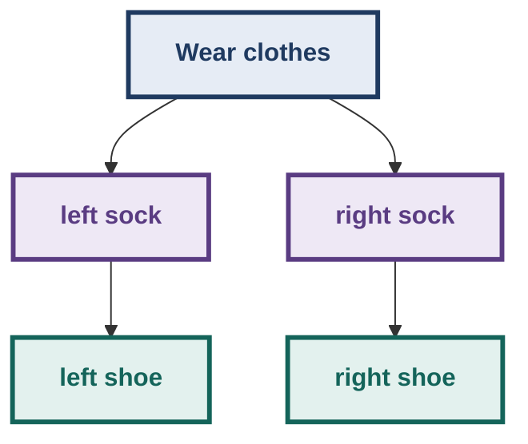

A linear plan can still be produced by taking **any topological
ordering** consistent with these constraints.

------------------------------------------------------------------------

## 10. Partial Order vs Linearization

A partial-order plan can be:

1.  Executed in parallel, or
2.  Linearized into a valid sequential plan.

For example:

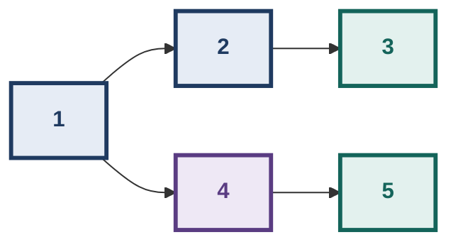

Many linear sequences may satisfy the same constraints.

> **Key distinction:** A partial plan specifies the ordering constraints
> that are necessary; a linearization chooses one complete order
> satisfying those constraints.

------------------------------------------------------------------------

## 11. Action Selection vs Action Scheduling

The lecturer makes an important planning distinction.

There are two different questions:

1.  **Which actions belong in the plan?**
2.  **When should those actions be scheduled?**

Earlier planners often combine these.

### Forward state-space planning

The first action selected is the first action scheduled.

### Backward state-space planning

The first action selected is the **last** action scheduled, because
reasoning begins from the goal.

### Goal-stack planning

Similarly, the first proposed action can correspond to a later action in
the final plan.

### Plan-space planning

Plan-space planning separates the two:

``` text
select necessary actions
        ↓
delay commitment to their ordering
        ↓
schedule only when necessary
```

This is the **least-commitment** idea.

------------------------------------------------------------------------

## 12. Means-Ends Analysis

## 12.1 Motivation

Earlier planning methods largely construct action sequences:

``` text
state → action → state → action → ...
```

Humans often reason differently.

Instead of asking:

> "What is the next action?"

we may ask:

> "What is the biggest thing preventing my current state from being my
> desired state?"

This is the idea behind **Means-Ends Analysis**, associated with Newell
and Simon and their work on the **General Problem Solver (GPS)**.

------------------------------------------------------------------------

## 12.2 Core Procedure

Given:

-   current state $S$
-   desired state/goal $G$

### Step 1 --- Compare

Find the differences:

$$
D(S,G)=\{\text{differences between current and desired states}\}
$$

### Step 2 --- Evaluate differences

Determine which differences are:

-   larger,
-   more important,
-   more urgent.

### Step 3 --- Consult an operator-difference table

The table tells us which operators can reduce particular differences.

### Step 4 --- Reduce the largest/most important difference

Choose an operator $O_i$ that addresses the difference.

### Step 5 --- Achieve the operator's preconditions

The operator itself may have preconditions.

Therefore solve those recursively.

### Step 6 --- Apply the operator

Once its preconditions are satisfied:

$$
S \xrightarrow{O_i} S'
$$

### Step 7 --- Resume the original goal

Now solve:

$$
G\text{ from }S'
$$

------------------------------------------------------------------------

## 13. Means-Ends Analysis --- Structure

The basic recursive pattern is:

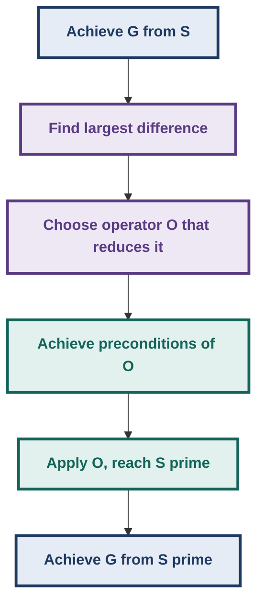

This naturally introduces an AND structure:

``` text
Achieve G
   |
   +---- reduce largest difference
   |
   +---- achieve G from resulting state
```

Both parts are required.

------------------------------------------------------------------------

## 14. Worked Example --- Trip to Parashar Lake

The lecture uses a trip from IIT Madras to **Parashar Lake in Himachal
Pradesh**.

Suppose the current state is:

``` text
Location = IIT Madras
```

Desired state:

``` text
Location = Parashar Lake
```

The difference can be thought of as geographical distance.

------------------------------------------------------------------------

## 14.1 Operator-Difference Table

A simplified version from the lecture:

| Difference / distance | Available means |
|---|---|
| over 5000 km | Airplane |
| 100 to 5000 km | Airplane, train, car |
| 1 to 100 km | Train, car, taxi, bus |
| under 1 km | Car, bus, taxi, walking |

The exact thresholds are illustrative; the important concept is the
**operator-difference table**.

------------------------------------------------------------------------

## 14.2 First Decomposition

The largest difference is the long geographical distance.

So choose a major operator:

``` text
Flight: Chennai → Delhi
```

But this does not completely solve the original problem.

It creates subproblems:

``` text
IIT Madras → Chennai Airport
Delhi Airport → Parashar Lake
```

These are recursively solved.

For example:

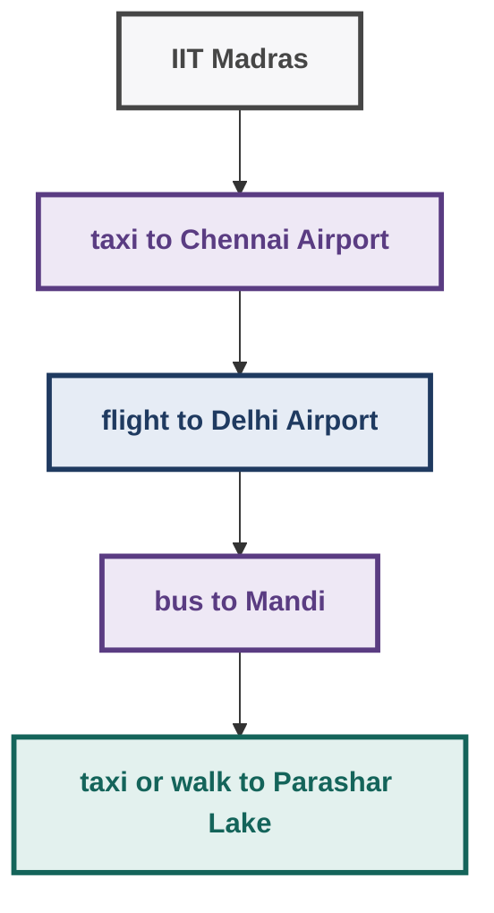

The key point is that the planner first chooses a **high-level action in
the middle of the eventual plan**, rather than constructing the entire
plan from the start one action at a time.

------------------------------------------------------------------------

## 15. Why Means-Ends Analysis Is Interesting

The lecturer emphasizes that this resembles human planning.

Instead of:

``` text
"What can I do from here?"
```

we ask:

``` text
"What is the largest obstacle between here and the goal?"
```

Then:

$$
\boxed{
\text{Difference}
\rightarrow
\text{operator that reduces difference}
\rightarrow
\text{subproblems}
}
$$

This is strongly related to the later Week 9 idea of **problem
decomposition**.

------------------------------------------------------------------------

## 16. Hierarchical Planning

The lecture briefly introduces another related idea.

Instead of immediately specifying low-level actions, define a high-level
operation.

Example:

``` text
High-level goal:
Plan a holiday to Himachal
```

Possible preconditions:

``` text
Have money
Have leave
Have time
Have transport options
```

Once the high-level plan is selected, refine it into detailed plans:

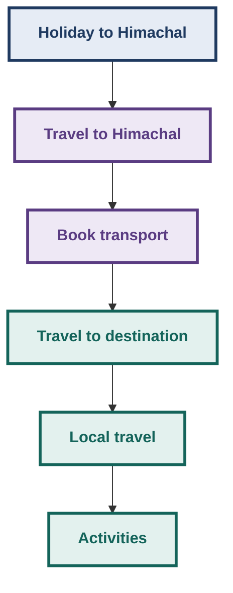

This is **hierarchical planning**.

> **Supplementary note:** Hierarchical planning is commonly associated
> with hierarchical task networks (HTNs). The Week 9 lecture only
> introduces the idea briefly; the detailed HTN formalism is outside the
> lecture scope.

------------------------------------------------------------------------

## 17. Graphplan

## 17.1 Motivation

Earlier planning approaches searched:

### State-space planning

``` text
State → Action → State → Action → ...
```

or:

### Plan-space planning

``` text
Partial plan
    ↓
fix flaws
    ↓
more complete partial plan
```

Graphplan takes a different route.

It was introduced by **Blum and Furst (1995)**.

The key idea:

$$
\boxed{
\text{Construct a planning graph}
\rightarrow
\text{Search inside the graph}
}
$$

So Graphplan has two stages:

1.  **Planning-graph construction**
2.  **Backward search for a plan**

The lecturer notes that this family of approaches substantially
increased the lengths of plans that could be handled compared with
earlier planners.

------------------------------------------------------------------------

## 18. Other Planning Directions Mentioned

The lecture briefly places Graphplan in a larger historical context.

### SATPlan

Convert planning into a satisfiability problem:

$$
\text{Planning problem}
\rightarrow
\text{SAT formula}
\rightarrow
\text{SAT solver}
$$

### CPlan

Convert planning into a CSP:

$$
\text{Planning problem}
\rightarrow
\text{CSP}
\rightarrow
\text{CSP solver}
$$

### Heuristic-search planners

Use domain-independent heuristics to guide state-space search.

The lecturer connects this to relaxation-based heuristics:

> Relax the problem so that the relaxed version is easier to solve, then
> use the relaxed solution as guidance.

------------------------------------------------------------------------

## 19. Planning Graph Structure

A planning graph alternates between:

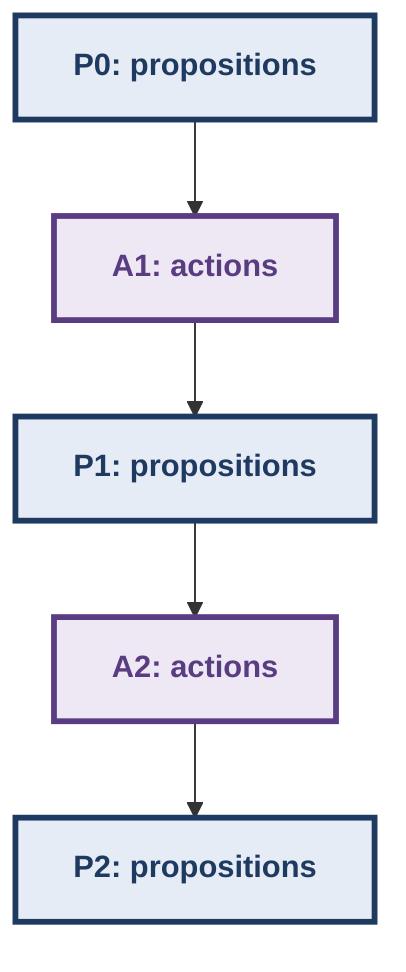

where:

-   $P_i$ = proposition layer
-   $A_i$ = action layer

------------------------------------------------------------------------

## 19.1 Proposition Layer

$P_0$ is the initial state.

For example:

``` text
P0 = {ontable(C), clear(C), armEmpty, ...}
```

A later proposition layer contains the union of propositions that can
result from applicable actions.

------------------------------------------------------------------------

## 19.2 Action Layer

$A_i$ contains all actions individually applicable from $P_{i-1}$.

Example:

``` text
P0
 ↓
A1 = {
    Pickup(C),
    Unstack(A,B),
    NoOp(...)
}
```

------------------------------------------------------------------------

## 20. Why Graphplan Merges States

Suppose from a state there are two actions:

``` text
A1 → State 1
A2 → State 2
```

Ordinary state-space planning keeps those states separately.

Graphplan instead merges their propositions:

$$
P_1 = State_1 \cup State_2
$$

Thus the graph represents **sets of possible propositions**, not one
concrete state.

This is one of the most important structural differences.

------------------------------------------------------------------------

## 21. No-Op Actions

Graphplan introduces a special **no-op action** for each proposition.

For proposition $p$:

``` text
precondition: p
effect+:      p
```

It simply says:

> If p is already true, it can remain true into the next layer.

Therefore:

$$
p\in P_i
\Rightarrow
p\in P_{i+1}
$$

because a no-op can carry it forward.

------------------------------------------------------------------------

## 21.1 Why No-Ops Matter

Without no-ops, a proposition would disappear unless some real action
explicitly produced it.

With no-ops:

``` text
p at P0
 ↓
NoOp(p)
 ↓
p at P1
 ↓
NoOp(p)
 ↓
p at P2
```

Thus proposition layers grow monotonically.

------------------------------------------------------------------------

## 22. Important Graphplan Subtlety --- Delete Effects

Suppose:

``` text
Pickup(C)
```

deletes:

$$
ontable(C)
$$

Yet `ontable(C)` can still appear in the next proposition layer.

Why?

Because the no-op action for `ontable(C)` can carry it forward.

So:

``` text
Pickup(C)
    deletes ontable(C)

NoOp(ontable(C))
    preserves ontable(C)
```

Therefore the proposition may appear in the layer even though **one
particular action deletes it**.

This does NOT mean the delete effect was ignored.

It means the proposition layer represents what is **potentially
reachable through the collection of actions**.

------------------------------------------------------------------------

## 23. Graphplan Links

For each action there are three important kinds of connections.

## 23.1 Preconditions

Action $a$ is connected backward to its preconditions:

$$
pre(a)\subseteq P_{i-1}
$$

------------------------------------------------------------------------

## 23.2 Positive Effects

If:

$$
p\in effects^+(a)
$$

then $a$ has a positive-effect link to $p$ in $P_i$.

------------------------------------------------------------------------

## 23.3 Negative Effects

If:

$$
p\in effects^-(a)
$$

then $a$ has a negative-effect/delete link to $p$.

The lecture represents these conceptually as different edge types.

------------------------------------------------------------------------

## 24. Monotonic Growth of the Planning Graph

Because no-op actions preserve propositions:

$$
P_i\subseteq P_{i+1}
$$

in terms of the set of propositions that appear.

Similarly, previously applicable actions can remain applicable in later
layers because their preconditions persist.

Thus:

$$
\boxed{\text{proposition and action layers grow monotonically}}
$$

This does **not** mean mutex relations only increase.

In fact, mutex relations may:

1.  appear,
2.  increase,
3.  later disappear.

------------------------------------------------------------------------

## 25. Mutex --- Mutual Exclusion

A key part of Graphplan is **mutex**.

Two actions in the same action layer are mutex if they cannot safely
occur in parallel.

The lecturer describes four relevant cases.

------------------------------------------------------------------------

## 25.1 Competing Needs

Two actions have preconditions that are themselves mutex in the previous
proposition layer.

Suppose:

``` text
Action A requires p
Action B requires q
```

and:

$$
p \perp q
$$

Then:

$$
A \perp B
$$

because their preconditions cannot simultaneously hold.

------------------------------------------------------------------------

## 25.2 Inconsistent Effects

One action adds a proposition that the other deletes.

Formally:

$$
p\in effects^+(A)
$$

and

$$
p\in effects^-(B)
$$

or vice versa.

Then the actions are mutex.

### Example

``` text
A: add p
B: delete p
```

Running them in parallel gives incompatible effects.

------------------------------------------------------------------------

## 25.3 Interference

An action deletes a precondition of another action.

For example:

$$
p\in pre(A)
$$

and

$$
p\in effects^-(B)
$$

Then B destroys something A needs.

So:

$$
A\perp B
$$

------------------------------------------------------------------------

## 25.4 Competing for the Same Consumable Resource / Condition

The lecture also explicitly discusses the case where both actions:

-   require the same proposition, and
-   delete it.

Example:

``` text
Pickup(A)
Pickup(B)
```

Both require:

$$
armEmpty
$$

and both delete:

$$
armEmpty
$$

With one arm, both cannot happen simultaneously.

So they are mutex.

This is the lecturer's fourth condition in the discussion.

------------------------------------------------------------------------

## 26. Example of Action Mutex

Suppose:

``` text
Pickup(C)
NoOp(ontable(C))
```

`Pickup(C)` deletes:

$$
ontable(C)
$$

while the no-op adds/preserves:

$$
ontable(C)
$$

Therefore:

$$
Pickup(C)\perp NoOp(ontable(C))
$$

because of inconsistent effects.

Another example:

``` text
Pickup(C)
Unstack(A,B)
```

Both require:

$$
armEmpty
$$

and both consume/delete it.

Therefore they are mutex in a one-arm robot domain.

------------------------------------------------------------------------

## 27. Proposition Mutex

Mutex also exists between **propositions**.

Two propositions $p$ and $q$ in the same proposition layer are mutex if
**all combinations of actions that could produce them are mutex**.

The important phrase is:

> **all combinations**

If even one pair of non-mutex actions can jointly produce the two
propositions, then the propositions are not mutex.

Formally, if every producer pair is mutex:

$$
\forall a\in Producers(p),\;
\forall b\in Producers(q),\;
a\perp b
$$

then:

$$
p\perp q
$$

------------------------------------------------------------------------

## 28. Action Mutex vs Proposition Mutex

| Type | Meaning |
|---|---|
| Action mutex | Two actions cannot occur together in the same layer |
| Proposition mutex | Two propositions cannot be jointly achieved in that layer |
| Action mutex causes | Competing needs, inconsistent effects, interference, resource/condition competition |
| Proposition mutex test | Every producer combination is mutex |

> **Exam trap:** It is not enough for one pair of producers to be mutex
> to conclude that two propositions are mutex. For proposition mutex,
> **all** possible producer combinations must be mutex.

------------------------------------------------------------------------

## 29. Why Mutex Can Disappear

Suppose two propositions cannot both be achieved in one or two steps.

Later, additional actions may make them jointly achievable.

Therefore a pair can be:

``` text
mutex at P1
    ↓
mutex at P2
    ↓
non-mutex at P4
```

This is why mutex relations do not simply grow monotonically.

The proposition set grows monotonically, but the set of mutex
relationships can shrink.

------------------------------------------------------------------------

## 30. Graphplan Growth Procedure

Start:

$$
P_0 = \text{initial state}
$$

Then repeatedly construct:

$$
P_0
\rightarrow A_1
\rightarrow P_1
\rightarrow A_2
\rightarrow P_2
\rightarrow \cdots
$$

At every action layer:

1.  Find all individually applicable actions.
2.  Include no-op actions implicitly.
3.  Add precondition links.
4.  Add positive and negative effect links.
5.  Compute action mutex relations.

At every proposition layer:

1.  Collect all possible propositions.
2.  Add proposition mutex relations.

------------------------------------------------------------------------

## 31. When Does Graphplan Stop Growing?

There are two important stopping situations.

## Condition 1 --- Goals Appear Non-Mutex

Suppose the goal is:

$$
G=\{g_1,g_2,g_3\}
$$

If at some proposition layer $P_i$:

$$
g_1,g_2,g_3\in P_i
$$

and they are pairwise non-mutex, then the graph is sufficient to
**attempt backward plan extraction**.

Important:

> This does **not yet guarantee** that a valid plan exists.

It only means a candidate plan may exist.

------------------------------------------------------------------------

## Condition 2 --- Level-Off

The planning graph has **leveled off** when two consecutive proposition
layers are identical, including their mutex relationships.

Conceptually:

$$
P_i=P_{i+1}
$$

and the corresponding mutex structure is unchanged.

Then no further useful structure can appear.

If the goals are still absent or impossible, the problem has no
solution.

------------------------------------------------------------------------

## 32. Graphplan Backward Search

Once the goals appear together and non-mutex, Graphplan starts the
second stage.

It searches **backward through the planning graph**.

Suppose:

``` text
Goal layer P3:
    {g1, g2, g3}
```

For each goal:

1.  Find actions in $A_3$ that can achieve it.
2.  Select a set of actions that:
    -   jointly achieve all goals,
    -   are pairwise non-mutex.
3.  Replace the current goals with the selected actions' preconditions.
4.  Continue backward to $P_2$.
5.  Repeat until $P_0$.

------------------------------------------------------------------------

## 33. Hand-Traced Graphplan Backward Step

Suppose:

``` text
Goals at P3:
    {g1, g2, g3}
```

Possible action choices:

``` text
g1 ← A
g2 ← B
g3 ← C
```

If:

$$
A\not\perp B,\quad
A\not\perp C,\quad
B\not\perp C
$$

then:

``` text
{A,B,C}
```

is a valid candidate action set.

Suppose their preconditions are:

``` text
A: {p1,p2}
B: {p2,p3}
C: {p4}
```

Then the next sub-goal set becomes:

$$
\{p_1,p_2,p_3,p_4\}
$$

with duplicate $p_2$ appearing only once as a proposition goal.

The same process is repeated one layer earlier.

------------------------------------------------------------------------

## 34. Backtracking in Graphplan

There may be multiple ways to achieve a goal.

Example:

- **Goal g** can be achieved by:
  - A1
  - A2
  - A3

The first candidate may lead to a mutex conflict later.

Graphplan then:

``` text
try candidate
   ↓
conflict
   ↓
backtrack
   ↓
try another producer
```

The lecturer describes this backward search as **depth-first search**
over the planning graph.

------------------------------------------------------------------------

## 35. Why the First Found Graphplan Plan Has Minimum Makespan

Graphplan does not immediately search arbitrarily deep.

It first grows the planning graph level by level:

``` text
P0
P1
P2
P3
...
```

The first layer where all goals become non-mutex is the earliest layer
at which a plan can potentially exist.

If backward extraction succeeds there, the resulting plan has the
smallest number of parallel time steps.

Therefore:

$$
\boxed{
\text{first successful level}
\Rightarrow
\text{minimum makespan}
}
$$

------------------------------------------------------------------------

## 36. Graphplan Failure Case

If backward search fails at the current level:

``` text
goal set non-mutex
        ↓
try action combinations
        ↓
all combinations fail
```

then Graphplan expands the planning graph by another level and tries
again.

If the graph eventually levels off without finding a plan:

$$
\boxed{\text{NO PLAN}}
$$

------------------------------------------------------------------------

## 37. Graphplan --- Complete Mental Model

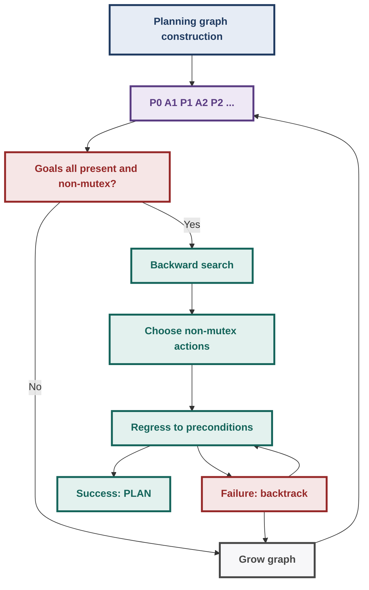

------------------------------------------------------------------------

## 38. Problem Decomposition

## 38.1 Change of Perspective

The lecture now explicitly changes perspective:

> Instead of looking at problem solving from the perspective of the
> current state, look at it from the perspective of the **goal**.

This is called:

-   goal-based reasoning
-   goal-directed reasoning
-   problem decomposition

The basic idea:

$$
\boxed{
\text{Goal}
\rightarrow
\text{sub-goals}
\rightarrow
\text{sub-sub-goals}
\rightarrow
\text{primitive problems}
}
$$

------------------------------------------------------------------------

## 39. State-Centered vs Goal-Centered Search

| State-centered search | Goal-centered decomposition |
|---|---|
| Search starts from current state | Reason from desired goal |
| Successors are next states | Children are subproblems |
| Typical solution = path | Solution = subtree |
| Usually OR branching | AND + OR branching |
| "What can I do next?" | "What must I solve?" |

------------------------------------------------------------------------

## 40. Primitive and LIVE Problems

A problem node can be:

### Primitive

It requires no further decomposition.

Mark it:

$$
\boxed{SOLVED}
$$

### Non-primitive

It still needs refinement.

Mark it:

$$
\boxed{LIVE}
$$

This terminology is important for AO\*.

------------------------------------------------------------------------

## 41. Motivation Example --- Planning an Evening

The lecturer gives an everyday example.

Suppose an evening outing requires:

1.  an activity,
2.  a movie,
3.  dinner.

For example:

- **Outing**
  - Evening activity
  - Movie
  - Dinner

Each component can be selected independently.

Suppose possible choices are:

``` text
Activity:
    Mall
    Beach

Movie:
    Matrix
    Bhuvan Shome
    ...

Restaurant:
    Pizza Hut
    Saravana Bhavan
```

------------------------------------------------------------------------

## 42. Naive DFS Planning

A chronological DFS might try:

``` text
Mall
  ↓
Matrix
  ↓
Pizza Hut
```

Rejected.

Then:

``` text
Mall
  ↓
Matrix
  ↓
Saravana Bhavan
```

Rejected.

Then:

``` text
Mall
  ↓
Bhuvan Shome
  ↓
Pizza Hut
```

Rejected.

And so on.

Eventually it discovers:

``` text
Beach
  ↓
Matrix
  ↓
Saravana Bhavan
```

which is accepted.

------------------------------------------------------------------------

## 43. Why Chronological Backtracking Wastes Work

Suppose the real problem is:

``` text
Friends do not like Mall.
```

Then every plan beginning with:

``` text
Mall
```

is doomed.

Yet ordinary DFS may waste time changing:

``` text
Pizza Hut
→ Saravana Bhavan
→ another restaurant
→ another movie
→ ...
```

before finally changing Mall.

This is **chronological backtracking**:

> Undo the most recent decision first.

Constraint-processing methods can sometimes identify the **culprit
variable** and jump directly back to it.

This is the idea of **conflict-directed backjumping**.

------------------------------------------------------------------------

## 44. AND-OR Representation of the Evening Problem

Instead of:

``` text
Outing
   ↓
choose activity
   ↓
choose movie
   ↓
choose restaurant
```

represent the problem as:

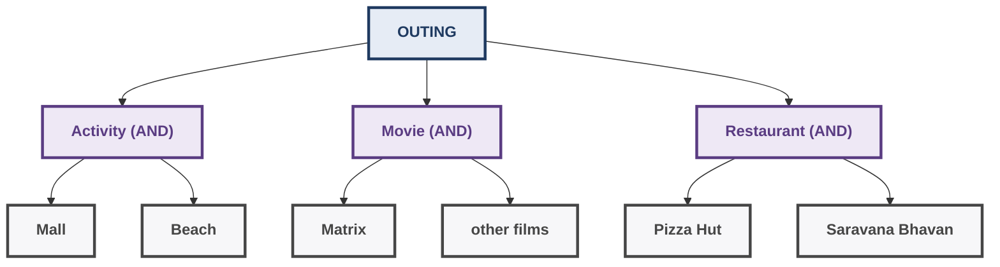

At the top:

-   all three components must be solved.

Within each component:

-   choose one alternative.

Thus:

$$
\boxed{
AND = \text{all required}
\qquad
OR = \text{one alternative}
}
$$

------------------------------------------------------------------------

## 45. AND-OR Trees / Goal Trees

An **AND-OR tree** contains two kinds of alternatives.

## OR node

Choose one child.

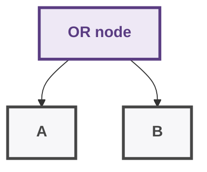

Solution chooses either A or B.

------------------------------------------------------------------------

## AND node

All children must be solved.

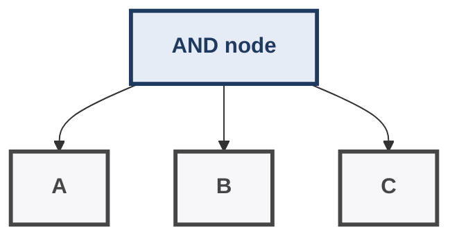

Solution must include A, B and C.

------------------------------------------------------------------------

## 46. Solution Is a Subtree, Not a Path

This is one of the most important Week 9 distinctions.

In ordinary state-space search:

$$
\boxed{\text{solution = path}}
$$

In an AND-OR tree:

$$
\boxed{\text{solution = subtree/subgraph}}
$$

Example:

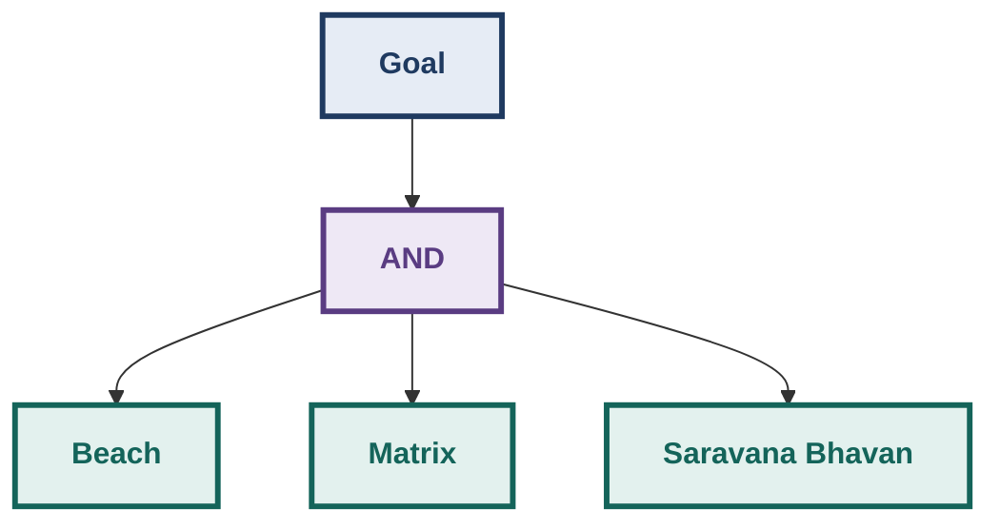

The solution contains all three required pieces.

At OR nodes, only one branch is selected.

At AND nodes, all branches are retained.

------------------------------------------------------------------------

## 47. AND-OR Tree Example

Suppose:

Suppose the goal can be solved either through A alone, or through B and C jointly:

- **Goal**
  - OR choice: A
  - OR choice: AND(B, C)

If the solution through A is valid, the solution subtree is:

- **Goal**
  - A

If instead the second alternative is chosen:

- **Goal**
  - AND
    - B
    - C

then both B and C must be solved.

------------------------------------------------------------------------

## 48. Cost of AND and OR Nodes

Let edge cost from node $N$ to child $C_i$ be $e_i$.

## OR node

Only one child needs to be solved:

$$
\boxed{
Cost(N)=
\min_i
\left(e_i+Cost(C_i)\right)
}
$$

------------------------------------------------------------------------

## AND node

Every child must be solved:

$$
\boxed{
Cost(N)=
\sum_i
\left(e_i+Cost(C_i)\right)
}
$$

This is the fundamental AO\* backup rule.

------------------------------------------------------------------------

## 49. Worked Mini-Example --- AND/OR Cost

Suppose:

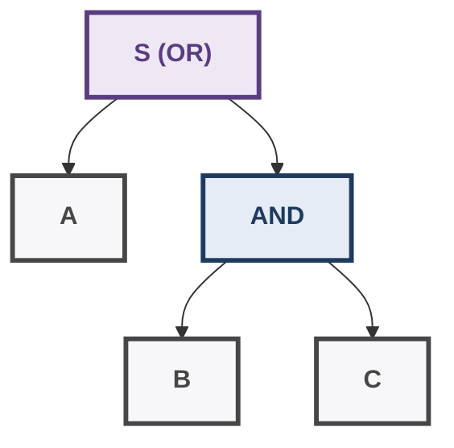

Edge costs are 2.

Suppose:

$$
h(A)=5,\quad h(B)=2,\quad h(C)=3
$$

Then:

### Alternative A

$$
2+5=7
$$

### AND alternative

$$
(2+2)+(2+3)
=
4+5
=
9
$$

Therefore:

$$
Cost(S)=\min(7,9)=7
$$

So the current marked choice is:

``` text
S → A
```

> **Exam trap:** Never compare only raw heuristic values at children.
> Compare the **backed-up cost of the complete alternative**.

------------------------------------------------------------------------

## 50. Connection to Means-Ends Analysis

Means-Ends Analysis already introduced an AND structure:

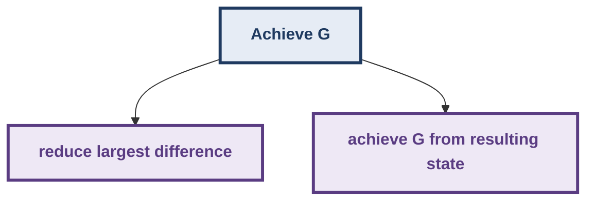

Problem decomposition generalizes this idea.

A problem can naturally decompose into:

-   alternatives → OR
-   jointly required subproblems → AND

This is why Means-Ends Analysis leads naturally toward AND-OR trees.

------------------------------------------------------------------------

## 51. Other Natural AND-OR Applications

The lecturer discusses symbolic integration.

A difficult integration problem can be transformed into another problem.

For example, a substitution can transform:

``` text
original integral
       ↓
new integral
```

and the new integral may have multiple solution strategies:

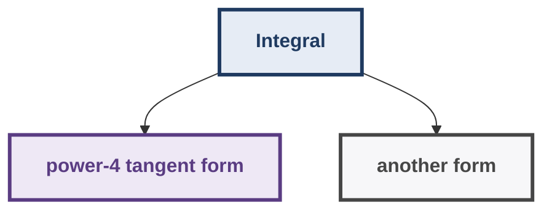

Some transformations may themselves decompose into several subproblems:

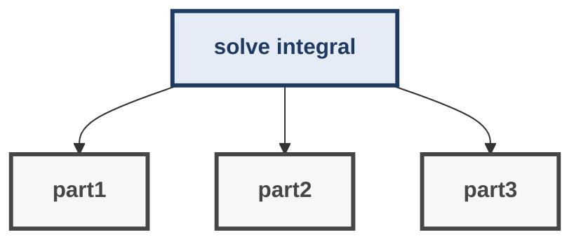

Primitive integrals are treated as already solved.

------------------------------------------------------------------------

## 52. Cycles in Problem Decomposition

Problem transformations can create cycles.

For example:

``` text
tan form
   ↓
cot form
   ↓
tan form
   ↓
cot form
   ↓
...
```

Therefore an automated problem solver must check for loops.

> **Exam trap:** A decomposition graph is not automatically a tree in
> the algorithmic sense; repeated transformations can create cycles, so
> loop handling matters.

------------------------------------------------------------------------

## 53. DENDRAL --- Knowledge + Search

The lecture mentions **DENDRAL** as an early AI success.

Its task:

> Given a molecular formula, generate possible structural formulas for
> the chemical compound.

A formula such as:

$$
C_6H_{13}NO_2
$$

can correspond to many possible structures.

Therefore brute-force generation can become enormous.

DENDRAL's approach illustrates:

$$
\boxed{
\text{specialized knowledge}
+
\text{search}
}
$$

The related program **CONGEN** (constraint generator) narrowed the
candidate space using chemical constraints.

The important Week 9 lesson is:

> Search becomes much more useful when domain knowledge constrains the
> space of possible solutions.

------------------------------------------------------------------------

## 54. AO\* --- Why It Exists

Ordinary A\* works on state-space graphs where a solution is essentially
one path.

But AND-OR problems require a solution **subgraph**.

Therefore:

$$
\boxed{
A^*
\text{ for OR/state-space graphs}
}
$$

becomes:

$$
\boxed{
AO^*
\text{ for AND-OR graphs}
}
$$

AO\* searches for the minimum-cost solution graph.

------------------------------------------------------------------------

## 55. AO\* Core State

At any moment AO\* maintains:

-   the portion of the AND-OR graph generated so far;
-   heuristic estimates for unsolved nodes;
-   a **marker** at each choice point showing the currently best option;
-   SOLVED/LIVE status.

The marker is critical.

It represents the current best partial solution.

------------------------------------------------------------------------

## 56. AO\* Forward Phase

The algorithm follows the currently marked choices from the root.

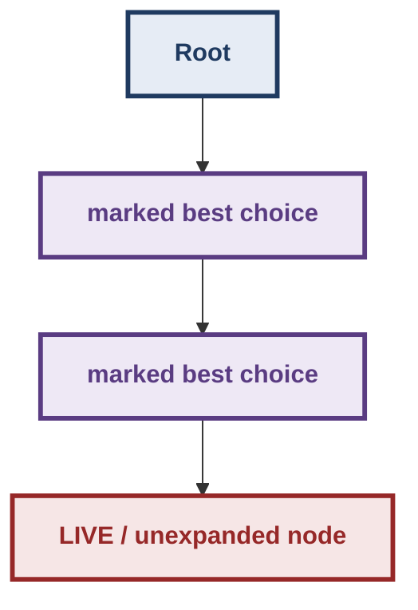

Let:

$$
U=\{\text{unexpanded nodes reached through marked paths}\}
$$

Choose one node:

$$
N\in U
$$

and expand/refine it.

------------------------------------------------------------------------

## 57. AO\* Expansion

Suppose $N$ is expanded.

Generate:

$$
Successors(N)
$$

For each successor:

-   add it to the generated graph;
-   compute its heuristic;
-   if it is primitive, mark it SOLVED.

If there are no children, the node can be assigned a futility value in
the course's algorithm.

The course pseudocode also checks for loops and removes looping
successors.

------------------------------------------------------------------------

## 58. AO\* Backward Phase

After expansion, costs must be propagated upward.

For every modified ancestor:

1.  Compute the best alternative.
2.  Mark that alternative.
3.  Update the node's cost.
4.  If the node is now solved, mark it SOLVED.
5.  If its cost changed, reconsider its parents.

This is the **backup** phase.

------------------------------------------------------------------------

## 59. AO\* Solved Conditions

A node can become SOLVED in several ways.

### Primitive node

Immediately SOLVED when generated.

### OR node

If one selected/best successor is SOLVED, the OR node can be SOLVED.

### AND node

All required successors must be SOLVED.

Thus:

$$
OR:
\quad
\exists\text{ solved child}
$$

whereas:

$$
AND:
\quad
\forall\text{ required children are solved}
$$

------------------------------------------------------------------------

## 60. AO\* Termination

AO\* terminates when:

$$
\boxed{\text{ROOT is labelled SOLVED}}
$$

The returned result is the **marked solution subgraph**.

------------------------------------------------------------------------

## 61. AO\* Pseudocode --- Course Form

``` text
AO*(start, Futility):

    add start to G
    compute h(start)
    solved(start) ← FALSE

    while solved(start) = FALSE
          and h(start) ≤ Futility:

        # Forward Phase
        U ← trace marked paths in G
             to a set of unexpanded nodes

        N ← select a node from U
        children ← Successors(N)

        if children is empty:
            h(N) ← Futility

        else:
            remove looping children

            for each S in children:
                add S to G
                compute h(S)

                if S is primitive:
                    solved(S) ← TRUE

        # Backward Phase
        M ← {N}

        while M is not empty:

            D ← remove deepest node from M

            compute best cost of D
            from its children

            mark best option at D

            if all nodes connected
               through marked arcs are SOLVED:
                solved(D) ← TRUE

            if D changed:
                add all parents of D to M

    if solved(start):
        return marked subgraph

    return failure
```

------------------------------------------------------------------------

## 62. AO\* --- One-Cycle Mental Model

Memorize:

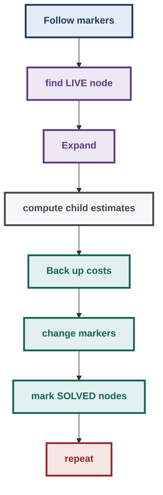

------------------------------------------------------------------------

## 63. AO\* Cost Backup

For an OR node:

$$
C(N)=
\min_i
\left(
c(N,C_i)+C(C_i)
\right)
$$

For an AND hyper-arc:

$$
C(N)=
\sum_i
\left(
c(N,C_i)+C(C_i)
\right)
$$

The marker points to the minimum-cost alternative.

------------------------------------------------------------------------

## 64. AO\* vs A\*

| Feature | A* | AO* |
|---|---|---|
| Search structure | State-space graph | AND-OR graph |
| Node relationship | OR/choice | AND + OR |
| Solution | Path | Subtree/subgraph |
| Cost backup | Path cost | min for OR, sum for AND |
| Main mechanism | Expand lowest-f frontier node | Follow marked best partial solution |
| Backward operation | Update path costs | Propagate backed-up costs |
| Termination | Goal selected/reached | Root becomes SOLVED |
| Heuristic role | Estimate remaining path cost | Estimate remaining solution cost |

------------------------------------------------------------------------

## 65. AO\* and Admissibility

The lecture's central claim:

> AO\* is admissible when the heuristic **underestimates** the actual
> cost.

Formally:

$$
\boxed{
h(n)\le h^*(n)
}
$$

where $h^*(n)$ is the true minimum cost of solving $n$.

If:

$$
h(n)>h^*(n)
$$

then the heuristic overestimates.

This can cause AO\* to prefer the wrong partial solution and terminate
without guaranteeing optimality.

------------------------------------------------------------------------

## 66. AO\* Example --- Edge Cost = 1

The lecture gives a detailed example.

Every edge has:

$$
c=1
$$

Solved leaf nodes have cost:

$$
0
$$

The root initially has heuristic:

$$
h(S)=21
$$

Other nodes have heuristic values such as:

$$
6,8,6,7,3,4,5,7,9,10
$$

The heuristic values are deliberately illustrative.

------------------------------------------------------------------------

## 67. AO\* Example --- Step 1

After expanding the root, there are two major alternatives.

### Left alternative

Two heuristic values:

$$
6,\;7
$$

plus two edges:

$$
6+7+1+1=15
$$

### Right alternative

Two heuristic values:

$$
4,\;5
$$

plus two edges:

$$
4+5+1+1=11
$$

Therefore:

$$
C(S)=\min(15,11)=11
$$

So the right branch is marked.

------------------------------------------------------------------------

## 68. AO\* Example --- Refine Node 5

The node with heuristic 5 has one decomposition requiring two leaf
subproblems.

Suppose both leaves are solved and have cost 0.

Then:

$$
C(5)
=
0+0+1+1
=
2
$$

So:

$$
5\rightarrow2
$$

The root's marked solution therefore changes from:

$$
11\rightarrow8
$$

because the 5 on the selected path has been replaced by 2:

$$
4+2+1+1=8
$$

------------------------------------------------------------------------

## 69. AO\* Example --- Refine Node 4

Now refine the node whose heuristic is 4.

It has:

-   an AND alternative,
-   an OR alternative.

### OR alternative

Suppose the child has heuristic 7:

$$
7+1=8
$$

### AND alternative

Suppose the children have heuristic 3 and 4:

$$
3+4+1+1=9
$$

Therefore the OR alternative is marked:

$$
\boxed{8<9}
$$

The node's estimate rises from 4 to 8.

Consequently, the root estimate rises:

$$
8\rightarrow12
$$

This is important:

> A backed-up cost can **increase** after refinement.

------------------------------------------------------------------------

## 70. AO\* Example --- Refine Node 7

Node 7 is refined and has three possible ways to solve it.

Their costs are:

$$
9,\;10,\;10
$$

Therefore:

$$
C(7)=9
$$

Relative to the earlier estimate 7, the refined cost increases.

The marker changes because another alternative now becomes better.

------------------------------------------------------------------------

## 71. AO\* Example --- Refine Node 3

Suppose node 3 refines to a solved node with edge cost 1.

Then:

$$
C(3)=1
$$

A higher-level AND combination therefore changes from:

$$
3+4+1+1
$$

to:

$$
1+4+1+1=7
$$

and the root's backed-up value falls correspondingly.

------------------------------------------------------------------------

## 72. AO\* Example --- Final Refinement

The lecture eventually refines the remaining marked nodes.

One final node with heuristic 4 is refined to a solved leaf.

Its cost becomes:

$$
4\rightarrow1
$$

The root's cost becomes:

$$
\boxed{8}
$$

The thick marked edges form the final solution subgraph.

Thus:

$$
\boxed{\text{AO* returns a solution graph of cost }8}
$$

------------------------------------------------------------------------

## 73. Why the Edge-Cost-1 Example Is Important

When edge costs are 1, the initial heuristic values are generally
**overestimates**.

Example:

A node labelled 10 may actually require only:

$$
1+0=1
$$

to solve.

So:

$$
h(n)=10>h^*(n)=1
$$

which is not admissible.

The lecture observes that overestimating values can cause the algorithm
to terminate quickly because it may commit to a branch and never explore
the alternative.

But:

$$
\boxed{\text{fast termination} \not\Rightarrow \text{optimal solution}}
$$

------------------------------------------------------------------------

## 74. AO\* Example --- Edge Cost = 10

The lecturer repeats the same graph but changes every edge cost to:

$$
c=10
$$

Now the same heuristic values become underestimates.

For example, a node with:

$$
h(n)=5
$$

may actually cost:

$$
10+10=20
$$

after refinement.

Thus:

$$
5\le20
$$

which is consistent with admissibility.

------------------------------------------------------------------------

## 75. First Step with Edge Cost = 10

The right branch initially has:

$$
4+5+10+10
=
29
$$

The left branch:

$$
6+7+10+10
=
33
$$

Therefore the right branch is initially preferred:

$$
29<33
$$

------------------------------------------------------------------------

## 76. Refinement Can Make the Preferred Branch Worse

Refine the node with heuristic 5.

It becomes an AND decomposition into two solved leaves.

Now:

$$
C(5)=0+0+10+10=20
$$

Therefore the right branch changes substantially.

Its estimated total becomes:

$$
4+20+10+10
=
44
$$

The left branch remains:

$$
6+7+10+10=33
$$

So the marker switches:

$$
44>33
$$

and AO\* explores the other side.

------------------------------------------------------------------------

## 77. Underestimation Causes Exploration of Alternatives

This is the central intuition from the lecturer's AO\* example.

When estimates are underestimates:

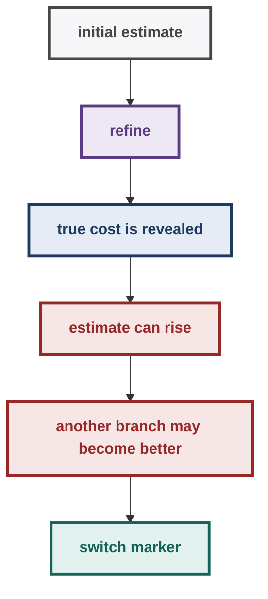

Therefore AO\* may **oscillate between alternatives** while refining
them.

This is fundamentally different from the earlier overestimating example.

------------------------------------------------------------------------

## 78. Final Result of the Underestimating Example

Continuing the refinement process, the algorithm eventually propagates
solved labels upward.

The root becomes:

$$
\boxed{SOLVED}
$$

with solution cost:

$$
\boxed{70}
$$

The important conceptual conclusion is:

> When the heuristic underestimates the true cost, AO\* keeps refining
> alternatives until the best solution is fully justified.

Hence the lecture gives the informal admissibility intuition:

$$
\boxed{
h(n)\le h^*(n)
\Rightarrow
\text{AO* can preserve optimality}
}
$$

------------------------------------------------------------------------

## 79. AO\* Exam Trap --- Raw Heuristic vs Backed-Up Cost

Suppose:

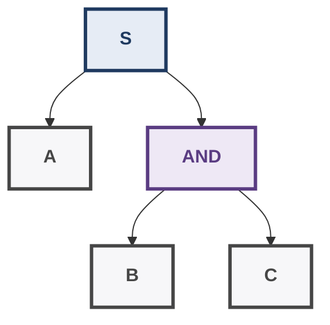

and:

$$
h(B)=1
$$

while:

$$
h(A)=5
$$

It is **wrong** to immediately choose B because:

$$
1<5
$$

The AND branch might cost:

$$
(1+\text{edge})+(100+\text{edge})
$$

which is much worse than A.

AO\* compares the **backed-up cost of the alternatives**, not an
isolated raw heuristic.

------------------------------------------------------------------------

## 80. Goal Trees and Deduction in Logic

The final lecture connects the Week 9 ideas to logical reasoning.

The central observation:

> In logic, the search problem is often: **find a proof for a query.**

So:

$$
\boxed{
\text{logical deduction}
=
\text{search for a proof}
}
$$

The lecture focuses on **first-order logic / predicate logic** and
especially **backward chaining**.

------------------------------------------------------------------------

## 81. Knowledge Base and Query

Let:

$$
KB=\{\text{facts, rules, axioms/premises}\}
$$

and let:

$$
\alpha
$$

be the query.

The question is:

> Is $\alpha$ entailed by $KB$?

Write:

$$
KB\models\alpha
$$

to mean:

> If all statements in $KB$ are accepted as true, then $\alpha$ must
> also be true.

------------------------------------------------------------------------

## 82. Truth vs Provability

The lecturer distinguishes:

### Truth

A semantic notion.

It asks whether a statement is actually true in the intended
interpretation/model.

### Provability

A syntactic notion.

It asks whether we can derive the statement using valid rules of
inference.

A sound logic has the property:

$$
\boxed{
\text{provable}\Rightarrow\text{true}
}
$$

So a proof-generating procedure can be used to establish consequences of
the knowledge base.

------------------------------------------------------------------------

## 83. Greek Syllogism

Classic example:

1.  All men are mortal.
2.  Socrates is a man.
3.  Therefore Socrates is mortal.

Formally:

$$
\forall x\;[Man(x)\rightarrow Mortal(x)]
$$

and:

$$
Man(Socrates)
$$

therefore:

$$
Mortal(Socrates)
$$

------------------------------------------------------------------------

## 84. Modus Ponens

Basic rule:

$$
\frac{\alpha\rightarrow\beta,\quad \alpha}
{\beta}
$$

Example:

$$
Man(Socrates)\rightarrow Mortal(Socrates)
$$

and:

$$
Man(Socrates)
$$

therefore:

$$
Mortal(Socrates)
$$

------------------------------------------------------------------------

## 85. Modified Modus Ponens and Substitution

The rule may contain variables.

Suppose:

$$
Man(x)\rightarrow Mortal(x)
$$

and:

$$
Man(Socrates)
$$

The two expressions are not textually identical.

We make them match through substitution:

$$
\theta=\{x/Socrates\}
$$

Then:

$$
Man(x)\theta=Man(Socrates)
$$

and:

$$
Mortal(x)\theta=Mortal(Socrates)
$$

Therefore the conclusion follows.

This is closely related to **unification**.

> **Supplementary note:** Unification is the general process of finding
> substitutions that make logical expressions structurally identical.
> The lecture mentions it but does not develop the full unification
> algorithm.

------------------------------------------------------------------------

## 86. Forward Chaining

Forward chaining starts from what is already known.

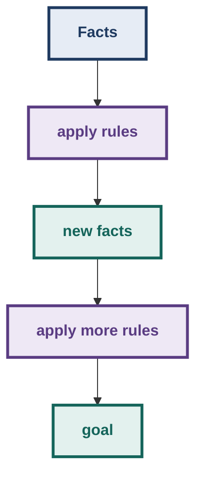

For example:

``` text
Man(Socrates)
Man(x) → Mortal(x)
```

derive:

``` text
Mortal(Socrates)
```

This is **data-driven** reasoning.

------------------------------------------------------------------------

## 87. Backward Chaining

Backward chaining reverses the direction.

Start from the goal:

```mermaid
flowchart TD
  BW1["Goal"]:::core --> BW2["Which rule could produce this?"]:::q
  BW2 --> BW3["What are its antecedents?"]:::q
  BW3 --> BW4["Can those antecedents be proved?"]:::good
  BW4 --> BW5["Continue until facts are reached"]:::good
  classDef base fill:#F7F7F9,stroke:#464646,stroke-width:3px,color:#464646,font-weight:bold
  classDef core fill:#E6ECF5,stroke:#1F3A60,stroke-width:3px,color:#1F3A60,font-weight:bold
  classDef q fill:#EEE8F5,stroke:#5A3C82,stroke-width:3px,color:#5A3C82,font-weight:bold
  classDef good fill:#E3F1EE,stroke:#14645A,stroke-width:3px,color:#14645A,font-weight:bold
  classDef warn fill:#F6E6E6,stroke:#962828,stroke-width:3px,color:#962828,font-weight:bold
```

This is **goal-driven** reasoning.

The lecturer also calls backward chaining:

> **Deductive retrieval**

because the query can contain variables and the system can return
bindings that satisfy it.

------------------------------------------------------------------------

## 88. Existential Query

Instead of asking:

``` text
Is Socrates mortal?
```

we can ask:

$$
\exists z\;Mortal(z)
$$

Meaning:

> Is there some $z$ who is mortal?

The answer can include a binding.

For example:

$$
z=Plato
$$

or:

$$
z=Socrates
$$

or:

$$
z=Aristotle
$$

if those facts can be derived.

------------------------------------------------------------------------

## 89. Hand-Solved Backward-Chaining Example

Knowledge base:

$$
Man(x)\rightarrow Mortal(x)
$$

and fact:

$$
Man(Plato)
$$

Query:

$$
\exists z\;Mortal(z)
$$

### Step 1 --- Start with goal

``` text
Mortal(z)
```

### Step 2 --- Find a rule whose conclusion matches

Rule:

``` text
Mortal(x) ← Man(x)
```

### Step 3 --- Unify

Match:

$$
Mortal(x)
$$

with:

$$
Mortal(z)
$$

giving:

$$
\theta=\{x/z\}
$$

So the new sub-goal is:

``` text
Man(z)
```

### Step 4 --- Match against facts

Fact:

``` text
Man(Plato)
```

Therefore:

$$
z=Plato
$$

### Step 5 --- Verify

$$
Man(Plato)
\Rightarrow
Mortal(Plato)
$$

Therefore:

$$
\boxed{\exists z\;Mortal(z)}
$$

with answer:

$$
\boxed{z=Plato}
$$

------------------------------------------------------------------------

## 90. Conjunctive Rules Create AND Nodes

Suppose the rule is:

$$
P(x)\land Q(x)\rightarrow R(x)
$$

Query:

$$
R(x)
$$

Backward chaining says:

```mermaid
flowchart TD
  RX["Goal R(x)"]:::core --> RU["use rule"]:::q
  RU --> RA["AND"]:::q
  RA --> RP["P(x)"]:::base
  RA --> RQ["Q(x)"]:::base
  classDef base fill:#F7F7F9,stroke:#464646,stroke-width:3px,color:#464646,font-weight:bold
  classDef core fill:#E6ECF5,stroke:#1F3A60,stroke-width:3px,color:#1F3A60,font-weight:bold
  classDef q fill:#EEE8F5,stroke:#5A3C82,stroke-width:3px,color:#5A3C82,font-weight:bold
  classDef good fill:#E3F1EE,stroke:#14645A,stroke-width:3px,color:#14645A,font-weight:bold
  classDef warn fill:#F6E6E6,stroke:#962828,stroke-width:3px,color:#962828,font-weight:bold
```

Both must be proved.

The important detail is that the **same x** must satisfy both.

So it is not enough to find:

``` text
P(A)
Q(B)
```

because we need:

$$
P(A)\land Q(A)
$$

or:

$$
P(B)\land Q(B)
$$

for the same binding.

------------------------------------------------------------------------

## 91. Goal Tree for "Nice Toy"

The lecturer gives a detailed example.

Two rules:

### Rule 1

$$
Green(x)\land Circle(x)\rightarrow NiceToy(x)
$$

### Rule 2

$$
Red(x)\land Square(x)\rightarrow NiceToy(x)
$$

Facts:

``` text
Green(A)
Green(B)

Circle(C)
Red(C)

Red(D)
Square(D)

Circle(E)
```

Query:

$$
\exists x\;NiceToy(x)
$$

------------------------------------------------------------------------

## 92. Build the Goal Tree

Root:

``` text
NiceToy(x)
```

Two rules can prove it, so this is an OR choice:

```mermaid
flowchart TD
  NT["NiceToy(x)"]:::core --> R1X["Rule 1"]:::q
  NT --> R2X["Rule 2"]:::q
  R1X --> A1X["AND"]:::warn
  R2X --> A2X["AND"]:::warn
  A1X --> GX["Green(x)"]:::base
  A1X --> CX["Circle(x)"]:::base
  A2X --> RX2["Red(x)"]:::base
  A2X --> SX2["Square(x)"]:::base
  classDef base fill:#F7F7F9,stroke:#464646,stroke-width:3px,color:#464646,font-weight:bold
  classDef core fill:#E6ECF5,stroke:#1F3A60,stroke-width:3px,color:#1F3A60,font-weight:bold
  classDef q fill:#EEE8F5,stroke:#5A3C82,stroke-width:3px,color:#5A3C82,font-weight:bold
  classDef good fill:#E3F1EE,stroke:#14645A,stroke-width:3px,color:#14645A,font-weight:bold
  classDef warn fill:#F6E6E6,stroke:#962828,stroke-width:3px,color:#962828,font-weight:bold
```

The leaves connect to known facts.

------------------------------------------------------------------------

## 93. Depth-First Search Trace

The lecturer explains that Prolog-style backward chaining performs DFS
through the goal tree.

### Branch 1 --- Rule 1

Need:

``` text
Green(x)
Circle(x)
```

Try:

$$
x=A
$$

We have:

$$
Green(A)
$$

but:

$$
Circle(A)
$$

is false/not present.

So this branch fails.

------------------------------------------------------------------------

### Try x = B

We have:

$$
Green(B)
$$

but not:

$$
Circle(B)
$$

So this also fails.

No more green candidates.

Backtrack to Rule 2.

------------------------------------------------------------------------

## 94. Rule 2

Need:

``` text
Red(x)
Square(x)
```

Try:

$$
x=C
$$

We have:

$$
Red(C)
$$

but not:

$$
Square(C)
$$

So C fails.

Try:

$$
x=D
$$

We have:

$$
Red(D)
$$

and:

$$
Square(D)
$$

Therefore D satisfies both conditions.

Hence:

$$
\boxed{NiceToy(D)}
$$

and the existential query succeeds:

$$
\boxed{\exists x\;NiceToy(x)}
$$

with:

$$
\boxed{x=D}
$$

------------------------------------------------------------------------

## 95. Goal Tree Solution Is a Subtree

The successful proof is not the entire tree.

It is the selected subtree:

```mermaid
flowchart TD
  SN["NiceToy(x)"]:::core --> SR["Rule 2"]:::q
  SR --> SA2["AND"]:::warn
  SA2 --> SD1["Red(D)"]:::good
  SA2 --> SD2["Square(D)"]:::good
  classDef base fill:#F7F7F9,stroke:#464646,stroke-width:3px,color:#464646,font-weight:bold
  classDef core fill:#E6ECF5,stroke:#1F3A60,stroke-width:3px,color:#1F3A60,font-weight:bold
  classDef q fill:#EEE8F5,stroke:#5A3C82,stroke-width:3px,color:#5A3C82,font-weight:bold
  classDef good fill:#E3F1EE,stroke:#14645A,stroke-width:3px,color:#14645A,font-weight:bold
  classDef warn fill:#F6E6E6,stroke:#962828,stroke-width:3px,color:#962828,font-weight:bold
```

This is exactly the same structural idea as an AND-OR solution graph.

------------------------------------------------------------------------

## 96. Prolog and Backward Chaining

The lecture connects this directly to **Prolog**.

Prolog is a logic programming language associated with **Robert
Kowalski** and the logic-programming tradition.

Its important behavior for this lecture:

-   goals are matched against rule conclusions;
-   rules generate sub-goals;
-   conjunctive conditions generate multiple goals;
-   search is depth-first;
-   alternatives are tried and backtracked.

------------------------------------------------------------------------

## 97. Why Prolog Writes Rules "Backwards"

A Prolog-style rule is conceptually:

``` text
Goal :- condition1, condition2.
```

Read as:

> Goal is true if condition1 and condition2 are true.

So the **consequent/goal appears on the left**, while antecedents appear
on the right.

This makes sense for backward chaining:

``` text
What do I want to prove?
        ↓
Which rule can prove it?
        ↓
What conditions must be proved?
```

------------------------------------------------------------------------

## 98. Prolog Variables vs Constants

The lecturer notes the common Prolog convention:

-   uppercase → variables
-   lowercase → constants

Conceptually:

``` text
likes(X, matrix)
```

means X is a variable.

While:

``` text
likes(alice, matrix)
```

uses constants.

Only variables can be substituted during the search.

------------------------------------------------------------------------

## 99. Final Planning-to-Logic Connection

The lecture closes the conceptual loop.

We have seen:

```mermaid
flowchart TD
  K1["Planning"]:::core --> K2["Goal-directed reasoning"]:::q
  K2 --> K3["Goal trees"]:::q
  K3 --> K4["AND-OR graphs"]:::warn
  K4 --> K5["AO star"]:::good
  classDef base fill:#F7F7F9,stroke:#464646,stroke-width:3px,color:#464646,font-weight:bold
  classDef core fill:#E6ECF5,stroke:#1F3A60,stroke-width:3px,color:#1F3A60,font-weight:bold
  classDef q fill:#EEE8F5,stroke:#5A3C82,stroke-width:3px,color:#5A3C82,font-weight:bold
  classDef good fill:#E3F1EE,stroke:#14645A,stroke-width:3px,color:#14645A,font-weight:bold
  classDef warn fill:#F6E6E6,stroke:#962828,stroke-width:3px,color:#962828,font-weight:bold
```

And in logic:

```mermaid
flowchart TD
  J1["Query"]:::core --> J2["Backward chaining"]:::q
  J2 --> J3["Goal tree"]:::q
  J3 --> J4["AND-OR search"]:::warn
  J4 --> J5["Proof and answer substitution"]:::good
  classDef base fill:#F7F7F9,stroke:#464646,stroke-width:3px,color:#464646,font-weight:bold
  classDef core fill:#E6ECF5,stroke:#1F3A60,stroke-width:3px,color:#1F3A60,font-weight:bold
  classDef q fill:#EEE8F5,stroke:#5A3C82,stroke-width:3px,color:#5A3C82,font-weight:bold
  classDef good fill:#E3F1EE,stroke:#14645A,stroke-width:3px,color:#14645A,font-weight:bold
  classDef warn fill:#F6E6E6,stroke:#962828,stroke-width:3px,color:#962828,font-weight:bold
```

Therefore:

$$
\boxed{
\text{planning, problem decomposition, AND-OR search,
and backward logical deduction share a common search structure}
}
$$

The difference is mainly **what the nodes represent**.

------------------------------------------------------------------------

## 100. Week 9 Conceptual Architecture

```mermaid
flowchart TD
  V1["Problem solving"]:::core --> V2["State-centered"]:::base
  V1 --> V3["Goal-centered"]:::base
  V2 --> V4["State-space search"]:::q
  V3 --> V5["Problem decomposition"]:::q
  V4 --> V6["sequence and path"]:::base
  V5 --> V7["AND-OR and goal tree"]:::warn
  V7 --> V8["OR alternatives"]:::base
  V7 --> V9["AND required parts"]:::base
  V8 --> V10["AO star"]:::good
  V9 --> V10
  V10 --> V11["optimal solution subtree"]:::good
  V11 --> V12["Planning: Graphplan"]:::core
  V11 --> V13["Logic: backward chaining"]:::core
  classDef base fill:#F7F7F9,stroke:#464646,stroke-width:3px,color:#464646,font-weight:bold
  classDef core fill:#E6ECF5,stroke:#1F3A60,stroke-width:3px,color:#1F3A60,font-weight:bold
  classDef q fill:#EEE8F5,stroke:#5A3C82,stroke-width:3px,color:#5A3C82,font-weight:bold
  classDef good fill:#E3F1EE,stroke:#14645A,stroke-width:3px,color:#14645A,font-weight:bold
  classDef warn fill:#F6E6E6,stroke:#962828,stroke-width:3px,color:#962828,font-weight:bold
```

------------------------------------------------------------------------

## 101. Connections to Previous Weeks

## Weeks 1--2

State-space search taught:

$$
State + MoveGen + GoalTest
$$

Week 9 asks a different question:

$$
\text{What if the goal itself can be decomposed?}
$$

------------------------------------------------------------------------

## Weeks 3--6

Heuristic search taught us to estimate remaining cost.

AO\* uses the same general idea:

$$
h(n)\approx\text{cost still required}
$$

but now the cost structure is AND-OR rather than purely OR.

------------------------------------------------------------------------

## Week 7 --- SSS\*

The lecturer explicitly notes a similarity.

SSS\*:

-   maintains partial solution structures;
-   refines promising partial solutions.

AO\*:

-   maintains a marked partial solution graph;
-   refines LIVE nodes on the marked solution.

The important shared idea:

$$
\boxed{
\text{refine the most promising partial solution}
}
$$

------------------------------------------------------------------------

## Week 8 --- Planning

Week 8 introduced:

-   state-space planning,
-   goal-stack planning,
-   plan-space planning.

Week 9 extends the goal-directed viewpoint:

``` text
Planning
   ↓
goals/subgoals
   ↓
decomposition
   ↓
AND-OR structure
```

Graphplan also provides a different representation for planning:

``` text
planning problem
   ↓
planning graph
   ↓
backward search
```

------------------------------------------------------------------------

## 102. Comparison of Week 9 Methods

| Method | Search object | Main idea | Solution form |
|---|---|---|---|
| Multi-arm planning | Plan | Execute independent actions in parallel | Partial-order / parallel plan |
| Means-Ends Analysis | Goal/problem | Reduce largest difference first | Decomposed plan |
| Graphplan | Planning graph | Build graph, then search backward | Parallel plan |
| Problem decomposition | Goal | Break goal into subproblems | AND-OR subtree |
| AO* | AND-OR graph | Refine best marked partial solution | Minimum-cost subtree |
| Forward chaining | Knowledge base | Facts to consequences | Derived facts |
| Backward chaining | Goal tree | Goal to required antecedents | Proof subtree + substitutions |

------------------------------------------------------------------------

## 103. High-Value Distinctions

## Path vs Subtree

``` text
State-space search:
solution = PATH

AND-OR search:
solution = SUBTREE
```

------------------------------------------------------------------------

## OR vs AND

``` text
OR:
one child is enough

AND:
all children are necessary
```

------------------------------------------------------------------------

## Primitive vs LIVE

``` text
Primitive → SOLVED immediately

LIVE → requires further refinement
```

------------------------------------------------------------------------

## Action vs Proposition Mutex

``` text
Action mutex:
two actions cannot execute together

Proposition mutex:
all possible producer combinations are mutually exclusive
```

------------------------------------------------------------------------

## Graph Growth vs Mutex Growth

``` text
Propositions/actions → grow monotonically

Mutex relations → may appear and later disappear
```

------------------------------------------------------------------------

## Planning Graph vs State Space

``` text
State-space planning:
separate successor states

Graphplan:
merge propositions into layers
```

------------------------------------------------------------------------

## Forward vs Backward Chaining

``` text
Forward:
facts → rules → consequences

Backward:
goal → rules → antecedents → facts
```

------------------------------------------------------------------------

## 104. Exam Traps

> **Exam trap 1:** An AND-OR solution is not necessarily a path. It is a
> subtree/subgraph.

> **Exam trap 2:** At an OR node choose one alternative; at an AND node
> all required children must be solved.

> **Exam trap 3:** AO\* chooses based on backed-up solution cost, not
> simply the smallest raw heuristic.

> **Exam trap 4:** A heuristic overestimate can destroy AO\*'s
> optimality guarantee.

> **Exam trap 5:** A primitive node is solved when generated; it is not
> necessarily "expanded" like a LIVE node.

> **Exam trap 6:** In Graphplan, action mutex is checked between actions
> in the same action layer.

> **Exam trap 7:** Proposition mutex requires **all producer
> combinations** to be mutex.

> **Exam trap 8:** A goal set being present and non-mutex in a planning
> graph does not itself prove a plan exists. Backward extraction must
> still succeed.

> **Exam trap 9:** Graphplan's planning graph grows monotonically, but
> mutex relations can disappear at later levels.

> **Exam trap 10:** No-op actions explain why propositions can persist
> into later proposition layers.

> **Exam trap 11:** A delete effect does not necessarily mean the
> proposition disappears from the next proposition layer; another
> action, including a no-op, may produce it.

> **Exam trap 12:** Makespan is the number of parallel time steps, not
> the total number of actions.

> **Exam trap 13:** Partial-order plans can have many valid
> linearizations.

> **Exam trap 14:** In backward chaining, a conjunctive rule requires
> all antecedents to be proved for the **same variable binding**.

> **Exam trap 15:** Forward chaining starts from facts; backward
> chaining starts from the query.

------------------------------------------------------------------------

## 105. Hand-Solving Checklist --- AO\*

When given an AO\* graph:

1.  Identify every node as AND, OR, primitive, or LIVE.
2.  Write every edge cost.
3.  Write the initial heuristic values.
4.  For every OR choice, compute: $$
    e_i+h(child_i)
    $$
5.  For every AND choice, compute: $$
    \sum_i(e_i+h(child_i))
    $$
6.  Mark the cheapest alternative.
7.  Follow the marked path from the root.
8.  Expand one LIVE node.
9.  Mark primitive children SOLVED immediately.
10. Back up the new costs.
11. Recompute the best choice at every affected ancestor.
12. Change markers if necessary.
13. Propagate SOLVED labels upward.
14. Stop when the root is SOLVED.
15. Extract the marked subtree.

------------------------------------------------------------------------

## 106. Hand-Solving Checklist --- Graphplan

For a Graphplan question:

1.  Write $P_0$.
2.  List all individually applicable actions.
3.  Include no-op actions conceptually.
4.  Construct $A_1$.
5.  Compute positive and negative effects.
6.  Construct $P_1$.
7.  Compute action mutex.
8.  Compute proposition mutex.
9.  Repeat until:
    -   goals appear and are non-mutex, or
    -   graph levels off.
10. If goals appear, work backward.
11. Choose actions that achieve all goals.
12. Check that selected actions are pairwise non-mutex.
13. Replace goals with their preconditions.
14. Continue backward.
15. Backtrack if a selected action set fails.
16. If $P_0$ is reached successfully, return the plan.
17. If graph levels off without a plan, return failure/NIL.

------------------------------------------------------------------------

## 107. Hand-Solving Checklist --- Backward Chaining

Given a KB and query:

1.  Write the query as the initial goal.
2.  Find rules whose conclusion matches the goal.
3.  Unify the rule conclusion with the query.
4.  Apply the resulting substitution.
5.  Replace the goal with the rule's antecedents.
6.  If there is an AND in the antecedent, all sub-goals must be solved.
7.  Match sub-goals against facts.
8.  If a candidate binding fails, backtrack.
9.  Continue depth-first if following the lecture's Prolog-style
    strategy.
10. When the goal set becomes empty, the query succeeds.
11. Report the substitution/binding that produced the answer.

------------------------------------------------------------------------

## 108. Compact Formula Sheet

## AND-OR Cost

### OR

$$
\boxed{
C(n)=\min_i[e_i+C(c_i)]
}
$$

### AND

$$
\boxed{
C(n)=\sum_i[e_i+C(c_i)]
}
$$

------------------------------------------------------------------------

## Heuristic admissibility

$$
\boxed{
h(n)\le h^*(n)
}
$$

Never overestimate.

------------------------------------------------------------------------

## Planning graph

$$
\boxed{
P_0\rightarrow A_1\rightarrow P_1\rightarrow A_2\rightarrow P_2\rightarrow\cdots
}
$$

------------------------------------------------------------------------

## Makespan

$$
\boxed{
\text{makespan}=\text{number of parallel time steps}
}
$$

------------------------------------------------------------------------

## Entailment

$$
\boxed{
KB\models\alpha
}
$$

means $KB$ entails $\alpha$.

------------------------------------------------------------------------

## Universal quantifier

$$
\boxed{
\forall x
}
$$

"for every $x$."

------------------------------------------------------------------------

## Existential quantifier

$$
\boxed{
\exists x
}
$$

"there exists an $x$."

------------------------------------------------------------------------

## Modus Ponens

$$
\boxed{
\frac{\alpha\rightarrow\beta,\;\alpha}{\beta}
}
$$

------------------------------------------------------------------------

## 109. 60-Second Revision

### Multi-Armed Robots

-   Multiple arms allow parallel actions.
-   Partial-order planning naturally represents this.
-   Makespan counts parallel time steps.
-   Arm number can be represented as a parameter $N$.
-   `clear(X)` handling matters in multi-arm domains.
-   Deleting `clear(X)` can force extra ordering.
-   Keeping `clear(X)` can permit more parallelism.

### Means-Ends Analysis

-   Compare current state with goal.
-   Identify differences.
-   Rank differences.
-   Use operator-difference table.
-   Reduce largest/most important difference.
-   Achieve operator preconditions recursively.
-   Apply operator.
-   Continue toward goal.

### Graphplan

-   Two stages:
    1.  Build planning graph.
    2.  Search backward in it.
-   Alternates: $$
    P_0,A_1,P_1,A_2,P_2,\ldots
    $$
-   No-op preserves propositions.
-   Action mutex:
    -   competing needs,
    -   inconsistent effects,
    -   interference,
    -   shared consumable/resource condition.
-   Proposition mutex requires all producer combinations to be mutex.
-   Goals must be present and non-mutex before extraction.
-   Backward search is DFS with backtracking.
-   First successful level gives minimum makespan.
-   Level-off without a plan means failure.

### Problem Decomposition

-   Goal-directed reasoning.
-   Primitive = SOLVED.
-   Non-primitive = LIVE.
-   OR = choose one.
-   AND = solve all.
-   Solution = subtree, not path.

### AO\*

-   A\* generalized to AND-OR graphs.
-   Follow marked best paths.
-   Expand LIVE node.
-   Back up costs.
-   Re-mark best alternatives.
-   Propagate SOLVED labels.
-   Stop when root is SOLVED.
-   OR uses minimum.
-   AND uses sum.
-   Admissible heuristic must underestimate.

### Logic

-   KB = facts/rules/premises.
-   Query = proposition to prove.
-   Forward chaining = facts → conclusions.
-   Backward chaining = goal → antecedents.
-   Conjunctive antecedents create AND nodes.
-   Alternatives among rules create OR nodes.
-   Substitution/unification makes variable patterns match.
-   Prolog performs depth-first backward search with backtracking.

------------------------------------------------------------------------

## 110. Final Mental Model

The deepest idea of Week 9 is not a single algorithm.

It is a change in **representation**.

Earlier:

$$
\boxed{
\text{Problem}
\rightarrow
\text{State Space}
\rightarrow
\text{Path Search}
}
$$

Week 9:

$$
\boxed{
\text{Problem}
\rightarrow
\text{Goal}
\rightarrow
\text{Decomposition}
\rightarrow
\text{AND-OR Structure}
\rightarrow
\text{Subtree Search}
}
$$

This single representation explains why:

-   multi-arm planning can execute independent actions simultaneously;
-   Means-Ends Analysis attacks differences rather than blindly
    following state transitions;
-   Graphplan constructs an intermediate structure before searching;
-   AO\* uses minimum at OR nodes and sums at AND nodes;
-   backward chaining in logic looks like DFS over a goal tree;
-   Prolog can be understood as a depth-first search procedure over
    logical goals.

The common pattern is:

```mermaid
flowchart TD
  Z1["Complex goal"]:::core --> Z2["OR alternatives"]:::q
  Z1 --> Z3["AND required parts"]:::q
  Z2 --> Z4["choose one"]:::base
  Z3 --> Z5["solve all"]:::base
  Z4 --> Z6["subproblems"]:::good
  Z5 --> Z6
  Z6 --> Z7["primitives"]:::good
  Z7 --> Z8["SOLVED"]:::good
  classDef base fill:#F7F7F9,stroke:#464646,stroke-width:3px,color:#464646,font-weight:bold
  classDef core fill:#E6ECF5,stroke:#1F3A60,stroke-width:3px,color:#1F3A60,font-weight:bold
  classDef q fill:#EEE8F5,stroke:#5A3C82,stroke-width:3px,color:#5A3C82,font-weight:bold
  classDef good fill:#E3F1EE,stroke:#14645A,stroke-width:3px,color:#14645A,font-weight:bold
  classDef warn fill:#F6E6E6,stroke:#962828,stroke-width:3px,color:#962828,font-weight:bold
```

And the algorithmic progression is:

```mermaid
flowchart TD
  Y1["State-space search"]:::base --> Y2["Planning"]:::core
  Y2 --> Y3["Goal-directed reasoning"]:::q
  Y3 --> Y4["Problem decomposition"]:::q
  Y4 --> Y5["AND-OR and goal trees"]:::warn
  Y5 --> Y6["AO star"]:::good
  Y6 --> Y7["Backward chaining in logic"]:::good
  classDef base fill:#F7F7F9,stroke:#464646,stroke-width:3px,color:#464646,font-weight:bold
  classDef core fill:#E6ECF5,stroke:#1F3A60,stroke-width:3px,color:#1F3A60,font-weight:bold
  classDef q fill:#EEE8F5,stroke:#5A3C82,stroke-width:3px,color:#5A3C82,font-weight:bold
  classDef good fill:#E3F1EE,stroke:#14645A,stroke-width:3px,color:#14645A,font-weight:bold
  classDef warn fill:#F6E6E6,stroke:#962828,stroke-width:3px,color:#962828,font-weight:bold
```

> **One-line memory hook:**\
> **Week 9 asks us to stop thinking only in terms of "which state comes
> next?" and start thinking in terms of "what subproblems must be
> solved, which alternatives can I choose, and which combinations are
> jointly necessary?"**

------------------------------------------------------------------------

## 111. Self-Test Checklist

Use this without looking at the notes.

## Multi-Armed Robots

-   [ ] Can I explain why multiple arms change a linear plan into a
    potentially parallel plan?
-   [ ] Can I modify `holding(X)` and `armEmpty` into an arm-indexed
    representation?
-   [ ] Can I explain why duplicating `stack1`, `stack2`, ... does not
    scale?
-   [ ] Can I explain the `clear(X)` delete/not-delete issue?
-   [ ] Can I derive why one representation gives makespan 3 while
    another gives makespan 2?
-   [ ] Can I distinguish total actions from makespan?
-   [ ] Can I explain why a partial-order plan can have multiple valid
    linearizations?

## Means-Ends Analysis

-   [ ] Can I define a difference between current and desired state?
-   [ ] Can I explain the operator-difference table?
-   [ ] Can I identify the largest difference?
-   [ ] Can I explain why operator preconditions create recursive
    subproblems?
-   [ ] Can I trace the Parashar Lake example?
-   [ ] Can I explain how Means-Ends Analysis leads naturally to AND-OR
    structures?

## Graphplan

-   [ ] Can I draw $P_0\rightarrow A_1\rightarrow P_1$?
-   [ ] Can I explain why Graphplan merges successor states?
-   [ ] Can I explain no-op actions?
-   [ ] Can I explain why a deleted proposition can still appear in the
    next proposition layer?
-   [ ] Can I distinguish positive and negative effect links?
-   [ ] Can I list all action mutex conditions taught in the lecture?
-   [ ] Can I determine whether two actions are mutex?
-   [ ] Can I determine whether two propositions are mutex?
-   [ ] Can I explain why proposition mutex requires all producer
    combinations to be mutex?
-   [ ] Can I explain graph-level monotonicity?
-   [ ] Can I explain why mutex relations may disappear?
-   [ ] Can I detect when a planning graph has leveled off?
-   [ ] Can I perform backward extraction?
-   [ ] Can I backtrack between alternative producer actions?
-   [ ] Can I explain why the first successful level gives minimum
    makespan?

## Problem Decomposition

-   [ ] Can I distinguish state-centered from goal-centered search?
-   [ ] Can I define primitive and LIVE nodes?
-   [ ] Can I explain AND and OR nodes without confusing them?
-   [ ] Can I draw the evening-out example as an AND-OR tree?
-   [ ] Can I explain why the solution is a subtree rather than a path?
-   [ ] Can I explain why chronological DFS wastes search in the Mall
    example?
-   [ ] Can I explain the DENDRAL example as knowledge-guided search?

## AO\*

-   [ ] Can I explain why A\* is insufficient for AND-OR problems?
-   [ ] Can I compute an OR-node backed-up cost?
-   [ ] Can I compute an AND-node backed-up cost?
-   [ ] Can I distinguish raw $h(n)$ from backed-up solution cost?
-   [ ] Can I identify LIVE and primitive nodes?
-   [ ] Can I trace the forward phase?
-   [ ] Can I trace the backward phase?
-   [ ] Can I update markers after a refinement?
-   [ ] Can I propagate SOLVED labels upward?
-   [ ] Can I identify when the root becomes SOLVED?
-   [ ] Can I trace the lecturer's edge-cost-1 example?
-   [ ] Can I trace the edge-cost-10 example?
-   [ ] Can I explain why overestimation may make AO\* terminate quickly
    without guaranteeing optimality?
-   [ ] Can I explain why underestimation forces alternatives to be
    refined?
-   [ ] Can I state the heuristic condition for admissibility?

## Logic and Goal Trees

-   [ ] Can I define KB and query?
-   [ ] Can I distinguish entailment from provability?
-   [ ] Can I write the Greek syllogism in first-order logic?
-   [ ] Can I apply modus ponens?
-   [ ] Can I explain modified modus ponens?
-   [ ] Can I explain substitution/unification at the level required by
    the lecture?
-   [ ] Can I distinguish forward and backward chaining?
-   [ ] Can I interpret an existential query?
-   [ ] Can I solve the Plato/Socrates mortality example backward?
-   [ ] Can I convert a conjunctive rule into an AND goal tree?
-   [ ] Can I solve the Nice Toy example step-by-step?
-   [ ] Can I explain why Prolog performs depth-first backward search?
-   [ ] Can I explain how substitutions encode the final answer?
-   [ ] Can I draw the solution subtree for a successful proof?

------------------------------------------------------------------------

## 112. Last-Minute Exam Sheet

``` text
AND-OR:
    OR  → choose ONE
    AND → solve ALL

Solution:
    state-space → path
    AND-OR      → subtree

AO*:
    OR  → min(edge + child)
    AND → sum(edge + child)
    follow MARKERS
    expand LIVE node
    back up costs
    mark SOLVED
    stop when ROOT SOLVED

Admissibility:
    h(n) ≤ h*(n)
    underestimation is required

GRAPHPLAN:
    P0 → A1 → P1 → A2 → P2 ...
    no-op preserves propositions
    action mutex:
        competing needs
        inconsistent effects
        interference
        shared consumable condition/resource
    proposition mutex:
        ALL producer pairs mutex
    goals present + non-mutex
        ↓
    backward DFS
        ↓
    non-mutex action set
        ↓
    regress preconditions
        ↓
    P0 = success
    level-off = failure if no plan

MEANS-ENDS:
    current vs goal
        ↓
    differences
        ↓
    largest difference
        ↓
    operator
        ↓
    operator preconditions
        ↓
    apply operator
        ↓
    new state
        ↓
    repeat

LOGIC:
    Forward chaining:
        facts → rules → facts

    Backward chaining:
        goal → rule → antecedents → facts

    AND antecedents:
        prove ALL

    OR rules:
        try alternatives

    Variables:
        unify + substitute

    Prolog:
        backward chaining + DFS + backtracking
```
