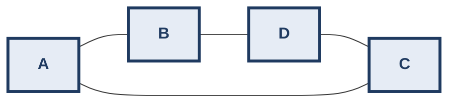
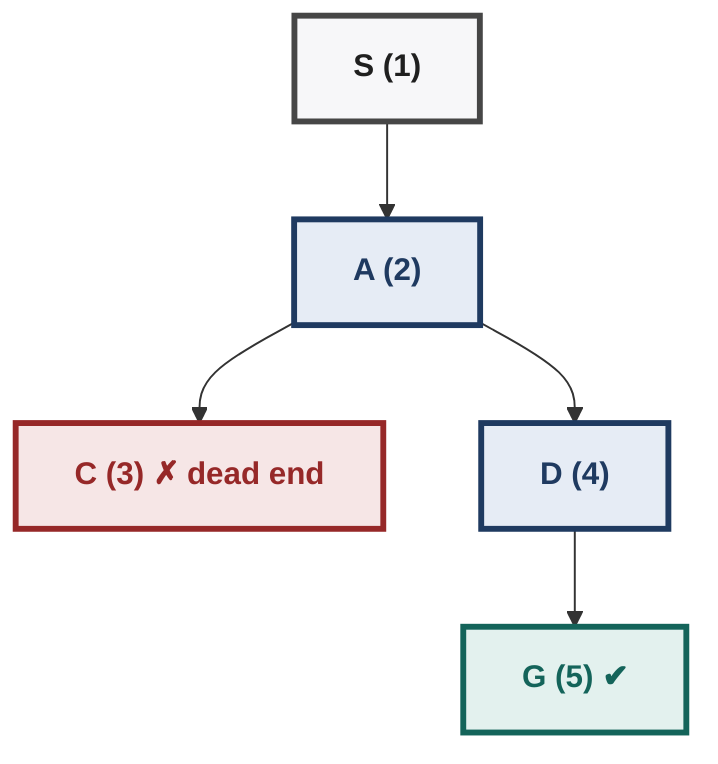
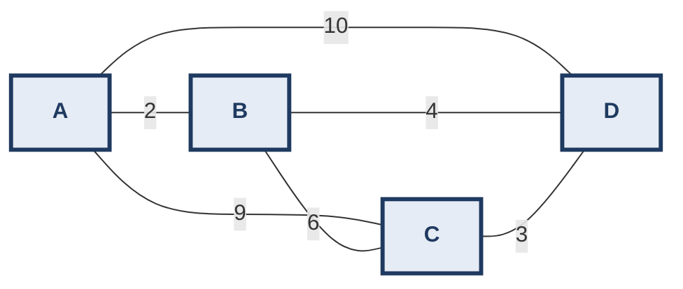

# AI: Search Methods for Problem Solving — Weeks 1-4 Beginner-to-Exam Guidebook
*IITM BS · Khemani course · built from the course notes, the project study guide, and the Term-2 Quiz 1 / ET-1 papers. Every worked answer was re-computed in code using the course's exact conventions.*

> **How to use this guide**
> - **Complete beginner?** Read **Part A (Foundations)** first. It explains graphs, stacks, queues, how to read the course pseudocode, and how to "dry-run" an algorithm with a table. Everything later depends on it.
> - Then read each week in order. Every week has a 🟢 **Beginner Walk-through** (from zero, with pictures), then the exam-level material.
> - Practice problems show the **✅ Solution** directly below each question. Cover it with a sheet of paper, try first, then check.

> **Where this file fits.** Three companions cover Weeks 1-4 differently: this **Guidebook** (fast beginner-to-exam path) · [Workbook](smps-weeks-1-4-workbook.md) (deep solved cases + creative practice) · [Mock Quiz](smps-weeks-1-4-mock-quiz.md) (timed paper + toy-problem reference). Full lecture depth lives in [Week 0](smps-week-0-prep-guide.md) and [Week 1](smps-week-1.md)–[Week 4](smps-week-4.md).

---

## PART A — FOUNDATIONS (Start Here)

## A1 · How to Think Algorithmically (the 6-step habit)

An **algorithm** is a recipe: a finite list of exact steps that turns an input into an output. You don't need to be "good at coding" for this course. You need to be good at **following a recipe exactly and writing down what changes after each step.**

| Step | Ask yourself | Example: "find the largest number in [4, 9, 2, 7]" |
|---|---|---|
| 1. Input & output | What do I start with? What must I produce? | In: a list. Out: one number. |
| 2. Solve a tiny case by hand | How would *I* do it with pen and paper? | Look at each number, remember the biggest so far. |
| 3. Find the repeated step | What do I do again and again? | "Compare next number with best-so-far." |
| 4. Find what I must remember | Which variables change? | `best` |
| 5. Find the stopping rule | When am I done? | When no numbers are left. |
| 6. Dry-run with a table | Write every variable after every step | See below |

**Dry-run table:**

| Step | Number looked at | Is it bigger than `best`? | `best` after the step |
|---|---|---|---|
| start | – | – | 4 |
| 1 | 9 | yes | 9 |
| 2 | 2 | no | 9 |
| 3 | 7 | no | 9 |
| end | – | – | **9** |

> 💡 **This table technique is the single most important exam skill.** Every trace question ("list the first 4 nodes inspected by DFS") is answered by drawing this kind of table, one row per step. Never try to do it in your head.

## A2 · Graphs in 5 Minutes

A **graph** is dots (**nodes**) joined by lines (**edges**). Almost every problem in this course becomes a graph.



Nodes: A, B, C, D. Edges: A–B, A–C, B–D, C–D. Neighbours of A: B and C.
Path from A to D: A → B → D (2 hops). Cycle: A → B → D → C → A (comes back to start).

| Word | Meaning | Picture |
|---|---|---|
| Node / vertex | A dot; in search it is a **state** (a situation) | `A` |
| Edge | A connection; in search it is a **move** | `A ── B` |
| Neighbours | Nodes one edge away | Neighbours(A) = {B, C} |
| Directed edge | One-way street | `A ──▶ B` (can go A to B, not back) |
| Weighted edge | Edge with a cost/distance | `A ──5── B` |
| Path | Sequence of connected nodes | A → B → D |
| Hops | Number of edges on a path | A → B → D = 2 hops |
| Cycle | Path that returns to where it began | A → B → D → C → A |
| Tree | Graph with no cycles; one root at the top | a family tree |

**Why graphs?** Consider the 8-puzzle. Each arrangement of tiles is a node. Sliding a tile is an edge. "Solve the puzzle" means "find a path from the start node to the goal node." That is **state space search**.

## A3 · Three Waiting Lines: Stack, Queue, Priority Queue

Search algorithms keep a list of "places I've found but not yet explored." It is called **OPEN**. The *only* difference between DFS, BFS and Best-First is **which item leaves OPEN next**.

**Stack = pile of plates (Last In, First Out).** You always take the plate you put on top most recently.
```
push A    push B    push C    pop → C    pop → B
 [A]      [B]        [C]       [B]        [A]
          [A]        [B]       [A]
                     [A]
```

**Queue = ticket line (First In, First Out).** First person to join is first served.
```
join A, B, C  →  front [A, B, C] back
serve → A        front [B, C]
join D           front [B, C, D]
serve → B        front [C, D]
```

**Priority queue = hospital emergency room.** The most urgent patient goes first, no matter when they arrived. In Best-First search, "most urgent" = **smallest h** (closest to goal).
```
arrivals: X(h=5), Y(h=2), Z(h=7)   →   sorted: [Y2, X5, Z7]   →  serve Y first
```

| Structure | New items go… | Next out is… | Used by |
|---|---|---|---|
| Stack | to the **front** | the newest | **DFS** |
| Queue | to the **back** | the oldest | **BFS** |
| Priority queue | anywhere, then sorted | the best score | **Best-First** |

## A4 · Reading the Course Pseudocode

The lectures write algorithms in a Haskell-like style. Here is a translation dictionary:

| Symbol | Meaning | Example |
|---|---|---|
| `head L` | first item of list L | head [A,B,C] = A |
| `tail L` | list L without its first item | tail [A,B,C] = [B,C] |
| `x : L` | put x at the **front** of L | A : [B,C] = [A,B,C] |
| `L1 ++ L2` | join two lists | [A] ++ [B,C] = [A,B,C] |
| `(N, parent)` | a **node pair**: the node + who discovered it | (D, B) means "reached D from B" |
| `MoveGen(N)` | list of neighbours of N | MoveGen(A) = [B,C] |
| `GoalTest(N)` | True if N is the goal | GoalTest(G) = True |
| `RemoveSeen` | throw away neighbours already in OPEN or CLOSED | stops repeats and loops |
| `sort_h` | sort by heuristic value, smallest first | used in Best-First |
| OPEN | discovered, **waiting** to be explored | the "to-do list" |
| CLOSED | already explored | the "done list" |

**The only line that differs between DFS and BFS:**
```
DFS:  OPEN ← newPairs ++ tail OPEN      (new ones jump to the FRONT → stack)
BFS:  OPEN ← tail OPEN ++ newPairs      (new ones wait at the BACK → queue)
```

## A5 · The Universal Trace Protocol (exam conventions)

1. **Inspect** a node = take the head of OPEN, run **GoalTest**, and if it fails, run MoveGen.
2. **Goal test happens when a node is taken OUT of OPEN**, not when it is put in. (So BFS may generate the goal early but still inspects nodes queued ahead of it.)
3. **RemoveSeen**: drop children already in OPEN **or** CLOSED.
4. Add children **in MoveGen order** (usually alphabetical; the question tells you).
5. The answer **path** is read backwards using the parent recorded in each node pair.
6. If an algorithm stops at a node that is not the goal, the path is **NIL**.

**Table template to copy on your rough sheet:**

| Step | Popped node | Goal? | MoveGen | After RemoveSeen | OPEN after | CLOSED |
|---|---|---|---|---|---|---|

---

## WEEK 1 — What is AI? History, Philosophy, Problems as Search

## 🟢 1.0 Beginner Walk-through
Think of a **robot vacuum**. It **senses** (bumps, dirt sensors), **decides** (where to go next), **acts** (moves). Now make it smarter: it remembers the room layout (past), knows where it is (present), and plans a route to clean everything (future). That planning is **search**, and it is what this course is about.

The big difficulty is **combinatorial explosion**. If every situation has 10 possible moves, then after 10 moves there are 10¹⁰ = ten billion possible move sequences. We cannot try them all. Every algorithm in this course is a smarter way to avoid trying everything.

## 1.1 Introduction
AI builds agents that **sense → deliberate → act** (Signal → Symbol → Signal). An **intelligent agent** is *persistent* (always there), *autonomous* (self-directed), *proactive* (chooses its own goals) and *goal-directed* (pursues them). Intelligence has three faces: **remember the past** (memory, learning), **understand the present** (knowledge, reasoning), **imagine the future** (search, planning).

## 1.2 Concepts with Examples

| Idea | One-line meaning | Example / hook |
|---|---|---|
| Turing Test (1950, "Imitation Game") | A judge chats by text with a hidden human and a hidden machine. If the judge can't tell which is which, the machine is called intelligent. | Tests **behaviour**, not understanding |
| Total Turing Test | Adds vision and robotics | The judge can hand over objects |
| Chinese Room (Searle, 1980) | Following symbol rules ≠ understanding | A man with a rulebook answers Chinese notes without knowing Chinese |
| Winograd Schema (Levesque, 2011) | Pronoun puzzles that need common sense; each comes as a pair differing by one word | "The trophy didn't fit in the suitcase because **it** was too *big / small*" → trophy / suitcase |
| ELIZA (Weizenbaum, 1966) | Pattern-matching chatbot that fooled people | Shows the Turing Test can be gamed |
| Dartmouth (1956) | The term "AI" is coined (McCarthy) | Birth of the field |
| Physical Symbol System Hypothesis (Newell & Simon) | Symbol manipulation is necessary and sufficient for intelligence | Foundation of symbolic AI |
| Deep Blue (1997) / Watson (2011) / AlphaGo (2016) | Chess, Jeopardy!, Go milestones | Search + evaluation; knowledge; search + learning |

**Two kinds of problems (used all course long):**

| Planning problem | Configuration problem |
|---|---|
| The goal is known; **the path (sequence of moves) is the answer** | **A state that satisfies the rules is the answer**; how you got there doesn't matter |
| River crossing, water jug, 8-puzzle, route finding | N-Queens, Sudoku, SAT, map colouring, TSP |
| Needs parent pointers to rebuild the path | Can use "local search" that only improves one candidate |

**Worked example — classify and represent:**
- *Sudoku* → configuration. State = partially filled grid. Move = write one legal digit.
- *Man, Goat, Lion, Cabbage river crossing* → planning. State = which bank each of the 4 is on (2⁴ = 16 raw states; some are illegal because something gets eaten).
- *Map colouring* → configuration. Can be solved as a constraint problem **or** by state-space search where each move colours one more region.

## 1.3 Worst / Alternate / Novel Angles
- The Turing Test is at best **sufficient** evidence (Turing's view), **not necessary** for intelligence. Passing it doesn't prove thinking (Chinese Room).
- Winograd schemas beat statistical tricks only when carefully built (the one-word flip must flip the answer). Modern LLMs score highly, so "is WSC still a good test?" is a possible question.
- Agent vs program: a program runs once and stops; an agent persists and sets its own goals.
- Early chapters assume: static world, fully known, one agent, actions never fail, representation given. A novel question may relax one assumption and ask what breaks.

## 1.4 Practice (solutions shown below each question)

**P1.** A chatbot passes a 5-minute Turing Test purely by deflecting questions. Which claims hold? (a) it understands English (b) the TT measures behavioural indistinguishability (c) this is the Chinese Room argument (d) a Winograd Schema would likely expose it.

✅ **Solution:** (b) and (d). (c) is related, but the Chinese Room says even *perfect* symbol manipulation isn't understanding; it isn't about deflection. (a) is not established by a TT pass.

**P2.** Classify as planning or configuration: (i) cheapest order to visit delivery points (ii) 8-queens (iii) Towers of Hanoi (iv) a clash-free timetable.

✅ **Solution:** (i) configuration/optimisation (TSP-like) (ii) configuration (iii) planning (iv) configuration (constraint satisfaction).

## 1.5 Things to Remember
| Item | Key fact |
|---|---|
| Agent properties | Persistent · Autonomous · Proactive · Goal-directed |
| Pipeline | Sense → Deliberate → Act (Signal → Symbol → Signal) |
| Turing Test | Behaviour via text; Total TT adds vision/robotics |
| Winograd Schema | Pairs, one-word flip, needs common sense |
| AI's enemy | Combinatorial explosion |
| Planning vs Configuration | Path sought vs State sought |

---

## WEEK 2 — State Space Search: DFS, BFS, DFID

## 🟢 2.0 Beginner Walk-through: What are DFS and BFS here?

### Step 1 — Turn a problem into a graph
Every search problem needs just **three things**:
1. **State**: a snapshot of the situation (e.g. how much water is in each jug).
2. **MoveGen(state)**: the list of states you can reach in one move.
3. **GoalTest(state)**: yes/no, "is this what I want?"

The algorithm never sees the whole graph. It **discovers** it one MoveGen call at a time, like exploring a dark building with a torch.

### Step 2 — The two basic explorers
Imagine you're lost in a **maze** looking for the exit.

- **DFS (Depth-First Search) = the stubborn explorer.** Pick a corridor and keep going as deep as possible. Dead end? Walk back to the last junction and try the next corridor. Uses little memory (you only remember the current route and its side-doors) but may find a long, winding route.
- **BFS (Breadth-First Search) = the ripple.** Drop a stone in water: the ripple reaches everything 1 step away, then everything 2 steps away, and so on. It is guaranteed to find the exit with the **fewest steps**, but it must remember the whole ripple edge, which grows huge.

### Step 3 — A tiny example traced step by step
Graph (undirected), MoveGen gives neighbours **alphabetically**. Start **S**, goal **G**.
```
        S
       / \
      A   B
     / \ / \
    C   D ─ G        edges: S–A, S–B, A–C, A–D, B–D, B–G, D–G
```

**DFS — OPEN is a stack (new nodes go to the FRONT):**

| Step | Pop | Goal? | MoveGen | New after RemoveSeen | OPEN after | CLOSED |
|---|---|---|---|---|---|---|
| 0 | – | – | – | – | [S] | [] |
| 1 | S | no | A, B | A, B | [**A, B**] | S |
| 2 | A | no | C, D, S | C, D (S done) | [**C, D**, B] | S, A |
| 3 | C | no | A | – (A done) | [D, B] | S, A, C |
| 4 | D | no | A, B, G | G (A done, B waiting) | [**G**, B] | S, A, C, D |
| 5 | G | **YES** | | | | |

Inspected: **S, A, C, D, G**. Parents: G←D, D←A, A←S ⇒ path **S → A → D → G** (3 hops).

What the explorer did, as a picture (numbers = inspection order):



C was a dead end → backed up to D.

**BFS — OPEN is a queue (new nodes go to the BACK):**

| Step | Pop | Goal? | New after RemoveSeen | OPEN after |
|---|---|---|---|---|
| 1 | S | no | A, B | [A, B] |
| 2 | A | no | C, D | [B, C, D] |
| 3 | B | no | G (D already waiting) | [C, D, **G**] |
| 4 | C | no | – | [D, G] |
| 5 | D | no | – (G already waiting) | [G] |
| 6 | G | **YES** | | |

Inspected: **S, A, B, C, D, G**. Parents: G←B, B←S ⇒ path **S → B → G** (2 hops, the shortest).

| Level | Nodes | Ripple |
|---|---|---|
| 0 | S | 0 |
| 1 | A, B | 1 |
| 2 | C, D, **G ✔** | 2 (G found at the shallowest level) |

> 🎯 **Notice three exam traps in this tiny example:**
> 1. BFS put G into OPEN at step 3 but only **inspected** it at step 6. Goal test happens on POP.
> 2. DFS found a 3-hop path; BFS found a 2-hop path. **DFS is not guaranteed shortest.**
> 3. At DFS step 4, B was **not** added again because it was already in OPEN (RemoveSeen).

### Step 4 — DFID: the best of both
**Depth-First Iterative Deepening** runs DFS with a depth limit of 0, then 1, then 2 … Each round is cheap in memory like DFS, and because it goes level by level it finds the shortest path like BFS. It repeats work, but the deepest level dominates the cost, so the waste is small.

## 2.1 Introduction (formal)
A problem is fed to a **general-purpose** search algorithm through **MoveGen** and **GoalTest**. OPEN = frontier (seen, not yet expanded); CLOSED = expanded. Algorithms differ **only** in how OPEN is ordered.
```
Simple Search 1: may loop forever        Simple Search 2: + CLOSED list
DFS  : OPEN = stack  (prepend)           BFS : OPEN = queue (append)
DB-DFS: DFS, but don't expand nodes at depth = bound
DFID : DB-DFS with bound 0,1,2,... until path found or node count stops growing
```

## 2.2 Worked Examples

### Example A — Build a state space: Water Jug (8, 5, 3), start [8,0,0], goal "some jug holds 4"
- **State** `[a,b,c]` = litres in the 8, 5, 3 jugs. **Invariant: a+b+c = 8** (water is never created or lost).
- **Move**: pour jug i into jug j until i is empty or j is full.
- MoveGen(800) = {350, 503}. (Pour 8→5 gives 350; pour 8→3 gives 503.)
- MoveGen(350) = {053, 800, 323}.
- Reachable states = **16** (out of 9·6·4 = 216 combinations you could write down).
- BFS shortest: `800 → 350 → 323 → 620 → 602 → 152 → 143` (**6 moves**).
> Trick: count **only reachable** states; invariants shrink the space.

### Example B — Graph properties via an invariant: 4 coins `HHHH`, move = flip any 2 adjacent coins
- Each move flips exactly 2 coins ⇒ the **number of tails stays even** (0, 2 or 4) ⇒ only **8 of 16** states are reachable.
- Each state has **exactly 3 neighbours** (3 adjacent pairs). Flipping the same pair again undoes the move ⇒ **every move is reversible** ⇒ all 8 states are connected.
- `HHHT` is **unreachable**. BFS/DFS explore all 8 states and report failure.
> PYQ "N-square-touch" and "Pallanguzhi" questions have exactly this shape: find the invariant, then answer #states, connectivity and degree.

### Example C — Bigger trace on one graph
Undirected, MoveGen alphabetical, start S, goal G. (Numbers in brackets are h-values used in Week 3.)
```
              S(6)
           /   |   \
        A(5)  B(4)  C(3)
         |     |     |
        E(4)  D(2)  F(2)
         |     |     |
        H(3)   |    J(3)
         |     |     |
        I(1)---G(0)---+        edges into G: I–G, D–G, J–G
```
**DFS:**

| Pop | OPEN after | CLOSED |
|---|---|---|
| S | A B C | S |
| A | E B C | S A |
| E | H B C | S A E |
| H | I B C | … H |
| I | G B C | … I |
| G | goal ✔ | |

Inspected **S,A,E,H,I,G**; path **S,A,E,H,I,G** (5 hops, not shortest).

**BFS:**

| Pop | OPEN after |
|---|---|
| S | A B C |
| A | B C E |
| B | C E D |
| C | E D F |
| E | D F H |
| D | F H **G** |
| F | H G J |
| H | G J I |
| G | goal ✔ |

Inspected **S,A,B,C,E,D,F,H,G**; path **S,B,D,G** (3 hops, shortest).

**DFID** (each row is one full depth-bounded DFS): bound 0: S · bound 1: S,A,B,C · bound 2: S,A,E,B,D,C,F · bound 3: S,A,E,H,B,D,**G** → path **S,B,D,G**. Total inspections 1+4+7+7 = 19.

### Example D — Counting nodes (formula drill)
Uniform tree: every node has **b** children (branching factor), goal at depth **d**.

| Quantity | Formula | b=2, d=3 | b=10, d=5 |
|---|---|---|---|
| Full tree to depth d | (b^{d+1}−1)/(b−1) | 15 | 111 111 |
| DFS best case | d+1 | 4 | 6 |
| BFS best case | (b^d−1)/(b−1)+1 | 8 | 11 112 |
| Worst case (both) | (b^{d+1}−1)/(b−1) | 15 | 111 111 |
| DFID total (worst) | Σ_{k=0..d}(b^{k+1}−1)/(b−1) | 26 | 123 456 |
| DFID ÷ BFS | ≈ b/(b−1) | 1.73 (→2) | 1.11 |

## 2.3 Worst Cases, Alternates, Novel Angles
| Situation | What happens | Exam hook |
|---|---|---|
| Cyclic graph, no CLOSED | Simple Search 1 loops forever | "Which may not terminate?" |
| Infinite state space | DFS may dive forever (incomplete); BFS still finds a goal at finite depth | ET-1 trillion-lightyear grid |
| Goal unreachable | Blind searches exhaust a finite space → failure; DFID stops when the node **count stops growing** | Coin example `HHHT` |
| DFID-N vs DFID-C | DFID-N (never reopens CLOSED) **may miss the shortest path**; DFID-C reopens → shortest | PYQ: "which find shortest (hops)?" → BFS, DFID-C |
| BFS queue replaced by **max-priority queue on depth** | Deepest first = **DFS** ⇒ memory drops from O(b^d) to O(bd): **significantly decreases** | T2 Quiz-1 Q20 |
| Priority queue on path cost g | Uniform-cost search / Dijkstra (optimal with weighted edges) | BFS is optimal only in **hops** |
| Directed / irreversible moves | Some states have no incoming or no outgoing edges | Pallanguzhi: start has no in-edges; dead ends have no out-edges |
| MoveGen order changed | DFS/BFS answers change completely | Practice P1–P2 use a non-alphabetical order |
| Bidirectional search | Two frontiers meet in the middle: ~2·b^{d/2}; needs reversible moves and a known goal | Novel-question candidate |
| Tour through every node of a grid | A grid is **bipartite** (chessboard colouring); an odd number of nodes ⇒ **0 tours** | ET-1: (D+1)² nodes with D even ⇒ answer 0 |
| Boundary effects | Edge-of-board nodes have fewer neighbours and become leaves early | ET-1 "shallowest leaf at depth D/2" |

## 2.4 Practice (solutions shown below each question)
**Graph P** (directed; MoveGen order *exactly as listed*, **not** alphabetical):
`S→[C,A,B]  A→[D,S]  B→[E,D]  C→[F]  D→[G,B]  E→[G]  F→[E,C]  G→[]`

**P1.** DFS: inspected order and path.

✅ **Solution:** OPEN [C,A,B] → pop C → [F,A,B] → pop F (E is new; C is in CLOSED) → [E,A,B] → pop E → [G,A,B] → pop G.
Inspected **S,C,F,E,G**; path **S,C,F,E,G**.

**P2.** BFS: inspected order and path.

✅ **Solution:** [C,A,B] → pop C: [A,B,F] → pop A: [B,F,D] → pop B: [F,D,E] → pop F: [D,E] → pop D: [E,G] → pop E: [G] → pop G.
Inspected **S,C,A,B,F,D,E,G**; path **S,A,D,G**.

**P3.** Missionaries & Cannibals (3 each, boat holds 2). Give a state representation, the number of reachable legal states, and the minimum crossings.

✅ **Solution:** State = (missionaries on left, cannibals on left, boat side). Legal if missionaries are never outnumbered on a bank where they are present. Reachable: **16** states; minimum **11** crossings (by BFS).

**P4.** Towers of Hanoi, 3 discs: number of states, neighbour pattern, minimum moves.

✅ **Solution:** 3³ = **27** states (each disc on one of 3 pegs; order on a peg is forced). The 3 "all discs on one peg" states have 2 neighbours; all others have 3. Minimum moves 2³−1 = **7**. Connected, moves reversible.

**P5.** Your BFS runs out of memory at depth 12 with b=4. Give two fixes that keep the shortest-path guarantee.

✅ **Solution:** DFID (linear space O(bd), time only ≈ ×b/(b−1) = ×1.33) or bidirectional BFS (≈2·4⁶ frontier). Plain DFS would lose optimality.

## 2.5 Things to Remember
| | DFS | BFS | DB-DFS | DFID |
|---|---|---|---|---|
| OPEN | stack (prepend) | queue (append) | stack + depth | repeated DB-DFS |
| Time | O(b^d) | O(b^d) | O(b^d) | O(b^d) ≈ BFS·b/(b−1) |
| Space | **O(bd), linear** | **O(b^d), exponential** | O(bd) | O(bd) |
| Complete? | no (infinite spaces) | yes | no | yes |
| Shortest (hops)? | no | **yes** | no | yes (DFID-C) |
| Memory hook | "stubborn explorer" | "ripple" | "explorer on a leash" | "leash gets longer each round" |

---

## WEEK 3 — Heuristic Search, Local Search, SAT & TSP, Escaping Local Optima

## 🟢 3.0 Beginner Walk-through

### (a) What is a heuristic?
DFS and BFS are **blind**: they don't know where the goal is. A **heuristic h(n)** is an educated guess of "how far is n from the goal?" Example: on a city map, the straight-line distance to your destination. It isn't exact (roads curve), but it points the right way. Rule: **h(goal) = 0.**

- **Best-First Search** = BFS/DFS machinery, but OPEN is a **priority queue sorted by h** (smallest first). Always explore the node that *looks* closest.
- **Hill Climbing** = keep **only** the current node. Look at its neighbours; move to the best one **only if it is strictly better**; otherwise stop.

### (b) Hill climbing in the fog (the local-optimum problem)
You're on a hillside in thick fog, trying to reach the highest peak. You can only feel the ground one step around you. Heights at positions 0–8:

| pos | 0 | 1 | 2 | 3 | 4 | 5 | 6 | 7 | 8 |
|---|---|---|---|---|---|---|---|---|---|
| height | 1 | 3 | **5** | 4 | 6 | 8 | 7 | 2 | 9 |

Walk from 0: `0 → 1 → 2`, then stop! (neighbours 3 and 4 are lower than 5).
Starting at 0: 1 → 3 → 5, then both neighbours (3 and 4) are lower, so hill climbing **stops at height 5**. The true peak (9) is never reached. Position 2 is a **local maximum**. The rest of Week 3 is about escaping such traps.

### (c) What is SAT? (from zero)
You have on/off switches **a, b, c…** (1 = true, 0 = false). A **literal** is a switch or its negation (`a` or `¬a`). A **clause** is literals joined by OR (`a ∨ b` = "a or b must be on"). A formula in **CNF** is clauses joined by AND: *every* clause must be true.

Tiny example: `(a ∨ b) ∧ (¬a ∨ b) ∧ (a ∨ ¬b)`, 3 clauses. Try all 4 settings:

| a | b | a∨b | ¬a∨b | a∨¬b | # clauses satisfied |
|---|---|---|---|---|---|
| 0 | 0 | 0 | 1 | 1 | 2 |
| 0 | 1 | 1 | 1 | 0 | 2 |
| 1 | 0 | 1 | 0 | 1 | 2 |
| 1 | 1 | 1 | 1 | 1 | **3 ✔ solution** |

With n switches there are **2ⁿ** settings, which explodes quickly (50 switches ≈ 10¹⁵). So we treat "number of satisfied clauses" as a **heuristic to maximise** and search by **flipping one switch at a time**.

### (d) What is TSP? (from zero)
**Travelling Salesman Problem:** a salesman must visit every city **exactly once** and return home, travelling the **least total distance**. Such a round trip is called a **tour** (formally, a Hamiltonian cycle).

Four cities with road distances (AB=2, AC=9, AD=10, BC=6, BD=4, CD=3):


Starting at A (the start doesn't matter for a closed loop), list all tours:

| Tour | Legs | Total |
|---|---|---|
| A→B→C→D→A | 2+6+3+10 | 21 |
| A→B→D→C→A | 2+4+3+9 | **18 ✔ best** |
| A→C→B→D→A | 9+6+4+10 | 29 |

(The other 3 orderings are the same loops driven backwards.) For n cities there are **(n−1)!/2** different tours:

| Cities | 4 | 5 | 10 | 20 |
|---|---|---|---|---|
| Tours | 3 | 12 | 181 440 | ≈ 6×10¹⁶ |

Trying all tours is hopeless beyond ~12 cities, so we use:
- **Construction heuristics** that build one tour quickly: *Nearest Neighbour* (always go to the closest unvisited city), *Greedy edge* (add the shortest safe road), *Savings* (merge trips from a base city).
- **Perturbation (improvement) operators** that tweak a complete tour: *swap two cities* (2-city exchange), *remove two roads and reconnect* (2-edge exchange / 2-opt).

**Nearest Neighbour on the 4-city example, starting at A:**

| At | Unvisited choices | Pick | Running total |
|---|---|---|---|
| A | B2, C9, D10 | B | 2 |
| B | C6, D4 | D | 6 |
| D | C3 | C | 9 |
| C | return to A (9) | A | **18** |

Here NN happens to find the best tour. The 5-city example below shows where it fails.

### (e) Solution-space search vs state-space search
For SAT and TSP we don't build a path from a start. We hold a **complete candidate** (a full switch setting, a full tour) and repeatedly **perturb** it to a better one. The "neighbours" of a tour are all tours one swap away. Same hill-climbing idea, different kind of graph.

## 3.1 Introduction (formal)
A **heuristic h(n)** (h(goal)=0) estimates closeness. Best-First sorts OPEN by h: it keeps everything, so it is complete on finite graphs, but not optimal. **Hill Climbing** keeps only the current node (O(1) space) but gets trapped. For **configuration / optimisation** problems (SAT, TSP) we search the **solution space** with **perturbation** operators, plus tricks to escape local optima: Beam, VND, Best-Neighbour, Tabu, Iterated HC, Random Walk, Stochastic HC, **Simulated Annealing**.

## 3.2 Worked Examples

### Example A — Best-First and Hill Climbing on the Week-2 graph (Example C)
**Best-First** (sort by h, ties alphabetical):

| Pop | OPEN after (h) |
|---|---|
| S | C3 B4 A5 |
| C | F2 B4 A5 |
| F | J3 B4 A5 |
| J | G0 B4 A5 |
| G | goal ✔ |

Inspected **S,C,F,J,G**; path **S,C,F,J,G** (4 hops; BFS found 3) → **not optimal**.

**Hill Climbing** (move only if strictly better): S(6) → C(3) → F(2); F's neighbours C(3), J(3) are not better → **stop at F** ⇒ path **NIL**. F is a **local minimum**.
> Same pattern as a PYQ: HC inspected S,D,H → NIL.

### Example B — 8-puzzle heuristics
```
start  2 8 3     goal  1 2 3
       1 6 4           8 _ 4
       7 _ 5           7 6 5
```
h₁ (misplaced tiles): 2, 8, 1, 6 are out of place → **4**. h₂ (sum of Manhattan distances): 1+2+1+1 = **5**. h₂ ≥ h₁ always (h₂ dominates, i.e. is better informed). The blank is never counted.

### Example C — SAT by Hill Climbing (maximise # satisfied clauses)
Formula (CNF, 4 variables a b c d, 7 clauses):
`(a∨b)(¬a∨c)(¬b∨¬c)(c∨d)(¬d∨¬a)(¬c∨¬d)(b∨d)`. Unique solution: **0101** (a=0, b=1, c=0, d=1).
Neighbourhood = flip one bit (4 neighbours). Start **1000**:

| Current (h) | Neighbours: flip a, b, c, d | Move |
|---|---|---|
| 1000 (4) | 0000·4, 1100·5, **1010·6**, 1001·5 | → 1010 |
| 1010 (6) | 0010·5, 1110·6, 1000·4, 1011·5 | none better ⇒ **stuck at a local maximum, 6/7** |

**Tabu Search** (tenure 2 = a flipped bit may not be flipped again for the next 2 moves; always take the best *allowed* neighbour, even if it is not better):

| Step | Flip | New state (h) | Tabu bits |
|---|---|---|---|
| 1 | c | 1010 (6) | c |
| 2 | b | 1110 (6) ← sideways move allowed | c, b |
| 3 | a | 0110 (6) | b, a |
| 4 | c | 0100 (6) | a, c |
| 5 | d | **0101 (7)** ✔ | c, d |

> Hill Climbing cannot cross the flat stretch of 6s. Tabu walks across it because it is forbidden to undo its recent flips.

### Example D — TSP construction and improvement (5 cities, symmetric)
|   | A | B | C | D | E |
|---|---|---|---|---|---|
| A | – | 12 | 10 | 19 | 8 |
| B | 12 | – | 3 | 7 | 2 |
| C | 10 | 3 | – | 6 | 20 |
| D | 19 | 7 | 6 | – | 4 |
| E | 8 | 2 | 20 | 4 | – |

**Euclidean?** Check the triangle inequality on triples: d(A,D) = 19 > d(A,E) + d(E,D) = 12 ⇒ violated ⇒ **non-Euclidean** (points on a flat plane could never violate it).

**Nearest Neighbour from A:**

| At | Unvisited distances | Pick |
|---|---|---|
| A | B12, C10, D19, E8 | E |
| E | B2, C20, D4 | B |
| B | C3, D7 | C |
| C | D6 | D |
| D | return to A = 19 | – |

Tour **A,E,B,C,D** = 8+2+3+6+19 = **38**. The forced return leg (19) is NN's classic weakness.

**Greedy edge** (sort all edges; accept if no city gets 3 edges and no loop closes early):

| Edge | Length | Accept? | Reason |
|---|---|---|---|
| BE | 2 | ✔ | |
| BC | 3 | ✔ | |
| DE | 4 | ✔ | chain now C-B-E-D |
| CD | 6 | ✗ | would close a loop of only 4 cities |
| BD | 7 | ✗ | B already has 2 edges |
| AE | 8 | ✗ | E already has 2 edges |
| AC | 10 | ✔ | chain A-C-B-E-D |
| AB | 12 | ✗ | B full |
| AD | 19 | ✔ | closes the full tour |

Tour A-C-B-E-D-A = **38**.

**Savings, base city A:** start with a separate out-and-back trip from A to every city. Joining cities x and y directly saves S(x,y) = d(A,x) + d(A,y) − d(x,y).

| Pair | BD | CD | DE | BC | BE | CE |
|---|---|---|---|---|---|---|
| Saving | 24 | 23 | 23 | 19 | 18 | −2 |

Take BD ✔, CD ✔ (D now has 2 links), DE ✗ (D full), BC ✗ (would close a loop), BE ✔ → chain C-D-B-E; connect both ends to A → **A,C,D,B,E = 33**.

**2-edge exchange (2-opt) on the NN tour** A,E,B,C,D (38): remove edges E–B and D–A, reverse the segment B..D → **A,E,D,C,B = 33**. **2-city exchange** swapping B↔D gives the same tour, 33. **Optimum** (brute force over 4!/2 = 12 tours): **A,C,B,D,E = 32**.
> Lesson: construction heuristics give a starting tour; perturbation improves it; neither guarantees the optimum.

### Example E — Simulated Annealing numbers (course sigmoid, maximisation)
P(move) = 1 / (1 + e^{−ΔE/T}), where ΔE = eval(neighbour) − eval(current). Positive ΔE = better neighbour.

| T | ΔE = −20 | −5 | +5 | +20 |
|---|---|---|---|---|
| 100 | 0.450 | 0.488 | 0.512 | 0.550 |
| 10 | 0.119 | 0.378 | 0.622 | 0.881 |
| 1 | 0.000 | 0.007 | 0.993 | 1.000 |

High T ⇒ about 0.5 for everything (**random walk**, exploration). T → 0 ⇒ move **only if the neighbour is better** (**hill-climbing-like**, exploitation). Analogy: hot metal atoms jiggle freely; slow cooling lets them settle into a strong low-energy crystal.

## 3.3 Worst Cases, Alternates, Novel Angles
| Case | Behaviour | Remedy / fact |
|---|---|---|
| **Local optimum** | HC halts | Restarts (Iterated HC), Tabu, SA |
| **Plateau** (equal neighbours) | HC with strict "better" halts | Best-Neighbour / Tabu allow sideways moves |
| **Ridge** | Every single-step neighbour is worse, although "uphill" exists diagonally | Denser neighbourhood (VND) |
| Best-Neighbour | Leaves a local max, then **returns next step** (cycles) | Add a tabu list → Tabu Search |
| Tabu tenure too short / too long | Cycling / too rigid | Aspiration: allow a tabu move if it beats bestSeen; frequency memory pushes to rarely-flipped bits |
| Beam width w | w=1 ⇒ Hill Climbing; w=∞ ⇒ Best-First | Space O(w) per level; not complete |
| VND | HC using sparse → dense MoveGens (1-flip, then 2-flip, …) | Denser = fewer local optima but costlier steps |
| Does h define max or min? | "h = distance to goal" ⇒ **minimise**; "satisfied clauses / shells in cups" ⇒ **maximise** | PYQs ask exactly this |
| h scaled (e.g. squared distance) | Same ordering for Best-First/HC, but breaks admissibility later (A*) | ET-1: squared Euclidean ⇒ inadmissible |
| CNF traps | One clause `A∨B∨¬C∨D` **is CNF**; all unit clauses `A∧B∧¬C∧D` **is CNF** | `(A∧B)∨…` is DNF; `A∨(B∧(…))` is neither |
| k-SAT | 2-SAT is polynomial; 3-SAT is NP-complete; n variables ⇒ 2ⁿ candidates | Solution-space size |
| TSP size | (n−1)!/2 tours; grows faster than 2ⁿ | 5 cities → 12; 10 → 181 440 |
| NN depends on start city | Different start ⇒ different tour (here B gives 34) | "Try all starts" = cheap improvement |
| Neighbourhood sizes | bit-flip: n; 2-city exchange: C(n,2); 2-edge exchange: n(n−3)/2 | City exchange is a special case of 4-edge exchange |
| Asymmetric TSP | Reversing a segment changes its cost | Recompute every edge after 2-opt |
| No tour exists | Bipartite graph with odd #nodes; very sparse graphs | ET-1 answer "0" |
| SA formula variant | Textbook (Metropolis): always accept better, accept worse with e^{ΔE/T} | Use the formula the question gives |
| Minimisation in SA | Use ΔE = eval(current) − eval(neighbour) | Sign errors lose marks |

## 3.4 Practice (solutions shown below each question)

**P1.** Graph P (Week 2 practice), h: S7 A4 B5 C3 D2 E4 F4 G0. Give Best-First's inspected order and path, and the Hill Climbing result.

✅ **Solution:** Best-First: pop S → OPEN C3, A4, B5 → pop C (adds F4) → OPEN A4, F4, B5 (tie A before F) → pop A (adds D2) → pop D (adds G0) → pop G.
Inspected **S,C,A,D,G**; path **S,A,D,G**. Hill Climbing: S → C(3); C's only child F(4) is worse ⇒ stop ⇒ **NIL**.

**P2.** Beam search on Graph P with width 2 and width 1 (keep the best w children of the whole beam; stop if the head doesn't improve).

✅ **Solution:** w=2: [C,A] → children F, D, S → keep [D,F] → children G, B, E, C → keep [G,C] → goal found ✔.
w=1: [C] → [F]; h(F)=4 is not better than h(C)=3 ⇒ stop, return C (identical to Hill Climbing).

**P3.** SAT `(a∨¬b)(b∨c)(¬a∨¬c)(a∨c)(¬b∨¬c)`, start 111, one-bit-flip Hill Climbing.

✅ **Solution:** 111 (3 satisfied) → neighbours 011·3, 101·4, **110·5** → 110 satisfies all 5 ✔. The full solution set is {001, 110}.

**P4.** TSP on P, Q, R, S, T with PQ5 PR9 PS4 PT7 QR3 QS8 QT6 RS10 RT2 ST11. Give the NN tour from P, the Savings tour (base P), and say whether it is Euclidean.

✅ **Solution:** NN: P→S(4)→Q(8)→R(3)→T(2)→P(7) = **24**.
Savings: RT 14 ✔, QR 11 ✔, QT 6 ✗ (loop), RS 3 ✗ (R full), QS 1 ✔ ⇒ chain S-Q-R-T ⇒ **P,S,Q,R,T = 24** (also the optimum).
Non-Euclidean: d(P,R) = 9 > d(P,Q) + d(Q,R) = 8.

**P5.** SA with ΔE = ±10: P(move) at T = 50, 5, 0.5?

✅ **Solution:** T=50: 0.450 / 0.550. T=5: 0.119 / 0.881. T=0.5: ≈0 / ≈1. As T falls, bad moves disappear.

**P6.** Why can Hill Climbing fail on a plateau while Best-First succeeds on the same graph?

✅ **Solution:** Best-First keeps OPEN, so it can go back to any node it has seen. Hill Climbing keeps only the current node and needs strict improvement: it has "burnt its bridges".

## 3.5 Things to Remember
| Algorithm | Keeps | Moves when | Escapes local opt? | Space | Notes |
|---|---|---|---|---|---|
| Best-First | whole OPEN (sorted by h) | always pops min h | yes (backtracks) | exponential | complete if finite; not optimal |
| Hill Climbing | current node | strictly better | **no** | O(1) | not complete |
| Beam (w) | best w | head improves | rarely | O(w) | w=1 HC, w=∞ Best-First |
| VND | current node | better in MoveGen_i | partly | O(1) | sparse → dense |
| Best-Neighbour | current + bestSeen | always best neighbour | leaves, then returns | O(1) | external stop |
| Tabu | + tabu list | best **allowed** neighbour | **yes** | O(tenure) | aspiration override |
| Iterated HC | best so far | random restarts | yes (probabilistic) | O(1) | |
| Random Walk | best so far | random neighbour | yes, aimless | O(1) | |
| SA | current + best | P = 1/(1+e^{−ΔE/T}) | **yes** | O(1) | hot = explore, cold = exploit |

| TSP method | Rule | Weakness |
|---|---|---|
| Nearest Neighbour | go to the nearest unvisited city | long closing edge; depends on start |
| Greedy edge | shortest edge, degree ≤ 2, no early loop | can leave expensive edges for last |
| Savings | S(a,b) = C(n,a)+C(n,b)−C(a,b), merge largest first | depends on base city |
| 2-city exchange | swap two cities | changes up to 4 edges |
| 2-edge / 3-edge exchange | remove k edges, reconnect | neighbourhood cost O(n^k) |

---

## WEEK 4 — Population-Based Methods: GA, Emergent Systems, ACO

## 🟢 4.0 Beginner Walk-through

### (a) Genetic Algorithm = breeding better answers
Instead of improving one candidate, keep a **population** of candidates and let the good ones "have children."

Toy problem (**OneMax**): find a 5-bit string with as many 1s as possible. Fitness = number of 1s.

| Step | What happens | Example |
|---|---|---|
| 1. Population | Random candidates | 11000 (fit 2), 00111 (fit 3), 01010 (fit 2), 10001 (fit 2) |
| 2. Selection | Fitter ones are more likely to be picked as parents | 00111 and 11000 picked |
| 3. Crossover | Cut both parents at the same point and swap tails | `11 \| 000` + `00 \| 111` → **11111** and 00000 |
| 4. Mutation | Rarely flip a random bit (keeps variety) | 00000 → 00100 |
| 5. Replace | Best children replace the weakest members | 11111 (fit 5) joins |

Parent 11000 contributed the "good front", 00111 the "good back". Crossover combined them into the perfect answer. That is the core idea.

### (b) Why TSP breaks naive crossover
Tours are **orderings**, not bit strings. Cut `CAFH|BEDG` and `FDEA|GCHB` after position 4 and swap tails → `CAFH` + `GCHB` = **C A F H G C H B**: C and H appear twice, and D and E are missing. Not a valid tour! So TSP needs special crossovers (Cycle, PMX, Order) or special representations (ordinal).

### (c) Ant colonies = shared memory through the environment
Ants wander, leaving **pheromone** (a scent). Ants on short routes come back sooner and lay pheromone more often, so short routes smell stronger; more ants follow them; the scent strengthens further. Scent also **evaporates**, so abandoned routes fade. Nobody plans the shortest route. It **emerges**.

## 4.1 Introduction (formal)
**GA**: Selection (fitness-proportional) → Crossover (mix genes) → Mutation (rare random change) → Replace the weakest with the best offspring. Representation is everything. **Emergent systems**: simple local rules produce complex global behaviour (Game of Life, fractals, ant trails). **ACO**: ants build tours stochastically using pheromone τ and visibility η = 1/d; good tours deposit more pheromone; evaporation ρ forgets.

## 4.2 Worked Examples

### Example A — Roulette-wheel selection
Fitness 10, 20, 30, 40 (total 100) → slice angles = 360·f/Σf = **36°, 72°, 108°, 144°**. Spin 4 times → pick 4 parents.

| Fitness | Slice | Expected copies (N·f/Σf, N = 4) |
|---|---|---|
| 10 | 36° | 0.4 |
| 20 | 72° | 0.8 |
| 30 | 108° | 1.2 |
| 40 | 144° | 1.6 |
> Fitness must be positive. For TSP (minimise cost), use e.g. fitness = 1/cost.

### Example B — Three TSP representations of P1 = `C A F H B E D G` (reference order A..H)
- **Path:** the list itself (each city once; the return home is implied). One tour has **2n** path strings (n starting cities × 2 directions).
- **Adjacency:** the slot for city X holds the city visited **after** X. C→A, A→F, F→H, H→B, B→E, E→D, D→G, G→C. Reading slots A..H: **F E A G D H C B**. One tour has **2** adjacency strings (two directions), which is why a PYQ had two correct options.
- **Ordinal:** for each city in turn, write its position in the list of **remaining** cities, then cross it off.

| City | Remaining list | Position |
|---|---|---|
| C | A B **C** D E F G H | 3 |
| A | **A** B D E F G H | 1 |
| F | B D E **F** G H | 4 |
| H | B D E G **H** | 5 |
| B | **B** D E G | 1 |
| E | D **E** G | 2 |
| D | **D** G | 1 |
| G | **G** | 1 |

Ordinal = **3 1 4 5 1 2 1 1**. The last entry is always 1.
- Why ordinal? **Single-point crossover always gives a valid tour.** Ordinal of P2 (`F D E A G C H B`) = 6 4 4 1 3 2 2 1. Cut after position 4: `3 1 4 5 | 3 2 2 1` → decode → **C A F H E D G B** (valid!).

### Example C — Crossover operators, P1 = `C A F H B E D G`, P2 = `F D E A G C H B`
**Cycle Crossover (CX)**: follow positions until you return to the start.
```
pos:  1  2  3  4  5  6  7  8
P1:   C  A  F  H  B  E  D  G
P2:   F  D  E  A  G  C  H  B
Cycle 1: pos1 (C/F) → F is at P1 pos3 → (F/E) → E is at P1 pos6 → (E/C) → back to C ⇒ {1,3,6}
Cycle 2: pos2 (A/D) → D at pos7 → (D/H) → H at pos4 → (H/A) ⇒ {2,4,7}
Cycle 3: pos5 (B/G) → G at pos8 → (G/B) ⇒ {5,8}
```
C1 takes odd-numbered cycles from P1 and even-numbered cycles from P2 → **C D F A B E H G**; C2 → **F A E H G C D B**. Every city keeps its **position** from one parent.

**PMX** (segment positions 3–5): P1 gives F H B; P2 has E A G there → mapping F↔E, H↔A, B↔G. Fill the other positions from P2, chasing the mapping when a city is already used: pos1 F→E, pos2 D, pos6 C, pos7 H→A, pos8 B→G ⇒ C1 = **E D F H B C A G**.

**Order Crossover (OX)** (same segment): keep F H B from P1; fill the rest with the remaining cities in P2's order (D E A G C):
- Course / left-to-right fill: **D E F H B A G C**
- Classic Davis OX (start filling after the 2nd cut and wrap around; read P2 from after the cut): **A G F H B C D E**
> If an MCQ's options match only one variant, that is the convention being used.

**Alternating edges:** take the successor from P1, then from P2, alternately (if it would close a loop, pick an unvisited city). **Heuristic crossover:** from each city, take whichever parent's successor is closer.

### Example D — ACO move probability and pheromone update
At city A, allowed cities {B, C, D}; pheromone τ = 1, 2, 1; distance d = 2, 4, 1; α = 1, β = 2.

| City | τ^α | (1/d)^β | weight | P = weight / total |
|---|---|---|---|---|
| B | 1 | 1/4 | 0.25 | 0.182 |
| C | 2 | 1/16 | 0.125 | 0.091 |
| D | 1 | 1 | 1.0 | **0.727** |
| total | | | 1.375 | 1 |

Update an edge with τ = 1, ρ = 0.5, used by two ants (Q = 100) with tours of length 50 and 80:
τ ← (1−0.5)·1 + 100/50 + 100/80 = **3.75**.

### Example E — Game of Life
Rules: a live cell with 2–3 live neighbours survives; a dead cell with exactly 3 is born; otherwise the cell dies/stays dead.
```
Blinker (period 2):     . . .      . X .
                        X X X  ⇄   . X .
                        . . .      . X .
Block (stable):  X X  stays  X X
                 X X         X X
```
A glider moves diagonally; Gosper's glider gun emits gliders forever.

## 4.3 Worst Cases, Alternates, Novel Angles
| Situation | Effect | Fix / answer |
|---|---|---|
| Premature convergence (everyone identical, suboptimal) | Crossover of identical parents changes nothing | **Increase mutation rate**, larger/more diverse population, reduce selection pressure |
| High selection pressure / truncation | Faster convergence, less diversity | – |
| Mutation rate too high | GA becomes random search | – |
| Crossover on path representation for TSP | Duplicate/missing cities | CX, PMX, OX, or ordinal/adjacency representations |
| Ordinal drawback | Always valid, but a gene's meaning depends on earlier genes, so children inherit little | Trade-off question |
| Elitism | Keep the best unchanged | Course form: "replace k weakest with k strongest offspring" |
| ACO α = 0 | Ignores pheromone ⇒ stochastic nearest-neighbour | – |
| ACO β = 0 | Ignores distance ⇒ pure trail following (can lock onto bad trails) | – |
| ρ → 1 / ρ → 0 | Forget everything each round / trails never fade (stagnation) | ρ balances exploration |
| Deposit Q/L | Shorter tour ⇒ more pheromone per edge | Positive feedback = emergence |
| GA vs SA vs Tabu | Population vs single stochastic vs single with memory | "Which use a population?" GA, ACO |
| SAT in a GA | Bit-string; fitness = # satisfied clauses; single-point crossover always valid | Contrast with TSP |

## 4.4 Practice (solutions shown below each question)

**P1.** P1 = D A E B C, P2 = B C D E A. Give the cycle-crossover children.

✅ **Solution:** pos1 (D/B) → B is at P1 pos4 → (B/E) → E is at P1 pos3 → (E/D) → back ⇒ cycle 1 = {1,3,4}; cycle 2 = {2,5}.
C1 = **D C E B A**, C2 = **B A D E C**.

**P2.** Decode ordinal 2 2 3 1 1 (reference A..E).

✅ **Solution:** ABCDE → 2nd = B; ACDE → 2nd = C; ADE → 3rd = E; AD → 1st = A; D ⇒ **B C E A D**.

**P3.** Adjacency representation of D A E B C (reference A..E).

✅ **Solution:** A→E, B→C, C→D, D→A, E→B ⇒ **E C D A B**.

**P4.** Fitness 5, 15, 20, 40, 20 with N = 5. Expected copies of each?

✅ **Solution:** N·f/Σf = 0.25, 0.75, 1.0, 2.0, 1.0. The weakest may vanish; the best probably gets 2 copies.

**P5.** From city P, allowed Q, R, S with τ = 3, 1, 2 and d = 2, 1, 4. Give P(move) for (α,β) = (1,1), (2,1), (1,0), (0,1).

✅ **Solution:** (1,1): 0.500, 0.333, 0.167 · (2,1): 0.692, 0.154, 0.154 · (1,0): 0.500, 0.167, 0.333 (pheromone only) · (0,1): 0.286, 0.571, 0.143 (distance only).

**P6.** τ = 3 on an edge, ρ = 0.2, one ant with tour length 40 (Q = 100) used it. New τ?

✅ **Solution:** 0.8·3 + 100/40 = **4.9**.

**P7.** A GA's whole population becomes 1010 (fitness 6/7) while the optimum is 0101. Which operator can still reach the optimum, and why can't crossover?

✅ **Solution:** Only **mutation**. Crossing two identical strings reproduces them. Hence: raise the mutation rate.

## 4.5 Things to Remember
| Item | Key fact |
|---|---|
| GA loop | Select (∝ fitness) → Crossover → Mutate → Replace weakest |
| Roulette angle | 360·fᵢ/Σf |
| Path representation | 2n strings per tour; duplicates break naive crossover |
| Adjacency representation | slot X = successor of X; 2 strings per tour |
| Ordinal representation | position in remaining list; 1-point crossover always valid |
| CX | positions preserved; odd cycles from P1, even from P2 |
| PMX | copy segment, resolve the rest via the mapping chain |
| OX | copy segment, fill the rest in P2's relative order |
| ACO probability | τ^α·η^β / Σ over allowed cities, η = 1/d |
| ACO update | τ ← (1−ρ)τ + Σ Q/L_k |
| Game of Life | survive with 2–3; birth with exactly 3 |
| Premature convergence | increase mutation / diversity |

---

## 5 · Speed Card (the night before)

| If the question says… | Answer instinct |
|---|---|
| "shortest path in hops" | BFS, DFID-C (not DFS, Best-First, HC, DFID-N) |
| "linear space" | DFS, DB-DFS, DFID (HC/SA/Tabu use constant-ish space) |
| "BFS queue → max-priority queue on depth" | becomes DFS ⇒ memory **significantly decreases** |
| "T → 0 in SA" | move only if the neighbour is better |
| "T → ∞ in SA" | random walk (P ≈ ½) |
| "beam width 1 / ∞" | Hill Climbing / Best-First |
| "HC ended at a non-goal" | path **NIL** |
| "Savings formula" | C(n,a)+C(n,b)−C(a,b) |
| "NN's drawback" | long final return edge |
| "Perturbation operators for TSP" | 2-city exchange, k-edge exchange (not crossover, not NN) |
| "Is it CNF?" | AND of ORs; a single OR clause, or all single-literal clauses, also count |
| "Euclidean TSP?" | any triangle-inequality violation ⇒ non-Euclidean |
| "# TSP tours on a grid with an odd number of nodes" | 0 (bipartite parity) |
| "# unique states" | reachable only; use invariants (sum, parity) |
| "h = distance to goal" | minimisation |
| "GA converged prematurely" | increase mutation |

### 60-second trace checklist
1. Write down the MoveGen order.
2. Draw OPEN / CLOSED columns (Part A5 template).
3. Goal test on **pop**.
4. RemoveSeen against **both** lists.
5. Record the parent of every node.
6. Hill Climbing: strict improvement only.
7. Re-read the answer format (no spaces, NIL).

---

## 6 · Supplementary Material (when the core notes fall short)
- **Deepak Khemani, *A First Course in Artificial Intelligence*** (McGraw Hill): chapters 1–4 match weeks 1–4 and are the source of the course's pseudocode and conventions.
- **NPTEL: "Artificial Intelligence: Search Methods for Problem Solving" (Khemani)**: the same lectures on YouTube. Rewatch the SAT/TSP and GA-crossover segments with pen in hand.
- **Russell & Norvig, *AIMA*** chapters 3–4: an alternate view (uniform-cost, bidirectional, local search, Metropolis SA). Watch for differing conventions, e.g. goal test on generation.
- **Hands-on habit:** the project's AI-Guide maps each algorithm to LeetCode practice (Word Ladder for BFS, Find Peak Element for Hill Climbing). Before coding any of them, write the State, MoveGen and GoalTest on paper.
