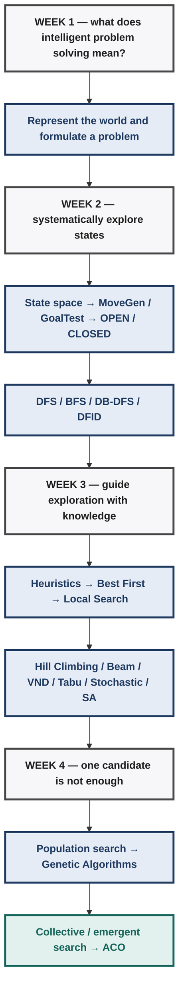
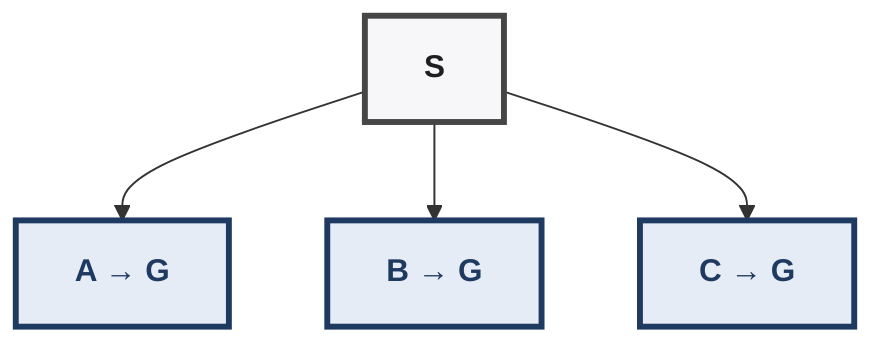
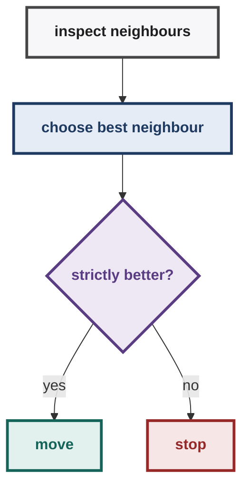
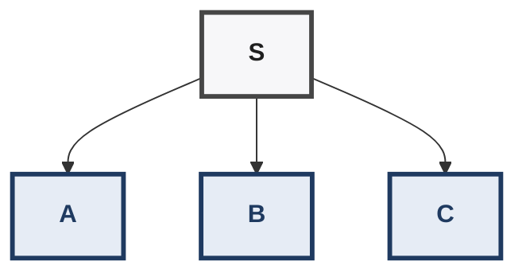
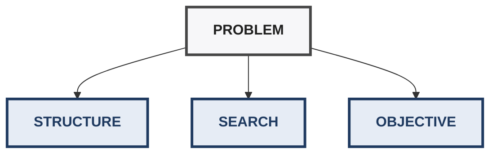
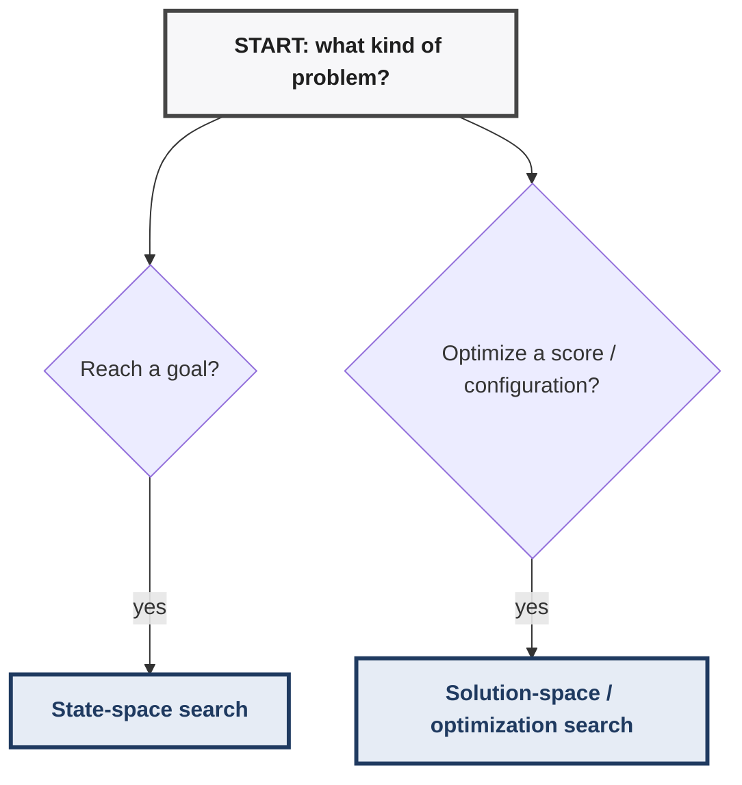

# AI: Search Methods for Problem Solving — Weeks 1-4 Mastery & Creative Problem-Solving Workbook

> **Purpose:** A progressive learning-and-practice workbook for Weeks
> 1--4. It is designed for questions that look unfamiliar, contain
> distracting information, or require graph-theoretic facts that are not
> obvious from the algorithm definition.
>
> **Scope:** Weeks 1-4 only. A\* and admissibility are excluded because
> A\* begins in Week 5 in the supplied syllabus.

------------------------------------------------------------------------

## 0. How to Use This Workbook

> **Where this file fits.** Deep practice: the [Guidebook](smps-weeks-1-4-guidebook.md) teaches the same weeks fast, the [Mock Quiz](smps-weeks-1-4-mock-quiz.md) tests them timed, and this file drills them with solved cases. Full lecture depth lives in [Week 0](smps-week-0-prep-guide.md) and [Week 1](smps-week-1.md)–[Week 4](smps-week-4.md).

Do not read this as ordinary notes. Use the cycle:


For every difficult question, first write:

``` text
1. What is the state?
2. What is the start?
3. What is the goal / objective?
4. What is MoveGen?
5. What algorithm is being used?
6. What exactly does it select next?
7. What information does it remember?
8. What mathematical/graph property might simplify the problem?
9. What exactly is being asked?
```

The central habit is:

> **Do not solve the story. Solve the formal machine hidden inside the
> story.**

------------------------------------------------------------------------

## 1. The Big Picture: Weeks 1-4 as One Progression

The course progression is:



The deeper conceptual progression is:

$$
\boxed{\text{Represent} \rightarrow \text{Search} \rightarrow \text{Guide} \rightarrow \text{Escape} \rightarrow \text{Search Collectively}}
$$

------------------------------------------------------------------------

## PART I — WEEK 1 FOUNDATIONS

## 2. Intelligent Agents

An intelligent agent can be viewed as a system that:

``` text
sense → represent → reason → choose → act
```

The supplied course material characterizes an intelligent agent using
**PAPA-G**:

-   **Persistent** --- continues to exist/operate rather than being a
    one-shot calculation.
-   **Autonomous** --- can direct its behaviour rather than requiring
    every action to be explicitly specified.
-   **Proactive** --- can pursue sub-goals rather than merely reacting
    to external commands.
-   **Goal-directed** --- acts toward goals.

A separate mnemonic, **SCOAR-D**, describes assumptions about the
environment/problem rather than agent traits:

-   Static
-   Completely-known
-   One-agent
-   Actions-never-fail
-   Representation-given
-   Discrete

## Exam trap

Do not mix these two categories.

``` text
PAPA-G → properties of the agent
SCOAR-D → assumptions about the environment/problem
```

## Solved Example — Agent Property

A cleaning robot replans its route when furniture moves, but never
decides by itself to clean a room nobody asked it to clean.

### Answer

It can be autonomous in carrying out the assigned task, but it is not
**proactive** because it does not generate its own sub-goals.

### Thinking lesson

Do not answer from a vague impression such as "the robot seems
intelligent." Map the scenario to the exact property.

------------------------------------------------------------------------

## 3. Turing Test

The Turing Test reframes the vague question "Can machines think?" as a
behavioural test.

A human judge communicates through text with hidden participants,
including a human and a machine. If the judge cannot reliably
distinguish the machine from the human in the test setting, the machine
is said to exhibit human-like intelligent behaviour under that test.

The test is primarily about:

-   observable behaviour;
-   conversation;
-   imitation/human-like interaction.

It does **not** by itself settle every philosophical question about
whether a machine genuinely understands or has a mind.

## ELIZA and the ELIZA effect

Simple pattern-based systems can sometimes produce surprisingly
convincing conversation. The ELIZA effect refers to the tendency of
humans to attribute greater understanding or intelligence to a
conversational system than its internal mechanism necessarily warrants.

### Exam thinking

If a question describes an open-ended conversational interaction with a
hidden machine and human, think **Turing Test**.

------------------------------------------------------------------------

## 4. Winograd Schema Challenge

A Winograd-style problem uses a deliberately ambiguous sentence and asks
for a forced choice between possible interpretations. A carefully
changed word can alter the correct interpretation.

The intended capability is contextual and commonsense reasoning rather
than merely producing fluent conversation.

Typical reasoning may involve:

-   social roles;
-   physical consequences;
-   size;
-   containment;
-   action relationships;
-   commonsense knowledge.

## Solved Example

> "The lawyer asked the witness a question, but he was reluctant to
> answer it."

Suppose the system must choose between "lawyer" and "witness," and a
contrastive word changes the intended answer.

### Answer

This is a **Winograd Schema-style** task because it is a forced
contextual interpretation problem rather than open-ended conversation.

## Turing vs Winograd

  -----------------------------------------------------------------------
  Feature                 Turing Test             Winograd Schema
  ----------------------- ----------------------- -----------------------
  Main target             Human-like              Contextual
                          conversational          reasoning/commonsense
                          behaviour               

  Interaction             Open-ended              Forced choice

  Key trap                Canned conversational   Surface word statistics
                          behaviour               

  Central question        Can it behave like a    Can it resolve context
                          human?                  correctly?
  -----------------------------------------------------------------------

------------------------------------------------------------------------

## 5. Representation Is the Bridge to Search

An AI system does not search "the real world" directly. It operates on a
representation of a problem.

A useful abstraction is:

$$
\text{World} \rightarrow \text{Representation} \rightarrow \text{Search Space} \rightarrow \text{Solution}
$$

This becomes central in Week 2.

If the representation is wrong, the search algorithm can be perfectly
executed and still solve the wrong problem.

------------------------------------------------------------------------

## 6. Planning vs Configuration

A **planning problem** cares about the sequence of actions.

A **configuration problem** cares primarily about the final valid
arrangement.

Diagnostic question:

> **If I know the final state but not the sequence used to construct it,
> do I still have a solution?**

If yes, it is likely configuration/solution-space search.

## Solved Example — Sudoku

A completed Sudoku grid is the answer. The order in which cells were
filled is not itself part of the final solution.

Therefore it is naturally a **configuration problem**.

## Solved Example — Robot Route

A robot must travel from warehouse S to destination G. The route itself
matters.

Therefore it is naturally a path/planning problem.

------------------------------------------------------------------------

## PART II — GRAPH AND STATE-SPACE FOUNDATIONS

## 7. State

A state is a complete description of the relevant world situation at a
moment.

Examples:

### Grid

$$
State=(x,y)
$$

### Water jugs

$$
State=(a,b,c)
$$

### 8-puzzle

$$
State=\text{complete board configuration}
$$

### N-Queens

$$
State=\text{current queen configuration}
$$

The state should contain enough information to determine what actions
are possible and what happens next.

------------------------------------------------------------------------

## 8. Start, GoalTest, and MoveGen

Every ordinary state-space formulation should make these explicit:

  Component   Meaning
  ----------- ----------------------------
  State       Current world snapshot
  Start       Initial state
  GoalTest    True/False test for a goal
  MoveGen     Legal next states

MoveGen implicitly defines the state-space graph.

If:

$$
MoveGen(X)=\{A,B,C\}
$$

then the graph contains edges from X to A, B, and C.

------------------------------------------------------------------------

## 9. Generated vs Expanded vs Goal-Tested

These are not automatically the same thing.

``` text
GENERATED
   ↓
inserted into OPEN
   ↓
REMOVED / POPPED
   ↓
GoalTest called
   ↓
EXPANDED if not goal
```

If the pseudocode is:

``` text
N ← head(OPEN)
if GoalTest(N) = True:
    return N
CLOSED ← CLOSED ∪ {N}
children ← MoveGen(N)
```

then a goal can be generated long before GoalTest is called on it.

This distinction is one of the most common exact-answer traps.

------------------------------------------------------------------------

## 10. OPEN and CLOSED

Think of:

``` text
OPEN   = discovered candidates waiting to be processed
CLOSED = states already processed/expanded
```

With RemoveSeen, a newly generated state is generally discarded if it is
already represented in OPEN or CLOSED.

The key point is not to memorize one implementation blindly; read the
exact pseudocode used in the question.

------------------------------------------------------------------------

## 11. The General Search Machine

Most Week 2 graph-search algorithms can be understood as variations of:

``` text
OPEN ← {Start}
CLOSED ← ∅

while OPEN is not empty:

    choose a node from OPEN
    remove it

    if GoalTest(node):
        return solution

    add node to CLOSED

    generate children
    remove already-seen children
    insert remaining children into OPEN
```

The critical question becomes:

> **How does this algorithm choose and insert nodes?**

That single question explains much of DFS, BFS, and heuristic search.

------------------------------------------------------------------------

## 12. Basic Graph Facts You Must Know

Creative exam questions can hide a graph-theory problem inside a search
problem.

Before tracing an algorithm, ask:

``` text
Is the graph connected?
Is it directed or undirected?
Does it contain cycles?
Are there degree-1 vertices?
Is it bipartite?
How many vertices are there?
Is a Hamiltonian cycle even possible?
```

------------------------------------------------------------------------

## 13. Hamiltonian Path and Hamiltonian Cycle

A Hamiltonian path visits every vertex exactly once.

A Hamiltonian cycle visits every vertex exactly once and returns to the
starting vertex.

A standard TSP tour corresponds to a Hamiltonian cycle when the graph
edges are the allowed travel edges.

For a cycle containing n vertices:

$$
\boxed{\text{number of cycle edges}=n}
$$

because the final edge returns from the last vertex to the first.

------------------------------------------------------------------------

## 14. Bipartite Graphs

A graph is bipartite if its vertices can be divided into two sets A and
B such that every edge crosses from A to B.

A grid graph is bipartite. Color its vertices like a chessboard:

``` text
A B A B A
B A B A B
A B A B A
B A B A B
```

Every horizontal or vertical edge changes color.

Therefore every cycle alternates:

$$
A\to B\to A\to B\to\cdots
$$

and must contain equal numbers of A and B vertices.

Hence:

$$
\boxed{\text{Every cycle in a bipartite graph has even length.}}
$$

This fact is extremely useful in TSP/grid questions.

------------------------------------------------------------------------

## 15. Degree-1 Obstruction to a Hamiltonian Cycle

A Hamiltonian cycle must enter and leave every vertex. Therefore a
vertex used by such a cycle needs at least two incident cycle edges.

If a graph has a degree-1 vertex, that vertex cannot belong to any
Hamiltonian cycle.

Thus, if the TSP requires visiting every graph node:

$$
\boxed{\text{degree-1 vertex} \Rightarrow \text{no spanning Hamiltonian cycle}}
$$

Similarly, an isolated or disconnected required vertex makes a spanning
tour impossible.

------------------------------------------------------------------------

## 16. SOLVED CASE — The Giant Even-D Grid

A square plane has side length D, where D is even. It is covered by 1m ×
1m squares. Grid intersections form nodes and grid sides form undirected
edges. How many TSP tours can be constructed using only graph edges?

### Step 1 — Ignore the magnitude

The huge value of D is a distraction. Its parity is what matters.

$$
D=\text{even}
$$

### Step 2 — Count grid vertices

There are D+1 intersection points along each axis.

Therefore:

$$
N=(D+1)^2.
$$

Since D is even, D+1 is odd, so N is odd.

### Step 3 — Translate TSP

A TSP tour using only graph edges requires a Hamiltonian cycle.

### Step 4 — Use bipartiteness

The grid graph is bipartite.

Every cycle in a bipartite graph has even length.

But a Hamiltonian cycle here would have N vertices, and N is odd.

Contradiction.

Therefore:

$$
\boxed{0}
$$

### What this question is really testing

Not arithmetic.

It tests whether you can recognize:

``` text
D even
 ↓
D+1 odd
 ↓
odd number of grid vertices
 ↓
grid is bipartite
 ↓
all cycles have even length
 ↓
Hamiltonian cycle impossible
 ↓
0 TSP tours
```

### General exam lesson

When a number is enormous, ask whether the exact value matters. Often
only a property such as parity, divisibility, symmetry, or ordering
matters.

------------------------------------------------------------------------

## 17. CONTRAST — The Odd-D Grid

If D is odd:

$$
D+1=\text{even}
$$

and therefore:

$$
(D+1)^2=\text{even}.
$$

The bipartite parity obstruction disappears. An even-by-even rectangular
grid graph admits a Hamiltonian cycle, so a TSP tour using only grid
edges can exist.

The two problems differ only in the parity of D, but that can change the
answer from:

$$
0
$$

to the existence of tours.

### Lesson

A small structural property can dominate an astronomically large
numerical quantity.

------------------------------------------------------------------------

## PART III — WEEK 2 BLIND SEARCH

## 18. DFS — Depth First Search

DFS treats OPEN as a stack.

Operationally:

``` text
remove from FRONT
insert new nodes at FRONT
```

Thus:

$$
\boxed{DFS=\text{LIFO}}
$$

If:

$$
MoveGen(S)=[A,B,C]
$$

then after expanding S:

$$
OPEN=[A,B,C]
$$

with A at the front.

If A generates D and E:

$$
OPEN=[D,E,B,C]
$$

so D is selected next.

------------------------------------------------------------------------

## 19. Solved DFS Example

``` text
        S
      / | \\
     A  B  C
    / \\
   D   E
```

Move order is A, B, C.

After S:

$$
OPEN=[A,B,C]
$$

After A:

$$
OPEN=[D,E,B,C]
$$

Therefore the first states expanded are:

$$
\boxed{S,A,D}
$$

### Important correction to intuition

DFS does not mean "always choose the leftmost child."

It means the newest available node is selected first. Left-to-right
ordering matters because it determines the insertion order.

------------------------------------------------------------------------

## 20. BFS — Breadth First Search

BFS treats OPEN as a queue.

``` text
remove from FRONT
insert new nodes at BACK
```

Thus:

$$
\boxed{BFS=\text{FIFO}}
$$

If S generates A, B, C:

$$
OPEN=[A,B,C]
$$

If A then generates D, E:

$$
OPEN=[B,C,D,E]
$$

B and C remain ahead of D and E.

This is why BFS explores level by level.

------------------------------------------------------------------------

## 21. BFS and Shortest Paths

When all edges have equal cost:

$$
\text{fewest moves} \equiv \text{minimum total cost}.
$$

Therefore BFS finds a minimum-cost path under unit/equal edge costs.

Do not automatically claim BFS is minimum-cost for arbitrary weighted
edges.

------------------------------------------------------------------------

## 22. DFS vs BFS — The One Difference to Memorize

  Algorithm   Remove   Add new nodes
  ----------- -------- ---------------
  DFS         Front    Front
  BFS         Front    Back

This is more useful than memorizing a long paragraph.

------------------------------------------------------------------------

## 23. SOLVED CASE — Generated Goal vs Tested Goal

Suppose:

``` text
S → A → G
```

A generates G.

If the algorithm says:

``` text
N ← head(OPEN)
if GoalTest(N): return
```

then G is only goal-tested when it is popped.

Therefore:

``` text
G generated ≠ GoalTest(G) = True
```

### Exam habit

Whenever the question says "when the goal is found," inspect whether the
course algorithm means:

-   generated;
-   inserted into OPEN;
-   popped;
-   GoalTest called.

Do not substitute ordinary English for pseudocode semantics.

------------------------------------------------------------------------

## 24. SOLVED CASE — Exact BFS OPEN Size

Infinite grid:

$$
S=(0,0),\qquad G=(2,1)
$$

Move order:

$$
E,N,W,S
$$

RemoveSeen is used and GoalTest is called when a node is popped.

The correct method is not to "visualize BFS." Write the queue.

Start:

$$
OPEN=[S]
$$

Pop S and generate its four neighbours:

$$
OPEN=[E,N,W,South]
$$

Continue popping the front, generating unseen neighbours, and appending
them to the back.

### Why this method matters

The queue is a data structure. Once it contains many nodes, mental
simulation becomes unreliable.

For exact OPEN questions:

$$
\boxed{\text{WRITE THE QUEUE}}
$$

------------------------------------------------------------------------

## 25. Depth-Bounded DFS

Depth-Bounded DFS is DFS with a maximum depth.

If the bound is 2, nodes at depth 2 are not expanded beyond that limit.

This prevents DFS from following an infinite branch forever, but a goal
deeper than the bound cannot be found in that iteration.

------------------------------------------------------------------------

## 26. DFID / Iterative Deepening

DFID repeatedly runs depth-bounded DFS with increasing limits:

$$
0,1,2,3,\ldots
$$

Conceptually:

``` text
limit 0 → search
limit 1 → search
limit 2 → search
limit 3 → search
...
```

The central trade-off is:

``` text
DFS
→ low space, but may search badly

BFS
→ shallowest solution, but high space

DFID
→ DFS-like space + shallowest-solution behaviour
   at the cost of repeated work
```

------------------------------------------------------------------------

## 27. Why DFID Repeats Work

Suppose a goal is at depth 4.

DFID searches approximately:

``` text
limit 0
limit 1
limit 2
limit 3
limit 4 → goal
```

Nodes near the root are therefore expanded repeatedly.

This looks wasteful, but the advantage is memory.

The course-level complexity intuition is:

-   DFS space: O(bd)
-   BFS space: O(b\^d)
-   DFID space: O(bd)
-   DFS/BFS/DFID time: O(b\^d) asymptotically under the usual
    tree-search assumptions.

The important conceptual trade-off is memory versus repeated work.

------------------------------------------------------------------------

## 28. DFID CLOSED-List Trap

Suppose node A is visited during the depth-1 iteration.

At depth 3, A must potentially be expanded again to discover descendants
that were unreachable under the smaller limit.

A careless global CLOSED list can incorrectly prevent this re-expansion.

Therefore DFID deliberately has a repeated-search structure.

### Exam lesson

If an algorithm seems to "waste" work, ask whether that waste is
actually the mechanism that gives it another desirable property.

------------------------------------------------------------------------

## 29. Completeness and Optimality Intuition

For the course setting, useful high-level properties are:

  -----------------------------------------------------------------------
  Algorithm         Complete in       Shortest under    Main space idea
                    appropriate       unit-cost         
                    finite setting?   assumptions?      
  ----------------- ----------------- ----------------- -----------------
  DFS               finite graph:     No                Linear-ish
                    yes; infinite                       frontier/path
                    graph: may fail                     

  BFS               Yes               Yes               Exponential

  DB-DFS            Depends on        No by itself      Linear-ish
                    limit/setting                       

  DFID              Yes in            Yes for           Linear-ish
                    appropriate       shallowest        
                    finite/tree       solution          
                    setting                             

  Hill Climbing     No                No                Constant

  Best First        finite-state      Not guaranteed    Frontier-based
                    setting can                         
                    eventually                          
                    explore all                         
                    states                              
  -----------------------------------------------------------------------

The exact theorem conditions matter. Do not turn a conditional guarantee
into an unconditional slogan.

------------------------------------------------------------------------

## PART IV — WEEK 3 HEURISTIC AND LOCAL SEARCH

## 30. Heuristic Search

A heuristic:

$$
 h(n)
$$

is a user-defined function used to guide search.

The course convention includes:

$$
 h(Goal)=0.
$$

The crucial conceptual distinction is:

``` text
blind search
→ no special estimate of promise

heuristic search
→ uses problem-specific information to rank possibilities
```

------------------------------------------------------------------------

## 31. Best First Search

Best First Search uses a priority queue sorted by heuristic value.

If smaller is better:

$$
\boxed{\text{select }\arg\min h(n)}
$$

The frontier therefore depends on the heuristic.

Best First can be strongly guided toward the goal, but it is not
guaranteed to produce the shortest path merely because its heuristic
"looks reasonable."

------------------------------------------------------------------------

## 32. Heuristic Is Guidance, Not Truth

Suppose:

$$
h(A)=2,
\qquad h(B)=8.
$$

Best First prefers A.

This means:

> A is estimated/preferred as more promising.

It does not logically mean:

> A has the best eventual solution.

This distinction is central to creative questions.

------------------------------------------------------------------------

## 33. SOLVED CASE — Misleading Best First

Graph:



Heuristics:

$$
h(A)=10,\quad h(B)=4,\quad h(C)=1.
$$

Best First chooses C because:

$$
1<4<10.
$$

If C later turns out to have a poor route while B has a short route,
Best First can still have selected C first.

### Lesson

A heuristic determines search order; it does not automatically certify
solution quality.

------------------------------------------------------------------------

## 34. Hill Climbing

Hill Climbing is local search.

It maintains a current candidate and examines its neighbourhood.

For lower-is-better h:

$$
 h(new)<h(current)
$$

is a strict improvement.

The basic mechanism is:



Unlike BFS/DFS, it does not maintain an expanding OPEN frontier.

This gives it very low extra space, but it sacrifices global search
memory.

------------------------------------------------------------------------

## 35. SOLVED CASE — Plateau

Current:

$$
h(X)=10.
$$

Neighbours:

  State      h
  ------- ----
  A         10
  B         10
  C         12
  D         15

The best neighbour has h = 10.

But:

$$
10<10
$$

is false.

Therefore strict Hill Climbing stops at X.

### Why this matters

A plateau can look like a set of "equally good opportunities," but a
strict-improvement rule does not cross it.

------------------------------------------------------------------------

## 36. Local Optimum

A state can be better than all its immediate neighbours but still be
worse than some distant state.

Therefore:

$$
\boxed{local\ optimum\neq global\ optimum}
$$

Hill Climbing can terminate at a local optimum even though a better
solution exists elsewhere.

------------------------------------------------------------------------

## 37. Best Neighbor vs Hill Climbing

These concepts are related but not identical.

**Best Neighbor:** identify the best neighbour.

**Hill Climbing:** identify the best neighbour and move only if it
improves the current state.

The extra comparison is:

$$
 h(bestNeighbour)<h(current)?
$$

This is a useful way to reconstruct the algorithm rather than memorize
it.

------------------------------------------------------------------------

## 38. Beam Search

Beam Search retains several candidates.

With beam width k:

``` text
generate candidates
       ↓
evaluate
       ↓
retain best k
       ↓
expand retained candidates
```

Example:

$$
Scores=2,4,5,7,8,10
$$

and lower is better.

For:

$$
k=3
$$

retain:

$$
\boxed{2,4,5}
$$

and discard 7, 8, 10.

The discarded candidate might have led to a global optimum. This is the
price of bounded memory.

------------------------------------------------------------------------

## 39. Variable Neighborhood Descent

A local optimum under one neighbourhood may not be a local optimum under
another.

VND changes neighbourhood structures when improvement is unavailable in
the current neighbourhood.

Conceptually:

``` text
N1
 ↓ no improvement
N2
 ↓ no improvement
N3
 ↓
...
```

The key idea is that "neighbour" is not a universal concept. It depends
on how we define allowable modifications.

------------------------------------------------------------------------

## 40. Tabu Search

Tabu Search adds memory to local search.

The basic question changes from:

> "What is the best move now?"

to something closer to:

> "What is the best allowed move now, considering recent history?"

The tabu mechanism discourages immediate repetition/cycling.

This is an important exploration mechanism:

$$
\boxed{\text{memory prevents repeatedly making the same local mistakes}}
$$

------------------------------------------------------------------------

## 41. Deterministic vs Stochastic Search

A deterministic algorithm with fixed starting state, neighbourhood, and
tie-breaking follows the same path each time.

Stochastic algorithms introduce randomness.

Randomness can help explore different regions and avoid deterministic
traps.

But randomness is not itself a guarantee of better solutions.

It changes the search process.

------------------------------------------------------------------------

## 42. Simulated Annealing

Hill Climbing rejects a worse state.

Simulated Annealing may accept a worse state with some probability.

The conceptual rule is:

``` text
early search
→ more willingness to explore

later search
→ increasingly conservative
```

The probability of accepting a worse move decreases as the temperature
cools.

The important intuition is:

> A temporarily worse state can be useful because it may lead into a
> region containing much better states.

------------------------------------------------------------------------

## 43. Exploration vs Exploitation

This is a major Week 3 theme.

**Exploitation:** use what currently looks good.

**Exploration:** investigate alternatives that might be useful even if
they are not currently best.

Examples:

  Method                Exploration mechanism
  --------------------- ------------------------------------
  Hill Climbing         weak; mostly exploitation
  Random restart        new starting region
  Stochastic search     randomness
  Simulated Annealing   temporary worse moves
  Beam Search           multiple candidates
  Tabu Search           history discourages repetition
  VND                   alternate neighbourhood structures

------------------------------------------------------------------------

## PART V — WEEK 4 POPULATION-BASED METHODS

## 44. Why a Population?

Hill Climbing keeps one current candidate.

A population-based method keeps many candidates simultaneously.

This changes the search dynamic:

``` text
Single candidate:
current → neighbour → neighbour → ...

Population:
X1 X2 X3 ... Xn
 ↓  ↓  ↓      ↓
evaluate all
 ↓
select / combine / modify
 ↓
new population
```

The motivation is not simply "more computation." It is the ability to
explore different regions and transfer information between candidates.

------------------------------------------------------------------------

## 45. Genetic Algorithm — Core Loop

A typical conceptual GA loop is:

``` text
Initial population
        ↓
Fitness evaluation
        ↓
Selection
        ↓
Crossover
        ↓
Mutation
        ↓
Replacement
        ↓
Next generation
        ↓
Repeat
```

Each mechanism has a role.

------------------------------------------------------------------------

## 46. Fitness

Fitness measures how desirable a candidate is.

For a minimization problem such as TSP:

$$
\text{shorter tour} \Rightarrow \text{better candidate}
$$

For a maximization problem:

$$
\text{higher score} \Rightarrow \text{better candidate}
$$

Always check the direction of the objective.

------------------------------------------------------------------------

## 47. Selection

Selection gives better candidates greater influence over future
generations.

This is primarily an exploitation mechanism.

However, excessive selection pressure can reduce population diversity
and contribute to premature convergence.

Therefore:

$$
\boxed{\text{selection helps exploit good regions but can weaken exploration if too aggressive}}
$$

------------------------------------------------------------------------

## 48. Crossover

Crossover combines information from parent candidates.

But crossover operators depend strongly on representation.

A binary-string crossover that works naturally for bit strings can
produce invalid candidates when the chromosome represents a permutation.

This is especially important for TSP.

------------------------------------------------------------------------

## 49. TSP Representation

A TSP chromosome can be represented as a permutation such as:

$$
[A,C,F,B,E,D]
$$

A valid permutation must contain every city exactly once.

If a child is:

$$
[A,B,C,C,E,F]
$$

then it is invalid because C appears twice and D is missing.

Thus:

$$
\boxed{\text{representation validity is part of the algorithm design}}
$$

------------------------------------------------------------------------

## 50. SOLVED CASE — TSP Crossover

Parents:

$$
P_1=[A,B,C,D,E,F]
$$

$$
P_2=[A,D,F,C,B,E]
$$

Copy positions 2--4 from P1:

$$
[A,B,C,D,?,?]
$$

Now scan P2 from left to right, skipping cities already used:

-   A → used
-   D → used
-   F → new
-   C → used
-   B → used
-   E → new

Therefore:

$$
\boxed{[A,B,C,D,F,E]}
$$

Every city appears exactly once.

### Exam lesson

Do not merely perform crossover mechanically. Always check whether the
resulting representation remains a valid candidate solution.

------------------------------------------------------------------------

## 51. Mutation

Mutation introduces variation into candidates.

For permutation-based TSP, a simple mutation might swap two cities.

Example:

$$
[A,B,C,D,E,F]
$$

swap B and E:

$$
[A,E,C,D,B,F]
$$

The result is still a valid permutation.

Mutation helps preserve diversity and supports exploration.

------------------------------------------------------------------------

## 52. Population Diversity

Compare:

``` text
Population A:
98 nearly identical candidates
2 different candidates
```

with:

``` text
Population B:
20 candidates in region 1
20 in region 2
20 in region 3
20 in region 4
20 in region 5
```

Population B has greater diversity.

If all candidates rapidly become nearly identical, the algorithm may
converge prematurely around a suboptimal region.

Thus GA is not simply "100 Hill Climbers." Candidates can interact
through reproduction.

------------------------------------------------------------------------

## 53. Solved GA Case — Why Population Changes the Search

Suppose the search landscape has three local optima.

A single Hill Climber may start in the basin of one local optimum and
stop there.

A GA may initialize candidates in multiple regions:

``` text
candidate 1 → region A
candidate 2 → region B
candidate 3 → region C
...
```

Selection can preserve promising candidates, while crossover and
mutation can create new combinations.

The population therefore provides a mechanism for simultaneously
exploring multiple regions.

------------------------------------------------------------------------

## 54. Ant Colony Optimization

ACO uses many agents to construct solutions and uses shared pheromone
information to bias later decisions.

Conceptual loop:

``` text
ants construct solutions
        ↓
evaluate solutions
        ↓
pheromone reinforcement
        ↓
pheromone evaporation
        ↓
future ants become biased
        ↓
repeat
```

The key idea is collective learning rather than a single central search
trajectory.

------------------------------------------------------------------------

## 55. Pheromone vs Local Heuristic Information

Do not confuse these.

**Pheromone:** accumulated information from previous search activity.

**Heuristic desirability:** a local/domain preference.

A future ant's choice can be influenced by both.

Conceptually:

``` text
edge looks locally attractive
        +
edge has strong historical reinforcement
        ↓
edge becomes more attractive to future ants
```

------------------------------------------------------------------------

## 56. Evaporation

Why evaporate pheromone?

Without evaporation, early accidental discoveries could dominate
indefinitely.

Evaporation provides forgetting:

$$
\boxed{\text{old information gradually loses influence}}
$$

Thus ACO balances:

$$
\text{reinforcement} + \text{forgetting}
$$

Very weak evaporation can preserve old biases for a long time. Very
strong evaporation can prevent useful collective information from
accumulating strongly.

------------------------------------------------------------------------

## 57. Emergent Behaviour

An emergent system can be viewed as:

``` text
simple local rules
        ↓
many interacting agents
        ↓
collective pattern
```

An individual ant does not need a global map of the optimal tour.

Repeated local decisions plus pheromone interaction can produce useful
global route structure.

This is why ACO is connected to the broader idea of emergent systems.

------------------------------------------------------------------------

## PART VI — PROGRESSIVE SOLVED CASE STUDIES

## 58. Case Study 1 — Formalize a Robot Problem

### Problem

A robot moves between warehouse rooms. It can move through any directly
connected corridor. It must reach the loading dock.

### Formalization

**State:** current room.

**Start:** robot's initial room.

**GoalTest:** current room is the loading dock.

**MoveGen:** directly connected rooms.

**Graph:** rooms are vertices; corridors are edges.

### Lesson

The story disappears once the formal state-space model is written.

------------------------------------------------------------------------

## 59. Case Study 2 — Configuration or Planning?

### Problem A

Fill a Sudoku board correctly.

### Answer

Configuration problem: only the final board matters.

### Problem B

Move a robot from S to G.

### Answer

Path/planning problem: the sequence of moves is part of the solution.

### Thinking rule

Ask:

> Does the sequence itself matter?

------------------------------------------------------------------------

## 60. Case Study 3 — DFS vs BFS on the Same Graph

``` text
          S
       /  |  \\
      A   B   C
     / \\
    D   E
```

Move order is A, B, C.

### DFS

After S:

$$
[A,B,C]
$$

After A:

$$
[D,E,B,C]
$$

Next D.

### BFS

After S:

$$
[A,B,C]
$$

After A:

$$
[B,C,D,E]
$$

Next B.

### Lesson

Same graph + same MoveGen + different frontier discipline = different
search order.

------------------------------------------------------------------------

## 61. Case Study 4 — Giant Number as a Distraction

Suppose a problem says the grid has side length an absurdly large number
and asks about the first five BFS expansions.

### Wrong approach

Calculate the total number of grid nodes.

### Correct approach

Ask how far five expansions can possibly reach.

If the boundary is astronomically far away, the early trace depends only
on the local neighbourhood and MoveGen order.

### General principle

$$
\boxed{\text{If the requested computation is local, global magnitude may be irrelevant.}}
$$

------------------------------------------------------------------------

## 62. Case Study 5 — TSP Structural Impossibility

Question: "Can a TSP tour be built using only graph edges?"

Before searching, check:

``` text
connected?
degree-1 vertices?
bipartite?
number of vertices?
Hamiltonian cycle possible?
```

For an even-D square grid:

$$
D\text{ even}
\Rightarrow D+1\text{ odd}
\Rightarrow (D+1)^2\text{ odd}
$$

The grid is bipartite, so every cycle is even.

Therefore no spanning Hamiltonian cycle exists.

This can be answered without exploring the graph.

------------------------------------------------------------------------

## 63. Case Study 6 — Best First Misled by h

Suppose:

$$
h(A)=1,\quad h(B)=4,\quad h(C)=8.
$$

Best First chooses A first.

Now suppose the actual eventual route costs are:

$$
Cost(A)=100,
\quad Cost(B)=5,
\quad Cost(C)=8.
$$

Best First still initially prefers A because it uses h, not the actual
eventual route cost.

### Lesson

Never silently replace "heuristic" with "truth."

------------------------------------------------------------------------

## 64. Case Study 7 — Hill Climbing Gets Stuck

Current:

$$
h=10.
$$

Neighbours:

$$
10,10,11,15.
$$

Strict Hill Climbing stops.

The global optimum could be somewhere with:

$$
h=0.
$$

### Lesson

A local method can stop without finding the global best state.

------------------------------------------------------------------------

## 65. Case Study 8 — Simulated Annealing Escapes

Current:

$$
h=10.
$$

Best neighbour:

$$
h=12.
$$

Hill Climbing rejects it because:

$$
12<10
$$

is false.

Simulated Annealing can sometimes accept it.

Why?

Because the state with h = 12 might lead to a distant region where h = 2
is reachable.

### Lesson

A temporarily bad decision can produce a globally better search
trajectory.

------------------------------------------------------------------------

## 66. Case Study 9 — Beam Search

Candidate scores:

$$
2,4,5,7,8,10.
$$

Beam width:

$$
k=3.
$$

Retain:

$$
2,4,5.
$$

Discard:

$$
7,8,10.
$$

### Lesson

Beam Search deliberately sacrifices some exploration to control frontier
size.

------------------------------------------------------------------------

## 67. Case Study 10 — GA Population Collapse

A population starts with 100 diverse candidates.

After strong selection, 95 become nearly identical.

### Interpretation

Selection successfully exploited a promising region but diversity has
collapsed.

If the common region is suboptimal, future exploration may be difficult.

Mutation can restore variation.

### Lesson

Exploration and exploitation must be balanced.

------------------------------------------------------------------------

## 68. Case Study 11 — ACO Without Evaporation

Suppose an early random route receives pheromone and becomes popular.

If pheromone never decays, later ants may continue preferring that route
even after better alternatives appear.

### Lesson

Evaporation is not decorative. It provides a mechanism for forgetting
outdated or accidentally dominant information.

------------------------------------------------------------------------

## PART VII — CREATIVE PRACTICE SET

## Q1 — DFS on an Unusual State Space

States are integers.

$$
S=0
$$

and:

$$
MoveGen(x)=[x+1,x-1,2x].
$$

Goal:

$$
GoalTest(x)\equiv(x=13).
$$

DFS uses CLOSED and RemoveSeen.

### Questions

1.  What are the first children generated from 0?
2.  Which child enters the front of OPEN?
3.  Trace the first several expansions.
4.  Does DFS necessarily move numerically toward 13?
5.  Why can the 2x transition create surprising behaviour?

------------------------------------------------------------------------

## Q2 — BFS With a Delayed Goal

Infinite grid:

$$
S=(0,0),\qquad G=(2,1).
$$

MoveGen order:

$$
E,N,W,S.
$$

GoalTest is called only when a node is removed from OPEN.

### Question

What is the size of OPEN immediately after GoalTest(G) returns true?

### Required method

Write the queue after every expansion.

------------------------------------------------------------------------

## Q3 — Best First and a Misleading Heuristic

Graph:



All branches eventually reach G.

$$
h(A)=10,\quad h(B)=4,\quad h(C)=1.
$$

### Questions

1.  Which node is selected first?
2.  Why?
3.  Does low h prove low eventual cost?
4.  Construct actual path costs for which C is selected first but B
    eventually gives a better route.

------------------------------------------------------------------------

## Q4 — Depth-Bound Trap

``` text
                         S
                    /    |    \\
                   A     B     C
                  / \\     \\     \\
                 D   E     F     G
                    /
                   H
```

Goal is H.

### Questions

1.  At what depth bound can the goal first be found?
2.  Which nodes are revisited across DFID iterations?
3.  Why is repeated work acceptable?
4.  What can go wrong with a global CLOSED list?

------------------------------------------------------------------------

## Q5 — Hill-Climbing Plateau

Current:

$$
h(X)=12.
$$

Neighbours:

  State      h
  ------- ----
  A         12
  B         12
  C         15
  D         20

### Questions

1.  What is the best neighbour?
2.  Does strict Hill Climbing move?
3.  What phenomenon is demonstrated?
4.  Which Week 3 mechanisms could help?

------------------------------------------------------------------------

## Q6 — Same Neighbourhood, Different Algorithm

Current state:

$$
h(X)=12.
$$

Neighbours:

     A    B    C    D    E    F
  ---- ---- ---- ---- ---- ----
    18   11   15   11   13   20

Consider Hill Climbing, Best Neighbor, Beam Search with width 2, and
Tabu Search.

### Question

For each, describe what information it needs to decide its next action.
Distinguish:

-   current candidate;
-   multiple candidates;
-   search history;
-   neighbourhood ranking;
-   ability to move to worse states.

Do not merely list the next node.

------------------------------------------------------------------------

## Q7 — Genetic Algorithm: Invalid Child

TSP cities:

$$
\{A,B,C,D,E,F\}.
$$

Parents:

$$
P_1=[A,B,C,D,E,F]
$$

$$
P_2=[A,D,F,C,B,E].
$$

Copy positions 2--4 from P1:

$$
[A,B,C,D,?,?]
$$

Fill remaining positions by scanning P2 left-to-right and skipping
already-used cities.

### Questions

1.  Construct the child.
2.  Why can ordinary binary-string crossover be inappropriate for TSP
    permutations?
3.  What must a valid TSP chromosome preserve?
4.  What is wrong with \[A,B,C,C,E,F\]?

------------------------------------------------------------------------

## Q8 — Ant Colony Pheromone Paradox

Ant 1 finds a very short tour.

Ant 2 finds a medium tour.

Ant 3 finds a very long tour.

Edge e occurs only in Ant 1's tour.

Edge f occurs in all three tours.

### Questions

1.  Which edge is expected to receive stronger quality-weighted
    reinforcement?
2.  Why is evaporation necessary?
3.  What happens if evaporation is almost zero?
4.  What happens if evaporation is extremely strong?
5.  Why is ACO an example of emergent collective behaviour?

------------------------------------------------------------------------

## Q9 — Search Method Classification

For each scenario identify the most appropriate Weeks 1-4
method/category and justify it.

### A

Need the shallowest solution in an unweighted state-space graph.

### B

Memory is severely limited and any path is acceptable.

### C

One candidate repeatedly gets stuck in local optima.

### D

Need to retain several promising candidates.

### E

Need population-based recombination.

### F

Need many agents to reinforce useful routes through shared information.

For each answer, also name one tempting but incorrect alternative and
explain why it does not fit.

------------------------------------------------------------------------

## Q10 — Hybrid Monster

You have 100 candidate configurations. Each has a numerical quality
score. There is no explicit goal state. Each configuration can be
modified by swapping two objects. The landscape has many local optima.

### Questions

A. Which of BFS, DFS, Hill Climbing, and GA naturally treats this as
optimization?

B. Why are BFS/DFS unnatural formulations here?

C. What does Hill Climbing retain?

D. What does GA retain?

E. What happens when Hill Climbing reaches a state whose best neighbour
has equal quality?

F. Why does a population of 100 candidates fundamentally change search
rather than merely making Hill Climbing 100 times faster?

------------------------------------------------------------------------

## PART VIII — MORE CASE-STUDY QUESTIONS

## 69. Case Study — The Irrelevant Goal

A question gives:

-   start node;
-   goal node;
-   heuristic;
-   huge grid;
-   MoveGen order.

Then asks:

> How many Hamiltonian cycles does the graph contain?

### Correct thinking

Do not automatically use every piece of information.

Hamiltonian-cycle existence depends on graph structure.

The start, goal, and heuristic may be irrelevant.

### Principle

$$
\boxed{\text{Use the information that enters the requested property.}}
$$

------------------------------------------------------------------------

## 70. Case Study — The Modular-Arithmetic Trap

Suppose:

$$
D=10^{1000001}+17.
$$

A question asks whether a grid has a Hamiltonian cycle.

Do not calculate D exactly.

Ask:

$$
D\bmod 2.
$$

The exact magnitude is irrelevant if the argument depends only on
parity.

### General strategy for huge numbers

Look for:

-   parity;
-   modular arithmetic;
-   divisibility;
-   symmetry;
-   monotonicity;
-   whether only relative comparisons matter.

------------------------------------------------------------------------

## 71. Case Study — Same Graph, Different Search

Given one graph and one MoveGen, changing the algorithm changes the
order in which nodes are examined.

``` text
same graph
    +
different selection/insertion rule
    ↓
different search behaviour
```

This is the central idea behind comparing DFS, BFS, Best First, and
related algorithms.

------------------------------------------------------------------------

## 72. Case Study — Search vs Optimization

Compare:

> Find any state satisfying all constraints.

with:

> Find the best state according to a numerical score.

The first naturally has a goal predicate.

The second naturally has an evaluation/fitness objective.

A useful diagnostic is:

``` text
Boolean goal?
→ GoalTest

Numerical quality?
→ evaluation / fitness
```

------------------------------------------------------------------------

## PART IX — HOW TO DEVELOP THE THINKING SKILL

## 73. Skill 1 — Translate English Into a Machine

Whenever a question says:

> "Neighbours are generated in counterclockwise order \[East, North,
> West, South\]."

write:

$$
E=(x+1,y)
$$

$$
N=(x,y+1)
$$

$$
W=(x-1,y)
$$

$$
S=(x,y-1)
$$

and:

$$
E\rightarrow N\rightarrow W\rightarrow S.
$$

Do not keep this as prose in your head.

Similarly:

``` text
DFS        → LIFO
BFS        → FIFO
Best First → priority by h
Hill Climb  → strictly better neighbour
DFID       → increasing depth bounds
GA         → population + reproduction
ACO        → agents + pheromone
```

------------------------------------------------------------------------

## 74. Skill 2 — Separate Structure, Search, Objective

Use three layers:



### Structure

What is the world?

Grid? Graph? Tree? Permutation? Population?

### Search

How does the algorithm decide what to examine next?

### Objective

What counts as success or quality?

This prevents many conceptual confusions.

------------------------------------------------------------------------

## 75. Skill 3 — Find the Invariant

An invariant is a property that constrains what can happen.

Examples:

### Grid

Checkerboard color alternates along every edge.

### Bipartite cycle

Cycle length must be even.

### DFS

Most recently inserted available nodes are selected first.

### BFS

Earlier queue entries are processed first.

### Hill Climbing

Strict improvement requires:

$$
 h_{t+1}<h_t.
$$

### TSP chromosome

Every city must appear exactly once.

Finding invariants often turns a complicated question into a short
proof.

------------------------------------------------------------------------

## 76. Skill 4 — Look for Impossibility Before Construction

Before trying to build a solution, ask whether one can exist.

Examples:

``` text
Hamiltonian cycle?
→ degree / bipartite parity / connectivity

Goal reachable?
→ connectivity / legal moves

Hill-climbing improvement?
→ compare best neighbour to current

Valid TSP chromosome?
→ duplicates / missing cities
```

This is often faster than constructing an answer and discovering later
that it violates a structural constraint.

------------------------------------------------------------------------

## 77. Skill 5 — Predict Before Calculating

Before tracing an algorithm, make a prediction.

### DFS

Which branch should become deep?

### BFS

Which depth should be processed first?

### Best First

Which node has the best h?

### Hill Climbing

Is there a strict improvement?

### GA

Which candidates are likely to contribute to future generations?

### ACO-like reasoning

Which edges have accumulated reinforcement?

Then execute the algorithm and compare the prediction with reality.

The disagreement is valuable because it tells you which rule you
misunderstood.

------------------------------------------------------------------------

## 78. Skill 6 — Ask "What Changes If the Assumption Changes?"

This is one of the best ways to develop deep understanding.

### BFS

What if edge costs are unequal?

Then fewest hops need not mean cheapest path.

### DFS

What if the graph is infinite?

It can pursue an infinite branch.

### Hill Climbing

What if no neighbour is strictly better?

It stops.

### Simulated Annealing

What if worse moves are sometimes accepted?

The search can escape local optima.

### GA

What if diversity collapses?

Exploration may weaken and premature convergence may occur.

### ACO

What if pheromone never evaporates?

Early information can dominate excessively.

------------------------------------------------------------------------

## 79. Skill 7 — Separate WHAT From WHY

For every answer, try to produce both.

``` text
WHAT:
B is selected next.

WHY:
B is at the front of OPEN because BFS is FIFO.
```

Or:

``` text
WHAT:
0 TSP tours.

WHY:
The grid is bipartite, every cycle is even, but the graph has an odd number of vertices.
```

The "why" is the durable knowledge.

------------------------------------------------------------------------

## 80. Skill 8 — Identify Decorative Information

Creative questions often include irrelevant information.

Classify each piece as:

``` text
ESSENTIAL
STRUCTURAL
DISTRACTING
```

For example, a gigantic grid dimension may be irrelevant to the first
five local BFS expansions but essential to a question about total node
count or parity.

Never classify information as irrelevant just because it is large. Ask
whether it enters the calculation or structural proof.

------------------------------------------------------------------------

## 81. Your Confusion Protocol

When you feel "I do not even know where to start," do not immediately
read the solution.

Write:

``` text
STATE =
START =
GOAL / OBJECTIVE =
MOVEGEN =
ALGORITHM =
OPEN RULE =
CLOSED RULE =
INVARIANT =
EXACT QUESTION =
```

Then ask:

``` text
What is the first operation?
What must be true after one operation?
What changes?
What does not change?
```

Most confusion comes from one missing translation step.

------------------------------------------------------------------------

## PART X — MASTER EXAM WORKSHEET

Use this for every new question until the process becomes automatic.

``` text
━━━━━━━━━━━━━━━━━━━━━━━━━━━━━━━━━━━━━━
SEARCH QUESTION WORKSHEET
━━━━━━━━━━━━━━━━━━━━━━━━━━━━━━━━━━━━━━

1. PROBLEM TYPE
   Path / Configuration / Optimization / Population

2. STATE
   _________________________________

3. START
   _________________________________

4. GOAL / OBJECTIVE
   _________________________________

5. MOVEGEN / NEIGHBOURHOOD
   _________________________________

6. ALGORITHM
   _________________________________

7. ALGORITHM INVARIANT
   _________________________________

8. OPEN / MEMORY
   _________________________________

9. CLOSED / HISTORY
   _________________________________

10. IMPORTANT ORDERING
    _________________________________

11. MATHEMATICAL / GRAPH STRUCTURE
    parity / bipartite / degree / symmetry / connectivity / etc.
    _________________________________

12. WHAT EXACTLY IS ASKED?
    _________________________________

13. TRACE / CALCULATION
    _________________________________

14. SANITY CHECK
    _________________________________

15. WHY IS THE ANSWER TRUE?
    _________________________________
━━━━━━━━━━━━━━━━━━━━━━━━━━━━━━━━━━━━━━
```

------------------------------------------------------------------------

## PART XI — MASTER ALGORITHM RECALL

  -----------------------------------------------------------------------------------------------------------
  Algorithm      What it remembers  What it selects          Main advantage        Main failure/trade-off
  -------------- ------------------ ------------------------ --------------------- --------------------------
  Simple Search  OPEN               unspecified              general framework     cycles may cause trouble

  DFS            frontier/path +    newest available         low space             can go deeply astray
                 CLOSED                                                            

  BFS            frontier + CLOSED  oldest available         shallowest path under high space
                                                             unit costs            

  DB-DFS         frontier + depth   DFS within bound         controls depth        can miss deeper solution
                                                                                   this iteration

  DFID           repeated bounded   increasing bound         low space +           repeated work
                 searches                                    shallowest behaviour  

  Best First     heuristic-ranked   best h                   uses domain guidance  heuristic can mislead
                 frontier                                                          

  Hill Climbing  current candidate  best improving neighbour constant extra space  local optima / plateaus

  Beam Search    k candidates       best k                   bounded memory        discards alternatives

  VND            current +          improvement across       multiple              still local
                 neighbourhood      neighbourhoods           neighbourhood         
                 choice                                      structures            

  Tabu           current + recent   best allowed move        avoids cycling        depends on memory policy
                 history                                                           

  Stochastic     candidate(s) +     probabilistically        exploration           variable behaviour
  search         randomness                                                        

  Simulated      current candidate  may accept worse         escape local traps    schedule matters
  Annealing                                                                        

  Genetic        population         selection/reproduction   multiple regions +    representation/diversity
  Algorithm                                                  recombination         issues

  ACO            ants + pheromone   local decisions biased   collective/emergent   reinforcement can
                                    by pheromone             behaviour             over-concentrate
  -----------------------------------------------------------------------------------------------------------

------------------------------------------------------------------------

## PART XII — FINAL DECISION TREE

When a new question appears:



For state-space search:

``` text
Need shallowest path in unit-cost graph?
→ BFS

Need low memory / depth-first behaviour?
→ DFS

Need depth limit?
→ DB-DFS

Need DFS-like memory + shallowest solution?
→ DFID

Have a heuristic to guide frontier?
→ Best First
```

For local/optimization search:

``` text
One candidate + strict improvement
→ Hill Climbing

Several candidates retained
→ Beam Search

Different neighbourhood structures
→ VND

Recent-history restrictions
→ Tabu

Randomness / temporary worse moves
→ Stochastic / Simulated Annealing

Population + selection/crossover/mutation
→ Genetic Algorithm

Many agents + shared pheromone
→ ACO
```

------------------------------------------------------------------------

## PART XIII — HIGH-VALUE FACTS TO INTERNALIZE

## Graph facts

1.  A cycle with n vertices has n edges.
2.  A Hamiltonian cycle visits every vertex exactly once and returns to
    the start.
3.  A Hamiltonian path visits every vertex exactly once but need not
    return.
4.  A bipartite graph has two vertex sets and every edge crosses between
    them.
5.  Every cycle in a bipartite graph has even length.
6.  A degree-1 vertex cannot lie on a Hamiltonian cycle.
7.  A disconnected graph cannot have a Hamiltonian cycle spanning all
    vertices.
8.  Standard orthogonal grid graphs are bipartite under checkerboard
    coloring.

## Search facts

1.  OPEN is the frontier of candidates waiting for processing.
2.  CLOSED records already processed/expanded states in graph-search
    formulations.
3.  Generated, popped, expanded, and GoalTest-called are distinct events
    unless the pseudocode makes them coincide.
4.  DFS is stack/LIFO.
5.  BFS is queue/FIFO.
6.  BFS gives a shallowest path and minimum cost when edge costs are
    equal.
7.  DFID repeatedly increases a depth bound and deliberately redoes
    work.
8.  Best First sorts by heuristic value.
9.  Hill Climbing keeps the current local candidate rather than a global
    frontier.
10. Strict Hill Climbing requires a strict improvement.

## Optimization facts

1.  Local optimum does not imply global optimum.
2.  Plateaus can stop strict Hill Climbing.
3.  Beam Search deliberately discards candidates outside the beam.
4.  Tabu Search uses memory to discourage cycling/repetition.
5.  Stochastic search introduces randomness to alter exploration.
6.  Simulated Annealing can accept worse states temporarily.
7.  GA maintains a population rather than one candidate.
8.  Selection encourages exploitation.
9.  Mutation supports variation/exploration.
10. TSP chromosomes represented as permutations must preserve city
    uniqueness.
11. ACO uses accumulated pheromone information.
12. Evaporation prevents old information from dominating forever.
13. Emergent behaviour can arise from simple local rules interacting
    across many agents.

------------------------------------------------------------------------

## PART XIV — HOW TO TRAIN FROM HERE

Use three passes for each new problem.

## Pass 1 — Structural

Spend roughly 30 seconds identifying:

``` text
State
Start
Goal / objective
MoveGen
Algorithm
```

Do not calculate yet.

## Pass 2 — Mechanical

Execute the algorithm exactly.

For graph search:

``` text
OPEN
CLOSED
popped node
generated nodes
```

For local search:

``` text
current
neighbours
scores
chosen neighbour
```

For GA:

``` text
population
fitness
selection
crossover
mutation
validity
```

For ACO-style reasoning:

``` text
local decisions
pheromone
reinforcement
evaporation
```

## Pass 3 — Sanity Check

Ask:

> Does the answer make behavioural and structural sense?

Examples:

-   If BFS skipped a shallower reachable node, recheck the queue.
-   If strict Hill Climbing moved to a worse state, recheck the rule.
-   If a TSP chromosome repeats a city, recheck representation validity.
-   If a Hamiltonian-cycle argument ignores bipartiteness, check whether
    parity gives a shortcut.

------------------------------------------------------------------------

## PART XV — FINAL MENTAL MODEL

The deepest skill to develop is not memorizing more algorithms.

It is learning to reconstruct algorithm behaviour from first principles.

When you see a bizarre exam problem:

``` text
STRANGE STORY
      ↓
Strip away decoration
      ↓
Formalize the state/problem
      ↓
Identify the graph or solution space
      ↓
Identify the algorithm
      ↓
Write its invariant
      ↓
Look for mathematical structure
      ↓
Execute mechanically
      ↓
Sanity-check
      ↓
Explain WHY
```

If you can do this, a question about a trillion-light-year grid, a
strange integer state space, an unusual heuristic, a TSP chromosome, or
a swarm of artificial ants becomes the same fundamental task:

> **Understand the representation, identify the mechanism, and reason
> from the invariant.**

That is the thinking skill these creative questions are intended to
train.

------------------------------------------------------------------------

## FINAL SELF-TEST

Before moving beyond Weeks 1-4, you should be able to answer these
without notes:

1.  What are State, Start, GoalTest, and MoveGen?
2.  What is the difference between a planning problem and a
    configuration problem?
3.  What is the Turing Test trying to evaluate?
4.  How does a Winograd Schema differ from an open conversational test?
5.  What is OPEN?
6.  What is CLOSED?
7.  What is the difference between generated and expanded?
8.  Why is DFS a stack?
9.  Why is BFS a queue?
10. Why does BFS find a shortest path under equal edge costs?
11. Why can DFS fail on an infinite state space?
12. Why does DFID repeat work?
13. Why can a global CLOSED list be dangerous if used incorrectly across
    DFID iterations?
14. What does a heuristic actually provide?
15. Why can Best First be misled?
16. What is a local optimum?
17. What is a plateau?
18. Why does strict Hill Climbing stop on an equal-valued neighbourhood?
19. How does Beam Search trade memory for exploration?
20. Why does Tabu Search need memory?
21. Why can Simulated Annealing accept a worse state?
22. What is exploration versus exploitation?
23. Why does a GA maintain a population?
24. Why must TSP crossover preserve permutation validity?
25. What roles do selection, crossover, and mutation play?
26. What is premature convergence?
27. What is pheromone in ACO conceptually?
28. Why does ACO evaporate pheromone?
29. What does emergent behaviour mean in the ACO context?
30. Why does an even-D grid have zero graph-edge TSP tours when D is
    even?
31. Why does bipartiteness imply even cycle length?
32. Why does a degree-1 vertex rule out a Hamiltonian cycle?
33. When you see an enormous number in an exam question, what should you
    ask first?
34. When you get confused by a novel search question, what are the first
    five things you should write down?

If you can explain the **why** behind these rather than merely state the
definitions, you are ready to attack increasingly creative Weeks 1-4
problems.

------------------------------------------------------------------------

## Source / Scope Note

This workbook is grounded primarily in the supplied AI-SMPS Weeks 1-4
course materials and starter/guide documents. The core syllabus
progression is: Week 1 Foundations of AI; Week 2 State Space Search;
Week 3 Heuristic Search; Week 4 Local Search & Genetic Algorithms. A\*
begins in Week 5 and is therefore intentionally not included as a Week
1--4 topic.

Some graph-theoretic facts used in the worked TSP/grid
examples---especially bipartite graphs, even cycle length, and
Hamiltonian-cycle degree/parity arguments---are included as
**supplementary prerequisite facts** because they are necessary to
understand and solve the creative graph questions. They are not being
presented as additional Week 1--4 algorithms.
