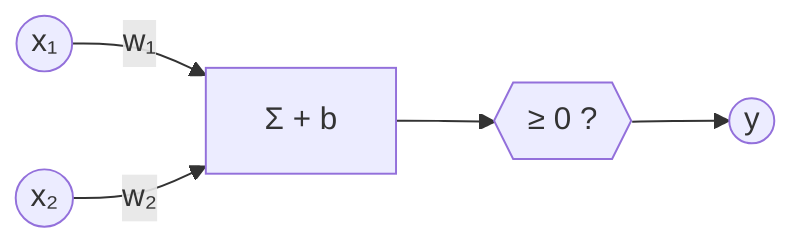

# Deep Learning — Illustrated Instructor Notes for Quiz 1 (Weeks 1–4)

> **Living document.** One unified file for Weeks 1–4. New material is added *in place* under the right week/topic as we go.
>
> **Style:** first principles → logic → implications → many solved examples → traps → things to think about.
>
> **Legend:** **[Intuition]** mental model · **[Derivation]** first-principles derivation · **[Ex]** solved example · **[!]** trap · **[Exam]** exam pattern · **[?]** think about it · ✓ / ✗ check / fails

---

## Contents

- **Week 1 — Neurons, Boolean Functions, MP Neuron, Perceptron, PLA** ✓ *(this pass)*
  - 1.0 Week-1 map
  - 1.1 History in one page
  - 1.2 From biological to artificial neuron
  - 1.3 Boolean functions from first principles
  - 1.4 McCulloch–Pitts (MP) neuron & thresholding logic
  - 1.5 The perceptron: weights, bias, geometry
  - 1.6 Errors and the perceptron learning algorithm
- **Week 2** — *to be added*
- **Week 3** — *to be added*
- **Week 4** — *to be added*

---

# WEEK 1

## 1.0 Week-1 map

**[Intuition]** Everything in Week 1 is one idea seen four ways: *a neuron is a tiny decision rule that adds up evidence and compares it with a threshold.*


## 1.1 History in one page

| Year | Who | What changed |
|------|-----|--------------|
| 1943 | McCulloch & Pitts | A binary threshold unit as a model of a neuron |
| 1958 | Rosenblatt | The perceptron: weights that can be *learned* |
| 1969 | Minsky & Papert | Proof that a single perceptron cannot compute XOR |
| 1986 | Rumelhart, Hinton, Williams | Backpropagation makes multi-layer networks trainable |
| 2012 | Krizhevsky et al. | AlexNet: deep nets win ImageNet |

## 1.2 From biological to artificial neuron

A biological neuron collects signals on its dendrites, and fires along its axon when the combined input is strong enough.

- **Dendrites** → the inputs $x_1, \dots, x_n$
- **Synapse strength** → the weights $w_1, \dots, w_n$
- **Cell body** → the sum $\sum_i w_i x_i$
- **Firing threshold** → a number $\theta$ (or equivalently a bias $b = -\theta$)

> [!NOTE]
> The model is deliberately crude. We keep only what is needed to *compute*: add, compare, output 0 or 1.

## 1.3 Boolean functions from first principles

### 1.3.1 What is a Boolean function?

A Boolean function of $n$ inputs is any map $f:\{0,1\}^n \to \{0,1\}$. Nothing more.

### 1.3.2 Counting inputs and functions (the most-asked question)

**[Derivation]** With $n$ binary inputs there are $2^n$ distinct input rows. A function chooses an output (0 or 1) for *each* row independently, so the number of functions is

$$
\underbrace{2 \times 2 \times \cdots \times 2}_{2^n \text{ times}} \;=\; 2^{\,2^n}.
$$

| $n$ | input rows $2^n$ | functions $2^{2^n}$ |
|:---:|:---:|:---:|
| 1 | 2 | 4 |
| 2 | 4 | 16 |
| 3 | 8 | 256 |
| 4 | 16 | 65,536 |

**[!]** The exponent is $2^n$, not $n$. Writing $2^n$ functions is the classic slip.

### 1.3.3 All 16 two-input functions

Outputs are listed for the input rows $(0,0), (0,1), (1,0), (1,1)$ in that order.

| Outputs | Name | Linearly separable? |
|:---:|---|:---:|
| 0000 | FALSE | ✓ |
| 0001 | $A \wedge B$ (AND) | ✓ |
| 0010 | $A \wedge \lnot B$ | ✓ |
| 0011 | $A$ | ✓ |
| 0100 | $\lnot A \wedge B$ | ✓ |
| 0101 | $B$ | ✓ |
| 0110 | $A \oplus B$ (XOR) | ✗ |
| 0111 | $A \vee B$ (OR) | ✓ |
| 1000 | NOR | ✓ |
| 1001 | XNOR | ✗ |
| 1010 | $\lnot B$ | ✓ |
| 1011 | $B \Rightarrow A$ | ✓ |
| 1100 | $\lnot A$ | ✓ |
| 1101 | $A \Rightarrow B$ | ✓ |
| 1110 | NAND | ✓ |
| 1111 | TRUE | ✓ |

**[Exam]** "How many of the 16 can one perceptron implement?" Answer: **14**. Only XOR and XNOR fail.

### 1.3.4 Four ways to write the same function

AND, as a truth table, a formula, a picture and a neuron:

1. **Table:** output is 1 only on row $(1,1)$.
2. **Formula:** $f(x_1,x_2) = x_1 \wedge x_2$.
3. **Geometry:** colour the four corners of the unit square; only $(1,1)$ is coloured 1.
4. **Neuron:** $f = \mathbb{1}[x_1 + x_2 \ge 2]$.

### 1.3.5 Geometry: a Boolean function colours the corners

For $n=2$ the inputs are the corners of a square. A function is a way to colour the corners with two colours. It is *linearly separable* when one straight line puts all 1-corners on one side and all 0-corners on the other. For XOR the 1-corners are diagonal opposites, and no line separates them from the other diagonal.

### 1.3.6 Two properties that explain everything about the MP neuron

1. The output only **increases** when an excitatory input turns on (monotone).
2. There is **one** threshold, so the decision is a single cut through the input cube.

## 1.4 McCulloch–Pitts (MP) neuron & thresholding logic

### 1.4.1 Definition

$$
y \;=\; \begin{cases} 1 & \text{if } \displaystyle\sum_{i=1}^{n} x_i \ge \theta, \\[6pt] 0 & \text{otherwise,} \end{cases}
\qquad x_i \in \{0,1\}.
$$

### 1.4.2 Design recipe (sentence → MP neuron)

1. Say the rule in words: "fire when *at least $k$* of these $n$ things happen".
2. Set $\theta = k$.
3. Check the two extreme rows (all off, all on) and one in between.

### 1.4.3 Solved examples

**[Ex]** *AND of 3 inputs.* Fire only when all three are on: $\theta = 3$. Check: $(1,1,1)\to 3 \ge 3$ ✓; $(1,1,0)\to 2 < 3$ gives 0 ✓.

**[Ex]** *OR of 3 inputs.* Fire when at least one is on: $\theta = 1$.

**[Ex]** *"At least two of three" (majority).* $\theta = 2$. Rows with two or three ones give 1.

**[?]** An MP neuron with only excitatory inputs can never output 0 for $(1,1)$ and 1 for $(0,0)$. Why does that rule out NOT and NOR?

## 1.5 The perceptron: weights, bias, geometry

The perceptron lets each input have its own real weight, and moves the threshold into a bias:

$$
y \;=\; \mathbb{1}\!\left[\, \mathbf{w}^{\top}\mathbf{x} + b \ge 0 \,\right],
\qquad \mathbf{w}\in\mathbb{R}^n,\; b\in\mathbb{R}.
$$

**[Intuition]** The set $\mathbf{w}^{\top}\mathbf{x} + b = 0$ is a line (in 2D) or hyperplane. The vector $\mathbf{w}$ is the **normal** to that boundary; it points toward the side that outputs 1.



**[Ex]** *AND with $\mathbf{w}=(1,1)$, $b=-1.5$.*

| $x_1$ | $x_2$ | $x_1 + x_2 - 1.5$ | $y$ |
|:---:|:---:|:---:|:---:|
| 0 | 0 | −1.5 | 0 ✓ |
| 0 | 1 | −0.5 | 0 ✓ |
| 1 | 0 | −0.5 | 0 ✓ |
| 1 | 1 | +0.5 | 1 ✓ |

**[Derivation]** *Why XOR fails.* Suppose some $w_1, w_2, b$ worked. The four rows demand

$$
b < 0, \qquad w_1 + b \ge 0, \qquad w_2 + b \ge 0, \qquad w_1 + w_2 + b < 0 .
$$

Add the two middle inequalities: $w_1 + w_2 + 2b \ge 0$, so $w_1 + w_2 + b \ge -b > 0$. That contradicts the last inequality. ✗

## 1.6 Errors and the perceptron learning algorithm

**[Intuition]** Look at one example at a time. If it is on the wrong side, nudge the boundary *toward* that example.

```python
import numpy as np

def pla(X, y, max_epochs=1000):
    """Perceptron learning algorithm. y is in {-1, +1}; X carries a leading 1 for the bias."""
    w = np.zeros(X.shape[1])
    for epoch in range(max_epochs):
        mistakes = 0
        for xi, yi in zip(X, y):
            if yi * (w @ xi) <= 0:      # wrong side (or exactly on the boundary)
                w += yi * xi            # move the boundary toward xi
                mistakes += 1
        if mistakes == 0:
            return w, epoch
    return w, max_epochs
```

If the data are linearly separable with margin $\gamma$ and every point satisfies $\lVert\mathbf{x}\rVert \le R$, PLA makes at most

$$
\text{mistakes} \;\le\; \left(\frac{R}{\gamma}\right)^{2}
$$

updates, then stops.

**[!]** The bound says *nothing* when the data are not separable: PLA then cycles forever. Always cap the number of epochs.

---

# WEEK 2

*To be added.*

# WEEK 3

*To be added.*

# WEEK 4

*To be added.*
