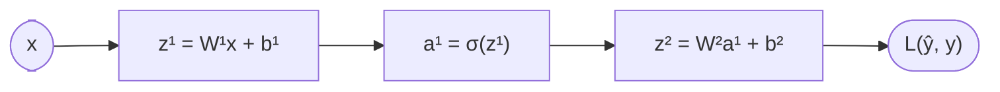
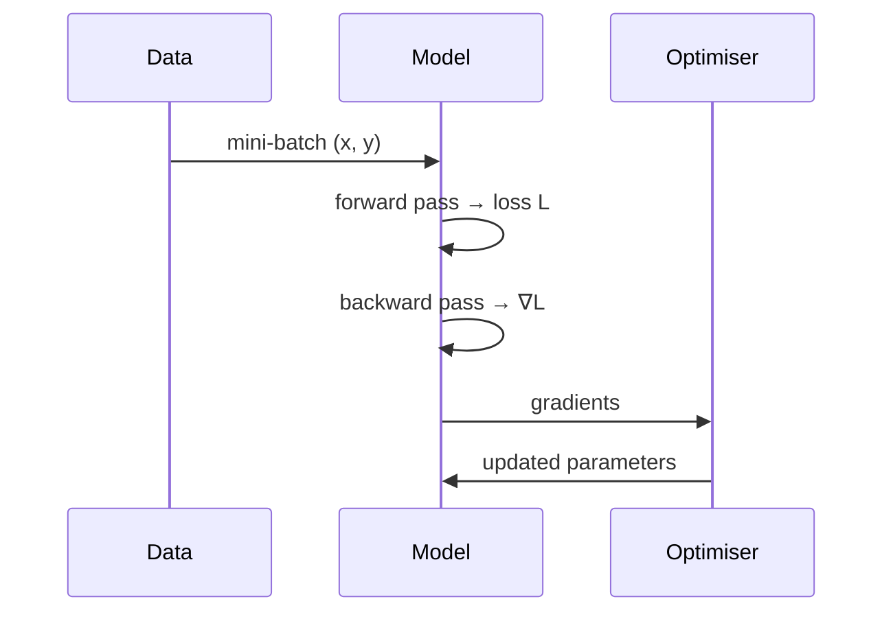

$$
\newcommand{\pd}[2]{\frac{\partial #1}{\partial #2}}
\newcommand{\relu}{\operatorname{ReLU}}
\DeclareMathOperator{\softmax}{softmax}
$$

# Backpropagation & Optimisation — Derivations

> [!NOTE]
> Macros such as `\pd`, `\relu` and `\softmax` are defined once in the hidden block at the top of this file and work everywhere below. Global macros (`\R`, `\vect`, `\argmin`, …) come from `config.js`.

## 1. The chain rule on a computation graph

**[Intuition]** A network is a graph of simple functions. Backpropagation is just the chain rule applied from the loss *backwards*, reusing every intermediate result once.



For a one-hidden-layer network with inputs $\vect{x}\in\R^{d}$:

$$
\begin{aligned}
\vect{z}^{(1)} &= W^{(1)}\vect{x} + \vect{b}^{(1)}, &\qquad \vect{a}^{(1)} &= \sigma\!\left(\vect{z}^{(1)}\right), \\
\vect{z}^{(2)} &= W^{(2)}\vect{a}^{(1)} + \vect{b}^{(2)}, &\qquad \hat{y} &= \vect{z}^{(2)} .
\end{aligned}
$$

With the squared-error loss $L = \tfrac12(\hat y - y)^2$ and the sigmoid $\sigma(z)=\frac{1}{1+e^{-z}}$, one finds $\sigma'(z)=\sigma(z)\bigl(1-\sigma(z)\bigr)$.

## 2. Gradients, layer by layer

Define the **error signal** $\delta^{(\ell)} = \pd{L}{\vect{z}^{(\ell)}}$. Then

$$
\begin{align}
\delta^{(2)} &= \pd{L}{\hat y} = \hat y - y, \\
\delta^{(1)} &= \left(W^{(2)\top}\delta^{(2)}\right) \odot \sigma'\!\left(\vect{z}^{(1)}\right), \\
\pd{L}{W^{(2)}} &= \delta^{(2)}\,\vect{a}^{(1)\top}, \\
\pd{L}{W^{(1)}} &= \delta^{(1)}\,\vect{x}^{\top}.
\end{align}
$$

**[Derivation]** For the middle line, write $\vect{z}^{(2)} = W^{(2)}\sigma(\vect{z}^{(1)}) + \vect{b}^{(2)}$ and differentiate. The Jacobian of $\vect{z}^{(2)}$ with respect to $\vect{z}^{(1)}$ is $W^{(2)}\operatorname{diag}\!\bigl(\sigma'(\vect{z}^{(1)})\bigr)$, and multiplying $\delta^{(2)}$ by its transpose gives the line above.

### 2.1 Jacobians

For $f:\R^n\to\R^m$ the Jacobian collects every partial derivative:

$$
J_f \;=\; \begin{bmatrix}
\pd{f_1}{x_1} & \cdots & \pd{f_1}{x_n} \\
\vdots & \ddots & \vdots \\
\pd{f_m}{x_1} & \cdots & \pd{f_m}{x_n}
\end{bmatrix} \in \R^{m\times n}.
$$

### 2.2 Activation functions

$$
\relu(x) = \begin{cases} x, & x > 0, \\ 0, & x \le 0, \end{cases}
\qquad
\relu'(x) = \begin{cases} 1, & x > 0, \\ 0, & x < 0. \end{cases}
$$

**[!]** $\relu'(0)$ is undefined; frameworks pick 0. It almost never matters in practice, but it does matter in a proof.

For a classification head, with logits $\vect{z}\in\R^K$:

$$
\softmax(\vect{z})_k = \frac{e^{z_k}}{\sum_{j=1}^{K} e^{z_j}},
\qquad
\pd{L_{\mathrm{CE}}}{z_k} = \softmax(\vect{z})_k - y_k .
$$

## 3. Optimisers

| Method | Keeps | Extra hyper-parameters | Idea |
|---|---|---|---|
| SGD | nothing | learning rate $\eta$ | Step against the gradient |
| Momentum | velocity | $\beta$ | Average recent gradients to smooth the path |
| RMSProp | squared-gradient average | $\rho$, $\epsilon$ | Divide by a running gradient scale |
| Adam | both | $\beta_1$, $\beta_2$, $\epsilon$ | Momentum **and** RMSProp, with bias correction |

The **Adam** update, with gradient $g_t$ at step $t$:

$$
\begin{aligned}
m_t &= \beta_1 m_{t-1} + (1-\beta_1)\, g_t, \\
v_t &= \beta_2 v_{t-1} + (1-\beta_2)\, g_t^{2}, \\
\hat m_t &= \frac{m_t}{1-\beta_1^{\,t}}, \qquad \hat v_t = \frac{v_t}{1-\beta_2^{\,t}}, \\
\theta_t &= \theta_{t-1} - \eta\,\frac{\hat m_t}{\sqrt{\hat v_t} + \epsilon}.
\end{aligned}
$$

Training itself is the problem $\theta^\star = \argmin_{\theta}\; \E_{(x,y)}\bigl[L(f_\theta(x), y)\bigr]$.

### 3.1 One training step



```python
for x, y in loader:
    opt.zero_grad()              # clear old gradients
    loss = loss_fn(model(x), y)  # forward
    loss.backward()              # backward: fills p.grad for every parameter
    opt.step()                   # apply the update rule
```

## 4. Checklist

- [x] Derive $\delta^{(1)}$ from the chain rule
- [x] Write the Jacobian of an affine layer
- [ ] Derive the softmax + cross-entropy gradient from scratch
- [ ] Show why Adam's bias correction is needed at small $t$

> [!TIP]
> When a gradient formula looks wrong, check **shapes first**: $\pd{L}{W^{(\ell)}}$ must have the same shape as $W^{(\ell)}$.

> [!WARNING]
> Mixing row-vector and column-vector conventions is the most common source of a stray transpose.
