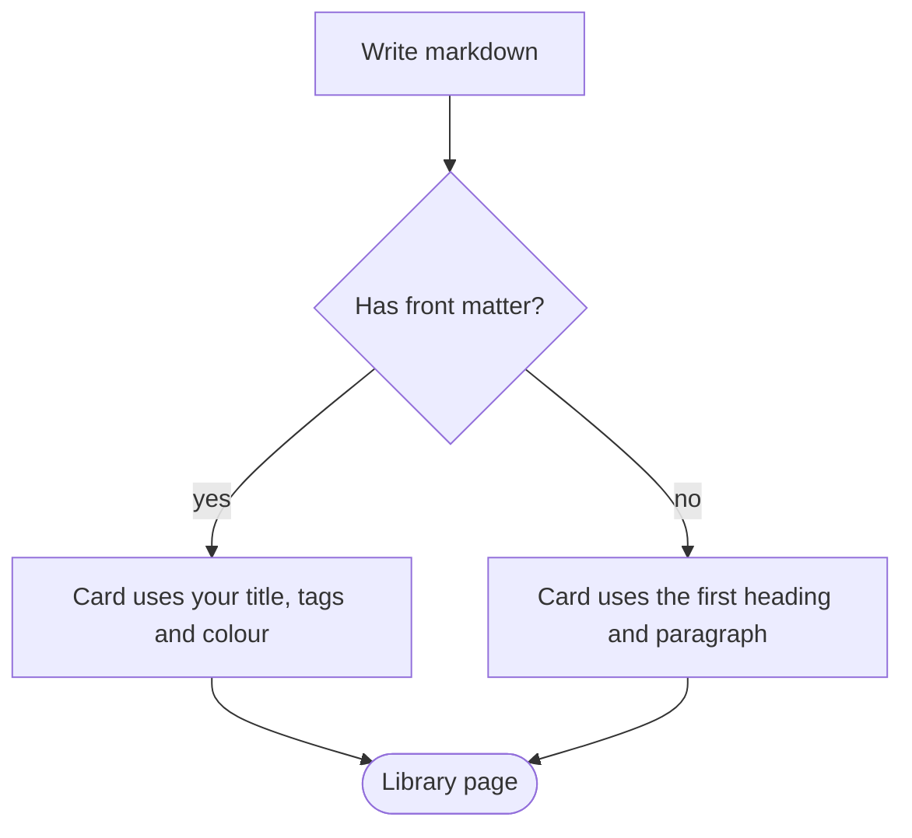

# How this site works

This page doubles as a test sheet: if everything below renders, your setup is healthy.

## Adding a note

1. Create a file in `content/`, for example `content/week-2-notes.md`, and paste your markdown into it.
2. Run `node tools/build-manifest.mjs`. It scans the folder and rewrites `content/manifest.json`.
3. Reload the site. The note appears on the library page, is searchable, and opens when its card is clicked.

> [!TIP]
> No Node? Edit `content/manifest.json` by hand and add the file name to the list: `["week-2-notes.md"]`.

### Optional front matter

Put these lines between `---` markers at the very top of a note. Everything is optional.

| Field | Example | Effect |
|---|---|---|
| `title` | `Week 2 notes` | Card and page title (default: the first `# heading`) |
| `summary` | `Gradients and loss…` | Card description (default: the first paragraph) |
| `tags` | `[deep-learning, week-2]` | Filter chips on the library page |
| `color` | `green` | Card accent: `green`, `blue`, `red` or `yellow` |
| `order` | `4` | Position in the library (lower comes first) |
| `updated` | `2026-10-02` | Shown as "Changed …" (default: file modified time) |

## Maths

Inline maths uses single dollars: the loss is $L(\theta) = \frac{1}{N}\sum_{i=1}^{N} \ell(f_\theta(x_i), y_i)$. Display maths uses double dollars:

$$
\nabla_\theta L \;=\; \frac{1}{N}\sum_{i=1}^{N} \nabla_\theta\, \ell\bigl(f_\theta(x_i), y_i\bigr)
$$

Equation environments work too, including alignment and numbering:

\begin{align}
(a+b)^2 &= a^2 + 2ab + b^2 \tag{expand} \\
\int_0^\infty e^{-x^2}\,dx &= \frac{\sqrt{\pi}}{2}
\end{align}

Chemistry via mhchem: $\ce{CO2 + H2O <=> H2CO3}$ and $\ce{Fe^{3+} + 3OH- -> Fe(OH)3 v}$.

## Diagrams



Shapes pick the colour automatically: rectangles blue, rounded boxes green, decisions yellow, circles and terminals red. To choose a colour yourself, add `:::green`, `:::blue`, `:::yellow` or `:::red` after a node, for example `A[Input]:::green`. Hover a diagram and press the expand button to zoom.

## Callouts, tasks and code

> [!NOTE]
> Blue: neutral information.

> [!TIP]
> Green: a shortcut or good habit.

> [!WARNING]
> Red: something that bites.

- [x] Render a table
- [x] Render a diagram
- [ ] Write the next note

```javascript
// Highlighting loads only when a note actually contains code.
const sum = (xs) => xs.reduce((a, b) => a + b, 0);
console.log(sum([1, 2, 3]));
```

## Using the reader

| Action | How |
|---|---|
| Search everything | Press `/` or `Ctrl K` (`⌘K` on Mac) |
| Jump to a section | Click it in the table of contents, or a tick on the thin rail |
| Pin or unpin contents | The pin button in the contents panel |
| Annotate | Highlighter button in the top bar, then select text |
| Print or save as PDF | Printer button, or `Ctrl P` |

### Annotating

Turn on the highlighter, pick a colour, and select text. Click any highlight to add a note, change its colour or delete it. Everything is stored in this browser only. Use **Export** in the *Notes* tab to keep a copy or move it to another device.

### Printing

Print renders every equation and diagram first, switches to a clean light layout, and hides the interface. Choose **Save as PDF** in the print dialog.
