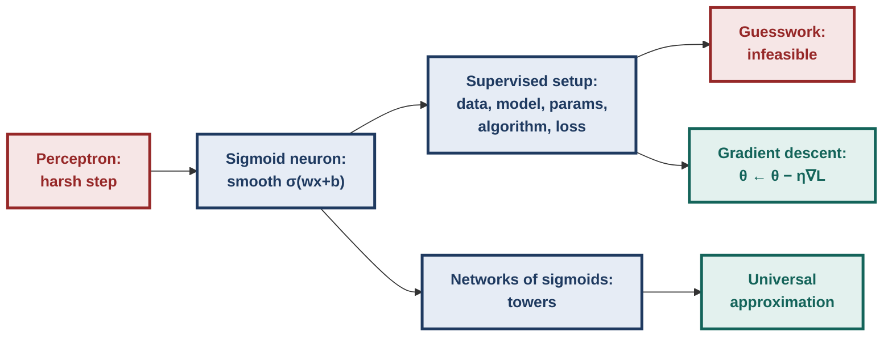
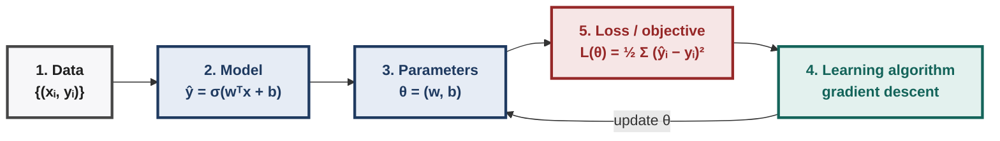
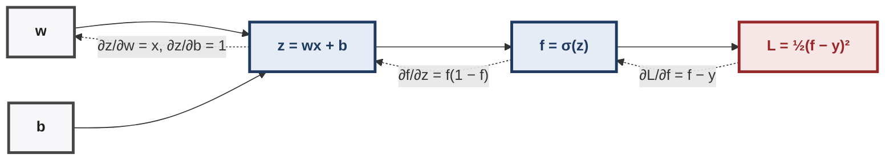
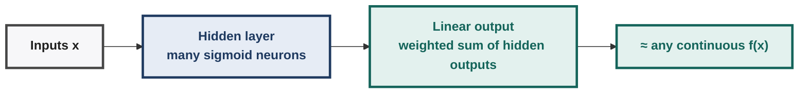
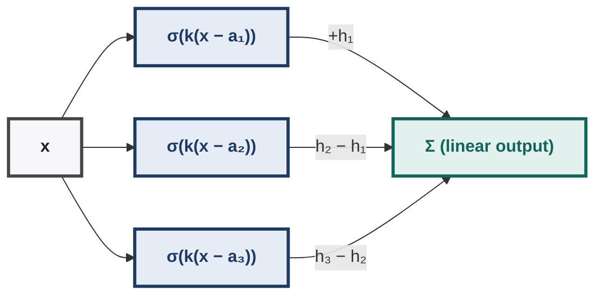
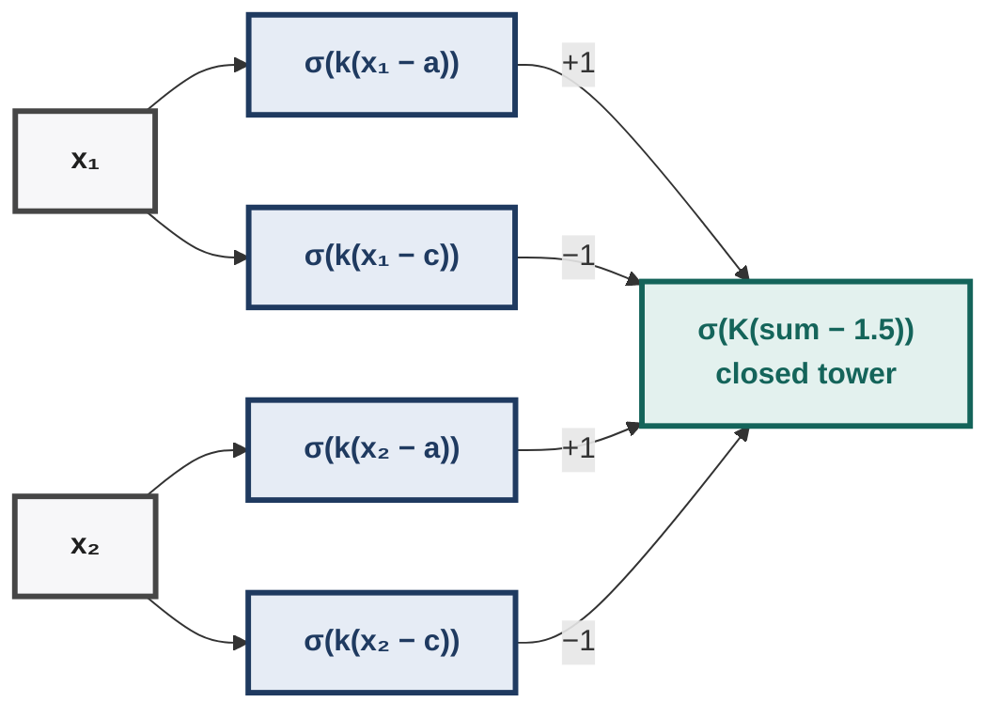
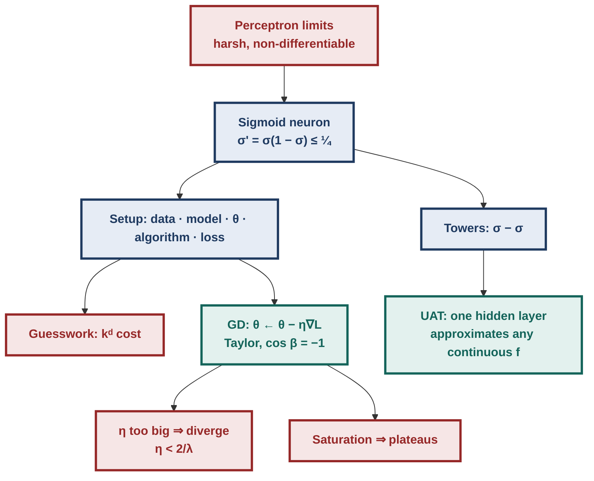

# Deep Learning — Illustrated Instructor Notes for Quiz 1 (Week 2)

> **Living document.** One unified file for Weeks 1–4. New material is added *in place* under the right week/topic as we go.
> **Style:** first principles → logic → implications → many solved examples → traps → things to think about.
> **Legend:** **[Intuition]** mental model · **[Derivation]** first-principles derivation · **[Ex]** solved example · **[!]** trap · **[Exam]** exam pattern · **[?]** think about it · ✓ / ✗ check / fails

---

## Contents

- **Week 1 — Neurons, Boolean Functions, MP Neuron, Perceptron, PLA** ✓
  - 1.0 Week-1 map
  - 1.1 History in one page
  - 1.2 From biological to artificial neuron
  - 1.3 Boolean functions from first principles
  - 1.4 McCulloch–Pitts (MP) neuron & thresholding logic
  - 1.5 The perceptron: weights, bias, geometry
  - 1.6 Implementing Boolean functions & predicate/clause expressions with a perceptron
  - 1.7 Errors and error surfaces
  - 1.8 Perceptron Learning Algorithm (PLA): derivation & hand runs
  - 1.9 Convergence theorem (proof, annotated)
  - 1.10 Linearly separable functions (definitions, counting, implications)
  - 1.11 Representation power of a network of perceptrons
  - 1.12 Week-1 exam toolkit & practice set
- **Week 2 — MLPs, representation power, sigmoid neurons, gradient descent** ✓
  - 2.0 Week-2 map
  - 2.1 From perceptron to sigmoid neuron
  - 2.2 A typical supervised machine learning setup
  - 2.3 Learning parameters by guesswork (and why it fails)
  - 2.4 Learning parameters: gradient descent
  - 2.5 Multilayer networks and representation power
  - 2.6 Week-2 exam toolkit & practice set
- **Week 3 — Feedforward networks, output functions & losses, backpropagation** ✓
  - 3.0 Week-3 map
  - 3.1 Feedforward neural networks
  - 3.2 Learning the parameters (intuition)
  - 3.3 Output functions and loss functions
  - 3.4 Information content, entropy and cross-entropy
  - 3.5 Backpropagation: the intuition
  - 3.6 Gradient w.r.t. the output units
  - 3.7 Gradient w.r.t. the hidden units
  - 3.8 Gradient w.r.t. the parameters
  - 3.9 The algorithm and its cost
  - 3.10 Full hand run
  - 3.11 Symmetry, vanishing gradients, common slips
  - 3.12 Week-3 exam toolkit & practice set
- **Week 4 — GD variants, momentum, NAG, SGD, adaptive methods, schedules** ✓
  - 4.0 Week-4 map
  - 4.1 GD on a quadratic: exact analysis
  - 4.2 Momentum-based GD
  - 4.3 Nesterov accelerated gradient
  - 4.4 Stochastic and mini-batch GD
  - 4.5 Adaptive learning rates (AdaGrad, RMSProp, AdaDelta, Adam, AdaMax, NAdam)
  - 4.6 Learning-rate schedules
  - 4.7 Comparison of all optimisers
  - 4.8 Week-4 exam toolkit & practice set

---

# WEEK 2 — MLPs, Representation Power, Sigmoid Neurons, Gradient Descent

## 2.0 Week-2 map

**[Intuition]** Week 1 ended with two problems: a perceptron's output jumps harshly (so its error surface is flat with cliffs and calculus can't help), and single units can't represent most functions.

Week 2 fixes both: a **smooth** neuron gives a **smooth** loss we can descend with **gradients**, and **networks** of smooth neurons can approximate **any** continuous function.



---

## 2.1 From perceptron to sigmoid neuron

### 2.1.1 The harshness problem

A perceptron that decides "like the movie" iff score $\ge0.5$ treats a score of **0.49** as a firm **No** and **0.51** as a firm **Yes**, while 0.49 and 0.01 are both the same **No**. Real decisions are graded. Two consequences:
- **Modelling:** we lose "how confident" information.
- **Learning:** a tiny weight change either changes nothing or flips the output. The error is a staircase, so its derivative is 0 almost everywhere (§1.7). No gradient means no calculus-based learning.

### 2.1.2 Definition

$$\hat y=f(\mathbf x)=\sigma(\mathbf w^\top\mathbf x+b)=\frac{1}{1+e^{-(\mathbf w^\top\mathbf x+b)}}\in(0,1).$$
Output is a real number, readable as a **probability** or degree of belief.

### 2.1.3 What $w$ and $b$ do (1 input: $\sigma(wx+b)$)

| Change | Effect on the curve |
|---|---|
| larger $\lvert w\rvert$ | steeper transition (→ step as $\lvert w\rvert\to\infty$) |
| $w<0$ | curve flips (decreasing) |
| change $b$ | shifts the curve; centre (output 0.5) at $x=-b/w$ |

**[Ex]** $\sigma(2x-4)$: centre at $x=2$; $x=3\Rightarrow\sigma(2)=0.881$; $x=1\Rightarrow\sigma(-2)=0.119$.

### 2.1.4 Properties, derived

| Property | Derivation / reason |
|---|---|
| $\sigma(0)=\tfrac12$ | $1/(1+e^0)$ |
| $\sigma(z)\to1$ as $z\to\infty$, $\to0$ as $z\to-\infty$ | $e^{-z}\to0$ or $\infty$ |
| $\sigma(-z)=1-\sigma(z)$ | $\frac{1}{1+e^{z}}=\frac{e^{-z}}{e^{-z}+1}=1-\frac{1}{1+e^{-z}}$ |
| $\sigma'(z)=\sigma(z)(1-\sigma(z))$ | $\frac{e^{-z}}{(1+e^{-z})^2}=\frac{1}{1+e^{-z}}\cdot\frac{e^{-z}}{1+e^{-z}}$ |
| $0<\sigma'(z)\le\tfrac14$, max at $z=0$ | $p(1-p)$ is largest at $p=\tfrac12$ |
| near 0: $\sigma(z)\approx\tfrac12+\tfrac z4$ | $e^{-z}\approx1-z\Rightarrow\frac1{2-z}\approx\frac12(1+\frac z2)$ |
| inverse (logit): $z=\ln\frac{p}{1-p}$ | solve $p=1/(1+e^{-z})$ for $z$ |
| $\tanh z=2\sigma(2z)-1$ | zero-centred cousin, range $(-1,1)$ |

**[Intuition]** The decision boundary of a sigmoid neuron (output $=0.5$) is still $\mathbf w^\top\mathbf x+b=0$, a **hyperplane**. A single sigmoid neuron is smoother, not more powerful: it still cannot do XOR.

### 2.1.5 [Ex] Fit two points exactly with the logit trick

Data: $(x,y)=(0.5,0.2)$ and $(2.5,0.9)$. Find $w,b$ with $\sigma(wx+b)=y$ exactly.
Apply the logit to both sides: $wx+b=\ln\frac{y}{1-y}$.
- $0.5w+b=\ln\frac{0.2}{0.8}=-1.3863$
- $2.5w+b=\ln\frac{0.9}{0.1}=2.1972$

Subtract: $2w=3.5835\Rightarrow w=1.792$, then $b=-1.3863-0.896=-2.282$. ✓ Zero loss. (We will see gradient descent reach the same point in §2.4.)

### 2.1.6 Sigmoid vs perceptron

| | Perceptron | Sigmoid neuron |
|---|---|---|
| Output | $\{0,1\}$ | $(0,1)$ |
| Transition | abrupt | smooth |
| Differentiable | no | yes, $\sigma'=\sigma(1-\sigma)$ |
| Boundary | hyperplane | hyperplane (at 0.5) |
| Learning | PLA | gradient descent |
| Limit | — | large weights ≈ perceptron |

---

## 2.2 A typical supervised machine learning setup



| Component | Meaning | Example |
|---|---|---|
| Data | examples with labels | $(x_i,y_i)$ patient vitals → risk |
| Model | our *assumption* of how $y$ depends on $x$ | $\hat y=\sigma(wx+b)$ |
| Parameters | what must be learned | $w,b$ |
| Learning algorithm | how parameters change | guesswork, PLA, gradient descent |
| Objective (loss) | what "good" means | $\mathcal L=\frac12\sum_i(\hat y_i-y_i)^2$ |

**[!]** The model is a *choice*; a wrong family (e.g. linear for curved data) cannot be fixed by any algorithm. The factor $\tfrac12$ only cancels the 2 from differentiation; it does not change the minimiser.

---

## 2.3 Learning parameters by guesswork (and why it fails)

### 2.3.1 [Ex] Guessing on the toy data $(0.5,0.2),(2.5,0.9)$

| Guess $(w,b)$ | $\mathcal L(w,b)$ | Comment |
|---|---|---|
| (0, 0) | 0.1250 | both outputs 0.5 |
| (−0.10, 0.00) | 0.1481 | worse: wrong direction |
| (0.94, −0.94) | 0.0217 | better |
| (1.42, −1.73) | 0.0029 | |
| (1.65, −2.08) | 0.0003 | |
| (1.78, −2.27) | ≈ 0.0000 | near the exact $(1.792,-2.282)$ |

### 2.3.2 The error surface

Plot $\mathcal L$ over the $(w,b)$ plane. Unlike the perceptron's staircase (§1.7), this surface is **smooth**: a valley with a minimum near $(1.79,-2.28)$. Guessing walks around it blindly.

### 2.3.3 Why guesswork is infeasible

Trying $k$ values per parameter costs $k^d$ loss evaluations for $d$ parameters. With $k=100$: $d=2\Rightarrow10^4$ (fine); $d=10\Rightarrow10^{20}$; a real network with $d=10^6$ is hopeless.

We need a **principled direction to move**, which the gradient gives.

---

## 2.4 Learning parameters: gradient descent

### 2.4.1 [Derivation] Which direction decreases the loss fastest?

Let $\theta$ be the parameters, $\mathbf u$ a unit direction, $\eta$ a small step. First-order Taylor:
$$\mathcal L(\theta+\eta\mathbf u)\approx\mathcal L(\theta)+\eta\,\mathbf u^\top\nabla_\theta\mathcal L(\theta).$$
We want $\mathbf u^\top\nabla\mathcal L$ as negative as possible.

Since $\mathbf u^\top\nabla\mathcal L=\lVert\mathbf u\rVert\lVert\nabla\mathcal L\rVert\cos\beta$ and $-1\le\cos\beta\le1$, the minimum is at $\beta=180^\circ$: move **opposite to the gradient**.
$$\boxed{\theta_{t+1}=\theta_t-\eta\,\nabla_\theta\mathcal L(\theta_t)}$$

**[Intuition]**
- The gradient points uphill (steepest ascent); minus gradient is steepest descent.
- The gradient is **perpendicular to the contour lines** of $\mathcal L$ (along a contour the loss doesn't change, so $\mathbf u^\top\nabla\mathcal L=0$).
- Taylor is only accurate for **small** $\eta$; large steps can overshoot and *increase* the loss.

### 2.4.2 [Derivation] Gradients for a sigmoid neuron with squared loss

For one example, $\mathcal L=\tfrac12(f-y)^2$, $f=\sigma(z)$, $z=wx+b$. Chain rule:
$$\frac{\partial\mathcal L}{\partial w}=\underbrace{(f-y)}_{\partial\mathcal L/\partial f}\cdot\underbrace{f(1-f)}_{\partial f/\partial z}\cdot\underbrace{x}_{\partial z/\partial w},\qquad
\frac{\partial\mathcal L}{\partial b}=(f-y)\,f(1-f).$$
For many examples, **sum** over them. Read it as **error × local slope × input**. If any factor is 0, $w$ does not move.



### 2.4.3 Algorithm

```text
initialise w, b;  choose η and max_epochs
for epoch = 1 .. max_epochs:
    dw = 0; db = 0
    for each (x, y):
        f  = σ(w·x + b)
        dw += (f − y)·f·(1 − f)·x
        db += (f − y)·f·(1 − f)
    w = w − η·dw;   b = b − η·db        # one update per pass (batch GD)
```

### 2.4.4 [Ex] Three hand steps on the toy data ($w=b=0$, $\eta=1$)

**Step 0.** $f=0.5$ for both points, $f(1-f)=0.25$. Errors: $0.5-0.2=0.3$ and $0.5-0.9=-0.4$.
$\partial\mathcal L/\partial w=0.3(0.25)(0.5)+(-0.4)(0.25)(2.5)=0.0375-0.25=-0.2125$;
$\partial\mathcal L/\partial b=0.075-0.1=-0.025$.
Update: $w=0.2125$, $b=0.025$.

| Step | $(w,b)$ | $\mathcal L$ | $(\partial_w,\partial_b)$ |
|---|---|---|---|
| 0 | (0, 0) | 0.1250 | (−0.2125, −0.0250) |
| 1 | (0.2125, 0.0250) | 0.0903 | (−0.1117, 0.0216) |
| 2 | (0.3242, 0.0034) | 0.0797 | (−0.0678, 0.0407) |
| … many steps | → (1.792, −2.282) | → 0 | → (0, 0) |

**[Intuition]** Both points agree that $w$ should go up (the high-$x$ point is under-predicted).

On $b$ they disagree (the low-$x$ point wants $b$ down, the high one wants it up), so $b$ moves little and later turns negative.

GD converges to the **same** exact solution as the logit trick in §2.1.5.

### 2.4.5 The learning rate decides everything

On $\mathcal L(w)=w^2$: $\nabla=2w$, so $w_{t+1}=(1-2\eta)w_t$.

| $\eta$ | factor $1-2\eta$ | behaviour |
|---|---|---|
| 0.1 | 0.8 | slow, monotone |
| 0.3 | 0.4 | fast, monotone |
| 0.5 | 0 | exact minimum in one step |
| 0.8 | −0.6 | oscillates, converges |
| 1.0 | −1 | bounces forever |
| 1.1 | −1.2 | **diverges**, oscillating |

**[Exam]** Quiz 1: from $w_0=2$, graph X falls fast to 0, graph Y explodes ⇒ **X: $\eta=0.3$, Y: $\eta=1.1$.** General rule on $\tfrac\lambda2w^2$: converge iff $0<\eta<2/\lambda$.

### 2.4.6 Saturation: big error, tiny gradient

**[Ex]** $w=5$, $b=0$, point $x=2$, $y=0$. Then $z=10$, $f=0.99995$, $f(1-f)\approx4.5\times10^{-5}$, so $\partial\mathcal L/\partial w\approx(0.99995)(4.5\times10^{-5})(2)\approx9\times10^{-5}$.

The prediction is almost maximally wrong, yet learning crawls, because the neuron sits on a flat tail of $\sigma$. The error surface has **plateaus**. (Later: cross-entropy loss and ReLU help.)

### 2.4.7 [Exam] Quiz-1 gradient question

$f=\sigma(wx+b)$, $(x,y)=(2,0.8)$, $w=b=0$: $\nabla_w\mathcal L=(0.5-0.8)(0.25)(2)=-0.15$. The negative sign means GD increases $w$, raising $f(2)$ toward 0.8. ✓

### 2.4.8 Traps

- **Sign:** descent *subtracts* the gradient.
- **Sum over all points** for batch GD (not just one).
- $f(1-f)$ uses the **output** $f$, not $z$.
- At $w=b=0$, every $f=\tfrac12$ and every slope $=\tfrac14$: use the shortcut $\nabla_w=\tfrac14\sum_i(\tfrac12-y_i)x_i$.

---

## 2.5 Multilayer networks and representation power

### 2.5.1 From networks of perceptrons to MLPs

Week 1 (§1.11): with step units, one hidden layer of $2^n$ pattern detectors represents **any Boolean function exactly**.

Week 2 asks the continuous version: can networks of **sigmoid** neurons represent **any real function** $f:\mathbb R^n\to\mathbb R$?

Answer: they can **approximate** any continuous function to any precision.



### 2.5.2 [Derivation] The tower function (1 input)

Two steep sigmoids with shifted centres, subtracted:
$$\text{tower}(x)=\sigma\big(k(x-a)\big)-\sigma\big(k(x-c)\big),\quad a<c,\ k\text{ large}.$$
- $x<a$: both ≈ 0 → tower ≈ 0
- $a<x<c$: first ≈ 1, second ≈ 0 → tower ≈ 1
- $x>c$: both ≈ 1 → tower ≈ 0

**[Ex]** $a=1$, $c=2$, $k=20$:

| $x$ | 0 | 1 | 1.5 | 2 | 3 |
|---|---|---|---|---|---|
| tower | 0.000 | 0.500 | 0.9999 | 0.500 | 0.000 |

A rectangle of height 1 on $[1,2]$, with soft edges (0.5 at the edges).

### 2.5.3 Any 1-D function = a sum of towers

Cut the $x$-range into narrow intervals, put a tower on each, scale it by the function's height there, and add them. This is a histogram (Riemann-sum) approximation; narrower towers give smaller error.



(Adjacent towers share edges, so a staircase with $m$ steps needs about $m$ sigmoids, with output weights equal to the *height differences*.)

### 2.5.4 Towers in 2-D: open tower, then closed tower

1. **Open tower along $x_1$:** $\sigma(k(x_1-a))-\sigma(k(x_1-c))$. This is a wall: high for $a<x_1<c$ at **every** $x_2$.
2. **Open tower along $x_2$:** another wall, perpendicular.
3. **Closed tower:** where the two walls cross, their sum is ≈ 2; elsewhere ≤ 1. Pass the sum through one more steep sigmoid with threshold 1.5: $\sigma\big(K(h_{x}+h_{y}-1.5)\big)$.

**[Ex]** $a=1$, $c=2$, $k=20$, $K=50$:

| point $(x_1,x_2)$ | $h_x$ | $h_y$ | closed tower |
|---|---|---|---|
| (1.5, 1.5) inside | 1.000 | 1.000 | 1.000 |
| (1.5, 3) on one wall | 1.000 | 0.000 | 0.000 |
| (3, 3) outside | 0.000 | 0.000 | 0.000 |



**Counting.** One closed tower in $n$ dimensions uses $2n$ first-layer sigmoids + 1 combiner = $2n+1$ neurons.

Covering each axis with $m$ intervals needs $m^n$ towers, so the neuron count grows **exponentially** in $n$ (curse of dimensionality).

For $n=2$, $m=10$: 100 towers × 5 = 500 neurons; for $n=10$: $10^{10}$ towers.

### 2.5.5 Universal approximation theorem

> A feedforward network with **one hidden layer** of sigmoid neurons and a linear output can approximate **any continuous function** on a closed, bounded domain to **any desired precision**, given **enough** hidden neurons.

**Fine print (exam favourites):**
- **Existence only:** says nothing about how to *find* the weights, how many neurons, or how well it generalises.
- **Approximate, not exact** (contrast with §1.11, where Boolean functions are represented exactly).
- **Width can explode** (towers grow as $m^n$); depth often reuses features more efficiently.
- One hidden layer **with non-linear** units. With linear hidden units, a network collapses to a linear model.

### 2.5.6 [Exam] Quiz-1 multi-select, solved

| Statement | Verdict | Why |
|---|---|---|
| Perceptron output jumps at threshold; sigmoid changes smoothly | ✓ | step vs logistic |
| Sigmoid is differentiable, so it suits gradient learning | ✓ | $\sigma'=\sigma(1-\sigma)$ |
| Large enough weights make a sigmoid ≈ perceptron | ✓ | $\sigma(kz)\to$ step |
| One-hidden-layer perceptron net represents any Boolean function exactly | ✓ | §1.11 |
| One-hidden-layer sigmoid net approximates any continuous function | ✓ | UAT |
| A single sigmoid neuron represents every non-linear boundary | ✗ | its boundary is a hyperplane |
| "A neural network's boundary is always non-linear" | ✗ | single neuron or linear activations ⇒ linear |

### 2.5.7 Things to think about

1. Why does the tower need *two* sigmoids and not one? (One sigmoid is a single step; a bump needs an up-step and a down-step.)
2. What goes wrong if $k$ is small? (Soft, overlapping towers: blurry approximation.)
3. Can towers be built from ReLUs? (Yes: combinations like $\text{ReLU}(x-a)-\text{ReLU}(x-c)$ make ramps; differences of ramps make bumps.)
4. If one hidden layer suffices, why go deep? (Efficiency: deep nets can express some functions with exponentially fewer units.)

---

## 2.6 Week-2 exam toolkit & practice set

**Diagram — Week 2 at a glance**



### 2.6.1 Recognition rules

| See | Think |
|---|---|
| pre-activation 0 / $w=b=0$ | $\sigma=\tfrac12$, $\sigma'=\tfrac14$ |
| "gradient of squared loss, sigmoid neuron" | $(f-y)f(1-f)x$ |
| $\lvert z\rvert$ very large | saturation, gradient ≈ 0 |
| "fit $\sigma(wx+b)$ exactly to two points" | logit both sides, solve 2 linear equations |
| $\mathcal L=cw^2$ with given $\eta$ | factor $1-2c\eta$ per step |
| "why negative gradient" | Taylor + $\cos\beta=-1$ |
| "any continuous function, one hidden layer" | UAT: approximate, enough neurons |
| "neurons for a 2-D tower" | $2n+1=5$ |
| "single sigmoid neuron + XOR" | impossible (hyperplane boundary) |

### 2.6.2 Formula sheet

| Formula | Use |
|---|---|
| $\sigma(z)=1/(1+e^{-z})$, $\sigma'=\sigma(1-\sigma)$ | everything |
| $\sigma(z)\approx\tfrac12+\tfrac z4$ near 0 | Taylor questions |
| $z=\ln\frac{p}{1-p}$ | invert a sigmoid |
| $\theta\leftarrow\theta-\eta\nabla\mathcal L$ | gradient descent |
| $\partial_w\mathcal L=\sum(f-y)f(1-f)x$, $\partial_b\mathcal L=\sum(f-y)f(1-f)$ | sigmoid + squared loss |
| $\sigma(k(x-a))-\sigma(k(x-c))$ | tower |
| $\sigma(K(h_x+h_y-1.5))$ | closed 2-D tower |

### 2.6.3 Practice set

1. Compute $\sigma'(\ln3)$.
2. For $\sigma(wx+b)$, the output is 0.5 at $x=4$ and 0.731 at $x=5$. Find $w$ and $b$.
3. $(x,y)=(-1,1)$, $w=b=0$, squared loss. Find $\partial_w\mathcal L$ and $\partial_b\mathcal L$.
4. $\mathcal L=3w^2$. For which $\eta$ does GD converge? Oscillate while converging?
5. Three points $(1,0.9),(2,0.1),(3,0.5)$, $w=b=0$. Compute $\partial_w\mathcal L$ with the shortcut.
6. True/False: "Increasing $\eta$ always speeds up convergence."
7. How many sigmoid neurons does one closed tower need in 3 dimensions? How many towers for a $5\times5\times5$ grid?
8. Give a tower on $[0,4]$ with steepness 10.
9. A sigmoid neuron has $w=-2$. Is its output increasing or decreasing in $x$? Where is the centre if $b=6$?
10. Creative scenario: a triage score $\sigma(wx+b)$ must give 10% risk at lactate 1 and 90% at lactate 4. Find $w,b$ and the lactate at 50% risk.

### 2.6.4 Answers

1. $\sigma(\ln3)=\tfrac34$, so $\sigma'=\tfrac34\cdot\tfrac14=\tfrac3{16}$.
2. Centre at 4: $4w+b=0$. $\sigma(z)=0.731\Rightarrow z=1$: $5w+b=1$. So $w=1$, $b=-4$.
3. $\partial_w=(0.5-1)(0.25)(-1)=0.125$; $\partial_b=-0.125$.
4. $w_{t+1}=(1-6\eta)w_t$: converge iff $0<\eta<\tfrac13$; oscillate (and converge) for $\tfrac16<\eta<\tfrac13$.
5. $\tfrac14[(0.5-0.9)(1)+(0.5-0.1)(2)+(0.5-0.5)(3)]=\tfrac14(-0.4+0.8+0)=0.1$.
6. False: beyond $2/\lambda$ GD diverges; near it, it oscillates.
7. $2(3)+1=7$ neurons; $5^3=125$ towers.
8. $\sigma(10x)-\sigma(10(x-4))$.
9. Decreasing; centre at $x=-b/w=3$.
10. Logits: $\ln\frac{0.1}{0.9}=-2.197$ and $+2.197$. $w+b=-2.197$, $4w+b=2.197\Rightarrow w=1.465$, $b=-3.662$; 50% at $x=-b/w=2.5$.

---
