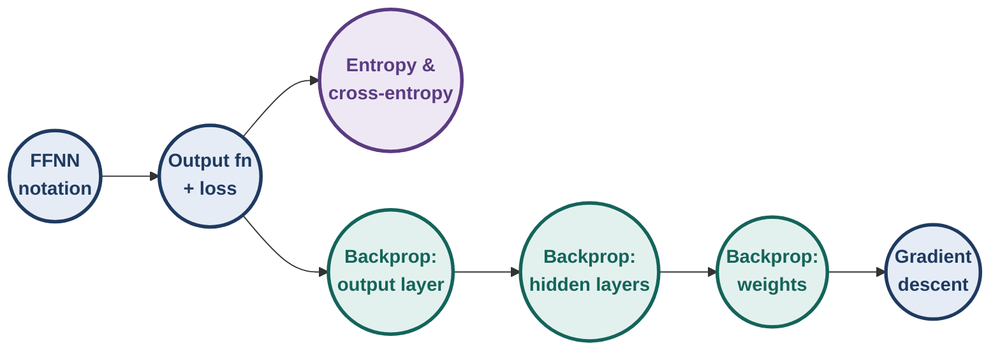
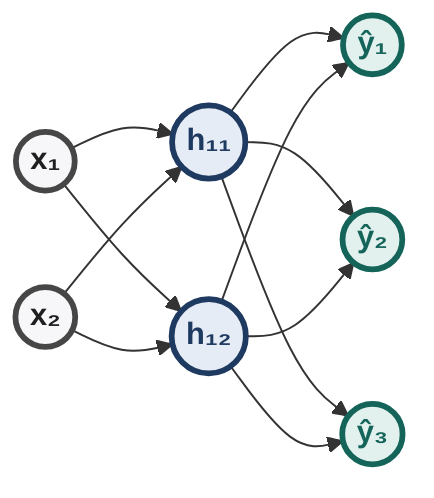
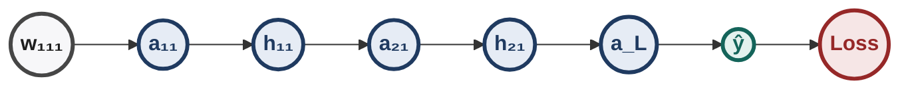
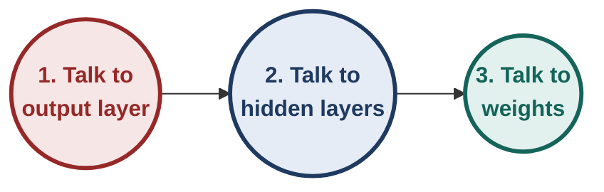
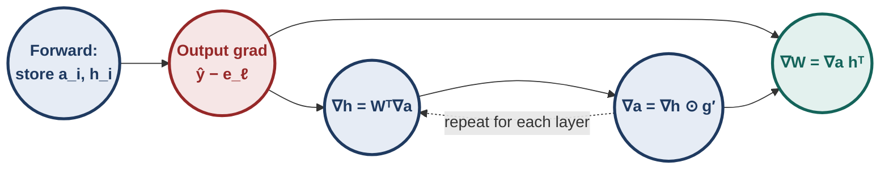
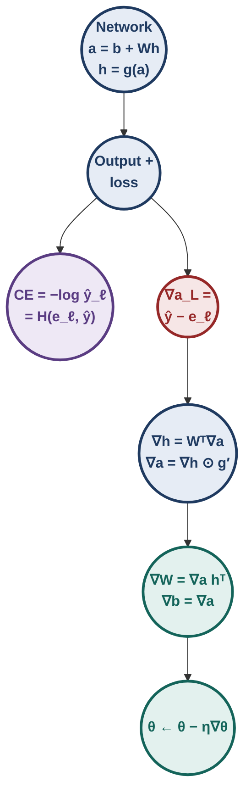

# Deep Learning — Illustrated Instructor Notes for Quiz 1 (Week 3)

> **Living document.** One unified file for Weeks 1–4. New material is added *in place* under the right week/topic as we go.
> **Style:** first principles → logic → implications → many solved examples → traps → things to think about.
> **Legend:** **[Intuition]** mental model · **[Derivation]** first-principles derivation · **[Ex]** solved example · **[!]** trap · **[Exam]** exam pattern · **[?]** think about it · ✓ / ✗ check / fails

---

## Contents

- **Week 1 — Neurons, Boolean Functions, MP Neuron, Perceptron, PLA** ✓
  - 1.0 Week-1 map
  - 1.1 History in one page
  - 1.2 From biological to artificial neuron
  - 1.3 Boolean functions from first principles
  - 1.4 McCulloch–Pitts (MP) neuron & thresholding logic
  - 1.5 The perceptron: weights, bias, geometry
  - 1.6 Implementing Boolean functions & predicate/clause expressions with a perceptron
  - 1.7 Errors and error surfaces
  - 1.8 Perceptron Learning Algorithm (PLA): derivation & hand runs
  - 1.9 Convergence theorem (proof, annotated)
  - 1.10 Linearly separable functions (definitions, counting, implications)
  - 1.11 Representation power of a network of perceptrons
  - 1.12 Week-1 exam toolkit & practice set
- **Week 2 — MLPs, representation power, sigmoid neurons, gradient descent** ✓
  - 2.0 Week-2 map
  - 2.1 From perceptron to sigmoid neuron
  - 2.2 A typical supervised machine learning setup
  - 2.3 Learning parameters by guesswork (and why it fails)
  - 2.4 Learning parameters: gradient descent
  - 2.5 Multilayer networks and representation power
  - 2.6 Week-2 exam toolkit & practice set
- **Week 3 — Feedforward networks, output functions & losses, backpropagation** ✓
  - 3.0 Week-3 map
  - 3.1 Feedforward neural networks
  - 3.2 Learning the parameters (intuition)
  - 3.3 Output functions and loss functions
  - 3.4 Information content, entropy and cross-entropy
  - 3.5 Backpropagation: the intuition
  - 3.6 Gradient w.r.t. the output units
  - 3.7 Gradient w.r.t. the hidden units
  - 3.8 Gradient w.r.t. the parameters
  - 3.9 The algorithm and its cost
  - 3.10 Full hand run
  - 3.11 Symmetry, vanishing gradients, common slips
  - 3.12 Week-3 exam toolkit & practice set
- **Week 4 — GD variants, momentum, NAG, SGD, adaptive methods, schedules** ✓
  - 4.0 Week-4 map
  - 4.1 GD on a quadratic: exact analysis
  - 4.2 Momentum-based GD
  - 4.3 Nesterov accelerated gradient
  - 4.4 Stochastic and mini-batch GD
  - 4.5 Adaptive learning rates (AdaGrad, RMSProp, AdaDelta, Adam, AdaMax, NAdam)
  - 4.6 Learning-rate schedules
  - 4.7 Comparison of all optimisers
  - 4.8 Week-4 exam toolkit & practice set

---

# WEEK 3 — Feedforward Networks, Output Functions, Losses, Backpropagation

## 3.0 Week-3 map

**[Intuition]** Week 2 trained **one** sigmoid neuron with gradient descent and showed that **networks** of them can approximate anything. Week 3 answers the obvious next question: *how do we train a whole network?*

The answer has three parts:

1. Write the network precisely (layers, shapes, notation).
2. Choose an output function and a loss that match the task.
3. Compute the gradient of the loss with respect to **every** weight efficiently: **backpropagation**.



---

## 3.1 Feedforward neural networks

### 3.1.1 Structure

- **Input layer:** $\mathbf x\in\mathbb R^n$ (just the data, no computation).
- **Hidden layers:** $L-1$ of them, each made of neurons.
- **Output layer:** layer $L$, produces $\hat{\mathbf y}$.

Every neuron does **two** things, and the notation names both:

| Step | Formula | Name |
|---|---|---|
| aggregate | $\mathbf a_i=\mathbf b_i+W_i\mathbf h_{i-1}$ | **pre-activation** of layer $i$ |
| activate | $\mathbf h_i=g(\mathbf a_i)$ | **activation** of layer $i$ |
| output | $\hat{\mathbf y}=O(\mathbf a_L)$ | $O$ = output function |

with $\mathbf h_0=\mathbf x$. $g$ is applied element-wise (sigmoid, tanh, …).



*A 2 → 2 → 3 network: $W_1$ is $2\times2$, $W_2$ is $3\times2$.*

### 3.1.2 Shapes (check these before any computation)

$$W_i\in\mathbb R^{\,n_i\times n_{i-1}}\qquad(\text{rows} = \text{this layer},\ \text{columns} = \text{previous layer}),\qquad \mathbf b_i\in\mathbb R^{n_i}.$$

- Row $j$ of $W_i$ = all incoming weights of neuron $j$ in layer $i$.
- $W_{i,jk}$ = weight **from** unit $k$ (layer $i-1$) **to** unit $j$ (layer $i$).

**[!]** Some questions use the transposed convention ($\mathbf h^\top W$). Read the definition given in the question before multiplying.

### 3.1.3 Counting parameters

Each layer has $n_i\cdot n_{i-1}$ weights and $n_i$ biases:

$$\#\theta=\sum_{i=1}^{L}n_i\,(n_{i-1}+1).$$

**[Ex]** Product classifier $50\to64\to32\to10$:

| Layer | Computation | Parameters |
|---|---|---|
| 1 | $64\times(50+1)$ | 3,264 |
| 2 | $32\times(64+1)$ | 2,080 |
| 3 | $10\times(32+1)$ | 330 |
| **Total** | | **5,674** |

**[Ex]** MNIST-style $784\to128\to10$: $128(785)+10(129)=100{,}480+1{,}290=101{,}770$.

**Shortcut:** "(fan-in + 1) × fan-out", layer by layer. Activations and softmax have **no** parameters.

### 3.1.4 [Ex] A full forward pass

Network of §3.1.1. Input $\mathbf x=[1,2]^\top$, true class $\ell=2$.

$$W_1=\begin{bmatrix}1&0\\-1&1\end{bmatrix},\ \mathbf b_1=\begin{bmatrix}0\\-1\end{bmatrix},\qquad W_2=\begin{bmatrix}2&0\\0&2\\-1&-1\end{bmatrix},\ \mathbf b_2=\mathbf 0.$$

**Step 1 — hidden pre-activation.**
$\mathbf a_1=W_1\mathbf x+\mathbf b_1=[1+0,\ -1+2-1]^\top=[1,\ 0]^\top$.

**Step 2 — hidden activation.**
$\mathbf h_1=[\sigma(1),\sigma(0)]^\top=[0.7311,\ 0.5]^\top$.

**Step 3 — output pre-activation.**
$\mathbf a_2=W_2\mathbf h_1=[1.4621,\ 1.0000,\ -1.2311]^\top$.

**Step 4 — softmax.**
$e^{a}=[4.3150,\ 2.7183,\ 0.2920]$, sum $=7.3253$.
$\hat{\mathbf y}=[0.5891,\ 0.3711,\ 0.0399]^\top$.

**Step 5 — loss.**
$\mathcal L=-\ln\hat y_2=-\ln0.3711=\mathbf{0.991}$.

✓ Probabilities sum to 1. The largest pre-activation (class 1) gets the largest probability, but the true class is 2, so the loss is moderate.

**[Ex]** *Quiz 1: house price at initialisation.* Inputs $(8,3000)$, 3 sigmoid hidden units, linear output; $W_1=0$, $W_2=[100,100,100]$, biases 0.

$\mathbf a_1=0$ for **any** input, so $\mathbf h_1=[\tfrac12,\tfrac12,\tfrac12]$ and $\hat y=100\cdot\tfrac32=\mathbf{150}$.

**[!]** Don't multiply by 3000: zero first-layer weights make the network ignore its input.

### 3.1.5 Without non-linearity, depth is useless

If every $g$ is the identity:

$\mathbf h_2=W_2(W_1\mathbf x+\mathbf b_1)+\mathbf b_2=(W_2W_1)\mathbf x+(W_2\mathbf b_1+\mathbf b_2)$.

By induction the whole network is $O(W'\mathbf x+\mathbf b')$ with $W'=W_L\cdots W_1$.

| Claim about an identity-activation network | Verdict |
|---|---|
| Equivalent to one-layer softmax regression | ✓ |
| Can learn non-linear boundaries because softmax is non-linear | ✗ (class boundaries $a_i=a_j$ are hyperplanes) |
| Fails to train because gradients can't flow | ✗ (they flow fine) |
| More layers add representational power | ✗ (still one affine map) |

---

## 3.2 Learning the parameters (intuition)

Nothing new in principle: collect all weights and biases into $\theta=\{W_1,\dots,W_L,\mathbf b_1,\dots,\mathbf b_L\}$ and run gradient descent:

$$\theta\leftarrow\theta-\eta\,\nabla_\theta\mathcal L(\theta).$$

The **only** new difficulty: $\nabla_\theta\mathcal L$ has thousands or millions of entries, and a weight deep inside affects the loss only *through* every later layer.

- **Naive:** perturb each weight separately and re-run the network. Cost ≈ (number of weights) × (one forward pass). Too slow.
- **Backpropagation:** compute all derivatives in **one backward pass**, about the cost of a forward pass.

Before backprop we must fix what $\mathcal L$ is, which depends on the output.

---

## 3.3 Output functions and loss functions

### 3.3.1 Choose them together, from the task

| Task | Output function $O$ | Loss | Output gradient $\nabla_{\mathbf a_L}\mathcal L$ |
|---|---|---|---|
| Regression (real $y$) | linear: $\hat{\mathbf y}=\mathbf a_L$ | squared error $\tfrac12\lVert\hat{\mathbf y}-\mathbf y\rVert^2$ | $\hat{\mathbf y}-\mathbf y$ |
| Multi-class ($k$ classes) | softmax | cross-entropy $-\log\hat y_\ell$ | $\hat{\mathbf y}-\mathbf e_\ell$ |
| Binary | sigmoid | binary cross-entropy | $\hat y-y$ |

**[Intuition]** All three end in the same tidy form, *prediction − target*. These are "matched" pairs, which is why they are the standard choices.

### 3.3.2 Softmax, from first principles

We need $k$ outputs that are **positive** and **sum to 1**.

- Positivity: exponentiate, $e^{a_j}>0$.
- Sum to 1: divide by the total.

$$\hat y_j=\frac{e^{a_{L,j}}}{\sum_{i=1}^k e^{a_{L,i}}}.$$

| Property | Why |
|---|---|
| $0<\hat y_j<1$, $\sum_j\hat y_j=1$ | construction |
| order preserving | larger $a_j$ ⇒ larger $\hat y_j$ |
| **shift invariant:** $\text{softmax}(\mathbf a+c)=\text{softmax}(\mathbf a)$ | the factor $e^{c}$ cancels |
| exaggerates gaps | $[2,1,0]\to[0.665,\ 0.245,\ 0.090]$ |

**[Ex]** *Quiz 1: invert softmax.* Logits $[a_1,0,0]$; want $\hat y_1=0.5$.

$\frac{e^{a_1}}{e^{a_1}+2}=\tfrac12\Rightarrow e^{a_1}=2\Rightarrow a_1=\ln2=\mathbf{0.69}$.

General pattern: other $k-1$ logits equal to 0 and target $p$ ⇒ $e^{a_1}=\frac{p(k-1)}{1-p}$.

### 3.3.3 Squared error for regression

$\mathcal L=\tfrac12\sum_j(\hat y_j-y_j)^2$ with a **linear** output.

**[Ex]** $\hat{\mathbf y}=[2,1]$, $\mathbf y=[1.5,1]$: $\mathcal L=\tfrac12(0.25+0)=0.125$, and $\nabla_{\mathbf a_L}\mathcal L=[0.5,\ 0]$.

---

## 3.4 Information content, entropy and cross-entropy

Why is $-\log\hat y_\ell$ the right loss for classification? Information theory answers it in four steps.

### 3.4.1 Information content

An event with probability $p$ carries **information** $I=-\log p$.

- Certain event ($p=1$): $I=0$, no surprise.
- Rare event ($p\to0$): $I\to\infty$, large surprise.
- Independent events: probabilities multiply, so information adds (that is why we use a log).

### 3.4.2 Entropy

The **average** information (surprise) of a distribution $\mathbf p$:

$$H(\mathbf p)=-\sum_i p_i\log p_i.$$

**[Ex]** $\mathbf p=[0.5,\ 0.25,\ 0.25]$ in bits ($\log_2$):
$H=0.5(1)+0.25(2)+0.25(2)=\mathbf{1.5}$ bits.

Uniform distributions have the largest entropy; a one-hot distribution has entropy 0.

### 3.4.3 Cross-entropy

The average surprise when events come from the **true** $\mathbf p$ but we use the **model's** $\mathbf q$ to measure surprise:

$$H(\mathbf p,\mathbf q)=-\sum_i p_i\log q_i.$$

**[Ex]** Same $\mathbf p$, model $\mathbf q=[0.25,\ 0.5,\ 0.25]$:
$H(\mathbf p,\mathbf q)=0.5(2)+0.25(1)+0.25(2)=\mathbf{1.75}$ bits.

### 3.4.4 KL divergence links them

$$\text{KL}(\mathbf p\Vert\mathbf q)=H(\mathbf p,\mathbf q)-H(\mathbf p)\ \ge0,\quad =0\iff\mathbf q=\mathbf p.$$

**[Ex]** Above: $1.75-1.5=0.25$ bits wasted by using the wrong model.

**[Intuition]** $H(\mathbf p)$ is fixed by the data, so **minimising cross-entropy = minimising KL = pulling the model's distribution onto the true one.**

### 3.4.5 With a one-hot target, cross-entropy collapses

True label $\ell$ ⇒ $\mathbf p=\mathbf e_\ell$, so only one term survives:

$$H(\mathbf e_\ell,\hat{\mathbf y})=-\log\hat y_\ell.$$

That is exactly the classification loss of §3.3. Minimising it also **maximises the likelihood** of the correct class.

| $\hat y_\ell$ | 0.99 | 0.5 | 0.1 | 0.01 |
|---|---|---|---|---|
| $-\ln\hat y_\ell$ | 0.01 | 0.69 | 2.30 | 4.61 |

Confident mistakes are punished heavily.

### 3.4.6 [!] Why not squared error with softmax?

Take a **confidently wrong** prediction: logits $[5,0,0]$, true class 2, so $\hat{\mathbf y}=[0.987,\ 0.007,\ 0.007]$.

| Loss | Gradient on true class's logit |
|---|---|
| cross-entropy | $\hat y_2-1=-0.993$ |
| squared error $\tfrac12\lVert\hat{\mathbf y}-\mathbf e_\ell\rVert^2$ | $-0.013$ |

Squared error passes through the softmax's flat region and gives a gradient about **76× weaker** exactly when the model is most wrong. Cross-entropy cancels that flatness.

**Binary case:** $\mathcal L=-[y\log\hat y+(1-y)\log(1-\hat y)]$. E.g. $y=1$, $\hat y=0.8$: $\mathcal L=0.223$.

---

## 3.5 Backpropagation: the intuition

A weight early in the network affects the loss only through a **chain** of later quantities. The chain rule multiplies local derivatives along that chain.



$$\frac{\partial\mathcal L}{\partial w_{111}}=\frac{\partial\mathcal L}{\partial\hat y}\cdot\frac{\partial\hat y}{\partial a_L}\cdot\frac{\partial a_L}{\partial h_{21}}\cdot\frac{\partial h_{21}}{\partial a_{21}}\cdot\frac{\partial a_{21}}{\partial h_{11}}\cdot\frac{\partial h_{11}}{\partial a_{11}}\cdot\frac{\partial a_{11}}{\partial w_{111}}.$$

**Two rules cover everything:**

1. **Along one path, multiply** the local derivatives.
2. **Across several paths, add** the contributions:
$$\frac{\partial\mathcal L}{\partial z}=\sum_m\frac{\partial\mathcal L}{\partial q_m}\frac{\partial q_m}{\partial z}.$$

**Key efficiency idea.** Every weight in layer $i$ shares the same tail of the chain (from $\mathbf a_i$ to the loss). Compute that tail **once**, store it, and reuse it. This is dynamic programming on the network graph.

**The course's three-step plan:**



### 3.5.1 [Ex] Warm-up: a two-neuron chain

$x\to h=\sigma(w_1x)\to\hat y=\sigma(w_2h)$, $\mathcal L=\tfrac12(\hat y-y)^2$.
Values: $x=2$, $w_1=0$, $w_2=2$, $y=1$.

**Forward.** $a_1=0$, $h=0.5$; $a_2=1$, $\hat y=\sigma(1)=0.7311$.

**Backward, step by step.**

| Quantity | Formula | Value |
|---|---|---|
| $\delta_2=\partial\mathcal L/\partial a_2$ | $(\hat y-y)\,\hat y(1-\hat y)$ | $(-0.2689)(0.1966)=-0.05288$ |
| $\partial\mathcal L/\partial w_2$ | $\delta_2\cdot h$ | $-0.02644$ |
| $\partial\mathcal L/\partial h$ | $\delta_2\cdot w_2$ | $-0.1058$ |
| $\delta_1=\partial\mathcal L/\partial a_1$ | $\partial\mathcal L/\partial h\cdot h(1-h)$ | $-0.1058\times0.25=-0.02644$ |
| $\partial\mathcal L/\partial w_1$ | $\delta_1\cdot x$ | $\mathbf{-0.05288}$ |

**[Intuition]** Each layer backwards multiplies the signal by *(weight) × (activation slope ≤ ¼)*. With many layers these factors compound. That is the seed of the vanishing-gradient problem (§3.10).

---

## 3.6 Gradient with respect to the output units

Softmax output, cross-entropy loss $\mathcal L=-\log\hat y_\ell$.

**Step 1.** $\dfrac{\partial\mathcal L}{\partial\hat y_\ell}=-\dfrac{1}{\hat y_\ell}$ (only the true class appears in the loss).

**Step 2.** $\hat y_\ell$ depends on **every** logit through the denominator:

$$\frac{\partial\hat y_\ell}{\partial a_{L,i}}=\begin{cases}\hat y_\ell(1-\hat y_\ell)&i=\ell\\[2pt]-\hat y_\ell\,\hat y_i&i\ne\ell\end{cases}\quad=\ \hat y_\ell\big(\mathbb 1[i=\ell]-\hat y_i\big).$$

**Step 3.** Multiply:

$$\frac{\partial\mathcal L}{\partial a_{L,i}}=-\frac{1}{\hat y_\ell}\cdot\hat y_\ell\big(\mathbb 1[i=\ell]-\hat y_i\big)=\hat y_i-\mathbb 1[i=\ell].$$

$$\boxed{\nabla_{\mathbf a_L}\mathcal L=\hat{\mathbf y}-\mathbf e_\ell}$$

**Reading the result:**

- True class: $\hat y_\ell-1\le0$, so GD **raises** its score.
- Every wrong class: $\hat y_i\ge0$, so GD **lowers** its score, in proportion to the probability it stole.
- The entries always **sum to 0**.

**[Ex]** *Quiz 1.* $\hat y_\ell=0.99$ ⇒ $\partial\mathcal L/\partial a_{L,\ell}=-0.01$. A nearly correct prediction gets a nearly zero push.

**[Ex]** $\hat{\mathbf y}=[0.2,\ 0.7,\ 0.1]$, true class 3 ⇒ $\nabla_{\mathbf a_L}\mathcal L=[0.2,\ 0.7,\ -0.9]$.

---

## 3.7 Gradient with respect to the hidden units

### 3.7.1 Hidden activations

Unit $j$ of layer $i$ feeds **every** unit $m$ of layer $i+1$ through $a_{i+1,m}=b_{i+1,m}+\sum_jW_{i+1,mj}h_{i,j}$. Sum over these paths:

$$\frac{\partial\mathcal L}{\partial h_{i,j}}=\sum_m\frac{\partial\mathcal L}{\partial a_{i+1,m}}\,W_{i+1,mj}\quad\Longrightarrow\quad\boxed{\nabla_{\mathbf h_i}\mathcal L=W_{i+1}^\top\,\nabla_{\mathbf a_{i+1}}\mathcal L}$$

✓ Shape check: $(n_i\times n_{i+1})(n_{i+1}\times1)=n_i\times1$.

### 3.7.2 Hidden pre-activations

$h_{i,j}=g(a_{i,j})$ depends only on its own $a_{i,j}$:

$$\boxed{\nabla_{\mathbf a_i}\mathcal L=\nabla_{\mathbf h_i}\mathcal L\odot g'(\mathbf a_i)}\qquad(\odot=\text{element-wise product}).$$

**[Intuition]** Errors flow **backwards** through the same weights the signal used going forwards (transposed), and each unit scales the error by its own local slope.

---

## 3.8 Gradient with respect to the parameters

Since $a_{i,j}=b_{i,j}+\sum_kW_{i,jk}h_{i-1,k}$: $\dfrac{\partial a_{i,j}}{\partial W_{i,jk}}=h_{i-1,k}$ and $\dfrac{\partial a_{i,j}}{\partial b_{i,j}}=1$.

$$\boxed{\nabla_{W_i}\mathcal L=\nabla_{\mathbf a_i}\mathcal L\;\mathbf h_{i-1}^\top\qquad\nabla_{\mathbf b_i}\mathcal L=\nabla_{\mathbf a_i}\mathcal L}$$

✓ Shape: $(n_i\times1)(1\times n_{i-1})=n_i\times n_{i-1}$, the shape of $W_i$.

**In words:** gradient of a weight = (error at its **destination**) × (activation at its **source**).

---

## 3.9 The algorithm (pseudocode) and its cost

```text
FORWARD
  h0 = x
  for i = 1 .. L-1:   a_i = b_i + W_i h_{i-1};   h_i = g(a_i)
  a_L = b_L + W_L h_{L-1};   ŷ = O(a_L)

BACKWARD
  grad_a = ŷ − e_ℓ                         # softmax + CE (or ŷ − y for linear + MSE)
  for k = L down to 1:
      grad_W_k = grad_a · h_{k-1}ᵀ
      grad_b_k = grad_a
      if k > 1:
          grad_h = W_kᵀ · grad_a
          grad_a = grad_h ⊙ g'(a_{k-1})
```



**Cost.** Each backward step is one matrix–vector product and one outer product: $O(n_kn_{k-1})$. The total is the same order as the forward pass, $O(\#\theta)$ per example, instead of $O(\#\theta^2)$ for perturbing weights one by one.

**Memory.** All forward $\mathbf a_i,\mathbf h_i$ must be kept until the backward pass uses them.

### 3.9.1 Derivatives of the activation functions

| $g(z)$ | $g'(z)$ | Derivation | Max slope |
|---|---|---|---|
| sigmoid $\sigma(z)$ | $\sigma(z)(1-\sigma(z))$ | §2.1.4 | $\tfrac14$ at 0 |
| tanh | $1-\tanh^2z$ | $\tanh=\frac{e^z-e^{-z}}{e^z+e^{-z}}$; quotient rule gives $\frac{(e^z+e^{-z})^2-(e^z-e^{-z})^2}{(e^z+e^{-z})^2}$ | 1 at 0 |
| linear $z$ | 1 | — | 1 |

**[Ex]** $\tanh(0.5)=0.4621$ ⇒ $\tanh'(0.5)=1-0.2135=0.786$. For sigmoids, compute $g'$ from the **stored output**: $g'(\mathbf a)=\mathbf h\odot(1-\mathbf h)$.

---

## 3.10 Full hand run: backprop through the §3.1.4 network

Stored from the forward pass: $\mathbf x=[1,2]$, $\mathbf h_1=[0.7311,\ 0.5]$, $\hat{\mathbf y}=[0.5891,\ 0.3711,\ 0.0399]$, $\ell=2$.

**Step 1 — output layer.**
$\nabla_{\mathbf a_2}\mathcal L=\hat{\mathbf y}-\mathbf e_2=[0.5891,\ -0.6289,\ 0.0399]$.

**Step 2 — output weights** (destination error × source activation):

$$\nabla_{W_2}\mathcal L=\begin{bmatrix}0.5891\\-0.6289\\0.0399\end{bmatrix}[0.7311\ \ 0.5]=\begin{bmatrix}0.4306&0.2945\\-0.4598&-0.3145\\0.0291&0.0199\end{bmatrix},\qquad\nabla_{\mathbf b_2}\mathcal L=\nabla_{\mathbf a_2}\mathcal L.$$

**Step 3 — hidden activations.**

$$\nabla_{\mathbf h_1}\mathcal L=W_2^\top\nabla_{\mathbf a_2}\mathcal L=\begin{bmatrix}2&0&-1\\0&2&-1\end{bmatrix}\begin{bmatrix}0.5891\\-0.6289\\0.0399\end{bmatrix}=\begin{bmatrix}1.1383\\-1.2977\end{bmatrix}.$$

**Step 4 — hidden pre-activations.**
Slopes $\mathbf h_1\odot(1-\mathbf h_1)=[0.1966,\ 0.25]$, so $\nabla_{\mathbf a_1}\mathcal L=[0.2238,\ -0.3244]$.

**Step 5 — first-layer weights.**

$$\nabla_{W_1}\mathcal L=\begin{bmatrix}0.2238\\-0.3244\end{bmatrix}[1\ \ 2]=\begin{bmatrix}0.2238&0.4476\\-0.3244&-0.6489\end{bmatrix},\qquad\nabla_{\mathbf b_1}\mathcal L=[0.2238,\ -0.3244].$$

**Checks.**

- ✓ $\nabla_{\mathbf a_2}\mathcal L$ sums to 0.
- ✓ *Finite difference:* nudging $W_{1,11}$ by $\pm10^{-6}$ and re-running gives slope $0.22380$.
- ✓ *One GD step* ($\eta=0.5$) raises the true-class probability from $0.371$ to $0.777$ and drops the loss from $0.991$ to $\mathbf{0.252}$.

**[Intuition]**

- Hidden unit 2 gets a **negative** error: increasing it helps, because it feeds the true class with weight $+2$.
- Row 2 of $\nabla_{W_1}$ is twice as big in column 2 as in column 1, because $x_2=2x_1$. **Larger inputs get larger updates.**

---

## 3.11 Three consequences of backprop you must know

### 3.11.1 Symmetry: never initialise all weights equal

If all units in a layer start with identical incoming **and** outgoing weights:

- they compute identical outputs (same $\mathbf a$, same $\mathbf h$);
- they receive identical error signals ($\sum_mW_{i+1,mj}\delta_m$ is the same for every $j$);
- so they receive identical, generally **non-zero**, updates, and stay identical forever.

The layer behaves like **one** neuron.

**[Ex]** *Quiz 1 (multi-select).*

| Statement | Verdict |
|---|---|
| After one GD step the neurons differ | ✗ |
| For any input, all $n$ neurons give the same output | ✓ |
| Their gradients are always zero | ✗ (equal, not zero) |
| The layer is functionally one neuron | ✓ |

Random initialisation **breaks the symmetry**.

### 3.11.2 Vanishing and exploding gradients

In a chain, each backward hop multiplies by $w\cdot\sigma'(a)$ with $\sigma'\le\tfrac14$:

| Situation | Effect over $k$ layers |
|---|---|
| $\lvert w\rvert\le1$ | factor $\le4^{-k}$; 10 layers ⇒ below $10^{-6}$: **vanishing** |
| large $\lvert w\rvert$, units not saturated | product can grow geometrically: **exploding** |

**[Ex]** *End-term (multi-select), sigmoid + cross-entropy.*

| Statement | Verdict |
|---|---|
| Each layer's gradient depends on the gradient from the layer above | ✓ |
| $\sigma'\le0.25$, so repeated products can shrink gradients toward 0 | ✓ |
| A very large gradient can cause huge updates and unstable training | ✓ |
| Small gradients always make the loss decrease | ✗ (small steps can stall on plateaus) |

### 3.11.3 Common slips in backprop

| Slip | Fix |
|---|---|
| using $W_{i+1}$ instead of $W_{i+1}^\top$ | always run the shape check |
| forgetting $\odot g'(\mathbf a_i)$ at hidden layers | every hidden layer needs it |
| multiplying $\hat{\mathbf y}-\mathbf e_\ell$ by a softmax derivative again | the softmax is already inside it |
| using $\sigma'(\mathbf h)$ instead of $\mathbf h(1-\mathbf h)$ | the slope is a function of $\mathbf a$, expressed through $\mathbf h$ |
| adding the gradient | descent **subtracts** |

---

## 3.12 Week-3 exam toolkit & practice set

**Diagram — Week 3 at a glance**



### 3.12.1 Recognition rules

| See | Think |
|---|---|
| "count parameters" | $\sum n_i(n_{i-1}+1)$ |
| first-layer weights all 0 | hidden output independent of input; sigmoid gives ½ |
| softmax with the other logits equal | solve $\frac{e^a}{e^a+(k-1)e^c}=p$ |
| identity / linear hidden activations | collapses to one affine map |
| real-valued target | linear output + squared error |
| class label | softmax + cross-entropy |
| $\partial\mathcal L/\partial a_{L,\ell}$ (softmax + CE) | $\hat y_\ell-1$; other classes $\hat y_i$ |
| gradient of one weight | destination error × source activation |
| identical weights | symmetric forever, functionally one neuron |
| deep sigmoid net, early layers learn slowly | vanishing gradient ($\sigma'\le\tfrac14$) |
| entropy / cross-entropy / KL numbers | $H=-\sum p\log p$, $H(p,q)=-\sum p\log q$, KL $=H(p,q)-H(p)$ |

### 3.12.2 Formula sheet

| Formula | Meaning |
|---|---|
| $\mathbf a_i=\mathbf b_i+W_i\mathbf h_{i-1}$, $\mathbf h_i=g(\mathbf a_i)$, $\hat{\mathbf y}=O(\mathbf a_L)$ | forward pass |
| $\hat y_j=e^{a_j}/\sum_ie^{a_i}$ | softmax |
| $\mathcal L=-\log\hat y_\ell$ | cross-entropy (one-hot) |
| $\nabla_{\mathbf a_L}\mathcal L=\hat{\mathbf y}-\mathbf e_\ell$ (or $\hat{\mathbf y}-\mathbf y$) | output gradient |
| $\nabla_{\mathbf h_i}=W_{i+1}^\top\nabla_{\mathbf a_{i+1}}$, $\nabla_{\mathbf a_i}=\nabla_{\mathbf h_i}\odot g'(\mathbf a_i)$ | hidden gradients |
| $\nabla_{W_i}=\nabla_{\mathbf a_i}\mathbf h_{i-1}^\top$, $\nabla_{\mathbf b_i}=\nabla_{\mathbf a_i}$ | parameter gradients |
| $\sigma'=\sigma(1-\sigma)$, $\tanh'=1-\tanh^2$ | activation slopes |

### 3.12.3 Practice set

1. Count the parameters of $10\to20\to20\to3$.
2. Softmax of $[1,1,1,1]$? Of $[101,101,101,101]$?
3. $\hat{\mathbf y}=[0.1,\ 0.6,\ 0.3]$, true class 2. Cross-entropy loss and $\nabla_{\mathbf a_L}\mathcal L$?
4. In the §3.10 network, what is $\partial\mathcal L/\partial W_{2,21}$?
5. A 5-layer chain has every $w=1$ and every pre-activation 0. By what factor is the error multiplied over 4 backward hops through sigmoids?
6. Entropy (bits) of $[0.25,0.25,0.25,0.25]$? Cross-entropy of a one-hot target $[0,1,0,0]$ against $\hat{\mathbf y}=[0.25,0.25,0.25,0.25]$ (natural log)?
7. Derive $\nabla_{\mathbf a_L}\mathcal L$ for sigmoid output with binary cross-entropy.
8. True/False: "A network with 10 hidden layers of identity activations and softmax output can learn XOR."
9. Hidden layer of 4 sigmoid units; incoming weights identical, outgoing weights random. Do the units become different after one step?
10. Creative: you see training loss stuck at $\ln k$ for a $k$-class problem from the very first epoch. What has probably happened?

### 3.12.4 Answers

1. $20(11)+20(21)+3(21)=220+420+63=703$.
2. Both $[0.25,0.25,0.25,0.25]$ (shift invariance).
3. $\mathcal L=-\ln0.6=0.511$; gradient $[0.1,\ -0.4,\ 0.3]$.
4. $-0.6289\times0.7311=-0.4598$.
5. $(1\cdot\tfrac14)^4=\tfrac1{256}$.
6. $2$ bits; $-\ln0.25=1.386=\ln4$.
7. $\hat y-y$.
8. False: it collapses to a linear (softmax-regression) model.
9. Yes: their error signals $\sum_mW_{i+1,mj}\delta_m$ differ because the outgoing weights differ.
10. The output is uniform ($\hat y_i=1/k$ ⇒ $\mathcal L=\ln k$) and not changing. Typical causes: all-zero or identical initialisation, dead or saturated units, or a learning rate of 0 or extremely small.
