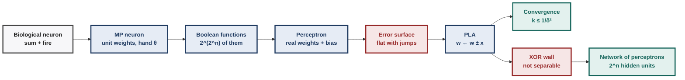
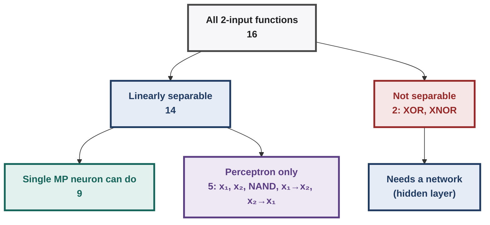
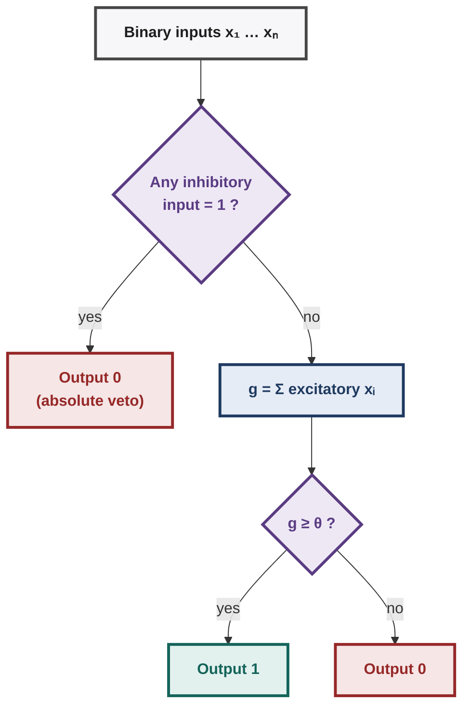
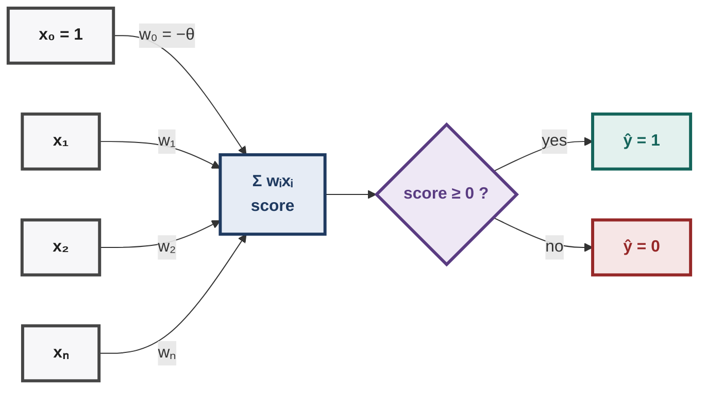
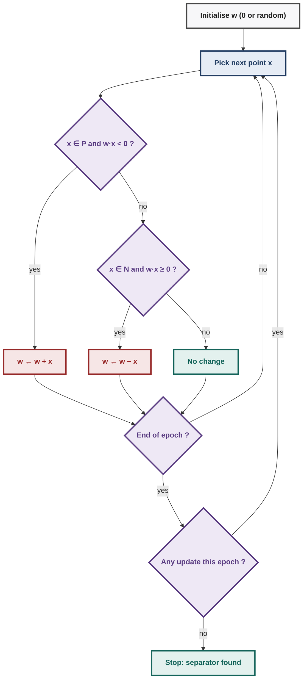
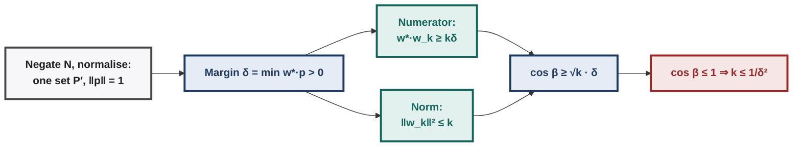
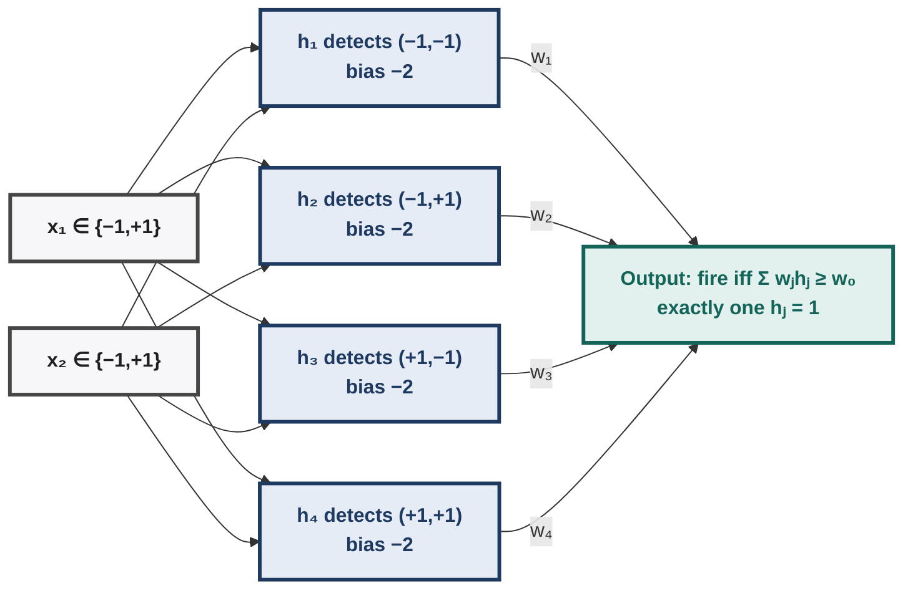
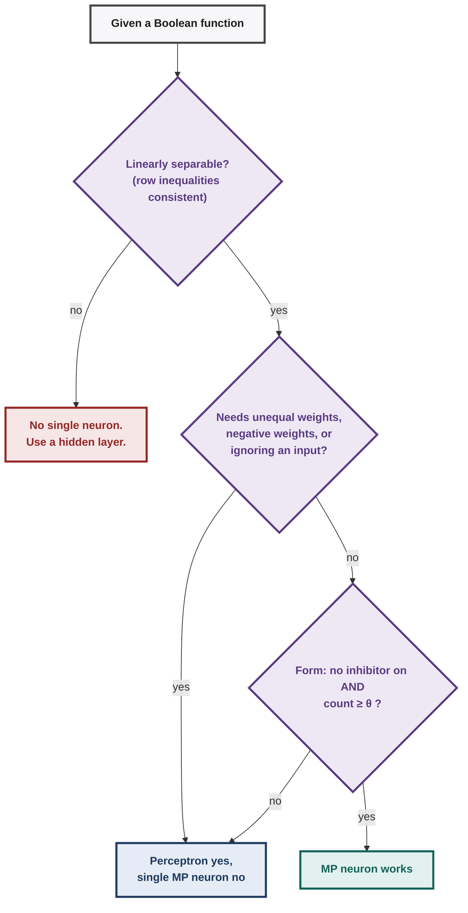

# Deep Learning : Illustrated Notes for Week 1


## Contents

- **Week 1 — Neurons, Boolean Functions, MP Neuron, Perceptron, PLA** ✓
  - 1.0 Week-1 map
  - 1.1 History in one page
  - 1.2 From biological to artificial neuron
  - 1.3 Boolean functions from first principles
  - 1.4 McCulloch–Pitts (MP) neuron & thresholding logic
  - 1.5 The perceptron: weights, bias, geometry
  - 1.6 Implementing Boolean functions & predicate/clause expressions with a perceptron
  - 1.7 Errors and error surfaces
  - 1.8 Perceptron Learning Algorithm (PLA): derivation & hand runs
  - 1.9 Convergence theorem (proof, annotated)
  - 1.10 Linearly separable functions (definitions, counting, implications)
  - 1.11 Representation power of a network of perceptrons
  - 1.12 Week-1 exam toolkit & practice set

---

## 1.0 Week-1 map

**The chain of ideas:**

`biological neuron` → abstract as **sum + threshold** → **MP neuron** (binary in, unit weights, hand-set θ, no learning) → can implement *some* Boolean functions → limits (equal weights, no learning, linear boundary) → **perceptron** (real weights, bias, real inputs) → **PLA** learns weights from data → **convergence theorem** (guaranteed iff linearly separable) → **XOR wall** → Week 2: networks of perceptrons.

Every Week-1 question tests one of these arrows.

---

**Diagram — the Week 1 story**



## 1.1 History in one page

| Year | Event | Why it matters for this course |
|---|---|---|
| 1871–1906 | Reticular theory (Golgi) vs **neuron doctrine** (Cajal); Nobel 1906 shared | Brain = discrete cells → idea of "units" |
| **1943** | **McCulloch & Pitts** neuron | First formal neuron: binary sum + threshold (§1.4) |
| 1949 | Hebb: "cells that fire together wire together" | First learning idea (not used directly in course math) |
| **1957–58** | **Rosenblatt perceptron** | Weights + learning rule (§1.5–1.8) |
| **1969** | **Minsky & Papert, *Perceptrons*** | Single perceptron can't do XOR → **AI winter** |
| 1974/1986 | Backpropagation (Werbos; Rumelhart–Hinton–Williams) | Trains multilayer nets (Week 3) |
| 1989 | **Universal approximation theorem** | One hidden layer suffices *in principle* (Week 2) |
| 2006 | Unsupervised pre-training (Hinton) | Deep nets trainable again ("deep revival") |
| 2009–12 | ImageNet; **AlexNet (2012)** | GPUs + data + ReLU → deep learning boom |
| 2011–14 | AdaGrad, RMSProp, Adam | Week 4 optimisers |
| 2017 | Transformer | Week 12 |

**[Exam]** *History questions are 1-mark ordering/attribution. Remember the **causal chain**: no learning (MP) → learning but linear only (perceptron) → XOR critique → backprop → depth.*

---

## 1.2 From biological to artificial neuron

| Biology | Abstraction | Symbol |
|---|---|---|
| Dendrites receive signals | inputs | $x_1,\dots,x_n$ |
| Synapse strength | weight | $w_i$ (MP: all 1) |
| Soma integrates | aggregation | $g(\mathbf x)=\sum_i w_ix_i$ |
| Fires if potential high enough | threshold decision | $y=f(g)=\mathbb 1[g\ge\theta]$ |
| Axon carries output | output | $y\in\{0,1\}$ |

**[Intuition]** Two operations only: **aggregate** then **decide**. Everything up to Week 3 keeps this shape; later neurons only change *how* we decide (step → sigmoid → ReLU…).

---

## 1.3 Boolean functions from first principles

### 1.3.1 What is a Boolean function?

A **Boolean function** of $n$ inputs is a rule that assigns an output in $\{0,1\}$ to *every* input vector in $\{0,1\}^n$:
$$f:\{0,1\}^n\to\{0,1\}.$$
Nothing more. It is completely described by its **truth table**: list every input, write the output.

### 1.3.2 Counting inputs and functions (the most-asked counting logic)

**Step 1 — how many input combinations (rows)?** Each of the $n$ inputs independently takes 2 values ⇒ $\underbrace{2\times2\times\cdots\times2}_{n}=2^n$ rows.

**Step 2 — how many functions?** A function = a choice of output for each row. Each of the $2^n$ rows independently gets 0 or 1 ⇒
$$\#\text{functions}=2^{(2^n)}.$$

| $n$ | rows $2^n$ | all functions $2^{2^n}$ | linearly separable (threshold) functions | single **MP** neuron can do |
|---|---|---|---|---|
| 1 | 2 | 4 | 4 | 4 |
| 2 | 4 | **16** | **14** | **9** |
| 3 | 8 | 256 | 104 | 21 |
| 4 | 16 | 65,536 | 1,882 | — |

(Counts for $n\le3$ verified by exhaustive enumeration; $n=4$ is the known result for threshold functions.)

**[Intuition]** **Implication:** the fraction a single neuron can represent collapses fast: $14/16=87.5\%$, $104/256=40.6\%$, $1882/65536\approx2.9\%$. Single neurons are hopeless for general logic → networks (Week 2).

**[!]** Don't confuse **rows** ($2^n$, "input combinations") with **functions** ($2^{2^n}$, "possible truth tables"). Questions phrase it as *"how many distinct Boolean functions"* vs *"how many input combinations"*.

### 1.3.3 All 16 two-input functions (memorise the shape of this table)

Rows in order $(x_1,x_2)=(0,0),(0,1),(1,0),(1,1)$; "truth vector" = outputs in that order.

| # | Truth vector | Name / formula | Linearly separable? | Single MP neuron? | Example perceptron: fire iff … |
|---|---|---|---|---|---|
| 1 | 0000 | FALSE | ✓ | ✓ (θ > 2) | $-1\ge0$ (never) |
| 2 | 0001 | AND $x_1x_2$ | ✓ | ✓ θ=2 | $x_1+x_2\ge2$ |
| 3 | 0010 | $x_1\wedge\neg x_2$ | ✓ | ✓ ($x_2$ inhib., θ=1) | $x_1-x_2\ge1$ |
| 4 | 0011 | $x_1$ | ✓ | ✗ | $x_1\ge1$ |
| 5 | 0100 | $\neg x_1\wedge x_2$ | ✓ | ✓ | $x_2-x_1\ge1$ |
| 6 | 0101 | $x_2$ | ✓ | ✗ | $x_2\ge1$ |
| 7 | 0110 | **XOR** | ✗ | ✗ | impossible |
| 8 | 0111 | OR | ✓ | ✓ θ=1 | $x_1+x_2\ge1$ |
| 9 | 1000 | NOR | ✓ | ✓ (both inhib., θ=0) | $-x_1-x_2\ge0$ |
| 10 | 1001 | **XNOR** | ✗ | ✗ | impossible |
| 11 | 1010 | $\neg x_2$ | ✓ | ✓ ($x_2$ inhib., θ=0) | $-x_2\ge0$ |
| 12 | 1011 | $x_2\to x_1$ ($x_1\vee\neg x_2$) | ✓ | ✗ | $x_1-x_2\ge0$ |
| 13 | 1100 | $\neg x_1$ | ✓ | ✓ | $-x_1\ge0$ |
| 14 | 1101 | $x_1\to x_2$ ($\neg x_1\vee x_2$) | ✓ | ✗ | $x_2-x_1\ge0$ |
| 15 | 1110 | **NAND** | ✓ | ✗ (!) | $-x_1-x_2\ge-1$ |
| 16 | 1111 | TRUE | ✓ | ✓ θ=0 | $0\ge0$ |

Tally: **14 separable** (all but XOR, XNOR); **9 MP-implementable**; the 5 separable-but-not-MP ones are $x_1$, $x_2$, NAND, $x_1\to x_2$, $x_2\to x_1$ (reasons in §1.4.6).

**Diagram — where the 16 two-input functions live**



### 1.3.4 Four ways to write the same function

1. **Sentence:** "Alarm if exactly one sensor is on."
2. **Truth table:** 0110.
3. **DNF (OR of AND-terms = minterms):** list rows with output 1, write each as an AND of literals, OR them: $(\neg x_1\wedge x_2)\vee(x_1\wedge\neg x_2)$.
4. **CNF (AND of OR-clauses):** for each row with output 0, write the clause that is *false exactly there*, AND them: rows 00 and 11 → $(x_1\vee x_2)\wedge(\neg x_1\vee\neg x_2)$.

**[Ex]** **Solved: sentence → truth table → formula.** "Open the valve if the soil is dry ($x_1$) and it is not raining ($x_2$), or if a manual override ($x_3$) is pressed."
Formula: $(x_1\wedge\neg x_2)\vee x_3$. Truth table (rows $x_1x_2x_3$ = 000…111): output 1 for 001, 011, 100, 101, 111 → **0 1 0 1 1 1 0 1**. (We implement it with one perceptron in §1.6.)

### 1.3.5 Geometry: a Boolean function colours the corners of a cube

Inputs $\{0,1\}^n$ are the **corners of an $n$-dimensional cube** (square for $n=2$, cube for $n=3$). A Boolean function = colouring each corner 1 (●) or 0 (○).

A single neuron draws **one hyperplane** (a line for $n=2$); it represents $f$ iff the line separates ● from ○.

```
   AND (0001)          OR (0111)           XOR (0110)
 x2                  x2                  x2
 1  ○ ------ ●       1  ● ------ ●       1  ● ------ ○
    |   \    |          | \      |          |        |
    |    \   |          |  \     |          |   ??   |
 0  ○ ------ ○       0  ○ ------ ●       0  ○ ------ ●
    0        1 x1       0        1 x1       0        1 x1
 line x1+x2=1.5      line x1+x2=0.5      no single line works

```

**[Intuition]** XOR's ● corners are on one diagonal and ○ on the other → any line cutting one diagonal pair apart also cuts the other.

### 1.3.6 Two properties that explain everything about MP neurons

- **Monotone (increasing):** turning any input from 0→1 never turns the output 1→0 (AND, OR, majority). NAND, NOR, XOR are *not* monotone.
- **Symmetric:** output depends only on **how many** inputs are 1, not which (AND, OR, majority, XOR are symmetric; $x_1\wedge\neg x_2$ is not).

A plain MP neuron (no inhibition) computes exactly the **symmetric + monotone** threshold functions "at least θ inputs on". Keep this in mind for §1.4.

**[?]** *Think:* how many symmetric Boolean functions of $n$ inputs exist? (Output depends on the count $k\in\{0,\dots,n\}$ → $2^{n+1}$.) How many of them are "count ≥ θ"? ($n+2$, including always-0/always-1.)

---

## 1.4 McCulloch–Pitts (MP) neuron & thresholding logic

### 1.4.1 Definition

Inputs $x_i\in\{0,1\}$, each either **excitatory** or **inhibitory**.
$$g(\mathbf x)=\sum_{i\in\text{exc}}x_i,\qquad y=\begin{cases}1 & g(\mathbf x)\ge\theta\ \text{ and no inhibitory input is }1\\0&\text{otherwise}\end{cases}$$

- All weights are effectively **1**; $\theta$ is chosen **by hand**; **no learning**.
- **Absolute inhibition:** any active inhibitory input forces $y=0$ regardless of the sum.

Compact formula: $y=\mathbb 1\!\left[\sum_{\text{exc}}x_i\ge\theta\right]\cdot\prod_{j\in\text{inh}}(1-x_j)$.

**Diagram — how an MP neuron decides**



### 1.4.2 Design recipe (sentence → MP neuron)

1. Write the truth table.
2. Any input whose being **1 always forces output 0** → make it **inhibitory**.
3. Among remaining (excitatory) inputs, find the smallest count of 1s that must fire; check that every row with that count or more fires → that count is θ.
4. **Verify every row.** If step 3 fails (some row with count ≥ θ must not fire, or a row with fewer must fire), no MP neuron exists.

### 1.4.3 Solved examples (each fully verified)

**[Ex]** **E1. AND of 3 inputs.** No input forces 0 alone → all excitatory. Must fire only at 111 (count 3) → **θ = 3**. ✓ Rows with count < 3 → 0.

**[Ex]** **E2. OR of 3 inputs.** All excitatory; fire whenever count ≥ 1 → **θ = 1**.

**[Ex]** **E3. NOT $x_1$.** Output is 1 at $x_1=0$, 0 at $x_1=1$. $x_1=1$ forces 0 → inhibitory. With no excitatory inputs, $g=0$; need $0\ge\theta$ → **θ = 0**. ✓

**[Ex]** **E4. NOR($x_1,x_2$)** (1000). Each input being 1 forces 0 → both inhibitory, **θ = 0**. ✓ (00 → $g=0\ge0$, no inhibitor → 1.)

**[Ex]** **E5. $x_1\wedge\neg x_2$** (0010). $x_2=1$ always gives 0 → $x_2$ inhibitory. $x_1$ excitatory; fire at $x_1=1$ → **θ = 1**. Check 00: $g=0<1$ → 0 ✓; 10: fire ✓; 01, 11: vetoed ✓.

**[Ex]** **E6. Majority of 3** ("at least two of three"). All excitatory, **θ = 2**. Fires on 4 of 8 rows: $\binom32+\binom33$.

**[Ex]** **E7. Greenhouse (4 inputs).** "Water if at least 2 of {soil dry $x_1$, sunny $x_2$, tank ok $x_3$}, never if raining $x_4$." $x_4$ inhibitory, others excitatory, **θ = 2**.

Firing rows: $x_4=0$ and count ≥ 2 → $\binom32+\binom33=4$ of 16.

**[Ex]** **E8. Quiz-1 style.** $x_1,x_2$ excitatory, $x_3$ inhibitory, θ=2. (1,1,0)→1; (1,1,1)→0 (veto); (1,0,0)→0 (sum 1). Raising θ to 3: (1,1,0) becomes 0 → *changes* output.

In fact with 2 excitatory inputs θ=3 is **always 0**.

### 1.4.4 Thresholding logic: what θ does

For $k$ excitatory inputs and no inhibitors, varying θ over all integers gives only these functions:

| θ | function |
|---|---|
| ≤ 0 | always 1 |
| 1 | OR |
| ⋯ | "at least θ of $k$" |
| $k$ | AND |
| ≥ $k+1$ | always 0 |

→ exactly **$k+2$ distinct functions**. **[Exam]** *"How many distinct functions can a 3-input MP neuron (no inhibition) compute by varying θ?" → 5.*

### 1.4.5 Geometry of an MP neuron

Decision boundary: $x_1+x_2+\cdots+x_k=\theta$ — a hyperplane whose normal is $(1,1,\dots,1)$. In 2D the line $x_1+x_2=\theta$ **always has slope −1**; only its position (θ) can change. Points on/above it fire.

**[Intuition]** This one picture explains every MP limitation: you can **slide** the line but never **rotate** it, and you can only ever fire on the "more ones" side.

### 1.4.6 What a single MP neuron *cannot* do (with proofs)

**(a) XOR.** Neither input can be inhibitory (each alone gives output 1). Both excitatory: 10 → 1 needs $1\ge\theta$; 11 → 0 needs $2<\theta$. Contradiction. ∎

**(b) NAND — a surprise, since NAND *is* linearly separable.** Row 00 must fire ⇒ no inhibitor is needed there and $0\ge\theta$, so $\theta\le0$.

Then with all inputs excitatory the neuron fires on *every* row — but 11 must give 0. So some input must be inhibitory, say $x_1$; then row 10 gives 0, but NAND(1,0)=1. Contradiction. ∎

*Root cause:* NAND needs "fire when the count is **small**" — the line must face the other way. MP neurons only fire on the ≥ side.

**(c) Plain "$x_1$" when $x_2$ is also connected.** $x_2$ can't be inhibitory (row 11 → 1). Both excitatory: row 10 → 1 needs θ ≤ 1, row 01 → 0 needs θ > 1. Contradiction. The neuron cannot *ignore* an input — all weights are 1.

**(d) Implication $x_1\to x_2$** (1101): similar argument — needs weights $(-1,+1)$, impossible with unit weights and veto-only inhibition.

**(e) $x_1\vee(x_2\wedge x_3)$** (3 inputs): linearly separable ($2x_1+x_2+x_3\ge2$) but needs $x_1$ to count **double** → impossible with unit weights.

### 1.4.7 Limitations summary → motivation for the perceptron

| Limitation of MP | Consequence | Fixed by |
|---|---|---|
| Only Boolean inputs | can't use real sensor values | perceptron (real inputs) |
| All weights = 1 | can't rotate boundary, can't weigh evidence (cases b–e) | real weights $w_i$ |
| θ hand-coded | no learning | PLA |
| Single hyperplane | XOR impossible | networks (Week 2) |

**[?]** **Think about it.**

1. With inhibition, every MP function has the form *[all inhibitors off] AND [count of excitatory ≥ θ]*. Use this to recount the 9 two-input MP functions.
2. Can you build NAND from **two** MP neurons? (Yes: AND neuron feeding a NOT neuron — composition beats single-unit limits.)
3. Is "exactly 2 of 3" MP-representable? (No: not monotone in the count — count 3 must not fire.)

---

## 1.5 The perceptron: weights, bias, geometry

### 1.5.1 Definition (two equivalent forms)

**Threshold form:** $y=1$ if $\sum_{i=1}^n w_ix_i\ge\theta$, else 0. Inputs and weights are **real**.

**Bias form (**[Derivation]** bias trick):** move θ to the left: $\sum_{i=1}^n w_ix_i-\theta\ge0$. Define $x_0=1$, $w_0=-\theta$:
$$y=\mathbb 1\Big[\sum_{i=0}^{n}w_ix_i\ge0\Big]=\mathbb 1[\mathbf w^\top\mathbf x\ge0],\quad \mathbf x=[1,x_1,\dots,x_n].$$
$w_0$ is the **bias** — the neuron's prior tendency ("prejudice") to fire.

**±1 form:** labels $y\in\{-1,+1\}$, predict $+1$ iff $\mathbf w^\top\mathbf x+b\ge0$. Same model, different bookkeeping.

**Diagram — the perceptron as a computation**



### 1.5.2 Geometry (the key to everything in PLA)

- Boundary: $\mathbf w^\top\mathbf x=0$ (with bias inside $\mathbf w$) — a hyperplane.
- For a point $\mathbf x$ on the boundary, $\mathbf w^\top\mathbf x=\|\mathbf w\|\|\mathbf x\|\cos\alpha=0\Rightarrow\alpha=90^\circ$: **$\mathbf w$ is perpendicular (normal) to the boundary.**
- **Positive side:** $\mathbf w^\top\mathbf x>0$ ⇔ angle between $\mathbf w$ and $\mathbf x$ < 90°. **Negative side:** angle > 90°.
- In 2D with explicit bias: $w_1x_1+w_2x_2+b=0\Rightarrow x_2=-\frac{w_1}{w_2}x_1-\frac{b}{w_2}$ (slope $-w_1/w_2$, intercept $-b/w_2$) — **rotatable** (unlike MP).
- **Distance** of a point to the boundary: $\dfrac{|\mathbf w^\top\mathbf x+b|}{\|\mathbf w\|}$.

**[Ex]** **Solved.** $\mathbf w=(3,4)$, $b=-5$. Classify $(2,1)$ and find its distance. Score $6+4-5=5\ge0$ → class 1; distance $5/5=1$. Line: $x_2=-0.75x_1+1.25$.

**[Ex]** **Solved (scaling).** Multiply $(\mathbf w,b)$ by 10: predictions unchanged (sign unchanged), score ×10, distance unchanged.

**Perceptron solutions are never unique** — any positive multiple works; usually infinitely many non-parallel solutions too.

### 1.5.3 MP neuron vs perceptron

| | MP neuron | Perceptron |
|---|---|---|
| Inputs | binary | real |
| Weights | 1 (+ absolute inhibition) | real, learnable |
| Threshold | hand-set θ | learnable bias $w_0=-\theta$ |
| Boundary | $\sum x_i=\theta$ (fixed orientation) | any hyperplane |
| Learning | none | PLA |
| 2-input functions | 9 of 16 | 14 of 16 |
| XOR | ✗ | ✗ |

---

## 1.6 Implementing Boolean functions & predicate/clause expressions with a perceptron

### 1.6.1 Method 1 — inequalities, one per truth-table row (always works)

Model: fire iff $w_0+w_1x_1+w_2x_2\ge0$. Each row gives one linear inequality (≥0 for output 1, <0 for output 0). Solve; any solution works.

**[Ex]** **AND.**

| row | requirement |
|---|---|
| 00→0 | $w_0<0$ |
| 01→0 | $w_0+w_2<0$ |
| 10→0 | $w_0+w_1<0$ |
| 11→1 | $w_0+w_1+w_2\ge0$ |
Try $w_1=w_2=1$: need $w_0<-1$ and $w_0\ge-2$ → **$w_0=-1.5$** (or $-2$). ✓

**[Ex]** **OR.** $w_0<0$, $w_0+w_1\ge0$, $w_0+w_2\ge0$. With $w_1=w_2=1$: $-1\le w_0<0$ → **$w_0=-0.5$** (or $-1$).

**[Ex]** **NAND** (impossible for MP!). $w_0\ge0$, $w_0+w_1\ge0$, $w_0+w_2\ge0$, $w_0+w_1+w_2<0$.

With $w_1=w_2=-1$: $w_0\ge1$ and $w_0<2$ → **$w_0=1.5$**: fire iff $1.5-x_1-x_2\ge0$. ✓ Negative weights = the "rotation" MP lacked.

**[Ex]** **NOR.** $w_1=w_2=-1$, $w_0\in[0,1)$, e.g. $w_0=0.5$.

**[Ex]** **NOT $x_1$.** $w_1=-1$, $w_0=0.5$.

**[Ex]** **Implication $x_1\to x_2$** (1101). Rows: $w_0\ge0$; $w_0+w_2\ge0$; $w_0+w_1<0$; $w_0+w_1+w_2\ge0$. Choose $w_1=-1,w_2=1,w_0=0.5$: rows give $0.5,1.5,-0.5,0.5$ ✓.

**[Ex]** **$x_1\vee(x_2\wedge x_3)$** (weighted vote): $\mathbf w=(2,1,1)$, $w_0=-2$. $x_1=1$ alone reaches 2; otherwise need both $x_2,x_3$.

**[Ex]** **"At least $k$ of $n$":** all weights 1, $w_0=-k$ (or $-k+0.5$ for margin).

**[Ex]** **Valve example from §1.3.4: $(x_1\wedge\neg x_2)\vee x_3$** (truth vector 01011101).
Try $x_3$ heavy enough to override: $\mathbf w=(1,-1,2)$, $w_0=-1$. Scores for rows 000…111: $-1,1,-2,0,0,2,-1,1$ → outputs 0,1,0,1,1,1,0,1 ✓ matches.

### 1.6.2 Method 2 — clause recipes (derive once, use forever)

A **literal** is $x_i$ (positive) or $\neg x_i$ (negated). Let $P$ = set of positive literals, $N$ = set of negated literals.

**(i) Conjunction of literals** (AND-term), e.g. $x_1\wedge\neg x_2\wedge x_3$:
Score $s=\sum_{i\in P}x_i-\sum_{j\in N}x_j$. Its **maximum** $|P|$ is reached **only** when all $P$-inputs are 1 and all $N$-inputs are 0 — exactly when the term is true. So
$$\boxed{w_i=+1\ (i\in P),\quad w_j=-1\ (j\in N),\quad \theta=|P|\ \ (w_0=-|P|)}.$$
Example: $x_1\wedge\neg x_2\wedge x_3$ → $\mathbf w=(1,-1,1)$, $\theta=2$.

**(ii) Disjunction of literals** (clause), e.g. $\neg x_1\vee x_2\vee\neg x_3$:
The clause is true iff at least one literal is true: $\sum_{P}x_i+\sum_{N}(1-x_j)\ge1\iff\sum_Px_i-\sum_Nx_j\ge1-|N|$.
$$\boxed{w_i=+1\ (i\in P),\quad w_j=-1\ (j\in N),\quad \theta=1-|N|}.$$
Example: $\neg x_1\vee x_2\vee\neg x_3$ → $\mathbf w=(-1,1,-1)$, $\theta=-1$. Check the only false row $(1,0,1)$: $-2<-1$ → 0 ✓; $(1,0,0)$: $-1\ge-1$ → 1 ✓.

**[Intuition]** **Implications.**

- Every **single** AND-term and every **single** OR-clause is perceptron-representable (so AND, OR, NAND $=\neg x_1\vee\neg x_2$, NOR, implication are all covered).
- A **DNF with several terms** (or CNF with several clauses) *may or may not* be representable — it depends on whether the terms combine into one half-space. $x_1\vee(x_2\wedge x_3)$ is; XOR $=(x_1\wedge\neg x_2)\vee(\neg x_1\wedge x_2)$ is not.
- This is exactly Week 2's construction: one hidden perceptron per AND-term, then an OR at the output → any Boolean function.

### 1.6.3 Proving impossibility algebraically (XOR)

Rows give: $w_0<0$ (00), $w_0+w_2\ge0$ (01), $w_0+w_1\ge0$ (10), $w_0+w_1+w_2<0$ (11).
Add the middle two: $2w_0+w_1+w_2\ge0\Rightarrow w_0+w_1+w_2\ge-w_0>0$ (since $w_0<0$). Contradicts the last. ∎

**[Exam]** *Template:* to prove non-separability, **add the "1" inequalities and the "0" inequalities so the same weight combination appears on both sides** and get a contradiction.

**[Ex]** **XNOR** (1001): $w_0\ge0$, $w_0+w_1+w_2\ge0$, $w_0+w_1<0$, $w_0+w_2<0$. Add the last two: $2w_0+w_1+w_2<0$; add the first two: $2w_0+w_1+w_2\ge0$. Contradiction ∎.

### 1.6.4 Things to think about

1. Can a perceptron compute "$x_1$" while ignoring $x_2$? (Yes, $w_2=0$ — the MP neuron couldn't.)
2. Why are integer weights always enough for Boolean inputs? (Finitely many strict inequalities ⇒ a solution with rational weights exists; scale to integers.)
3. Parity of $n$ inputs is never linearly separable for $n\ge2$ — try to generalise the XOR proof.
4. A sensor gives a *real* temperature $t$. "Alarm iff $t\ge38.5$" → $w_1=1$, $w_0=-38.5$: perceptrons go beyond Boolean logic.

---

## 1.7 Errors and error surfaces

### 1.7.1 What is "error" for a perceptron?
For fixed weights, **error = number of training points misclassified**. Learning = finding weights with error 0 (if possible). So error is a *function of the weights*: $E(w_0,w_1,w_2)$.

### 1.7.2 [Ex] Error table for OR (fix $w_0=-1$, vary $w_1,w_2$)
Data: 00→0, 01→1, 10→1, 11→1. Fire iff $-1+w_1x_1+w_2x_2\ge0$.

| $(w_1,w_2)$ | scores (00,01,10,11) | predictions | errors |
|---|---|---|---|
| (1, 1) | −1, 0, 0, 1 | 0,1,1,1 | **0** |
| (1.5, 0) | −1, −1, 0.5, 0.5 | 0,0,1,1 | 1 (row 01) |
| (2, −1) | −1, −2, 1, 0 | 0,0,1,1 | 1 (row 01) |
| (0.5, 0.5) | −1, −0.5, −0.5, 0 | 0,0,0,1 | 2 |
| (0, 0) | −1, −1, −1, −1 | 0,0,0,0 | 3 |
| (−1, −1) | −1, −2, −2, −3 | 0,0,0,0 | 3 |

### 1.7.3 The error surface
Plot $E$ over the $(w_1,w_2)$ plane (with $w_0=-1$): each data point $\mathbf x$ contributes the line $w_1x_1+w_2x_2=1$ in **weight space**; crossing it flips that point's prediction.

The plane is cut into regions; inside a region the error is **constant**.
For OR: error 0 exactly when $w_1\ge1$ and $w_2\ge1$ (rows 10, 01 need it; then 11 is automatic).

```
 w2
  ^   error 1     |   error 0
  |  (01 ok,10 x) |  (all ok)
 1+---------------+----------->
  |  error 2 or 3 |   error 1
  |  (both wrong) |  (10 ok,01 x)
  +---------------1-----------> w1
```
(The region boundaries are $w_1=1$, $w_2=1$, and $w_1+w_2=1$ for row 11; the sketch shows the main quadrant structure.)

**[Intuition] Implications**

- Error is **piecewise constant** (a staircase): a small change in weights usually changes nothing, then suddenly jumps. Its gradient is 0 almost everywhere, so calculus cannot tell us which way to move. Hence a **search/correction rule** (PLA) rather than gradient descent — and later (Week 2) a smooth sigmoid neuron so that a smooth error surface exists.
- Brute-force search over a weight grid works for tiny problems (try many $(w_1,w_2)$, keep error 0) but explodes with dimension → need a learning algorithm.
- Weight space vs input space: in **input space** a weight vector is one line and data are points; in **weight space** each data point is a line and a weight vector is a point. The zero-error region = all valid separators (usually an infinite region → many solutions).

**[Exam]** "Compute the number of errors for given weights" → evaluate each row's score, compare with labels (remember the ≥0 tie rule). "Why can't we use gradient descent on perceptron error?" → step function; error surface flat with jumps.

---

## 1.8 Perceptron Learning Algorithm (PLA)

### 1.8.1 Derivation: why "add $\mathbf x$"? 

Misclassified **positive** point: $\mathbf w^\top\mathbf x<0$ (angle > 90°). We want to rotate $\mathbf w$ toward $\mathbf x$. Try $\mathbf w_{\text{new}}=\mathbf w+\mathbf x$:
$$\mathbf w_{\text{new}}^\top\mathbf x=\mathbf w^\top\mathbf x+\|\mathbf x\|^2>\mathbf w^\top\mathbf x.$$
The score rises by exactly $\|\mathbf x\|^2$ ⇒ the angle shrinks. For a misclassified **negative** point use $\mathbf w-\mathbf x$ (score falls by $\|\mathbf x\|^2$).

**[!]** One update need not fix the point, and it can *break* other points; convergence is a global property (§1.9).

### 1.8.2 Algorithm (course form, labels 0/1, augmented inputs)

```
P ← inputs with label 1;  N ← inputs with label 0;   (each x has x0 = 1)
initialise w (random or 0)
repeat (one pass = one epoch):
    for each x:
        if x ∈ P and w·x < 0:  w ← w + x
        if x ∈ N and w·x ≥ 0:  w ← w − x
until a full epoch makes no update

```
±1 form: on a mistake, $\mathbf w\leftarrow\mathbf w+y\mathbf x$ (and $b\leftarrow b+y$ if bias is separate).

**[!]** **The zero tie.** "Fire iff $\mathbf w^\top\mathbf x\ge0$" ⇒ score 0 = predicted **1**. Positive point with score 0: correct. Negative point with score 0: **mistake**.

Starting from $\mathbf w=\mathbf 0$, the first negative point visited is always updated.

**Diagram — the PLA loop**



### 1.8.3 Hand run 1 — learning AND from $\mathbf w=\mathbf 0$ (order 00, 01, 10, 11)

$\mathbf w=[w_0,w_1,w_2]$, $\mathbf x=[1,x_1,x_2]$.

| ep | $x$ | $y$ | score | action | new $\mathbf w$ |
|---|---|---|---|---|---|
| 1 | 00 | 0 | 0 | ≥0 on N → −x | [−1,0,0] |
| 1 | 01 | 0 | −1 | ok | |
| 1 | 10 | 0 | −1 | ok | |
| 1 | 11 | 1 | −1 | <0 on P → +x | [0,1,1] |
| 2 | 00 | 0 | 0 | −x | [−1,1,1] |
| 2 | 01 | 0 | 0 | −x | [−2,1,0] |
| 2 | 10 | 0 | −1 | ok | |
| 2 | 11 | 1 | −1 | +x | [−1,2,1] |
| 3 | 00 | 0 | −1 | ok | |
| 3 | 01 | 0 | 0 | −x | [−2,2,0] |
| 3 | 10 | 0 | 0 | −x | [−3,1,0] |
| 3 | 11 | 1 | −2 | +x | [−2,2,1] |
| 4 | 10 | 0 | 0 | −x | [−3,1,1] |
| 4 | 11 | 1 | −1 | +x | [−2,2,2] |
| 5 | 01 | 0 | 0 | −x | [−3,2,1] |
| 5 | 11 | 1 | 0 | ok (tie → 1) | |
| 6 | all | | −3,−2,−1,0 | all ok | **stop** |

(Epochs 4–5 show only the rows that caused updates or a notable tie.) **Result:** 11 updates, 6 epochs, $\mathbf w=[-3,2,1]$: fire iff $2x_1+x_2\ge3$ — a valid AND with **unequal** weights. ✓

**[Intuition]** PLA finds *a* separator, not the "nicest" one; AND learned here is $2x_1+x_2\ge3$, not $x_1+x_2\ge1.5$.

### 1.8.4 Hand run 2 — OR and NAND (same order, from 0)

- **OR:** updates at ep1: 00(−x)→[−1,0,0], 01(+x)→[0,0,1]; ep2: 00(−x)→[−1,0,1], 10(+x)→[0,1,1]; ep3: 00(−x)→[−1,1,1]; ep4 clean. **5 updates**, $\mathbf w=[-1,1,1]$ (fire iff $x_1+x_2\ge1$).
- **NAND:** 10 updates, 6 epochs, $\mathbf w=[2,-2,-1]$: fire iff $2x_1+x_2\le2$ ✓ (only 11 gives 3 > 2).

**[?]** *Notice:* OR needs fewer updates than AND from the same start. Why? (Starting at 0 biases toward firing; OR fires on 3 of 4 rows.)

### 1.8.5 Hand run 3 — XOR: watching PLA cycle forever

| ep | after 00 | after 01 | after 10 | after 11 |
|---|---|---|---|---|
| 1 | [−1,0,0] | [0,0,1] | [0,0,1] (ok) | [−1,−1,0] |
| 2 | [−1,−1,0] (ok) | [0,−1,1] | [1,0,1] | [0,−1,0] |
| 3 | [−1,−1,0] | [0,−1,1] | [1,0,1] | [0,−1,0] |
| 4 | same as 3 | … | … | … |

From epoch 3 on, every epoch starts at $[0,-1,0]$ and ends at $[0,-1,0]$ → a **deterministic cycle**; at least one point is always wrong. ✓ This is how non-separability shows up in practice: **no mistake-free epoch ever arrives.**

### 1.8.6 Quiz-1 problems, solved with the logic

**[Ex]** **Angle after update.** $\mathbf w=[3,4]$, misclassified $\mathbf x=[4,3]$, $y=-1$, $\mathbf w_{\text{new}}=\mathbf w-\mathbf x=[-1,1]$.
$\mathbf w_{\text{new}}\cdot\mathbf x=-4+3=-1$; $\|\mathbf w_{\text{new}}\|=\sqrt2$, $\|\mathbf x\|=5$ ⇒ $\theta=\cos^{-1}\frac{-1}{5\sqrt2}$ (just over 90°).
✓ Theory check: before, $\mathbf w\cdot\mathbf x=24$; after, $24-\|\mathbf x\|^2=24-25=-1$.

**[Ex]** **Separate bias, 4 points** ($\mathbf w=[2,-1]$, $b=0$; A(3,1,+1), B(2,0,−1), C(1,2,−1), D(4,4,+1)).
A: 5 → +1 ✓. B: 4 → +1 ✗ ⇒ $\mathbf w=[0,-1]$, $b=-1$. C: $-2-1=-3$ → −1 ✓. D: $-4-1=-5$ → −1 ✗ ⇒ $\mathbf w=[4,3]$, $b=0$.
Two updates (after B and D), final $b=0$.

### 1.8.7 Effects of order, initialisation, learning rate

- **Order:** different visiting orders → different final $\mathbf w$ and different update counts; all valid if data are separable.
- **Initialisation:** changes the path; the convergence *guarantee* holds from any start (bound in §1.9 assumes $\mathbf 0$ for the clean form).
- **Learning rate** $\eta$ in $\mathbf w\leftarrow\mathbf w+\eta y\mathbf x$: from $\mathbf w_0=\mathbf 0$, every $\mathbf w_k$ is just $\eta\times$ the $\eta=1$ vector → **same predictions, same number of updates**. η is irrelevant for PLA from zero (not true from a random start).

---

## 1.9 Convergence theorem (proof, annotated)

**Theorem.** If $P$ and $N$ are finite and linearly separable, PLA makes finitely many updates (for any visiting order) and ends with a separating $\mathbf w$.

**Setup tricks.**

1. *Negate negatives:* "$\mathbf w^\top\mathbf x<0$ for $\mathbf x\in N$" ⇔ "$\mathbf w^\top(-\mathbf x)>0$". Put $-\mathbf x$ into $P'$. Now there is only one rule: if $\mathbf w^\top\mathbf p<0$, $\mathbf w\leftarrow\mathbf w+\mathbf p$.
2. *Normalise:* $\|\mathbf p\|=1$ for all $\mathbf p\in P'$ (sign of $\mathbf w^\top\mathbf p$ unchanged).
3. Let $\mathbf w^*$ be a **unit** separator; define $\delta=\min_{\mathbf p}\mathbf w^{*\top}\mathbf p>0$ (worst-case alignment, a margin).

**Step A — numerator grows linearly.** Each update adds some $\mathbf p$ with $\mathbf w^{*\top}\mathbf p\ge\delta$:
$\mathbf w^{*\top}\mathbf w_k\ge\mathbf w^{*\top}\mathbf w_{k-1}+\delta\ge\cdots\ge\mathbf w^{*\top}\mathbf w_0+k\delta.$

**Step B — norm grows only like $\sqrt k$.** An update happens only when $\mathbf w_{k-1}^\top\mathbf p<0$:
$\|\mathbf w_k\|^2=\|\mathbf w_{k-1}\|^2+\underbrace{2\mathbf w_{k-1}^\top\mathbf p}_{<0}+\underbrace{\|\mathbf p\|^2}_{=1}\le\|\mathbf w_{k-1}\|^2+1\le\cdots\le\|\mathbf w_0\|^2+k.$

**Step C — combine.** $\cos\beta=\dfrac{\mathbf w^{*\top}\mathbf w_k}{\|\mathbf w_k\|}\ge\dfrac{k\delta}{\sqrt k}=\sqrt k\,\delta$ (with $\mathbf w_0=\mathbf 0$). Since $\cos\beta\le1$: $\boxed{k\le1/\delta^2}$. ∎

**Diagram — logic of the convergence proof**



**[Intuition]** **Story:** each mistake buys a fixed amount of alignment with the truth (linear), while the length grows slowly (square root); alignment can't exceed perfect, so mistakes must stop.

Small margin $\delta$ ⇒ possibly many mistakes.

**[Ex]** **Bound practice.** $\delta=0.2$ ⇒ at most 25 updates. $\delta=0.05$ ⇒ at most 400.
**General (Novikoff):** $\|\mathbf x_i\|\le R$, margin $\gamma$ ⇒ at most $(R/\gamma)^2$ mistakes — independent of the number of points and the dimension.

**[!]** **What the theorem does NOT say:** nothing about non-separable data (PLA may cycle — §1.8.5), nothing about the *quality* (margin) of the final separator, nothing about generalisation.

**[?]** Why does Step B need the update condition $\mathbf w^\top\mathbf p<0$? (Without it, $\|\mathbf w\|$ could grow linearly and the argument fails.)

---

## 1.10 Linearly separable functions

### 1.10.1 Definitions

- Two sets $P$ (label 1) and $N$ (label 0) in $\mathbb R^n$ are **linearly separable** if some $w_0,\dots,w_n$ give $\sum_{i\ge1}w_ix_i\ge -w_0$ on every point of $P$ and $< -w_0$ on every point of $N$.
- A Boolean function is **linearly separable** (a *threshold function*) if its 1-rows and 0-rows are linearly separable — i.e. one perceptron computes it.
- PLA **converges iff** the training data are linearly separable (§1.9); if not, it cycles (§1.8.5).

### 1.10.2 Counting (the course's key observation)

| $n$ | $2^{2^n}$ | linearly separable |
|---|---|---|
| 1 | 4 | 4 |
| 2 | 16 | 14 |
| 3 | 256 | 104 |
| 4 | 65,536 | 1,882 |
| 5 | $\approx4.3\times10^9$ | 94,572 |
No simple closed-form formula is known; the separable fraction → 0 rapidly.

### 1.10.3 Implications

- Most Boolean functions (and most real data — noise, overlapping classes) are **not** linearly separable → a single perceptron is not enough → **networks of perceptrons** (§1.11).
- XOR/XNOR are the canonical 2-input failures; parity of $n$ inputs fails for every $n\ge2$.
- Test for separability by hand: write one inequality per row, add rows to force a contradiction (§1.6.3).

**[Exam]** "How many of the 16 two-input functions are not linearly separable?" → 2 (XOR, XNOR). "Single perceptron can represent all Boolean functions?" → False.

---

## 1.11 Representation power of a network of perceptrons

### 1.11.1 Setup (course convention)

- Inputs in $\{-1,+1\}$ (True $=+1$, False $=-1$).
- **Hidden layer:** one perceptron per input pattern → $2^n$ perceptrons. For $n=2$: $h_1..h_4$ for patterns $(-1,-1),(-1,+1),(+1,-1),(+1,+1)$.
- Hidden perceptron $j$: **weights = its own pattern** (course figure: red edge $=-1$, blue edge $=+1$), **bias $=-2$** (in general $-n$). Fires iff $\mathbf p_j^\top\mathbf x-2\ge0$.
- **Output perceptron:** weights $w_1..w_4$ on $h_1..h_4$, fires iff $\sum_j w_jh_j\ge w_0$.

**Diagram — the 2ⁿ network for any 2-input function**



### 1.11.2 [Derivation] Why exactly one hidden unit fires
$\mathbf p_j^\top\mathbf x=\sum_i p_{ji}x_i$; each term is $+1$ if $x_i=p_{ji}$, else $-1$. So $\mathbf p_j^\top\mathbf x=n$ only for a perfect match, otherwise $\le n-2$.

With bias $-n$: match → $0\ge0$ fires; mismatch → $\le-2$ doesn't. Each hidden unit is a **pattern detector**.

✓ Check $\mathbf x=(+1,-1)$: $h_1:-1+1-2=-2$; $h_2:-1-1-2=-4$; $h_3:1+1-2=0$ fires; $h_4:1-1-2=-2$.

### 1.11.3 Output conditions
Exactly one $h_j=1$ for each input, so the output on pattern $j$ is simply $\mathbb 1[w_j\ge w_0]$:
$$f(\mathbf p_j)=1\Rightarrow w_j\ge w_0,\qquad f(\mathbf p_j)=0\Rightarrow w_j<w_0.$$
One independent condition per row → **never conflicting → every truth table is achievable.**

**[Ex] XOR** (rows in pattern order: 0,1,1,0): $w_1<w_0$, $w_2\ge w_0$, $w_3\ge w_0$, $w_4<w_0$; e.g. $w_0=1$, $\mathbf w=(0,1,1,0)$.

**[Ex] NAND** (1,1,1,0): $w_1,w_2,w_3\ge w_0$, $w_4<w_0$; e.g. $w_0=1$, $\mathbf w=(1,1,1,0)$.

**[Ex] AND** (0,0,0,1): only $w_4\ge w_0$.

### 1.11.4 Theorem and its fine print
**Any Boolean function of $n$ inputs can be represented exactly by a network of perceptrons with one hidden layer of $2^n$ perceptrons and one output perceptron.**

- **Sufficient, not necessary:** XOR needs only 2 hidden units, e.g. with 0/1 inputs $h_1=$ OR ($x_1+x_2\ge0.5$), $h_2=$ NAND ($x_1+x_2\le1.5$), $y=$ AND ($h_1+h_2\ge1.5$).
- **Cost:** hidden units grow as $2^n$ (n=10 → 1024; n=30 → ~$10^9$) — impractical; motivates deeper/learned representations.
- **Exact vs approximate:** this is *exact* representation of Boolean functions; the sigmoid version (Week 2, UAT) is *approximation* of continuous functions.
- **No learning yet:** PLA can't train this network (hidden units have no targets; step functions have no gradient) → Week 2/3.

### 1.11.5 Counting parameters (quick exam variant)
Hidden: $2^n$ units × ($n$ weights + 1 bias) $=(n+1)2^n$; output: $2^n$ weights + 1 threshold. Total $(n+2)2^n+1$. For $n=2$: $3\cdot4+4+1=17$; $n=3$: $4\cdot8+8+1=41$.

### 1.11.6 Things to think about

1. Why does the bias $-n$ (not $-n+1$) matter? (With $-n+1$, a 1-bit mismatch scores $-1$ → still off, fine; but $-n+2$ would let 1-mismatch inputs fire too → several hidden units on → conditions start to conflict.)
2. If inputs were $\{0,1\}$ instead of $\pm1$, what weights/bias detect pattern $\mathbf p$? (Weight $+1$ where $p_i=1$, $-1$ where $p_i=0$, bias $-(\#\text{ones in }\mathbf p)$ — the conjunction recipe of §1.6.2.)
3. The hidden layer is an "OR of minterms" = the DNF of §1.3.4 built in hardware.

---

## 1.12 Week-1 exam toolkit & practice set

**Diagram — exam decision tree, "can one neuron do it?"**



### 1.12.1 Recognition rules ("if you see X, think Y")

| See | Think |
|---|---|
| "how many Boolean functions of $n$ inputs" | $2^{2^n}$ (rows: $2^n$) |
| "how many linearly separable 2-input functions" | 14 (all but XOR, XNOR) |
| inhibitory input = 1 | output 0, stop |
| θ larger than number of excitatory inputs | constant 0 |
| NAND / implication / "ignore an input" with an MP neuron | impossible (unit weights, ≥-only) |
| XOR, XNOR, parity, "exactly one" | not separable → no single neuron |
| single AND-term or OR-clause | perceptron via clause recipe (§1.6.2) |
| score exactly 0 | predicted positive (read the rule!) |
| misclassified, $y=-1$ | $\mathbf w-\mathbf x$; score drops by $\|\mathbf x\|^2$ |
| separate bias | update $b\leftarrow b+y$ too |
| margin δ (normalised) | ≤ $1/\delta^2$ updates |
| "PLA never converges" | data not linearly separable |
| "error for given weights" | count misclassified rows (tie rule!) |
| "why not gradient descent on perceptron" | error surface is piecewise constant |
| "network of perceptrons, n inputs" | $2^n$ hidden pattern detectors, bias $-n$, inputs $\pm1$ |
| "output conditions for function f" | $w_j\ge w_0$ if $f=1$ on pattern $j$, else $w_j<w_0$ |

### 1.12.2 Formula sheet

| Formula | Meaning |
|---|---|
| $y=\mathbb 1[\sum_{\text{exc}}x_i\ge\theta]\prod_{\text{inh}}(1-x_j)$ | MP neuron |
| $y=\mathbb 1[\mathbf w^\top\mathbf x\ge0]$, $x_0=1$, $w_0=-\theta$ | perceptron |
| $\mathbf w\leftarrow\mathbf w\pm\mathbf x$ / $\mathbf w\leftarrow\mathbf w+y\mathbf x$ | PLA |
| $(\mathbf w+\mathbf x)^\top\mathbf x=\mathbf w^\top\mathbf x+\|\mathbf x\|^2$ | why PLA works |
| $\cos\alpha=\frac{\mathbf w^\top\mathbf x}{\|\mathbf w\|\|\mathbf x\|}$ | angle questions |
| $\frac{|\mathbf w^\top\mathbf x+b|}{\|\mathbf w\|}$ | distance to boundary |
| conjunction: $\pm1$ weights, $\theta=|P|$; disjunction: $\theta=1-|N|$ | clause recipes |
| $k\le1/\delta^2$ | convergence bound |

### 1.12.3 Practice set (answers at the end)

1. How many rows does the truth table of a 5-input function have? How many 5-input Boolean functions exist?
2. Design an MP neuron for "$x_1\wedge x_2\wedge\neg x_3$".
3. A 4-input MP neuron (no inhibition) fires on exactly 5 of the 16 inputs. Find θ.
4. True/False: "Every linearly separable Boolean function of 2 inputs can be computed by a single MP neuron."
5. Give perceptron weights for $x_2\to x_1$.
6. Use the clause recipe for $\neg x_1\wedge\neg x_2\wedge x_3$ and $x_1\vee\neg x_2\vee\neg x_3\vee x_4$.
7. Prove that "exactly one of three" ($x_1+x_2+x_3=1$) is not linearly separable.
8. $\mathbf w=[1,-2]$ (no bias), positive point $\mathbf x=[2,2]$ misclassified. Is it correct after one update?
9. Run PLA (course form, from $\mathbf w=\mathbf 0$, order 0, 1) on 1-input data: $x=0\mapsto1$, $x=1\mapsto0$ (NOT). Final $\mathbf w$?
10. Normalised data, margin $\delta=0.1$. Upper bound on PLA updates from $\mathbf 0$?
11. With $\eta=0.01$ instead of 1 (from $\mathbf w=\mathbf 0$), how does the update count change?
12. Creative: design one perceptron for the **Sentinel greenhouse** rule "water if (soil dry AND sunny) OR (soil very dry)" with inputs dry $x_1$, sunny $x_2$, very-dry $x_3$ (very-dry implies dry). Is your design valid on all *possible* rows, or only on the physically possible ones?

13. With $w_0=-1$, $(w_1,w_2)=(0.5,2)$, how many errors on OR?
14. Write the output conditions of the $2^n$ network (pattern order as in §1.11) for $x_1\to x_2$.
15. How many hidden perceptrons and total parameters does the course construction need for $n=4$?

### 1.12.4 Answers

1. $2^5=32$ rows; $2^{32}\approx4.29\times10^9$ functions.
2. $x_1,x_2$ excitatory, $x_3$ inhibitory, θ=2.
3. Counts ≥ θ: θ=3 gives $\binom43+\binom44=5$ → **θ=3**.
4. **False** — NAND, implication, and single-variable functions are separable but not MP-computable (§1.4.6).
5. $x_1\vee\neg x_2$: $\mathbf w=(1,-1)$, θ $=1-1=0$ → fire iff $x_1-x_2\ge0$.
6. $(-1,-1,1)$, θ=1; $(1,-1,-1,1)$, θ $=1-2=-1$.
7. Rows 100, 010 → 1 and 110 → 0, 000 → 0: $w_0+w_1\ge0$, $w_0+w_2\ge0$ sum to $2w_0+w_1+w_2\ge0$; with $w_0<0$ this gives $w_0+w_1+w_2>0$, contradicting row 110 (<0). ∎
8. Score $2-4=-2$; update adds $\|\mathbf x\|^2=8$ → 6 ≥ 0: **yes**.
9. $\mathbf x=[1,0]\in P$: score 0 → ok. $\mathbf x=[1,1]\in N$: score 0 → $\mathbf w=[-1,-1]$. Epoch 2: $[1,0]$: score −1 <0 → $\mathbf w=[0,-1]$; $[1,1]$: −1 ok. Epoch 3: $[1,0]$: 0 ok; $[1,1]$: −1 ok → **$\mathbf w=[0,-1]$**: fire iff $-x\ge0$ ✓ NOT.
10. $1/0.01=100$.
11. Unchanged (all weights scale by η; signs identical).
12. One answer: $\mathbf w=(1,1,2)$, θ=2: dry+sunny → 2 ✓; very dry (and dry) → ≥3 ✓; sunny alone → 1 ✗ ✓; dry alone → 1 ✗ ✓. Row "very dry but not dry" (impossible physically) gives 2 → fires — harmless, but shows that **don't-care rows** can make a function easier to represent.
13. Scores (00,01,10,11): −1, 1, −0.5, 1.5 → predictions 0,1,0,1 → **1 error** (row 10).
14. $x_1\to x_2$ in $\pm1$ terms on patterns $(-,-),(-,+),(+,-),(+,+)$ is 1,1,0,1: $w_1\ge w_0$, $w_2\ge w_0$, $w_3<w_0$, $w_4\ge w_0$.
15. $2^4=16$ hidden; $(4+2)\cdot16+1=97$ parameters.

---
