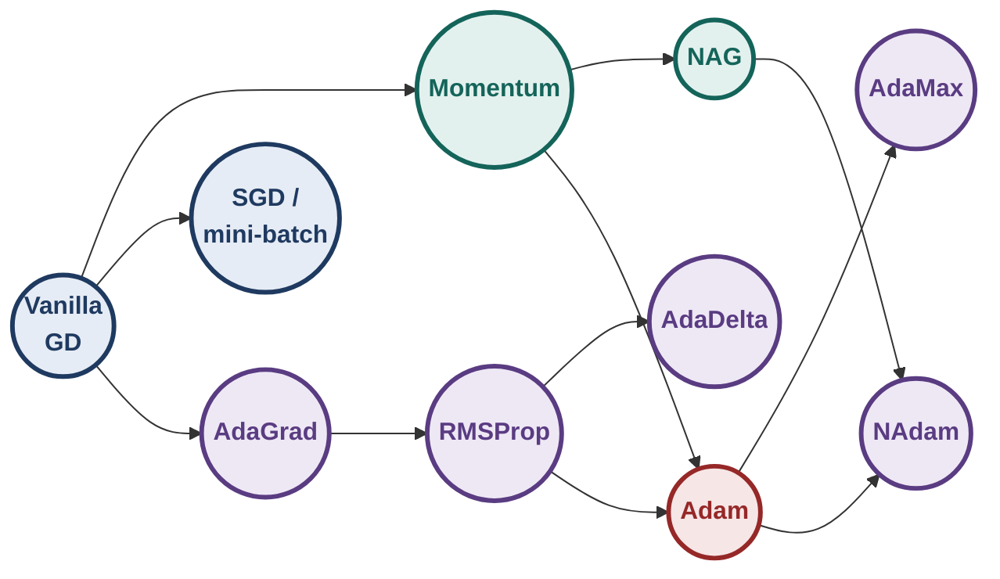
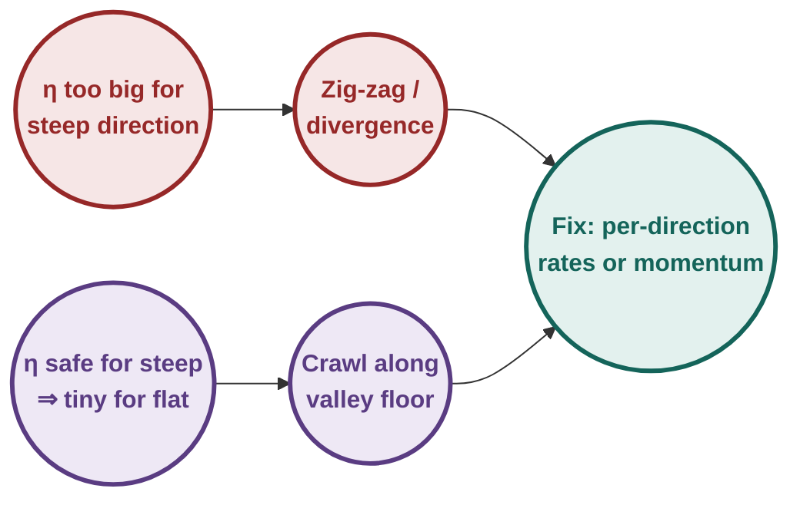
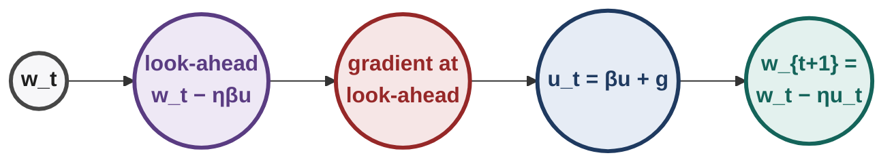
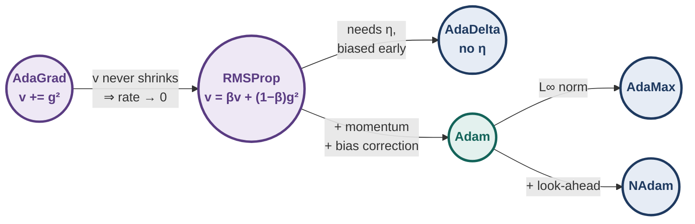
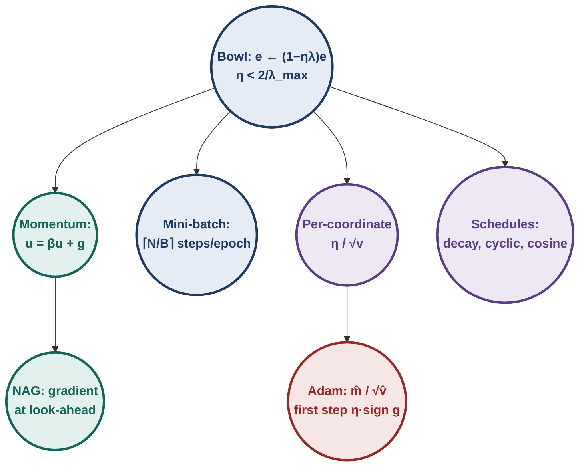

# Deep Learning : Illustrated Notes for Week 4

## Contents

- **Week 4 — GD variants, momentum, NAG, SGD, adaptive methods, schedules** ✓
  - 4.0 Week-4 map
  - 4.1 GD on a quadratic: exact analysis
  - 4.2 Momentum-based GD
  - 4.3 Nesterov accelerated gradient
  - 4.4 Stochastic and mini-batch GD
  - 4.5 Adaptive learning rates (AdaGrad, RMSProp, AdaDelta, Adam, AdaMax, NAdam)
  - 4.6 Learning-rate schedules
  - 4.7 Comparison of all optimisers
  - 4.8 Week-4 exam toolkit & practice set

---

## 4.0 Week-4 map

**[Intuition]** Backprop (Week 3) tells us the gradient. Week 4 is about **what to do with it**. Plain gradient descent has three weaknesses, and each family of methods fixes one:

| Weakness of plain GD | Fix |
|---|---|
| crawls on gentle slopes and plateaus | **momentum**, **NAG** (use gradient history) |
| one exact gradient needs the whole dataset | **stochastic / mini-batch GD** |
| one learning rate for all directions | **adaptive** methods (AdaGrad, RMSProp, AdaDelta, Adam, …) and **schedules** |

---

## 4.1 Gradient descent on a quadratic: an exact analysis

### 4.1.1 One dimension

Near any minimum $w^*$ a smooth loss looks like a bowl: $\mathcal L(w)\approx\tfrac\lambda2(w-w^*)^2$, where $\lambda$ is the **curvature**. Then $\mathcal L'(w)=\lambda(w-w^*)$, and for the error $e_t=w_t-w^*$:

$$e_{t+1}=e_t-\eta\lambda e_t=(1-\eta\lambda)\,e_t\quad\Longrightarrow\quad e_t=(1-\eta\lambda)^t e_0.$$

Everything depends on the **iteration factor** $r=1-\eta\lambda$:

| Range of $\eta$ | $r$ | Behaviour |
|---|---|---|
| $0<\eta<1/\lambda$ | $0<r<1$ | monotone convergence |
| $\eta=1/\lambda$ | $0$ | exact minimum in one step |
| $1/\lambda<\eta<2/\lambda$ | $-1<r<0$ | oscillating convergence |
| $\eta=2/\lambda$ | $-1$ | bounces forever |
| $\eta>2/\lambda$ | $r<-1$ | oscillating **divergence** |

**Rule:** GD on a bowl of curvature $\lambda$ converges iff $0<\eta<2/\lambda$. For $\mathcal L=cw^2$, $\lambda=2c$.

### 4.1.2 Several dimensions: ill-conditioning

For $\mathcal L=\tfrac12\sum_i\lambda_i w_i^2$, each coordinate has its own factor $1-\eta\lambda_i$.

- One $\eta$ must satisfy $\eta<2/\lambda_{\max}$ (the **steepest** direction).
- Then the **flattest** direction crawls with factor $1-\eta\lambda_{\min}\approx1$.
- Result: **zig-zag** across the steep walls while inching along the valley floor.

**[Ex]** *End-term.* $f(x,y)=\tfrac12(25x^2+y^2)$ from $(1,1)$, $\eta=0.1$.

- $\nabla f=(25x,\ y)=(25,1)$.
- $x_1=1-2.5=-1.5$, $y_1=1-0.1=0.9$, so $x_1+y_1=\mathbf{-0.6}$.
- Factors: $r_x=1-0.1(25)=-1.5$ (**diverges**: $1,-1.5,2.25,-3.375,\dots$); $r_y=0.9$ (converges).
- Largest safe rate: $\eta<2/25=0.08$. Even at $\eta=0.07$, $y$ still shrinks only by 0.93 per step.

---

## 4.2 Momentum-based gradient descent

### 4.2.1 Idea

A ball rolling downhill **accumulates velocity**; it does not crawl on gentle slopes. Momentum keeps a running history of gradients and moves along it.

$$\mathbf u_t=\beta\,\mathbf u_{t-1}+\nabla\mathbf w_t,\qquad \mathbf w_{t+1}=\mathbf w_t-\eta\,\mathbf u_t,\qquad \mathbf u_{-1}=\mathbf 0,\ 0\le\beta<1.$$

(Equivalent textbook form: $\text{update}_t=\gamma\,\text{update}_{t-1}+\eta\nabla\mathbf w_t$, $\mathbf w_{t+1}=\mathbf w_t-\text{update}_t$.)

### 4.2.2 [Derivation] What $\mathbf u_t$ really is

Unroll the recursion:
$$\mathbf u_t=\nabla\mathbf w_t+\beta\nabla\mathbf w_{t-1}+\beta^2\nabla\mathbf w_{t-2}+\cdots=\sum_{\tau=0}^{t}\beta^{\,t-\tau}\nabla\mathbf w_\tau.$$

- An **exponentially weighted sum** of all past gradients; recent ones count most.
- **Constant gradient $\mathbf g$:** $\mathbf u_t\to\mathbf g/(1-\beta)$. With $\beta=0.9$ steps become **10× larger** on consistent slopes.
- **Alternating gradients** (zig-zag directions) partly cancel. Momentum is a **low-pass filter** on the gradient.

### 4.2.3 [Ex] Momentum overshoots

$\mathcal L=w^2$ (gradient $2w$), $w_0=1$, $\eta=0.1$, $\beta=0.9$.

| $t$ | $\nabla w_t$ | $u_t$ | $w_{t+1}$ (momentum) | $w_{t+1}$ (vanilla, $\times0.8$) |
|---|---|---|---|---|
| 0 | 2.000 | 2.000 | 0.800 | 0.800 |
| 1 | 1.600 | 3.400 | 0.460 | 0.640 |
| 2 | 0.920 | 3.980 | 0.062 | 0.512 |
| 3 | 0.124 | 3.706 | **−0.309** | 0.410 |

**[Intuition]** Momentum reaches the neighbourhood of 0 in 3 steps where vanilla GD is still at 0.51. But it arrives with large velocity and **overshoots**, then oscillates before settling: fast, with "U-turns".

### 4.2.4 Why momentum oscillates (heavy-ball equation)

On $\tfrac\lambda2(w-w^*)^2$, eliminating $u$ gives
$$e_{t+1}=(1+\beta-\eta\lambda)\,e_t-\beta\,e_{t-1}.$$
Solutions behave like $r^t$ with $r^2-(1+\beta-\eta\lambda)r+\beta=0$. If the roots are complex, $\lvert r\rvert=\sqrt\beta$: a **damped oscillation decaying like $\sqrt\beta^{\,t}$**. Larger $\beta$ means longer ringing.

**[Ex]** *Quiz 1: match curves to $\beta$.* $\mathcal L=(w-5)^2$, $w_0=-5$, $\eta=0.04$, so $\eta\lambda=0.08$.

| $\beta$ | roots | $\lvert r\rvert$ | Curve |
|---|---|---|---|
| 0 | 0.92 | 0.92 | **S**: smooth, monotone |
| 0.5 | 0.774, 0.646 (real) | 0.774 | **T**: fastest, no oscillation |
| 0.9 | complex | 0.949 | **U**: damped oscillation |
| 0.99 | complex | 0.995 | **V**: oscillates 140+ steps |

**Fast exam reasoning:** $\beta=0$ is plain GD ⇒ no oscillation; more momentum ⇒ more overshoot and longer ringing.

---

## 4.3 Nesterov Accelerated Gradient (NAG)

### 4.3.1 Idea: look before you leap

Momentum computes the gradient at the current point, **then** adds the large history step. By the time it notices the slope has reversed, it is already past the minimum. NAG takes the history step **tentatively**, measures the gradient **there**, and corrects:

$$\mathbf w_{\text{look}}=\mathbf w_t-\eta\beta\,\mathbf u_{t-1},\qquad \mathbf u_t=\beta\,\mathbf u_{t-1}+\nabla\mathcal L(\mathbf w_{\text{look}}),\qquad \mathbf w_{t+1}=\mathbf w_t-\eta\,\mathbf u_t.$$

### 4.3.2 [Ex] NAG on the same bowl

$\mathcal L=w^2$, $w_0=1$, $\eta=0.1$, $\beta=0.9$:

| $t$ | $w_{\text{look}}=w_t-0.09u_{t-1}$ | gradient at look | $u_t$ | $w_{t+1}$ |
|---|---|---|---|---|
| 0 | 1.000 | 2.000 | 2.000 | 0.800 |
| 1 | 0.620 | 1.240 | 3.040 | 0.496 |
| 2 | 0.222 | 0.445 | 3.181 | 0.178 |
| 3 | −0.108 | −0.217 | 2.646 | **−0.087** |

**[Intuition]** At $t=3$ the look-ahead point is already past 0, so NAG sees a **negative** gradient and brakes ($u$ falls from 3.18 to 2.65). Overshoot: **−0.087** vs momentum's −0.309. Smaller U-turns, faster settling.

**[!]** The look-ahead uses $\eta\beta\mathbf u_{t-1}$, not $\eta\mathbf u_{t-1}$.

---

## 4.4 Stochastic and mini-batch gradient descent

### 4.4.1 The cost problem

The true gradient is a sum over all $N$ examples: $\nabla\mathcal L=\sum_i\nabla\mathcal L_i$. One exact step = one full pass over the data.

| Method | Examples per update | Updates per epoch | Gradient quality |
|---|---|---|---|
| Batch (vanilla) GD | $N$ | 1 | exact |
| Mini-batch GD | $B$ | $\lceil N/B\rceil$ | noisy, variance $\propto1/B$ |
| Stochastic GD | 1 | $N$ | very noisy |

- **Epoch** = one pass over the entire data. **Step** = one parameter update.
- The mini-batch gradient is an **unbiased estimate** of the true gradient. If per-example gradients have variance $s^2$, the average of $B$ has variance $s^2/B$.

### 4.4.2 [Ex] Counting updates

| Data | Answer |
|---|---|
| $N=100{,}000$, vanilla GD | **1** per epoch |
| same, $B=50$ | $100000/50=$ **2000** |
| $N=1000$, $B=64$ | $\lceil15.625\rceil=$ **16** (last batch has 40) |
| $N=50{,}000$, $B=128$, 3 epochs | $\lceil390.6\rceil\times3=$ **1173** |

**[!]** Never round down; SGD's count equals $N$.

### 4.4.3 Batch size trade-off

**[Ex]** *End-term:* batch 32 → 128, same data and $\eta$.

| Statement | Verdict |
|---|---|
| lower-variance gradient estimate, fewer updates per epoch | ✓ |
| higher variance | ✗ |
| updates per epoch increase 4× | ✗ (they decrease 4×) |
| guarantees a better minimum | ✗ |

**[Ex]** *Quiz 1 (multi-select).*

| Statement | Verdict |
|---|---|
| SGD ($B=1$) computes the true gradient each step | ✗ (one example only) |
| Mini-batch: one epoch = $\lceil N/B\rceil$ updates | ✓ |
| Momentum can overshoot a narrow valley | ✓ |
| Batch GD decreases the loss each step for small enough $\eta$ on a smooth loss | ✓ |

**[Intuition]** The noise of small batches is not all bad: it can shake parameters out of shallow minima and saddle regions. But a single stochastic step is **not** guaranteed to reduce the total loss. Momentum and NAG work with mini-batches unchanged, and their averaging also smooths the noise.

### 4.4.4 Choosing $\eta$ in practice

- **Log-scale search:** try $10^{-4},10^{-3},10^{-2},10^{-1}$ for a few epochs; keep the fastest one that does not blow up; refine around it.
- **Line search:** at each step try several $\eta$ along $-\nabla\mathcal L$ and keep the best. More evaluations per step, but a safe, large move.

---

## 4.5 Adaptive learning rates

**[Intuition]** Give **each parameter its own effective learning rate**, computed from the history of **its own** gradients. Steep directions get small steps; flat or rarely-updated ones get larger steps.

### 4.5.1 AdaGrad

**Motivation:** a **sparse** feature (non-zero in few examples) rarely gets a gradient, so under a global $\eta$ it barely learns. **Rule:** decay each parameter's rate in proportion to how much it has already been updated.

$$v_t=v_{t-1}+(\nabla w_t)^2,\qquad w_{t+1}=w_t-\frac{\eta}{\sqrt{v_t+\epsilon}}\,\nabla w_t.$$

**[Ex]** *End-term.* $f=\tfrac12(25x^2+y^2)$, $(1,1)$, $\eta=0.1$, $\epsilon=10^{-8}$.

- First gradient $(25,1)$ ⇒ $v_x=625$, $v_y=1$.
- Effective rates: $\eta_x=0.1/25=0.004$, $\eta_y=0.1/1=0.1$; sum $=\mathbf{0.104}$.
- The rate along $x$ is **reduced 25 times** (the course's correct option); $y$ is unchanged.
- Trajectory: $(0.9,0.9)\to(0.833,0.833)\to(0.780,0.780)$. No divergence, and both coordinates move **identically**.

**[Intuition]** Dividing by the root of the accumulated squares makes AdaGrad **invariant to per-coordinate scaling**: a coordinate 25× steeper gets a 25× smaller rate. Shortcut: the first AdaGrad step is $\eta\,\text{sign}(g)$ in every coordinate.

**[!] Flaw:** $v_t$ only grows. For dense features the rate decays like $1/\sqrt t$ toward 0 and learning can stall.

### 4.5.2 RMSProp

**Fix:** replace the sum by an **exponentially decaying average**, so old gradients are forgotten.

$$v_t=\beta v_{t-1}+(1-\beta)(\nabla w_t)^2,\qquad w_{t+1}=w_t-\frac{\eta}{\sqrt{v_t+\epsilon}}\,\nabla w_t.$$

The effective rate can now go **down or up**.

**[Ex]** *Oversized first step.* $\beta=0.9$: $v_1=0.1g^2$, so the step is $\eta/\sqrt{0.1}\approx3.16\eta$ (in sign direction). On the bowl from $(1,1)$ with $\eta=0.1$: $0.684\to0.499\to0.369$ (both coordinates). Because $v$ starts at 0, early estimates of $\mathbb E[g^2]$ are biased **low**, inflating early steps.

**[Ex]** *Quiz 2: a gradient that stops.* $\beta=0.9$, $\eta_0=0.01$, $\epsilon=0$, gradients $10,0,0$.

| | iteration 1 | iteration 2 | iteration 3 |
|---|---|---|---|
| RMSProp $v_t$ | 10 | 9 | 8.1 |
| RMSProp rate $\eta_0/\sqrt{v_t}$ | 0.00316 | 0.00333 | **0.0035** |
| AdaGrad $v_t$ | 100 | 100 | 100 |
| AdaGrad rate | 0.001 | 0.001 | **0.001 (constant)** |

When gradients stop, RMSProp **forgets** and its rate **rises**; AdaGrad's rate never rises.

### 4.5.3 AdaDelta

RMSProp still needs a hand-tuned $\eta$. AdaDelta replaces $\eta$ with a running average of past **updates**:

$$v_t=\beta v_{t-1}+(1-\beta)(\nabla w_t)^2,\qquad \Delta w_t=-\frac{\sqrt{u_{t-1}+\epsilon}}{\sqrt{v_t+\epsilon}}\,\nabla w_t,$$
$$w_{t+1}=w_t+\Delta w_t,\qquad u_t=\beta u_{t-1}+(1-\beta)(\Delta w_t)^2.$$

- **No learning rate** to choose.
- First step (with $u_{-1}=0$): $\lvert\Delta w\rvert\approx\sqrt\epsilon/\sqrt{1-\beta}$; with $\epsilon=10^{-6}$, $\beta=0.9$ that is about **0.0032**. It starts cautiously and grows its steps as update history builds.
- If gradients shrink while past updates were large, $\sqrt u/\sqrt v$ grows: the rate adapts **upward**.

### 4.5.4 Adam (Adaptive Moments)

Momentum (first moment) + RMSProp (second moment) + **bias correction**:

$$m_t=\beta_1m_{t-1}+(1-\beta_1)\nabla w_t,\qquad v_t=\beta_2v_{t-1}+(1-\beta_2)(\nabla w_t)^2,$$
$$\hat m_t=\frac{m_t}{1-\beta_1^{\,t}},\qquad \hat v_t=\frac{v_t}{1-\beta_2^{\,t}},\qquad w_{t+1}=w_t-\frac{\eta}{\sqrt{\hat v_t}+\epsilon}\,\hat m_t,$$

with typical $\beta_1=0.9$, $\beta_2=0.999$, and $t=1,2,\dots$ (starting at 1).

**[Derivation] Why bias correction?** Unroll: $m_t=(1-\beta_1)\sum_{\tau=1}^t\beta_1^{\,t-\tau}g_\tau$. If the gradients have a steady mean $\mathbb E[g]$:
$$\mathbb E[m_t]=\mathbb E[g](1-\beta_1)\frac{1-\beta_1^{\,t}}{1-\beta_1}=(1-\beta_1^{\,t})\,\mathbb E[g].$$
So $m_t$ underestimates by exactly $1-\beta_1^t$; dividing fixes it. Same for $v_t$ with $\beta_2$. It matters most early: at $t=1$ with $\beta_2=0.999$ the factor is 0.001.

**[Ex]** $\mathcal L=w^2$, $w_0=1$, $\eta=0.1$, defaults, $\epsilon\approx0$.

| $t$ | $g$ | $m_t$ | $v_t$ | $\hat m_t$ | $\hat v_t$ | step | $w_t$ |
|---|---|---|---|---|---|---|---|
| 1 | 2.0 | 0.2 | 0.004 | 2.000 | 4.000 | 0.1000 | **0.9000** |
| 2 | 1.8 | 0.36 | 0.007236 | 1.895 | 3.620 | 0.0996 | **0.8004** |

- **Without** correction the first step would be $0.1\cdot0.2/\sqrt{0.004}=0.316$: over 3× too large.
- **With** correction the first step is exactly $\eta\,\text{sign}(g)$. Adam's step is roughly $\eta$ regardless of gradient scale. On the bowl: $(1,1)\to(0.9,0.9)\to(0.800,0.800)\to(0.702,0.702)$.

### 4.5.5 AdaMax and NAdam

**AdaMax:** replace Adam's $L^2$-type $\sqrt{v_t}$ with the $L^\infty$ norm (a max):
$$v_t=\max\big(\beta_2v_{t-1},\ \lvert\nabla w_t\rvert\big),\qquad w_{t+1}=w_t-\frac{\eta}{v_t+\epsilon}\,\hat m_t.$$
- No bias correction for $v$: a max is not dragged toward the zero start.
- Robust when a gradient goes to zero for a while (sparse inputs).
- On $w^2$ (same settings): $w_1=0.9$, $w_2=0.805$.

**NAdam:** Adam + Nesterov look-ahead. Blend the corrected momentum with the current bias-corrected gradient:
$$w_{t+1}=w_t-\frac{\eta}{\sqrt{\hat v_t}+\epsilon}\left(\beta_1\hat m_t+\frac{(1-\beta_1)\nabla w_t}{1-\beta_1^{\,t}}\right).$$
(Course notes index the correction terms slightly differently; what is tested is the idea: **Adam + NAG**.)

**[Ex]** *Quiz 2 (multi-select) on adaptive optimisers.*

| Statement | Verdict | Why |
|---|---|---|
| AdaGrad's rate decays slowly for **sparse** features | ✓ | their $v$ grows rarely |
| AdaGrad's rate decays slowly for **dense** features | ✗ | dense features accumulate fastest |
| RMSProp's rate is guaranteed non-increasing | ✗ | it rises when gradients shrink |
| AdaDelta is sensitive to the initial rate $\eta_0$ | ✗ | it has no $\eta_0$ |
| Adam's $v_t$ is $L^2$-based; AdaMax uses $L^\infty$ | ✓ | definition |

---

## 4.6 Learning-rate schedules

Adaptive methods tune rates **per parameter**; schedules tune the global $\eta$ **over time**.

| Schedule | Formula | Example ($\eta_0=0.1$) |
|---|---|---|
| Step decay | halve every $k$ epochs | $k=10$, epoch 25 ⇒ $0.1\cdot0.5^2=0.025$ |
| Exponential | $\eta_t=\eta_0e^{-kt}$ | $k=0.1$, $t=10$ ⇒ $0.0368$ |
| $1/t$ decay | $\eta_t=\eta_0/(1+kt)$ | $k=0.1$, $t=10$ ⇒ $0.05$ |
| Warm-up | start small, increase linearly for $k$ steps | tames large early gradients |

### 4.6.1 Cyclical (triangular)

$\eta$ rises linearly from $\eta_{\min}$ to $\eta_{\max}$ over $\mu$ steps, then falls back over $\mu$ steps (period $2\mu$):
$$\eta_t=\eta_{\min}+(\eta_{\max}-\eta_{\min})\max\Big(0,\ 1-\Big|\tfrac t\mu-2\big\lfloor1+\tfrac{t}{2\mu}\big\rfloor+1\Big|\Big).$$

**[Ex]** $\mu=10$, range $[0.001,0.01]$: $t=5\Rightarrow0.0055$; $t=10\Rightarrow0.01$ (peak); $t=20\Rightarrow0.001$ (trough).

**[Ex]** *Quiz 2.* $\eta_{\min}=0.001$, $\eta_{\max}=0.1$, $\mu=500$. When is $\eta_t=\eta_{\min}$?

- $t=0$: $\lfloor1\rfloor=1$, $\lvert0-2+1\rvert=1$ ⇒ minimum.
- $t=500$: $\lfloor1.5\rfloor=1$, $\lvert1-2+1\rvert=0$ ⇒ maximum.
- $t=1000$: $\lfloor2\rfloor=2$, $\lvert2-4+1\rvert=1$ ⇒ minimum.

Minima at $t\in\{0,1000,2000,\dots\}$. **Trick:** $\mu$ is the **half**-cycle; test $t=0$ and $t=\mu$ to orient yourself.

### 4.6.2 Cosine annealing with warm restarts

$$\eta_t=\eta_{\min}+\frac{\eta_{\max}-\eta_{\min}}{2}\Big(1+\cos\frac{\pi\,(t\bmod(T+1))}{T}\Big).$$

**[Ex]** $\eta_{\max}=0.1$, $\eta_{\min}=0.001$, $T=50$: $t=0\Rightarrow0.1$; $t=25\Rightarrow0.0505$; $t=50\Rightarrow0.001$; $t=51\Rightarrow0.1$ (**restart**).

**[Intuition]** Why raise the rate again? Much of training difficulty comes from **saddle points** and plateaus (gradient ≈ 0, not a minimum). With an ever-decreasing rate, by the time the parameters reach a saddle the rate is too small to escape. Periodic increases give the needed **kick**.

---

## 4.7 Comparison of all optimisers

| Method | Key idea | Fixes | Weakness |
|---|---|---|---|
| GD / SGD | $-\eta\nabla$ | — | one rate for all; noisy (SGD) |
| Momentum | EMA of gradients | plateaus, zig-zag | overshoot |
| NAG | gradient at look-ahead | overshoot | still one global rate |
| AdaGrad | divide by $\sqrt{\sum g^2}$ | sparse features, scaling | rate decays to 0 |
| RMSProp | divide by $\sqrt{\text{EMA}(g^2)}$ | AdaGrad's decay | needs $\eta$; biased early |
| AdaDelta | update-EMA / gradient-EMA | removes $\eta$ | slow start |
| Adam | momentum + RMSProp + correction | all of the above | can still overshoot |
| AdaMax | $L^\infty$ denominator | zero-gradient stretches | niche |
| NAdam | Adam + NAG | overshoot | slightly more complex |

---

## 4.8 Week-4 exam toolkit & practice set

**Diagram — Week 4 at a glance**

### 4.8.1 Recognition rules

| See | Think |
|---|---|
| quadratic loss + given $\eta$ | factor $1-\eta\lambda_i$ per coordinate; $\lvert\cdot\rvert>1$ diverges |
| "which coordinate diverges" | the one with the largest curvature |
| "match curves to $\beta$" | more ringing = larger $\beta$; none = $\beta=0$ |
| "updates per epoch" | batch 1, SGD $N$, mini-batch $\lceil N/B\rceil$ |
| "larger batch" | lower variance, fewer updates, no better-minimum guarantee |
| NAG | gradient at $\mathbf w_t-\eta\beta\mathbf u_{t-1}$ |
| AdaGrad first step | effective rate $\eta/\lvert g_1\rvert$; reduced by $\sqrt{v}$ |
| "rate only decreases" | AdaGrad; "can increase" ⇒ RMSProp / AdaDelta |
| "no learning rate" | AdaDelta; "max / $L^\infty$" ⇒ AdaMax |
| Adam first step | $\eta\,\text{sign}(g)$ (with correction) |
| stuck at a saddle with decaying $\eta$ | cyclical / cosine restarts |

### 4.8.2 Formula sheet

| Formula | Method |
|---|---|
| $e_{t+1}=(1-\eta\lambda)e_t$; $\eta<2/\lambda$ | GD on a bowl |
| $\mathbf u_t=\beta\mathbf u_{t-1}+\nabla\mathbf w_t$, $\mathbf w\leftarrow\mathbf w-\eta\mathbf u_t$ | momentum |
| gradient at $\mathbf w_t-\eta\beta\mathbf u_{t-1}$ | NAG |
| $v\mathrel{+}=g^2$, step $\eta g/\sqrt{v+\epsilon}$ | AdaGrad |
| $v=\beta v+(1-\beta)g^2$ | RMSProp |
| $\Delta w=-\frac{\sqrt{u_{t-1}+\epsilon}}{\sqrt{v_t+\epsilon}}g$ | AdaDelta |
| $\hat m=\frac m{1-\beta_1^t}$, $\hat v=\frac v{1-\beta_2^t}$, step $\frac{\eta\hat m}{\sqrt{\hat v}+\epsilon}$ | Adam |
| $v=\max(\beta_2v,\lvert g\rvert)$ | AdaMax |
| $\eta_{\min}+\frac{\eta_{\max}-\eta_{\min}}2(1+\cos\frac{\pi(t\bmod(T+1))}{T})$ | cosine restarts |

### 4.8.3 Practice set

1. $\mathcal L=(w-3)^2$, $w_0=0$, $\eta=0.25$. Find $w_1,w_2$.
2. $f=\tfrac12(4x^2+y^2)$ from $(1,1)$, $\eta=0.4$: which coordinate oscillates? Does it converge?
3. $N=50{,}000$, $B=128$: updates in one epoch?
4. Show that with a constant gradient $g$, momentum's velocity approaches $g/(1-\beta)$.
5. AdaGrad with gradients 3 then 4, $\eta=1$: effective rates at steps 1 and 2?
6. RMSProp with $\beta=0.99$: how many times larger than $\eta$ is the first step?
7. Adam with $\beta_1=0.9$: bias-correction divisor for $m$ at $t=3$?
8. Cosine annealing, $\eta_{\max}=0.2$, $\eta_{\min}=0$, $T=100$: $\eta$ at $t=25$ and $t=101$?
9. For $\eta\lambda=0.08$, for which $\beta$ does momentum **not** oscillate?
10. Creative: your training loss falls quickly, then the curve becomes jagged and flat. Name two changes from this week that could help, and why.

### 4.8.4 Answers

1. Error factor $1-0.5=0.5$: $w_1=1.5$, $w_2=2.25$.
2. $r_x=1-1.6=-0.6$: oscillates but converges; $r_y=0.6$.
3. $\lceil390.625\rceil=391$.
4. Fixed point of $u=\beta u+g$ gives $u(1-\beta)=g$.
5. $1/3$ and $1/\sqrt{9+16}=1/5$.
6. $1/\sqrt{0.01}=10$.
7. $1-0.9^3=0.271$.
8. $0.1(1+\cos\tfrac\pi4)=0.1707$; $t=101$ restarts at $0.2$.
9. Real roots need $(0.92+\beta)^2\ge4\beta$, i.e. $\beta\le0.514$.
10. For example: a **decaying or cosine schedule** (smaller steps reduce the jitter near the minimum), a **larger batch** (lower-variance gradients), or **momentum/Adam** (average out noise). Restarts help if the flat region is a saddle.
